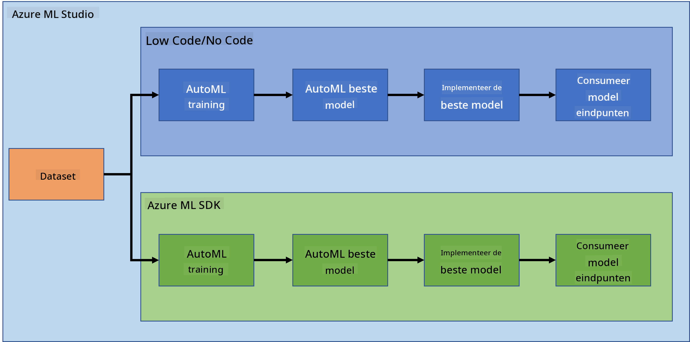
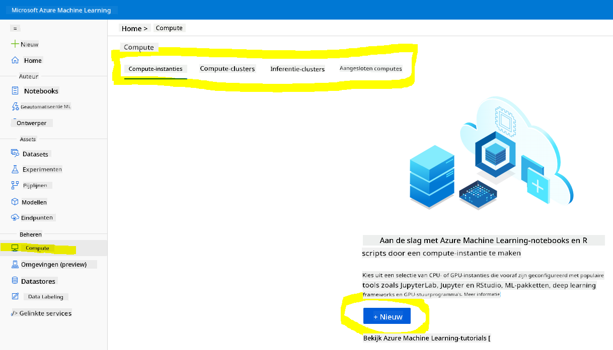
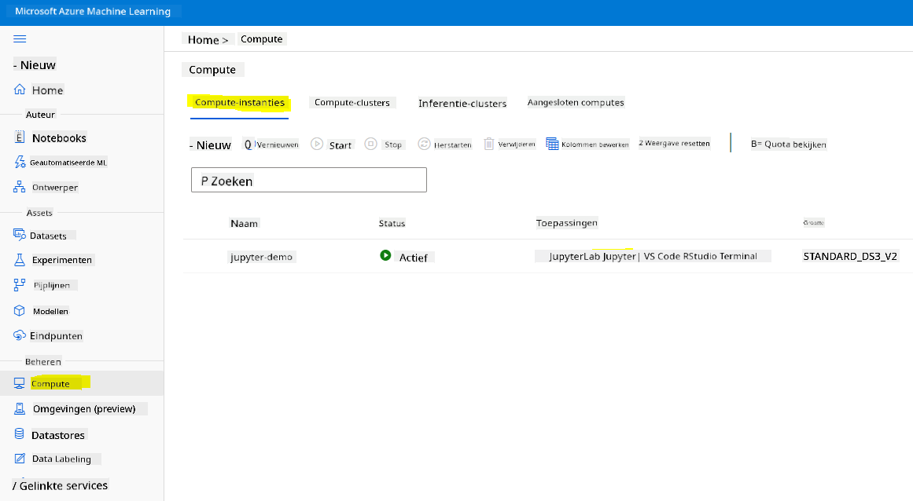
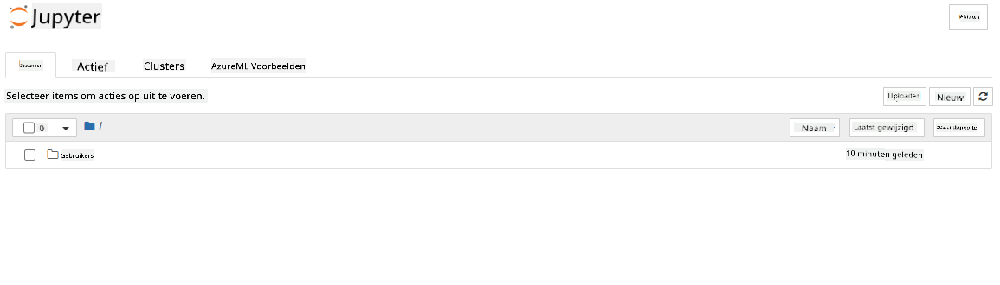

<!--
CO_OP_TRANSLATOR_METADATA:
{
  "original_hash": "73dead89dc2ddda4d6ec0232814a191e",
  "translation_date": "2025-08-28T15:10:32+00:00",
  "source_file": "5-Data-Science-In-Cloud/19-Azure/README.md",
  "language_code": "nl"
}
-->
# Datawetenschap in de Cloud: De "Azure ML SDK"-aanpak

| ](../../sketchnotes/19-DataScience-Cloud.png)|
|:---:|
| Datawetenschap in de Cloud: Azure ML SDK - _Sketchnote door [@nitya](https://twitter.com/nitya)_ |

Inhoudsopgave:

- [Datawetenschap in de Cloud: De "Azure ML SDK"-aanpak](../../../../5-Data-Science-In-Cloud/19-Azure)
  - [Quiz voorafgaand aan de les](../../../../5-Data-Science-In-Cloud/19-Azure)
  - [1. Introductie](../../../../5-Data-Science-In-Cloud/19-Azure)
    - [1.1 Wat is Azure ML SDK?](../../../../5-Data-Science-In-Cloud/19-Azure)
    - [1.2 Introductie van het project en dataset voor hartfalenvoorspelling](../../../../5-Data-Science-In-Cloud/19-Azure)
  - [2. Een model trainen met de Azure ML SDK](../../../../5-Data-Science-In-Cloud/19-Azure)
    - [2.1 Een Azure ML-werkruimte maken](../../../../5-Data-Science-In-Cloud/19-Azure)
    - [2.2 Een compute-instantie maken](../../../../5-Data-Science-In-Cloud/19-Azure)
    - [2.3 De dataset laden](../../../../5-Data-Science-In-Cloud/19-Azure)
    - [2.4 Notebooks maken](../../../../5-Data-Science-In-Cloud/19-Azure)
    - [2.5 Een model trainen](../../../../5-Data-Science-In-Cloud/19-Azure)
      - [2.5.1 Werkruimte, experiment, compute-cluster en dataset instellen](../../../../5-Data-Science-In-Cloud/19-Azure)
      - [2.5.2 AutoML-configuratie en training](../../../../5-Data-Science-In-Cloud/19-Azure)
  - [3. Modelimplementatie en gebruik van endpoints met de Azure ML SDK](../../../../5-Data-Science-In-Cloud/19-Azure)
    - [3.1 Het beste model opslaan](../../../../5-Data-Science-In-Cloud/19-Azure)
    - [3.2 Modelimplementatie](../../../../5-Data-Science-In-Cloud/19-Azure)
    - [3.3 Gebruik van endpoints](../../../../5-Data-Science-In-Cloud/19-Azure)
  - [🚀 Uitdaging](../../../../5-Data-Science-In-Cloud/19-Azure)
  - [Quiz na de les](../../../../5-Data-Science-In-Cloud/19-Azure)
  - [Review & Zelfstudie](../../../../5-Data-Science-In-Cloud/19-Azure)
  - [Opdracht](../../../../5-Data-Science-In-Cloud/19-Azure)

## [Quiz voorafgaand aan de les](https://purple-hill-04aebfb03.1.azurestaticapps.net/quiz/36)

## 1. Introductie

### 1.1 Wat is Azure ML SDK?

Datawetenschappers en AI-ontwikkelaars gebruiken de Azure Machine Learning SDK om machine learning-workflows te bouwen en uit te voeren met de Azure Machine Learning-service. Je kunt met de service werken in elke Python-omgeving, zoals Jupyter Notebooks, Visual Studio Code of je favoriete Python IDE.

Belangrijke functies van de SDK zijn:

- Verkennen, voorbereiden en beheren van de levenscyclus van datasets die worden gebruikt in machine learning-experimenten.
- Beheren van cloudresources voor monitoring, logging en het organiseren van je machine learning-experimenten.
- Modellen trainen, lokaal of met behulp van cloudresources, inclusief GPU-versnelde modeltraining.
- Gebruik maken van geautomatiseerde machine learning, waarbij configuratieparameters en trainingsdata worden geaccepteerd. Het doorloopt automatisch algoritmen en hyperparameterinstellingen om het beste model te vinden voor voorspellingen.
- Webservices implementeren om je getrainde modellen om te zetten in RESTful services die in elke applicatie kunnen worden gebruikt.

[Meer informatie over de Azure Machine Learning SDK](https://docs.microsoft.com/python/api/overview/azure/ml?WT.mc_id=academic-77958-bethanycheum&ocid=AID3041109)

In de [vorige les](../18-Low-Code/README.md) hebben we gezien hoe je een model kunt trainen, implementeren en gebruiken op een Low code/No code-manier. We gebruikten de dataset voor hartfalen om een voorspellingsmodel voor hartfalen te genereren. In deze les gaan we precies hetzelfde doen, maar dan met behulp van de Azure Machine Learning SDK.



### 1.2 Introductie van het project en dataset voor hartfalenvoorspelling

Bekijk [hier](../18-Low-Code/README.md) de introductie van het project en de dataset voor hartfalenvoorspelling.

## 2. Een model trainen met de Azure ML SDK
### 2.1 Een Azure ML-werkruimte maken

Voor de eenvoud gaan we werken in een Jupyter Notebook. Dit betekent dat je al een werkruimte en een compute-instantie hebt. Als je al een werkruimte hebt, kun je direct doorgaan naar sectie 2.3 Notebook maken.

Zo niet, volg dan de instructies in de sectie **2.1 Een Azure ML-werkruimte maken** in de [vorige les](../18-Low-Code/README.md) om een werkruimte te maken.

### 2.2 Een compute-instantie maken

Ga in de [Azure ML-werkruimte](https://ml.azure.com/) die we eerder hebben gemaakt naar het compute-menu en je ziet de verschillende beschikbare compute-resources.



Laten we een compute-instantie maken om een Jupyter Notebook te voorzien. 
1. Klik op de knop + Nieuw. 
2. Geef een naam aan je compute-instantie.
3. Kies je opties: CPU of GPU, VM-grootte en aantal cores.
4. Klik op de knop Maken.

Gefeliciteerd, je hebt zojuist een compute-instantie gemaakt! We zullen deze compute-instantie gebruiken om een Notebook te maken in de sectie [Notebooks maken](../../../../5-Data-Science-In-Cloud/19-Azure).

### 2.3 De dataset laden
Raadpleeg de [vorige les](../18-Low-Code/README.md) in de sectie **2.3 De dataset laden** als je de dataset nog niet hebt geüpload.

### 2.4 Notebooks maken

> **_OPMERKING:_** Voor de volgende stap kun je een nieuw notebook helemaal opnieuw maken, of je kunt het [notebook dat we hebben gemaakt](notebook.ipynb) uploaden in je Azure ML Studio. Om het te uploaden, klik je gewoon op het "Notebook"-menu en upload je het notebook.

Notebooks zijn een heel belangrijk onderdeel van het datawetenschapsproces. Ze kunnen worden gebruikt om Exploratory Data Analysis (EDA) uit te voeren, een computercluster aan te roepen om een model te trainen, of een inferentiecluster aan te roepen om een endpoint te implementeren. 

Om een Notebook te maken, hebben we een compute-node nodig die de Jupyter Notebook-instantie uitvoert. Ga terug naar de [Azure ML-werkruimte](https://ml.azure.com/) en klik op Compute-instanties. In de lijst met compute-instanties zou je de [compute-instantie die we eerder hebben gemaakt](../../../../5-Data-Science-In-Cloud/19-Azure) moeten zien. 

1. Klik in de sectie Toepassingen op de optie Jupyter. 
2. Vink het vakje "Ja, ik begrijp het" aan en klik op de knop Doorgaan.

3. Dit zou een nieuw browsertabblad moeten openen met je Jupyter Notebook-instantie zoals hieronder. Klik op de knop "Nieuw" om een notebook te maken.



Nu we een Notebook hebben, kunnen we beginnen met het trainen van het model met Azure ML SDK.

### 2.5 Een model trainen

Allereerst, als je ooit twijfelt, raadpleeg dan de [Azure ML SDK-documentatie](https://docs.microsoft.com/python/api/overview/azure/ml?WT.mc_id=academic-77958-bethanycheum&ocid=AID3041109). Het bevat alle benodigde informatie om de modules te begrijpen die we in deze les gaan behandelen.

#### 2.5.1 Werkruimte, experiment, compute-cluster en dataset instellen

Je moet de `werkruimte` laden vanuit het configuratiebestand met de volgende code:

```python
from azureml.core import Workspace
ws = Workspace.from_config()
```

Dit retourneert een object van het type `Workspace` dat de werkruimte vertegenwoordigt. Vervolgens moet je een `experiment` maken met de volgende code:

```python
from azureml.core import Experiment
experiment_name = 'aml-experiment'
experiment = Experiment(ws, experiment_name)
```
Om een experiment op te halen of te maken vanuit een werkruimte, vraag je het experiment op met de naam van het experiment. De naam van het experiment moet 3-36 tekens bevatten, beginnen met een letter of een cijfer, en mag alleen letters, cijfers, underscores en streepjes bevatten. Als het experiment niet wordt gevonden in de werkruimte, wordt er een nieuw experiment gemaakt.

Nu moet je een compute-cluster maken voor de training met de volgende code. Merk op dat deze stap enkele minuten kan duren. 

```python
from azureml.core.compute import AmlCompute

aml_name = "heart-f-cluster"
try:
    aml_compute = AmlCompute(ws, aml_name)
    print('Found existing AML compute context.')
except:
    print('Creating new AML compute context.')
    aml_config = AmlCompute.provisioning_configuration(vm_size = "Standard_D2_v2", min_nodes=1, max_nodes=3)
    aml_compute = AmlCompute.create(ws, name = aml_name, provisioning_configuration = aml_config)
    aml_compute.wait_for_completion(show_output = True)

cts = ws.compute_targets
compute_target = cts[aml_name]
```

Je kunt de dataset ophalen uit de werkruimte met behulp van de datasetnaam op de volgende manier:

```python
dataset = ws.datasets['heart-failure-records']
df = dataset.to_pandas_dataframe()
df.describe()
```
#### 2.5.2 AutoML-configuratie en training

Om de AutoML-configuratie in te stellen, gebruik je de [AutoMLConfig-klasse](https://docs.microsoft.com/python/api/azureml-train-automl-client/azureml.train.automl.automlconfig(class)?WT.mc_id=academic-77958-bethanycheum&ocid=AID3041109).

Zoals beschreven in de documentatie zijn er veel parameters waarmee je kunt spelen. Voor dit project zullen we de volgende parameters gebruiken:

- `experiment_timeout_minutes`: De maximale tijdsduur (in minuten) die het experiment mag duren voordat het automatisch wordt gestopt en de resultaten automatisch beschikbaar worden gemaakt.
- `max_concurrent_iterations`: Het maximale aantal gelijktijdige trainingsiteraties dat is toegestaan voor het experiment.
- `primary_metric`: De primaire metriek die wordt gebruikt om de status van het experiment te bepalen.
- `compute_target`: Het Azure Machine Learning compute-doel waarop het geautomatiseerde machine learning-experiment wordt uitgevoerd.
- `task`: Het type taak dat moet worden uitgevoerd. Waarden kunnen 'classification', 'regression' of 'forecasting' zijn, afhankelijk van het type geautomatiseerd ML-probleem dat moet worden opgelost.
- `training_data`: De trainingsdata die binnen het experiment moeten worden gebruikt. Het moet zowel trainingskenmerken als een labelkolom bevatten (optioneel een kolom met gewichten).
- `label_column_name`: De naam van de labelkolom.
- `path`: Het volledige pad naar de Azure Machine Learning-projectmap.
- `enable_early_stopping`: Of vroegtijdige beëindiging moet worden ingeschakeld als de score op korte termijn niet verbetert.
- `featurization`: Indicator of de featurization-stap automatisch moet worden uitgevoerd of niet, of dat aangepaste featurization moet worden gebruikt.
- `debug_log`: Het logbestand waarin debuginformatie wordt geschreven.

```python
from azureml.train.automl import AutoMLConfig

project_folder = './aml-project'

automl_settings = {
    "experiment_timeout_minutes": 20,
    "max_concurrent_iterations": 3,
    "primary_metric" : 'AUC_weighted'
}

automl_config = AutoMLConfig(compute_target=compute_target,
                             task = "classification",
                             training_data=dataset,
                             label_column_name="DEATH_EVENT",
                             path = project_folder,  
                             enable_early_stopping= True,
                             featurization= 'auto',
                             debug_log = "automl_errors.log",
                             **automl_settings
                            )
```
Nu je configuratie is ingesteld, kun je het model trainen met de volgende code. Deze stap kan tot een uur duren, afhankelijk van de grootte van je cluster.

```python
remote_run = experiment.submit(automl_config)
```
Je kunt de RunDetails-widget uitvoeren om de verschillende experimenten te tonen.
```python
from azureml.widgets import RunDetails
RunDetails(remote_run).show()
```
## 3. Modelimplementatie en gebruik van endpoints met de Azure ML SDK

### 3.1 Het beste model opslaan

De `remote_run` is een object van het type [AutoMLRun](https://docs.microsoft.com/python/api/azureml-train-automl-client/azureml.train.automl.run.automlrun?WT.mc_id=academic-77958-bethanycheum&ocid=AID3041109). Dit object bevat de methode `get_output()` die de beste run en het bijbehorende getrainde model retourneert.

```python
best_run, fitted_model = remote_run.get_output()
```
Je kunt de parameters die voor het beste model zijn gebruikt bekijken door gewoon het fitted_model af te drukken en de eigenschappen van het beste model te zien met de [get_properties()](https://docs.microsoft.com/python/api/azureml-core/azureml.core.run(class)?view=azure-ml-py#azureml_core_Run_get_properties?WT.mc_id=academic-77958-bethanycheum&ocid=AID3041109)-methode.

```python
best_run.get_properties()
```

Registreer nu het model met de [register_model](https://docs.microsoft.com/python/api/azureml-train-automl-client/azureml.train.automl.run.automlrun?view=azure-ml-py#register-model-model-name-none--description-none--tags-none--iteration-none--metric-none-?WT.mc_id=academic-77958-bethanycheum&ocid=AID3041109)-methode.
```python
model_name = best_run.properties['model_name']
script_file_name = 'inference/score.py'
best_run.download_file('outputs/scoring_file_v_1_0_0.py', 'inference/score.py')
description = "aml heart failure project sdk"
model = best_run.register_model(model_name = model_name,
                                model_path = './outputs/',
                                description = description,
                                tags = None)
```
### 3.2 Modelimplementatie

Zodra het beste model is opgeslagen, kunnen we het implementeren met de [InferenceConfig](https://docs.microsoft.com/python/api/azureml-core/azureml.core.model.inferenceconfig?view=azure-ml-py?ocid=AID3041109)-klasse. InferenceConfig vertegenwoordigt de configuratie-instellingen voor een aangepaste omgeving die wordt gebruikt voor implementatie. De [AciWebservice](https://docs.microsoft.com/python/api/azureml-core/azureml.core.webservice.aciwebservice?view=azure-ml-py)-klasse vertegenwoordigt een machine learning-model dat is geïmplementeerd als een webservice-endpoint op Azure Container Instances. Een geïmplementeerde service wordt gemaakt van een model, script en bijbehorende bestanden. De resulterende webservice is een load-balanced HTTP-endpoint met een REST API. Je kunt gegevens naar deze API sturen en de voorspelling ontvangen die door het model wordt geretourneerd.

Het model wordt geïmplementeerd met de [deploy](https://docs.microsoft.com/python/api/azureml-core/azureml.core.model(class)?view=azure-ml-py#deploy-workspace--name--models--inference-config-none--deployment-config-none--deployment-target-none--overwrite-false--show-output-false-?WT.mc_id=academic-77958-bethanycheum&ocid=AID3041109)-methode.

```python
from azureml.core.model import InferenceConfig, Model
from azureml.core.webservice import AciWebservice

inference_config = InferenceConfig(entry_script=script_file_name, environment=best_run.get_environment())

aciconfig = AciWebservice.deploy_configuration(cpu_cores = 1,
                                               memory_gb = 1,
                                               tags = {'type': "automl-heart-failure-prediction"},
                                               description = 'Sample service for AutoML Heart Failure Prediction')

aci_service_name = 'automl-hf-sdk'
aci_service = Model.deploy(ws, aci_service_name, [model], inference_config, aciconfig)
aci_service.wait_for_deployment(True)
print(aci_service.state)
```
Deze stap kan enkele minuten duren.

### 3.3 Gebruik van endpoints

Je gebruikt je endpoint door een voorbeeldinvoer te maken:

```python
data = {
    "data":
    [
        {
            'age': "60",
            'anaemia': "false",
            'creatinine_phosphokinase': "500",
            'diabetes': "false",
            'ejection_fraction': "38",
            'high_blood_pressure': "false",
            'platelets': "260000",
            'serum_creatinine': "1.40",
            'serum_sodium': "137",
            'sex': "false",
            'smoking': "false",
            'time': "130",
        },
    ],
}

test_sample = str.encode(json.dumps(data))
```
En vervolgens kun je deze invoer naar je model sturen voor voorspelling:
```python
response = aci_service.run(input_data=test_sample)
response
```
Dit zou `'{"result": [false]}'` moeten opleveren. Dit betekent dat de patiëntgegevens die we naar de endpoint hebben gestuurd de voorspelling `false` hebben gegenereerd, wat betekent dat deze persoon waarschijnlijk geen hartaanval zal krijgen.

Gefeliciteerd! Je hebt zojuist het model gebruikt dat is gedeployed en getraind op Azure ML met de Azure ML SDK!


> **_NOTE:_** Vergeet niet om alle resources te verwijderen zodra je klaar bent met het project.

## 🚀 Uitdaging

Er zijn veel andere dingen die je kunt doen met de SDK, helaas kunnen we ze niet allemaal in deze les behandelen. Maar goed nieuws, leren hoe je door de SDK-documentatie kunt navigeren kan je een heel eind op weg helpen. Bekijk de Azure ML SDK-documentatie en zoek de `Pipeline`-klasse waarmee je pipelines kunt maken. Een Pipeline is een verzameling stappen die als een workflow kunnen worden uitgevoerd.

**TIP:** Ga naar de [SDK-documentatie](https://docs.microsoft.com/python/api/overview/azure/ml/?view=azure-ml-py?WT.mc_id=academic-77958-bethanycheum&ocid=AID3041109) en typ trefwoorden zoals "Pipeline" in de zoekbalk. Je zou de `azureml.pipeline.core.Pipeline`-klasse in de zoekresultaten moeten vinden.

## [Quiz na de les](https://purple-hill-04aebfb03.1.azurestaticapps.net/quiz/37)

## Review & Zelfstudie

In deze les heb je geleerd hoe je een model kunt trainen, deployen en gebruiken om het risico op hartfalen te voorspellen met de Azure ML SDK in de cloud. Bekijk deze [documentatie](https://docs.microsoft.com/python/api/overview/azure/ml/?view=azure-ml-py?WT.mc_id=academic-77958-bethanycheum&ocid=AID3041109) voor meer informatie over de Azure ML SDK. Probeer je eigen model te maken met de Azure ML SDK. 

## Opdracht

[Data Science-project met Azure ML SDK](assignment.md)

---

**Disclaimer**:  
Dit document is vertaald met behulp van de AI-vertalingsservice [Co-op Translator](https://github.com/Azure/co-op-translator). Hoewel we streven naar nauwkeurigheid, willen we u erop wijzen dat geautomatiseerde vertalingen fouten of onnauwkeurigheden kunnen bevatten. Het originele document in de oorspronkelijke taal moet worden beschouwd als de gezaghebbende bron. Voor kritieke informatie wordt professionele menselijke vertaling aanbevolen. Wij zijn niet aansprakelijk voor misverstanden of verkeerde interpretaties die voortvloeien uit het gebruik van deze vertaling.