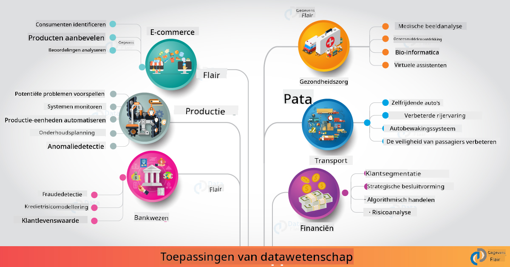

<!--
CO_OP_TRANSLATOR_METADATA:
{
  "original_hash": "67076ed50f54e7d26ba1ba378d6078f1",
  "translation_date": "2025-08-28T15:58:43+00:00",
  "source_file": "6-Data-Science-In-Wild/20-Real-World-Examples/README.md",
  "language_code": "nl"
}
-->
# Datawetenschap in de Praktijk

|  ](../../sketchnotes/20-DataScience-RealWorld.png) |
| :--------------------------------------------------------------------------------------------------------------: |
|               Datawetenschap in de Praktijk - _Sketchnote door [@nitya](https://twitter.com/nitya)_               |

We zijn bijna aan het einde van deze leerreis!

We begonnen met definities van datawetenschap en ethiek, onderzochten verschillende tools en technieken voor data-analyse en visualisatie, bespraken de levenscyclus van datawetenschap en bekeken hoe workflows voor datawetenschap kunnen worden opgeschaald en geautomatiseerd met cloudcomputingdiensten. Dus je vraagt je waarschijnlijk af: _"Hoe pas ik al deze kennis toe in de praktijk?"_

In deze les verkennen we toepassingen van datawetenschap in de praktijk binnen verschillende industrieën en duiken we in specifieke voorbeelden binnen onderzoek, digitale geesteswetenschappen en duurzaamheid. We bespreken ook mogelijkheden voor studentenprojecten en sluiten af met nuttige bronnen om je leerreis voort te zetten!

## Pre-Lecture Quiz

[Pre-lecture quiz](https://purple-hill-04aebfb03.1.azurestaticapps.net/quiz/38)

## Datawetenschap + Industrie

Dankzij de democratisering van AI wordt het voor ontwikkelaars steeds eenvoudiger om AI-gestuurde besluitvorming en datagedreven inzichten te ontwerpen en te integreren in gebruikerservaringen en ontwikkelworkflows. Hier zijn enkele voorbeelden van hoe datawetenschap wordt toegepast in de praktijk binnen verschillende industrieën:

 * [Google Flu Trends](https://www.wired.com/2015/10/can-learn-epic-failure-google-flu-trends/) gebruikte datawetenschap om zoektermen te correleren met grieptrends. Hoewel de aanpak gebreken vertoonde, bracht het bewustzijn over de mogelijkheden (en uitdagingen) van datagedreven voorspellingen in de gezondheidszorg.

 * [UPS Routing Predictions](https://www.technologyreview.com/2018/11/21/139000/how-ups-uses-ai-to-outsmart-bad-weather/) - beschrijft hoe UPS datawetenschap en machine learning gebruikt om optimale bezorgroutes te voorspellen, rekening houdend met weersomstandigheden, verkeerspatronen, deadlines en meer.

 * [NYC Taxicab Route Visualization](http://chriswhong.github.io/nyctaxi/) - data verzameld via [Freedom Of Information Laws](https://chriswhong.com/open-data/foil_nyc_taxi/) hielp een dag in het leven van NYC-taxi's te visualiseren, waardoor we inzicht kregen in hoe ze door de drukke stad navigeren, hoeveel ze verdienen en hoe lang ritten duren gedurende een periode van 24 uur.

 * [Uber Data Science Workbench](https://eng.uber.com/dsw/) - gebruikt data (over ophaal- en afleverlocaties, ritduur, voorkeursroutes, etc.) verzameld uit miljoenen Uber-ritten *dagelijks* om een data-analysetool te bouwen die helpt bij prijsbepaling, veiligheid, fraudedetectie en navigatiebeslissingen.

 * [Sportanalyse](https://towardsdatascience.com/scope-of-analytics-in-sports-world-37ed09c39860) - richt zich op _voorspellende analyse_ (team- en spelersanalyse - denk aan [Moneyball](https://datasciencedegree.wisconsin.edu/blog/moneyball-proves-importance-big-data-big-ideas/) - en fanbeheer) en _datavisualisatie_ (team- en fandashboards, games, etc.) met toepassingen zoals talent scouting, sportweddenschappen en voorraad-/locatiebeheer.

 * [Datawetenschap in de bankensector](https://data-flair.training/blogs/data-science-in-banking/) - benadrukt de waarde van datawetenschap in de financiële sector met toepassingen variërend van risicomodellering en fraudedetectie tot klantsegmentatie, realtime voorspellingen en aanbevelingssystemen. Voorspellende analyse drijft ook kritieke maatregelen zoals [kredietscores](https://dzone.com/articles/using-big-data-and-predictive-analytics-for-credit).

 * [Datawetenschap in de gezondheidszorg](https://data-flair.training/blogs/data-science-in-healthcare/) - benadrukt toepassingen zoals medische beeldvorming (bijv. MRI, röntgenfoto's, CT-scans), genomica (DNA-sequencing), medicijnontwikkeling (risicobeoordeling, succesvoorspelling), voorspellende analyse (patiëntenzorg en logistiek), ziekteopsporing en -preventie, enz.

 Afbeeldingsbron: [Data Flair: 6 Amazing Data Science Applications ](https://data-flair.training/blogs/data-science-applications/)

De afbeelding toont andere domeinen en voorbeelden van het toepassen van datawetenschappelijke technieken. Wil je meer toepassingen verkennen? Bekijk de sectie [Review & Self Study](../../../../6-Data-Science-In-Wild/20-Real-World-Examples) hieronder.

## Datawetenschap + Onderzoek

|  ](../../sketchnotes/20-DataScience-Research.png) |
| :---------------------------------------------------------------------------------------------------------------: |
|              Datawetenschap & Onderzoek - _Sketchnote door [@nitya](https://twitter.com/nitya)_              |

Hoewel toepassingen in de praktijk vaak gericht zijn op grootschalige industriële gebruikssituaties, kunnen _onderzoeks_-toepassingen en projecten nuttig zijn vanuit twee perspectieven:

* _Innovatiekansen_ - snelle prototyping van geavanceerde concepten en het testen van gebruikerservaringen voor toepassingen van de volgende generatie.
* _Implementatie-uitdagingen_ - onderzoek naar mogelijke schade of onbedoelde gevolgen van datawetenschappelijke technologieën in de praktijk.

Voor studenten kunnen deze onderzoeksprojecten zowel leer- als samenwerkingsmogelijkheden bieden die je begrip van het onderwerp verbeteren en je bewustzijn en betrokkenheid vergroten bij relevante mensen of teams die werken in interessegebieden. Hoe zien onderzoeksprojecten eruit en hoe kunnen ze impact maken?

Laten we een voorbeeld bekijken - de [MIT Gender Shades Study](http://gendershades.org/overview.html) van Joy Buolamwini (MIT Media Labs) met een [belangrijk onderzoeksartikel](http://proceedings.mlr.press/v81/buolamwini18a/buolamwini18a.pdf) mede-auteur van Timnit Gebru (destijds bij Microsoft Research) dat zich richtte op:

 * **Wat:** Het doel van het onderzoeksproject was om _de vooringenomenheid in geautomatiseerde gezichtsherkenningsalgoritmen en datasets_ te evalueren op basis van geslacht en huidskleur.
 * **Waarom:** Gezichtsherkenning wordt gebruikt in gebieden zoals wetshandhaving, luchthavenbeveiliging, wervingssystemen en meer - contexten waarin onjuiste classificaties (bijv. door vooringenomenheid) economische en sociale schade kunnen veroorzaken voor getroffen individuen of groepen. Het begrijpen (en elimineren of verminderen) van vooringenomenheid is essentieel voor eerlijk gebruik.
 * **Hoe:** Onderzoekers erkenden dat bestaande benchmarks voornamelijk lichtere huidtypes gebruikten en stelden een nieuwe dataset samen (1000+ afbeeldingen) die _meer gebalanceerd_ was qua geslacht en huidskleur. De dataset werd gebruikt om de nauwkeurigheid van drie geslachtsclassificatieproducten (van Microsoft, IBM & Face++) te evalueren.

Resultaten toonden aan dat hoewel de algehele classificatienauwkeurigheid goed was, er een merkbaar verschil was in foutpercentages tussen verschillende subgroepen - met **misclassificatie** die hoger was voor vrouwen of personen met een donkere huidskleur, wat wijst op vooringenomenheid.

**Belangrijke Uitkomsten:** Het onderzoek bracht bewustzijn dat datawetenschap meer _representatieve datasets_ (gebalanceerde subgroepen) en meer _inclusieve teams_ (diverse achtergronden) nodig heeft om dergelijke vooringenomenheid eerder in AI-oplossingen te herkennen en te elimineren of te verminderen. Onderzoeksinspanningen zoals deze zijn ook instrumenteel in het definiëren van principes en praktijken voor _verantwoordelijke AI_ binnen veel organisaties om eerlijkheid in hun AI-producten en -processen te verbeteren.

**Wil je meer leren over relevante onderzoeksinspanningen bij Microsoft?**

* Bekijk [Microsoft Research Projects](https://www.microsoft.com/research/research-area/artificial-intelligence/?facet%5Btax%5D%5Bmsr-research-area%5D%5B%5D=13556&facet%5Btax%5D%5Bmsr-content-type%5D%5B%5D=msr-project) over Kunstmatige Intelligentie.
* Verken studentenprojecten van [Microsoft Research Data Science Summer School](https://www.microsoft.com/en-us/research/academic-program/data-science-summer-school/).
* Bekijk het [Fairlearn](https://fairlearn.org/) project en de [Responsible AI](https://www.microsoft.com/en-us/ai/responsible-ai?activetab=pivot1%3aprimaryr6) initiatieven.

## Datawetenschap + Geesteswetenschappen

|  ](../../sketchnotes/20-DataScience-Humanities.png) |
| :---------------------------------------------------------------------------------------------------------------: |
|              Datawetenschap & Digitale Geesteswetenschappen - _Sketchnote door [@nitya](https://twitter.com/nitya)_              |

Digitale Geesteswetenschappen [wordt gedefinieerd](https://digitalhumanities.stanford.edu/about-dh-stanford) als "een verzameling van praktijken en benaderingen die computationele methoden combineren met geesteswetenschappelijk onderzoek". [Stanford-projecten](https://digitalhumanities.stanford.edu/projects) zoals _"rebooting history"_ en _"poetic thinking"_ illustreren de verbinding tussen [Digitale Geesteswetenschappen en Datawetenschap](https://digitalhumanities.stanford.edu/digital-humanities-and-data-science) - met nadruk op technieken zoals netwerkanalyse, informatievisualisatie, ruimtelijke en tekstanalyse die ons kunnen helpen historische en literaire datasets opnieuw te bekijken om nieuwe inzichten en perspectieven te verkrijgen.

*Wil je een project in dit domein verkennen en uitbreiden?*

Bekijk ["Emily Dickinson and the Meter of Mood"](https://gist.github.com/jlooper/ce4d102efd057137bc000db796bfd671) - een geweldig voorbeeld van [Jen Looper](https://twitter.com/jenlooper) dat onderzoekt hoe we datawetenschap kunnen gebruiken om bekende poëzie opnieuw te bekijken en de betekenis en bijdragen van de auteur in een nieuwe context te herwaarderen. Bijvoorbeeld, _kunnen we het seizoen voorspellen waarin een gedicht is geschreven door de toon of het sentiment te analyseren_ - en wat vertelt dit ons over de gemoedstoestand van de auteur in de betreffende periode?

Om die vraag te beantwoorden, volgen we de stappen van onze datawetenschappelijke levenscyclus:
 * [`Data Verzamelen`](https://gist.github.com/jlooper/ce4d102efd057137bc000db796bfd671#acquiring-the-dataset) - om een relevante dataset te verzamelen voor analyse. Opties zijn onder andere het gebruik van een API (bijv. [Poetry DB API](https://poetrydb.org/index.html)) of het scrapen van webpagina's (bijv. [Project Gutenberg](https://www.gutenberg.org/files/12242/12242-h/12242-h.htm)) met tools zoals [Scrapy](https://scrapy.org/).
 * [`Data Schoonmaken`](https://gist.github.com/jlooper/ce4d102efd057137bc000db796bfd671#clean-the-data) - legt uit hoe tekst kan worden geformatteerd, geschoond en vereenvoudigd met basisgereedschappen zoals Visual Studio Code en Microsoft Excel.
 * [`Data Analyseren`](https://gist.github.com/jlooper/ce4d102efd057137bc000db796bfd671#working-with-the-data-in-a-notebook) - legt uit hoe we de dataset nu kunnen importeren in "Notebooks" voor analyse met Python-pakketten (zoals pandas, numpy en matplotlib) om de data te organiseren en te visualiseren.
 * [`Sentimentanalyse`](https://gist.github.com/jlooper/ce4d102efd057137bc000db796bfd671#sentiment-analysis-using-cognitive-services) - legt uit hoe we cloudservices zoals Text Analytics kunnen integreren, met behulp van low-code tools zoals [Power Automate](https://flow.microsoft.com/en-us/) voor geautomatiseerde dataverwerkingsworkflows.

Met deze workflow kunnen we de seizoensinvloeden op het sentiment van de gedichten verkennen en ons eigen perspectief op de auteur vormen. Probeer het zelf - en breid de notebook uit om andere vragen te stellen of de data op nieuwe manieren te visualiseren!

> Je kunt enkele tools uit de [Digital Humanities toolkit](https://github.com/Digital-Humanities-Toolkit) gebruiken om deze onderzoekspaden te volgen.

## Datawetenschap + Duurzaamheid

|  ](../../sketchnotes/20-DataScience-Sustainability.png) |
| :---------------------------------------------------------------------------------------------------------------: |
|              Datawetenschap & Duurzaamheid - _Sketchnote door [@nitya](https://twitter.com/nitya)_              |

De [2030 Agenda voor Duurzame Ontwikkeling](https://sdgs.un.org/2030agenda) - aangenomen door alle leden van de Verenigde Naties in 2015 - identificeert 17 doelen, waaronder doelen die gericht zijn op **het beschermen van de planeet** tegen degradatie en de impact van klimaatverandering. Het [Microsoft Sustainability](https://www.microsoft.com/en-us/sustainability) initiatief ondersteunt deze doelen door te onderzoeken hoe technologische oplossingen kunnen bijdragen aan en bouwen aan duurzamere toekomsten met een [focus op 4 doelen](https://dev.to/azure/a-visual-guide-to-sustainable-software-engineering-53hh) - koolstofnegatief, waterpositief, nul afval en biodivers tegen 2030.

Het aanpakken van deze uitdagingen op een schaalbare en tijdige manier vereist denken op cloudschaal - en grootschalige data. Het [Planetary Computer](https://planetarycomputer.microsoft.com/) initiatief biedt 4 componenten om datawetenschappers en ontwikkelaars hierbij te ondersteunen:

 * [Data Catalogus](https://planetarycomputer.microsoft.com/catalog) - met petabytes aan gegevens over aardsystemen (gratis en gehost op Azure).
 * [Planetary API](https://planetarycomputer.microsoft.com/docs/reference/stac/) - om gebruikers te helpen relevante gegevens te zoeken over ruimte en tijd.
 * [Hub](https://planetarycomputer.microsoft.com/docs/overview/environment/) - beheerde omgeving voor wetenschappers om enorme geospatiale datasets te verwerken.
 * [Toepassingen](https://planetarycomputer.microsoft.com/applications) - toont gebruikssituaties en tools voor duurzaamheidsinzichten.
**Het Planetary Computer Project is momenteel in preview (vanaf september 2021)** - hier is hoe je kunt beginnen met bijdragen aan duurzame oplossingen met behulp van data science.

* [Vraag toegang aan](https://planetarycomputer.microsoft.com/account/request) om te starten met verkennen en in contact te komen met anderen.
* [Verken de documentatie](https://planetarycomputer.microsoft.com/docs/overview/about) om meer te leren over ondersteunde datasets en API's.
* Verken toepassingen zoals [Ecosystem Monitoring](https://analytics-lab.org/ecosystemmonitoring/) voor inspiratie voor applicatie-ideeën.

Denk na over hoe je datavisualisatie kunt gebruiken om relevante inzichten in gebieden zoals klimaatverandering en ontbossing bloot te leggen of te versterken. Of denk na over hoe inzichten kunnen worden gebruikt om nieuwe gebruikerservaringen te creëren die gedragsveranderingen stimuleren voor een duurzamer leven.

## Data Science + Studenten

We hebben gesproken over toepassingen in de industrie en onderzoek, en voorbeelden van data science-toepassingen in digitale geesteswetenschappen en duurzaamheid verkend. Dus hoe kun je je vaardigheden ontwikkelen en je expertise delen als beginnende data scientists?

Hier zijn enkele voorbeelden van data science-studentenprojecten om je te inspireren.

 * [MSR Data Science Summer School](https://www.microsoft.com/en-us/research/academic-program/data-science-summer-school/#!projects) met GitHub [projecten](https://github.com/msr-ds3) die onderwerpen verkennen zoals:
    - [Raciale vooringenomenheid in politiegeweld](https://www.microsoft.com/en-us/research/video/data-science-summer-school-2019-replicating-an-empirical-analysis-of-racial-differences-in-police-use-of-force/) | [Github](https://github.com/msr-ds3/stop-question-frisk)
    - [Betrouwbaarheid van het NYC Subway-systeem](https://www.microsoft.com/en-us/research/video/data-science-summer-school-2018-exploring-the-reliability-of-the-nyc-subway-system/) | [Github](https://github.com/msr-ds3/nyctransit)
 * [Digitalisering van materiële cultuur: Onderzoek naar sociaal-economische verdelingen in Sirkap](https://claremont.maps.arcgis.com/apps/Cascade/index.html?appid=bdf2aef0f45a4674ba41cd373fa23afc) - van [Ornella Altunyan](https://twitter.com/ornelladotcom) en team bij Claremont, met behulp van [ArcGIS StoryMaps](https://storymaps.arcgis.com/).

## 🚀 Uitdaging

Zoek naar artikelen die data science-projecten aanbevelen die geschikt zijn voor beginners - zoals [deze 50 onderwerpen](https://www.upgrad.com/blog/data-science-project-ideas-topics-beginners/) of [deze 21 projectideeën](https://www.intellspot.com/data-science-project-ideas) of [deze 16 projecten met broncode](https://data-flair.training/blogs/data-science-project-ideas/) die je kunt analyseren en aanpassen. Vergeet niet om te bloggen over je leerervaringen en je inzichten met ons allemaal te delen.

## Quiz na de les

[Quiz na de les](https://purple-hill-04aebfb03.1.azurestaticapps.net/quiz/39)

## Review & Zelfstudie

Wil je meer use cases verkennen? Hier zijn een paar relevante artikelen:
 * [17 Data Science-toepassingen en voorbeelden](https://builtin.com/data-science/data-science-applications-examples) - juli 2021
 * [11 Adembenemende Data Science-toepassingen in de echte wereld](https://myblindbird.com/data-science-applications-real-world/) - mei 2021
 * [Data Science in de echte wereld](https://towardsdatascience.com/data-science-in-the-real-world/home) - Artikelcollectie
 * Data Science in: [Onderwijs](https://data-flair.training/blogs/data-science-in-education/), [Landbouw](https://data-flair.training/blogs/data-science-in-agriculture/), [Financiën](https://data-flair.training/blogs/data-science-in-finance/), [Films](https://data-flair.training/blogs/data-science-at-movies/) & meer.

## Opdracht

[Verken een Planetary Computer Dataset](assignment.md)

---

**Disclaimer**:  
Dit document is vertaald met behulp van de AI-vertalingsservice [Co-op Translator](https://github.com/Azure/co-op-translator). Hoewel we streven naar nauwkeurigheid, willen we u erop wijzen dat geautomatiseerde vertalingen fouten of onnauwkeurigheden kunnen bevatten. Het originele document in de oorspronkelijke taal moet worden beschouwd als de gezaghebbende bron. Voor kritieke informatie wordt professionele menselijke vertaling aanbevolen. Wij zijn niet aansprakelijk voor misverstanden of verkeerde interpretaties die voortvloeien uit het gebruik van deze vertaling.