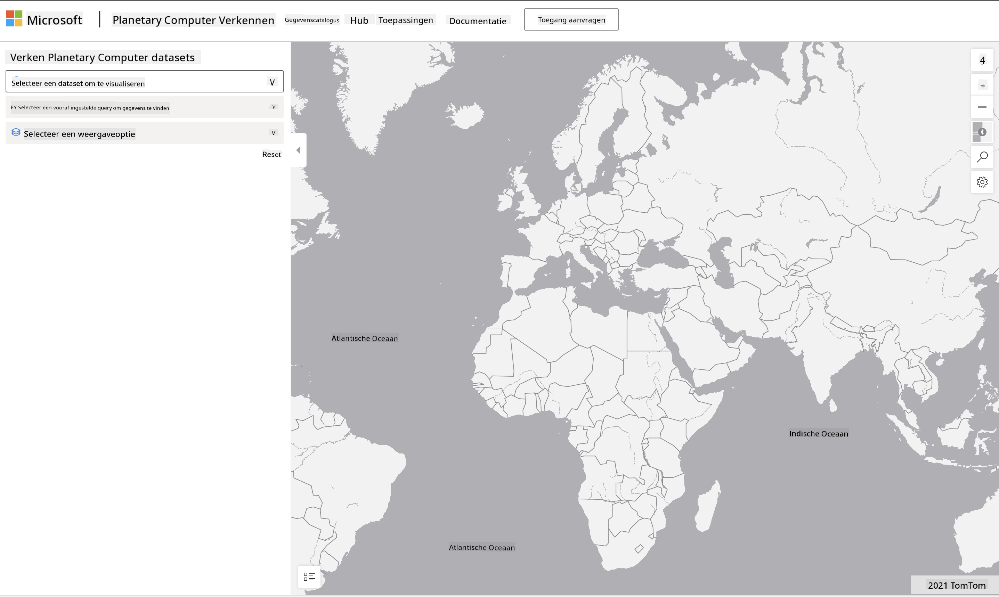

<!--
CO_OP_TRANSLATOR_METADATA:
{
  "original_hash": "d1e05715f9d97de6c4f1fb0c5a4702c0",
  "translation_date": "2025-08-28T16:00:54+00:00",
  "source_file": "6-Data-Science-In-Wild/20-Real-World-Examples/assignment.md",
  "language_code": "nl"
}
-->
# Verken een Planetary Computer Dataset

## Instructies

In deze les hebben we verschillende toepassingsgebieden van datawetenschap besproken, met diepgaande voorbeelden die betrekking hebben op onderzoek, duurzaamheid en digitale geesteswetenschappen. In deze opdracht ga je een van deze voorbeelden in meer detail verkennen en enkele van je inzichten over datavisualisaties en analyses toepassen om conclusies te trekken over duurzaamheidsdata.

Het [Planetary Computer](https://planetarycomputer.microsoft.com/) project bevat datasets en API's die toegankelijk zijn met een account - vraag er een aan als je de bonusstap van de opdracht wilt proberen. De site biedt ook een [Explorer](https://planetarycomputer.microsoft.com/explore) functie die je kunt gebruiken zonder een account aan te maken.

`Stappen:`
De Explorer-interface (afgebeeld in de screenshot hieronder) laat je een dataset selecteren (uit de beschikbare opties), een vooraf ingestelde query (om data te filteren) en een weergaveoptie (om een relevante visualisatie te maken). In deze opdracht is het jouw taak om:

 1. Lees de [Explorer documentatie](https://planetarycomputer.microsoft.com/docs/overview/explorer/) - begrijp de opties.
 2. Verken de dataset [Catalogus](https://planetarycomputer.microsoft.com/catalog) - leer het doel van elke dataset.
 3. Gebruik de Explorer - kies een dataset die je interesseert, selecteer een relevante query en weergaveoptie.

`Jouw taak:`
Bestudeer nu de visualisatie die in de browser wordt weergegeven en beantwoord de volgende vragen:
 * Welke _kenmerken_ heeft de dataset?
 * Welke _inzichten_ of resultaten biedt de visualisatie?
 * Wat zijn de _implicaties_ van die inzichten voor de duurzaamheidsdoelen van het project?
 * Wat zijn de _beperkingen_ van de visualisatie (d.w.z. welke inzichten heb je niet gekregen)?
 * Als je de ruwe data zou kunnen krijgen, welke _alternatieve visualisaties_ zou je maken, en waarom?

`Bonuspunten:`
Vraag een account aan - en log in zodra je toegang hebt.
 * Gebruik de optie _Launch Hub_ om de ruwe data te openen in een Notebook.
 * Verken de data interactief en implementeer de alternatieve visualisaties die je hebt bedacht.
 * Analyseer nu je aangepaste visualisaties - kon je de inzichten verkrijgen die je eerder miste?

## Rubriek

Uitmuntend | Voldoende | Verbetering nodig
--- | --- | -- |
Alle vijf kernvragen zijn beantwoord. De student heeft duidelijk aangegeven hoe huidige en alternatieve visualisaties inzichten kunnen bieden in duurzaamheidsdoelen of -resultaten.| De student heeft ten minste de top 3 vragen in detail beantwoord, wat aantoont dat ze praktische ervaring hebben opgedaan met de Explorer.| De student heeft meerdere vragen niet beantwoord of onvoldoende detail gegeven, wat aangeeft dat er geen betekenisvolle poging is gedaan voor het project.|

---

**Disclaimer**:  
Dit document is vertaald met behulp van de AI-vertalingsservice [Co-op Translator](https://github.com/Azure/co-op-translator). Hoewel we streven naar nauwkeurigheid, dient u zich ervan bewust te zijn dat geautomatiseerde vertalingen fouten of onnauwkeurigheden kunnen bevatten. Het originele document in de oorspronkelijke taal moet worden beschouwd als de gezaghebbende bron. Voor kritieke informatie wordt professionele menselijke vertaling aanbevolen. Wij zijn niet aansprakelijk voor misverstanden of verkeerde interpretaties die voortvloeien uit het gebruik van deze vertaling.