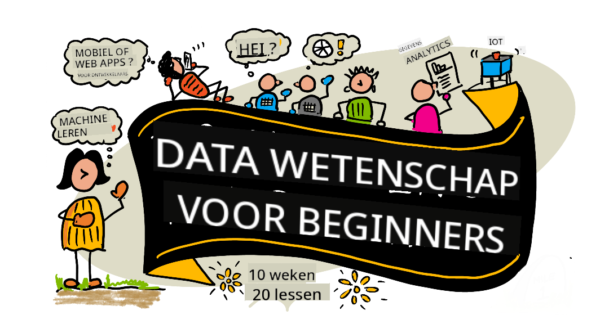

<!--
CO_OP_TRANSLATOR_METADATA:
{
  "original_hash": "dd9a1deb4da680b2cf11ba2e9f5a0a6e",
  "translation_date": "2025-09-29T21:57:47+00:00",
  "source_file": "README.md",
  "language_code": "nl"
}
-->
# Data Science voor Beginners - Een Curriculum

Azure Cloud Advocates bij Microsoft bieden met plezier een 10-weekse, 20-lessen curriculum aan over Data Science. Elke les bevat een quiz vooraf en achteraf, geschreven instructies om de les te voltooien, een oplossing en een opdracht. Onze projectgerichte aanpak stelt je in staat om te leren terwijl je bouwt, een bewezen methode om nieuwe vaardigheden te laten beklijven.

**Hartelijke dank aan onze auteurs:** [Jasmine Greenaway](https://www.twitter.com/paladique), [Dmitry Soshnikov](http://soshnikov.com), [Nitya Narasimhan](https://twitter.com/nitya), [Jalen McGee](https://twitter.com/JalenMcG), [Jen Looper](https://twitter.com/jenlooper), [Maud Levy](https://twitter.com/maudstweets), [Tiffany Souterre](https://twitter.com/TiffanySouterre), [Christopher Harrison](https://www.twitter.com/geektrainer).

**🙏 Speciale dank 🙏 aan onze [Microsoft Student Ambassador](https://studentambassadors.microsoft.com/) auteurs, reviewers en inhoudsbijdragers,** waaronder Aaryan Arora, [Aditya Garg](https://github.com/AdityaGarg00), [Alondra Sanchez](https://www.linkedin.com/in/alondra-sanchez-molina/), [Ankita Singh](https://www.linkedin.com/in/ankitasingh007), [Anupam Mishra](https://www.linkedin.com/in/anupam--mishra/), [Arpita Das](https://www.linkedin.com/in/arpitadas01/), ChhailBihari Dubey, [Dibri Nsofor](https://www.linkedin.com/in/dibrinsofor), [Dishita Bhasin](https://www.linkedin.com/in/dishita-bhasin-7065281bb), [Majd Safi](https://www.linkedin.com/in/majd-s/), [Max Blum](https://www.linkedin.com/in/max-blum-6036a1186/), [Miguel Correa](https://www.linkedin.com/in/miguelmque/), [Mohamma Iftekher (Iftu) Ebne Jalal](https://twitter.com/iftu119), [Nawrin Tabassum](https://www.linkedin.com/in/nawrin-tabassum), [Raymond Wangsa Putra](https://www.linkedin.com/in/raymond-wp/), [Rohit Yadav](https://www.linkedin.com/in/rty2423), Samridhi Sharma, [Sanya Sinha](https://www.linkedin.com/mwlite/in/sanya-sinha-13aab1200),
[Sheena Narula](https://www.linkedin.com/in/sheena-narua-n/), [Tauqeer Ahmad](https://www.linkedin.com/in/tauqeerahmad5201/), Yogendrasingh Pawar , [Vidushi Gupta](https://www.linkedin.com/in/vidushi-gupta07/), [Jasleen Sondhi](https://www.linkedin.com/in/jasleen-sondhi/)

||
|:---:|
| Data Science Voor Beginners - _Sketchnote door [@nitya](https://twitter.com/nitya)_ |

### 🌐 Meertalige Ondersteuning

#### Ondersteund via GitHub Action (Automatisch & Altijd Actueel)

[Frans](../fr/README.md) | [Spaans](../es/README.md) | [Duits](../de/README.md) | [Russisch](../ru/README.md) | [Arabisch](../ar/README.md) | [Perzisch (Farsi)](../fa/README.md) | [Urdu](../ur/README.md) | [Chinees (Vereenvoudigd)](../zh/README.md) | [Chinees (Traditioneel, Macau)](../mo/README.md) | [Chinees (Traditioneel, Hong Kong)](../hk/README.md) | [Chinees (Traditioneel, Taiwan)](../tw/README.md) | [Japans](../ja/README.md) | [Koreaans](../ko/README.md) | [Hindi](../hi/README.md) | [Bengaals](../bn/README.md) | [Marathi](../mr/README.md) | [Nepalees](../ne/README.md) | [Punjabi (Gurmukhi)](../pa/README.md) | [Portugees (Portugal)](../pt/README.md) | [Portugees (Brazilië)](../br/README.md) | [Italiaans](../it/README.md) | [Pools](../pl/README.md) | [Turks](../tr/README.md) | [Grieks](../el/README.md) | [Thais](../th/README.md) | [Zweeds](../sv/README.md) | [Deens](../da/README.md) | [Noors](../no/README.md) | [Fins](../fi/README.md) | [Nederlands](./README.md) | [Hebreeuws](../he/README.md) | [Vietnamees](../vi/README.md) | [Indonesisch](../id/README.md) | [Maleis](../ms/README.md) | [Tagalog (Filipino)](../tl/README.md) | [Swahili](../sw/README.md) | [Hongaars](../hu/README.md) | [Tsjechisch](../cs/README.md) | [Slowaaks](../sk/README.md) | [Roemeens](../ro/README.md) | [Bulgaars](../bg/README.md) | [Servisch (Cyrillisch)](../sr/README.md) | [Kroatisch](../hr/README.md) | [Sloveens](../sl/README.md) | [Oekraïens](../uk/README.md) | [Birmaans (Myanmar)](../my/README.md)

**Als je extra vertalingen wilt, staan de ondersteunde talen [hier](https://github.com/Azure/co-op-translator/blob/main/getting_started/supported-languages.md)**

#### Word lid van onze community 

We hebben een doorlopende Discord-serie over leren met AI, leer meer en doe mee via [Learn with AI Series](https://aka.ms/learnwithai/discord) van 18 - 30 september 2025. Je krijgt tips en trucs over het gebruik van GitHub Copilot voor Data Science.

# Ben je een student?

Begin met de volgende bronnen:

- [Student Hub pagina](https://docs.microsoft.com/en-gb/learn/student-hub?WT.mc_id=academic-77958-bethanycheum) Op deze pagina vind je beginnersbronnen, studentpakketten en zelfs manieren om een gratis certificaatvoucher te krijgen. Dit is een pagina die je wilt bookmarken en regelmatig wilt bekijken, omdat we de inhoud minstens maandelijks aanpassen.
- [Microsoft Learn Student Ambassadors](https://studentambassadors.microsoft.com?WT.mc_id=academic-77958-bethanycheum) Word lid van een wereldwijde community van studentambassadeurs, dit kan jouw toegangspoort tot Microsoft zijn.

# Aan de slag

> **Docenten**: we hebben [enkele suggesties opgenomen](for-teachers.md) over hoe je dit curriculum kunt gebruiken. We horen graag je feedback [in ons discussieforum](https://github.com/microsoft/Data-Science-For-Beginners/discussions)!

> **[Studenten](https://aka.ms/student-page)**: om dit curriculum zelfstandig te gebruiken, fork de hele repo en voltooi de oefeningen zelfstandig, te beginnen met een quiz voorafgaand aan de les. Lees vervolgens de les en voltooi de rest van de activiteiten. Probeer de projecten te maken door de lessen te begrijpen in plaats van de oplossingscode te kopiëren; die code is echter beschikbaar in de /solutions-mappen in elke projectgerichte les. Een ander idee is om een studiegroep te vormen met vrienden en samen door de inhoud te gaan. Voor verdere studie raden we [Microsoft Learn](https://docs.microsoft.com/en-us/users/jenlooper-2911/collections/qprpajyoy3x0g7?WT.mc_id=academic-77958-bethanycheum) aan.

## Ontmoet het team

**Gif door** [Mohit Jaisal](https://www.linkedin.com/in/mohitjaisal)

> 🎥 Klik op de afbeelding hierboven voor een video over het project en de mensen die het hebben gemaakt!

## Pedagogiek

We hebben twee pedagogische principes gekozen bij het opstellen van dit curriculum: ervoor zorgen dat het projectgericht is en dat het frequente quizzen bevat. Aan het einde van deze serie hebben studenten de basisprincipes van data science geleerd, waaronder ethische concepten, datavoorbereiding, verschillende manieren om met data te werken, datavisualisatie, data-analyse, praktijkvoorbeelden van data science en meer.

Daarnaast zorgt een quiz voorafgaand aan een les ervoor dat de student zich richt op het leren van een onderwerp, terwijl een tweede quiz na de les verdere retentie bevordert. Dit curriculum is ontworpen om flexibel en leuk te zijn en kan in zijn geheel of gedeeltelijk worden gevolgd. De projecten beginnen klein en worden steeds complexer tegen het einde van de 10-weekse cyclus.

> Bekijk onze [Gedragscode](CODE_OF_CONDUCT.md), [Bijdragen](CONTRIBUTING.md), [Vertalingsrichtlijnen](TRANSLATIONS.md). We verwelkomen je constructieve feedback!

## Elke les bevat:

- Optionele sketchnote
- Optionele aanvullende video
- Quiz voorafgaand aan de les
- Geschreven les
- Voor projectgerichte lessen, stapsgewijze handleidingen over hoe je het project bouwt
- Kennischecks
- Een uitdaging
- Aanvullende lectuur
- Opdracht
- [Quiz na de les](https://ff-quizzes.netlify.app/en/)

> **Een opmerking over quizzen**: Alle quizzen zijn opgenomen in de Quiz-App map, voor in totaal 40 quizzen van drie vragen elk. Ze zijn gelinkt vanuit de lessen, maar de quiz-app kan lokaal worden uitgevoerd of worden gedeployed naar Azure; volg de instructies in de `quiz-app` map. Ze worden geleidelijk gelokaliseerd.

## Lessen
||
|:---:|
| Data Science Voor Beginners: Roadmap - _Sketchnote door [@nitya](https://twitter.com/nitya)_ |

| Lesnummer | Onderwerp | Lesgroep | Leerdoelen | Gelinkte Les | Auteur |
| :-----------: | :----------------------------------------: | :--------------------------------------------------: | :-----------------------------------------------------------------------------------------------------------------------------------------------------------------------: | :---------------------------------------------------------------------: | :----: |
| 01 | Data Science Definiëren | [Introductie](1-Introduction/README.md) | Leer de basisconcepten achter data science en hoe het gerelateerd is aan kunstmatige intelligentie, machine learning en big data. | [les](1-Introduction/01-defining-data-science/README.md) [video](https://youtu.be/beZ7Mb_oz9I) | [Dmitry](http://soshnikov.com) |
| 02 | Data Science Ethiek | [Introductie](1-Introduction/README.md) | Concepten, uitdagingen en kaders rondom data-ethiek. | [les](1-Introduction/02-ethics/README.md) | [Nitya](https://twitter.com/nitya) |
| 03 | Data Definiëren | [Introductie](1-Introduction/README.md) | Hoe data wordt geclassificeerd en de meest voorkomende bronnen. | [les](1-Introduction/03-defining-data/README.md) | [Jasmine](https://www.twitter.com/paladique) |
| 04 | Introductie tot Statistiek & Kansberekening | [Introductie](1-Introduction/README.md) | De wiskundige technieken van kansberekening en statistiek om data te begrijpen. | [les](1-Introduction/04-stats-and-probability/README.md) [video](https://youtu.be/Z5Zy85g4Yjw) | [Dmitry](http://soshnikov.com) |
| 05 | Werken met Relationele Data | [Werken met Data](2-Working-With-Data/README.md) | Introductie tot relationele data en de basis van het verkennen en analyseren van relationele data met Structured Query Language, ook wel SQL genoemd (uitgesproken als “see-quell”). | [les](2-Working-With-Data/05-relational-databases/README.md) | [Christopher](https://www.twitter.com/geektrainer) | | |
| 06 | Werken met NoSQL Data | [Werken met Data](2-Working-With-Data/README.md) | Introductie tot niet-relationele data, de verschillende typen en de basis van het verkennen en analyseren van documentdatabases. | [les](2-Working-With-Data/06-non-relational/README.md) | [Jasmine](https://twitter.com/paladique)|
| 07 | Werken met Python | [Werken met Data](2-Working-With-Data/README.md) | Basisprincipes van het gebruik van Python voor data-exploratie met bibliotheken zoals Pandas. Een fundamenteel begrip van Python-programmering wordt aanbevolen. | [les](2-Working-With-Data/07-python/README.md) [video](https://youtu.be/dZjWOGbsN4Y) | [Dmitry](http://soshnikov.com) |
| 08 | Data Voorbereiding | [Werken met Data](2-Working-With-Data/README.md) | Onderwerpen over technieken voor het opschonen en transformeren van data om uitdagingen zoals ontbrekende, onnauwkeurige of incomplete data aan te pakken. | [les](2-Working-With-Data/08-data-preparation/README.md) | [Jasmine](https://www.twitter.com/paladique) |
| 09 | Hoeveelheden Visualiseren | [Data Visualisatie](3-Data-Visualization/README.md) | Leer hoe je Matplotlib kunt gebruiken om vogeldata 🦆 te visualiseren. | [les](3-Data-Visualization/09-visualization-quantities/README.md) | [Jen](https://twitter.com/jenlooper) |
| 10 | Distributies van Data Visualiseren | [Data Visualisatie](3-Data-Visualization/README.md) | Observaties en trends binnen een interval visualiseren. | [les](3-Data-Visualization/10-visualization-distributions/README.md) | [Jen](https://twitter.com/jenlooper) |
| 11 | Verhoudingen Visualiseren | [Data Visualisatie](3-Data-Visualization/README.md) | Visualiseren van discrete en gegroepeerde percentages. | [les](3-Data-Visualization/11-visualization-proportions/README.md) | [Jen](https://twitter.com/jenlooper) |
| 12 | Relaties Visualiseren | [Data Visualisatie](3-Data-Visualization/README.md) | Visualiseren van verbindingen en correlaties tussen datasets en hun variabelen. | [les](3-Data-Visualization/12-visualization-relationships/README.md) | [Jen](https://twitter.com/jenlooper) |
| 13 | Betekenisvolle Visualisaties | [Data Visualisatie](3-Data-Visualization/README.md) | Technieken en richtlijnen om je visualisaties waardevol te maken voor effectieve probleemoplossing en inzichten. | [les](3-Data-Visualization/13-meaningful-visualizations/README.md) | [Jen](https://twitter.com/jenlooper) |
| 14 | Introductie tot de Data Science Levenscyclus | [Levenscyclus](4-Data-Science-Lifecycle/README.md) | Introductie tot de levenscyclus van data science en de eerste stap van het verkrijgen en extraheren van data. | [les](4-Data-Science-Lifecycle/14-Introduction/README.md) | [Jasmine](https://twitter.com/paladique) |
| 15 | Analyseren | [Levenscyclus](4-Data-Science-Lifecycle/README.md) | Deze fase van de levenscyclus van data science richt zich op technieken om data te analyseren. | [les](4-Data-Science-Lifecycle/15-analyzing/README.md) | [Jasmine](https://twitter.com/paladique) | | |
| 16 | Communicatie | [Levenscyclus](4-Data-Science-Lifecycle/README.md) | Deze fase van de levenscyclus van data science richt zich op het presenteren van inzichten uit de data op een manier die het voor besluitvormers gemakkelijker maakt om te begrijpen. | [les](4-Data-Science-Lifecycle/16-communication/README.md) | [Jalen](https://twitter.com/JalenMcG) | | |
| 17 | Data Science in de Cloud | [Cloud Data](5-Data-Science-In-Cloud/README.md) | Deze serie lessen introduceert data science in de cloud en de voordelen ervan. | [les](5-Data-Science-In-Cloud/17-Introduction/README.md) | [Tiffany](https://twitter.com/TiffanySouterre) en [Maud](https://twitter.com/maudstweets) |
| 18 | Data Science in de Cloud | [Cloud Data](5-Data-Science-In-Cloud/README.md) | Modellen trainen met Low Code-tools. |[les](5-Data-Science-In-Cloud/18-Low-Code/README.md) | [Tiffany](https://twitter.com/TiffanySouterre) en [Maud](https://twitter.com/maudstweets) |
| 19 | Data Science in de Cloud | [Cloud Data](5-Data-Science-In-Cloud/README.md) | Modellen implementeren met Azure Machine Learning Studio. | [les](5-Data-Science-In-Cloud/19-Azure/README.md)| [Tiffany](https://twitter.com/TiffanySouterre) en [Maud](https://twitter.com/maudstweets) |
| 20 | Data Science in de Praktijk | [In de Praktijk](6-Data-Science-In-Wild/README.md) | Data science gedreven projecten in de echte wereld. | [les](6-Data-Science-In-Wild/20-Real-World-Examples/README.md) | [Nitya](https://twitter.com/nitya) |

## GitHub Codespaces

Volg deze stappen om dit voorbeeld te openen in een Codespace:
1. Klik op het Code-dropdownmenu en selecteer de optie Openen met Codespaces.
2. Selecteer + Nieuwe codespace onderaan het paneel.
Voor meer informatie, bekijk de [GitHub-documentatie](https://docs.github.com/en/codespaces/developing-in-codespaces/creating-a-codespace-for-a-repository#creating-a-codespace).

## VSCode Remote - Containers
Volg deze stappen om deze repo te openen in een container met behulp van je lokale machine en VSCode met de VS Code Remote - Containers-extensie:

1. Als dit de eerste keer is dat je een ontwikkelcontainer gebruikt, zorg er dan voor dat je systeem aan de vereisten voldoet (bijv. Docker geïnstalleerd) zoals beschreven in [de startdocumentatie](https://code.visualstudio.com/docs/devcontainers/containers#_getting-started).

Om deze repository te gebruiken, kun je de repository openen in een geïsoleerd Docker-volume:

**Let op**: Achter de schermen zal dit de Remote-Containers: **Clone Repository in Container Volume...**-opdracht gebruiken om de broncode te klonen in een Docker-volume in plaats van het lokale bestandssysteem. [Volumes](https://docs.docker.com/storage/volumes/) zijn de voorkeursmethode voor het behouden van containerdata.

Of open een lokaal gekloonde of gedownloade versie van de repository:

- Clone deze repository naar je lokale bestandssysteem.
- Druk op F1 en selecteer de **Remote-Containers: Open Folder in Container...**-opdracht.
- Selecteer de gekloonde kopie van deze map, wacht tot de container start en probeer dingen uit.

## Offline toegang

Je kunt deze documentatie offline uitvoeren met behulp van [Docsify](https://docsify.js.org/#/). Fork deze repo, [installeer Docsify](https://docsify.js.org/#/quickstart) op je lokale machine, en typ vervolgens in de hoofdmap van deze repo `docsify serve`. De website wordt geserveerd op poort 3000 op je localhost: `localhost:3000`.

> Let op, notebooks worden niet weergegeven via Docsify, dus wanneer je een notebook moet uitvoeren, doe dat dan apart in VS Code met een Python-kernel.

## Andere Curriculum

Ons team produceert andere curriculum! Bekijk:

- [Edge AI voor Beginners](https://aka.ms/edgeai-for-beginners)
- [AI Agents voor Beginners](https://aka.ms/ai-agents-beginners)
- [Generatieve AI voor Beginners](https://aka.ms/genai-beginners)
- [Generatieve AI voor Beginners .NET](https://github.com/microsoft/Generative-AI-for-beginners-dotnet)
- [Generatieve AI met JavaScript](https://github.com/microsoft/generative-ai-with-javascript)
- [Generatieve AI met Java](https://aka.ms/genaijava)
- [AI voor Beginners](https://aka.ms/ai-beginners)
- [Data Science voor Beginners](https://aka.ms/datascience-beginners)
- [Bash voor Beginners](https://github.com/microsoft/bash-for-beginners)
- [ML voor Beginners](https://aka.ms/ml-beginners)
- [Cybersecurity voor Beginners](https://github.com/microsoft/Security-101) 
- [Webontwikkeling voor Beginners](https://aka.ms/webdev-beginners)
- [IoT voor Beginners](https://aka.ms/iot-beginners)
- [Machine Learning voor Beginners](https://aka.ms/ml-beginners)
- [XR Ontwikkeling voor Beginners](https://aka.ms/xr-dev-for-beginners)
- [Meesteren van GitHub Copilot voor AI Pair Programming](https://aka.ms/GitHubCopilotAI)
- [XR Ontwikkeling voor Beginners](https://github.com/microsoft/xr-development-for-beginners)
- [Meesteren van GitHub Copilot voor C#/.NET Ontwikkelaars](https://github.com/microsoft/mastering-github-copilot-for-dotnet-csharp-developers)
- [Kies Je Eigen Copilot Avontuur](https://github.com/microsoft/CopilotAdventures)

---

**Disclaimer**:  
Dit document is vertaald met behulp van de AI-vertalingsservice [Co-op Translator](https://github.com/Azure/co-op-translator). Hoewel we streven naar nauwkeurigheid, dient u zich ervan bewust te zijn dat geautomatiseerde vertalingen fouten of onnauwkeurigheden kunnen bevatten. Het originele document in de oorspronkelijke taal moet worden beschouwd als de gezaghebbende bron. Voor cruciale informatie wordt professionele menselijke vertaling aanbevolen. Wij zijn niet aansprakelijk voor misverstanden of verkeerde interpretaties die voortvloeien uit het gebruik van deze vertaling.