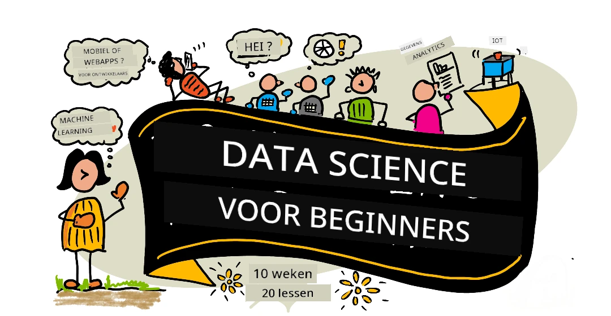
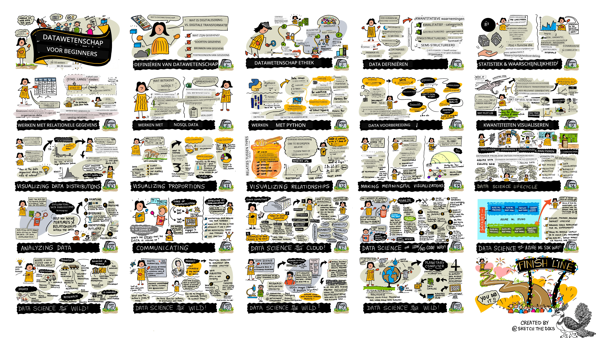

# Datawetenschap voor Beginners - Een Curriculum

[](https://github.com/codespaces/new?hide_repo_select=true&ref=main&repo=344191198)

[](https://github.com/microsoft/Data-Science-For-Beginners/blob/master/LICENSE)
[](https://GitHub.com/microsoft/Data-Science-For-Beginners/graphs/contributors/)
[](https://GitHub.com/microsoft/Data-Science-For-Beginners/issues/)
[](https://GitHub.com/microsoft/Data-Science-For-Beginners/pulls/)
[](http://makeapullrequest.com)

[](https://GitHub.com/microsoft/Data-Science-For-Beginners/watchers/)
[](https://GitHub.com/microsoft/Data-Science-For-Beginners/network/)
[](https://GitHub.com/microsoft/Data-Science-For-Beginners/stargazers/)


[](https://discord.gg/nTYy5BXMWG)

[](https://aka.ms/foundry/forum)

Azure Cloud Advocates bij Microsoft bieden met plezier een 10-weken durend, 20-lessen curriculum aan dat volledig draait om Datawetenschap. Elke les bevat voorafgaande en latere quizzen, geschreven instructies om de les te voltooien, een oplossing, en een opdracht. Onze projectgerichte pedagogiek stelt je in staat om te leren terwijl je bouwt, een bewezen manier waarop nieuwe vaardigheden 'blijven hangen'.

**Hartelijke dank aan onze auteurs:** [Jasmine Greenaway](https://www.twitter.com/paladique), [Dmitry Soshnikov](http://soshnikov.com), [Nitya Narasimhan](https://twitter.com/nitya), [Jalen McGee](https://twitter.com/JalenMcG), [Jen Looper](https://twitter.com/jenlooper), [Maud Levy](https://twitter.com/maudstweets), [Tiffany Souterre](https://twitter.com/TiffanySouterre), [Christopher Harrison](https://www.twitter.com/geektrainer).

**🙏 Speciale dank 🙏 aan onze [Microsoft Student Ambassador](https://studentambassadors.microsoft.com/) auteurs, reviewers en inhoudbijdragers,** in het bijzonder Aaryan Arora, [Aditya Garg](https://github.com/AdityaGarg00), [Alondra Sanchez](https://www.linkedin.com/in/alondra-sanchez-molina/), [Ankita Singh](https://www.linkedin.com/in/ankitasingh007), [Anupam Mishra](https://www.linkedin.com/in/anupam--mishra/), [Arpita Das](https://www.linkedin.com/in/arpitadas01/), ChhailBihari Dubey, [Dibri Nsofor](https://www.linkedin.com/in/dibrinsofor), [Dishita Bhasin](https://www.linkedin.com/in/dishita-bhasin-7065281bb), [Majd Safi](https://www.linkedin.com/in/majd-s/), [Max Blum](https://www.linkedin.com/in/max-blum-6036a1186/), [Miguel Correa](https://www.linkedin.com/in/miguelmque/), [Mohamma Iftekher (Iftu) Ebne Jalal](https://twitter.com/iftu119), [Nawrin Tabassum](https://www.linkedin.com/in/nawrin-tabassum), [Raymond Wangsa Putra](https://www.linkedin.com/in/raymond-wp/), [Rohit Yadav](https://www.linkedin.com/in/rty2423), Samridhi Sharma, [Sanya Sinha](https://www.linkedin.com/mwlite/in/sanya-sinha-13aab1200),
[Sheena Narula](https://www.linkedin.com/in/sheena-narua-n/), [Tauqeer Ahmad](https://www.linkedin.com/in/tauqeerahmad5201/), Yogendrasingh Pawar , [Vidushi Gupta](https://www.linkedin.com/in/vidushi-gupta07/), [Jasleen Sondhi](https://www.linkedin.com/in/jasleen-sondhi/)

||
|:---:|
| Datawetenschap voor Beginners - _Sketchnote door [@nitya](https://twitter.com/nitya)_ |

### 🌐 Meertalige Ondersteuning

#### Ondersteund via GitHub Action (Automatisch & Altijd Up-to-Date)

<!-- CO-OP TRANSLATOR LANGUAGES TABLE START -->
[Arabic](../ar/README.md) | [Bengali](../bn/README.md) | [Bulgarian](../bg/README.md) | [Burmese (Myanmar)](../my/README.md) | [Chinese (Simplified)](../zh-CN/README.md) | [Chinese (Traditional, Hong Kong)](../zh-HK/README.md) | [Chinese (Traditional, Macau)](../zh-MO/README.md) | [Chinese (Traditional, Taiwan)](../zh-TW/README.md) | [Croatian](../hr/README.md) | [Czech](../cs/README.md) | [Danish](../da/README.md) | [Dutch](./README.md) | [Estonian](../et/README.md) | [Finnish](../fi/README.md) | [French](../fr/README.md) | [German](../de/README.md) | [Greek](../el/README.md) | [Hebrew](../he/README.md) | [Hindi](../hi/README.md) | [Hungarian](../hu/README.md) | [Indonesian](../id/README.md) | [Italian](../it/README.md) | [Japanese](../ja/README.md) | [Kannada](../kn/README.md) | [Khmer](../km/README.md) | [Korean](../ko/README.md) | [Lithuanian](../lt/README.md) | [Malay](../ms/README.md) | [Malayalam](../ml/README.md) | [Marathi](../mr/README.md) | [Nepali](../ne/README.md) | [Nigerian Pidgin](../pcm/README.md) | [Norwegian](../no/README.md) | [Persian (Farsi)](../fa/README.md) | [Polish](../pl/README.md) | [Portuguese (Brazil)](../pt-BR/README.md) | [Portuguese (Portugal)](../pt-PT/README.md) | [Punjabi (Gurmukhi)](../pa/README.md) | [Romanian](../ro/README.md) | [Russian](../ru/README.md) | [Serbian (Cyrillic)](../sr/README.md) | [Slovak](../sk/README.md) | [Slovenian](../sl/README.md) | [Spanish](../es/README.md) | [Swahili](../sw/README.md) | [Swedish](../sv/README.md) | [Tagalog (Filipino)](../tl/README.md) | [Tamil](../ta/README.md) | [Telugu](../te/README.md) | [Thai](../th/README.md) | [Turkish](../tr/README.md) | [Ukrainian](../uk/README.md) | [Urdu](../ur/README.md) | [Vietnamese](../vi/README.md)

> **Wenst u liever lokaal te klonen?**
>
> Deze repository bevat 50+ taalvertalingen die de downloadgrootte aanzienlijk vergroten. Om zonder vertalingen te klonen, gebruik sparse checkout:
>
> **Bash / macOS / Linux:**
> ```bash
> git clone --filter=blob:none --sparse https://github.com/microsoft/Data-Science-For-Beginners.git
> cd Data-Science-For-Beginners
> git sparse-checkout set --no-cone '/*' '!translations' '!translated_images'
> ```
>
> **CMD (Windows):**
> ```cmd
> git clone --filter=blob:none --sparse https://github.com/microsoft/Data-Science-For-Beginners.git
> cd Data-Science-For-Beginners
> git sparse-checkout set --no-cone "/*" "!translations" "!translated_images"
> ```
>
> Dit geeft je alles wat je nodig hebt om de cursus te voltooien met een veel snellere download.
<!-- CO-OP TRANSLATOR LANGUAGES TABLE END -->

**Als je extra vertalingen wenst, zijn ondersteunde talen hier te vinden [hier](https://github.com/Azure/co-op-translator/blob/main/getting_started/supported-languages.md)**

#### Word lid van onze Community 
[](https://discord.gg/nTYy5BXMWG)

We hebben een lopende Discord leer met AI-serie, leer meer en doe mee via [Learn with AI Series](https://aka.ms/learnwithai/discord) van 18 - 30 september 2025. Je krijgt tips en trucs over het gebruik van GitHub Copilot voor Datawetenschap.


# Ben jij een student?

Begin met de volgende bronnen:

- [Student Hub pagina](https://docs.microsoft.com/en-gb/learn/student-hub?WT.mc_id=academic-77958-bethanycheum) Op deze pagina vind je beginnersbronnen, studentenpakketten en zelfs manieren om een gratis certificaatvoucher te krijgen. Dit is een pagina die je wilt bookmarken en van tijd tot tijd wilt controleren aangezien we de inhoud minstens maandelijks wisselen.
- [Microsoft Learn Student Ambassadors](https://studentambassadors.microsoft.com?WT.mc_id=academic-77958-bethanycheum) Word lid van een wereldwijde gemeenschap van studentambassadeurs, dit kan jouw toegang tot Microsoft zijn.

# Aan de Slag

## 📚 Documentatie

- **[Installatiehandleiding](INSTALLATION.md)** - Stapsgewijze installatie-instructies voor beginners
- **[Gebruiksaanwijzing](USAGE.md)** - Voorbeelden en veelvoorkomende workflows
- **[Probleemoplossing](TROUBLESHOOTING.md)** - Oplossingen voor veelvoorkomende problemen
- **[Bijdragen Gids](CONTRIBUTING.md)** - Hoe bij te dragen aan dit project
- **[Voor Docenten](for-teachers.md)** - Lesgeven richtlijnen en klaslokaalbronnen

## 👨‍🎓 Voor Studenten
> **Volledige Beginners**: Nieuw met datawetenschap? Begin met onze [beginnersvriendelijke voorbeelden](examples/README.md)! Deze eenvoudige, goed becommentarieerde voorbeelden helpen je de basis te begrijpen voordat je in het volledige curriculum duikt.
> **[Studenten](https://aka.ms/student-page)**: om dit curriculum zelfstandig te gebruiken, fork je de hele repo en maak je de oefeningen zelfstandig af, te beginnen met een pre-college quiz. Lees dan de college en voltooi de rest van de activiteiten. Probeer de projecten te creëren door de lessen te begrijpen in plaats van de oplossingcode te kopiëren; die code is echter beschikbaar in de /solutions mappen in elke projectgerichte les. Een ander idee is om een studiegroep te vormen met vrienden en samen door de inhoud te gaan. Voor verdere studie raden we [Microsoft Learn](https://docs.microsoft.com/en-us/users/jenlooper-2911/collections/qprpajyoy3x0g7?WT.mc_id=academic-77958-bethanycheum) aan.

**Snelstart:**
1. Bekijk de [Installatiehandleiding](INSTALLATION.md) om je omgeving op te zetten
2. Bekijk de [Gebruiksaanwijzing](USAGE.md) om te leren hoe je met het curriculum werkt
3. Begin met Les 1 en werk de lessen sequentieel door
4. Word lid van onze [Discord-community](https://aka.ms/ds4beginners/discord) voor ondersteuning

## 👩‍🏫 Voor Docenten
> **Docenten**: we hebben [enkele suggesties toegevoegd](for-teachers.md) over hoe u dit curriculum kunt gebruiken. We horen graag uw feedback [in ons discussieforum](https://github.com/microsoft/Data-Science-For-Beginners/discussions)!

## Maak kennis met het team

[](https://youtu.be/8mzavjQSMM4 "Promo video")

**Gif door** [Mohit Jaisal](https://www.linkedin.com/in/mohitjaisal)

> 🎥 Klik op de afbeelding hierboven voor een video over het project en de mensen die het hebben gemaakt!

## Pedagogiek

We hebben twee pedagogische uitgangspunten gekozen bij het opbouwen van dit curriculum: ervoor zorgen dat het projectgericht is en dat het frequente quizzen bevat. Aan het einde van deze serie hebben studenten de basisprincipes van data science geleerd, inclusief ethische concepten, gegevensvoorbereiding, verschillende manieren om met gegevens te werken, datavisualisatie, data-analyse, praktijkvoorbeelden van data science en meer.

Daarnaast zet een quiz met lage inzet vóór een les de intentie van de student om een onderwerp te leren, terwijl een tweede quiz na de les zorgt voor verdere behoud van kennis. Dit curriculum is ontworpen om flexibel en leuk te zijn en kan geheel of gedeeltelijk worden gevolgd. De projecten beginnen klein en worden aan het einde van de 10 weken-cyclus steeds complexer.

> Vind onze [Gedragscode](CODE_OF_CONDUCT.md), [Bijdragen](CONTRIBUTING.md), [Vertalingsrichtlijnen](TRANSLATIONS.md). We verwelkomen uw constructieve feedback!

## Elke les bevat:

- Optionele schetsnotitie
- Optionele aanvullende video
- Voor-les opwarmquiz
- Geschreven les
- Voor projectgebaseerde lessen, stapsgewijze handleidingen om het project te bouwen
- Kenniscontroles
- Een uitdaging
- Aanvullende lectuur
- Opdracht
- [Quiz na de les](https://ff-quizzes.netlify.app/en/)

> **Een notitie over quizzen**: Alle quizzen bevinden zich in de Quiz-App map, voor in totaal 40 quizzen met elk drie vragen. Ze zijn gekoppeld vanuit de lessen, maar de quiz-app kan lokaal worden uitgevoerd of worden geïmplementeerd naar Azure; volg de instructies in de map `quiz-app`. Ze worden geleidelijk gelokaliseerd.

## 🎓 Voor beginners geschikte voorbeelden

**Nieuw in Data Science?** We hebben een speciale [voorbeeldenmap](examples/README.md) gemaakt met eenvoudige, goed becommentarieerde code om je op weg te helpen:

- 🌟 **Hallo Wereld** - Je eerste data science programma
- 📂 **Gegevens laden** - Leer datasets lezen en verkennen
- 📊 **Eenvoudige analyse** - Bereken statistieken en vind patronen
- 📈 **Basisvisualisatie** - Maak grafieken en diagrammen
- 🔬 **Echte wereld project** - Volledig workflow van begin tot eind

Elk voorbeeld bevat gedetailleerde opmerkingen die elke stap uitleggen, perfect voor absolute beginners!

👉 **[Begin met de voorbeelden](examples/README.md)** 👈

## Lessen


||
|:---:|
| Data Science Voor Beginners: Routekaart - _Schetsnotitie door [@nitya](https://twitter.com/nitya)_ |


| Lesnummer | Onderwerp | Lessengroep | Leerdoelen | Gekoppelde les | Auteur |
| :--------: | :----------------------------------------: | :--------------------------------------------------: | :-----------------------------------------------------------------------------------------------------------------------------------------------------------------------: | :---------------------------------------------------------------------: | :----: |
| 01 | Data Science definiëren | [Introductie](1-Introduction/README.md) | Leer de basisconcepten achter data science en hoe het gerelateerd is aan kunstmatige intelligentie, machine learning en big data. | [les](1-Introduction/01-defining-data-science/README.md) [video](https://youtu.be/beZ7Mb_oz9I) | [Dmitry](http://soshnikov.com) |
| 02 | Data Science ethiek | [Introductie](1-Introduction/README.md) | Concepten, uitdagingen en kaders van data-ethiek. | [les](1-Introduction/02-ethics/README.md) | [Nitya](https://twitter.com/nitya) |
| 03 | Data definiëren | [Introductie](1-Introduction/README.md) | Hoe data wordt geclassificeerd en de veelvoorkomende bronnen ervan. | [les](1-Introduction/03-defining-data/README.md) | [Jasmine](https://www.twitter.com/paladique) |
| 04 | Introductie tot Statistiek & Kansrekening | [Introductie](1-Introduction/README.md) | De wiskundige technieken van kansrekening en statistiek om data te begrijpen. | [les](1-Introduction/04-stats-and-probability/README.md) [video](https://youtu.be/Z5Zy85g4Yjw) | [Dmitry](http://soshnikov.com) |
| 05 | Werken met relationele data | [Werken met Data](2-Working-With-Data/README.md) | Introductie tot relationele data en de basis van het verkennen en analyseren van relationele data met de Structured Query Language, ook wel SQL genoemd (uitgesproken als "see-quell"). | [les](2-Working-With-Data/05-relational-databases/README.md) | [Christopher](https://www.twitter.com/geektrainer) | | |
| 06 | Werken met NoSQL data | [Werken met Data](2-Working-With-Data/README.md) | Introductie tot niet-relationele data, de verschillende types en de basis van het verkennen en analyseren van documentendatabases. | [les](2-Working-With-Data/06-non-relational/README.md) | [Jasmine](https://twitter.com/paladique) |
| 07 | Werken met Python | [Werken met Data](2-Working-With-Data/README.md) | Basis van Python gebruiken voor data-exploratie met bibliotheken zoals Pandas. Basiskennis van Python programmeren wordt aanbevolen. | [les](2-Working-With-Data/07-python/README.md) [video](https://youtu.be/dZjWOGbsN4Y) | [Dmitry](http://soshnikov.com) |
| 08 | Gegevensvoorbereiding | [Werken met Data](2-Working-With-Data/README.md) | Onderwerpen over technieken voor het schoonmaken en transformeren van data om uitdagingen aan te pakken zoals ontbrekende, onnauwkeurige of onvolledige data. | [les](2-Working-With-Data/08-data-preparation/README.md) | [Jasmine](https://www.twitter.com/paladique) |
| 09 | Visualiseren van hoeveelheden | [Datavisualisatie](3-Data-Visualization/README.md) | Leer hoe je Matplotlib gebruikt om vogeldatagegevens te visualiseren 🦆 | [les](3-Data-Visualization/09-visualization-quantities/README.md) | [Jen](https://twitter.com/jenlooper) |
| 10 | Visualiseren van verdelingen van data | [Datavisualisatie](3-Data-Visualization/README.md) | Visualiseren van observaties en trends binnen een interval. | [les](3-Data-Visualization/10-visualization-distributions/README.md) | [Jen](https://twitter.com/jenlooper) |
| 11 | Visualiseren van verhoudingen | [Datavisualisatie](3-Data-Visualization/README.md) | Visualiseren van discrete en gegroepeerde percentages. | [les](3-Data-Visualization/11-visualization-proportions/README.md) | [Jen](https://twitter.com/jenlooper) |
| 12 | Visualiseren van relaties | [Datavisualisatie](3-Data-Visualization/README.md) | Visualiseren van verbanden en correlaties tussen datasets en hun variabelen. | [les](3-Data-Visualization/12-visualization-relationships/README.md) | [Jen](https://twitter.com/jenlooper) |
| 13 | Betekenisvolle visualisaties | [Datavisualisatie](3-Data-Visualization/README.md) | Technieken en richtlijnen om je visualisaties waardevol te maken voor effectieve probleemoplossing en inzichten. | [les](3-Data-Visualization/13-meaningful-visualizations/README.md) | [Jen](https://twitter.com/jenlooper) |
| 14 | Introductie tot de data science levenscyclus | [Levenscyclus](4-Data-Science-Lifecycle/README.md) | Introductie tot de data science levenscyclus en de eerste stap van het verkrijgen en extraheren van data. | [les](4-Data-Science-Lifecycle/14-Introduction/README.md) | [Jasmine](https://twitter.com/paladique) |
| 15 | Analyseren | [Levenscyclus](4-Data-Science-Lifecycle/README.md) | Deze fase van de data science levenscyclus richt zich op technieken om data te analyseren. | [les](4-Data-Science-Lifecycle/15-analyzing/README.md) | [Jasmine](https://twitter.com/paladique) | | |
| 16 | Communicatie | [Levenscyclus](4-Data-Science-Lifecycle/README.md) | Deze fase van de data science levenscyclus richt zich op het presenteren van inzichten uit de data op een manier die het voor beslissers makkelijker maakt om te begrijpen. | [les](4-Data-Science-Lifecycle/16-communication/README.md) | [Jalen](https://twitter.com/JalenMcG) | | |
| 17 | Data Science in de cloud | [Cloud Data](5-Data-Science-In-Cloud/README.md) | Deze reeks lessen introduceert data science in de cloud en de voordelen ervan. | [les](5-Data-Science-In-Cloud/17-Introduction/README.md) | [Tiffany](https://twitter.com/TiffanySouterre) en [Maud](https://twitter.com/maudstweets) |
| 18 | Data Science in de cloud | [Cloud Data](5-Data-Science-In-Cloud/README.md) | Modellen trainen met Low Code tools. | [les](5-Data-Science-In-Cloud/18-Low-Code/README.md) | [Tiffany](https://twitter.com/TiffanySouterre) en [Maud](https://twitter.com/maudstweets) |
| 19 | Data Science in de cloud | [Cloud Data](5-Data-Science-In-Cloud/README.md) | Modellen implementeren met Azure Machine Learning Studio. | [les](5-Data-Science-In-Cloud/19-Azure/README.md) | [Tiffany](https://twitter.com/TiffanySouterre) en [Maud](https://twitter.com/maudstweets) |
| 20 | Data Science in het wild | [In the Wild](6-Data-Science-In-Wild/README.md) | Data science gedreven projecten in de echte wereld. | [les](6-Data-Science-In-Wild/20-Real-World-Examples/README.md) | [Nitya](https://twitter.com/nitya) |

## GitHub Codespaces

Volg deze stappen om dit voorbeeld te openen in een Codespace:
1. Klik op het Code dropdown-menu en selecteer de optie Openen met Codespaces.
2. Selecteer + Nieuwe codespace onderaan het paneel.
Voor meer info, kijk in de [GitHub documentatie](https://docs.github.com/en/codespaces/developing-in-codespaces/creating-a-codespace-for-a-repository#creating-a-codespace).

## VSCode Remote - Containers
Volg deze stappen om deze repo in een container te openen met je lokale machine en VSCode met de VS Code Remote - Containers extensie:

1. Als dit je eerste keer is dat je een ontwikkelcontainer gebruikt, zorg dan dat je systeem voldoet aan de vereisten (bijv. Docker geïnstalleerd) in [de startgids](https://code.visualstudio.com/docs/devcontainers/containers#_getting-started).

Om deze repository te gebruiken, kun je de repository openen in een geïsoleerde Docker volume:

**Opmerking**: Onder de motorkap gebruikt dit de Remote-Containers: **Clone Repository in Container Volume...** opdracht om de broncode in een Docker volume te klonen in plaats van in het lokale bestandssysteem. [Volumes](https://docs.docker.com/storage/volumes/) zijn de geprefereerde methode om containerdata persistent te bewaren.

Of open een lokaal gekloonde of gedownloade versie van de repository:

- Clone deze repository naar je lokale bestandssysteem.
- Druk op F1 en selecteer de opdracht **Remote-Containers: Open Folder in Container...**.
- Selecteer de gekloonde kopie van deze map, wacht tot de container start, en probeer het uit.

## Offline toegang

Je kunt deze documentatie offline draaien met behulp van [Docsify](https://docsify.js.org/#/). Fork deze repo, [installeer Docsify](https://docsify.js.org/#/quickstart) op je lokale machine, en typ dan in de hoofdmap van deze repo `docsify serve`. De website zal dan op poort 3000 op je localhost worden geserveerd: `localhost:3000`.

> Let op, notebooks worden niet gerenderd via Docsify, dus wanneer je een notebook moet uitvoeren, doe dat dan apart in VS Code met een Python kernel.

## Andere curriculum

Ons team produceert ook andere curricula! Bekijk:

<!-- CO-OP TRANSLATOR OTHER COURSES START -->
### LangChain
[](https://aka.ms/langchain4j-for-beginners)
[](https://aka.ms/langchainjs-for-beginners?WT.mc_id=m365-94501-dwahlin)
[](https://github.com/microsoft/langchain-for-beginners?WT.mc_id=m365-94501-dwahlin)
---

### Azure / Edge / MCP / Agents
[](https://github.com/microsoft/AZD-for-beginners?WT.mc_id=academic-105485-koreyst)
[](https://github.com/microsoft/edgeai-for-beginners?WT.mc_id=academic-105485-koreyst)
[](https://github.com/microsoft/mcp-for-beginners?WT.mc_id=academic-105485-koreyst)
[](https://github.com/microsoft/ai-agents-for-beginners?WT.mc_id=academic-105485-koreyst)

---
 
### Generatieve AI Reeks
[](https://github.com/microsoft/generative-ai-for-beginners?WT.mc_id=academic-105485-koreyst)
[-9333EA?style=for-the-badge&labelColor=E5E7EB&color=9333EA)](https://github.com/microsoft/Generative-AI-for-beginners-dotnet?WT.mc_id=academic-105485-koreyst)
[-C084FC?style=for-the-badge&labelColor=E5E7EB&color=C084FC)](https://github.com/microsoft/generative-ai-for-beginners-java?WT.mc_id=academic-105485-koreyst)
[-E879F9?style=for-the-badge&labelColor=E5E7EB&color=E879F9)](https://github.com/microsoft/generative-ai-with-javascript?WT.mc_id=academic-105485-koreyst)

---
 
### Kernleren
[](https://aka.ms/ml-beginners?WT.mc_id=academic-105485-koreyst)
[](https://aka.ms/datascience-beginners?WT.mc_id=academic-105485-koreyst)
[](https://aka.ms/ai-beginners?WT.mc_id=academic-105485-koreyst)
[](https://github.com/microsoft/Security-101?WT.mc_id=academic-96948-sayoung)
[](https://aka.ms/webdev-beginners?WT.mc_id=academic-105485-koreyst)
[](https://aka.ms/iot-beginners?WT.mc_id=academic-105485-koreyst)
[](https://github.com/microsoft/xr-development-for-beginners?WT.mc_id=academic-105485-koreyst)

---
 
### Copilot Reeks
[](https://aka.ms/GitHubCopilotAI?WT.mc_id=academic-105485-koreyst)
[](https://github.com/microsoft/mastering-github-copilot-for-dotnet-csharp-developers?WT.mc_id=academic-105485-koreyst)
[](https://github.com/microsoft/CopilotAdventures?WT.mc_id=academic-105485-koreyst)
<!-- CO-OP TRANSLATOR OTHER COURSES END -->

## Hulp Krijgen

**Problemen ondervonden?** Bekijk onze [Probleemoplossingsgids](TROUBLESHOOTING.md) voor oplossingen voor veelvoorkomende problemen.

Als je vastloopt of vragen hebt over het bouwen van AI-apps. Doe mee met mede-leerlingen en ervaren ontwikkelaars in discussies over MCP. Het is een ondersteunende gemeenschap waar vragen welkom zijn en kennis vrij wordt gedeeld.

[](https://discord.gg/nTYy5BXMWG)

Als je productfeedback of fouten hebt tijdens het bouwen, bezoek dan:

[](https://aka.ms/foundry/forum)

---

<!-- CO-OP TRANSLATOR DISCLAIMER START -->
**Disclaimer**:  
Dit document is vertaald met behulp van de AI-vertalingsdienst [Co-op Translator](https://github.com/Azure/co-op-translator). Hoewel we streven naar nauwkeurigheid, dient u er rekening mee te houden dat geautomatiseerde vertalingen fouten of onjuistheden kunnen bevatten. Het originele document in de oorspronkelijke taal moet als de gezaghebbende bron worden beschouwd. Voor cruciale informatie wordt professionele menselijke vertaling aanbevolen. Wij zijn niet aansprakelijk voor eventuele misverstanden of verkeerde interpretaties die voortvloeien uit het gebruik van deze vertaling.
<!-- CO-OP TRANSLATOR DISCLAIMER END -->