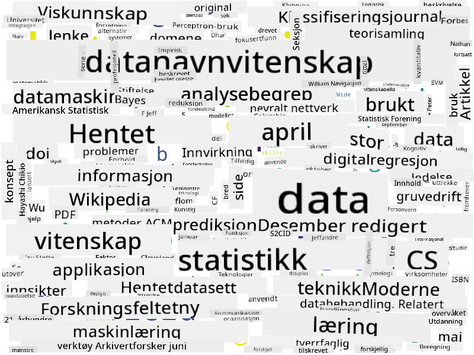

<!--
CO_OP_TRANSLATOR_METADATA:
{
  "original_hash": "2583a9894af7123b2fcae3376b14c035",
  "translation_date": "2025-08-26T21:32:31+00:00",
  "source_file": "1-Introduction/01-defining-data-science/README.md",
  "language_code": "no"
}
-->
## Typer av data

Som vi allerede har nevnt, finnes data overalt. Vi må bare fange det på riktig måte! Det er nyttig å skille mellom **strukturert** og **ustrukturert** data. Strukturert data er vanligvis representert i en velorganisert form, ofte som en tabell eller flere tabeller, mens ustrukturert data bare er en samling av filer. Noen ganger kan vi også snakke om **semi-strukturert** data, som har en viss form for struktur som kan variere betydelig.

| Strukturert                                                                  | Semi-strukturert                                                                               | Ustrukturert                           |
| -----------------------------------------------------------------------------| ----------------------------------------------------------------------------------------------| --------------------------------------- |
| Liste over personer med telefonnumrene deres                                 | Wikipedia-sider med lenker                                                                    | Teksten fra Encyclopedia Britannica    |
| Temperatur i alle rom i en bygning hvert minutt de siste 20 årene            | Samling av vitenskapelige artikler i JSON-format med forfattere, publiseringsdato og sammendrag | Filarkiv med bedriftsdokumenter        |
| Data om alder og kjønn til alle som går inn i bygningen                      | Internett-sider                                                                               | Rå videoopptak fra overvåkningskamera  |

## Hvor kan man få tak i data

Det finnes mange mulige kilder til data, og det vil være umulig å liste opp alle! La oss likevel nevne noen typiske steder hvor du kan få tak i data:

* **Strukturert**
  - **Internet of Things** (IoT), inkludert data fra ulike sensorer, som temperatur- eller trykksensorer, gir mye nyttig data. For eksempel, hvis en kontorbygning er utstyrt med IoT-sensorer, kan vi automatisk kontrollere oppvarming og belysning for å minimere kostnader.
  - **Undersøkelser** som vi ber brukere om å fylle ut etter et kjøp eller etter å ha besøkt en nettside.
  - **Analyse av atferd** kan for eksempel hjelpe oss med å forstå hvor dypt en bruker går inn på en nettside, og hva som er den typiske årsaken til at de forlater siden.
* **Ustrukturert**
  - **Tekster** kan være en rik kilde til innsikt, som en generell **sentimentscore**, eller ved å trekke ut nøkkelord og semantisk mening.
  - **Bilder** eller **videoer**. En video fra et overvåkningskamera kan brukes til å estimere trafikken på veien og informere folk om potensielle trafikkorker.
  - **Loggfiler** fra webservere kan brukes til å forstå hvilke sider på nettstedet vårt som blir mest besøkt, og hvor lenge.
* **Semi-strukturert**
  - **Sosiale nettverk**-grafer kan være gode kilder til data om brukernes personligheter og potensielle effektivitet i å spre informasjon.
  - Når vi har en samling fotografier fra en fest, kan vi prøve å trekke ut data om **gruppedynamikk** ved å bygge en graf over personer som tar bilder sammen.

Ved å kjenne til ulike mulige datakilder, kan du prøve å tenke på forskjellige scenarier hvor data science-teknikker kan brukes for å forstå situasjonen bedre og forbedre forretningsprosesser.

## Hva du kan gjøre med data

I Data Science fokuserer vi på følgende steg i datareisen:

Selvfølgelig, avhengig av den faktiske dataen, kan noen steg mangle (f.eks. når vi allerede har dataen i databasen, eller når vi ikke trenger modelltrening), eller noen steg kan gjentas flere ganger (som databehandling).

## Digitalisering og digital transformasjon

I løpet av det siste tiåret har mange bedrifter begynt å forstå viktigheten av data når de tar forretningsbeslutninger. For å anvende prinsippene for data science i en bedrift, må man først samle inn data, altså oversette forretningsprosesser til digital form. Dette kalles **digitalisering**. Å bruke data science-teknikker på denne dataen for å veilede beslutninger kan føre til betydelige produktivitetsøkninger (eller til og med en forretningspivot), kjent som **digital transformasjon**.

La oss se på et eksempel. Anta at vi har et data science-kurs (som dette) som vi leverer online til studenter, og vi ønsker å bruke data science for å forbedre det. Hvordan kan vi gjøre det?

Vi kan starte med å spørre "Hva kan digitaliseres?" Den enkleste måten ville være å måle tiden det tar for hver student å fullføre hver modul, og å måle den oppnådde kunnskapen ved å gi en flervalgsprøve på slutten av hver modul. Ved å beregne gjennomsnittlig tid til fullføring på tvers av alle studenter, kan vi finne ut hvilke moduler som skaper mest utfordringer for studentene, og jobbe med å forenkle dem.
> Du kan argumentere for at denne tilnærmingen ikke er optimal, fordi moduler kan ha ulik lengde. Det er sannsynligvis mer rettferdig å dele tiden på lengden av modulen (i antall tegn) og sammenligne disse verdiene i stedet.
Når vi begynner å analysere resultatene av flervalgstester, kan vi prøve å finne ut hvilke konsepter studentene har vanskeligheter med å forstå, og bruke den informasjonen til å forbedre innholdet. For å gjøre dette må vi designe tester slik at hvert spørsmål kobles til et bestemt konsept eller kunnskapsområde.

Hvis vi vil gjøre det enda mer komplisert, kan vi plotte tiden brukt på hver modul mot alderskategorien til studentene. Vi kan oppdage at det for noen alderskategorier tar uforholdsmessig lang tid å fullføre modulen, eller at studentene slutter før de fullfører. Dette kan hjelpe oss med å gi aldersanbefalinger for modulen og minimere misnøye på grunn av feil forventninger.

## 🚀 Utfordring

I denne utfordringen skal vi prøve å finne konsepter som er relevante for feltet Data Science ved å se på tekster. Vi skal ta en Wikipedia-artikkel om Data Science, laste ned og behandle teksten, og deretter lage en ordsky som denne:

Besøk [`notebook.ipynb`](../../../../../../../../../1-Introduction/01-defining-data-science/notebook.ipynb ':ignore') for å lese gjennom koden. Du kan også kjøre koden og se hvordan den utfører alle datatransformasjoner i sanntid.

> Hvis du ikke vet hvordan du kjører kode i en Jupyter Notebook, ta en titt på [denne artikkelen](https://soshnikov.com/education/how-to-execute-notebooks-from-github/).

## [Quiz etter forelesning](https://purple-hill-04aebfb03.1.azurestaticapps.net/quiz/1)

## Oppgaver

* **Oppgave 1**: Endre koden ovenfor for å finne relaterte konsepter for feltene **Big Data** og **Maskinlæring**
* **Oppgave 2**: [Tenk på Data Science-scenarier](assignment.md)

## Kreditering

Denne leksjonen er skrevet med ♥️ av [Dmitry Soshnikov](http://soshnikov.com)

---

**Ansvarsfraskrivelse**:  
Dette dokumentet er oversatt ved hjelp av AI-oversettelsestjenesten [Co-op Translator](https://github.com/Azure/co-op-translator). Selv om vi streber etter nøyaktighet, vær oppmerksom på at automatiske oversettelser kan inneholde feil eller unøyaktigheter. Det originale dokumentet på sitt opprinnelige språk bør anses som den autoritative kilden. For kritisk informasjon anbefales profesjonell menneskelig oversettelse. Vi er ikke ansvarlige for eventuelle misforståelser eller feiltolkninger som oppstår ved bruk av denne oversettelsen.