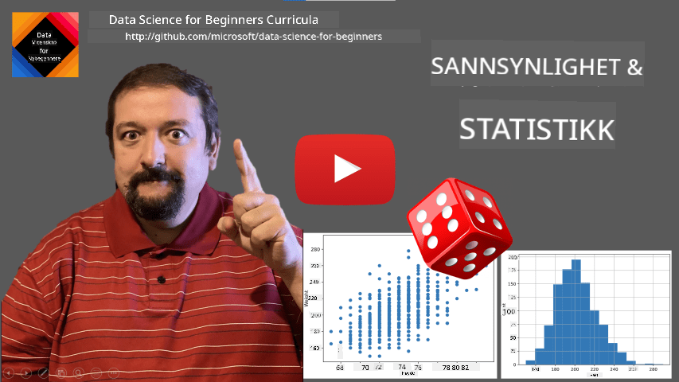
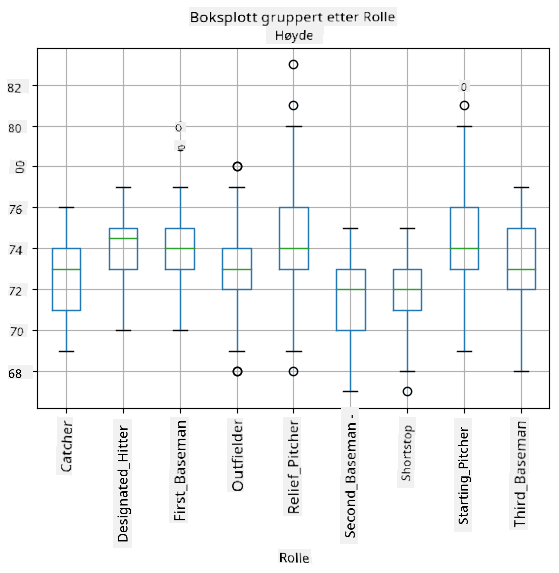
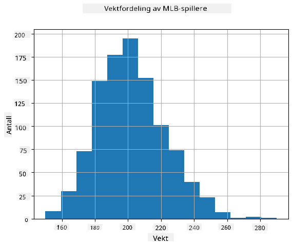
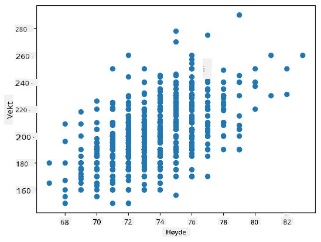

<!--
CO_OP_TRANSLATOR_METADATA:
{
  "original_hash": "b706a07cfa87ba091cbb91e0aa775600",
  "translation_date": "2025-08-26T21:45:11+00:00",
  "source_file": "1-Introduction/04-stats-and-probability/README.md",
  "language_code": "no"
}
-->
# En Kort Introduksjon til Statistikk og Sannsynlighet

| ](../../sketchnotes/04-Statistics-Probability.png)|
|:---:|
| Statistikk og Sannsynlighet - _Sketchnote av [@nitya](https://twitter.com/nitya)_ |

Statistikk og sannsynlighetsteori er to nært relaterte områder innen matematikk som er svært relevante for datavitenskap. Det er mulig å jobbe med data uten dyp kunnskap om matematikk, men det er likevel bedre å kjenne til noen grunnleggende konsepter. Her vil vi presentere en kort introduksjon som kan hjelpe deg i gang.

[](https://youtu.be/Z5Zy85g4Yjw)

## [Quiz før forelesning](https://purple-hill-04aebfb03.1.azurestaticapps.net/quiz/6)

## Sannsynlighet og Tilfeldige Variabler

**Sannsynlighet** er et tall mellom 0 og 1 som uttrykker hvor sannsynlig en **hendelse** er. Det defineres som antall positive utfall (som fører til hendelsen), delt på totalt antall utfall, gitt at alle utfall er like sannsynlige. For eksempel, når vi kaster en terning, er sannsynligheten for å få et partall 3/6 = 0.5.

Når vi snakker om hendelser, bruker vi **tilfeldige variabler**. For eksempel, den tilfeldige variabelen som representerer tallet vi får når vi kaster en terning, vil ha verdier fra 1 til 6. Mengden av tall fra 1 til 6 kalles **utvalgsrom**. Vi kan snakke om sannsynligheten for at en tilfeldig variabel tar en bestemt verdi, for eksempel P(X=3)=1/6.

Den tilfeldige variabelen i det forrige eksempelet kalles **diskret**, fordi den har et tellbart utvalgsrom, dvs. det finnes separate verdier som kan telles opp. Det finnes tilfeller der utvalgsrommet er et intervall av reelle tall, eller hele settet av reelle tall. Slike variabler kalles **kontinuerlige**. Et godt eksempel er tidspunktet når bussen ankommer.

## Sannsynlighetsfordeling

For diskrete tilfeldige variabler er det enkelt å beskrive sannsynligheten for hver hendelse med en funksjon P(X). For hver verdi *s* fra utvalgsrommet *S* vil den gi et tall fra 0 til 1, slik at summen av alle verdier av P(X=s) for alle hendelser blir 1.

Den mest kjente diskrete fordelingen er **uniform fordeling**, der det finnes et utvalgsrom med N elementer, med lik sannsynlighet på 1/N for hver av dem.

Det er mer utfordrende å beskrive sannsynlighetsfordelingen for en kontinuerlig variabel, med verdier trukket fra et intervall [a,b], eller hele settet av reelle tall ℝ. Tenk på tilfelle med busstider. Faktisk, for hvert eksakte tidspunkt *t*, er sannsynligheten for at bussen ankommer akkurat da lik 0!

> Nå vet du at hendelser med sannsynlighet 0 skjer, og veldig ofte! I det minste hver gang bussen ankommer!

Vi kan bare snakke om sannsynligheten for at en variabel faller innenfor et gitt intervall av verdier, f.eks. P(t<sub>1</sub>≤X<t<sub>2</sub>). I dette tilfellet beskrives sannsynlighetsfordelingen av en **sannsynlighetstetthetsfunksjon** p(x), slik at


En kontinuerlig analog av uniform fordeling kalles **kontinuerlig uniform**, som er definert på et begrenset intervall. Sannsynligheten for at verdien X faller innenfor et intervall med lengde l er proporsjonal med l, og stiger opp til 1.

En annen viktig fordeling er **normalfordeling**, som vi skal snakke mer om nedenfor.

## Gjennomsnitt, Varians og Standardavvik

Anta at vi trekker en sekvens av n prøver av en tilfeldig variabel X: x<sub>1</sub>, x<sub>2</sub>, ..., x<sub>n</sub>. Vi kan definere **gjennomsnitt** (eller **aritmetisk middelverdi**) av sekvensen på tradisjonelt vis som (x<sub>1</sub>+x<sub>2</sub>+x<sub>n</sub>)/n. Når vi øker størrelsen på prøven (dvs. tar grensen med n→∞), vil vi få gjennomsnittet (også kalt **forventning**) av fordelingen. Vi vil betegne forventning med **E**(x).

> Det kan vises at for enhver diskret fordeling med verdier {x<sub>1</sub>, x<sub>2</sub>, ..., x<sub>N</sub>} og tilsvarende sannsynligheter p<sub>1</sub>, p<sub>2</sub>, ..., p<sub>N</sub>, vil forventningen være E(X)=x<sub>1</sub>p<sub>1</sub>+x<sub>2</sub>p<sub>2</sub>+...+x<sub>N</sub>p<sub>N</sub>.

For å identifisere hvor langt verdiene er spredt, kan vi beregne variansen σ<sup>2</sup> = ∑(x<sub>i</sub> - μ)<sup>2</sup>/n, der μ er gjennomsnittet av sekvensen. Verdien σ kalles **standardavvik**, og σ<sup>2</sup> kalles **varians**.

## Typetall, Median og Kvartiler

Noen ganger representerer ikke gjennomsnittet tilstrekkelig den "typiske" verdien for data. For eksempel, når det finnes noen ekstreme verdier som er helt utenfor rekkevidde, kan de påvirke gjennomsnittet. Et annet godt mål er **median**, en verdi slik at halvparten av datapunktene er lavere enn den, og den andre halvparten - høyere.

For å hjelpe oss med å forstå fordelingen av data, er det nyttig å snakke om **kvartiler**:

* Første kvartil, eller Q1, er en verdi slik at 25% av dataene faller under den
* Tredje kvartil, eller Q3, er en verdi slik at 75% av dataene faller under den

Grafisk kan vi representere forholdet mellom median og kvartiler i et diagram kalt **boksplott**:


Her beregner vi også **interkvartilavstand** IQR=Q3-Q1, og såkalte **uteliggere** - verdier som ligger utenfor grensene [Q1-1.5*IQR,Q3+1.5*IQR].

For en begrenset fordeling som inneholder et lite antall mulige verdier, er en god "typisk" verdi den som forekommer oftest, og som kalles **typetall**. Det brukes ofte på kategoriske data, som farger. Tenk på en situasjon der vi har to grupper mennesker - noen som sterkt foretrekker rødt, og andre som foretrekker blått. Hvis vi koder farger med tall, vil gjennomsnittsverdien for favorittfarge være et sted i det oransje-grønne spekteret, som ikke indikerer den faktiske preferansen til noen av gruppene. Typetallet vil imidlertid være enten en av fargene, eller begge fargene, hvis antallet personer som stemmer for dem er likt (i dette tilfellet kaller vi utvalget **multimodalt**).

## Data fra Virkeligheten

Når vi analyserer data fra virkeligheten, er de ofte ikke tilfeldige variabler i den forstand at vi ikke utfører eksperimenter med ukjent resultat. For eksempel, vurder et lag med baseballspillere og deres kroppslige data, som høyde, vekt og alder. Disse tallene er ikke akkurat tilfeldige, men vi kan fortsatt bruke de samme matematiske konseptene. For eksempel kan en sekvens av folks vekter betraktes som en sekvens av verdier trukket fra en tilfeldig variabel. Nedenfor er sekvensen av vekter til faktiske baseballspillere fra [Major League Baseball](http://mlb.mlb.com/index.jsp), hentet fra [dette datasettet](http://wiki.stat.ucla.edu/socr/index.php/SOCR_Data_MLB_HeightsWeights) (for enkelhets skyld vises bare de første 20 verdiene):

```
[180.0, 215.0, 210.0, 210.0, 188.0, 176.0, 209.0, 200.0, 231.0, 180.0, 188.0, 180.0, 185.0, 160.0, 180.0, 185.0, 197.0, 189.0, 185.0, 219.0]
```

> **Merk**: For å se et eksempel på hvordan man jobber med dette datasettet, ta en titt på [den medfølgende notatboken](notebook.ipynb). Det finnes også en rekke utfordringer gjennom denne leksjonen, og du kan fullføre dem ved å legge til litt kode i den notatboken. Hvis du ikke er sikker på hvordan du opererer med data, ikke bekymre deg - vi kommer tilbake til å jobbe med data ved hjelp av Python senere. Hvis du ikke vet hvordan du kjører kode i Jupyter Notebook, ta en titt på [denne artikkelen](https://soshnikov.com/education/how-to-execute-notebooks-from-github/).

Her er boksplottet som viser gjennomsnitt, median og kvartiler for våre data:


Siden våre data inneholder informasjon om forskjellige spiller **roller**, kan vi også lage boksplott etter rolle - det vil gi oss en idé om hvordan parameterverdier varierer mellom roller. Denne gangen vil vi vurdere høyde:



Dette diagrammet antyder at, i gjennomsnitt, er høyden til førstemenn høyere enn høyden til andremenn. Senere i denne leksjonen vil vi lære hvordan vi kan teste denne hypotesen mer formelt, og hvordan vi kan demonstrere at våre data er statistisk signifikante for å vise dette.

> Når vi jobber med data fra virkeligheten, antar vi at alle datapunkter er prøver trukket fra en sannsynlighetsfordeling. Denne antagelsen lar oss bruke maskinlæringsteknikker og bygge fungerende prediktive modeller.

For å se hva fordelingen av våre data er, kan vi lage et diagram kalt **histogram**. X-aksen vil inneholde et antall forskjellige vektintervaller (såkalte **bins**), og den vertikale aksen vil vise antall ganger vår tilfeldige variabelprøve var innenfor et gitt intervall.



Fra dette histogrammet kan du se at alle verdier er sentrert rundt et visst gjennomsnittlig vekt, og jo lenger vi går fra den vekten - jo færre vekter av den verdien blir observert. Dvs., det er svært usannsynlig at vekten til en baseballspiller vil være veldig forskjellig fra gjennomsnittsvekten. Variansen i vekter viser i hvilken grad vekter sannsynligvis vil avvike fra gjennomsnittet.

> Hvis vi tar vekter av andre mennesker, ikke fra baseballligaen, vil fordelingen sannsynligvis være annerledes. Imidlertid vil formen på fordelingen være den samme, men gjennomsnitt og varians vil endre seg. Så, hvis vi trener vår modell på baseballspillere, er det sannsynlig at den gir feil resultater når den brukes på studenter ved et universitet, fordi den underliggende fordelingen er forskjellig.

## Normalfordeling

Fordelingen av vekter som vi har sett ovenfor er svært typisk, og mange målinger fra virkeligheten følger samme type fordeling, men med forskjellig gjennomsnitt og varians. Denne fordelingen kalles **normalfordeling**, og den spiller en svært viktig rolle i statistikk.

Å bruke normalfordeling er en korrekt måte å generere tilfeldige vekter av potensielle baseballspillere. Når vi kjenner gjennomsnittsvekt `mean` og standardavvik `std`, kan vi generere 1000 vektprøver på følgende måte:
```python
samples = np.random.normal(mean,std,1000)
``` 

Hvis vi plotter histogrammet av de genererte prøvene, vil vi se et bilde som ligner veldig på det som er vist ovenfor. Og hvis vi øker antall prøver og antall bins, kan vi generere et bilde av en normalfordeling som er nærmere ideell:


*Normalfordeling med mean=0 og std.dev=1*

## Konfidensintervaller

Når vi snakker om vekter til baseballspillere, antar vi at det finnes en viss **tilfeldig variabel W** som tilsvarer den ideelle sannsynlighetsfordelingen av vektene til alle baseballspillere (såkalt **populasjon**). Vår sekvens av vekter tilsvarer et utvalg av alle baseballspillere som vi kaller **prøve**. Et interessant spørsmål er, kan vi kjenne parameterne til fordelingen av W, dvs. gjennomsnitt og varians for populasjonen?

Det enkleste svaret ville være å beregne gjennomsnitt og varians for vår prøve. Imidlertid kan det hende at vårt tilfeldige utvalg ikke nøyaktig representerer hele populasjonen. Derfor gir det mening å snakke om **konfidensintervall**.
> **Konfidensintervall** er en estimering av den sanne gjennomsnittet for en populasjon basert på vårt utvalg, som er nøyaktig med en viss sannsynlighet (eller **konfidensnivå**).
Anta at vi har et utvalg X<sub>1</sub>, ..., X<sub>n</sub> fra vår distribusjon. Hver gang vi trekker et utvalg fra distribusjonen, vil vi ende opp med en forskjellig gjennomsnittsverdi μ. Dermed kan μ betraktes som en tilfeldig variabel. Et **konfidensintervall** med konfidens p er et par verdier (L<sub>p</sub>,R<sub>p</sub>), slik at **P**(L<sub>p</sub>≤μ≤R<sub>p</sub>) = p, altså sannsynligheten for at den målte gjennomsnittsverdien faller innenfor intervallet er lik p.

Det går utover vår korte introduksjon å diskutere i detalj hvordan disse konfidensintervallene beregnes. Noen flere detaljer kan finnes [på Wikipedia](https://en.wikipedia.org/wiki/Confidence_interval). Kort sagt definerer vi distribusjonen av beregnet utvalgsgjennomsnitt i forhold til den sanne gjennomsnittet av populasjonen, som kalles **studentdistribusjon**.

> **Interessant fakta**: Studentdistribusjonen er oppkalt etter matematikeren William Sealy Gosset, som publiserte sitt arbeid under pseudonymet "Student". Han jobbet i Guinness-bryggeriet, og ifølge en av versjonene ønsket ikke arbeidsgiveren hans at allmennheten skulle vite at de brukte statistiske tester for å bestemme kvaliteten på råvarene.

Hvis vi ønsker å estimere gjennomsnittet μ av vår populasjon med konfidens p, må vi ta *(1-p)/2-te percentil* av en Student-distribusjon A, som enten kan hentes fra tabeller eller beregnes ved hjelp av innebygde funksjoner i statistikkprogramvare (f.eks. Python, R, etc.). Deretter vil intervallet for μ være gitt av X±A*D/√n, der X er det oppnådde gjennomsnittet av utvalget, D er standardavviket.

> **Merk**: Vi utelater også diskusjonen om et viktig konsept kalt [frihetsgrader](https://en.wikipedia.org/wiki/Degrees_of_freedom_(statistics)), som er viktig i forhold til Student-distribusjonen. Du kan referere til mer komplette bøker om statistikk for å forstå dette konseptet bedre.

Et eksempel på beregning av konfidensintervall for vekt og høyde er gitt i [tilhørende notatbøker](notebook.ipynb).

| p | Vektgjennomsnitt |
|-----|----------------|
| 0.85 | 201.73±0.94 |
| 0.90 | 201.73±1.08 |
| 0.95 | 201.73±1.28 |

Legg merke til at jo høyere konfidenssannsynligheten er, jo bredere er konfidensintervallet.

## Hypotesetesting 

I vårt datasett med baseballspillere finnes det ulike spillerroller, som kan oppsummeres nedenfor (se [tilhørende notatbok](notebook.ipynb) for å se hvordan denne tabellen kan beregnes):

| Rolle | Høyde | Vekt | Antall |
|-------|-------|------|--------|
| Catcher | 72.723684 | 204.328947 | 76 |
| Designated_Hitter | 74.222222 | 220.888889 | 18 |
| First_Baseman | 74.000000 | 213.109091 | 55 |
| Outfielder | 73.010309 | 199.113402 | 194 |
| Relief_Pitcher | 74.374603 | 203.517460 | 315 |
| Second_Baseman | 71.362069 | 184.344828 | 58 |
| Shortstop | 71.903846 | 182.923077 | 52 |
| Starting_Pitcher | 74.719457 | 205.163636 | 221 |
| Third_Baseman | 73.044444 | 200.955556 | 45 |

Vi kan legge merke til at gjennomsnittshøyden til førstemenn er høyere enn den til andremenn. Dermed kan vi bli fristet til å konkludere med at **førstemenn er høyere enn andremenn**.

> Denne uttalelsen kalles **en hypotese**, fordi vi ikke vet om dette faktisk er sant eller ikke.

Det er imidlertid ikke alltid åpenbart om vi kan trekke denne konklusjonen. Fra diskusjonen ovenfor vet vi at hvert gjennomsnitt har et tilhørende konfidensintervall, og dermed kan denne forskjellen bare være en statistisk feil. Vi trenger en mer formell måte å teste hypotesen vår på.

La oss beregne konfidensintervaller separat for høydene til førstemenn og andremenn:

| Konfidens | Førstemenn | Andremenn |
|-----------|------------|-----------|
| 0.85 | 73.62..74.38 | 71.04..71.69 |
| 0.90 | 73.56..74.44 | 70.99..71.73 |
| 0.95 | 73.47..74.53 | 70.92..71.81 |

Vi kan se at under ingen konfidens overlapper intervallene. Det beviser hypotesen vår om at førstemenn er høyere enn andremenn.

Mer formelt er problemet vi løser å se om **to sannsynlighetsfordelinger er de samme**, eller i det minste har de samme parametrene. Avhengig av distribusjonen må vi bruke forskjellige tester for dette. Hvis vi vet at distribusjonene våre er normale, kan vi bruke **[Student t-test](https://en.wikipedia.org/wiki/Student%27s_t-test)**.

I Student t-test beregner vi den såkalte **t-verdien**, som indikerer forskjellen mellom gjennomsnittene, tatt i betraktning variansen. Det er demonstrert at t-verdien følger **studentdistribusjonen**, som lar oss få terskelverdien for et gitt konfidensnivå **p** (dette kan beregnes eller finnes i numeriske tabeller). Vi sammenligner deretter t-verdien med denne terskelen for å godkjenne eller avvise hypotesen.

I Python kan vi bruke **SciPy**-pakken, som inkluderer funksjonen `ttest_ind` (i tillegg til mange andre nyttige statistiske funksjoner!). Den beregner t-verdien for oss, og gjør også den omvendte oppslaget av konfidens p-verdi, slik at vi bare kan se på konfidensen for å trekke konklusjonen.

For eksempel gir vår sammenligning mellom høydene til førstemenn og andremenn oss følgende resultater: 
```python
from scipy.stats import ttest_ind

tval, pval = ttest_ind(df.loc[df['Role']=='First_Baseman',['Height']], df.loc[df['Role']=='Designated_Hitter',['Height']],equal_var=False)
print(f"T-value = {tval[0]:.2f}\nP-value: {pval[0]}")
```
```
T-value = 7.65
P-value: 9.137321189738925e-12
```
I vårt tilfelle er p-verdien svært lav, noe som betyr at det er sterk evidens som støtter at førstemenn er høyere.

Det finnes også andre typer hypoteser vi kan teste, for eksempel:
* Å bevise at et gitt utvalg følger en distribusjon. I vårt tilfelle har vi antatt at høyder er normalt fordelt, men det trenger formell statistisk verifikasjon. 
* Å bevise at gjennomsnittsverdien av et utvalg samsvarer med en forhåndsdefinert verdi
* Å sammenligne gjennomsnittene av flere utvalg (f.eks. hva er forskjellen i lykkefølelse mellom ulike aldersgrupper)

## Lov om store tall og sentralgrenseteoremet

En av grunnene til at normalfordelingen er så viktig er det såkalte **sentralgrenseteoremet**. Anta at vi har et stort utvalg av uavhengige N verdier X<sub>1</sub>, ..., X<sub>N</sub>, hentet fra en hvilken som helst distribusjon med gjennomsnitt μ og varians σ<sup>2</sup>. Da, for tilstrekkelig stor N (med andre ord, når N→∞), vil gjennomsnittet Σ<sub>i</sub>X<sub>i</sub> være normalt fordelt, med gjennomsnitt μ og varians σ<sup>2</sup>/N.

> En annen måte å tolke sentralgrenseteoremet på er å si at uavhengig av distribusjonen, når du beregner gjennomsnittet av en sum av tilfeldige variabelverdier, ender du opp med normalfordeling. 

Fra sentralgrenseteoremet følger det også at, når N→∞, blir sannsynligheten for at utvalgsgjennomsnittet er lik μ lik 1. Dette er kjent som **loven om store tall**.

## Kovarians og korrelasjon

En av tingene Data Science gjør er å finne relasjoner mellom data. Vi sier at to sekvenser **korrelerer** når de viser lignende oppførsel samtidig, dvs. de enten stiger/faller samtidig, eller én sekvens stiger når en annen faller og omvendt. Med andre ord ser det ut til å være en relasjon mellom to sekvenser.

> Korrelasjon indikerer ikke nødvendigvis en årsakssammenheng mellom to sekvenser; noen ganger kan begge variablene avhenge av en ekstern årsak, eller det kan være ren tilfeldighet at de korrelerer. Sterk matematisk korrelasjon er imidlertid en god indikasjon på at to variabler er på en eller annen måte koblet.

Matematisk er hovedkonseptet som viser relasjonen mellom to tilfeldige variabler **kovarians**, som beregnes slik: Cov(X,Y) = **E**\[(X-**E**(X))(Y-**E**(Y))\]. Vi beregner avviket til begge variablene fra deres gjennomsnittsverdier, og deretter produktet av disse avvikene. Hvis begge variablene avviker sammen, vil produktet alltid være en positiv verdi, som vil gi positiv kovarians. Hvis begge variablene avviker usynkront (dvs. én faller under gjennomsnittet når en annen stiger over gjennomsnittet), vil vi alltid få negative tall, som vil gi negativ kovarians. Hvis avvikene ikke er avhengige, vil de gi omtrent null.

Den absolutte verdien av kovarians sier ikke mye om hvor stor korrelasjonen er, fordi den avhenger av størrelsen på de faktiske verdiene. For å normalisere den kan vi dele kovariansen med standardavviket til begge variablene, for å få **korrelasjon**. Det fine er at korrelasjonen alltid er i området [-1,1], der 1 indikerer sterk positiv korrelasjon mellom verdier, -1 - sterk negativ korrelasjon, og 0 - ingen korrelasjon i det hele tatt (variablene er uavhengige). 

**Eksempel**: Vi kan beregne korrelasjon mellom vekt og høyde til baseballspillere fra datasettet nevnt ovenfor:
```python
print(np.corrcoef(weights,heights))
```
Som et resultat får vi **korrelasjonsmatrise** som denne:
```
array([[1.        , 0.52959196],
       [0.52959196, 1.        ]])
```

> Korrelasjonsmatrisen C kan beregnes for et hvilket som helst antall inngangssekvenser S<sub>1</sub>, ..., S<sub>n</sub>. Verdien av C<sub>ij</sub> er korrelasjonen mellom S<sub>i</sub> og S<sub>j</sub>, og diagonalelementene er alltid 1 (som også er selvkorrelasjon av S<sub>i</sub>).

I vårt tilfelle indikerer verdien 0.53 at det er en viss korrelasjon mellom vekt og høyde til en person. Vi kan også lage et spredningsdiagram av én verdi mot den andre for å se relasjonen visuelt:



> Flere eksempler på korrelasjon og kovarians kan finnes i [tilhørende notatbok](notebook.ipynb).

## Konklusjon

I denne seksjonen har vi lært:

* grunnleggende statistiske egenskaper ved data, som gjennomsnitt, varians, modus og kvartiler
* forskjellige fordelinger av tilfeldige variabler, inkludert normalfordeling
* hvordan finne korrelasjon mellom forskjellige egenskaper
* hvordan bruke matematisk og statistisk apparat for å bevise hypoteser
* hvordan beregne konfidensintervaller for tilfeldige variabler gitt et dataprøve

Selv om dette definitivt ikke er en uttømmende liste over emner innen sannsynlighet og statistikk, bør det være nok til å gi deg en god start på dette kurset.

## 🚀 Utfordring

Bruk eksempelkoden i notatboken for å teste andre hypoteser som: 
1. Førstemenn er eldre enn andremenn
2. Førstemenn er høyere enn tredjemenn
3. Shortstops er høyere enn andremenn

## [Quiz etter forelesning](https://purple-hill-04aebfb03.1.azurestaticapps.net/quiz/7)

## Gjennomgang og selvstudium

Sannsynlighet og statistikk er et så bredt tema at det fortjener sitt eget kurs. Hvis du er interessert i å gå dypere inn i teorien, kan du lese noen av følgende bøker:

1. [Carlos Fernandez-Granda](https://cims.nyu.edu/~cfgranda/) fra New York University har flotte forelesningsnotater [Probability and Statistics for Data Science](https://cims.nyu.edu/~cfgranda/pages/stuff/probability_stats_for_DS.pdf) (tilgjengelig online)
1. [Peter og Andrew Bruce. Practical Statistics for Data Scientists.](https://www.oreilly.com/library/view/practical-statistics-for/9781491952955/) [[eksempelkode i R](https://github.com/andrewgbruce/statistics-for-data-scientists)]. 
1. [James D. Miller. Statistics for Data Science](https://www.packtpub.com/product/statistics-for-data-science/9781788290678) [[eksempelkode i R](https://github.com/PacktPublishing/Statistics-for-Data-Science)]

## Oppgave

[Small Diabetes Study](assignment.md)

## Kreditering

Denne leksjonen er skrevet med ♥️ av [Dmitry Soshnikov](http://soshnikov.com)

---

**Ansvarsfraskrivelse**:  
Dette dokumentet er oversatt ved hjelp av AI-oversettelsestjenesten [Co-op Translator](https://github.com/Azure/co-op-translator). Selv om vi streber etter nøyaktighet, vær oppmerksom på at automatiserte oversettelser kan inneholde feil eller unøyaktigheter. Det originale dokumentet på sitt opprinnelige språk bør anses som den autoritative kilden. For kritisk informasjon anbefales profesjonell menneskelig oversettelse. Vi er ikke ansvarlige for misforståelser eller feiltolkninger som oppstår ved bruk av denne oversettelsen.