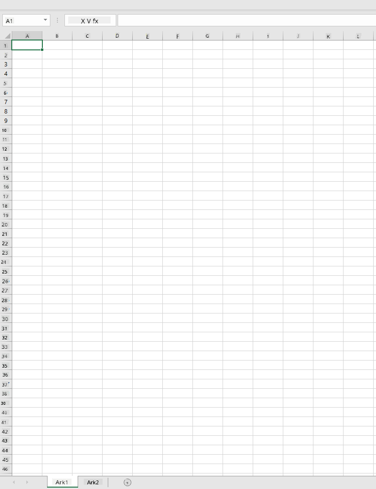
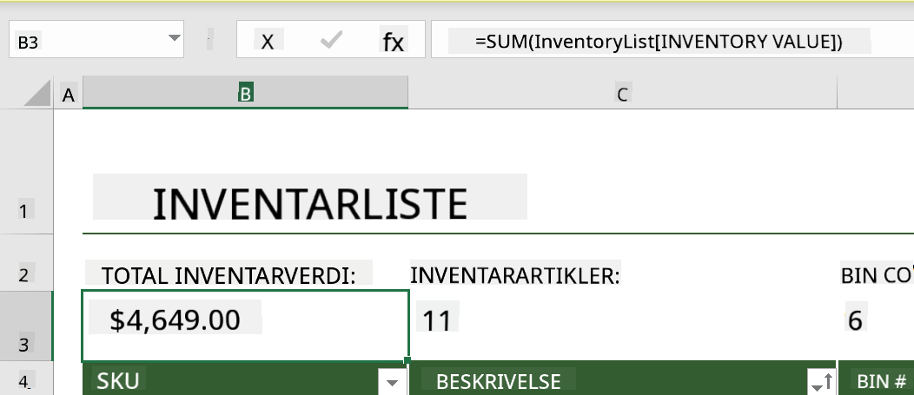
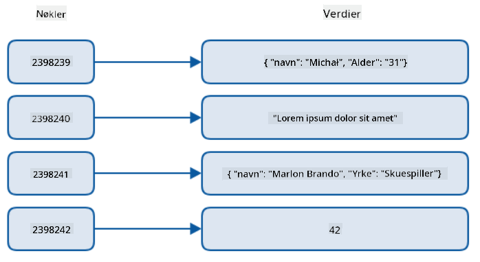
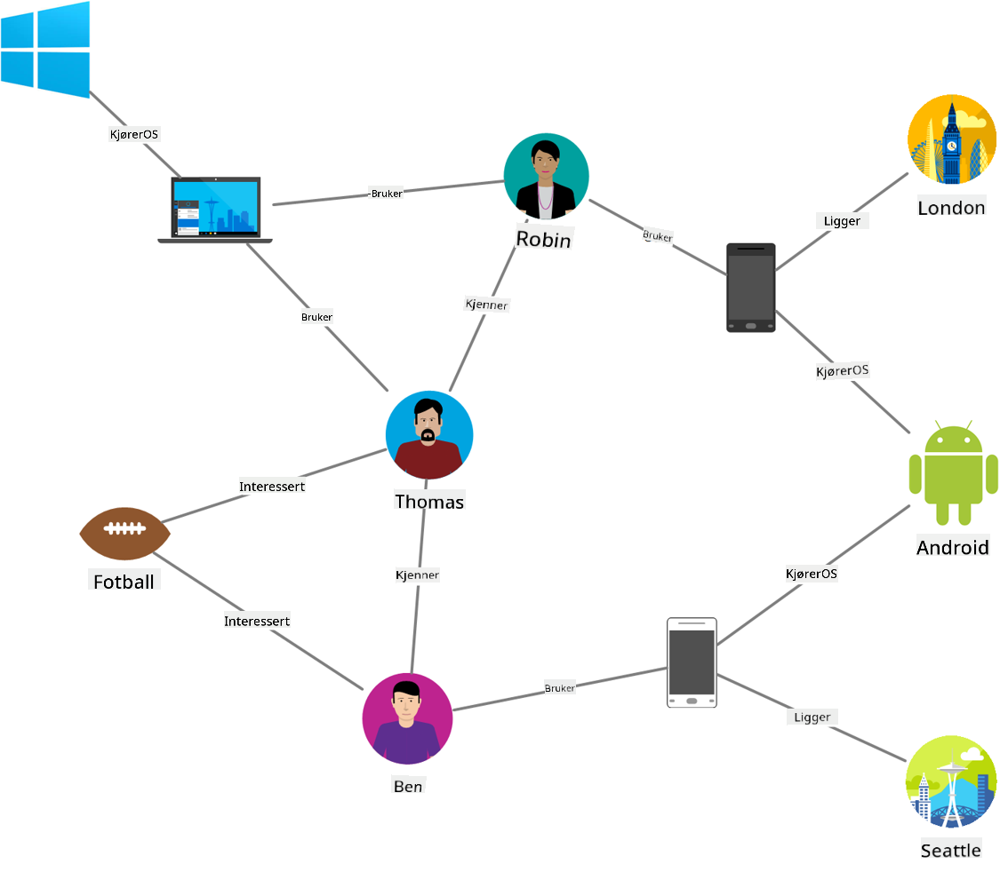
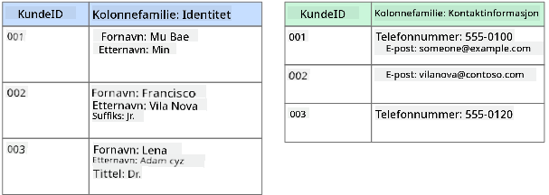
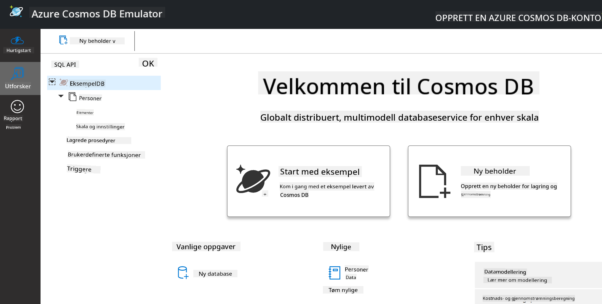
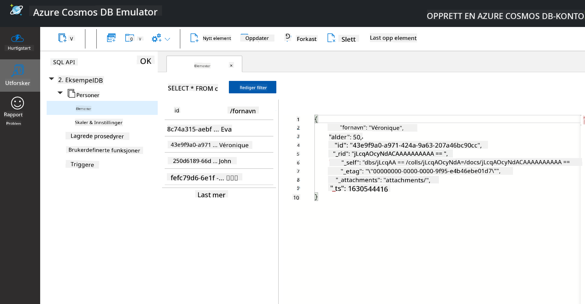
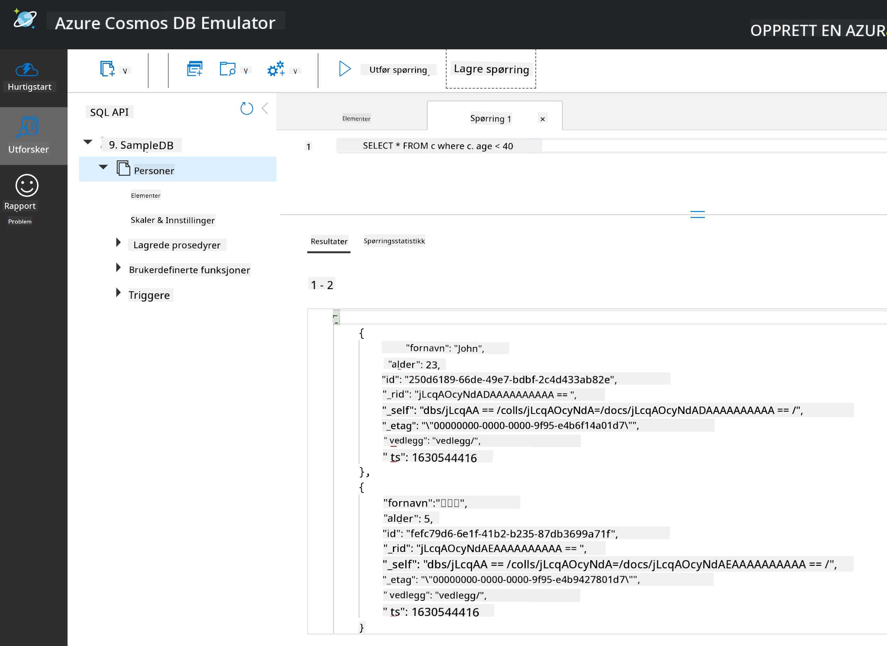

<!--
CO_OP_TRANSLATOR_METADATA:
{
  "original_hash": "54c5a1c74aecb69d2f9099300a4b7eea",
  "translation_date": "2025-09-04T19:24:17+00:00",
  "source_file": "2-Working-With-Data/06-non-relational/README.md",
  "language_code": "no"
}
-->
# Arbeide med data: Ikke-relasjonell data

| ](../../sketchnotes/06-NoSQL.png)|
|:---:|
|Arbeide med NoSQL-data - _Sketchnote av [@nitya](https://twitter.com/nitya)_ |

## [Quiz før forelesning](https://purple-hill-04aebfb03.1.azurestaticapps.net/quiz/10)

Data er ikke begrenset til relasjonsdatabaser. Denne leksjonen fokuserer på ikke-relasjonell data og vil dekke grunnleggende om regneark og NoSQL.

## Regneark

Regneark er en populær måte å lagre og utforske data på fordi det krever mindre arbeid å sette opp og komme i gang. I denne leksjonen vil du lære de grunnleggende komponentene i et regneark, samt formler og funksjoner. Eksemplene vil bli illustrert med Microsoft Excel, men de fleste deler og temaer vil ha lignende navn og trinn sammenlignet med andre regnearkprogrammer.



Et regneark er en fil og vil være tilgjengelig i filsystemet på en datamaskin, enhet eller skybasert filsystem. Selve programvaren kan være nettleserbasert eller en applikasjon som må installeres på en datamaskin eller lastes ned som en app. I Excel defineres disse filene også som **arbeidsbøker**, og denne terminologien vil bli brukt resten av leksjonen.

En arbeidsbok inneholder ett eller flere **regneark**, hvor hvert regneark er merket med faner. Innenfor et regneark er det rektangler kalt **celler**, som inneholder selve dataene. En celle er skjæringspunktet mellom en rad og en kolonne, hvor kolonnene er merket med alfabetiske tegn og radene er merket numerisk. Noen regneark vil inneholde overskrifter i de første radene for å beskrive dataene i en celle.

Med disse grunnleggende elementene i en Excel-arbeidsbok, vil vi bruke et eksempel fra [Microsoft Templates](https://templates.office.com/) fokusert på et lager for å gå gjennom noen flere deler av et regneark.

### Administrere et lager

Regnearkfilen kalt "InventoryExample" er et formatert regneark med varer i et lager som inneholder tre regneark, hvor fanene er merket "Inventory List", "Inventory Pick List" og "Bin Lookup". Rad 4 i regnearket Inventory List er overskriften, som beskriver verdien av hver celle i overskriftskolonnen.


Det finnes tilfeller der en celle er avhengig av verdiene i andre celler for å generere sin verdi. Lagerlisten holder oversikt over kostnaden for hver vare i lageret, men hva hvis vi trenger å vite verdien av alt i lageret? [**Formler**](https://support.microsoft.com/en-us/office/overview-of-formulas-34519a4e-1e8d-4f4b-84d4-d642c4f63263) utfører handlinger på celldata og brukes til å beregne lagerverdien i dette eksemplet. Dette regnearket brukte en formel i kolonnen Inventory Value for å beregne verdien av hver vare ved å multiplisere antallet under overskriften QTY og kostnadene under overskriften COST. Ved å dobbeltklikke eller markere en celle vil formelen vises. Du vil legge merke til at formler starter med et likhetstegn, etterfulgt av beregningen eller operasjonen.



Vi kan bruke en annen formel for å legge sammen alle verdiene i Inventory Value for å få den totale verdien. Dette kan beregnes ved å legge til hver celle for å generere summen, men det kan være en tidkrevende oppgave. Excel har [**funksjoner**](https://support.microsoft.com/en-us/office/sum-function-043e1c7d-7726-4e80-8f32-07b23e057f89), eller forhåndsdefinerte formler for å utføre beregninger på celldata. Funksjoner krever argumenter, som er de nødvendige verdiene som brukes til å utføre disse beregningene. Når funksjoner krever mer enn ett argument, må de listes i en bestemt rekkefølge, ellers kan funksjonen beregne feil verdi. Dette eksemplet bruker SUM-funksjonen og bruker verdiene i Inventory Value som argument for å generere totalen oppført under rad 3, kolonne B (også referert til som B3).

## NoSQL

NoSQL er et paraplybegrep for de forskjellige måtene å lagre ikke-relasjonell data på og kan tolkes som "non-SQL", "ikke-relasjonell" eller "ikke bare SQL". Disse typene databasesystemer kan kategoriseres i 4 typer.


> Kilde fra [Michał Białecki Blog](https://www.michalbialecki.com/2018/03/18/azure-cosmos-db-key-value-database-cloud/)

[Nøkkel-verdi](https://docs.microsoft.com/en-us/azure/architecture/data-guide/big-data/non-relational-data#keyvalue-data-stores) databaser kobler unike nøkler, som er en unik identifikator knyttet til en verdi. Disse parene lagres ved hjelp av en [hash-tabell](https://www.hackerearth.com/practice/data-structures/hash-tables/basics-of-hash-tables/tutorial/) med en passende hash-funksjon.


> Kilde fra [Microsoft](https://docs.microsoft.com/en-us/azure/cosmos-db/graph/graph-introduction#graph-database-by-example)

[Graf](https://docs.microsoft.com/en-us/azure/architecture/data-guide/big-data/non-relational-data#graph-data-stores) databaser beskriver forhold i data og er representert som en samling av noder og kanter. En node representerer en enhet, noe som eksisterer i den virkelige verden, som en student eller en bankutskrift. Kanter representerer forholdet mellom to enheter. Hver node og kant har egenskaper som gir tilleggsinformasjon om hver node og kant.



[Kolonnebaserte](https://docs.microsoft.com/en-us/azure/architecture/data-guide/big-data/non-relational-data#columnar-data-stores) databanker organiserer data i kolonner og rader som en relasjonell datastruktur, men hver kolonne er delt inn i grupper kalt en kolonnefamilie, hvor alle dataene under én kolonne er relatert og kan hentes og endres som en enhet.

### Dokumentdatabanker med Azure Cosmos DB

[Dokument](https://docs.microsoft.com/en-us/azure/architecture/data-guide/big-data/non-relational-data#document-data-stores) databanker bygger på konseptet med en nøkkel-verdi-databank og består av en serie felt og objekter. Denne delen vil utforske dokumentdatabaser med Cosmos DB-emulatoren.

En Cosmos DB-database passer definisjonen av "ikke bare SQL", hvor Cosmos DBs dokumentdatabase bruker SQL for å hente data. [Den forrige leksjonen](../05-relational-databases/README.md) om SQL dekker grunnleggende om språket, og vi vil kunne bruke noen av de samme spørringene på en dokumentdatabase her. Vi vil bruke Cosmos DB-emulatoren, som lar oss opprette og utforske en dokumentdatabase lokalt på en datamaskin. Les mer om emulatoren [her](https://docs.microsoft.com/en-us/azure/cosmos-db/local-emulator?tabs=ssl-netstd21).

Et dokument er en samling av felt og objektverdier, hvor feltene beskriver hva objektverdien representerer. Nedenfor er et eksempel på et dokument.

```json
{
    "firstname": "Eva",
    "age": 44,
    "id": "8c74a315-aebf-4a16-bb38-2430a9896ce5",
    "_rid": "bHwDAPQz8s0BAAAAAAAAAA==",
    "_self": "dbs/bHwDAA==/colls/bHwDAPQz8s0=/docs/bHwDAPQz8s0BAAAAAAAAAA==/",
    "_etag": "\"00000000-0000-0000-9f95-010a691e01d7\"",
    "_attachments": "attachments/",
    "_ts": 1630544034
}
```

Feltene av interesse i dette dokumentet er: `firstname`, `id` og `age`. Resten av feltene med understreker ble generert av Cosmos DB.

#### Utforske data med Cosmos DB-emulatoren

Du kan laste ned og installere emulatoren [for Windows her](https://aka.ms/cosmosdb-emulator). Se denne [dokumentasjonen](https://docs.microsoft.com/en-us/azure/cosmos-db/local-emulator?tabs=ssl-netstd21#run-on-linux-macos) for alternativer for hvordan du kan kjøre emulatoren for macOS og Linux.

Emulatoren åpner et nettleservindu, hvor Explorer-visningen lar deg utforske dokumenter.



Hvis du følger med, klikk på "Start with Sample" for å generere en eksempel-database kalt SampleDB. Hvis du utvider SampleDB ved å klikke på pilen, finner du en container kalt `Persons`. En container holder en samling av elementer, som er dokumentene innenfor containeren. Du kan utforske de fire individuelle dokumentene under `Items`.



#### Spørre dokumentdata med Cosmos DB-emulatoren

Vi kan også spørre eksempeldataene ved å klikke på knappen for ny SQL-spørring (andre knapp fra venstre).

`SELECT * FROM c` returnerer alle dokumentene i containeren. La oss legge til en where-klausul og finne alle som er yngre enn 40.

`SELECT * FROM c where c.age < 40`



Spørringen returnerer to dokumenter, legg merke til at alder-verdien for hvert dokument er mindre enn 40.

#### JSON og dokumenter

Hvis du er kjent med JavaScript Object Notation (JSON), vil du legge merke til at dokumenter ligner på JSON. Det finnes en `PersonsData.json`-fil i denne katalogen med mer data som du kan laste opp til Persons-containeren i emulatoren via `Upload Item`-knappen.

I de fleste tilfeller kan API-er som returnerer JSON-data direkte overføres og lagres i dokumentdatabaser. Nedenfor er et annet dokument, det representerer tweets fra Microsofts Twitter-konto som ble hentet ved hjelp av Twitter API, og deretter satt inn i Cosmos DB.

```json
{
    "created_at": "2021-08-31T19:03:01.000Z",
    "id": "1432780985872142341",
    "text": "Blank slate. Like this tweet if you’ve ever painted in Microsoft Paint before. https://t.co/cFeEs8eOPK",
    "_rid": "dhAmAIUsA4oHAAAAAAAAAA==",
    "_self": "dbs/dhAmAA==/colls/dhAmAIUsA4o=/docs/dhAmAIUsA4oHAAAAAAAAAA==/",
    "_etag": "\"00000000-0000-0000-9f84-a0958ad901d7\"",
    "_attachments": "attachments/",
    "_ts": 1630537000
```

Feltene av interesse i dette dokumentet er: `created_at`, `id` og `text`.

## 🚀 Utfordring

Det finnes en `TwitterData.json`-fil som du kan laste opp til SampleDB-databasen. Det anbefales at du legger den til i en separat container. Dette kan gjøres ved:

1. Klikke på knappen for ny container øverst til høyre
1. Velge den eksisterende databasen (SampleDB) og opprette en container-ID for containeren
1. Sette partisjonsnøkkelen til `/id`
1. Klikke OK (du kan ignorere resten av informasjonen i denne visningen siden dette er et lite datasett som kjører lokalt på maskinen din)
1. Åpne den nye containeren din og laste opp Twitter Data-filen med `Upload Item`-knappen

Prøv å kjøre noen SELECT-spørringer for å finne dokumentene som har Microsoft i tekstfeltet. Hint: prøv å bruke [LIKE-nøkkelordet](https://docs.microsoft.com/en-us/azure/cosmos-db/sql/sql-query-keywords#using-like-with-the--wildcard-character)

## [Quiz etter forelesning](https://ff-quizzes.netlify.app/en/ds/)

## Gjennomgang og selvstudium

- Det finnes noen ekstra formateringsalternativer og funksjoner lagt til dette regnearket som denne leksjonen ikke dekker. Microsoft har et [stort bibliotek med dokumentasjon og videoer](https://support.microsoft.com/excel) om Excel hvis du er interessert i å lære mer.

- Denne arkitekturdokumentasjonen beskriver egenskapene til de forskjellige typene ikke-relasjonell data: [Ikke-relasjonell data og NoSQL](https://docs.microsoft.com/en-us/azure/architecture/data-guide/big-data/non-relational-data)

- Cosmos DB er en skybasert ikke-relasjonell database som også kan lagre de forskjellige NoSQL-typene nevnt i denne leksjonen. Lær mer om disse typene i denne [Cosmos DB Microsoft Learn-modulen](https://docs.microsoft.com/en-us/learn/paths/work-with-nosql-data-in-azure-cosmos-db/)

## Oppgave

[Soda Profits](assignment.md)

---

**Ansvarsfraskrivelse**:  
Dette dokumentet er oversatt ved hjelp av AI-oversettelsestjenesten [Co-op Translator](https://github.com/Azure/co-op-translator). Selv om vi streber etter nøyaktighet, vær oppmerksom på at automatiserte oversettelser kan inneholde feil eller unøyaktigheter. Det originale dokumentet på sitt opprinnelige språk bør anses som den autoritative kilden. For kritisk informasjon anbefales profesjonell menneskelig oversettelse. Vi er ikke ansvarlige for eventuelle misforståelser eller feiltolkninger som oppstår ved bruk av denne oversettelsen.