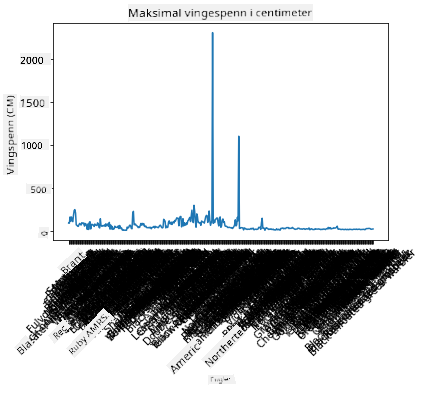
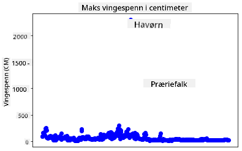
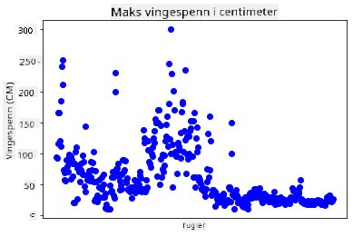
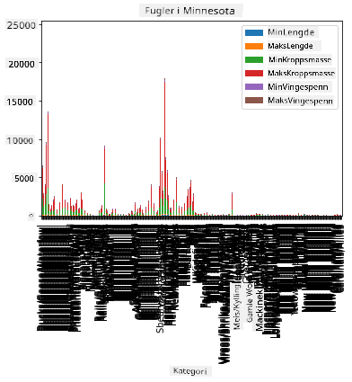
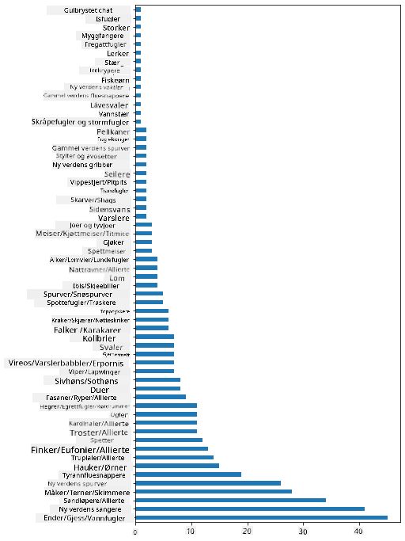
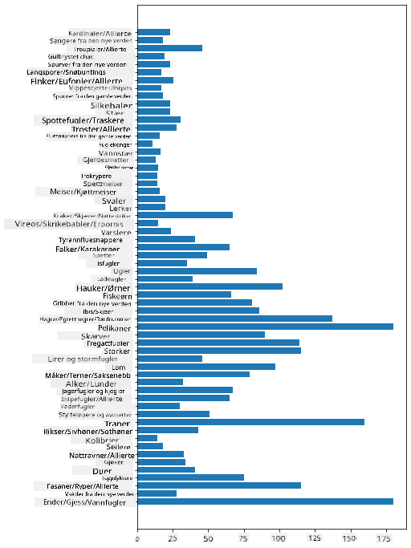
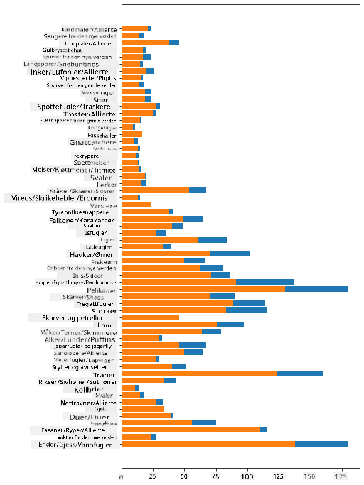

<!--
CO_OP_TRANSLATOR_METADATA:
{
  "original_hash": "69b32b6789a91f796ebc7a02f5575e03",
  "translation_date": "2025-09-04T19:30:04+00:00",
  "source_file": "3-Data-Visualization/09-visualization-quantities/README.md",
  "language_code": "no"
}
-->
# Visualisering av mengder

| ](../../sketchnotes/09-Visualizing-Quantities.png)|
|:---:|
| Visualisering av mengder - _Sketchnote av [@nitya](https://twitter.com/nitya)_ |

I denne leksjonen skal du utforske hvordan du kan bruke en av de mange tilgjengelige Python-bibliotekene for å lære å lage interessante visualiseringer rundt konseptet mengde. Ved å bruke et renset datasett om fugler i Minnesota, kan du lære mange interessante fakta om det lokale dyrelivet.  
## [Quiz før leksjonen](https://purple-hill-04aebfb03.1.azurestaticapps.net/quiz/16)

## Observer vingespenn med Matplotlib

Et utmerket bibliotek for å lage både enkle og avanserte diagrammer og grafer av ulike typer er [Matplotlib](https://matplotlib.org/stable/index.html). Generelt sett innebærer prosessen med å visualisere data ved hjelp av disse bibliotekene å identifisere delene av datarammen du vil fokusere på, utføre nødvendige transformasjoner på dataene, tilordne verdier til x- og y-aksen, bestemme hvilken type diagram du vil vise, og deretter vise diagrammet. Matplotlib tilbyr et stort utvalg av visualiseringer, men for denne leksjonen skal vi fokusere på de som er mest passende for å visualisere mengder: linjediagrammer, spredningsdiagrammer og stolpediagrammer.

> ✅ Bruk det beste diagrammet som passer til datastrukturen og historien du vil fortelle.  
> - For å analysere trender over tid: linje  
> - For å sammenligne verdier: stolpe, kolonne, sektordiagram, spredningsdiagram  
> - For å vise hvordan deler forholder seg til helheten: sektordiagram  
> - For å vise distribusjon av data: spredningsdiagram, stolpe  
> - For å vise trender: linje, kolonne  
> - For å vise relasjoner mellom verdier: linje, spredningsdiagram, boblediagram  

Hvis du har et datasett og trenger å finne ut hvor mye av en gitt vare som er inkludert, vil en av de første oppgavene være å inspisere verdiene.

✅ Det finnes veldig gode 'jukseark' tilgjengelig for Matplotlib [her](https://matplotlib.org/cheatsheets/cheatsheets.pdf).

## Lag et linjediagram om fuglenes vingespennverdier

Åpne filen `notebook.ipynb` i roten av denne leksjonsmappen og legg til en celle.

> Merk: dataene er lagret i roten av dette repoet i `/data`-mappen.

```python
import pandas as pd
import matplotlib.pyplot as plt
birds = pd.read_csv('../../data/birds.csv')
birds.head()
```  
Disse dataene er en blanding av tekst og tall:

|      | Navn                         | VitenskapeligNavn      | Kategori              | Orden        | Familie  | Slekt       | Bevaringsstatus     | MinLengde | MaxLengde | MinKroppsmasse | MaxKroppsmasse | MinVingespenn | MaxVingespenn |
| ---: | :--------------------------- | :--------------------- | :-------------------- | :----------- | :------- | :---------- | :----------------- | --------: | --------: | ------------: | ------------: | ------------: | ------------: |
|    0 | Svartbukket plystreand       | Dendrocygna autumnalis | Ender/Gjess/Vannfugl | Anseriformes | Anatidae | Dendrocygna | LC                 |        47 |        56 |           652 |          1020 |            76 |            94 |
|    1 | Rødplystreand                | Dendrocygna bicolor    | Ender/Gjess/Vannfugl | Anseriformes | Anatidae | Dendrocygna | LC                 |        45 |        53 |           712 |          1050 |            85 |            93 |
|    2 | Snøgås                       | Anser caerulescens     | Ender/Gjess/Vannfugl | Anseriformes | Anatidae | Anser       | LC                 |        64 |        79 |          2050 |          4050 |           135 |           165 |
|    3 | Ross' gås                    | Anser rossii           | Ender/Gjess/Vannfugl | Anseriformes | Anatidae | Anser       | LC                 |      57.3 |        64 |          1066 |          1567 |           113 |           116 |
|    4 | Tundragås                    | Anser albifrons        | Ender/Gjess/Vannfugl | Anseriformes | Anatidae | Anser       | LC                 |        64 |        81 |          1930 |          3310 |           130 |           165 |

La oss begynne med å visualisere noen av de numeriske dataene ved hjelp av et grunnleggende linjediagram. Anta at du vil ha en oversikt over det maksimale vingespennet for disse interessante fuglene.

```python
wingspan = birds['MaxWingspan'] 
wingspan.plot()
```  


Hva legger du merke til med en gang? Det ser ut til å være minst én uteligger – det er et ganske imponerende vingespenn! Et vingespenn på 2300 centimeter tilsvarer 23 meter – er det Pterodaktyler som flyr rundt i Minnesota? La oss undersøke.

Selv om du kunne gjort et raskt sorteringsarbeid i Excel for å finne disse uteliggerne, som sannsynligvis er skrivefeil, fortsetter vi visualiseringsprosessen ved å jobbe fra diagrammet.

Legg til etiketter på x-aksen for å vise hvilke fugler det er snakk om:

```
plt.title('Max Wingspan in Centimeters')
plt.ylabel('Wingspan (CM)')
plt.xlabel('Birds')
plt.xticks(rotation=45)
x = birds['Name'] 
y = birds['MaxWingspan']

plt.plot(x, y)

plt.show()
```  


Selv med rotasjonen av etikettene satt til 45 grader, er det for mange til å lese. La oss prøve en annen strategi: merk bare uteliggerne og sett etikettene innenfor diagrammet. Du kan bruke et spredningsdiagram for å få mer plass til merkingen:

```python
plt.title('Max Wingspan in Centimeters')
plt.ylabel('Wingspan (CM)')
plt.tick_params(axis='both',which='both',labelbottom=False,bottom=False)

for i in range(len(birds)):
    x = birds['Name'][i]
    y = birds['MaxWingspan'][i]
    plt.plot(x, y, 'bo')
    if birds['MaxWingspan'][i] > 500:
        plt.text(x, y * (1 - 0.05), birds['Name'][i], fontsize=12)
    
plt.show()
```  
Hva skjer her? Du brukte `tick_params` for å skjule de nederste etikettene og deretter opprettet en løkke over fugledatasettet ditt. Ved å plotte diagrammet med små runde blå prikker ved hjelp av `bo`, sjekket du om noen fugl hadde et maksimalt vingespenn over 500 og viste etiketten ved siden av prikken hvis det var tilfelle. Du forskjøv etikettene litt på y-aksen (`y * (1 - 0.05)`) og brukte fuglens navn som etikett.

Hva oppdaget du?

  
## Filtrer dataene dine

Både Hodeørn og Præriefalk, som sannsynligvis er veldig store fugler, ser ut til å være feilmerket, med en ekstra `0` lagt til deres maksimale vingespenn. Det er lite sannsynlig at du møter en Hodeørn med et vingespenn på 25 meter, men hvis du gjør det, gi oss beskjed! La oss lage en ny dataramme uten disse to uteliggerne:

```python
plt.title('Max Wingspan in Centimeters')
plt.ylabel('Wingspan (CM)')
plt.xlabel('Birds')
plt.tick_params(axis='both',which='both',labelbottom=False,bottom=False)
for i in range(len(birds)):
    x = birds['Name'][i]
    y = birds['MaxWingspan'][i]
    if birds['Name'][i] not in ['Bald eagle', 'Prairie falcon']:
        plt.plot(x, y, 'bo')
plt.show()
```  

Ved å filtrere ut uteliggerne er dataene dine nå mer sammenhengende og forståelige.

  

Nå som vi har et renere datasett, i det minste når det gjelder vingespenn, la oss oppdage mer om disse fuglene.

Mens linje- og spredningsdiagrammer kan vise informasjon om dataverdier og deres distribusjoner, vil vi tenke på verdiene som ligger i dette datasettet. Du kan lage visualiseringer for å svare på følgende spørsmål om mengde:

> Hvor mange kategorier av fugler finnes det, og hva er antallet?  
> Hvor mange fugler er utryddet, truet, sjeldne eller vanlige?  
> Hvor mange finnes det av de ulike slektene og ordenene i Linnés terminologi?  
## Utforsk stolpediagrammer

Stolpediagrammer er praktiske når du trenger å vise grupperinger av data. La oss utforske fuglekategoriene som finnes i dette datasettet for å se hvilken som er mest vanlig i antall.

I notebook-filen, lag et grunnleggende stolpediagram.

✅ Merk, du kan enten filtrere ut de to uteliggerfuglene vi identifiserte i forrige seksjon, redigere skrivefeilen i deres vingespenn, eller la dem være med for disse øvelsene som ikke avhenger av vingespennverdier.

Hvis du vil lage et stolpediagram, kan du velge dataene du vil fokusere på. Stolpediagrammer kan lages fra rådata:

```python
birds.plot(x='Category',
        kind='bar',
        stacked=True,
        title='Birds of Minnesota')

```  
  

Dette stolpediagrammet er imidlertid uleselig fordi det er for mye ugruppert data. Du må velge bare de dataene du vil plotte, så la oss se på lengden av fugler basert på deres kategori.

Filtrer dataene dine til å inkludere bare fuglens kategori.

✅ Legg merke til at du bruker Pandas for å administrere dataene, og deretter lar Matplotlib gjøre diagrammene.

Siden det er mange kategorier, kan du vise dette diagrammet vertikalt og justere høyden for å ta hensyn til alle dataene:

```python
category_count = birds.value_counts(birds['Category'].values, sort=True)
plt.rcParams['figure.figsize'] = [6, 12]
category_count.plot.barh()
```  
  

Dette stolpediagrammet gir en god oversikt over antallet fugler i hver kategori. Med et blikk ser du at det største antallet fugler i denne regionen er i kategorien Ender/Gjess/Vannfugl. Minnesota er 'landet med 10 000 innsjøer', så dette er ikke overraskende!

✅ Prøv noen andre tellinger på dette datasettet. Er det noe som overrasker deg?

## Sammenligne data

Du kan prøve forskjellige sammenligninger av gruppert data ved å lage nye akser. Prøv en sammenligning av MaxLengde på en fugl, basert på dens kategori:

```python
maxlength = birds['MaxLength']
plt.barh(y=birds['Category'], width=maxlength)
plt.rcParams['figure.figsize'] = [6, 12]
plt.show()
```  
  

Ingenting er overraskende her: kolibrier har minst MaxLengde sammenlignet med pelikaner eller gjess. Det er bra når data gir logisk mening!

Du kan lage mer interessante visualiseringer av stolpediagrammer ved å legge data oppå hverandre. La oss legge Minimum og Maksimum Lengde oppå en gitt fuglekategori:

```python
minLength = birds['MinLength']
maxLength = birds['MaxLength']
category = birds['Category']

plt.barh(category, maxLength)
plt.barh(category, minLength)

plt.show()
```  
I dette diagrammet kan du se området per fuglekategori for Minimum Lengde og Maksimum Lengde. Du kan trygt si at, gitt disse dataene, jo større fuglen er, desto større er lengdeområdet. Fascinerende!

  

## 🚀 Utfordring

Dette fugledatasettet tilbyr en mengde informasjon om ulike typer fugler innenfor et bestemt økosystem. Søk rundt på internett og se om du kan finne andre fugleorienterte datasett. Øv på å lage diagrammer og grafer rundt disse fuglene for å oppdage fakta du ikke var klar over.

## [Quiz etter leksjonen](https://ff-quizzes.netlify.app/en/ds/)

## Gjennomgang & Selvstudium

Denne første leksjonen har gitt deg litt informasjon om hvordan du kan bruke Matplotlib til å visualisere mengder. Gjør litt research rundt andre måter å jobbe med datasett for visualisering. [Plotly](https://github.com/plotly/plotly.py) er et verktøy vi ikke vil dekke i disse leksjonene, så ta en titt på hva det kan tilby.  
## Oppgave

[Linjer, Spredning og Stolper](assignment.md)  

---

**Ansvarsfraskrivelse**:  
Dette dokumentet er oversatt ved hjelp av AI-oversettelsestjenesten [Co-op Translator](https://github.com/Azure/co-op-translator). Selv om vi streber etter nøyaktighet, vær oppmerksom på at automatiserte oversettelser kan inneholde feil eller unøyaktigheter. Det originale dokumentet på sitt opprinnelige språk bør anses som den autoritative kilden. For kritisk informasjon anbefales profesjonell menneskelig oversettelse. Vi er ikke ansvarlige for misforståelser eller feiltolkninger som oppstår ved bruk av denne oversettelsen.