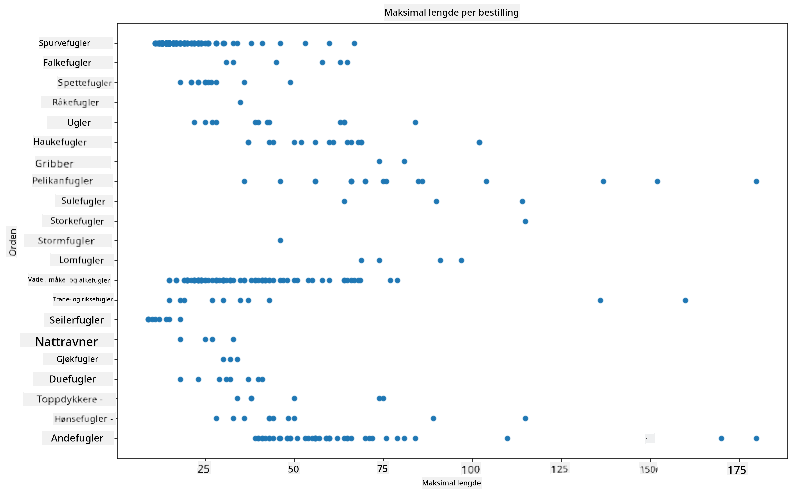
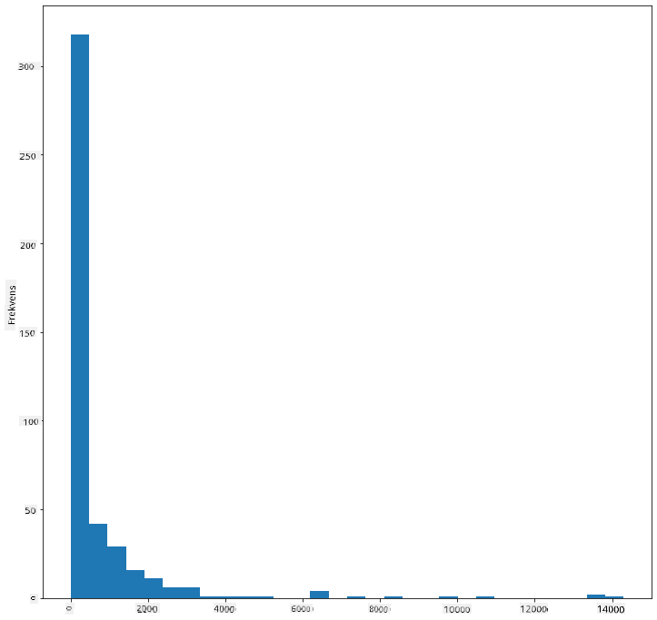
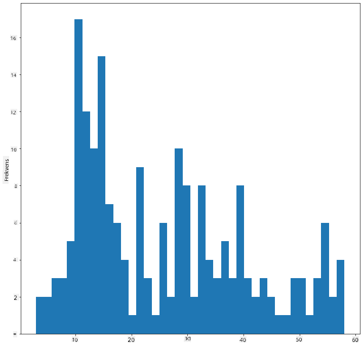
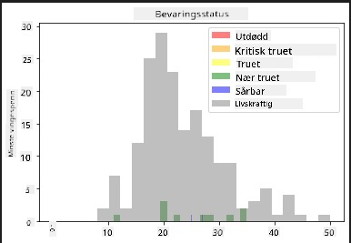
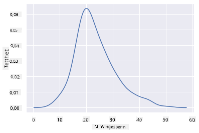
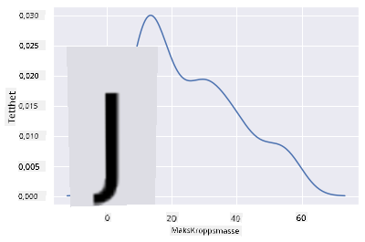
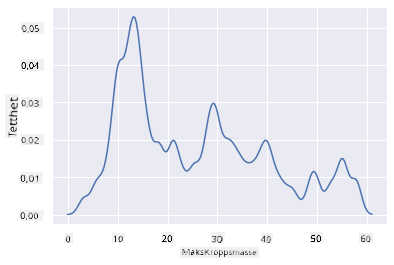
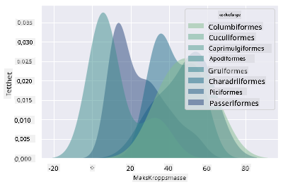
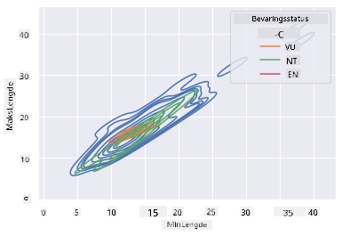

<!--
CO_OP_TRANSLATOR_METADATA:
{
  "original_hash": "87faccac113d772551486a67a607153e",
  "translation_date": "2025-08-26T22:49:49+00:00",
  "source_file": "3-Data-Visualization/10-visualization-distributions/README.md",
  "language_code": "no"
}
-->
# Visualisering av fordelinger

| ](../../sketchnotes/10-Visualizing-Distributions.png)|
|:---:|
| Visualisering av fordelinger - _Sketchnote av [@nitya](https://twitter.com/nitya)_ |

I forrige leksjon lærte du noen interessante fakta om et datasett om fuglene i Minnesota. Du oppdaget feilaktige data ved å visualisere uteliggere og så på forskjellene mellom fuglekategorier basert på deres maksimale lengde.

## [Quiz før leksjonen](https://purple-hill-04aebfb03.1.azurestaticapps.net/quiz/18)
## Utforsk fugledatasettet

En annen måte å utforske data på er ved å se på fordelingen, eller hvordan dataene er organisert langs en akse. Kanskje du for eksempel ønsker å lære om den generelle fordelingen i dette datasettet av maksimal vingespenn eller maksimal kroppsmasse for fuglene i Minnesota.

La oss oppdage noen fakta om fordelingen av data i dette datasettet. I _notebook.ipynb_-filen i roten av denne leksjonsmappen, importer Pandas, Matplotlib og dataene dine:

```python
import pandas as pd
import matplotlib.pyplot as plt
birds = pd.read_csv('../../data/birds.csv')
birds.head()
```

|      | Navn                         | VitenskapeligNavn      | Kategori              | Orden        | Familie  | Slekt       | Bevaringsstatus    | MinLengde | MaxLengde | MinKroppsmasse | MaxKroppsmasse | MinVingespenn | MaxVingespenn |
| ---: | :--------------------------- | :--------------------- | :-------------------- | :----------- | :------- | :---------- | :----------------- | --------: | --------: | -------------: | -------------: | ------------: | ------------: |
|    0 | Svartbukfløyteand            | Dendrocygna autumnalis | Ender/Gjess/Vannfugl  | Anseriformes | Anatidae | Dendrocygna | LC                 |        47 |        56 |            652 |           1020 |            76 |            94 |
|    1 | Brunfløyteand                | Dendrocygna bicolor    | Ender/Gjess/Vannfugl  | Anseriformes | Anatidae | Dendrocygna | LC                 |        45 |        53 |            712 |           1050 |            85 |            93 |
|    2 | Snøgås                       | Anser caerulescens     | Ender/Gjess/Vannfugl  | Anseriformes | Anatidae | Anser       | LC                 |        64 |        79 |           2050 |           4050 |           135 |           165 |
|    3 | Rossgås                      | Anser rossii           | Ender/Gjess/Vannfugl  | Anseriformes | Anatidae | Anser       | LC                 |      57.3 |        64 |           1066 |           1567 |           113 |           116 |
|    4 | Tundragås                    | Anser albifrons        | Ender/Gjess/Vannfugl  | Anseriformes | Anatidae | Anser       | LC                 |        64 |        81 |           1930 |           3310 |           130 |           165 |

Generelt kan du raskt se hvordan dataene er fordelt ved å bruke et spredningsdiagram, slik vi gjorde i forrige leksjon:

```python
birds.plot(kind='scatter',x='MaxLength',y='Order',figsize=(12,8))

plt.title('Max Length per Order')
plt.ylabel('Order')
plt.xlabel('Max Length')

plt.show()
```


Dette gir en oversikt over den generelle fordelingen av kroppslengde per fugleorden, men det er ikke den optimale måten å vise sanne fordelinger på. Denne oppgaven håndteres vanligvis ved å lage et histogram.
## Arbeid med histogrammer

Matplotlib tilbyr svært gode måter å visualisere datafordeling ved hjelp av histogrammer. Denne typen diagram ligner et stolpediagram der fordelingen kan sees gjennom stigning og fall av stolpene. For å lage et histogram trenger du numeriske data. For å lage et histogram kan du plotte et diagram og definere typen som 'hist' for histogram. Dette diagrammet viser fordelingen av MaxBodyMass for hele datasettets numeriske data. Ved å dele opp datasettet i mindre grupper (bins), kan det vise fordelingen av verdiene:

```python
birds['MaxBodyMass'].plot(kind = 'hist', bins = 10, figsize = (12,12))
plt.show()
```


Som du kan se, faller de fleste av de 400+ fuglene i dette datasettet innenfor området under 2000 for deres maksimale kroppsmasse. Få mer innsikt i dataene ved å endre `bins`-parameteren til et høyere tall, for eksempel 30:

```python
birds['MaxBodyMass'].plot(kind = 'hist', bins = 30, figsize = (12,12))
plt.show()
```


Dette diagrammet viser fordelingen på en litt mer detaljert måte. Et diagram som er mindre skjevt mot venstre kan opprettes ved å sørge for at du bare velger data innenfor et gitt område:

Filtrer dataene dine for å få kun de fuglene som har kroppsmasse under 60, og vis 40 `bins`:

```python
filteredBirds = birds[(birds['MaxBodyMass'] > 1) & (birds['MaxBodyMass'] < 60)]      
filteredBirds['MaxBodyMass'].plot(kind = 'hist',bins = 40,figsize = (12,12))
plt.show()     
```


✅ Prøv noen andre filtre og datapunkter. For å se hele fordelingen av dataene, fjern `['MaxBodyMass']`-filteret for å vise merkede fordelinger.

Histogrammet tilbyr også noen fine farge- og merkeforbedringer å prøve:

Lag et 2D-histogram for å sammenligne forholdet mellom to fordelinger. La oss sammenligne `MaxBodyMass` og `MaxLength`. Matplotlib tilbyr en innebygd måte å vise konvergens ved hjelp av lysere farger:

```python
x = filteredBirds['MaxBodyMass']
y = filteredBirds['MaxLength']

fig, ax = plt.subplots(tight_layout=True)
hist = ax.hist2d(x, y)
```
Det ser ut til å være en forventet korrelasjon mellom disse to elementene langs en forventet akse, med ett spesielt sterkt punkt av konvergens:


Histogrammer fungerer godt som standard for numeriske data. Hva om du trenger å se fordelinger basert på tekstdata? 
## Utforsk datasettet for fordelinger ved hjelp av tekstdata 

Dette datasettet inkluderer også god informasjon om fuglekategori, slekt, art og familie, samt bevaringsstatus. La oss grave i denne bevaringsinformasjonen. Hva er fordelingen av fuglene i henhold til deres bevaringsstatus?

> ✅ I datasettet brukes flere akronymer for å beskrive bevaringsstatus. Disse akronymene kommer fra [IUCNs rødlistekategorier](https://www.iucnredlist.org/), en organisasjon som katalogiserer arters status.
> 
> - CR: Kritisk truet
> - EN: Truet
> - EX: Utdødd
> - LC: Livskraftig
> - NT: Nær truet
> - VU: Sårbar

Dette er tekstbaserte verdier, så du må gjøre en transformasjon for å lage et histogram. Ved å bruke `filteredBirds`-dataframen, vis bevaringsstatusen sammen med minimum vingespenn. Hva ser du? 

```python
x1 = filteredBirds.loc[filteredBirds.ConservationStatus=='EX', 'MinWingspan']
x2 = filteredBirds.loc[filteredBirds.ConservationStatus=='CR', 'MinWingspan']
x3 = filteredBirds.loc[filteredBirds.ConservationStatus=='EN', 'MinWingspan']
x4 = filteredBirds.loc[filteredBirds.ConservationStatus=='NT', 'MinWingspan']
x5 = filteredBirds.loc[filteredBirds.ConservationStatus=='VU', 'MinWingspan']
x6 = filteredBirds.loc[filteredBirds.ConservationStatus=='LC', 'MinWingspan']

kwargs = dict(alpha=0.5, bins=20)

plt.hist(x1, **kwargs, color='red', label='Extinct')
plt.hist(x2, **kwargs, color='orange', label='Critically Endangered')
plt.hist(x3, **kwargs, color='yellow', label='Endangered')
plt.hist(x4, **kwargs, color='green', label='Near Threatened')
plt.hist(x5, **kwargs, color='blue', label='Vulnerable')
plt.hist(x6, **kwargs, color='gray', label='Least Concern')

plt.gca().set(title='Conservation Status', ylabel='Min Wingspan')
plt.legend();
```



Det ser ikke ut til å være en god korrelasjon mellom minimum vingespenn og bevaringsstatus. Test andre elementer i datasettet ved hjelp av denne metoden. Du kan også prøve forskjellige filtre. Finner du noen korrelasjon?

## Tetthetsdiagrammer

Du har kanskje lagt merke til at histogrammene vi har sett på så langt er 'trinnvise' og ikke flyter jevnt i en bue. For å vise et jevnere tetthetsdiagram kan du prøve et tetthetsplott.

For å jobbe med tetthetsdiagrammer, gjør deg kjent med et nytt plottebibliotek, [Seaborn](https://seaborn.pydata.org/generated/seaborn.kdeplot.html). 

Last inn Seaborn og prøv et grunnleggende tetthetsdiagram:

```python
import seaborn as sns
import matplotlib.pyplot as plt
sns.kdeplot(filteredBirds['MinWingspan'])
plt.show()
```


Du kan se hvordan diagrammet gjenspeiler det forrige for Minimum Vingespenn-data; det er bare litt jevnere. Ifølge Seaborns dokumentasjon, "Sammenlignet med et histogram kan KDE produsere et diagram som er mindre rotete og mer tolkningsbart, spesielt når man tegner flere fordelinger. Men det har potensial til å introdusere forvrengninger hvis den underliggende fordelingen er avgrenset eller ikke jevn. Som et histogram avhenger også kvaliteten på representasjonen av valget av gode jevningsparametere." [kilde](https://seaborn.pydata.org/generated/seaborn.kdeplot.html) Med andre ord, uteliggere vil som alltid få diagrammene dine til å oppføre seg dårlig.

Hvis du ønsket å se på den hakkete MaxBodyMass-linjen i det andre diagrammet du bygde, kunne du jevne den ut veldig godt ved å gjenskape den ved hjelp av denne metoden:

```python
sns.kdeplot(filteredBirds['MaxBodyMass'])
plt.show()
```


Hvis du ønsket en jevn, men ikke for jevn linje, kan du redigere `bw_adjust`-parameteren: 

```python
sns.kdeplot(filteredBirds['MaxBodyMass'], bw_adjust=.2)
plt.show()
```


✅ Les om parameterne som er tilgjengelige for denne typen diagram og eksperimenter!

Denne typen diagram tilbyr vakkert forklarende visualiseringer. Med noen få linjer kode kan du for eksempel vise maksimal kroppsmasse-tetthet per fugleorden:

```python
sns.kdeplot(
   data=filteredBirds, x="MaxBodyMass", hue="Order",
   fill=True, common_norm=False, palette="crest",
   alpha=.5, linewidth=0,
)
```



Du kan også kartlegge tettheten av flere variabler i ett diagram. Test MaxLength og MinLength for en fugl sammenlignet med deres bevaringsstatus:

```python
sns.kdeplot(data=filteredBirds, x="MinLength", y="MaxLength", hue="ConservationStatus")
```



Kanskje det er verdt å undersøke om klyngen av 'Sårbare' fugler i henhold til lengdene deres er meningsfull eller ikke.

## 🚀 Utfordring

Histogrammer er en mer sofistikert type diagram enn grunnleggende spredningsdiagrammer, stolpediagrammer eller linjediagrammer. Gjør et søk på internett for å finne gode eksempler på bruk av histogrammer. Hvordan brukes de, hva demonstrerer de, og i hvilke felt eller områder brukes de vanligvis?

## [Quiz etter leksjonen](https://purple-hill-04aebfb03.1.azurestaticapps.net/quiz/19)

## Gjennomgang og selvstudium

I denne leksjonen brukte du Matplotlib og begynte å jobbe med Seaborn for å lage mer sofistikerte diagrammer. Gjør litt research på `kdeplot` i Seaborn, en "kontinuerlig sannsynlighetstetthetskurve i en eller flere dimensjoner". Les gjennom [dokumentasjonen](https://seaborn.pydata.org/generated/seaborn.kdeplot.html) for å forstå hvordan det fungerer.

## Oppgave

[Bruk ferdighetene dine](assignment.md)

---

**Ansvarsfraskrivelse**:  
Dette dokumentet er oversatt ved hjelp av AI-oversettelsestjenesten [Co-op Translator](https://github.com/Azure/co-op-translator). Selv om vi tilstreber nøyaktighet, vennligst vær oppmerksom på at automatiserte oversettelser kan inneholde feil eller unøyaktigheter. Det originale dokumentet på sitt opprinnelige språk bør betraktes som den autoritative kilden. For kritisk informasjon anbefales profesjonell menneskelig oversettelse. Vi er ikke ansvarlige for eventuelle misforståelser eller feiltolkninger som oppstår ved bruk av denne oversettelsen.