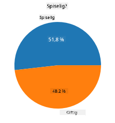
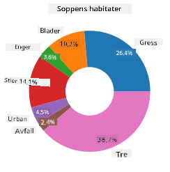
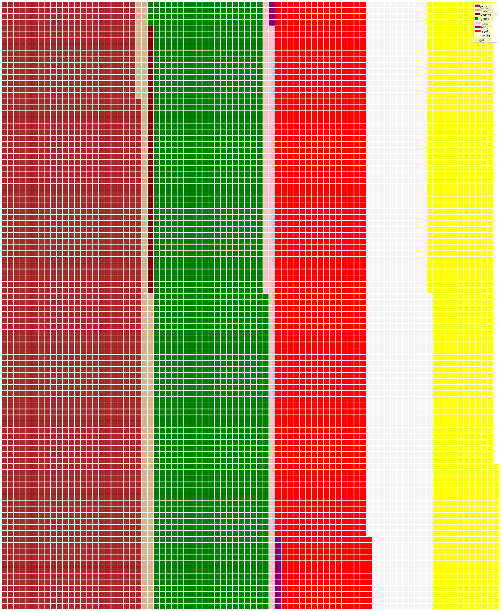

<!--
CO_OP_TRANSLATOR_METADATA:
{
  "original_hash": "af6a12015c6e250e500b570a9fa42593",
  "translation_date": "2025-08-26T23:22:50+00:00",
  "source_file": "3-Data-Visualization/11-visualization-proportions/README.md",
  "language_code": "no"
}
-->
# Visualisering av proporsjoner

| ](../../sketchnotes/11-Visualizing-Proportions.png)|
|:---:|
|Visualisering av proporsjoner - _Sketchnote av [@nitya](https://twitter.com/nitya)_ |

I denne leksjonen skal du bruke et annet naturfokusert datasett for å visualisere proporsjoner, som hvor mange forskjellige typer sopp som finnes i et gitt datasett om sopper. La oss utforske disse fascinerende soppene ved hjelp av et datasett hentet fra Audubon, som inneholder detaljer om 23 arter av skivesopper i Agaricus- og Lepiota-familiene. Du vil eksperimentere med smakfulle visualiseringer som:

- Kakediagrammer 🥧
- Smultringdiagrammer 🍩
- Vaffeldiagrammer 🧇

> 💡 Et veldig interessant prosjekt kalt [Charticulator](https://charticulator.com) fra Microsoft Research tilbyr et gratis dra-og-slipp-grensesnitt for datavisualiseringer. I en av deres opplæringer bruker de også dette soppdatasettet! Så du kan utforske dataene og lære biblioteket samtidig: [Charticulator tutorial](https://charticulator.com/tutorials/tutorial4.html).

## [Quiz før leksjonen](https://purple-hill-04aebfb03.1.azurestaticapps.net/quiz/20)

## Bli kjent med soppene dine 🍄

Sopper er veldig interessante. La oss importere et datasett for å studere dem:

```python
import pandas as pd
import matplotlib.pyplot as plt
mushrooms = pd.read_csv('../../data/mushrooms.csv')
mushrooms.head()
```
En tabell skrives ut med noen flotte data for analyse:


| class     | cap-shape | cap-surface | cap-color | bruises | odor    | gill-attachment | gill-spacing | gill-size | gill-color | stalk-shape | stalk-root | stalk-surface-above-ring | stalk-surface-below-ring | stalk-color-above-ring | stalk-color-below-ring | veil-type | veil-color | ring-number | ring-type | spore-print-color | population | habitat |
| --------- | --------- | ----------- | --------- | ------- | ------- | --------------- | ------------ | --------- | ---------- | ----------- | ---------- | ------------------------ | ------------------------ | ---------------------- | ---------------------- | --------- | ---------- | ----------- | --------- | ----------------- | ---------- | ------- |
| Giftig    | Konveks   | Glatt       | Brun      | Blåmerker | Stikkende | Fri            | Tett         | Smal      | Svart      | Forstørret  | Lik        | Glatt                   | Glatt                   | Hvit                   | Hvit                   | Delvis    | Hvit       | En          | Hengende  | Svart             | Spredd     | Urban   |
| Spiselig  | Konveks   | Glatt       | Gul       | Blåmerker | Mandel   | Fri            | Tett         | Bred      | Svart      | Forstørret  | Klubbe     | Glatt                   | Glatt                   | Hvit                   | Hvit                   | Delvis    | Hvit       | En          | Hengende  | Brun              | Tallrik    | Gress   |
| Spiselig  | Klokke    | Glatt       | Hvit      | Blåmerker | Anis     | Fri            | Tett         | Bred      | Brun       | Forstørret  | Klubbe     | Glatt                   | Glatt                   | Hvit                   | Hvit                   | Delvis    | Hvit       | En          | Hengende  | Brun              | Tallrik    | Enger   |
| Giftig    | Konveks   | Skjellete   | Hvit      | Blåmerker | Stikkende | Fri            | Tett         | Smal      | Brun       | Forstørret  | Lik        | Glatt                   | Glatt                   | Hvit                   | Hvit                   | Delvis    | Hvit       | En          | Hengende  | Svart             | Spredd     | Urban   |

Med en gang legger du merke til at alle dataene er tekstbaserte. Du må konvertere disse dataene for å kunne bruke dem i et diagram. De fleste dataene er faktisk representert som et objekt:

```python
print(mushrooms.select_dtypes(["object"]).columns)
```

Utdataene er:

```output
Index(['class', 'cap-shape', 'cap-surface', 'cap-color', 'bruises', 'odor',
       'gill-attachment', 'gill-spacing', 'gill-size', 'gill-color',
       'stalk-shape', 'stalk-root', 'stalk-surface-above-ring',
       'stalk-surface-below-ring', 'stalk-color-above-ring',
       'stalk-color-below-ring', 'veil-type', 'veil-color', 'ring-number',
       'ring-type', 'spore-print-color', 'population', 'habitat'],
      dtype='object')
```
Ta disse dataene og konverter 'class'-kolonnen til en kategori:

```python
cols = mushrooms.select_dtypes(["object"]).columns
mushrooms[cols] = mushrooms[cols].astype('category')
```

```python
edibleclass=mushrooms.groupby(['class']).count()
edibleclass
```

Nå, hvis du skriver ut soppdataene, kan du se at de har blitt gruppert i kategorier i henhold til giftig/spiselig-klassene:


|           | cap-shape | cap-surface | cap-color | bruises | odor | gill-attachment | gill-spacing | gill-size | gill-color | stalk-shape | ... | stalk-surface-below-ring | stalk-color-above-ring | stalk-color-below-ring | veil-type | veil-color | ring-number | ring-type | spore-print-color | population | habitat |
| --------- | --------- | ----------- | --------- | ------- | ---- | --------------- | ------------ | --------- | ---------- | ----------- | --- | ------------------------ | ---------------------- | ---------------------- | --------- | ---------- | ----------- | --------- | ----------------- | ---------- | ------- |
| class     |           |             |           |         |      |                 |              |           |            |             |     |                          |                        |                        |           |            |             |           |                   |            |         |
| Spiselig  | 4208      | 4208        | 4208      | 4208    | 4208 | 4208            | 4208         | 4208      | 4208       | 4208        | ... | 4208                     | 4208                   | 4208                   | 4208      | 4208       | 4208        | 4208      | 4208              | 4208       | 4208    |
| Giftig    | 3916      | 3916        | 3916      | 3916    | 3916 | 3916            | 3916         | 3916      | 3916       | 3916        | ... | 3916                     | 3916                   | 3916                   | 3916      | 3916       | 3916        | 3916      | 3916              | 3916       | 3916    |

Hvis du følger rekkefølgen presentert i denne tabellen for å lage etikettene for klassene dine, kan du lage et kakediagram:

## Kake!

```python
labels=['Edible','Poisonous']
plt.pie(edibleclass['population'],labels=labels,autopct='%.1f %%')
plt.title('Edible?')
plt.show()
```
Voila, et kakediagram som viser proporsjonene av disse dataene i henhold til de to klassene av sopper. Det er ganske viktig å få rekkefølgen på etikettene riktig, spesielt her, så sørg for å verifisere rekkefølgen når du bygger etikettarrayet!



## Smultringer!

Et litt mer visuelt interessant kakediagram er et smultringdiagram, som er et kakediagram med et hull i midten. La oss se på dataene våre ved hjelp av denne metoden.

Se på de forskjellige habitatene hvor sopper vokser:

```python
habitat=mushrooms.groupby(['habitat']).count()
habitat
```
Her grupperer du dataene dine etter habitat. Det er 7 oppførte, så bruk disse som etiketter for smultringdiagrammet ditt:

```python
labels=['Grasses','Leaves','Meadows','Paths','Urban','Waste','Wood']

plt.pie(habitat['class'], labels=labels,
        autopct='%1.1f%%', pctdistance=0.85)
  
center_circle = plt.Circle((0, 0), 0.40, fc='white')
fig = plt.gcf()

fig.gca().add_artist(center_circle)
  
plt.title('Mushroom Habitats')
  
plt.show()
```



Denne koden tegner et diagram og en sirkel i midten, og legger deretter til den sirkelen i diagrammet. Endre bredden på sirkelen i midten ved å justere `0.40` til en annen verdi.

Smultringdiagrammer kan justeres på flere måter for å endre etikettene. Etikettene kan spesielt fremheves for bedre lesbarhet. Lær mer i [dokumentasjonen](https://matplotlib.org/stable/gallery/pie_and_polar_charts/pie_and_donut_labels.html?highlight=donut).

Nå som du vet hvordan du grupperer dataene dine og deretter viser dem som kake eller smultring, kan du utforske andre typer diagrammer. Prøv et vaffeldiagram, som bare er en annen måte å utforske mengder på.
## Vafler!

Et 'vaffel'-type diagram er en annen måte å visualisere mengder som et 2D-array av firkanter. Prøv å visualisere de forskjellige mengdene av soppens hattfarger i dette datasettet. For å gjøre dette må du installere et hjelpebibliotek kalt [PyWaffle](https://pypi.org/project/pywaffle/) og bruke Matplotlib:

```python
pip install pywaffle
```

Velg et segment av dataene dine for å gruppere:

```python
capcolor=mushrooms.groupby(['cap-color']).count()
capcolor
```

Lag et vaffeldiagram ved å lage etiketter og deretter gruppere dataene dine:

```python
import pandas as pd
import matplotlib.pyplot as plt
from pywaffle import Waffle
  
data ={'color': ['brown', 'buff', 'cinnamon', 'green', 'pink', 'purple', 'red', 'white', 'yellow'],
    'amount': capcolor['class']
     }
  
df = pd.DataFrame(data)
  
fig = plt.figure(
    FigureClass = Waffle,
    rows = 100,
    values = df.amount,
    labels = list(df.color),
    figsize = (30,30),
    colors=["brown", "tan", "maroon", "green", "pink", "purple", "red", "whitesmoke", "yellow"],
)
```

Ved hjelp av et vaffeldiagram kan du tydelig se proporsjonene av hattfarger i dette soppdatasettet. Interessant nok er det mange sopper med grønne hatter!



✅ Pywaffle støtter ikoner i diagrammene som bruker alle ikoner tilgjengelige i [Font Awesome](https://fontawesome.com/). Gjør noen eksperimenter for å lage et enda mer interessant vaffeldiagram ved å bruke ikoner i stedet for firkanter.

I denne leksjonen lærte du tre måter å visualisere proporsjoner på. Først må du gruppere dataene dine i kategorier og deretter bestemme hvilken som er den beste måten å vise dataene på - kake, smultring eller vaffel. Alle er deilige og gir brukeren et øyeblikksbilde av et datasett.

## 🚀 Utfordring

Prøv å gjenskape disse smakfulle diagrammene i [Charticulator](https://charticulator.com).
## [Quiz etter leksjonen](https://purple-hill-04aebfb03.1.azurestaticapps.net/quiz/21)

## Gjennomgang og selvstudium

Noen ganger er det ikke åpenbart når man skal bruke et kake-, smultring- eller vaffeldiagram. Her er noen artikler du kan lese om dette emnet:

https://www.beautiful.ai/blog/battle-of-the-charts-pie-chart-vs-donut-chart

https://medium.com/@hypsypops/pie-chart-vs-donut-chart-showdown-in-the-ring-5d24fd86a9ce

https://www.mit.edu/~mbarker/formula1/f1help/11-ch-c6.htm

https://medium.datadriveninvestor.com/data-visualization-done-the-right-way-with-tableau-waffle-chart-fdf2a19be402

Gjør litt research for å finne mer informasjon om denne vanskelige avgjørelsen.
## Oppgave

[Prøv det i Excel](assignment.md)

---

**Ansvarsfraskrivelse**:  
Dette dokumentet er oversatt ved hjelp av AI-oversettelsestjenesten [Co-op Translator](https://github.com/Azure/co-op-translator). Selv om vi streber etter nøyaktighet, vær oppmerksom på at automatiserte oversettelser kan inneholde feil eller unøyaktigheter. Det originale dokumentet på sitt opprinnelige språk bør anses som den autoritative kilden. For kritisk informasjon anbefales profesjonell menneskelig oversettelse. Vi er ikke ansvarlige for misforståelser eller feiltolkninger som oppstår ved bruk av denne oversettelsen.