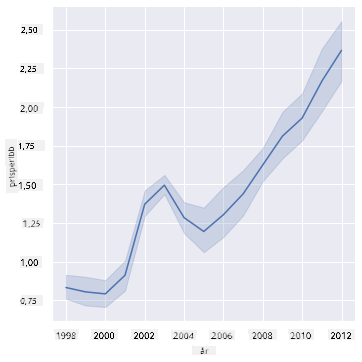
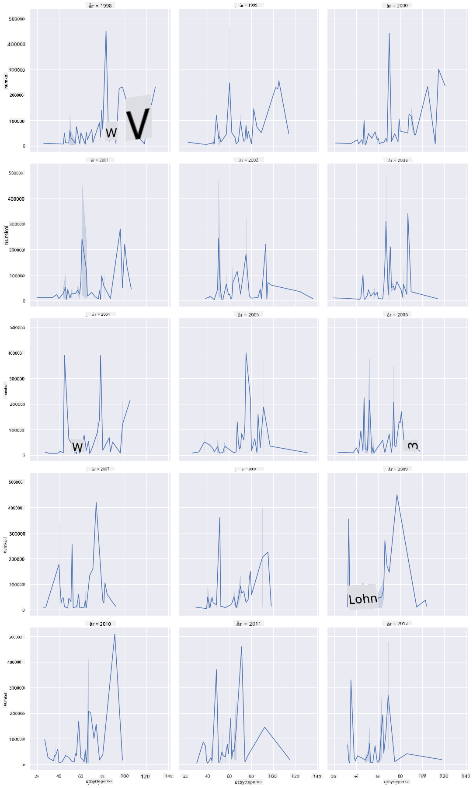
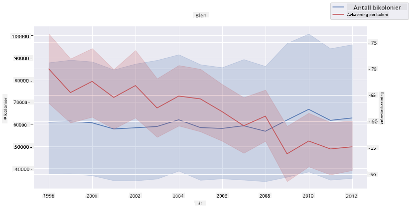

<!--
CO_OP_TRANSLATOR_METADATA:
{
  "original_hash": "cad419b574d5c35eaa417e9abfdcb0c8",
  "translation_date": "2025-08-26T22:54:07+00:00",
  "source_file": "3-Data-Visualization/12-visualization-relationships/README.md",
  "language_code": "no"
}
-->
# Visualisering av relasjoner: Alt om honning 🍯

| ](../../sketchnotes/12-Visualizing-Relationships.png)|
|:---:|
|Visualisering av relasjoner - _Sketchnote av [@nitya](https://twitter.com/nitya)_ |

Vi fortsetter med naturfokuset i forskningen vår og utforsker interessante visualiseringer for å vise relasjoner mellom ulike typer honning, basert på et datasett fra [United States Department of Agriculture](https://www.nass.usda.gov/About_NASS/index.php). 

Dette datasettet, som inneholder rundt 600 elementer, viser honningproduksjon i mange amerikanske delstater. For eksempel kan du se på antall bikuber, avkastning per kube, total produksjon, lagerbeholdning, pris per pund og verdien av honningen produsert i en gitt stat fra 1998-2012, med én rad per år for hver stat. 

Det kan være interessant å visualisere relasjonen mellom en gitt stats produksjon per år og for eksempel prisen på honning i den staten. Alternativt kan du visualisere relasjonen mellom avkastning per kube i ulike stater. Denne tidsperioden dekker også den ødeleggende 'CCD' eller 'Colony Collapse Disorder', som først ble observert i 2006 (http://npic.orst.edu/envir/ccd.html), noe som gjør dette til et tankevekkende datasett å studere. 🐝

## [Quiz før forelesning](https://purple-hill-04aebfb03.1.azurestaticapps.net/quiz/22)

I denne leksjonen kan du bruke Seaborn, som du har brukt tidligere, som et godt bibliotek for å visualisere relasjoner mellom variabler. Spesielt interessant er bruken av Seaborns `relplot`-funksjon, som lar deg lage spredningsdiagrammer og linjediagrammer for raskt å visualisere '[statistiske relasjoner](https://seaborn.pydata.org/tutorial/relational.html?highlight=relationships)', noe som hjelper dataforskere med å forstå hvordan variabler henger sammen.

## Spredningsdiagrammer

Bruk et spredningsdiagram for å vise hvordan prisen på honning har utviklet seg år for år i hver stat. Seaborn, ved bruk av `relplot`, grupperer praktisk talt dataene etter stat og viser datapunkter for både kategoriske og numeriske data. 

La oss starte med å importere dataene og Seaborn:

```python
import pandas as pd
import matplotlib.pyplot as plt
import seaborn as sns
honey = pd.read_csv('../../data/honey.csv')
honey.head()
```
Du vil legge merke til at honningdataene har flere interessante kolonner, inkludert år og pris per pund. La oss utforske disse dataene, gruppert etter amerikansk stat:

| state | numcol | yieldpercol | totalprod | stocks   | priceperlb | prodvalue | year |
| ----- | ------ | ----------- | --------- | -------- | ---------- | --------- | ---- |
| AL    | 16000  | 71          | 1136000   | 159000   | 0.72       | 818000    | 1998 |
| AZ    | 55000  | 60          | 3300000   | 1485000  | 0.64       | 2112000   | 1998 |
| AR    | 53000  | 65          | 3445000   | 1688000  | 0.59       | 2033000   | 1998 |
| CA    | 450000 | 83          | 37350000  | 12326000 | 0.62       | 23157000  | 1998 |
| CO    | 27000  | 72          | 1944000   | 1594000  | 0.7        | 1361000   | 1998 |

Lag et enkelt spredningsdiagram for å vise relasjonen mellom prisen per pund honning og dens opprinnelsesstat. Gjør `y`-aksen høy nok til å vise alle statene:

```python
sns.relplot(x="priceperlb", y="state", data=honey, height=15, aspect=.5);
```


Vis nå de samme dataene med et honningfarget fargeskjema for å vise hvordan prisen utvikler seg over årene. Dette kan gjøres ved å legge til en 'hue'-parameter for å vise endringen år for år:

> ✅ Lær mer om [fargepalettene du kan bruke i Seaborn](https://seaborn.pydata.org/tutorial/color_palettes.html) - prøv et vakkert regnbuefargeskjema!

```python
sns.relplot(x="priceperlb", y="state", hue="year", palette="YlOrBr", data=honey, height=15, aspect=.5);
```


Med denne fargeendringen kan du tydelig se en sterk progresjon i prisen per pund honning over årene. Hvis du ser på et utvalg i dataene for å bekrefte (for eksempel Arizona), kan du se et mønster med prisøkninger år for år, med få unntak:

| state | numcol | yieldpercol | totalprod | stocks  | priceperlb | prodvalue | year |
| ----- | ------ | ----------- | --------- | ------- | ---------- | --------- | ---- |
| AZ    | 55000  | 60          | 3300000   | 1485000 | 0.64       | 2112000   | 1998 |
| AZ    | 52000  | 62          | 3224000   | 1548000 | 0.62       | 1999000   | 1999 |
| AZ    | 40000  | 59          | 2360000   | 1322000 | 0.73       | 1723000   | 2000 |
| AZ    | 43000  | 59          | 2537000   | 1142000 | 0.72       | 1827000   | 2001 |
| AZ    | 38000  | 63          | 2394000   | 1197000 | 1.08       | 2586000   | 2002 |
| AZ    | 35000  | 72          | 2520000   | 983000  | 1.34       | 3377000   | 2003 |
| AZ    | 32000  | 55          | 1760000   | 774000  | 1.11       | 1954000   | 2004 |
| AZ    | 36000  | 50          | 1800000   | 720000  | 1.04       | 1872000   | 2005 |
| AZ    | 30000  | 65          | 1950000   | 839000  | 0.91       | 1775000   | 2006 |
| AZ    | 30000  | 64          | 1920000   | 902000  | 1.26       | 2419000   | 2007 |
| AZ    | 25000  | 64          | 1600000   | 336000  | 1.26       | 2016000   | 2008 |
| AZ    | 20000  | 52          | 1040000   | 562000  | 1.45       | 1508000   | 2009 |
| AZ    | 24000  | 77          | 1848000   | 665000  | 1.52       | 2809000   | 2010 |
| AZ    | 23000  | 53          | 1219000   | 427000  | 1.55       | 1889000   | 2011 |
| AZ    | 22000  | 46          | 1012000   | 253000  | 1.79       | 1811000   | 2012 |

En annen måte å visualisere denne progresjonen på er å bruke størrelse i stedet for farge. For fargeblinde brukere kan dette være et bedre alternativ. Endre visualiseringen din for å vise prisøkningen ved å øke prikkens omkrets:

```python
sns.relplot(x="priceperlb", y="state", size="year", data=honey, height=15, aspect=.5);
```
Du kan se at størrelsen på prikkene gradvis øker.


Er dette et enkelt tilfelle av tilbud og etterspørsel? På grunn av faktorer som klimaendringer og kollaps i bikolonier, er det mindre honning tilgjengelig for kjøp år for år, og dermed øker prisen?

For å oppdage en korrelasjon mellom noen av variablene i dette datasettet, la oss utforske noen linjediagrammer.

## Linjediagrammer

Spørsmål: Er det en tydelig økning i prisen på honning per pund år for år? Dette kan enklest oppdages ved å lage et enkelt linjediagram:

```python
sns.relplot(x="year", y="priceperlb", kind="line", data=honey);
```
Svar: Ja, med noen unntak rundt året 2003:



✅ Fordi Seaborn aggregerer data rundt én linje, viser den "de flere målingene ved hver x-verdi ved å plotte gjennomsnittet og 95 % konfidensintervallet rundt gjennomsnittet". [Kilde](https://seaborn.pydata.org/tutorial/relational.html). Denne tidkrevende oppførselen kan deaktiveres ved å legge til `ci=None`.

Spørsmål: Vel, kan vi også se en topp i honningtilførselen i 2003? Hva om du ser på total produksjon år for år?

```python
sns.relplot(x="year", y="totalprod", kind="line", data=honey);
```


Svar: Ikke egentlig. Hvis du ser på total produksjon, ser det faktisk ut til at den økte det året, selv om mengden honning som produseres generelt sett er i tilbakegang i løpet av disse årene.

Spørsmål: I så fall, hva kan ha forårsaket den prisspikingen på honning rundt 2003? 

For å oppdage dette kan du utforske et facet grid.

## Facet grids

Facet grids tar én fasett av datasettet ditt (i vårt tilfelle kan du velge 'år' for å unngå at det produseres for mange fasetter). Seaborn kan deretter lage et diagram for hver av disse fasettene med dine valgte x- og y-koordinater for enklere visuell sammenligning. Skiller 2003 seg ut i denne typen sammenligning?

Lag et facet grid ved å fortsette å bruke `relplot` som anbefalt av [Seaborns dokumentasjon](https://seaborn.pydata.org/generated/seaborn.FacetGrid.html?highlight=facetgrid#seaborn.FacetGrid). 

```python
sns.relplot(
    data=honey, 
    x="yieldpercol", y="numcol",
    col="year", 
    col_wrap=3,
    kind="line"
```
I denne visualiseringen kan du sammenligne avkastning per kube og antall bikuber år for år, side om side med en wrap satt til 3 for kolonnene:



For dette datasettet er det ingenting spesielt som skiller seg ut med hensyn til antall bikuber og deres avkastning, år for år og stat for stat. Finnes det en annen måte å se etter en korrelasjon mellom disse to variablene?

## To-linjers diagrammer

Prøv et flerliniært diagram ved å legge to linjediagrammer oppå hverandre, ved å bruke Seaborns 'despine' for å fjerne topp- og høyrekanter, og bruke `ax.twinx` [fra Matplotlib](https://matplotlib.org/stable/api/_as_gen/matplotlib.axes.Axes.twinx.html). Twinx lar et diagram dele x-aksen og vise to y-akser. Så, vis avkastning per kube og antall bikuber, lagt oppå hverandre:

```python
fig, ax = plt.subplots(figsize=(12,6))
lineplot = sns.lineplot(x=honey['year'], y=honey['numcol'], data=honey, 
                        label = 'Number of bee colonies', legend=False)
sns.despine()
plt.ylabel('# colonies')
plt.title('Honey Production Year over Year');

ax2 = ax.twinx()
lineplot2 = sns.lineplot(x=honey['year'], y=honey['yieldpercol'], ax=ax2, color="r", 
                         label ='Yield per colony', legend=False) 
sns.despine(right=False)
plt.ylabel('colony yield')
ax.figure.legend();
```


Selv om ingenting skiller seg ut rundt året 2003, lar det oss avslutte denne leksjonen på en litt gladere tone: selv om det totalt sett er en nedgang i antall bikuber, stabiliserer antallet seg, selv om avkastningen per kube synker.

Heia, bier, heia!

🐝❤️
## 🚀 Utfordring

I denne leksjonen lærte du litt mer om andre bruksområder for spredningsdiagrammer og linjediagrammer, inkludert facet grids. Utfordre deg selv til å lage et facet grid ved hjelp av et annet datasett, kanskje et du brukte tidligere i disse leksjonene. Legg merke til hvor lang tid det tar å lage dem, og hvor forsiktig du må være med hvor mange grids du trenger å tegne ved hjelp av disse teknikkene.
## [Quiz etter forelesning](https://purple-hill-04aebfb03.1.azurestaticapps.net/quiz/23)

## Gjennomgang og selvstudium

Linjediagrammer kan være enkle eller ganske komplekse. Les litt i [Seaborns dokumentasjon](https://seaborn.pydata.org/generated/seaborn.lineplot.html) om de ulike måtene du kan bygge dem på. Prøv å forbedre linjediagrammene du laget i denne leksjonen med andre metoder som er oppført i dokumentasjonen.
## Oppgave

[Utforsk bikuben](assignment.md)

---

**Ansvarsfraskrivelse**:  
Dette dokumentet er oversatt ved hjelp av AI-oversettelsestjenesten [Co-op Translator](https://github.com/Azure/co-op-translator). Selv om vi streber etter nøyaktighet, vær oppmerksom på at automatiserte oversettelser kan inneholde feil eller unøyaktigheter. Det originale dokumentet på sitt opprinnelige språk bør anses som den autoritative kilden. For kritisk informasjon anbefales profesjonell menneskelig oversettelse. Vi er ikke ansvarlige for misforståelser eller feiltolkninger som oppstår ved bruk av denne oversettelsen.