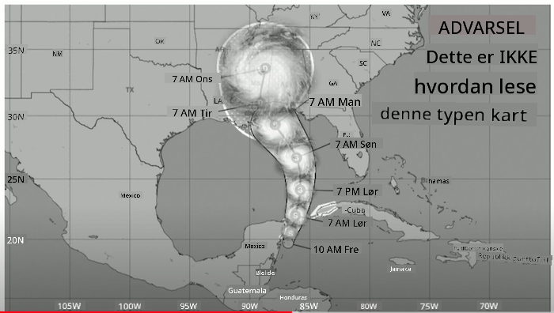
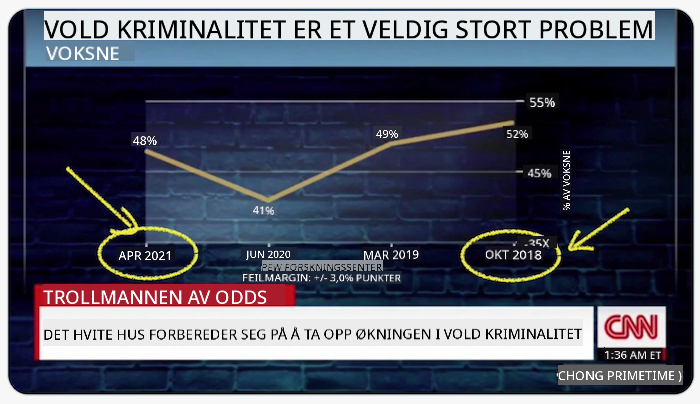
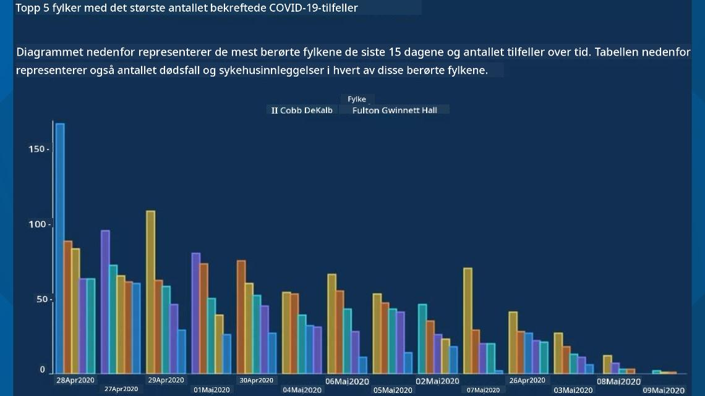
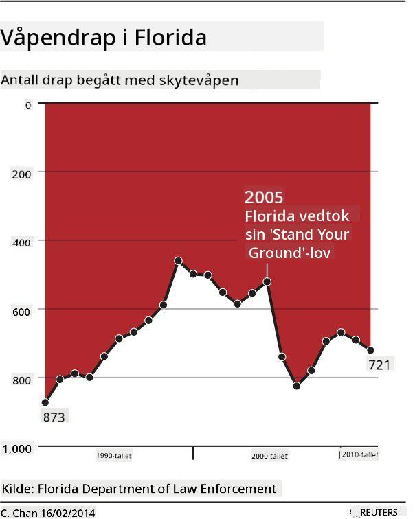
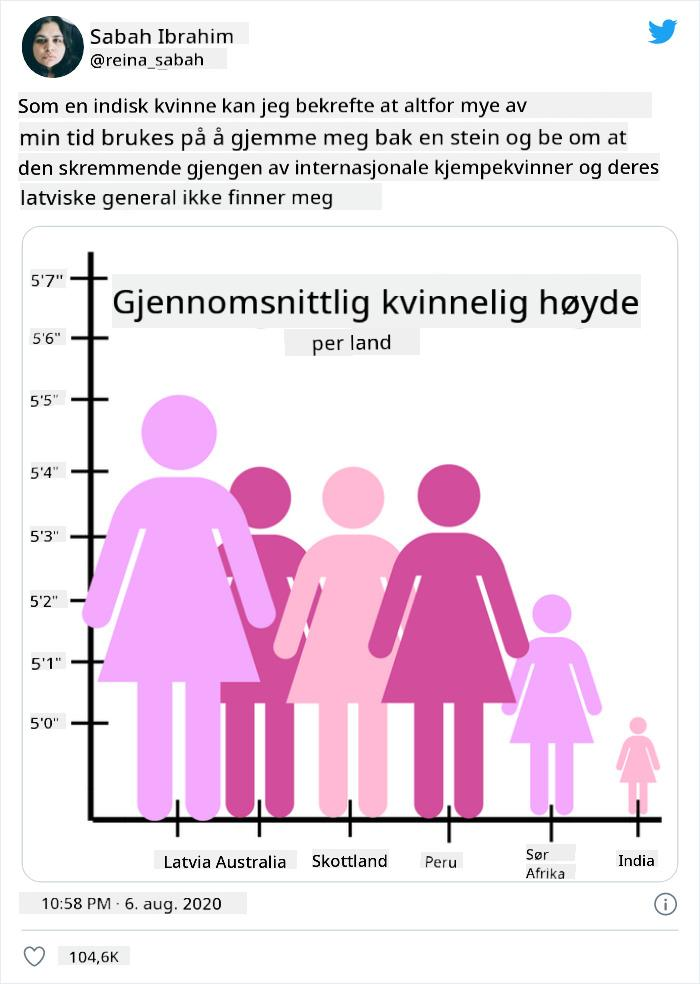
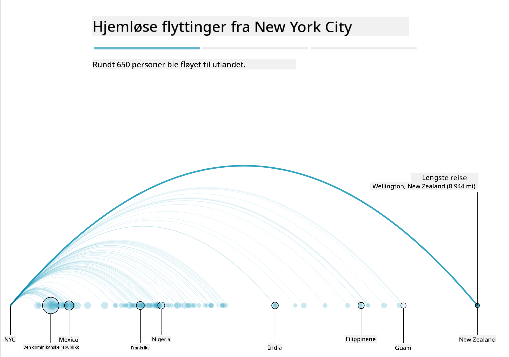
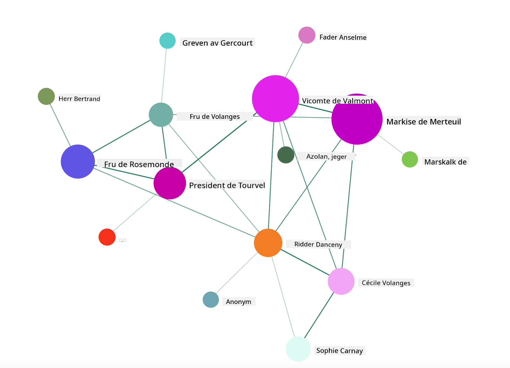

<!--
CO_OP_TRANSLATOR_METADATA:
{
  "original_hash": "4ec4747a9f4f7d194248ea29903ae165",
  "translation_date": "2025-08-26T22:44:12+00:00",
  "source_file": "3-Data-Visualization/13-meaningful-visualizations/README.md",
  "language_code": "no"
}
-->
# Lage Meningsfulle Visualiseringer

| ](../../sketchnotes/13-MeaningfulViz.png)|
|:---:|
| Meningsfulle Visualiseringer - _Sketchnote av [@nitya](https://twitter.com/nitya)_ |

> "Hvis du torturerer dataene lenge nok, vil de tilstå hva som helst" -- [Ronald Coase](https://en.wikiquote.org/wiki/Ronald_Coase)

En av de grunnleggende ferdighetene til en dataforsker er evnen til å lage en meningsfull datavisualisering som hjelper til med å svare på spørsmål du måtte ha. Før du visualiserer dataene dine, må du sørge for at de er renset og forberedt, slik du gjorde i tidligere leksjoner. Etter det kan du begynne å bestemme hvordan du best presenterer dataene.

I denne leksjonen vil du gjennomgå:

1. Hvordan velge riktig diagramtype  
2. Hvordan unngå villedende diagrammer  
3. Hvordan jobbe med farger  
4. Hvordan style diagrammene dine for lesbarhet  
5. Hvordan lage animerte eller 3D-diagrammer  
6. Hvordan lage en kreativ visualisering  

## [Forhåndsquiz](https://purple-hill-04aebfb03.1.azurestaticapps.net/quiz/24)

## Velg riktig diagramtype

I tidligere leksjoner eksperimenterte du med å lage ulike interessante datavisualiseringer ved hjelp av Matplotlib og Seaborn. Generelt kan du velge [riktig type diagram](https://chartio.com/learn/charts/how-to-select-a-data-vizualization/) for spørsmålet du stiller ved hjelp av denne tabellen:

| Du trenger å:              | Du bør bruke:                  |
| -------------------------- | ----------------------------- |
| Vise datatrender over tid  | Linje                         |
| Sammenligne kategorier     | Stolpe, Sektordiagram         |
| Sammenligne totaler        | Sektordiagram, Stablet Stolpe |
| Vise relasjoner            | Punkt, Linje, Facet, Dobbel Linje |
| Vise fordelinger           | Punkt, Histogram, Boks        |
| Vise proporsjoner          | Sektordiagram, Donut, Vaffel  |

> ✅ Avhengig av sammensetningen av dataene dine, kan det hende du må konvertere dem fra tekst til numerisk for å få et gitt diagram til å fungere.

## Unngå villedning

Selv om en dataforsker er nøye med å velge riktig diagram for riktige data, finnes det mange måter data kan vises på for å bevise et poeng, ofte på bekostning av å undergrave dataene selv. Det finnes mange eksempler på villedende diagrammer og infografikk!

[](https://www.youtube.com/watch?v=oX74Nge8Wkw "How charts lie")

> 🎥 Klikk på bildet over for en konferansesnakk om villedende diagrammer

Dette diagrammet snur X-aksen for å vise det motsatte av sannheten, basert på dato:



[Dette diagrammet](https://media.firstcoastnews.com/assets/WTLV/images/170ae16f-4643-438f-b689-50d66ca6a8d8/170ae16f-4643-438f-b689-50d66ca6a8d8_1140x641.jpg) er enda mer villedende, da øyet trekkes mot høyre for å konkludere med at COVID-tilfeller har gått ned over tid i de ulike fylkene. Faktisk, hvis du ser nøye på datoene, oppdager du at de har blitt omorganisert for å gi en villedende nedadgående trend.



Dette beryktede eksempelet bruker farge OG en snudd Y-akse for å villede: i stedet for å konkludere med at våpendødsfall økte etter vedtakelsen av våpenvennlig lovgivning, blir øyet lurt til å tro det motsatte:



Dette merkelige diagrammet viser hvordan proporsjoner kan manipuleres, til komisk effekt:



Å sammenligne det som ikke kan sammenlignes er enda et skyggefullt triks. Det finnes et [fantastisk nettsted](https://tylervigen.com/spurious-correlations) fullt av 'spuriøse korrelasjoner' som viser 'fakta' som korrelerer ting som skilsmisseraten i Maine og forbruket av margarin. En Reddit-gruppe samler også [stygge eksempler](https://www.reddit.com/r/dataisugly/top/?t=all) på databruk.

Det er viktig å forstå hvor lett øyet kan bli lurt av villedende diagrammer. Selv om dataforskerens intensjon er god, kan valget av en dårlig diagramtype, som et sektordiagram med for mange kategorier, være villedende.

## Farge

Du så i diagrammet om 'våpenvold i Florida' hvordan farge kan gi et ekstra lag med mening til diagrammer, spesielt de som ikke er designet ved hjelp av biblioteker som Matplotlib og Seaborn, som kommer med ulike godkjente fargebiblioteker og paletter. Hvis du lager et diagram for hånd, bør du studere litt [fargeteori](https://colormatters.com/color-and-design/basic-color-theory).

> ✅ Vær oppmerksom på at tilgjengelighet er en viktig del av visualisering når du designer diagrammer. Noen av brukerne dine kan være fargeblinde – vises diagrammet ditt godt for brukere med synshemminger?

Vær forsiktig når du velger farger for diagrammet ditt, da farge kan formidle betydning du kanskje ikke har til hensikt. De 'rosa damene' i 'høyde'-diagrammet over gir en tydelig 'feminin' tilskrevet mening som legger til det absurde i diagrammet selv.

Selv om [fargebetydning](https://colormatters.com/color-symbolism/the-meanings-of-colors) kan variere i ulike deler av verden og har en tendens til å endre seg avhengig av nyansen, inkluderer generelle fargebetydninger:

| Farge   | Betydning            |
| ------- | -------------------- |
| rød     | makt                |
| blå     | tillit, lojalitet   |
| gul     | glede, forsiktighet |
| grønn   | økologi, flaks, misunnelse |
| lilla   | glede               |
| oransje | energi              |

Hvis du blir bedt om å lage et diagram med egendefinerte farger, sørg for at diagrammene dine både er tilgjengelige og at fargen du velger samsvarer med betydningen du prøver å formidle.

## Style diagrammene dine for lesbarhet

Diagrammer er ikke meningsfulle hvis de ikke er lesbare! Ta deg tid til å vurdere å justere bredden og høyden på diagrammet ditt slik at det skalerer godt med dataene. Hvis en variabel (som alle 50 stater) må vises, vis dem vertikalt på Y-aksen hvis mulig for å unngå et horisontalt rullbart diagram.

Merk aksene dine, legg til en forklaring hvis nødvendig, og tilby verktøytips for bedre forståelse av dataene.

Hvis dataene dine er tekstbaserte og detaljerte på X-aksen, kan du vinkle teksten for bedre lesbarhet. [Matplotlib](https://matplotlib.org/stable/tutorials/toolkits/mplot3d.html) tilbyr 3D-plotting hvis dataene dine støtter det. Sofistikerte datavisualiseringer kan produseres ved hjelp av `mpl_toolkits.mplot3d`.


## Animasjon og 3D-diagrammer

Noen av de beste datavisualiseringene i dag er animerte. Shirley Wu har laget fantastiske visualiseringer med D3, som '[film flowers](http://bl.ocks.org/sxywu/raw/d612c6c653fb8b4d7ff3d422be164a5d/)', hvor hver blomst er en visualisering av en film. Et annet eksempel for Guardian er 'bussed out', en interaktiv opplevelse som kombinerer visualiseringer med Greensock og D3, pluss en scrollytelling-artikkelformat for å vise hvordan NYC håndterer sitt hjemløse problem ved å sende folk ut av byen.



> "Bussed Out: How America Moves its Homeless" fra [the Guardian](https://www.theguardian.com/us-news/ng-interactive/2017/dec/20/bussed-out-america-moves-homeless-people-country-study). Visualiseringer av Nadieh Bremer & Shirley Wu

Selv om denne leksjonen ikke går i dybden på å lære disse kraftige visualiseringsbibliotekene, kan du prøve deg på D3 i en Vue.js-app ved hjelp av et bibliotek for å vise en visualisering av boken "Dangerous Liaisons" som et animert sosialt nettverk.

> "Les Liaisons Dangereuses" er en brevroman, eller en roman presentert som en serie brev. Skrevet i 1782 av Choderlos de Laclos, forteller den historien om de ondskapsfulle, moralsk korrupte sosiale manøvrene til to rivaliserende protagonister i det franske aristokratiet på slutten av 1700-tallet, Vicomte de Valmont og Marquise de Merteuil. Begge møter sin undergang til slutt, men ikke uten å forårsake betydelig sosial skade. Romanen utfolder seg som en serie brev skrevet til ulike personer i deres kretser, med planer om hevn eller bare for å skape trøbbel. Lag en visualisering av disse brevene for å oppdage de sentrale aktørene i fortellingen, visuelt.

Du vil fullføre en webapp som viser en animert visning av dette sosiale nettverket. Den bruker et bibliotek som ble bygget for å lage en [visualisering av et nettverk](https://github.com/emiliorizzo/vue-d3-network) ved hjelp av Vue.js og D3. Når appen kjører, kan du dra nodene rundt på skjermen for å omorganisere dataene.



## Prosjekt: Lag et diagram for å vise et nettverk ved hjelp av D3.js

> Denne leksjonsmappen inkluderer en `solution`-mappe hvor du kan finne det fullførte prosjektet som referanse.

1. Følg instruksjonene i README.md-filen i rotmappen til startpakken. Sørg for at du har NPM og Node.js installert på maskinen din før du installerer prosjektets avhengigheter.

2. Åpne `starter/src`-mappen. Du vil finne en `assets`-mappe hvor du kan finne en .json-fil med alle brevene fra romanen, nummerert, med en 'til' og 'fra'-annotasjon.

3. Fullfør koden i `components/Nodes.vue` for å aktivere visualiseringen. Se etter metoden kalt `createLinks()` og legg til følgende nestede løkke.

Gå gjennom .json-objektet for å fange opp 'til' og 'fra'-dataene for brevene og bygg opp `links`-objektet slik at visualiseringsbiblioteket kan bruke det:

```javascript
//loop through letters
      let f = 0;
      let t = 0;
      for (var i = 0; i < letters.length; i++) {
          for (var j = 0; j < characters.length; j++) {
              
            if (characters[j] == letters[i].from) {
              f = j;
            }
            if (characters[j] == letters[i].to) {
              t = j;
            }
        }
        this.links.push({ sid: f, tid: t });
      }
  ```

Kjør appen din fra terminalen (npm run serve) og nyt visualiseringen!

## 🚀 Utfordring

Ta en tur på internett for å oppdage villedende visualiseringer. Hvordan lurer forfatteren brukeren, og er det med vilje? Prøv å korrigere visualiseringene for å vise hvordan de burde se ut.

## [Etter-quiz](https://purple-hill-04aebfb03.1.azurestaticapps.net/quiz/25)

## Gjennomgang og Selvstudium

Her er noen artikler om villedende datavisualisering:

https://gizmodo.com/how-to-lie-with-data-visualization-1563576606

http://ixd.prattsi.org/2017/12/visual-lies-usability-in-deceptive-data-visualizations/

Ta en titt på disse interessante visualiseringene for historiske eiendeler og gjenstander:

https://handbook.pubpub.org/

Se gjennom denne artikkelen om hvordan animasjon kan forbedre visualiseringene dine:

https://medium.com/@EvanSinar/use-animation-to-supercharge-data-visualization-cd905a882ad4

## Oppgave

[Bygg din egen tilpassede visualisering](assignment.md)

---

**Ansvarsfraskrivelse**:  
Dette dokumentet er oversatt ved hjelp av AI-oversettelsestjenesten [Co-op Translator](https://github.com/Azure/co-op-translator). Selv om vi tilstreber nøyaktighet, vennligst vær oppmerksom på at automatiske oversettelser kan inneholde feil eller unøyaktigheter. Det originale dokumentet på sitt opprinnelige språk bør anses som den autoritative kilden. For kritisk informasjon anbefales profesjonell menneskelig oversettelse. Vi er ikke ansvarlige for eventuelle misforståelser eller feiltolkninger som oppstår ved bruk av denne oversettelsen.