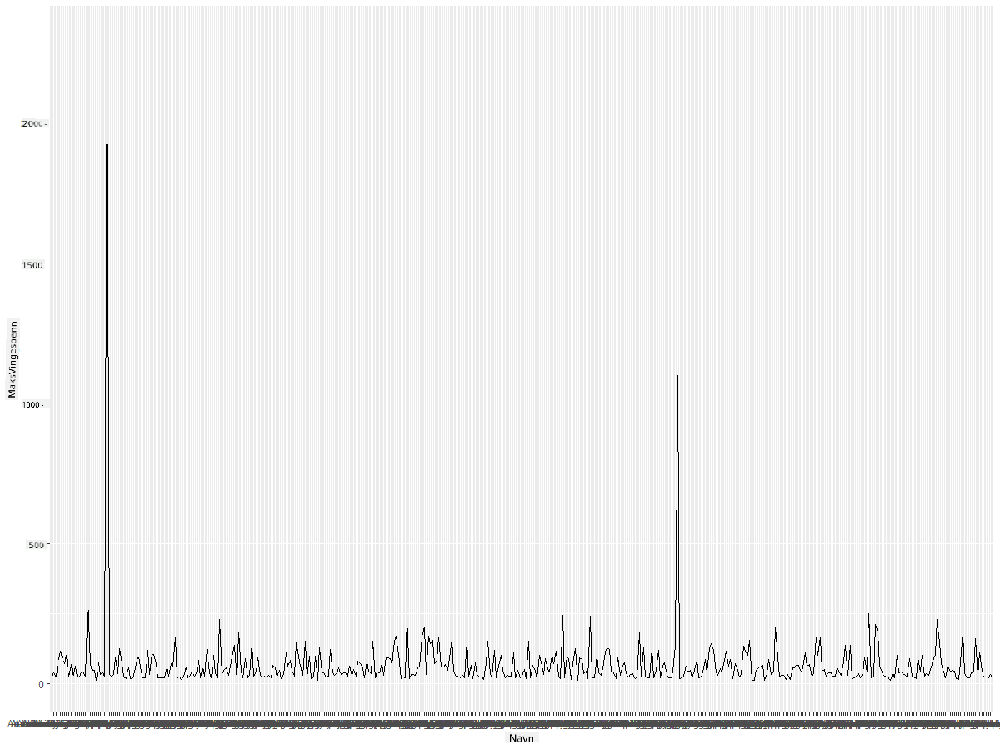
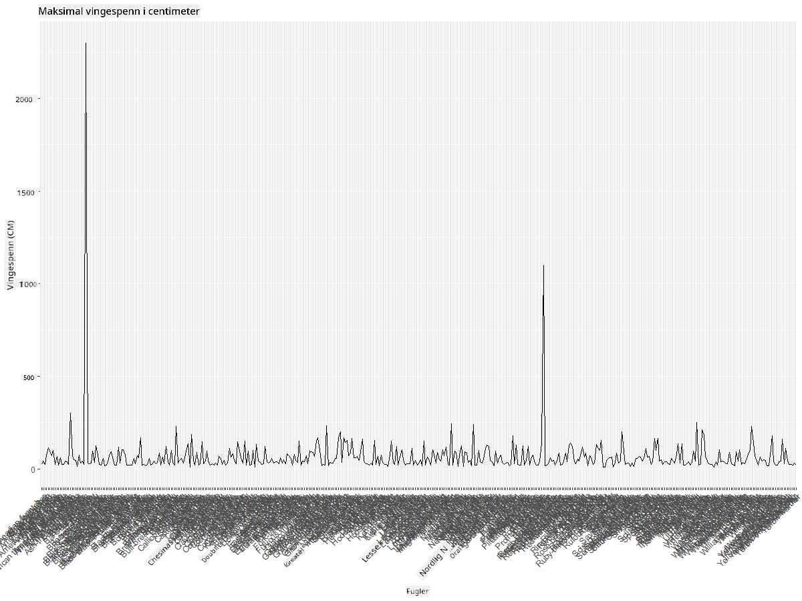
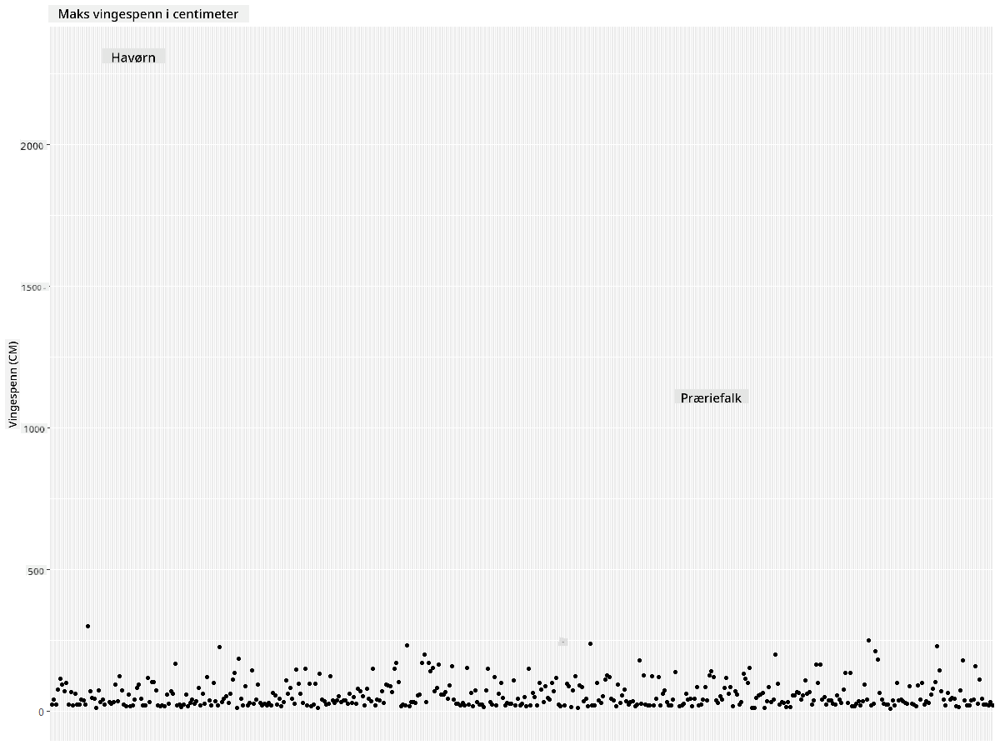
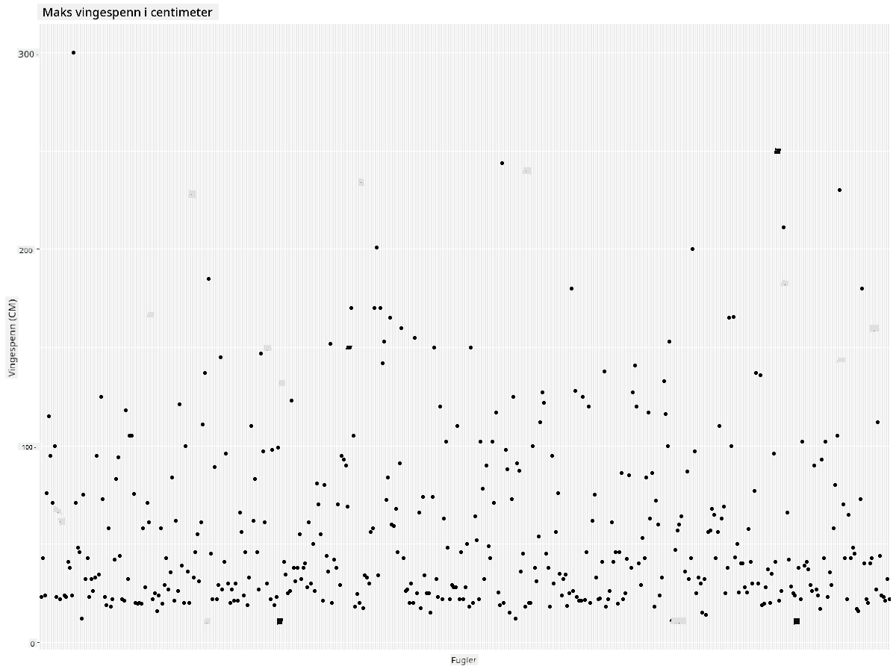
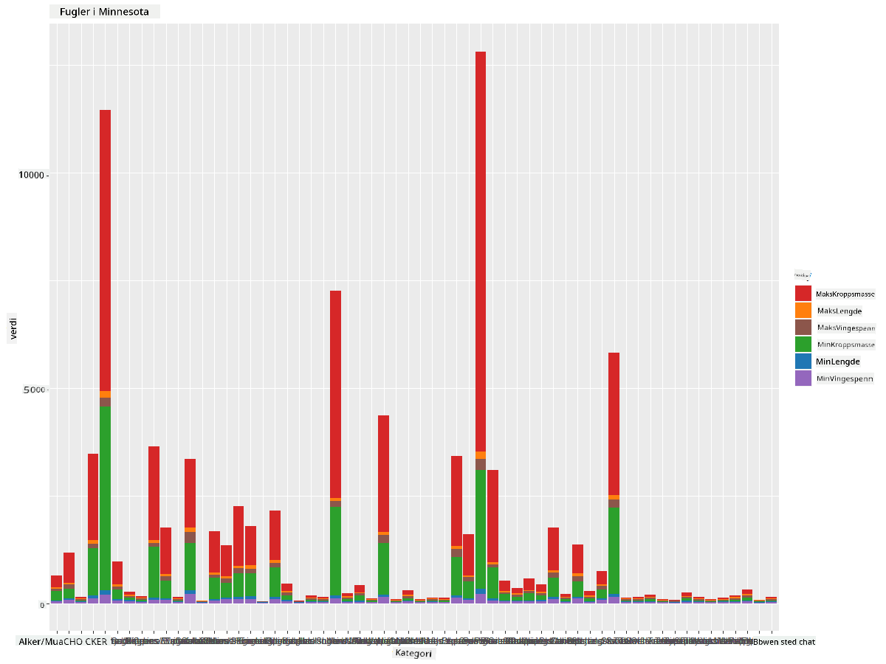
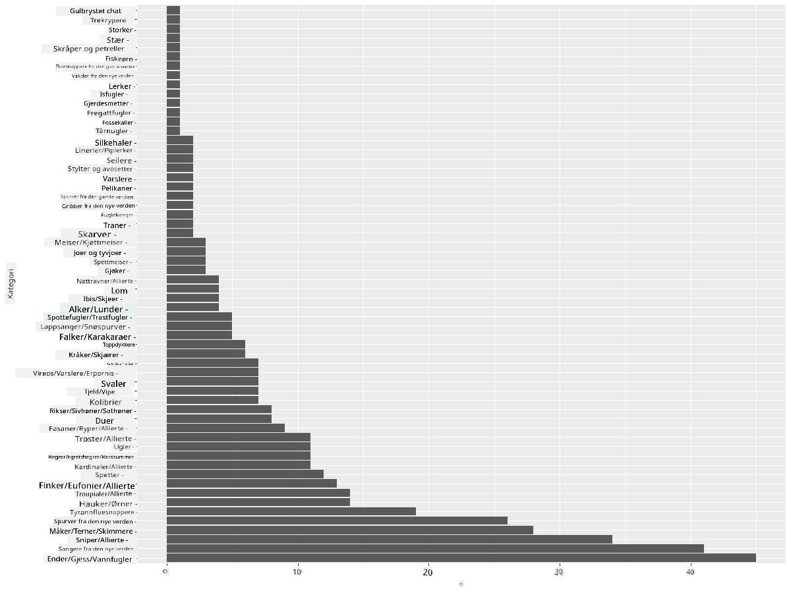
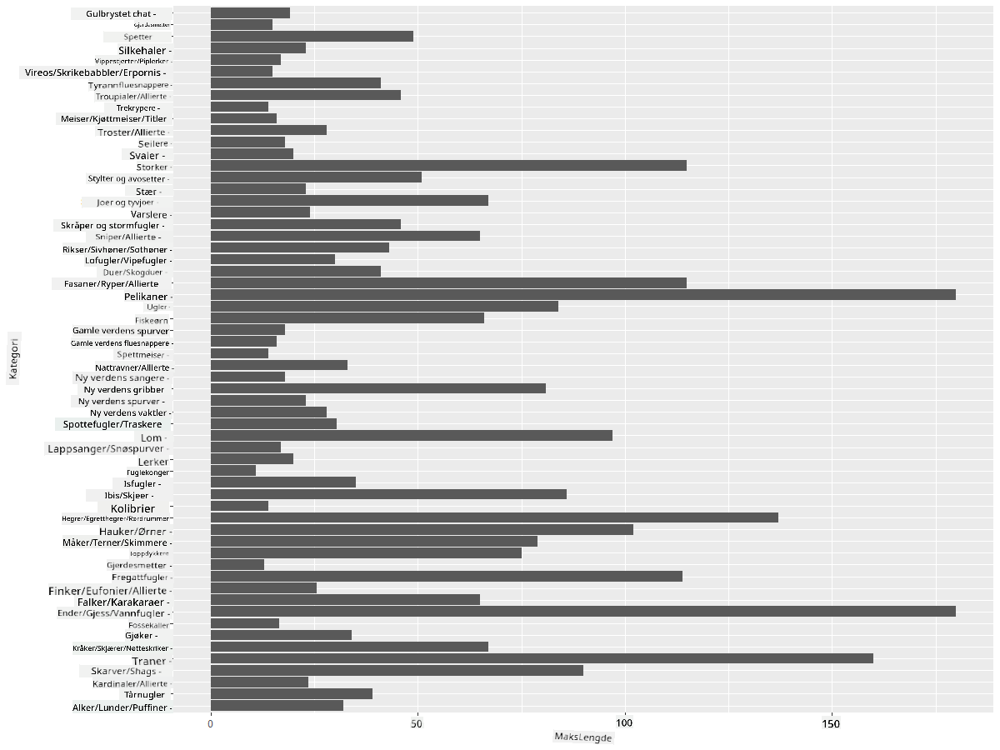
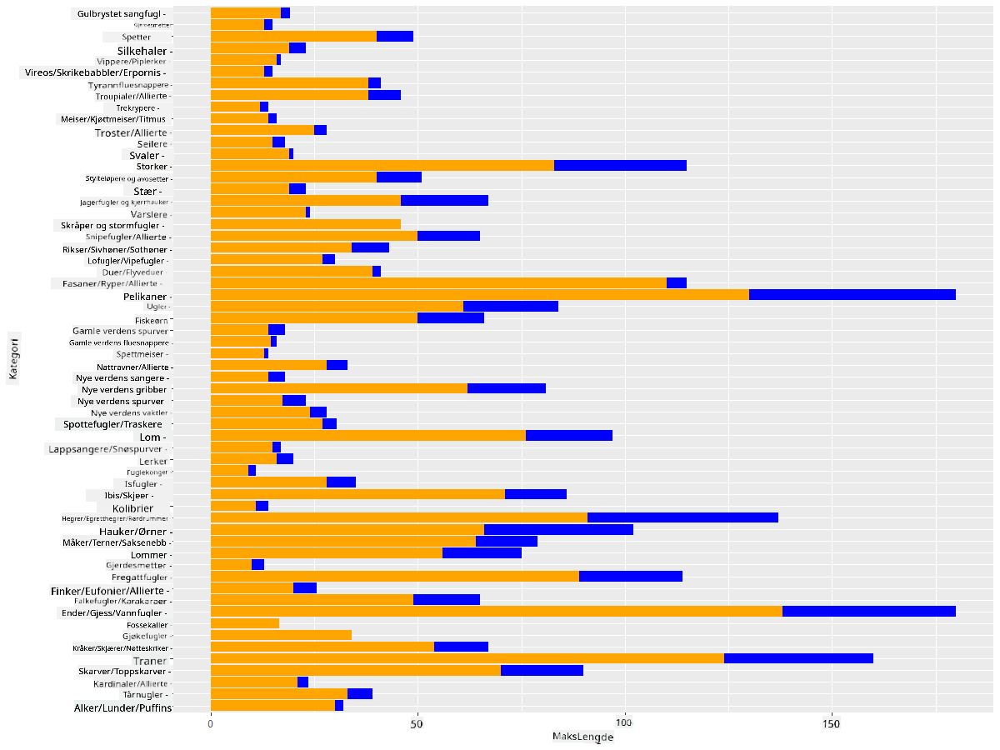

<!--
CO_OP_TRANSLATOR_METADATA:
{
  "original_hash": "22acf28f518a4769ea14fa42f4734b9f",
  "translation_date": "2025-08-26T23:07:44+00:00",
  "source_file": "3-Data-Visualization/R/09-visualization-quantities/README.md",
  "language_code": "no"
}
-->
# Visualisering av Mengder
| ](https://github.com/microsoft/Data-Science-For-Beginners/blob/main/sketchnotes/09-Visualizing-Quantities.png)|
|:---:|
| Visualisering av Mengder - _Sketchnote av [@nitya](https://twitter.com/nitya)_ |

I denne leksjonen vil du utforske hvordan du kan bruke noen av de mange tilgjengelige R-pakkene for å lære å lage interessante visualiseringer rundt konseptet mengde. Ved å bruke et renset datasett om fuglene i Minnesota, kan du lære mange interessante fakta om det lokale dyrelivet.  
## [Quiz før leksjonen](https://purple-hill-04aebfb03.1.azurestaticapps.net/quiz/16)

## Observer vingespenn med ggplot2
Et utmerket bibliotek for å lage både enkle og avanserte diagrammer og grafer av ulike typer er [ggplot2](https://cran.r-project.org/web/packages/ggplot2/index.html). Generelt sett innebærer prosessen med å plotte data ved hjelp av disse bibliotekene å identifisere delene av dataframen du vil fokusere på, utføre nødvendige transformasjoner på dataene, tilordne verdier til x- og y-aksen, bestemme hvilken type diagram du vil vise, og deretter vise diagrammet.

`ggplot2` er et system for deklarativt å lage grafikk, basert på The Grammar of Graphics. [Grammar of Graphics](https://en.wikipedia.org/wiki/Ggplot2) er et generelt rammeverk for datavisualisering som deler opp grafer i semantiske komponenter som skalaer og lag. Med andre ord gjør enkelheten i å lage grafer for univariat eller multivariat data med lite kode `ggplot2` til den mest populære pakken for visualiseringer i R. Brukeren forteller `ggplot2` hvordan variablene skal kartlegges til estetikk, hvilke grafiske elementer som skal brukes, og `ggplot2` tar seg av resten.

> ✅ Diagram = Data + Estetikk + Geometri  
> - Data refererer til datasettet  
> - Estetikk indikerer variablene som skal studeres (x- og y-variabler)  
> - Geometri refererer til typen diagram (linjediagram, stolpediagram, osv.)  

Velg den beste geometrien (typen diagram) i henhold til dataene dine og historien du vil fortelle gjennom diagrammet.  

> - For å analysere trender: linje, kolonne  
> - For å sammenligne verdier: stolpe, kolonne, sektordiagram, spredningsdiagram  
> - For å vise hvordan deler forholder seg til helheten: sektordiagram  
> - For å vise distribusjon av data: spredningsdiagram, stolpe  
> - For å vise relasjoner mellom verdier: linje, spredningsdiagram, boble  

✅ Du kan også sjekke ut dette beskrivende [juksearket](https://nyu-cdsc.github.io/learningr/assets/data-visualization-2.1.pdf) for ggplot2.

## Lag et linjediagram om fuglenes vingespennverdier

Åpne R-konsollen og importer datasettet.  
> Merk: Datasettet er lagret i roten av dette repoet i `/data`-mappen.

La oss importere datasettet og observere toppen (de første 5 radene) av dataene.

```r
birds <- read.csv("../../data/birds.csv",fileEncoding="UTF-8-BOM")
head(birds)
```  
Toppen av dataene inneholder en blanding av tekst og tall:

|      | Navn                          | VitenskapeligNavn      | Kategori              | Orden        | Familie  | Slekt       | Bevaringsstatus     | MinLengde | MaksLengde | MinKroppsmasse | MaksKroppsmasse | MinVingespenn | MaksVingespenn |
| ---: | :---------------------------- | :--------------------- | :-------------------- | :----------- | :------- | :---------- | :----------------- | --------: | --------: | ------------: | -------------: | ------------: | ------------: |
|    0 | Svartbukket plystreand        | Dendrocygna autumnalis | Ender/Gjess/Vannfugl  | Anseriformes | Anatidae | Dendrocygna | LC                 |        47 |        56 |           652 |           1020 |            76 |            94 |
|    1 | Rødplystreand                 | Dendrocygna bicolor    | Ender/Gjess/Vannfugl  | Anseriformes | Anatidae | Dendrocygna | LC                 |        45 |        53 |           712 |           1050 |            85 |            93 |
|    2 | Snøgås                        | Anser caerulescens     | Ender/Gjess/Vannfugl  | Anseriformes | Anatidae | Anser       | LC                 |        64 |        79 |          2050 |           4050 |           135 |           165 |
|    3 | Ross' gås                     | Anser rossii           | Ender/Gjess/Vannfugl  | Anseriformes | Anatidae | Anser       | LC                 |      57.3 |        64 |          1066 |           1567 |           113 |           116 |
|    4 | Større hvitkinngås            | Anser albifrons        | Ender/Gjess/Vannfugl  | Anseriformes | Anatidae | Anser       | LC                 |        64 |        81 |          1930 |           3310 |           130 |           165 |

La oss begynne med å plotte noen av de numeriske dataene ved hjelp av et grunnleggende linjediagram. Anta at du ønsker en oversikt over det maksimale vingespennet for disse interessante fuglene.

```r
install.packages("ggplot2")
library("ggplot2")
ggplot(data=birds, aes(x=Name, y=MaxWingspan,group=1)) +
  geom_line() 
```  
Her installerer du `ggplot2`-pakken og importerer den deretter til arbeidsområdet ved hjelp av kommandoen `library("ggplot2")`. For å plotte et diagram i ggplot brukes funksjonen `ggplot()`, og du spesifiserer datasettet, x- og y-variablene som attributter. I dette tilfellet bruker vi funksjonen `geom_line()` siden vi ønsker å plotte et linjediagram.



Hva legger du merke til med en gang? Det ser ut til å være minst én uteligger - det er et ganske vingespenn! Et vingespenn på over 2000 centimeter tilsvarer mer enn 20 meter - er det Pterodaktyler som flyr rundt i Minnesota? La oss undersøke.

Selv om du kunne gjort en rask sortering i Excel for å finne disse uteliggerne, som sannsynligvis er skrivefeil, fortsetter vi visualiseringsprosessen ved å jobbe fra diagrammet.

Legg til etiketter på x-aksen for å vise hvilke fugler det er snakk om:

```r
ggplot(data=birds, aes(x=Name, y=MaxWingspan,group=1)) +
  geom_line() +
  theme(axis.text.x = element_text(angle = 45, hjust=1))+
  xlab("Birds") +
  ylab("Wingspan (CM)") +
  ggtitle("Max Wingspan in Centimeters")
```  
Vi spesifiserer vinkelen i `theme` og angir x- og y-akseetiketter i `xlab()` og `ylab()` henholdsvis. `ggtitle()` gir diagrammet et navn.



Selv med rotasjonen av etikettene satt til 45 grader, er det for mange til å lese. La oss prøve en annen strategi: merk bare uteliggerne og sett etikettene innenfor diagrammet. Du kan bruke et spredningsdiagram for å få mer plass til merkingen:

```r
ggplot(data=birds, aes(x=Name, y=MaxWingspan,group=1)) +
  geom_point() +
  geom_text(aes(label=ifelse(MaxWingspan>500,as.character(Name),'')),hjust=0,vjust=0) + 
  theme(axis.title.x=element_blank(), axis.text.x=element_blank(), axis.ticks.x=element_blank())
  ylab("Wingspan (CM)") +
  ggtitle("Max Wingspan in Centimeters") + 
```  
Hva skjer her? Du brukte funksjonen `geom_point()` for å plotte spredningspunkter. Med dette la du til etiketter for fugler som hadde `MaxWingspan > 500` og skjulte også etikettene på x-aksen for å rydde opp i diagrammet.

Hva oppdager du?



## Filtrer dataene dine

Både Hodeørn og Præriefalk, selv om de sannsynligvis er veldig store fugler, ser ut til å være feilmerket, med en ekstra 0 lagt til deres maksimale vingespenn. Det er lite sannsynlig at du møter en Hodeørn med et vingespenn på 25 meter, men hvis du gjør det, gi oss beskjed! La oss lage en ny dataframe uten disse to uteliggerne:

```r
birds_filtered <- subset(birds, MaxWingspan < 500)

ggplot(data=birds_filtered, aes(x=Name, y=MaxWingspan,group=1)) +
  geom_point() +
  ylab("Wingspan (CM)") +
  xlab("Birds") +
  ggtitle("Max Wingspan in Centimeters") + 
  geom_text(aes(label=ifelse(MaxWingspan>500,as.character(Name),'')),hjust=0,vjust=0) +
  theme(axis.text.x=element_blank(), axis.ticks.x=element_blank())
```  
Vi laget en ny dataframe `birds_filtered` og plottet deretter et spredningsdiagram. Ved å filtrere ut uteliggerne er dataene dine nå mer sammenhengende og forståelige.



Nå som vi har et renere datasett, i det minste når det gjelder vingespenn, la oss oppdage mer om disse fuglene.

Mens linje- og spredningsdiagrammer kan vise informasjon om dataverdier og deres distribusjoner, vil vi tenke på verdiene som ligger i dette datasettet. Du kan lage visualiseringer for å svare på følgende spørsmål om mengde:

> Hvor mange kategorier av fugler finnes det, og hva er antallet?  
> Hvor mange fugler er utdødd, truet, sjeldne eller vanlige?  
> Hvor mange finnes det av de ulike slektene og ordenene i Linnés terminologi?  

## Utforsk stolpediagrammer

Stolpediagrammer er praktiske når du trenger å vise grupperinger av data. La oss utforske kategoriene av fugler som finnes i dette datasettet for å se hvilken som er den vanligste etter antall.  
La oss lage et stolpediagram basert på filtrerte data.

```r
install.packages("dplyr")
install.packages("tidyverse")

library(lubridate)
library(scales)
library(dplyr)
library(ggplot2)
library(tidyverse)

birds_filtered %>% group_by(Category) %>%
  summarise(n=n(),
  MinLength = mean(MinLength),
  MaxLength = mean(MaxLength),
  MinBodyMass = mean(MinBodyMass),
  MaxBodyMass = mean(MaxBodyMass),
  MinWingspan=mean(MinWingspan),
  MaxWingspan=mean(MaxWingspan)) %>% 
  gather("key", "value", - c(Category, n)) %>%
  ggplot(aes(x = Category, y = value, group = key, fill = key)) +
  geom_bar(stat = "identity") +
  scale_fill_manual(values = c("#D62728", "#FF7F0E", "#8C564B","#2CA02C", "#1F77B4", "#9467BD")) +                   
  xlab("Category")+ggtitle("Birds of Minnesota")

```  
I følgende kodebit installerer vi [dplyr](https://www.rdocumentation.org/packages/dplyr/versions/0.7.8)- og [lubridate](https://www.rdocumentation.org/packages/lubridate/versions/1.8.0)-pakkene for å hjelpe med å manipulere og gruppere data for å plotte et stablet stolpediagram. Først grupperer du dataene etter fuglenes `Category` og oppsummerer deretter kolonnene `MinLength`, `MaxLength`, `MinBodyMass`, `MaxBodyMass`, `MinWingspan`, `MaxWingspan`. Deretter plotter du stolpediagrammet ved hjelp av `ggplot2`-pakken og spesifiserer farger for de ulike kategoriene og etikettene.



Dette stolpediagrammet er imidlertid uleselig fordi det er for mye ugruppert data. Du må velge bare dataene du vil plotte, så la oss se på lengden av fugler basert på deres kategori.

Filtrer dataene dine for å inkludere bare fuglenes kategori.

Siden det er mange kategorier, kan du vise dette diagrammet vertikalt og justere høyden for å ta hensyn til alle dataene:

```r
birds_count<-dplyr::count(birds_filtered, Category, sort = TRUE)
birds_count$Category <- factor(birds_count$Category, levels = birds_count$Category)
ggplot(birds_count,aes(Category,n))+geom_bar(stat="identity")+coord_flip()
```  
Du teller først unike verdier i `Category`-kolonnen og sorterer dem deretter inn i en ny dataframe `birds_count`. Disse sorterte dataene faktoreres deretter på samme nivå slik at de plottes i sortert rekkefølge. Ved hjelp av `ggplot2` plotter du deretter dataene i et stolpediagram. `coord_flip()` plasserer horisontale stolper.



Dette stolpediagrammet gir et godt innblikk i antallet fugler i hver kategori. Med et blikk ser du at det største antallet fugler i denne regionen er i kategorien Ender/Gjess/Vannfugl. Minnesota er "landet med 10 000 innsjøer", så dette er ikke overraskende!

✅ Prøv noen andre tellinger på dette datasettet. Er det noe som overrasker deg?

## Sammenligne data

Du kan prøve ulike sammenligninger av grupperte data ved å lage nye akser. Prøv en sammenligning av fuglenes MaksLengde basert på deres kategori:

```r
birds_grouped <- birds_filtered %>%
  group_by(Category) %>%
  summarise(
  MaxLength = max(MaxLength, na.rm = T),
  MinLength = max(MinLength, na.rm = T)
           ) %>%
  arrange(Category)
  
ggplot(birds_grouped,aes(Category,MaxLength))+geom_bar(stat="identity")+coord_flip()
```  
Vi grupperer `birds_filtered`-dataene etter `Category` og plottet deretter et stolpediagram.



Ingenting er overraskende her: kolibrier har den minste MaksLengden sammenlignet med pelikaner eller gjess. Det er bra når data gir logisk mening!

Du kan lage mer interessante visualiseringer av stolpediagrammer ved å legge data oppå hverandre. La oss legge Minimum og Maksimum Lengde oppå en gitt fuglekategori:

```r
ggplot(data=birds_grouped, aes(x=Category)) +
  geom_bar(aes(y=MaxLength), stat="identity", position ="identity",  fill='blue') +
  geom_bar(aes(y=MinLength), stat="identity", position="identity", fill='orange')+
  coord_flip()
```  


## 🚀 Utfordring

Dette fugledatasettet tilbyr en mengde informasjon om ulike typer fugler innenfor et bestemt økosystem. Søk rundt på internett og se om du kan finne andre fugleorienterte datasett. Øv på å lage diagrammer og grafer rundt disse fuglene for å oppdage fakta du ikke visste.

## [Quiz etter leksjonen](https://purple-hill-04aebfb03.1.azurestaticapps.net/quiz/17)

## Gjennomgang & Selvstudium

Denne første leksjonen har gitt deg litt informasjon om hvordan du bruker `ggplot2` til å visualisere mengder. Gjør litt research rundt andre måter å jobbe med datasett for visualisering. Undersøk og se etter datasett som du kan visualisere ved hjelp av andre pakker som [Lattice](https://stat.ethz.ch/R-manual/R-devel/library/lattice/html/Lattice.html) og [Plotly](https://github.com/plotly/plotly.R#readme).

## Oppgave  
[Linjer, Spredning og Stolper](assignment.md)  

---

**Ansvarsfraskrivelse**:  
Dette dokumentet er oversatt ved hjelp av AI-oversettelsestjenesten [Co-op Translator](https://github.com/Azure/co-op-translator). Selv om vi streber etter nøyaktighet, vær oppmerksom på at automatiserte oversettelser kan inneholde feil eller unøyaktigheter. Det originale dokumentet på sitt opprinnelige språk bør anses som den autoritative kilden. For kritisk informasjon anbefales profesjonell menneskelig oversettelse. Vi er ikke ansvarlige for eventuelle misforståelser eller feiltolkninger som oppstår ved bruk av denne oversettelsen.