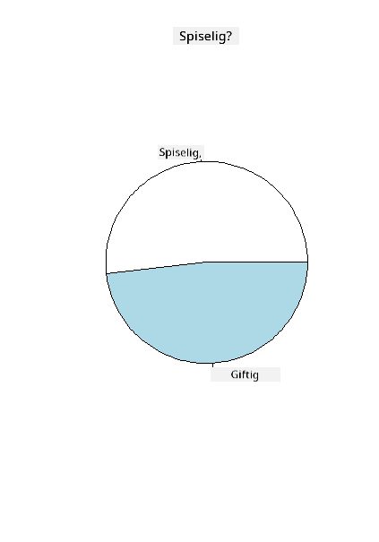
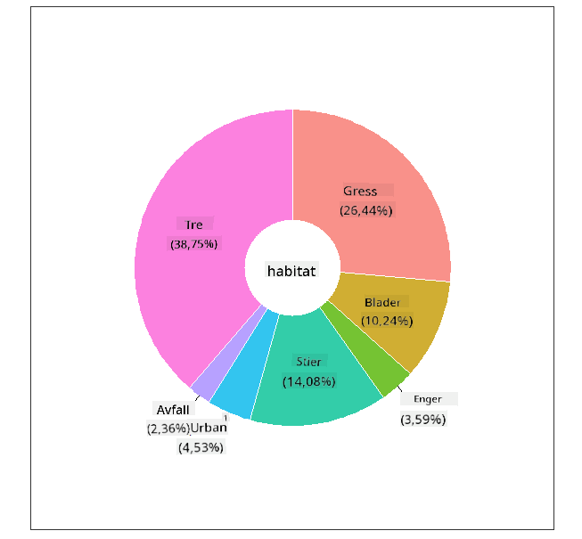
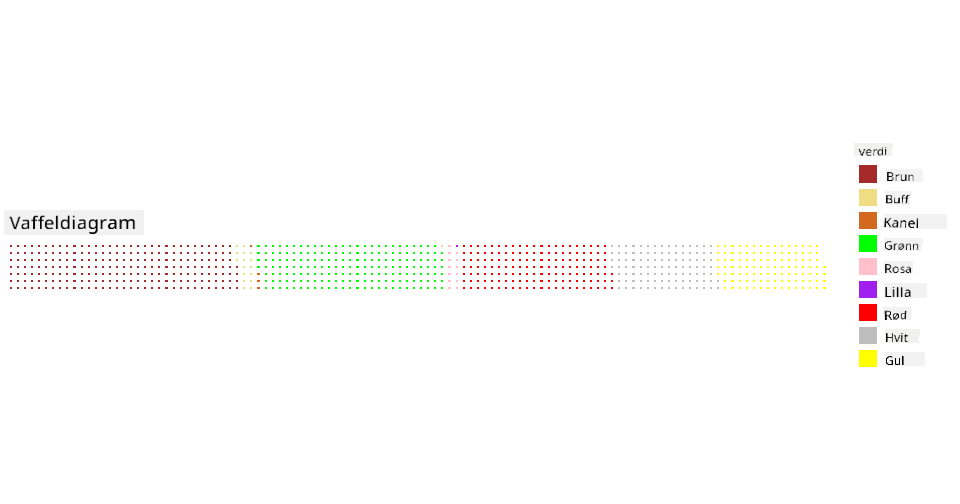

<!--
CO_OP_TRANSLATOR_METADATA:
{
  "original_hash": "47028abaaafa2bcb1079702d20569066",
  "translation_date": "2025-08-26T23:15:13+00:00",
  "source_file": "3-Data-Visualization/R/11-visualization-proportions/README.md",
  "language_code": "no"
}
-->
# Visualisering av proporsjoner

| ](../../../sketchnotes/11-Visualizing-Proportions.png)|
|:---:|
|Visualisering av proporsjoner - _Sketchnote av [@nitya](https://twitter.com/nitya)_ |

I denne leksjonen skal du bruke et naturfokusert datasett for å visualisere proporsjoner, som for eksempel hvor mange forskjellige typer sopp som finnes i et gitt datasett om sopp. La oss utforske disse fascinerende soppene ved hjelp av et datasett hentet fra Audubon som inneholder detaljer om 23 arter av skivesopper i Agaricus- og Lepiota-familiene. Du vil eksperimentere med smakfulle visualiseringer som:

- Kakediagrammer 🥧
- Smultringdiagrammer 🍩
- Vaffeldiagrammer 🧇

> 💡 Et veldig interessant prosjekt kalt [Charticulator](https://charticulator.com) fra Microsoft Research tilbyr et gratis dra-og-slipp-grensesnitt for datavisualiseringer. I en av deres opplæringer bruker de også dette soppdatasettet! Så du kan utforske dataene og lære biblioteket samtidig: [Charticulator tutorial](https://charticulator.com/tutorials/tutorial4.html).

## [Quiz før leksjonen](https://purple-hill-04aebfb03.1.azurestaticapps.net/quiz/20)

## Bli kjent med soppene dine 🍄

Sopp er veldig interessante. La oss importere et datasett for å studere dem:

```r
mushrooms = read.csv('../../data/mushrooms.csv')
head(mushrooms)
```
En tabell vises med noen flotte data for analyse:


| class     | cap-shape | cap-surface | cap-color | bruises | odor    | gill-attachment | gill-spacing | gill-size | gill-color | stalk-shape | stalk-root | stalk-surface-above-ring | stalk-surface-below-ring | stalk-color-above-ring | stalk-color-below-ring | veil-type | veil-color | ring-number | ring-type | spore-print-color | population | habitat |
| --------- | --------- | ----------- | --------- | ------- | ------- | --------------- | ------------ | --------- | ---------- | ----------- | ---------- | ------------------------ | ------------------------ | ---------------------- | ---------------------- | --------- | ---------- | ----------- | --------- | ----------------- | ---------- | ------- |
| Poisonous | Convex    | Smooth      | Brown     | Bruises | Pungent | Free            | Close        | Narrow    | Black      | Enlarging   | Equal      | Smooth                   | Smooth                   | White                  | White                  | Partial   | White      | One         | Pendant   | Black             | Scattered  | Urban   |
| Edible    | Convex    | Smooth      | Yellow    | Bruises | Almond  | Free            | Close        | Broad     | Black      | Enlarging   | Club       | Smooth                   | Smooth                   | White                  | White                  | Partial   | White      | One         | Pendant   | Brown             | Numerous   | Grasses |
| Edible    | Bell      | Smooth      | White     | Bruises | Anise   | Free            | Close        | Broad     | Brown      | Enlarging   | Club       | Smooth                   | Smooth                   | White                  | White                  | Partial   | White      | One         | Pendant   | Brown             | Numerous   | Meadows |
| Poisonous | Convex    | Scaly       | White     | Bruises | Pungent | Free            | Close        | Narrow    | Brown      | Enlarging   | Equal      | Smooth                   | Smooth                   | White                  | White                  | Partial   | White      | One         | Pendant   | Black             | Scattered  | Urban 
| Edible | Convex       |Smooth       | Green     | No Bruises| None   |Free            | Crowded       | Broad     | Black      | Tapering   | Equal      |  Smooth | Smooth                    | White                 | White                  | Partial    | White     | One         | Evanescent | Brown             | Abundant | Grasses
|Edible  |  Convex      | Scaly   | Yellow         | Bruises  | Almond  | Free | Close  |   Broad   |   Brown  | Enlarging   |   Club                      | Smooth                  | Smooth    | White                 |  White                | Partial      | White    |  One  |  Pendant | Black   | Numerous | Grasses
      
Med en gang legger du merke til at alle dataene er tekstbaserte. Du må konvertere disse dataene for å kunne bruke dem i et diagram. Faktisk er de fleste dataene representert som et objekt:

```r
names(mushrooms)
```

Resultatet er:

```output
[1] "class"                    "cap.shape"               
 [3] "cap.surface"              "cap.color"               
 [5] "bruises"                  "odor"                    
 [7] "gill.attachment"          "gill.spacing"            
 [9] "gill.size"                "gill.color"              
[11] "stalk.shape"              "stalk.root"              
[13] "stalk.surface.above.ring" "stalk.surface.below.ring"
[15] "stalk.color.above.ring"   "stalk.color.below.ring"  
[17] "veil.type"                "veil.color"              
[19] "ring.number"              "ring.type"               
[21] "spore.print.color"        "population"              
[23] "habitat"            
```
Ta disse dataene og konverter 'class'-kolonnen til en kategori:

```r
library(dplyr)
grouped=mushrooms %>%
  group_by(class) %>%
  summarise(count=n())
```


Nå, hvis du skriver ut soppdataene, kan du se at de har blitt gruppert i kategorier basert på klassen giftig/spiselig:
```r
View(grouped)
```


| class | count |
| --------- | --------- |
| Edible | 4208 |
| Poisonous| 3916 |


Hvis du følger rekkefølgen presentert i denne tabellen for å lage dine klassekategorietiketter, kan du lage et kakediagram. 

## Kake!

```r
pie(grouped$count,grouped$class, main="Edible?")
```
Voila, et kakediagram som viser proporsjonene av disse dataene basert på de to klassene av sopp. Det er ganske viktig å få rekkefølgen på etikettene riktig, spesielt her, så sørg for å verifisere rekkefølgen etikettarrayet er bygget med!



## Smultringer!

Et litt mer visuelt interessant kakediagram er et smultringdiagram, som er et kakediagram med et hull i midten. La oss se på dataene våre ved hjelp av denne metoden.

Se på de forskjellige habitatene hvor sopp vokser:

```r
library(dplyr)
habitat=mushrooms %>%
  group_by(habitat) %>%
  summarise(count=n())
View(habitat)
```
Resultatet er:
| habitat| count |
| --------- | --------- |
| Grasses    | 2148 |
| Leaves| 832 |
| Meadows    | 292 |
| Paths| 1144 |
| Urban    | 368 |
| Waste| 192 |
| Wood| 3148 |


Her grupperer du dataene dine etter habitat. Det er 7 oppførte, så bruk disse som etiketter for smultringdiagrammet ditt:

```r
library(ggplot2)
library(webr)
PieDonut(habitat, aes(habitat, count=count))
```



Denne koden bruker de to bibliotekene - ggplot2 og webr. Ved å bruke PieDonut-funksjonen i webr-biblioteket kan vi enkelt lage et smultringdiagram!

Smultringdiagrammer i R kan også lages ved hjelp av kun ggplot2-biblioteket. Du kan lære mer om det [her](https://www.r-graph-gallery.com/128-ring-or-donut-plot.html) og prøve det selv.

Nå som du vet hvordan du grupperer dataene dine og deretter viser dem som kake eller smultring, kan du utforske andre typer diagrammer. Prøv et vaffeldiagram, som er en annen måte å utforske mengder på.
## Vafler!

Et 'vaffel'-type diagram er en annen måte å visualisere mengder som et 2D-array av firkanter. Prøv å visualisere de forskjellige mengdene av soppens hattfarger i dette datasettet. For å gjøre dette må du installere et hjelpebibliotek kalt [waffle](https://cran.r-project.org/web/packages/waffle/waffle.pdf) og bruke det til å generere visualiseringen din:

```r
install.packages("waffle", repos = "https://cinc.rud.is")
```

Velg et segment av dataene dine for å gruppere:

```r
library(dplyr)
cap_color=mushrooms %>%
  group_by(cap.color) %>%
  summarise(count=n())
View(cap_color)
```

Lag et vaffeldiagram ved å lage etiketter og deretter gruppere dataene dine:

```r
library(waffle)
names(cap_color$count) = paste0(cap_color$cap.color)
waffle((cap_color$count/10), rows = 7, title = "Waffle Chart")+scale_fill_manual(values=c("brown", "#F0DC82", "#D2691E", "green", 
                                                                                     "pink", "purple", "red", "grey", 
                                                                                     "yellow","white"))
```

Ved å bruke et vaffeldiagram kan du tydelig se proporsjonene av hattfarger i dette soppdatasettet. Interessant nok er det mange sopper med grønne hatter!



I denne leksjonen lærte du tre måter å visualisere proporsjoner på. Først må du gruppere dataene dine i kategorier og deretter bestemme hvilken som er den beste måten å vise dataene på - kake, smultring eller vaffel. Alle er smakfulle og gir brukeren et øyeblikkelig innblikk i et datasett.

## 🚀 Utfordring

Prøv å gjenskape disse smakfulle diagrammene i [Charticulator](https://charticulator.com).
## [Quiz etter leksjonen](https://purple-hill-04aebfb03.1.azurestaticapps.net/quiz/21)

## Gjennomgang & Selvstudium

Noen ganger er det ikke åpenbart når man skal bruke et kake-, smultring- eller vaffeldiagram. Her er noen artikler du kan lese om dette emnet:

https://www.beautiful.ai/blog/battle-of-the-charts-pie-chart-vs-donut-chart

https://medium.com/@hypsypops/pie-chart-vs-donut-chart-showdown-in-the-ring-5d24fd86a9ce

https://www.mit.edu/~mbarker/formula1/f1help/11-ch-c6.htm

https://medium.datadriveninvestor.com/data-visualization-done-the-right-way-with-tableau-waffle-chart-fdf2a19be402

Gjør litt research for å finne mer informasjon om denne vanskelige avgjørelsen.
## Oppgave

[Prøv det i Excel](assignment.md)

---

**Ansvarsfraskrivelse**:  
Dette dokumentet er oversatt ved hjelp av AI-oversettelsestjenesten [Co-op Translator](https://github.com/Azure/co-op-translator). Selv om vi streber etter nøyaktighet, vær oppmerksom på at automatiserte oversettelser kan inneholde feil eller unøyaktigheter. Det originale dokumentet på sitt opprinnelige språk bør anses som den autoritative kilden. For kritisk informasjon anbefales profesjonell menneskelig oversettelse. Vi er ikke ansvarlige for misforståelser eller feiltolkninger som oppstår ved bruk av denne oversettelsen.