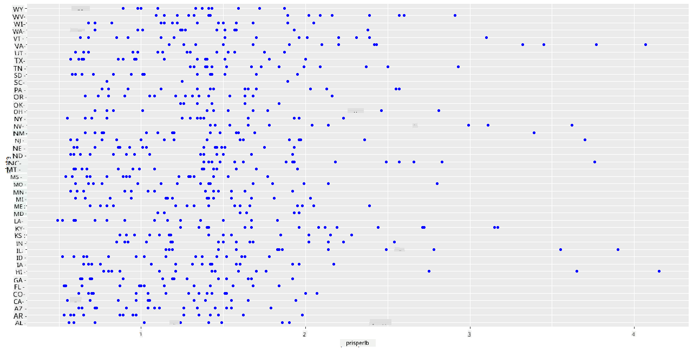
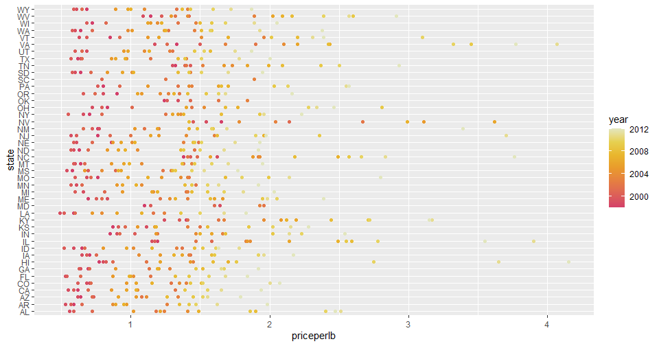
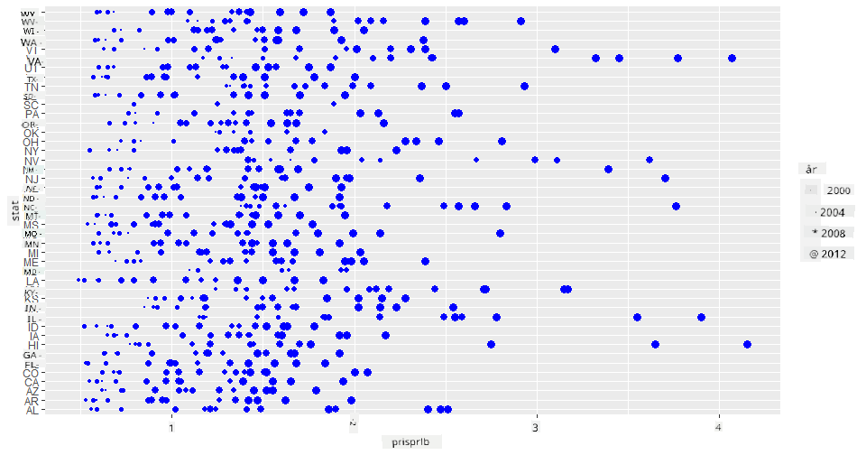
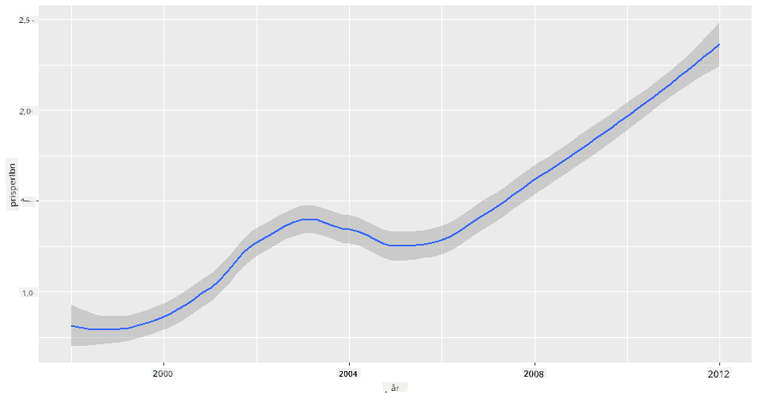
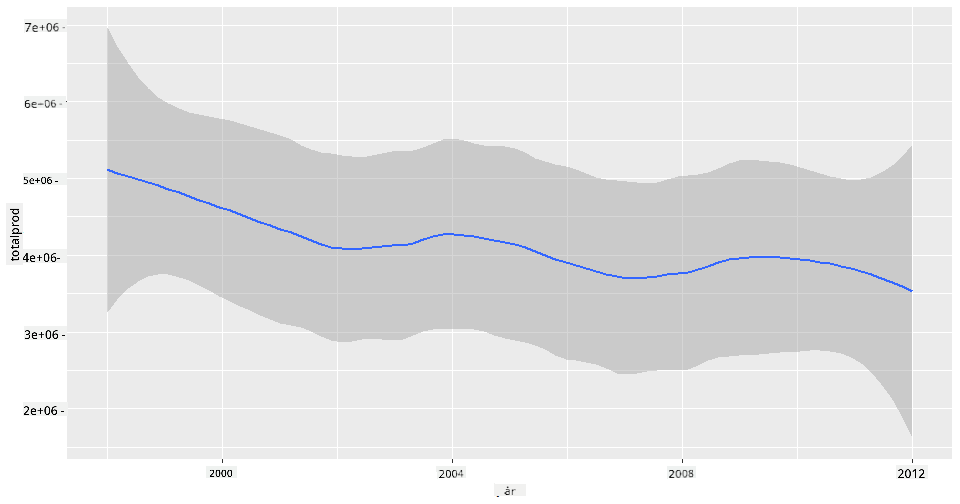
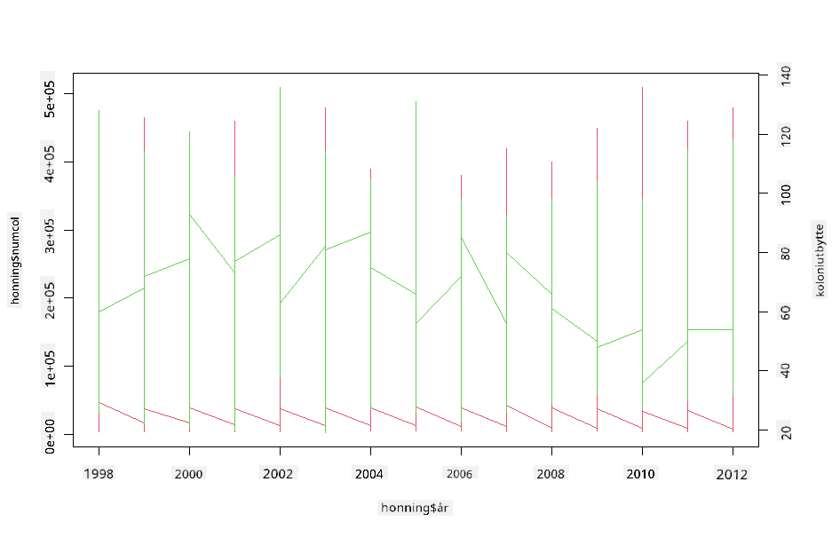

<!--
CO_OP_TRANSLATOR_METADATA:
{
  "original_hash": "a33c5d4b4156a2b41788d8720b6f724c",
  "translation_date": "2025-08-26T23:02:29+00:00",
  "source_file": "3-Data-Visualization/R/12-visualization-relationships/README.md",
  "language_code": "no"
}
-->
# Visualisering av relasjoner: Alt om honning 🍯

| ](../../../sketchnotes/12-Visualizing-Relationships.png)|
|:---:|
|Visualisering av relasjoner - _Sketchnote av [@nitya](https://twitter.com/nitya)_ |

Vi fortsetter med naturfokuset i vår forskning og utforsker interessante visualiseringer for å vise relasjoner mellom ulike typer honning, basert på et datasett fra [United States Department of Agriculture](https://www.nass.usda.gov/About_NASS/index.php).

Dette datasettet, som inneholder rundt 600 elementer, viser honningproduksjon i mange amerikanske stater. For eksempel kan du se på antall kolonier, avkastning per koloni, total produksjon, lagerbeholdning, pris per pund og verdien av honningen produsert i en gitt stat fra 1998-2012, med én rad per år for hver stat.

Det vil være interessant å visualisere relasjonen mellom en gitt stats produksjon per år og for eksempel prisen på honning i den staten. Alternativt kan du visualisere relasjonen mellom statenes honningavkastning per koloni. Denne tidsperioden dekker den ødeleggende 'CCD' eller 'Colony Collapse Disorder', som først ble observert i 2006 (http://npic.orst.edu/envir/ccd.html), så det er et tankevekkende datasett å studere. 🐝

## [Quiz før forelesning](https://purple-hill-04aebfb03.1.azurestaticapps.net/quiz/22)

I denne leksjonen kan du bruke ggplot2, som du har brukt tidligere, som et godt bibliotek for å visualisere relasjoner mellom variabler. Spesielt interessant er bruken av ggplot2s `geom_point` og `qplot`-funksjon, som lar deg lage spredningsdiagrammer og linjediagrammer for raskt å visualisere '[statistiske relasjoner](https://ggplot2.tidyverse.org/)', som hjelper dataforskeren med å forstå hvordan variabler henger sammen.

## Spredningsdiagrammer

Bruk et spredningsdiagram for å vise hvordan prisen på honning har utviklet seg år for år, per stat. ggplot2, ved bruk av `ggplot` og `geom_point`, grupperer praktisk statens data og viser datapunkter for både kategoriske og numeriske data.

La oss starte med å importere dataene og Seaborn:

```r
honey=read.csv('../../data/honey.csv')
head(honey)
```
Du legger merke til at honningdataene har flere interessante kolonner, inkludert år og pris per pund. La oss utforske disse dataene, gruppert etter amerikansk stat:

| state | numcol | yieldpercol | totalprod | stocks   | priceperlb | prodvalue | year |
| ----- | ------ | ----------- | --------- | -------- | ---------- | --------- | ---- |
| AL    | 16000  | 71          | 1136000   | 159000   | 0.72       | 818000    | 1998 |
| AZ    | 55000  | 60          | 3300000   | 1485000  | 0.64       | 2112000   | 1998 |
| AR    | 53000  | 65          | 3445000   | 1688000  | 0.59       | 2033000   | 1998 |
| CA    | 450000 | 83          | 37350000  | 12326000 | 0.62       | 23157000  | 1998 |
| CO    | 27000  | 72          | 1944000   | 1594000  | 0.7        | 1361000   | 1998 |
| FL    | 230000 | 98          |22540000   | 4508000  | 0.64       | 14426000  | 1998 |

Lag et enkelt spredningsdiagram for å vise relasjonen mellom prisen per pund honning og dens opprinnelsesstat i USA. Gjør `y`-aksen høy nok til å vise alle statene:

```r
library(ggplot2)
ggplot(honey, aes(x = priceperlb, y = state)) +
  geom_point(colour = "blue")
```


Vis nå de samme dataene med et honningfarget fargeskjema for å vise hvordan prisen utvikler seg over årene. Du kan gjøre dette ved å legge til en 'scale_color_gradientn'-parameter for å vise endringen år for år:

> ✅ Lær mer om [scale_color_gradientn](https://www.rdocumentation.org/packages/ggplot2/versions/0.9.1/topics/scale_colour_gradientn) - prøv et vakkert regnbuefargeskjema!

```r
ggplot(honey, aes(x = priceperlb, y = state, color=year)) +
  geom_point()+scale_color_gradientn(colours = colorspace::heat_hcl(7))
```


Med denne fargeendringen kan du tydelig se en sterk progresjon over årene når det gjelder honningpris per pund. Faktisk, hvis du ser på et utvalg i dataene for å verifisere (velg en gitt stat, for eksempel Arizona), kan du se et mønster med prisøkninger år for år, med få unntak:

| state | numcol | yieldpercol | totalprod | stocks  | priceperlb | prodvalue | year |
| ----- | ------ | ----------- | --------- | ------- | ---------- | --------- | ---- |
| AZ    | 55000  | 60          | 3300000   | 1485000 | 0.64       | 2112000   | 1998 |
| AZ    | 52000  | 62          | 3224000   | 1548000 | 0.62       | 1999000   | 1999 |
| AZ    | 40000  | 59          | 2360000   | 1322000 | 0.73       | 1723000   | 2000 |
| AZ    | 43000  | 59          | 2537000   | 1142000 | 0.72       | 1827000   | 2001 |
| AZ    | 38000  | 63          | 2394000   | 1197000 | 1.08       | 2586000   | 2002 |
| AZ    | 35000  | 72          | 2520000   | 983000  | 1.34       | 3377000   | 2003 |
| AZ    | 32000  | 55          | 1760000   | 774000  | 1.11       | 1954000   | 2004 |
| AZ    | 36000  | 50          | 1800000   | 720000  | 1.04       | 1872000   | 2005 |
| AZ    | 30000  | 65          | 1950000   | 839000  | 0.91       | 1775000   | 2006 |
| AZ    | 30000  | 64          | 1920000   | 902000  | 1.26       | 2419000   | 2007 |
| AZ    | 25000  | 64          | 1600000   | 336000  | 1.26       | 2016000   | 2008 |
| AZ    | 20000  | 52          | 1040000   | 562000  | 1.45       | 1508000   | 2009 |
| AZ    | 24000  | 77          | 1848000   | 665000  | 1.52       | 2809000   | 2010 |
| AZ    | 23000  | 53          | 1219000   | 427000  | 1.55       | 1889000   | 2011 |
| AZ    | 22000  | 46          | 1012000   | 253000  | 1.79       | 1811000   | 2012 |

En annen måte å visualisere denne progresjonen på er å bruke størrelse i stedet for farge. For fargeblinde brukere kan dette være et bedre alternativ. Rediger visualiseringen din for å vise en økning i pris ved en økning i prikkens omkrets:

```r
ggplot(honey, aes(x = priceperlb, y = state)) +
  geom_point(aes(size = year),colour = "blue") +
  scale_size_continuous(range = c(0.25, 3))
```
Du kan se at størrelsen på prikkene gradvis øker.



Er dette et enkelt tilfelle av tilbud og etterspørsel? På grunn av faktorer som klimaendringer og kollaps av kolonier, er det mindre honning tilgjengelig for kjøp år for år, og dermed øker prisen?

For å oppdage en korrelasjon mellom noen av variablene i dette datasettet, la oss utforske noen linjediagrammer.

## Linjediagrammer

Spørsmål: Er det en klar økning i prisen på honning per pund år for år? Du kan enklest oppdage dette ved å lage et enkelt linjediagram:

```r
qplot(honey$year,honey$priceperlb, geom='smooth', span =0.5, xlab = "year",ylab = "priceperlb")
```
Svar: Ja, med noen unntak rundt året 2003:



Spørsmål: Vel, i 2003 kan vi også se en topp i honningforsyningen? Hva om du ser på total produksjon år for år?

```python
qplot(honey$year,honey$totalprod, geom='smooth', span =0.5, xlab = "year",ylab = "totalprod")
```



Svar: Ikke egentlig. Hvis du ser på total produksjon, ser det faktisk ut til å ha økt det året, selv om mengden honning som produseres generelt sett er i nedgang i disse årene.

Spørsmål: I så fall, hva kan ha forårsaket den toppen i prisen på honning rundt 2003?

For å oppdage dette kan du utforske et facet grid.

## Facet grids

Facet grids tar én fasett av datasettet ditt (i vårt tilfelle kan du velge 'år' for å unngå å produsere for mange fasetter). Seaborn kan deretter lage et diagram for hver av disse fasettene av dine valgte x- og y-koordinater for enklere visuell sammenligning. Skiller 2003 seg ut i denne typen sammenligning?

Lag et facet grid ved å bruke `facet_wrap` som anbefalt av [ggplot2s dokumentasjon](https://ggplot2.tidyverse.org/reference/facet_wrap.html).

```r
ggplot(honey, aes(x=yieldpercol, y = numcol,group = 1)) + 
  geom_line() + facet_wrap(vars(year))
```
I denne visualiseringen kan du sammenligne avkastning per koloni og antall kolonier år for år, side om side med en wrap satt til 3 for kolonnene:


For dette datasettet skiller ingenting seg spesielt ut når det gjelder antall kolonier og deres avkastning, år for år og stat for stat. Er det en annen måte å finne en korrelasjon mellom disse to variablene?

## Dual-line Plots

Prøv et multiline diagram ved å legge to linjediagrammer oppå hverandre, ved bruk av Rs `par` og `plot`-funksjon. Vi vil plotte året på x-aksen og vise to y-akser. Så, vis avkastning per koloni og antall kolonier, superimponert:

```r
par(mar = c(5, 4, 4, 4) + 0.3)              
plot(honey$year, honey$numcol, pch = 16, col = 2,type="l")              
par(new = TRUE)                             
plot(honey$year, honey$yieldpercol, pch = 17, col = 3,              
     axes = FALSE, xlab = "", ylab = "",type="l")
axis(side = 4, at = pretty(range(y2)))      
mtext("colony yield", side = 4, line = 3)   
```


Selv om ingenting skiller seg ut rundt året 2003, lar det oss avslutte denne leksjonen på en litt lykkeligere tone: selv om det generelt er et synkende antall kolonier, stabiliserer antallet kolonier seg, selv om deres avkastning per koloni avtar.

Heia, bier, heia!

🐝❤️
## 🚀 Utfordring

I denne leksjonen lærte du litt mer om andre bruksområder for spredningsdiagrammer og linjenett, inkludert facet grids. Utfordre deg selv til å lage et facet grid ved hjelp av et annet datasett, kanskje et du brukte tidligere i disse leksjonene. Legg merke til hvor lang tid det tar å lage og hvor forsiktig du må være med hvor mange grids du trenger å tegne ved hjelp av disse teknikkene.
## [Quiz etter forelesning](https://purple-hill-04aebfb03.1.azurestaticapps.net/quiz/23)

## Gjennomgang & Selvstudium

Linjediagrammer kan være enkle eller ganske komplekse. Les litt i [ggplot2-dokumentasjonen](https://ggplot2.tidyverse.org/reference/geom_path.html#:~:text=geom_line()%20connects%20them%20in,which%20cases%20are%20connected%20together) om de ulike måtene du kan bygge dem på. Prøv å forbedre linjediagrammene du bygde i denne leksjonen med andre metoder som er oppført i dokumentasjonen.
## Oppgave

[Dykk inn i bikuben](assignment.md)

---

**Ansvarsfraskrivelse**:  
Dette dokumentet er oversatt ved hjelp av AI-oversettelsestjenesten [Co-op Translator](https://github.com/Azure/co-op-translator). Selv om vi tilstreber nøyaktighet, vær oppmerksom på at automatiserte oversettelser kan inneholde feil eller unøyaktigheter. Det originale dokumentet på sitt opprinnelige språk bør anses som den autoritative kilden. For kritisk informasjon anbefales profesjonell menneskelig oversettelse. Vi er ikke ansvarlige for misforståelser eller feiltolkninger som oppstår ved bruk av denne oversettelsen.