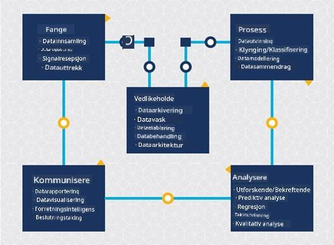
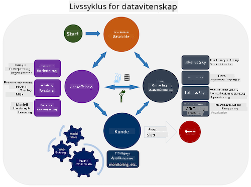
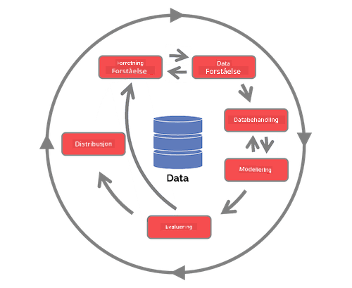

<!--
CO_OP_TRANSLATOR_METADATA:
{
  "original_hash": "07e12a25d20b8f191e3cb651c27fdb2b",
  "translation_date": "2025-09-06T21:10:51+00:00",
  "source_file": "4-Data-Science-Lifecycle/14-Introduction/README.md",
  "language_code": "no"
}
-->
# Introduksjon til livssyklusen for datavitenskap

| ](../../sketchnotes/14-DataScience-Lifecycle.png)|
|:---:|
| Introduksjon til livssyklusen for datavitenskap - _Sketchnote av [@nitya](https://twitter.com/nitya)_ |

## [Quiz før forelesning](https://ff-quizzes.netlify.app/en/ds/quiz/26)

Du har sannsynligvis innsett at datavitenskap er en prosess. Denne prosessen kan deles inn i fem stadier:

- Innsamling
- Bearbeiding
- Analyse
- Kommunikasjon
- Vedlikehold

Denne leksjonen fokuserer på tre deler av livssyklusen: innsamling, bearbeiding og vedlikehold.

  
> Foto av [Berkeley School of Information](https://ischoolonline.berkeley.edu/data-science/what-is-data-science/)

## Innsamling

Den første fasen av livssyklusen er svært viktig, da de neste fasene er avhengige av den. Den består praktisk talt av to stadier kombinert i ett: innhenting av data og definering av formål og problemer som må adresseres.  
Å definere prosjektets mål krever en dypere forståelse av problemet eller spørsmålet. Først må vi identifisere og engasjere de som trenger å få løst sitt problem. Dette kan være interessenter i en bedrift eller sponsorer av prosjektet, som kan hjelpe med å identifisere hvem eller hva som vil dra nytte av prosjektet, samt hva og hvorfor de trenger det. Et godt definert mål bør være målbart og kvantifiserbart for å definere et akseptabelt resultat.

Spørsmål en datavitenskapsmann kan stille:
- Har dette problemet blitt adressert tidligere? Hva ble oppdaget?
- Er formålet og målet forstått av alle involverte?
- Finnes det uklarheter, og hvordan kan de reduseres?
- Hva er begrensningene?
- Hvordan vil sluttresultatet potensielt se ut?
- Hvor mye ressurser (tid, folk, datakraft) er tilgjengelig?

Neste steg er å identifisere, samle inn og utforske dataene som trengs for å oppnå de definerte målene. I denne fasen av innhenting må datavitenskapsfolk også evaluere mengden og kvaliteten på dataene. Dette krever noe datautforskning for å bekrefte at det som er samlet inn vil støtte oppnåelsen av ønsket resultat.

Spørsmål en datavitenskapsmann kan stille om dataene:
- Hvilke data er allerede tilgjengelige for meg?
- Hvem eier disse dataene?
- Hva er personvernrelaterte bekymringer?
- Har jeg nok data til å løse dette problemet?
- Er dataene av akseptabel kvalitet for dette problemet?
- Hvis jeg oppdager tilleggsinformasjon gjennom disse dataene, bør vi vurdere å endre eller redefinere målene?

## Bearbeiding

Bearbeidingsfasen i livssyklusen fokuserer på å oppdage mønstre i dataene samt modellering. Noen teknikker som brukes i bearbeidingsfasen krever statistiske metoder for å avdekke mønstre. Typisk ville dette være en tidkrevende oppgave for et menneske med et stort datasett, og man vil derfor stole på datamaskiner for å gjøre det tunge arbeidet og akselerere prosessen. Denne fasen er også der datavitenskap og maskinlæring møtes. Som du lærte i den første leksjonen, er maskinlæring prosessen med å bygge modeller for å forstå dataene. Modeller er en representasjon av forholdet mellom variabler i dataene som hjelper med å forutsi resultater.

Vanlige teknikker som brukes i denne fasen er dekket i ML for Beginners-kurset. Følg lenkene for å lære mer om dem:

- [Klassifisering](https://github.com/microsoft/ML-For-Beginners/tree/main/4-Classification): Organisere data i kategorier for mer effektiv bruk.
- [Klynging](https://github.com/microsoft/ML-For-Beginners/tree/main/5-Clustering): Gruppere data i lignende grupper.
- [Regresjon](https://github.com/microsoft/ML-For-Beginners/tree/main/2-Regression): Bestemme forholdet mellom variabler for å forutsi eller anslå verdier.

## Vedlikehold

I diagrammet over livssyklusen kan du ha lagt merke til at vedlikehold ligger mellom innsamling og bearbeiding. Vedlikehold er en kontinuerlig prosess med å administrere, lagre og sikre data gjennom hele prosjektets varighet og bør tas i betraktning gjennom hele prosjektet.

### Lagring av data

Hvordan og hvor dataene lagres kan påvirke kostnadene for lagring samt ytelsen til hvor raskt dataene kan hentes. Slike avgjørelser tas sannsynligvis ikke av en datavitenskapsmann alene, men de kan finne seg i å ta valg om hvordan de skal jobbe med dataene basert på hvordan de er lagret.

Her er noen aspekter ved moderne datalagringssystemer som kan påvirke disse valgene:

**Lokal vs ekstern vs offentlig eller privat sky**

Lokal lagring refererer til å administrere dataene på eget utstyr, som å eie en server med harddisker som lagrer dataene, mens ekstern lagring avhenger av utstyr du ikke eier, som et datasenter. Den offentlige skyen er et populært valg for lagring av data som ikke krever kunnskap om hvordan eller hvor dataene lagres, der "offentlig" refererer til en felles underliggende infrastruktur som deles av alle som bruker skyen. Noen organisasjoner har strenge sikkerhetspolicyer som krever at de har full tilgang til utstyret der dataene er lagret, og vil derfor bruke en privat sky som tilbyr egne skytjenester. Du vil lære mer om data i skyen i [senere leksjoner](https://github.com/microsoft/Data-Science-For-Beginners/tree/main/5-Data-Science-In-Cloud).

**Kald vs varm data**

Når du trener modellene dine, kan du trenge mer treningsdata. Hvis du er fornøyd med modellen din, vil mer data komme inn for at modellen skal tjene sitt formål. Uansett vil kostnadene for lagring og tilgang til data øke etter hvert som du samler mer av det. Å skille sjelden brukte data, kjent som kald data, fra ofte brukte varme data kan være et billigere alternativ for datalagring gjennom maskinvare- eller programvaretjenester. Hvis kald data må hentes, kan det ta litt lengre tid å hente dem sammenlignet med varme data.

### Administrere data

Når du jobber med data, kan du oppdage at noen av dataene må rengjøres ved hjelp av noen av teknikkene som er dekket i leksjonen om [datapreparering](https://github.com/microsoft/Data-Science-For-Beginners/tree/main/2-Working-With-Data/08-data-preparation) for å bygge nøyaktige modeller. Når nye data kommer inn, vil de trenge noen av de samme prosessene for å opprettholde konsistens i kvalitet. Noen prosjekter vil involvere bruk av et automatisert verktøy for rensing, aggregering og komprimering før dataene flyttes til sin endelige plassering. Azure Data Factory er et eksempel på et av disse verktøyene.

### Sikre dataene

Et av hovedmålene med å sikre data er å sørge for at de som jobber med dem har kontroll over hva som samles inn og i hvilken kontekst det brukes. Å holde data sikre innebærer å begrense tilgang til kun de som trenger det, overholde lokale lover og forskrifter, samt opprettholde etiske standarder, som dekket i [etikksleksjonen](https://github.com/microsoft/Data-Science-For-Beginners/tree/main/1-Introduction/02-ethics).

Her er noen ting et team kan gjøre med sikkerhet i tankene:
- Bekrefte at alle data er kryptert
- Gi kundene informasjon om hvordan dataene deres brukes
- Fjerne dataadgang fra de som har forlatt prosjektet
- La kun visse prosjektmedlemmer endre dataene

## 🚀 Utfordring

Det finnes mange versjoner av livssyklusen for datavitenskap, der hvert steg kan ha forskjellige navn og antall stadier, men vil inneholde de samme prosessene som er nevnt i denne leksjonen.

Utforsk [Team Data Science Process-livssyklusen](https://docs.microsoft.com/en-us/azure/architecture/data-science-process/lifecycle) og [Cross-industry standard process for data mining](https://www.datascience-pm.com/crisp-dm-2/). Nevn tre likheter og forskjeller mellom de to.

|Team Data Science Process (TDSP)|Cross-industry standard process for data mining (CRISP-DM)|
|--|--|
| |  |
| Bilde av [Microsoft](https://docs.microsoft.comazure/architecture/data-science-process/lifecycle) | Bilde av [Data Science Process Alliance](https://www.datascience-pm.com/crisp-dm-2/) |

## [Quiz etter forelesning](https://ff-quizzes.netlify.app/en/ds/quiz/27)

## Gjennomgang og selvstudium

Å anvende livssyklusen for datavitenskap innebærer flere roller og oppgaver, der noen kan fokusere på spesifikke deler av hver fase. Team Data Science Process gir noen ressurser som forklarer typene roller og oppgaver som noen kan ha i et prosjekt.

* [Team Data Science Process roller og oppgaver](https://docs.microsoft.com/en-us/azure/architecture/data-science-process/roles-tasks)  
* [Utføre datavitenskapsoppgaver: utforskning, modellering og distribusjon](https://docs.microsoft.com/en-us/azure/architecture/data-science-process/execute-data-science-tasks)

## Oppgave

[Vurdere et datasett](assignment.md)

---

**Ansvarsfraskrivelse**:  
Dette dokumentet er oversatt ved hjelp av AI-oversettelsestjenesten [Co-op Translator](https://github.com/Azure/co-op-translator). Selv om vi tilstreber nøyaktighet, vennligst vær oppmerksom på at automatiske oversettelser kan inneholde feil eller unøyaktigheter. Det originale dokumentet på sitt opprinnelige språk bør anses som den autoritative kilden. For kritisk informasjon anbefales profesjonell menneskelig oversettelse. Vi er ikke ansvarlige for eventuelle misforståelser eller feiltolkninger som oppstår ved bruk av denne oversettelsen.