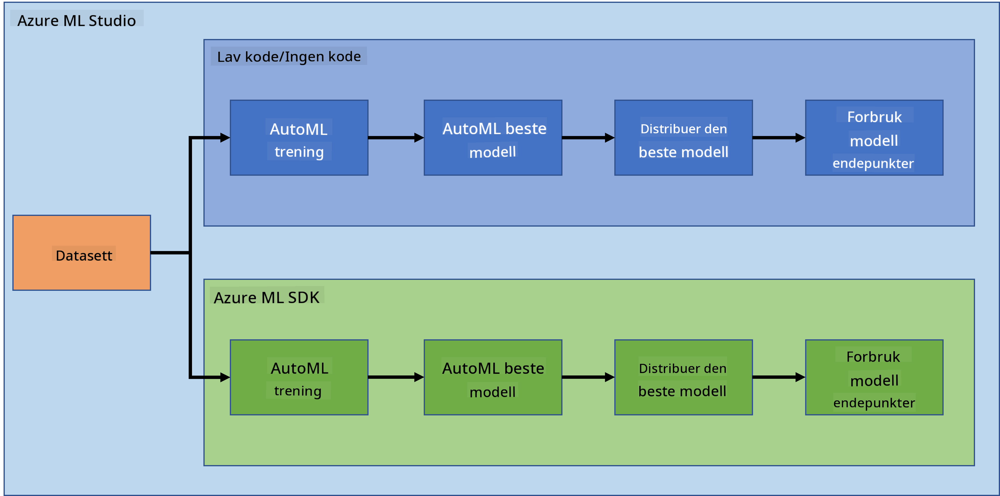
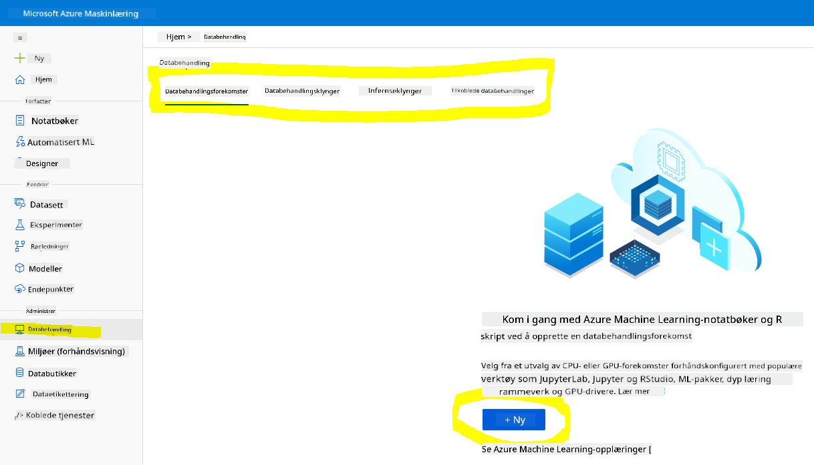
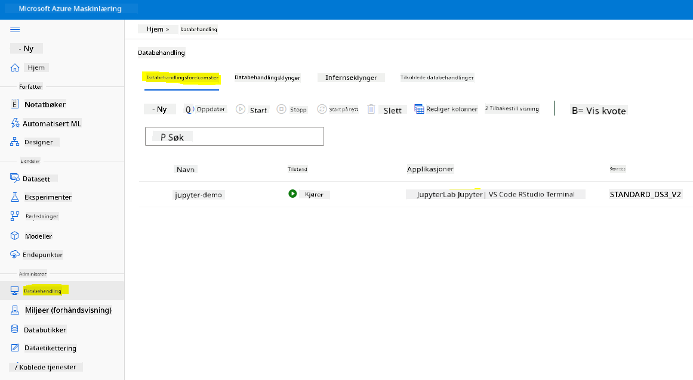
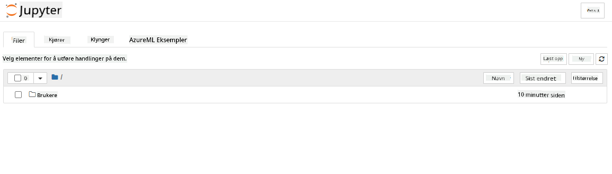

<!--
CO_OP_TRANSLATOR_METADATA:
{
  "original_hash": "73dead89dc2ddda4d6ec0232814a191e",
  "translation_date": "2025-08-26T22:16:10+00:00",
  "source_file": "5-Data-Science-In-Cloud/19-Azure/README.md",
  "language_code": "no"
}
-->
# Data Science i skyen: "Azure ML SDK"-metoden

| ](../../sketchnotes/19-DataScience-Cloud.png)|
|:---:|
| Data Science i skyen: Azure ML SDK - _Sketchnote av [@nitya](https://twitter.com/nitya)_ |

Innholdsfortegnelse:

- [Data Science i skyen: "Azure ML SDK"-metoden](../../../../5-Data-Science-In-Cloud/19-Azure)
  - [Quiz før forelesning](../../../../5-Data-Science-In-Cloud/19-Azure)
  - [1. Introduksjon](../../../../5-Data-Science-In-Cloud/19-Azure)
    - [1.1 Hva er Azure ML SDK?](../../../../5-Data-Science-In-Cloud/19-Azure)
    - [1.2 Introduksjon til prosjektet og datasettet for hjertesviktprediksjon](../../../../5-Data-Science-In-Cloud/19-Azure)
  - [2. Trening av en modell med Azure ML SDK](../../../../5-Data-Science-In-Cloud/19-Azure)
    - [2.1 Opprett et Azure ML-arbeidsområde](../../../../5-Data-Science-In-Cloud/19-Azure)
    - [2.2 Opprett en beregningsinstans](../../../../5-Data-Science-In-Cloud/19-Azure)
    - [2.3 Laste inn datasettet](../../../../5-Data-Science-In-Cloud/19-Azure)
    - [2.4 Opprette Notebooks](../../../../5-Data-Science-In-Cloud/19-Azure)
    - [2.5 Trening av en modell](../../../../5-Data-Science-In-Cloud/19-Azure)
      - [2.5.1 Konfigurer arbeidsområde, eksperiment, beregningsklynge og datasett](../../../../5-Data-Science-In-Cloud/19-Azure)
      - [2.5.2 AutoML-konfigurasjon og trening](../../../../5-Data-Science-In-Cloud/19-Azure)
  - [3. Modellutrulling og bruk av endepunkt med Azure ML SDK](../../../../5-Data-Science-In-Cloud/19-Azure)
    - [3.1 Lagre den beste modellen](../../../../5-Data-Science-In-Cloud/19-Azure)
    - [3.2 Modellutrulling](../../../../5-Data-Science-In-Cloud/19-Azure)
    - [3.3 Bruk av endepunkt](../../../../5-Data-Science-In-Cloud/19-Azure)
  - [🚀 Utfordring](../../../../5-Data-Science-In-Cloud/19-Azure)
  - [Quiz etter forelesning](../../../../5-Data-Science-In-Cloud/19-Azure)
  - [Gjennomgang og selvstudium](../../../../5-Data-Science-In-Cloud/19-Azure)
  - [Oppgave](../../../../5-Data-Science-In-Cloud/19-Azure)

## [Quiz før forelesning](https://purple-hill-04aebfb03.1.azurestaticapps.net/quiz/36)

## 1. Introduksjon

### 1.1 Hva er Azure ML SDK?

Dataforskere og AI-utviklere bruker Azure Machine Learning SDK for å bygge og kjøre maskinlæringsarbeidsflyter med Azure Machine Learning-tjenesten. Du kan bruke tjenesten i ethvert Python-miljø, inkludert Jupyter Notebooks, Visual Studio Code eller din foretrukne Python IDE.

Hovedområder i SDK-en inkluderer:

- Utforske, forberede og administrere livssyklusen til datasett som brukes i maskinlæringseksperimenter.
- Administrere skyressurser for overvåking, logging og organisering av maskinlæringseksperimenter.
- Trene modeller enten lokalt eller ved å bruke skyressurser, inkludert GPU-akselerert modelltrening.
- Bruke automatisert maskinlæring, som aksepterer konfigurasjonsparametere og treningsdata. Den itererer automatisk gjennom algoritmer og hyperparameterinnstillinger for å finne den beste modellen for prediksjoner.
- Utrulling av webtjenester for å konvertere dine trente modeller til RESTful-tjenester som kan brukes i enhver applikasjon.

[Les mer om Azure Machine Learning SDK](https://docs.microsoft.com/python/api/overview/azure/ml?WT.mc_id=academic-77958-bethanycheum&ocid=AID3041109)

I [forrige leksjon](../18-Low-Code/README.md) så vi hvordan vi kunne trene, rulle ut og bruke en modell på en Low code/No code-måte. Vi brukte hjertesvikt-datasettet for å generere en hjertesviktprediksjonsmodell. I denne leksjonen skal vi gjøre nøyaktig det samme, men ved hjelp av Azure Machine Learning SDK.



### 1.2 Introduksjon til prosjektet og datasettet for hjertesviktprediksjon

Se [her](../18-Low-Code/README.md) for introduksjon til prosjektet og datasettet for hjertesviktprediksjon.

## 2. Trening av en modell med Azure ML SDK

### 2.1 Opprett et Azure ML-arbeidsområde

For enkelhets skyld skal vi jobbe i en Jupyter Notebook. Dette forutsetter at du allerede har et arbeidsområde og en beregningsinstans. Hvis du allerede har et arbeidsområde, kan du gå direkte til seksjon 2.3 Opprettelse av Notebook.

Hvis ikke, følg instruksjonene i seksjonen **2.1 Opprett et Azure ML-arbeidsområde** i [forrige leksjon](../18-Low-Code/README.md) for å opprette et arbeidsområde.

### 2.2 Opprett en beregningsinstans

I [Azure ML-arbeidsområdet](https://ml.azure.com/) vi opprettet tidligere, gå til Compute-menyen, og du vil se de forskjellige beregningsressursene som er tilgjengelige.



La oss opprette en beregningsinstans for å klargjøre en Jupyter Notebook. 
1. Klikk på + Ny-knappen. 
2. Gi et navn til beregningsinstansen din.
3. Velg dine alternativer: CPU eller GPU, VM-størrelse og antall kjerner.
4. Klikk på Opprett-knappen.

Gratulerer, du har nettopp opprettet en beregningsinstans! Vi skal bruke denne beregningsinstansen til å opprette en Notebook i seksjonen [Opprette Notebooks](../../../../5-Data-Science-In-Cloud/19-Azure).

### 2.3 Laste inn datasettet

Se seksjonen **2.3 Laste inn datasettet** i [forrige leksjon](../18-Low-Code/README.md) hvis du ikke har lastet opp datasettet ennå.

### 2.4 Opprette Notebooks

> **_MERK:_** For neste steg kan du enten opprette en ny Notebook fra bunnen av, eller du kan laste opp [Notebooken vi opprettet](notebook.ipynb) i Azure ML Studio. For å laste den opp, klikk ganske enkelt på "Notebook"-menyen og last opp Notebooken.

Notebooks er en veldig viktig del av data science-prosessen. De kan brukes til å utføre utforskende dataanalyse (EDA), koble til en beregningsklynge for å trene en modell, eller koble til en inferanseklynge for å rulle ut et endepunkt.

For å opprette en Notebook trenger vi en beregningsnode som kjører Jupyter Notebook-instansen. Gå tilbake til [Azure ML-arbeidsområdet](https://ml.azure.com/) og klikk på Beregningsinstanser. I listen over beregningsinstanser bør du se [beregningsinstansen vi opprettet tidligere](../../../../5-Data-Science-In-Cloud/19-Azure).

1. I seksjonen Applikasjoner, klikk på Jupyter-alternativet. 
2. Kryss av i boksen "Ja, jeg forstår" og klikk på Fortsett-knappen.

3. Dette vil åpne en ny nettleserfane med Jupyter Notebook-instansen din som vist nedenfor. Klikk på "Ny"-knappen for å opprette en Notebook.



Nå som vi har en Notebook, kan vi begynne å trene modellen med Azure ML SDK.

### 2.5 Trening av en modell

Først og fremst, hvis du noen gang er i tvil, se [Azure ML SDK-dokumentasjonen](https://docs.microsoft.com/python/api/overview/azure/ml?WT.mc_id=academic-77958-bethanycheum&ocid=AID3041109). Den inneholder all nødvendig informasjon for å forstå modulene vi skal gjennomgå i denne leksjonen.

#### 2.5.1 Konfigurer arbeidsområde, eksperiment, beregningsklynge og datasett

Du må laste inn `workspace` fra konfigurasjonsfilen ved å bruke følgende kode:

```python
from azureml.core import Workspace
ws = Workspace.from_config()
```

Dette returnerer et objekt av typen `Workspace` som representerer arbeidsområdet. Deretter må du opprette et `eksperiment` ved å bruke følgende kode:

```python
from azureml.core import Experiment
experiment_name = 'aml-experiment'
experiment = Experiment(ws, experiment_name)
```

For å hente eller opprette et eksperiment fra et arbeidsområde, ber du om eksperimentet ved hjelp av eksperimentnavnet. Eksperimentnavnet må være 3-36 tegn langt, starte med en bokstav eller et tall, og kan kun inneholde bokstaver, tall, understreker og bindestreker. Hvis eksperimentet ikke finnes i arbeidsområdet, opprettes et nytt eksperiment.

Nå må du opprette en beregningsklynge for treningen ved å bruke følgende kode. Merk at dette steget kan ta noen minutter.

```python
from azureml.core.compute import AmlCompute

aml_name = "heart-f-cluster"
try:
    aml_compute = AmlCompute(ws, aml_name)
    print('Found existing AML compute context.')
except:
    print('Creating new AML compute context.')
    aml_config = AmlCompute.provisioning_configuration(vm_size = "Standard_D2_v2", min_nodes=1, max_nodes=3)
    aml_compute = AmlCompute.create(ws, name = aml_name, provisioning_configuration = aml_config)
    aml_compute.wait_for_completion(show_output = True)

cts = ws.compute_targets
compute_target = cts[aml_name]
```

Du kan hente datasettet fra arbeidsområdet ved å bruke datasettets navn på følgende måte:

```python
dataset = ws.datasets['heart-failure-records']
df = dataset.to_pandas_dataframe()
df.describe()
```

#### 2.5.2 AutoML-konfigurasjon og trening

For å sette opp AutoML-konfigurasjonen, bruk [AutoMLConfig-klassen](https://docs.microsoft.com/python/api/azureml-train-automl-client/azureml.train.automl.automlconfig(class)?WT.mc_id=academic-77958-bethanycheum&ocid=AID3041109).

Som beskrevet i dokumentasjonen, finnes det mange parametere du kan eksperimentere med. For dette prosjektet vil vi bruke følgende parametere:

- `experiment_timeout_minutes`: Maksimal tid (i minutter) eksperimentet får kjøre før det automatisk stoppes og resultatene gjøres tilgjengelige.
- `max_concurrent_iterations`: Maksimalt antall samtidige treningsiterasjoner tillatt for eksperimentet.
- `primary_metric`: Den primære metrikken som brukes for å bestemme eksperimentets status.
- `compute_target`: Azure Machine Learning-beregningsressursen som eksperimentet skal kjøres på.
- `task`: Typen oppgave som skal kjøres. Verdier kan være 'classification', 'regression' eller 'forecasting' avhengig av typen AutoML-problem som skal løses.
- `training_data`: Treningsdataene som skal brukes i eksperimentet. Det bør inneholde både treningsfunksjoner og en etikettkolonne (eventuelt en kolonne for prøvevekter).
- `label_column_name`: Navnet på etikettkolonnen.
- `path`: Den fullstendige banen til Azure Machine Learning-prosjektmappen.
- `enable_early_stopping`: Om tidlig avslutning skal aktiveres hvis resultatene ikke forbedres på kort sikt.
- `featurization`: Indikator for om featurization skal gjøres automatisk eller tilpasses.
- `debug_log`: Loggfilen der feilsøkingsinformasjon skal skrives.

```python
from azureml.train.automl import AutoMLConfig

project_folder = './aml-project'

automl_settings = {
    "experiment_timeout_minutes": 20,
    "max_concurrent_iterations": 3,
    "primary_metric" : 'AUC_weighted'
}

automl_config = AutoMLConfig(compute_target=compute_target,
                             task = "classification",
                             training_data=dataset,
                             label_column_name="DEATH_EVENT",
                             path = project_folder,  
                             enable_early_stopping= True,
                             featurization= 'auto',
                             debug_log = "automl_errors.log",
                             **automl_settings
                            )
```

Nå som konfigurasjonen er satt opp, kan du trene modellen ved å bruke følgende kode. Dette steget kan ta opptil en time, avhengig av størrelsen på klyngen din.

```python
remote_run = experiment.submit(automl_config)
```

Du kan kjøre RunDetails-widgeten for å vise de forskjellige eksperimentene.
```python
from azureml.widgets import RunDetails
RunDetails(remote_run).show()
```

## 3. Modellutrulling og bruk av endepunkt med Azure ML SDK

### 3.1 Lagre den beste modellen

`remote_run` er et objekt av typen [AutoMLRun](https://docs.microsoft.com/python/api/azureml-train-automl-client/azureml.train.automl.run.automlrun?WT.mc_id=academic-77958-bethanycheum&ocid=AID3041109). Dette objektet inneholder metoden `get_output()` som returnerer den beste kjøringen og den tilsvarende tilpassede modellen.

```python
best_run, fitted_model = remote_run.get_output()
```

Du kan se parameterne som ble brukt for den beste modellen ved å bare skrive ut `fitted_model` og se egenskapene til den beste modellen ved å bruke metoden [get_properties()](https://docs.microsoft.com/python/api/azureml-core/azureml.core.run(class)?view=azure-ml-py#azureml_core_Run_get_properties?WT.mc_id=academic-77958-bethanycheum&ocid=AID3041109).

```python
best_run.get_properties()
```

Registrer deretter modellen med metoden [register_model](https://docs.microsoft.com/python/api/azureml-train-automl-client/azureml.train.automl.run.automlrun?view=azure-ml-py#register-model-model-name-none--description-none--tags-none--iteration-none--metric-none-?WT.mc_id=academic-77958-bethanycheum&ocid=AID3041109).
```python
model_name = best_run.properties['model_name']
script_file_name = 'inference/score.py'
best_run.download_file('outputs/scoring_file_v_1_0_0.py', 'inference/score.py')
description = "aml heart failure project sdk"
model = best_run.register_model(model_name = model_name,
                                model_path = './outputs/',
                                description = description,
                                tags = None)
```

### 3.2 Modellutrulling

Når den beste modellen er lagret, kan vi rulle den ut med klassen [InferenceConfig](https://docs.microsoft.com/python/api/azureml-core/azureml.core.model.inferenceconfig?view=azure-ml-py?ocid=AID3041109). InferenceConfig representerer konfigurasjonsinnstillingene for et tilpasset miljø som brukes til utrulling. Klassen [AciWebservice](https://docs.microsoft.com/python/api/azureml-core/azureml.core.webservice.aciwebservice?view=azure-ml-py) representerer en maskinlæringsmodell som er rullet ut som et webtjenesteendepunkt på Azure Container Instances. En utrullet tjeneste opprettes fra en modell, et skript og tilhørende filer. Den resulterende webtjenesten er et lastbalansert HTTP-endepunkt med en REST API. Du kan sende data til denne API-en og motta prediksjonen returnert av modellen.

Modellen rulles ut ved hjelp av metoden [deploy](https://docs.microsoft.com/python/api/azureml-core/azureml.core.model(class)?view=azure-ml-py#deploy-workspace--name--models--inference-config-none--deployment-config-none--deployment-target-none--overwrite-false--show-output-false-?WT.mc_id=academic-77958-bethanycheum&ocid=AID3041109).

```python
from azureml.core.model import InferenceConfig, Model
from azureml.core.webservice import AciWebservice

inference_config = InferenceConfig(entry_script=script_file_name, environment=best_run.get_environment())

aciconfig = AciWebservice.deploy_configuration(cpu_cores = 1,
                                               memory_gb = 1,
                                               tags = {'type': "automl-heart-failure-prediction"},
                                               description = 'Sample service for AutoML Heart Failure Prediction')

aci_service_name = 'automl-hf-sdk'
aci_service = Model.deploy(ws, aci_service_name, [model], inference_config, aciconfig)
aci_service.wait_for_deployment(True)
print(aci_service.state)
```

Dette steget kan ta noen minutter.

### 3.3 Bruk av endepunkt

Du bruker endepunktet ditt ved å opprette et eksempelinput:

```python
data = {
    "data":
    [
        {
            'age': "60",
            'anaemia': "false",
            'creatinine_phosphokinase': "500",
            'diabetes': "false",
            'ejection_fraction': "38",
            'high_blood_pressure': "false",
            'platelets': "260000",
            'serum_creatinine': "1.40",
            'serum_sodium': "137",
            'sex': "false",
            'smoking': "false",
            'time': "130",
        },
    ],
}

test_sample = str.encode(json.dumps(data))
```

Og deretter kan du sende dette inputet til modellen din for prediksjon:
```python
response = aci_service.run(input_data=test_sample)
response
```
Dette bør gi `'{"result": [false]}'`. Dette betyr at pasientdataene vi sendte til endepunktet genererte prediksjonen `false`, som betyr at denne personen sannsynligvis ikke vil få et hjerteinfarkt.

Gratulerer! Du har nettopp brukt modellen som er distribuert og trent på Azure ML med Azure ML SDK!


> **_NOTE:_** Når du er ferdig med prosjektet, ikke glem å slette alle ressursene.

## 🚀 Utfordring

Det er mange andre ting du kan gjøre gjennom SDK-en, men dessverre kan vi ikke gå gjennom alt i denne leksjonen. Men gode nyheter, det å lære seg å navigere i SDK-dokumentasjonen kan ta deg langt på egen hånd. Ta en titt på dokumentasjonen for Azure ML SDK og finn `Pipeline`-klassen som lar deg lage pipelines. En pipeline er en samling av steg som kan utføres som en arbeidsflyt.

**HINT:** Gå til [SDK-dokumentasjonen](https://docs.microsoft.com/python/api/overview/azure/ml/?view=azure-ml-py?WT.mc_id=academic-77958-bethanycheum&ocid=AID3041109) og skriv inn nøkkelord i søkefeltet, som "Pipeline". Du bør få opp `azureml.pipeline.core.Pipeline`-klassen i søkeresultatene.

## [Quiz etter leksjonen](https://purple-hill-04aebfb03.1.azurestaticapps.net/quiz/37)

## Gjennomgang & Selvstudium

I denne leksjonen lærte du hvordan du trener, distribuerer og bruker en modell for å forutsi risikoen for hjertesvikt med Azure ML SDK i skyen. Sjekk denne [dokumentasjonen](https://docs.microsoft.com/python/api/overview/azure/ml/?view=azure-ml-py?WT.mc_id=academic-77958-bethanycheum&ocid=AID3041109) for mer informasjon om Azure ML SDK. Prøv å lage din egen modell med Azure ML SDK.

## Oppgave

[Data Science-prosjekt med Azure ML SDK](assignment.md)

---

**Ansvarsfraskrivelse**:  
Dette dokumentet er oversatt ved hjelp av AI-oversettelsestjenesten [Co-op Translator](https://github.com/Azure/co-op-translator). Selv om vi streber etter nøyaktighet, vær oppmerksom på at automatiserte oversettelser kan inneholde feil eller unøyaktigheter. Det originale dokumentet på sitt opprinnelige språk bør anses som den autoritative kilden. For kritisk informasjon anbefales profesjonell menneskelig oversettelse. Vi er ikke ansvarlige for eventuelle misforståelser eller feiltolkninger som oppstår ved bruk av denne oversettelsen.