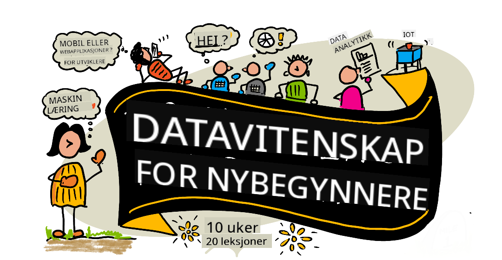

<!--
CO_OP_TRANSLATOR_METADATA:
{
  "original_hash": "7c31d1a22c746b1d0f0582d4f54702ba",
  "translation_date": "2025-12-24T23:46:33+00:00",
  "source_file": "README.md",
  "language_code": "no"
}
-->
# Data Science for nybegynnere - En læreplan

Azure Cloud Advocates hos Microsoft er glade for å tilby en 10-ukers, 20-leksjoners læreplan om Data Science. Hver leksjon inkluderer før- og etter-leksjon-quizzer, skriftlige instruksjoner for å fullføre leksjonen, en løsning og en oppgave. Vår prosjektbaserte pedagogikk lar deg lære mens du bygger, en bevist måte for nye ferdigheter å 'feste seg'.

**Stor takk til våre forfattere:** [Jasmine Greenaway](https://www.twitter.com/paladique), [Dmitry Soshnikov](http://soshnikov.com), [Nitya Narasimhan](https://twitter.com/nitya), [Jalen McGee](https://twitter.com/JalenMcG), [Jen Looper](https://twitter.com/jenlooper), [Maud Levy](https://twitter.com/maudstweets), [Tiffany Souterre](https://twitter.com/TiffanySouterre), [Christopher Harrison](https://www.twitter.com/geektrainer).

**🙏 Spesiell takk 🙏 til våre [Microsoft Student Ambassador](https://studentambassadors.microsoft.com/) forfattere, gjennomgåere og innholdsbidragsytere,** særlig Aaryan Arora, [Aditya Garg](https://github.com/AdityaGarg00), [Alondra Sanchez](https://www.linkedin.com/in/alondra-sanchez-molina/), [Ankita Singh](https://www.linkedin.com/in/ankitasingh007), [Anupam Mishra](https://www.linkedin.com/in/anupam--mishra/), [Arpita Das](https://www.linkedin.com/in/arpitadas01/), ChhailBihari Dubey, [Dibri Nsofor](https://www.linkedin.com/in/dibrinsofor), [Dishita Bhasin](https://www.linkedin.com/in/dishita-bhasin-7065281bb), [Majd Safi](https://www.linkedin.com/in/majd-s/), [Max Blum](https://www.linkedin.com/in/max-blum-6036a1186/), [Miguel Correa](https://www.linkedin.com/in/miguelmque/), [Mohamma Iftekher (Iftu) Ebne Jalal](https://twitter.com/iftu119), [Nawrin Tabassum](https://www.linkedin.com/in/nawrin-tabassum), [Raymond Wangsa Putra](https://www.linkedin.com/in/raymond-wp/), [Rohit Yadav](https://www.linkedin.com/in/rty2423), Samridhi Sharma, [Sanya Sinha](https://www.linkedin.com/mwlite/in/sanya-sinha-13aab1200),
[Sheena Narula](https://www.linkedin.com/in/sheena-narua-n/), [Tauqeer Ahmad](https://www.linkedin.com/in/tauqeerahmad5201/), Yogendrasingh Pawar , [Vidushi Gupta](https://www.linkedin.com/in/vidushi-gupta07/), [Jasleen Sondhi](https://www.linkedin.com/in/jasleen-sondhi/)

||
|:---:|
| Data Science For Beginners - _Sketchnote av [@nitya](https://twitter.com/nitya)_ |

### 🌐 Flerspråklig støtte

#### Støttes via GitHub Action (Automatisert og alltid oppdatert)

<!-- CO-OP TRANSLATOR LANGUAGES TABLE START -->
[Arabisk](../ar/README.md) | [Bengali](../bn/README.md) | [Bulgarsk](../bg/README.md) | [Burmesisk (Myanmar)](../my/README.md) | [Kinesisk (forenklet)](../zh/README.md) | [Kinesisk (tradisjonell, Hong Kong)](../hk/README.md) | [Kinesisk (tradisjonell, Macau)](../mo/README.md) | [Kinesisk (tradisjonell, Taiwan)](../tw/README.md) | [Kroatisk](../hr/README.md) | [Tsjekkisk](../cs/README.md) | [Dansk](../da/README.md) | [Nederlandsk](../nl/README.md) | [Estisk](../et/README.md) | [Finsk](../fi/README.md) | [Fransk](../fr/README.md) | [Tysk](../de/README.md) | [Gresk](../el/README.md) | [Hebraisk](../he/README.md) | [Hindi](../hi/README.md) | [Ungarsk](../hu/README.md) | [Indonesisk](../id/README.md) | [Italiensk](../it/README.md) | [Japansk](../ja/README.md) | [Kannada](../kn/README.md) | [Koreansk](../ko/README.md) | [Litauisk](../lt/README.md) | [Malayisk](../ms/README.md) | [Malayalam](../ml/README.md) | [Marathi](../mr/README.md) | [Nepali](../ne/README.md) | [Nigeriansk pidgin](../pcm/README.md) | [Norsk](./README.md) | [Persisk (Farsi)](../fa/README.md) | [Polsk](../pl/README.md) | [Portugisisk (Brasil)](../br/README.md) | [Portugisisk (Portugal)](../pt/README.md) | [Punjabi (Gurmukhi)](../pa/README.md) | [Rumensk](../ro/README.md) | [Russisk](../ru/README.md) | [Serbisk (kyrillisk)](../sr/README.md) | [Slovakisk](../sk/README.md) | [Slovensk](../sl/README.md) | [Spansk](../es/README.md) | [Swahili](../sw/README.md) | [Svensk](../sv/README.md) | [Tagalog (filippinsk)](../tl/README.md) | [Tamil](../ta/README.md) | [Telugu](../te/README.md) | [Thai](../th/README.md) | [Tyrkisk](../tr/README.md) | [Ukrainsk](../uk/README.md) | [Urdu](../ur/README.md) | [Vietnamesisk](../vi/README.md)
<!-- CO-OP TRANSLATOR LANGUAGES TABLE END -->

**Hvis du ønsker at flere oversettelsesspråk støttes, er de listet [her](https://github.com/Azure/co-op-translator/blob/main/getting_started/supported-languages.md)**

#### Bli med i vårt fellesskap 

Vi har en pågående Discord "Lær med AI"-serie, les mer og bli med oss på [Learn with AI Series](https://aka.ms/learnwithai/discord) fra 18. - 30. september 2025. Du vil få tips og triks for å bruke GitHub Copilot for Data Science.

# Er du student?

Kom i gang med følgende ressurser:

- [Student Hub page](https://docs.microsoft.com/en-gb/learn/student-hub?WT.mc_id=academic-77958-bethanycheum) På denne siden finner du nybegynnerressurser, studentpakker og til og med måter å få en gratis sertifikatkupong. Dette er en side du bør bokmerke og sjekke fra tid til annen ettersom vi bytter ut innhold minst månedlig.
- [Microsoft Learn Student Ambassadors](https://studentambassadors.microsoft.com?WT.mc_id=academic-77958-bethanycheum) Bli med i et globalt fellesskap av studentambassadører; dette kan være din vei inn i Microsoft.

# Kom i gang

## 📚 Dokumentasjon

- **[Installasjonsguide](INSTALLATION.md)** - Trinnvis oppsettinstruksjoner for nybegynnere
- **[Bruksveiledning](USAGE.md)** - Eksempler og vanlige arbeidsflyter
- **[Feilsøking](TROUBLESHOOTING.md)** - Løsninger på vanlige problemer
- **[Retningslinjer for bidrag](CONTRIBUTING.md)** - Hvordan bidra til dette prosjektet
- **[For lærere](for-teachers.md)** - Veiledning for undervisning og ressurser for klasserommet

## 👨‍🎓 For studenter
> **Fullstendig nybegynnere**: Ny innen data science? Start med våre [nybegynnervennlige eksempler](examples/README.md)! Disse enkle, godt kommenterte eksemplene vil hjelpe deg å forstå det grunnleggende før du dykker ned i hele læreplanen.
> **[Studenter](https://aka.ms/student-page)**: For å bruke denne læreplanen på egenhånd, fork hele repoet og fullfør øvelsene på egen hånd, start med en før-forelesnings-quiz. Les så forelesningen og fullfør resten av aktivitetene. Forsøk å lage prosjektene ved å forstå leksjonene i stedet for å kopiere løsningskoden; den koden er imidlertid tilgjengelig i /solutions-mappene i hver prosjektorienterte leksjon. En annen idé er å danne en studiegruppe med venner og gå gjennom innholdet sammen. For videre studier anbefaler vi [Microsoft Learn](https://docs.microsoft.com/en-us/users/jenlooper-2911/collections/qprpajyoy3x0g7?WT.mc_id=academic-77958-bethanycheum).

**Rask start:**
1. Sjekk [Installasjonsguide](INSTALLATION.md) for å sette opp miljøet ditt
2. Gå gjennom [Bruksveiledning](USAGE.md) for å lære hvordan du jobber med læreplanen
3. Start med leksjon 1 og arbeid deg gjennom dem i rekkefølge
4. Bli med i vårt [Discord-fellesskap](https://aka.ms/ds4beginners/discord) for støtte

## 👩‍🏫 For lærere

> **Lærere**: vi har [inkludert noen forslag](for-teachers.md) om hvordan du kan bruke denne læreplanen. Vi vil gjerne ha din tilbakemelding [i vårt diskusjonsforum](https://github.com/microsoft/Data-Science-For-Beginners/discussions)!

## Møt teamet

**GIF av** [Mohit Jaisal](https://www.linkedin.com/in/mohitjaisal)
> 🎥 Klikk på bildet ovenfor for en video om prosjektet  menneskene som laget det!

## Pedagogikk

Vi har valgt to pedagogiske prinsipper mens vi bygget dette læreplanen: å sikre at den er prosjektbasert og at den inkluderer hyppige quizer. Ved slutten av denne serien vil studentene ha lært grunnleggende prinsipper for data science, inkludert etiske konsepter, dataklargjøring, ulike måter å jobbe med data på, datavisualisering, dataanalyse, virkelige brukstilfeller av data science, og mer.

I tillegg setter en lav-innsats quiz før en klasse studentens intensjon mot å lære et emne, mens en andre quiz etter timen sikrer videre fastholdelse. Denne læreplanen er designet for å være fleksibel og morsom og kan tas i helhet eller delvis. Prosjektene starter små og blir stadig mer komplekse mot slutten av 10-ukers syklusen.

> Finn våre retningslinjer: [Atferdskodeks](CODE_OF_CONDUCT.md), [Bidra](CONTRIBUTING.md),  [Oversettelser](TRANSLATIONS.md). Vi setter pris på konstruktive tilbakemeldinger!

## Hver leksjon inkluderer:

- Valgfri sketchnote
- Valgfri tilleggsvideo
- Oppvarmingsquiz før leksjonen
- Skriftlig leksjon
- For prosjektbaserte leksjoner, trinnvise guider for hvordan du bygger prosjektet
- Kunnskapskontroller
- En utfordring
- Tilleggslesning
- Oppgave
- [Quiz etter leksjon](https://ff-quizzes.netlify.app/en/)

> **En merknad om quizer**: Alle quizer ligger i Quiz-App-mappen, for totalt 40 quizer med tre spørsmål hver. De er lenket fra leksjonene, men quiz-appen kan kjøres lokalt eller deployeres til Azure; følg instruksjonene i `quiz-app`-mappen. De blir gradvis lokalisert.

## 🎓 Nybegynnervennlige eksempler

**Ny i Data Science?** Vi har laget en egen [eksempelkatalog](examples/README.md) med enkel, godt kommentert kode for å hjelpe deg i gang:

- 🌟 **Hello World** - Ditt første Data Science-program
- 📂 **Lese inn data** - Lær å lese og utforske datasett
- 📊 **Enkel analyse** - Beregn statistikk og finn mønstre
- 📈 **Grunnleggende visualisering** - Lag diagrammer og grafer
- 🔬 **Virkelighetsnært prosjekt** - Fullstendig arbeidsflyt fra start til slutt

Hvert eksempel inneholder detaljerte kommentarer som forklarer hvert trinn, noe som gjør det perfekt for helt nybegynnere!

👉 **[Start med eksemplene](examples/README.md)** 👈

## Leksjoner

||
|:---:|
| Data Science for nybegynnere: Veikart - _Sketchnote av [@nitya](https://twitter.com/nitya)_ |

| Leksjonsnummer | Tema | Leksjonsgruppe | Læringsmål | Lenket leksjon | Forfatter |
| :-----------: | :----------------------------------------: | :--------------------------------------------------: | :-----------------------------------------------------------------------------------------------------------------------------------------------------------------------: | :---------------------------------------------------------------------: | :----: |
| 01 | Definere Data Science | [Introduction](1-Introduction/README.md) | Lær de grunnleggende konseptene bak data science og hvordan det er relatert til kunstig intelligens, maskinlæring, og big data. | [leksjon](1-Introduction/01-defining-data-science/README.md) [video](https://youtu.be/beZ7Mb_oz9I) | [Dmitry](http://soshnikov.com) |
| 02 | Etikk innen data science | [Introduction](1-Introduction/README.md) | Konsepter, utfordringer & rammeverk innen dataetikk. | [leksjon](1-Introduction/02-ethics/README.md) | [Nitya](https://twitter.com/nitya) |
| 03 | Definere data | [Introduction](1-Introduction/README.md) | Hvordan data klassifiseres og vanlige kilder. | [leksjon](1-Introduction/03-defining-data/README.md) | [Jasmine](https://www.twitter.com/paladique) |
| 04 | Introduksjon til statistikk og sannsynlighet | [Introduction](1-Introduction/README.md) | De matematiske teknikkene innen sannsynlighet og statistikk for å forstå data. | [leksjon](1-Introduction/04-stats-and-probability/README.md) [video](https://youtu.be/Z5Zy85g4Yjw) | [Dmitry](http://soshnikov.com) |
| 05 | Arbeide med relasjonsdata | [Working With Data](2-Working-With-Data/README.md) | Introduksjon til relasjonsdata og det grunnleggende om å utforske og analysere relasjonsdata med Structured Query Language, også kjent som SQL (uttales “see-quell”). | [leksjon](2-Working-With-Data/05-relational-databases/README.md) | [Christopher](https://www.twitter.com/geektrainer) | | |
| 06 | Arbeide med NoSQL-data | [Working With Data](2-Working-With-Data/README.md) | Introduksjon til ikke-relasjonelle data, ulike typer og det grunnleggende om å utforske og analysere dokumentdatabaser. | [leksjon](2-Working-With-Data/06-non-relational/README.md) | [Jasmine](https://twitter.com/paladique)|
| 07 | Arbeide med Python | [Working With Data](2-Working-With-Data/README.md) | Grunnleggende bruk av Python for datautforskning med biblioteker som Pandas. En grunnleggende forståelse av Python-programmering anbefales. | [leksjon](2-Working-With-Data/07-python/README.md) [video](https://youtu.be/dZjWOGbsN4Y) | [Dmitry](http://soshnikov.com) |
| 08 | Datapreparasjon | [Working With Data](2-Working-With-Data/README.md) | Emner om teknikker for rensing og transformasjon av data for å håndtere utfordringer med manglende, unøyaktige eller ufullstendige data. | [leksjon](2-Working-With-Data/08-data-preparation/README.md) | [Jasmine](https://www.twitter.com/paladique) |
| 09 | Visualisere mengder | [Data Visualization](3-Data-Visualization/README.md) | Lær å bruke Matplotlib for å visualisere fugledata 🦆 | [leksjon](3-Data-Visualization/09-visualization-quantities/README.md) | [Jen](https://twitter.com/jenlooper) |
| 10 | Visualisere fordelinger av data | [Data Visualization](3-Data-Visualization/README.md) | Visualisere observasjoner og trender innen et intervall. | [leksjon](3-Data-Visualization/10-visualization-distributions/README.md) | [Jen](https://twitter.com/jenlooper) |
| 11 | Visualisere proporsjoner | [Data Visualization](3-Data-Visualization/README.md) | Visualisere diskrete og grupperte prosentandeler. | [leksjon](3-Data-Visualization/11-visualization-proportions/README.md) | [Jen](https://twitter.com/jenlooper) |
| 12 | Visualisere relasjoner | [Data Visualization](3-Data-Visualization/README.md) | Visualisere forbindelser og korrelasjoner mellom datasett og deres variabler. | [leksjon](3-Data-Visualization/12-visualization-relationships/README.md) | [Jen](https://twitter.com/jenlooper) |
| 13 | Meningsfulle visualiseringer | [Data Visualization](3-Data-Visualization/README.md) | Teknikker og veiledning for å gjøre visualiseringene dine verdifulle for effektiv problemløsning og innsikt. | [leksjon](3-Data-Visualization/13-meaningful-visualizations/README.md) | [Jen](https://twitter.com/jenlooper) |
| 14 | Introduksjon til data science-livssyklusen | [Lifecycle](4-Data-Science-Lifecycle/README.md) | Introduksjon til data science-livssyklusen og det første steget med å skaffe og hente ut data. | [leksjon](4-Data-Science-Lifecycle/14-Introduction/README.md) | [Jasmine](https://twitter.com/paladique) |
| 15 | Analysering | [Lifecycle](4-Data-Science-Lifecycle/README.md) | Denne fasen av data science-livssyklusen fokuserer på teknikker for å analysere data. | [leksjon](4-Data-Science-Lifecycle/15-analyzing/README.md) | [Jasmine](https://twitter.com/paladique) | | |
| 16 | Kommunikasjon | [Lifecycle](4-Data-Science-Lifecycle/README.md) | Denne fasen av data science-livssyklusen fokuserer på å presentere innsiktene fra dataene på en måte som gjør det enklere for beslutningstakere å forstå. | [leksjon](4-Data-Science-Lifecycle/16-communication/README.md) | [Jalen](https://twitter.com/JalenMcG) | | |
| 17 | Data Science i skyen | [Cloud Data](5-Data-Science-In-Cloud/README.md) | Denne serien av leksjoner introduserer data science i skyen og fordelene. | [leksjon](5-Data-Science-In-Cloud/17-Introduction/README.md) | [Tiffany](https://twitter.com/TiffanySouterre) and [Maud](https://twitter.com/maudstweets) |
| 18 | Data Science i skyen | [Cloud Data](5-Data-Science-In-Cloud/README.md) | Trening av modeller ved bruk av Low Code-verktøy. |[leksjon](5-Data-Science-In-Cloud/18-Low-Code/README.md) | [Tiffany](https://twitter.com/TiffanySouterre) and [Maud](https://twitter.com/maudstweets) |
| 19 | Data Science i skyen | [Cloud Data](5-Data-Science-In-Cloud/README.md) | Distribuere modeller med Azure Machine Learning Studio. | [leksjon](5-Data-Science-In-Cloud/19-Azure/README.md)| [Tiffany](https://twitter.com/TiffanySouterre) and [Maud](https://twitter.com/maudstweets) |
| 20 | Data Science ute i felten | [In the Wild](6-Data-Science-In-Wild/README.md) | Data science-drevne prosjekter i den virkelige verden. | [leksjon](6-Data-Science-In-Wild/20-Real-World-Examples/README.md) | [Nitya](https://twitter.com/nitya) |

## GitHub Codespaces

Følg disse trinnene for å åpne dette eksempelet i en Codespace:
1. Klikk på Code-rullegardinmenyen og velg alternativet Open with Codespaces.
2. Velg + New codespace nederst i panelet.
For mer info, se [GitHub-dokumentasjonen](https://docs.github.com/en/codespaces/developing-in-codespaces/creating-a-codespace-for-a-repository#creating-a-codespace).

## VSCode Remote - Containers
Følg disse trinnene for å åpne dette repoet i en container ved hjelp av din lokale maskin og VSCode ved hjelp av  VS Code Remote - Containers-utvidelsen:

1. Hvis dette er første gang du bruker en utviklingscontainer, sørg for at systemet ditt møter forutsetningene (f.eks. at Docker er installert) i [dokumentasjonen for å komme i gang](https://code.visualstudio.com/docs/devcontainers/containers#_getting-started).

To use this repository, you can either open the repository in an isolated Docker volume:

**Note**: Under the hood, this will use the Remote-Containers: **Clone Repository in Container Volume...** command to clone the source code in a Docker volume instead of the local filesystem. [Volumes](https://docs.docker.com/storage/volumes/) are the preferred mechanism for persisting container data.

Or open a locally cloned or downloaded version of the repository:

- Klon dette depotet til ditt lokale filsystem.
- Trykk F1 og velg kommandoen **Remote-Containers: Open Folder in Container...**.
- Velg den klonede kopien av denne mappen, vent til containeren starter, og prøv ting ut.

## Frakoblet tilgang

Du kan kjøre denne dokumentasjonen frakoblet ved å bruke [Docsify](https://docsify.js.org/#/). Fork dette repoet, [installer Docsify](https://docsify.js.org/#/quickstart) på din lokale maskin,  så i rotmappen til dette repoet, skriv `docsify serve`. Nettstedet vil bli servert på port 3000 på din localhost: `localhost:3000`.

> Merk at notatbøker ikke vil bli rendret via Docsify, så når du trenger å kjøre en notatbok, gjør det separat i VS Code med en Python-kjerne.

## Andre læreplaner

Teamet vårt produserer andre læreplaner! Sjekk ut:

<!-- CO-OP TRANSLATOR OTHER COURSES START -->
### LangChain

---

### Azure / Edge / MCP / Agenter

---
 
### Generativ AI-serie

[-9333EA?style=for-the-badge&labelColor=E5E7EB&color=9333EA)](https://github.com/microsoft/Generative-AI-for-beginners-dotnet?WT.mc_id=academic-105485-koreyst)
[-C084FC?style=for-the-badge&labelColor=E5E7EB&color=C084FC)](https://github.com/microsoft/generative-ai-for-beginners-java?WT.mc_id=academic-105485-koreyst)
[-E879F9?style=for-the-badge&labelColor=E5E7EB&color=E879F9)](https://github.com/microsoft/generative-ai-with-javascript?WT.mc_id=academic-105485-koreyst)

---
 
### Kjerneopplæring

---
 
### Copilot-serien

<!-- CO-OP TRANSLATOR OTHER COURSES END -->

## Få hjelp

**Opplever du problemer?** Se vår [feilsøkingsguide](TROUBLESHOOTING.md) for løsninger på vanlige problemer.

Hvis du står fast eller har spørsmål om å bygge AI-apper. Bli med andre lærende og erfarne utviklere i diskusjoner om MCP. Det er et støttende fellesskap hvor spørsmål er velkomne og kunnskap deles fritt.

Hvis du har produkttilbakemeldinger eller feil mens du bygger visit:

---

<!-- CO-OP TRANSLATOR DISCLAIMER START -->
Ansvarsfraskrivelse:
Dette dokumentet er oversatt ved hjelp av AI-oversettelsestjenesten [Co-op Translator](https://github.com/Azure/co-op-translator). Selv om vi streber etter nøyaktighet, vennligst vær oppmerksom på at automatiserte oversettelser kan inneholde feil eller unøyaktigheter. Det opprinnelige dokumentet på originalspråket bør anses som den autoritative kilden. For kritisk informasjon anbefales profesjonell menneskelig oversettelse. Vi er ikke ansvarlige for eventuelle misforståelser eller feiltolkninger som oppstår ved bruk av denne oversettelsen.
<!-- CO-OP TRANSLATOR DISCLAIMER END -->