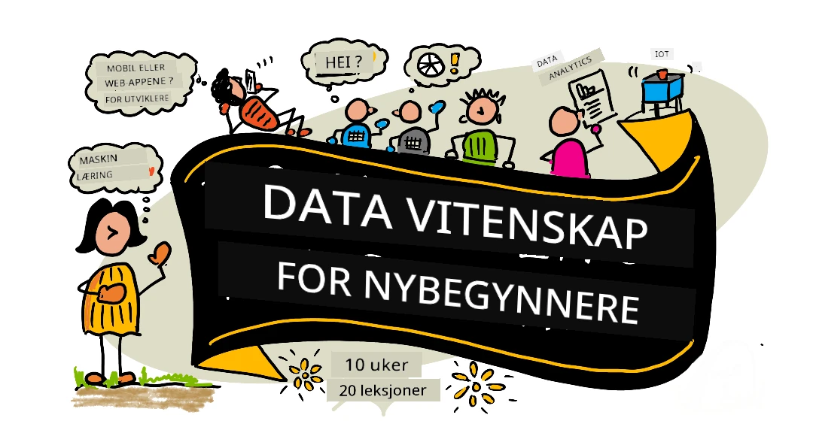
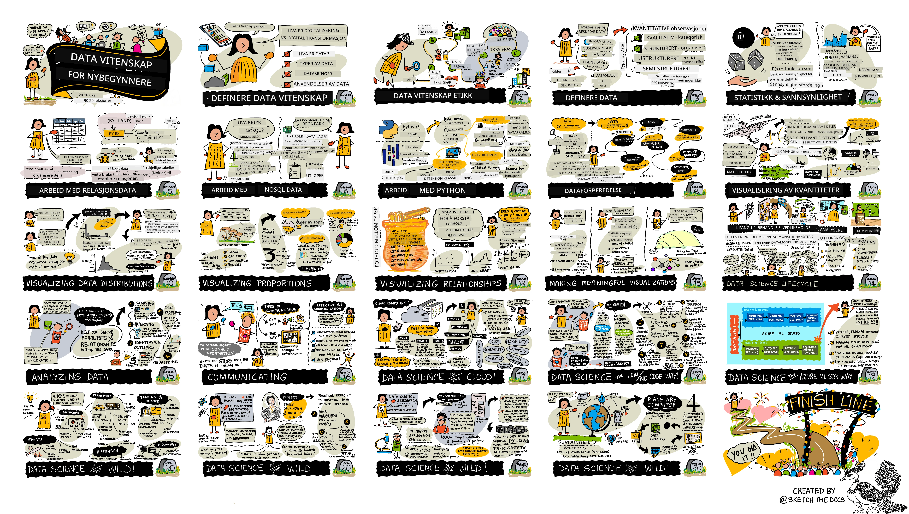

# Data Science for Beginners - En læreplan

[](https://github.com/codespaces/new?hide_repo_select=true&ref=main&repo=344191198)

[](https://github.com/microsoft/Data-Science-For-Beginners/blob/master/LICENSE)
[](https://GitHub.com/microsoft/Data-Science-For-Beginners/graphs/contributors/)
[](https://GitHub.com/microsoft/Data-Science-For-Beginners/issues/)
[](https://GitHub.com/microsoft/Data-Science-For-Beginners/pulls/)
[](http://makeapullrequest.com)

[](https://GitHub.com/microsoft/Data-Science-For-Beginners/watchers/)
[](https://GitHub.com/microsoft/Data-Science-For-Beginners/network/)
[](https://GitHub.com/microsoft/Data-Science-For-Beginners/stargazers/)


[](https://discord.gg/nTYy5BXMWG)

[](https://aka.ms/foundry/forum)

Azure Cloud Advocates hos Microsoft er glade for å tilby en 10-ukers, 20-leksjons læreplan om Data Science. Hver leksjon inkluderer quiz før og etter leksjonen, skriftlige instruksjoner for å gjennomføre leksjonen, en løsning og en oppgave. Vår prosjektbaserte pedagogikk lar deg lære mens du bygger, en bevist metode for at nye ferdigheter skal 'sette seg'.

**Stor takk til våre forfattere:** [Jasmine Greenaway](https://www.twitter.com/paladique), [Dmitry Soshnikov](http://soshnikov.com), [Nitya Narasimhan](https://twitter.com/nitya), [Jalen McGee](https://twitter.com/JalenMcG), [Jen Looper](https://twitter.com/jenlooper), [Maud Levy](https://twitter.com/maudstweets), [Tiffany Souterre](https://twitter.com/TiffanySouterre), [Christopher Harrison](https://www.twitter.com/geektrainer).

**🙏 Spesiell takk 🙏 til våre [Microsoft Student Ambassador](https://studentambassadors.microsoft.com/) forfattere, vurderere og innholdsbidragsytere,** spesielt Aaryan Arora, [Aditya Garg](https://github.com/AdityaGarg00), [Alondra Sanchez](https://www.linkedin.com/in/alondra-sanchez-molina/), [Ankita Singh](https://www.linkedin.com/in/ankitasingh007), [Anupam Mishra](https://www.linkedin.com/in/anupam--mishra/), [Arpita Das](https://www.linkedin.com/in/arpitadas01/), ChhailBihari Dubey, [Dibri Nsofor](https://www.linkedin.com/in/dibrinsofor), [Dishita Bhasin](https://www.linkedin.com/in/dishita-bhasin-7065281bb), [Majd Safi](https://www.linkedin.com/in/majd-s/), [Max Blum](https://www.linkedin.com/in/max-blum-6036a1186/), [Miguel Correa](https://www.linkedin.com/in/miguelmque/), [Mohamma Iftekher (Iftu) Ebne Jalal](https://twitter.com/iftu119), [Nawrin Tabassum](https://www.linkedin.com/in/nawrin-tabassum), [Raymond Wangsa Putra](https://www.linkedin.com/in/raymond-wp/), [Rohit Yadav](https://www.linkedin.com/in/rty2423), Samridhi Sharma, [Sanya Sinha](https://www.linkedin.com/mwlite/in/sanya-sinha-13aab1200),
[Sheena Narula](https://www.linkedin.com/in/sheena-narua-n/), [Tauqeer Ahmad](https://www.linkedin.com/in/tauqeerahmad5201/), Yogendrasingh Pawar , [Vidushi Gupta](https://www.linkedin.com/in/vidushi-gupta07/), [Jasleen Sondhi](https://www.linkedin.com/in/jasleen-sondhi/)

||
|:---:|
| Data Science For Beginners - _Sketchnote av [@nitya](https://twitter.com/nitya)_ |

### 🌐 Støtte for flere språk

#### Støttet via GitHub Action (Automatisert & Alltid Oppdatert)

<!-- CO-OP TRANSLATOR LANGUAGES TABLE START -->
[Arabic](../ar/README.md) | [Bengali](../bn/README.md) | [Bulgarian](../bg/README.md) | [Burmese (Myanmar)](../my/README.md) | [Chinese (Simplified)](../zh-CN/README.md) | [Chinese (Traditional, Hong Kong)](../zh-HK/README.md) | [Chinese (Traditional, Macau)](../zh-MO/README.md) | [Chinese (Traditional, Taiwan)](../zh-TW/README.md) | [Croatian](../hr/README.md) | [Czech](../cs/README.md) | [Danish](../da/README.md) | [Dutch](../nl/README.md) | [Estonian](../et/README.md) | [Finnish](../fi/README.md) | [French](../fr/README.md) | [German](../de/README.md) | [Greek](../el/README.md) | [Hebrew](../he/README.md) | [Hindi](../hi/README.md) | [Hungarian](../hu/README.md) | [Indonesian](../id/README.md) | [Italian](../it/README.md) | [Japanese](../ja/README.md) | [Kannada](../kn/README.md) | [Khmer](../km/README.md) | [Korean](../ko/README.md) | [Lithuanian](../lt/README.md) | [Malay](../ms/README.md) | [Malayalam](../ml/README.md) | [Marathi](../mr/README.md) | [Nepali](../ne/README.md) | [Nigerian Pidgin](../pcm/README.md) | [Norwegian](./README.md) | [Persian (Farsi)](../fa/README.md) | [Polish](../pl/README.md) | [Portuguese (Brazil)](../pt-BR/README.md) | [Portuguese (Portugal)](../pt-PT/README.md) | [Punjabi (Gurmukhi)](../pa/README.md) | [Romanian](../ro/README.md) | [Russian](../ru/README.md) | [Serbian (Cyrillic)](../sr/README.md) | [Slovak](../sk/README.md) | [Slovenian](../sl/README.md) | [Spanish](../es/README.md) | [Swahili](../sw/README.md) | [Swedish](../sv/README.md) | [Tagalog (Filipino)](../tl/README.md) | [Tamil](../ta/README.md) | [Telugu](../te/README.md) | [Thai](../th/README.md) | [Turkish](../tr/README.md) | [Ukrainian](../uk/README.md) | [Urdu](../ur/README.md) | [Vietnamese](../vi/README.md)

> **Foretrekker å klone lokalt?**
>
> Dette arkivet inkluderer 50+ språkversjoner som betydelig øker nedlastingsstørrelsen. For å klone uten oversettelser, bruk sparsjekk ut:
>
> **Bash / macOS / Linux:**
> ```bash
> git clone --filter=blob:none --sparse https://github.com/microsoft/Data-Science-For-Beginners.git
> cd Data-Science-For-Beginners
> git sparse-checkout set --no-cone '/*' '!translations' '!translated_images'
> ```
>
> **CMD (Windows):**
> ```cmd
> git clone --filter=blob:none --sparse https://github.com/microsoft/Data-Science-For-Beginners.git
> cd Data-Science-For-Beginners
> git sparse-checkout set --no-cone "/*" "!translations" "!translated_images"
> ```
>
> Dette gir deg alt du trenger for å fullføre kurset med mye raskere nedlasting.
<!-- CO-OP TRANSLATOR LANGUAGES TABLE END -->

**Hvis du ønsker at flere språk støttes, er de listet [her](https://github.com/Azure/co-op-translator/blob/main/getting_started/supported-languages.md)**

#### Bli med i vårt fellesskap 
[](https://discord.gg/nTYy5BXMWG)

Vi har en pågående Discord-serie om å lære med AI, lær mer og bli med oss på [Learn with AI Series](https://aka.ms/learnwithai/discord) fra 18. - 30. september 2025. Du vil få tips og triks for bruk av GitHub Copilot for Data Science.


# Er du student?

Kom i gang med følgende ressurser:

- [Student Hub-side](https://docs.microsoft.com/en-gb/learn/student-hub?WT.mc_id=academic-77958-bethanycheum) På denne siden finner du nybegynnerressurser, studentpakker og til og med måter å få et gratis sertifikatkupong på. Dette er en side du vil bokmerke og sjekke innimellom, siden vi bytter innhold minst månedlig.
- [Microsoft Learn Student Ambassadors](https://studentambassadors.microsoft.com?WT.mc_id=academic-77958-bethanycheum) Bli med i et globalt fellesskap av studentambassadører, dette kan være din vei inn i Microsoft.

# Komme i gang

## 📚 Dokumentasjon

- **[Installasjonsguide](INSTALLATION.md)** - Steg-for-steg oppsettinstruksjoner for nybegynnere
- **[Bruksanvisning](USAGE.md)** - Eksempler og vanlige arbeidsflyter
- **[Feilsøking](TROUBLESHOOTING.md)** - Løsninger på vanlige problemer
- **[Bidragsveiledning](CONTRIBUTING.md)** - Hvordan bidra til dette prosjektet
- **[For lærere](for-teachers.md)** - Veiledning for undervisning og klasseromsressurser

## 👨‍🎓 For studenter
> **Fullstendige nybegynnere**: Ny på data science? Start med våre [begynnervennlige eksempler](examples/README.md)! Disse enkle, godt kommenterte eksemplene vil hjelpe deg å forstå det grunnleggende før du går videre i læreplanen.
> **[Studenter](https://aka.ms/student-page)**: for å bruke denne læreplanen på egenhånd, fork hele repoet og fullfør øvelsene selv, begynn med en quiz før forelesningen. Les deretter forelesningen og fullfør resten av aktivitetene. Prøv å lage prosjektene ved å forstå leksjonene i stedet for å kopiere løsningskoden; imidlertid er denne koden tilgjengelig i /solutions-mappene i hver prosjektorientert leksjon. En annen idé er å danne en studiegruppe med venner og gå gjennom innholdet sammen. For videre studier anbefaler vi [Microsoft Learn](https://docs.microsoft.com/en-us/users/jenlooper-2911/collections/qprpajyoy3x0g7?WT.mc_id=academic-77958-bethanycheum).

**Rask start:**
1. Se gjennom [Installasjonsguide](INSTALLATION.md) for å sette opp miljøet ditt
2. Gå gjennom [Bruksanvisning](USAGE.md) for å lære hvordan man arbeider med læreplanen
3. Start med Leksjon 1 og jobb deg systematisk gjennom
4. Bli med i vårt [Discord-fellesskap](https://aka.ms/ds4beginners/discord) for støtte

## 👩‍🏫 For lærere
> **Lærere**: vi har [inkludert noen forslag](for-teachers.md) til hvordan bruke dette pensumet. Vi vil gjerne ha tilbakemeldinger [i vårt diskusjonsforum](https://github.com/microsoft/Data-Science-For-Beginners/discussions)!

## Møt teamet

[](https://youtu.be/8mzavjQSMM4 "Promo video")

**Gif av** [Mohit Jaisal](https://www.linkedin.com/in/mohitjaisal)

> 🎥 Klikk på bildet over for en video om prosjektet og folkene som skapte det!

## Pedagogikk

Vi har valgt to pedagogiske prinsipper under utviklingen av dette pensumet: sikre at det er prosjektbasert og at det inkluderer hyppige quizer. Ved slutten av denne serien vil studentene ha lært grunnleggende prinsipper innen datavitenskap, inkludert etiske konsepter, dataklargjøring, forskjellige måter å jobbe med data på, datavisualisering, dataanalyse, praktiske bruksområder for datavitenskap og mer.

I tillegg setter en lavterskelquiz før en klasse studentens intensjon mot å lære et emne, mens en annen quiz etter klassen sikrer videre opprettholdelse. Dette pensumet er designet for å være fleksibelt og morsomt og kan gjennomføres i sin helhet eller delvis. Prosjektene starter smått og blir stadig mer komplekse mot slutten av den 10 uker lange syklusen.

> Finn vår [oppførselskode](CODE_OF_CONDUCT.md), [bidragsveiledning](CONTRIBUTING.md), [oversettelsesretningslinjer](TRANSLATIONS.md). Vi ønsker din konstruktive tilbakemelding velkommen!

## Hver leksjon inkluderer:

- Valgfri sketchnote
- Valgfri supplerende video
- Quiz som oppvarming før leksjonen
- Skriftlig leksjon
- For prosjektbaserte leksjoner, trinnvise guider for å bygge prosjektet
- Kunnskapssjekker
- En utfordring
- Supplerende lesing
- Oppgave
- [Quiz etter leksjonen](https://ff-quizzes.netlify.app/en/)

> **Et notat om quizer**: Alle quizer ligger i Quiz-App-mappen, totalt 40 quizer med tre spørsmål hver. De er lenket fra leksjonene, men quiz-appen kan kjøres lokalt eller distribueres til Azure; følg instruksjonene i `quiz-app`-mappen. De blir gradvis oversatt.

## 🎓 Nybegynnervennlige eksempler

**Ny i datavitenskap?** Vi har laget en egen [eksempelmapppe](examples/README.md) med enkel, godt kommentert kode for å hjelpe deg i gang:

- 🌟 **Hello World** - Ditt første datavitenskapsprogram
- 📂 **Laste data** - Lær å lese og utforske datasett
- 📊 **Enkel analyse** - Beregn statistikk og finn mønstre
- 📈 **Grunnleggende visualisering** - Lag diagrammer og grafer
- 🔬 **Virkelighetsprosjekt** - Fullstendig arbeidsflyt fra start til slutt

Hvert eksempel inkluderer detaljerte kommentarer som forklarer hvert steg, perfekt for absolutt nybegynnere!

👉 **[Start med eksemplene](examples/README.md)** 👈

## Leksjoner


||
|:---:|
| Datavitenskap for nybegynnere: veikart - _Sketchnote av [@nitya](https://twitter.com/nitya)_ |


| Leksjonsnummer | Emne | Leksjonsgruppering | Læringsmål | Lenket leksjon | Forfatter |
| :-----------: | :----------------------------------------: | :--------------------------------------------------: | :-----------------------------------------------------------------------------------------------------------------------------------------------------------------------: | :---------------------------------------------------------------------: | :----: |
| 01 | Definere datavitenskap | [Introduksjon](1-Introduction/README.md) | Lær grunnleggende konsepter bak datavitenskap og hvordan det er relatert til kunstig intelligens, maskinlæring og big data. | [leksjon](1-Introduction/01-defining-data-science/README.md) [video](https://youtu.be/beZ7Mb_oz9I) | [Dmitry](http://soshnikov.com) |
| 02 | Etikk innen datavitenskap | [Introduksjon](1-Introduction/README.md) | Konsepter, utfordringer og rammeverk for dataetikk. | [leksjon](1-Introduction/02-ethics/README.md) | [Nitya](https://twitter.com/nitya) |
| 03 | Definere data | [Introduksjon](1-Introduction/README.md) | Hvordan data klassifiseres og dets vanlige kilder. | [leksjon](1-Introduction/03-defining-data/README.md) | [Jasmine](https://www.twitter.com/paladique) |
| 04 | Introduksjon til statistikk og sannsynlighet | [Introduksjon](1-Introduction/README.md) | De matematiske teknikkene for sannsynlighet og statistikk for å forstå data. | [leksjon](1-Introduction/04-stats-and-probability/README.md) [video](https://youtu.be/Z5Zy85g4Yjw) | [Dmitry](http://soshnikov.com) |
| 05 | Jobbe med relasjonsdata | [Jobbe med data](2-Working-With-Data/README.md) | Introduksjon til relasjonsdata og det grunnleggende i å utforske og analysere relasjonsdata ved hjelp av Structured Query Language, også kjent som SQL (uttalt "see-quell"). | [leksjon](2-Working-With-Data/05-relational-databases/README.md) | [Christopher](https://www.twitter.com/geektrainer) | | |
| 06 | Jobbe med NoSQL-data | [Jobbe med data](2-Working-With-Data/README.md) | Introduksjon til ikke-relasjonelle data, deres ulike typer og grunnleggende om å utforske og analysere dokumentdatabaser. | [leksjon](2-Working-With-Data/06-non-relational/README.md) | [Jasmine](https://twitter.com/paladique)|
| 07 | Jobbe med Python | [Jobbe med data](2-Working-With-Data/README.md) | Grunnleggende bruk av Python til datautforskning med biblioteker som Pandas. Grunnleggende forståelse av Python-programmering anbefales. | [leksjon](2-Working-With-Data/07-python/README.md) [video](https://youtu.be/dZjWOGbsN4Y) | [Dmitry](http://soshnikov.com) |
| 08 | Dataklargjøring | [Jobbe med data](2-Working-With-Data/README.md) | Emner innen datateknikker for rensing og transformasjon av data for å håndtere utfordringer med manglende, unøyaktige eller ufullstendige data. | [leksjon](2-Working-With-Data/08-data-preparation/README.md) | [Jasmine](https://www.twitter.com/paladique) |
| 09 | Visualisering av mengder | [Datavisualisering](3-Data-Visualization/README.md) | Lær å bruke Matplotlib for å visualisere fugldata 🦆 | [leksjon](3-Data-Visualization/09-visualization-quantities/README.md) | [Jen](https://twitter.com/jenlooper) |
| 10 | Visualisere fordeling av data | [Datavisualisering](3-Data-Visualization/README.md) | Visualisere observasjoner og trender innen et intervall. | [leksjon](3-Data-Visualization/10-visualization-distributions/README.md) | [Jen](https://twitter.com/jenlooper) |
| 11 | Visualisere proporsjoner | [Datavisualisering](3-Data-Visualization/README.md) | Visualisere diskrete og grupperte prosenter. | [leksjon](3-Data-Visualization/11-visualization-proportions/README.md) | [Jen](https://twitter.com/jenlooper) |
| 12 | Visualisere relasjoner | [Datavisualisering](3-Data-Visualization/README.md) | Visualisere forbindelser og korrelasjoner mellom datasett og deres variabler. | [leksjon](3-Data-Visualization/12-visualization-relationships/README.md) | [Jen](https://twitter.com/jenlooper) |
| 13 | Meningsfulle visualiseringer | [Datavisualisering](3-Data-Visualization/README.md) | Teknikker og veiledning for å gjøre visualiseringene dine verdifulle for effektiv problemløsning og innsikt. | [leksjon](3-Data-Visualization/13-meaningful-visualizations/README.md) | [Jen](https://twitter.com/jenlooper) |
| 14 | Introduksjon til datavitenskaps livssyklus | [Livssyklus](4-Data-Science-Lifecycle/README.md) | Introduksjon til datavitenskaps livssyklus og det første steget med innhenting og utvinning av data. | [leksjon](4-Data-Science-Lifecycle/14-Introduction/README.md) | [Jasmine](https://twitter.com/paladique) |
| 15 | Analyse | [Livssyklus](4-Data-Science-Lifecycle/README.md) | Denne fasen i datavitenskaps livssyklus fokuserer på teknikker for å analysere data. | [leksjon](4-Data-Science-Lifecycle/15-analyzing/README.md) | [Jasmine](https://twitter.com/paladique) | | |
| 16 | Kommunikasjon | [Livssyklus](4-Data-Science-Lifecycle/README.md) | Denne fasen i datavitenskaps livssyklus fokuserer på å presentere innsikten fra data på en måte som gjør det enklere for beslutningstakere å forstå. | [leksjon](4-Data-Science-Lifecycle/16-communication/README.md) | [Jalen](https://twitter.com/JalenMcG) | | |
| 17 | Datavitenskap i skyen | [Skydata](5-Data-Science-In-Cloud/README.md) | Denne serien av leksjoner introduserer datavitenskap i skyen og dens fordeler. | [leksjon](5-Data-Science-In-Cloud/17-Introduction/README.md) | [Tiffany](https://twitter.com/TiffanySouterre) og [Maud](https://twitter.com/maudstweets) |
| 18 | Datavitenskap i skyen | [Skydata](5-Data-Science-In-Cloud/README.md) | Trene modeller ved hjelp av Low Code-verktøy. | [leksjon](5-Data-Science-In-Cloud/18-Low-Code/README.md) | [Tiffany](https://twitter.com/TiffanySouterre) og [Maud](https://twitter.com/maudstweets) |
| 19 | Datavitenskap i skyen | [Skydata](5-Data-Science-In-Cloud/README.md) | Distribuere modeller med Azure Machine Learning Studio. | [leksjon](5-Data-Science-In-Cloud/19-Azure/README.md)| [Tiffany](https://twitter.com/TiffanySouterre) og [Maud](https://twitter.com/maudstweets) |
| 20 | Datavitenskap "i det fri" | [I det fri](6-Data-Science-In-Wild/README.md) | Datavitenskapsdrevne prosjekter i den virkelige verden. | [leksjon](6-Data-Science-In-Wild/20-Real-World-Examples/README.md) | [Nitya](https://twitter.com/nitya) |

## GitHub Codespaces

Følg disse trinnene for å åpne dette eksemplet i en Codespace:
1. Klikk på menyen Code og velg alternativet Open with Codespaces.
2. Velg + New codespace nederst i panelet.
For mer informasjon, sjekk ut [GitHub-dokumentasjonen](https://docs.github.com/en/codespaces/developing-in-codespaces/creating-a-codespace-for-a-repository#creating-a-codespace).

## VSCode Remote - Containers
Følg disse trinnene for å åpne dette repoet i en container ved å bruke din lokale maskin og VSCode med utvidelsen VS Code Remote - Containers:

1. Hvis dette er første gang du bruker en utviklingscontainer, sørg for at systemet ditt oppfyller kravene (dvs. at Docker er installert) i [kom igang-dokumentasjonen](https://code.visualstudio.com/docs/devcontainers/containers#_getting-started).

For å bruke dette depotet kan du enten åpne depotet i et isolert Docker-volum:

**Merk**: Under panseret vil dette bruke kommandoen Remote-Containers: **Clone Repository in Container Volume...** for å klone kildekoden i et Docker-volum i stedet for det lokale filsystemet. [Volumer](https://docs.docker.com/storage/volumes/) er den foretrukne måten å bevare container-data på.

Eller åpne en lokalt klonet eller nedlastet versjon av depotet:

- Klon dette depotet til ditt lokale filsystem.
- Trykk F1 og velg kommandoen **Remote-Containers: Open Folder in Container...**.
- Velg den klonede kopien av denne mappen, vent på at containeren starter, og prøv ut ting.

## Offline-tilgang

Du kan kjøre denne dokumentasjonen offline ved å bruke [Docsify](https://docsify.js.org/#/). Fork dette repoet, [installer Docsify](https://docsify.js.org/#/quickstart) på din lokale maskin, og skriv deretter `docsify serve` i rotmappen av dette repoet. Nettstedet vil bli servert på port 3000 på din localhost: `localhost:3000`.

> Merk at notatbøker ikke vil bli gjengitt via Docsify, så når du trenger å kjøre en notatbok, gjør det separat i VS Code som kjører en Python-kjerne.

## Andre pensum

Vårt team produserer andre pensum! Sjekk ut:

<!-- CO-OP TRANSLATOR OTHER COURSES START -->
### LangChain
[](https://aka.ms/langchain4j-for-beginners)
[](https://aka.ms/langchainjs-for-beginners?WT.mc_id=m365-94501-dwahlin)
[](https://github.com/microsoft/langchain-for-beginners?WT.mc_id=m365-94501-dwahlin)
---

### Azure / Edge / MCP / Agenter
[](https://github.com/microsoft/AZD-for-beginners?WT.mc_id=academic-105485-koreyst)
[](https://github.com/microsoft/edgeai-for-beginners?WT.mc_id=academic-105485-koreyst)
[](https://github.com/microsoft/mcp-for-beginners?WT.mc_id=academic-105485-koreyst)
[](https://github.com/microsoft/ai-agents-for-beginners?WT.mc_id=academic-105485-koreyst)

---
 
### Generativ AI-serie
[](https://github.com/microsoft/generative-ai-for-beginners?WT.mc_id=academic-105485-koreyst)
[-9333EA?style=for-the-badge&labelColor=E5E7EB&color=9333EA)](https://github.com/microsoft/Generative-AI-for-beginners-dotnet?WT.mc_id=academic-105485-koreyst)
[-C084FC?style=for-the-badge&labelColor=E5E7EB&color=C084FC)](https://github.com/microsoft/generative-ai-for-beginners-java?WT.mc_id=academic-105485-koreyst)
[-E879F9?style=for-the-badge&labelColor=E5E7EB&color=E879F9)](https://github.com/microsoft/generative-ai-with-javascript?WT.mc_id=academic-105485-koreyst)

---
 
### Grunnleggende læring
[](https://aka.ms/ml-beginners?WT.mc_id=academic-105485-koreyst)
[](https://aka.ms/datascience-beginners?WT.mc_id=academic-105485-koreyst)
[](https://aka.ms/ai-beginners?WT.mc_id=academic-105485-koreyst)
[](https://github.com/microsoft/Security-101?WT.mc_id=academic-96948-sayoung)
[](https://aka.ms/webdev-beginners?WT.mc_id=academic-105485-koreyst)
[](https://aka.ms/iot-beginners?WT.mc_id=academic-105485-koreyst)
[](https://github.com/microsoft/xr-development-for-beginners?WT.mc_id=academic-105485-koreyst)

---
 
### Copilot-serie
[](https://aka.ms/GitHubCopilotAI?WT.mc_id=academic-105485-koreyst)
[](https://github.com/microsoft/mastering-github-copilot-for-dotnet-csharp-developers?WT.mc_id=academic-105485-koreyst)
[](https://github.com/microsoft/CopilotAdventures?WT.mc_id=academic-105485-koreyst)
<!-- CO-OP TRANSLATOR OTHER COURSES END -->

## Få hjelp

**Opplever du problemer?** Sjekk vår [Feilsøkingsguide](TROUBLESHOOTING.md) for løsninger på vanlige problemer.

Hvis du står fast eller har spørsmål om å bygge AI-apper, bli med andre lærende og erfarne utviklere i diskusjoner om MCP. Det er et støttende fellesskap hvor spørsmål er velkomne og kunnskap deles fritt.

[](https://discord.gg/nTYy5BXMWG)

Hvis du har produktfeedback eller opplever feil under bygging, besøk:

[](https://aka.ms/foundry/forum)

---

<!-- CO-OP TRANSLATOR DISCLAIMER START -->
**Ansvarsfraskrivelse**:  
Dette dokumentet er oversatt ved hjelp av AI-oversettingstjenesten [Co-op Translator](https://github.com/Azure/co-op-translator). Selv om vi streber etter nøyaktighet, vennligst vær oppmerksom på at automatiserte oversettelser kan inneholde feil eller unøyaktigheter. Det originale dokumentet på det opprinnelige språket skal betraktes som den autoritative kilden. For kritisk informasjon anbefales profesjonell menneskelig oversettelse. Vi er ikke ansvarlige for eventuelle misforståelser eller feiltolkninger som oppstår ved bruk av denne oversettelsen.
<!-- CO-OP TRANSLATOR DISCLAIMER END -->