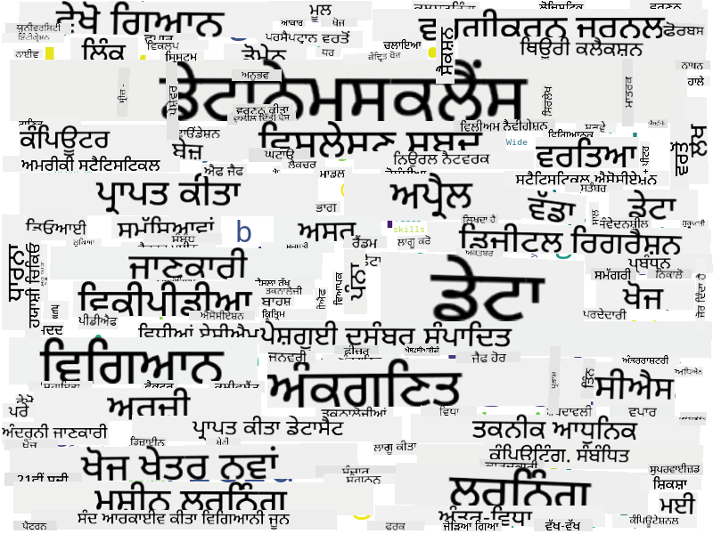

<!--
CO_OP_TRANSLATOR_METADATA:
{
  "original_hash": "2583a9894af7123b2fcae3376b14c035",
  "translation_date": "2025-08-27T17:15:23+00:00",
  "source_file": "1-Introduction/01-defining-data-science/README.md",
  "language_code": "pa"
}
-->
## ਡਾਟਾ ਦੇ ਕਿਸਮਾਂ

ਜਿਵੇਂ ਕਿ ਅਸੀਂ ਪਹਿਲਾਂ ਹੀ ਜ਼ਿਕਰ ਕੀਤਾ ਹੈ, ਡਾਟਾ ਹਰ ਜਗ੍ਹਾ ਹੈ। ਸਾਨੂੰ ਸਿਰਫ਼ ਇਸਨੂੰ ਸਹੀ ਤਰੀਕੇ ਨਾਲ ਕੈਪਚਰ ਕਰਨ ਦੀ ਲੋੜ ਹੈ! ਇਹ ਲਾਭਦਾਇਕ ਹੈ ਕਿ ਅਸੀਂ **ਸੰਰਚਿਤ** ਅਤੇ **ਅਸੰਰਚਿਤ** ਡਾਟਾ ਵਿੱਚ ਫਰਕ ਕਰੀਏ। ਪਹਿਲਾ ਆਮ ਤੌਰ 'ਤੇ ਕਿਸੇ ਚੰਗੀ ਤਰ੍ਹਾਂ ਸੰਰਚਿਤ ਰੂਪ ਵਿੱਚ ਪ੍ਰਸਤੁਤ ਹੁੰਦਾ ਹੈ, ਅਕਸਰ ਇੱਕ ਟੇਬਲ ਜਾਂ ਕਈ ਟੇਬਲਾਂ ਦੇ ਰੂਪ ਵਿੱਚ, ਜਦਕਿ ਦੂਜਾ ਸਿਰਫ਼ ਫਾਈਲਾਂ ਦਾ ਇਕੱਠ ਹੁੰਦਾ ਹੈ। ਕਈ ਵਾਰ ਅਸੀਂ **ਅਰਧ-ਸੰਰਚਿਤ** ਡਾਟਾ ਬਾਰੇ ਵੀ ਗੱਲ ਕਰ ਸਕਦੇ ਹਾਂ, ਜਿਸ ਵਿੱਚ ਕੁਝ ਹੱਦ ਤੱਕ ਸੰਰਚਨਾ ਹੁੰਦੀ ਹੈ ਜੋ ਕਾਫ਼ੀ ਵੱਖ-ਵੱਖ ਹੋ ਸਕਦੀ ਹੈ।

| ਸੰਰਚਿਤ                                                                   | ਅਰਧ-ਸੰਰਚਿਤ                                                                                  | ਅਸੰਰਚਿਤ                            |
| -------------------------------------------------------------------------- | -------------------------------------------------------------------------------------------- | ----------------------------------- |
| ਲੋਕਾਂ ਦੀ ਸੂਚੀ ਉਨ੍ਹਾਂ ਦੇ ਫੋਨ ਨੰਬਰਾਂ ਨਾਲ                                    | ਲਿੰਕਾਂ ਵਾਲੇ ਵਿਕੀਪੀਡੀਆ ਪੰਨੇ                                                                   | ਐਨਸਾਈਕਲੋਪੀਡੀਆ ਬ੍ਰਿਟਾਨਿਕਾ ਦਾ ਪਾਠ |
| ਪਿਛਲੇ 20 ਸਾਲਾਂ ਵਿੱਚ ਹਰ ਮਿੰਟ ਵਿੱਚ ਇੱਕ ਇਮਾਰਤ ਦੇ ਸਾਰੇ ਕਮਰਿਆਂ ਦਾ ਤਾਪਮਾਨ     | JSON ਫਾਰਮੈਟ ਵਿੱਚ ਵਿਗਿਆਨਕ ਪੇਪਰਾਂ ਦਾ ਇਕੱਠ, ਲੇਖਕਾਂ, ਪ੍ਰਕਾਸ਼ਨ ਦੀ ਮਿਤੀ, ਅਤੇ ਸਾਰਾਂ ਦੇ ਨਾਲ         | ਕਾਰਪੋਰੇਟ ਦਸਤਾਵੇਜ਼ਾਂ ਨਾਲ ਫਾਈਲ ਸ਼ੇਅਰ |
| ਇਮਾਰਤ ਵਿੱਚ ਦਾਖਲ ਹੋਣ ਵਾਲੇ ਸਾਰੇ ਲੋਕਾਂ ਦੀ ਉਮਰ ਅਤੇ ਲਿੰਗ ਦਾ ਡਾਟਾ              | ਇੰਟਰਨੈਟ ਪੰਨੇ                                                                                 | ਨਿਗਰਾਨੀ ਕੈਮਰੇ ਤੋਂ ਕੱਚਾ ਵੀਡੀਓ ਫੀਡ  |

## ਡਾਟਾ ਕਿੱਥੋਂ ਮਿਲ ਸਕਦਾ ਹੈ

ਡਾਟਾ ਦੇ ਕਈ ਸੰਭਾਵਿਤ ਸਰੋਤ ਹਨ, ਅਤੇ ਉਨ੍ਹਾਂ ਨੂੰ ਸਾਰਿਆਂ ਨੂੰ ਲਿਸਟ ਕਰਨਾ ਅਸੰਭਵ ਹੋਵੇਗਾ! ਪਰ ਫਿਰ ਵੀ, ਆਓ ਕੁਝ ਆਮ ਜਗ੍ਹਾਵਾਂ ਦਾ ਜ਼ਿਕਰ ਕਰੀਏ ਜਿੱਥੇ ਤੁਸੀਂ ਡਾਟਾ ਪ੍ਰਾਪਤ ਕਰ ਸਕਦੇ ਹੋ:

* **ਸੰਰਚਿਤ**
  - **Internet of Things** (IoT), ਜਿਸ ਵਿੱਚ ਵੱਖ-ਵੱਖ ਸੈਂਸਰਾਂ ਤੋਂ ਡਾਟਾ ਸ਼ਾਮਲ ਹੈ, ਜਿਵੇਂ ਕਿ ਤਾਪਮਾਨ ਜਾਂ ਦਬਾਅ ਸੈਂਸਰ, ਕਾਫ਼ੀ ਲਾਭਦਾਇਕ ਡਾਟਾ ਪ੍ਰਦਾਨ ਕਰਦੇ ਹਨ। ਉਦਾਹਰਣ ਲਈ, ਜੇਕਰ ਇੱਕ ਦਫ਼ਤਰ ਦੀ ਇਮਾਰਤ IoT ਸੈਂਸਰਾਂ ਨਾਲ ਸਜਜਿਤ ਹੈ, ਤਾਂ ਅਸੀਂ ਖਰਚੇ ਘਟਾਉਣ ਲਈ ਹੀਟਿੰਗ ਅਤੇ ਲਾਈਟਿੰਗ ਨੂੰ ਆਟੋਮੈਟਿਕ ਤੌਰ 'ਤੇ ਨਿਯੰਤਰਿਤ ਕਰ ਸਕਦੇ ਹਾਂ।
  - **ਸਰਵੇਖਣਾਂ**, ਜਿਹਨਾਂ ਨੂੰ ਅਸੀਂ ਉਪਭੋਗਤਾਵਾਂ ਨੂੰ ਖਰੀਦਦਾਰੀ ਤੋਂ ਬਾਅਦ ਜਾਂ ਵੈਬਸਾਈਟ ਦੇ ਦੌਰੇ ਤੋਂ ਬਾਅਦ ਪੂਰਾ ਕਰਨ ਲਈ ਕਹਿੰਦੇ ਹਾਂ।
  - **ਵਿਹਾਰ ਦਾ ਵਿਸ਼ਲੇਸ਼ਣ**, ਜੋ ਸਾਨੂੰ ਇਹ ਸਮਝਣ ਵਿੱਚ ਮਦਦ ਕਰ ਸਕਦਾ ਹੈ ਕਿ ਉਪਭੋਗਤਾ ਵੈਬਸਾਈਟ ਵਿੱਚ ਕਿੰਨਾ ਡੂੰਘਾ ਜਾਂਦਾ ਹੈ ਅਤੇ ਕਿਉਂ ਵੈਬਸਾਈਟ ਛੱਡਦਾ ਹੈ।
* **ਅਸੰਰਚਿਤ**
  - **ਪਾਠ**, ਜੋ ਸਮੁੱਚੇ **ਭਾਵਨਾ ਸਕੋਰ** ਜਾਂ ਕੁੰਜੀ ਸ਼ਬਦ ਅਤੇ ਅਰਥਮਈ ਜਾਣਕਾਰੀ ਕੱਢਣ ਵਰਗੀਆਂ ਝਲਕਾਂ ਪ੍ਰਦਾਨ ਕਰ ਸਕਦਾ ਹੈ।
  - **ਚਿੱਤਰ** ਜਾਂ **ਵੀਡੀਓ**। ਨਿਗਰਾਨੀ ਕੈਮਰੇ ਤੋਂ ਇੱਕ ਵੀਡੀਓ ਸੜਕ 'ਤੇ ਟ੍ਰੈਫਿਕ ਦਾ ਅੰਦਾਜ਼ਾ ਲਗਾਉਣ ਅਤੇ ਲੋਕਾਂ ਨੂੰ ਸੰਭਾਵਿਤ ਟ੍ਰੈਫਿਕ ਜਾਮ ਬਾਰੇ ਜਾਣਕਾਰੀ ਦੇਣ ਲਈ ਵਰਤੀ ਜਾ ਸਕਦੀ ਹੈ।
  - ਵੈਬ ਸਰਵਰ **ਲਾਗ**, ਜੋ ਇਹ ਸਮਝਣ ਲਈ ਵਰਤੇ ਜਾ ਸਕਦੇ ਹਨ ਕਿ ਸਾਡੀ ਵੈਬਸਾਈਟ ਦੇ ਕਿਹੜੇ ਪੰਨੇ ਸਭ ਤੋਂ ਵੱਧ ਵੇਖੇ ਜਾਂਦੇ ਹਨ ਅਤੇ ਕਿੰਨੀ ਦੇਰ ਲਈ।
* **ਅਰਧ-ਸੰਰਚਿਤ**
  - **ਸੋਸ਼ਲ ਨੈਟਵਰਕ** ਗ੍ਰਾਫ, ਜੋ ਉਪਭੋਗਤਾ ਦੀਆਂ ਵਿਅਕਤਿਤਾਵਾਂ ਅਤੇ ਜਾਣਕਾਰੀ ਫੈਲਾਉਣ ਵਿੱਚ ਸੰਭਾਵਿਤ ਪ੍ਰਭਾਵਸ਼ਾਲੀਤਾ ਬਾਰੇ ਡਾਟਾ ਪ੍ਰਦਾਨ ਕਰ ਸਕਦੇ ਹਨ।
  - ਜਦੋਂ ਸਾਡੇ ਕੋਲ ਪਾਰਟੀ ਤੋਂ ਫੋਟੋਆਂ ਦਾ ਇਕੱਠ ਹੁੰਦਾ ਹੈ, ਤਾਂ ਅਸੀਂ **ਗਰੁੱਪ ਡਾਇਨਾਮਿਕਸ** ਡਾਟਾ ਕੱਢਣ ਦੀ ਕੋਸ਼ਿਸ਼ ਕਰ ਸਕਦੇ ਹਾਂ, ਜਿਵੇਂ ਕਿ ਲੋਕਾਂ ਦੇ ਗਰੁੱਪਾਂ ਦੀਆਂ ਤਸਵੀਰਾਂ ਦੇ ਗ੍ਰਾਫ ਬਣਾਉਣਾ।

ਵੱਖ-ਵੱਖ ਸੰਭਾਵਿਤ ਡਾਟਾ ਸਰੋਤਾਂ ਨੂੰ ਜਾਣ ਕੇ, ਤੁਸੀਂ ਵੱਖ-ਵੱਖ ਸਥਿਤੀਆਂ ਬਾਰੇ ਸੋਚ ਸਕਦੇ ਹੋ ਜਿੱਥੇ ਡਾਟਾ ਸਾਇੰਸ ਤਕਨੀਕਾਂ ਨੂੰ ਸਥਿਤੀ ਨੂੰ ਬਿਹਤਰ ਸਮਝਣ ਅਤੇ ਕਾਰੋਬਾਰੀ ਪ੍ਰਕਿਰਿਆਵਾਂ ਨੂੰ ਸੁਧਾਰਨ ਲਈ ਲਾਗੂ ਕੀਤਾ ਜਾ ਸਕਦਾ ਹੈ।

## ਡਾਟਾ ਨਾਲ ਕੀ ਕੀਤਾ ਜਾ ਸਕਦਾ ਹੈ

ਡਾਟਾ ਸਾਇੰਸ ਵਿੱਚ, ਅਸੀਂ ਡਾਟਾ ਯਾਤਰਾ ਦੇ ਹੇਠ ਲਿਖੇ ਕਦਮਾਂ 'ਤੇ ਧਿਆਨ ਕੇਂਦਰਿਤ ਕਰਦੇ ਹਾਂ:

## ਡਿਜ਼ੀਟਲਾਈਜ਼ੇਸ਼ਨ ਅਤੇ ਡਿਜ਼ੀਟਲ ਰੂਪਾਂਤਰਨ

ਪਿਛਲੇ ਦਹਾਕੇ ਵਿੱਚ, ਕਈ ਕਾਰੋਬਾਰਾਂ ਨੇ ਇਹ ਸਮਝਣਾ ਸ਼ੁਰੂ ਕੀਤਾ ਕਿ ਕਾਰੋਬਾਰੀ ਫੈਸਲੇ ਲੈਣ ਸਮੇਂ ਡਾਟਾ ਕਿੰਨਾ ਮਹੱਤਵਪੂਰਨ ਹੈ। ਡਾਟਾ ਸਾਇੰਸ ਦੇ ਸਿਧਾਂਤਾਂ ਨੂੰ ਕਾਰੋਬਾਰ ਚਲਾਉਣ ਲਈ ਲਾਗੂ ਕਰਨ ਲਈ, ਸਭ ਤੋਂ ਪਹਿਲਾਂ ਕੁਝ ਡਾਟਾ ਇਕੱਠਾ ਕਰਨ ਦੀ ਲੋੜ ਹੁੰਦੀ ਹੈ, ਅਰਥਾਤ ਕਾਰੋਬਾਰੀ ਪ੍ਰਕਿਰਿਆਵਾਂ ਨੂੰ ਡਿਜ਼ੀਟਲ ਰੂਪ ਵਿੱਚ ਤਬਦੀਲ ਕਰਨਾ। ਇਸਨੂੰ **ਡਿਜ਼ੀਟਲਾਈਜ਼ੇਸ਼ਨ** ਕਿਹਾ ਜਾਂਦਾ ਹੈ। ਇਸ ਡਾਟਾ 'ਤੇ ਡਾਟਾ ਸਾਇੰਸ ਤਕਨੀਕਾਂ ਨੂੰ ਲਾਗੂ ਕਰਕੇ ਫੈਸਲੇ ਲੈਣ ਨਾਲ ਉਤਪਾਦਕਤਾ ਵਿੱਚ ਮਹੱਤਵਪੂਰਨ ਵਾਧਾ ਹੋ ਸਕਦਾ ਹੈ (ਜਾਂ ਕਾਰੋਬਾਰ ਵਿੱਚ ਨਵੀਂ ਦਿਸ਼ਾ), ਜਿਸਨੂੰ **ਡਿਜ਼ੀਟਲ ਰੂਪਾਂਤਰਨ** ਕਿਹਾ ਜਾਂਦਾ ਹੈ।

ਆਓ ਇੱਕ ਉਦਾਹਰਣ ਦੇਖੀਏ। ਮੰਨ ਲਓ ਕਿ ਸਾਡੇ ਕੋਲ ਇੱਕ ਡਾਟਾ ਸਾਇੰਸ ਕੋਰਸ ਹੈ (ਜਿਵੇਂ ਕਿ ਇਹ), ਜਿਸਨੂੰ ਅਸੀਂ ਵਿਦਿਆਰਥੀਆਂ ਨੂੰ ਆਨਲਾਈਨ ਪ੍ਰਦਾਨ ਕਰਦੇ ਹਾਂ, ਅਤੇ ਅਸੀਂ ਇਸਨੂੰ ਸੁਧਾਰਨ ਲਈ ਡਾਟਾ ਸਾਇੰਸ ਦੀ ਵਰਤੋਂ ਕਰਨਾ ਚਾਹੁੰਦੇ ਹਾਂ। ਅਸੀਂ ਇਹ ਕਿਵੇਂ ਕਰ ਸਕਦੇ ਹਾਂ?

ਅਸੀਂ ਇਹ ਪੁੱਛ ਕੇ ਸ਼ੁਰੂ ਕਰ ਸਕਦੇ ਹਾਂ, "ਕੀ ਡਿਜ਼ੀਟਲ ਕੀਤਾ ਜਾ ਸਕਦਾ ਹੈ?" ਸਭ ਤੋਂ ਸਧਾਰਨ ਤਰੀਕਾ ਇਹ ਹੋਵੇਗਾ ਕਿ ਹਰ ਵਿਦਿਆਰਥੀ ਨੂੰ ਹਰ ਮਾਡਿਊਲ ਪੂਰਾ ਕਰਨ ਵਿੱਚ ਲੱਗਣ ਵਾਲੇ ਸਮੇਂ ਨੂੰ ਮਾਪਿਆ ਜਾਵੇ, ਅਤੇ ਹਰ ਮਾਡਿਊਲ ਦੇ ਅੰਤ ਵਿੱਚ ਇੱਕ ਮਲਟੀਪਲ-ਚੋਇਸ ਟੈਸਟ ਦੇ ਕੇ ਪ੍ਰਾਪਤ ਗਿਆਨ ਨੂੰ ਮਾਪਿਆ ਜਾਵੇ। ਸਾਰੇ ਵਿਦਿਆਰਥੀਆਂ ਵਿੱਚ ਸਮਾਂ-ਪੂਰਾ ਕਰਨ ਦੇ ਔਸਤ ਨੂੰ ਮਾਪ ਕੇ, ਅਸੀਂ ਪਤਾ ਲਗਾ ਸਕਦੇ ਹਾਂ ਕਿ ਕਿਹੜੇ ਮਾਡਿਊਲ ਵਿਦਿਆਰਥੀਆਂ ਲਈ ਸਭ ਤੋਂ ਵੱਧ ਮੁਸ਼ਕਲੀਆਂ ਪੈਦਾ ਕਰਦੇ ਹਨ, ਅਤੇ ਉਨ੍ਹਾਂ ਨੂੰ ਸਧਾਰਨ ਬਣਾਉਣ 'ਤੇ ਕੰਮ ਕਰ ਸਕਦੇ ਹਾਂ।
ਤੁਸੀਂ ਦਲੀਲ ਦੇ ਸਕਦੇ ਹੋ ਕਿ ਇਹ ਪਹੁੰਚ ਆਦਰਸ਼ ਨਹੀਂ ਹੈ, ਕਿਉਂਕਿ ਮੋਡੀਊਲ ਵੱਖ-ਵੱਖ ਲੰਬਾਈ ਦੇ ਹੋ ਸਕਦੇ ਹਨ। ਸ਼ਾਇਦ ਸਮਾਂ ਨੂੰ ਮੋਡੀਊਲ ਦੀ ਲੰਬਾਈ (ਅੱਖਰਾਂ ਦੀ ਗਿਣਤੀ ਵਿੱਚ) ਨਾਲ ਵੰਡਣਾ ਅਤੇ ਉਹਨਾਂ ਮੁੱਲਾਂ ਦੀ ਤੁਲਨਾ ਕਰਨਾ ਜ਼ਿਆਦਾ ਨਿਆਂਯੁਕਤ ਹੋਵੇ।
ਜਦੋਂ ਅਸੀਂ ਬਹੁ-ਚੋਣ ਪ੍ਰਸ਼ਨਾਂ ਦੇ ਨਤੀਜਿਆਂ ਦਾ ਵਿਸ਼ਲੇਸ਼ਣ ਕਰਨਾ ਸ਼ੁਰੂ ਕਰਦੇ ਹਾਂ, ਤਾਂ ਅਸੀਂ ਇਹ ਪਤਾ ਲਗਾਉਣ ਦੀ ਕੋਸ਼ਿਸ਼ ਕਰ ਸਕਦੇ ਹਾਂ ਕਿ ਵਿਦਿਆਰਥੀਆਂ ਨੂੰ ਕਿਹੜੇ ਧਾਰਣਾਵਾਂ ਨੂੰ ਸਮਝਣ ਵਿੱਚ ਮੁਸ਼ਕਲ ਆ ਰਹੀ ਹੈ, ਅਤੇ ਇਸ ਜਾਣਕਾਰੀ ਨੂੰ ਸਮੱਗਰੀ ਨੂੰ ਬਿਹਤਰ ਬਣਾਉਣ ਲਈ ਵਰਤ ਸਕਦੇ ਹਾਂ। ਇਹ ਕਰਨ ਲਈ, ਸਾਨੂੰ ਪ੍ਰਸ਼ਨਾਂ ਨੂੰ ਇਸ ਤਰੀਕੇ ਨਾਲ ਡਿਜ਼ਾਈਨ ਕਰਨਾ ਪਵੇਗਾ ਕਿ ਹਰ ਪ੍ਰਸ਼ਨ ਕਿਸੇ ਵਿਸ਼ੇਸ਼ ਧਾਰਣਾ ਜਾਂ ਗਿਆਨ ਦੇ ਟੁਕੜੇ ਨਾਲ ਜੁੜਿਆ ਹੋਵੇ।

ਜੇ ਅਸੀਂ ਹੋਰ ਜਟਿਲ ਹੋਣਾ ਚਾਹੁੰਦੇ ਹਾਂ, ਤਾਂ ਅਸੀਂ ਹਰ ਮੋਡੀਊਲ ਲਈ ਲੱਗੇ ਸਮੇਂ ਨੂੰ ਵਿਦਿਆਰਥੀਆਂ ਦੀ ਉਮਰ ਸ਼੍ਰੇਣੀ ਦੇ ਮੁਕਾਬਲੇ ਵਿੱਚ ਪਲਾਟ ਕਰ ਸਕਦੇ ਹਾਂ। ਸਾਨੂੰ ਪਤਾ ਲਗ ਸਕਦਾ ਹੈ ਕਿ ਕੁਝ ਉਮਰ ਸ਼੍ਰੇਣੀਆਂ ਲਈ ਮੋਡੀਊਲ ਪੂਰਾ ਕਰਨ ਵਿੱਚ ਅਣਉਚਿਤ ਤੌਰ 'ਤੇ ਲੰਮਾ ਸਮਾਂ ਲੱਗਦਾ ਹੈ, ਜਾਂ ਵਿਦਿਆਰਥੀ ਇਸਨੂੰ ਪੂਰਾ ਕਰਨ ਤੋਂ ਪਹਿਲਾਂ ਹੀ ਛੱਡ ਦਿੰਦੇ ਹਨ। ਇਹ ਸਾਨੂੰ ਮੋਡੀਊਲ ਲਈ ਉਮਰ ਦੀ ਸਿਫਾਰਸ਼ਾਂ ਦੇਣ ਵਿੱਚ ਮਦਦ ਕਰ ਸਕਦਾ ਹੈ, ਅਤੇ ਗਲਤ ਉਮੀਦਾਂ ਤੋਂ ਲੋਕਾਂ ਦੀ ਨਿਰਾਸ਼ਾ ਨੂੰ ਘਟਾ ਸਕਦਾ ਹੈ।

## 🚀 ਚੁਣੌਤੀ

ਇਸ ਚੁਣੌਤੀ ਵਿੱਚ, ਅਸੀਂ ਡਾਟਾ ਸਾਇੰਸ ਦੇ ਖੇਤਰ ਨਾਲ ਸਬੰਧਤ ਧਾਰਣਾਵਾਂ ਨੂੰ ਪਛਾਣਨ ਦੀ ਕੋਸ਼ਿਸ਼ ਕਰਾਂਗੇ, ਟੈਕਸਟ ਨੂੰ ਦੇਖ ਕੇ। ਅਸੀਂ ਡਾਟਾ ਸਾਇੰਸ 'ਤੇ ਇੱਕ ਵਿਕੀਪੀਡੀਆ ਲੇਖ ਲਵਾਂਗੇ, ਟੈਕਸਟ ਨੂੰ ਡਾਊਨਲੋਡ ਅਤੇ ਪ੍ਰੋਸੈਸ ਕਰਾਂਗੇ, ਅਤੇ ਫਿਰ ਇੱਕ ਵਰਡ ਕਲਾਉਡ ਬਣਾਵਾਂਗੇ ਜਿਵੇਂ ਕਿ ਇਹ ਹੈ:

[`notebook.ipynb`](../../../../../../../../../1-Introduction/01-defining-data-science/notebook.ipynb ':ignore') 'ਤੇ ਜਾਓ ਅਤੇ ਕੋਡ ਨੂੰ ਪੜ੍ਹੋ। ਤੁਸੀਂ ਕੋਡ ਚਲਾ ਕੇ ਦੇਖ ਸਕਦੇ ਹੋ ਕਿ ਇਹ ਸਾਰੇ ਡਾਟਾ ਟ੍ਰਾਂਸਫਾਰਮੇਸ਼ਨ ਨੂੰ ਰੀਅਲ ਟਾਈਮ ਵਿੱਚ ਕਿਵੇਂ ਕਰਦਾ ਹੈ।

> ਜੇ ਤੁਹਾਨੂੰ Jupyter Notebook ਵਿੱਚ ਕੋਡ ਚਲਾਉਣ ਦਾ ਪਤਾ ਨਹੀਂ ਹੈ, ਤਾਂ [ਇਸ ਲੇਖ](https://soshnikov.com/education/how-to-execute-notebooks-from-github/) ਨੂੰ ਦੇਖੋ।

## [ਪੋਸਟ-ਲੈਕਚਰ ਕਵਿਜ਼](https://purple-hill-04aebfb03.1.azurestaticapps.net/quiz/1)

## ਅਸਾਈਨਮੈਂਟਸ

* **ਟਾਸਕ 1**: ਉਪਰੋਕਤ ਕੋਡ ਨੂੰ ਸੋਧੋ ਤਾਂ ਜੋ **Big Data** ਅਤੇ **Machine Learning** ਦੇ ਖੇਤਰਾਂ ਲਈ ਸਬੰਧਤ ਧਾਰਣਾਵਾਂ ਪਤਾ ਲਗਾਈਆਂ ਜਾ ਸਕਣ।
* **ਟਾਸਕ 2**: [ਡਾਟਾ ਸਾਇੰਸ ਸਨਰੀਓਜ਼ ਬਾਰੇ ਸੋਚੋ](assignment.md)

## ਸ਼੍ਰੇਯ

ਇਹ ਪਾਠ [ਦਿਮਿਤਰੀ ਸੋਸ਼ਨਿਕੋਵ](http://soshnikov.com) ਵੱਲੋਂ ♥️ ਨਾਲ ਲਿਖਿਆ ਗਿਆ ਹੈ।

---

**ਅਸਵੀਕਰਤੀ**:  
ਇਹ ਦਸਤਾਵੇਜ਼ AI ਅਨੁਵਾਦ ਸੇਵਾ [Co-op Translator](https://github.com/Azure/co-op-translator) ਦੀ ਵਰਤੋਂ ਕਰਕੇ ਅਨੁਵਾਦ ਕੀਤਾ ਗਿਆ ਹੈ। ਜਦੋਂ ਕਿ ਅਸੀਂ ਸਹੀ ਹੋਣ ਦੀ ਕੋਸ਼ਿਸ਼ ਕਰਦੇ ਹਾਂ, ਕਿਰਪਾ ਕਰਕੇ ਧਿਆਨ ਦਿਓ ਕਿ ਸਵੈਚਾਲਿਤ ਅਨੁਵਾਦਾਂ ਵਿੱਚ ਗਲਤੀਆਂ ਜਾਂ ਅਸੁਚੱਜੇਪਣ ਹੋ ਸਕਦੇ ਹਨ। ਇਸ ਦੀ ਮੂਲ ਭਾਸ਼ਾ ਵਿੱਚ ਮੌਜੂਦ ਮੂਲ ਦਸਤਾਵੇਜ਼ ਨੂੰ ਅਧਿਕਾਰਕ ਸਰੋਤ ਮੰਨਿਆ ਜਾਣਾ ਚਾਹੀਦਾ ਹੈ। ਮਹੱਤਵਪੂਰਨ ਜਾਣਕਾਰੀ ਲਈ, ਪੇਸ਼ੇਵਰ ਮਨੁੱਖੀ ਅਨੁਵਾਦ ਦੀ ਸਿਫਾਰਸ਼ ਕੀਤੀ ਜਾਂਦੀ ਹੈ। ਅਸੀਂ ਇਸ ਅਨੁਵਾਦ ਦੀ ਵਰਤੋਂ ਤੋਂ ਪੈਦਾ ਹੋਣ ਵਾਲੇ ਕਿਸੇ ਵੀ ਗਲਤਫਹਿਮੀ ਜਾਂ ਗਲਤ ਵਿਆਖਿਆ ਲਈ ਜ਼ਿੰਮੇਵਾਰ ਨਹੀਂ ਹਾਂ।