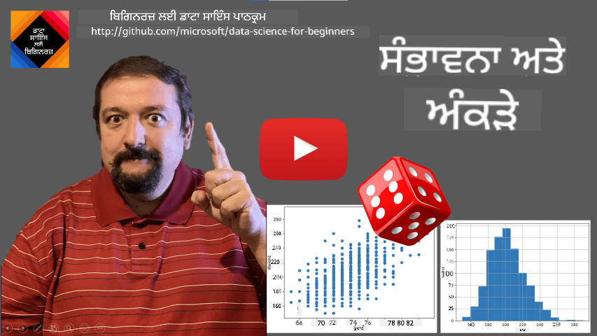
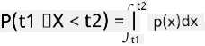

<!--
CO_OP_TRANSLATOR_METADATA:
{
  "original_hash": "b706a07cfa87ba091cbb91e0aa775600",
  "translation_date": "2025-08-27T17:25:56+00:00",
  "source_file": "1-Introduction/04-stats-and-probability/README.md",
  "language_code": "pa"
}
-->
# ਸੰਖਿਆਕੀ ਅਤੇ ਸੰਭਾਵਨਾ ਦਾ ਇੱਕ ਛੋਟਾ ਜਿਹਾ ਪਰਿਚਯ

| ](../../sketchnotes/04-Statistics-Probability.png)|
|:---:|
| ਸੰਖਿਆਕੀ ਅਤੇ ਸੰਭਾਵਨਾ - _ਸਕੈਚਨੋਟ [@nitya](https://twitter.com/nitya) ਦੁਆਰਾ_ |

ਸੰਖਿਆਕੀ ਅਤੇ ਸੰਭਾਵਨਾ ਸਿਧਾਂਤ ਗਣਿਤ ਦੇ ਦੋ ਬਹੁਤ ਹੀ ਜੁੜੇ ਹੋਏ ਖੇਤਰ ਹਨ ਜੋ ਡਾਟਾ ਸਾਇੰਸ ਲਈ ਬਹੁਤ ਮਹੱਤਵਪੂਰਨ ਹਨ। ਡਾਟਾ ਨਾਲ ਗਣਿਤ ਦੇ ਡੂੰਘੇ ਗਿਆਨ ਤੋਂ ਬਿਨਾਂ ਵੀ ਕੰਮ ਕੀਤਾ ਜਾ ਸਕਦਾ ਹੈ, ਪਰ ਕੁਝ ਬੁਨਿਆਦੀ ਧਾਰਨਾਵਾਂ ਜਾਣਨਾ ਫਿਰ ਵੀ ਵਧੀਆ ਹੈ। ਇੱਥੇ ਅਸੀਂ ਇੱਕ ਛੋਟਾ ਜਿਹਾ ਪਰਿਚਯ ਪੇਸ਼ ਕਰਾਂਗੇ ਜੋ ਤੁਹਾਨੂੰ ਸ਼ੁਰੂਆਤ ਕਰਨ ਵਿੱਚ ਮਦਦ ਕਰੇਗਾ।

[](https://youtu.be/Z5Zy85g4Yjw)

## [ਪ੍ਰੀ-ਲੈਕਚਰ ਪ੍ਰਸ਼ਨੋਤਰੀ](https://purple-hill-04aebfb03.1.azurestaticapps.net/quiz/6)

## ਸੰਭਾਵਨਾ ਅਤੇ ਰੈਂਡਮ ਵੈਰੀਏਬਲ

**ਸੰਭਾਵਨਾ** 0 ਅਤੇ 1 ਦੇ ਵਿਚਕਾਰ ਇੱਕ ਗਿਣਤੀ ਹੈ ਜੋ ਦੱਸਦੀ ਹੈ ਕਿ ਕੋਈ **ਘਟਨਾ** ਕਿੰਨੀ ਸੰਭਾਵਨਾ ਵਾਲੀ ਹੈ। ਇਹ ਸਾਰੇ ਸੰਭਾਵੀ ਨਤੀਜਿਆਂ ਵਿੱਚੋਂ ਸਕਾਰਾਤਮਕ ਨਤੀਜਿਆਂ ਦੀ ਗਿਣਤੀ (ਜੋ ਘਟਨਾ ਵੱਲ ਲੀਡ ਕਰਦੇ ਹਨ) ਨੂੰ ਵੰਡ ਕੇ ਪਰਿਭਾਸ਼ਿਤ ਕੀਤੀ ਜਾਂਦੀ ਹੈ, ਜੇਕਰ ਸਾਰੇ ਨਤੀਜੇ ਇੱਕੋ ਜਿਹੇ ਸੰਭਾਵੀ ਹਨ। ਉਦਾਹਰਣ ਲਈ, ਜਦੋਂ ਅਸੀਂ ਪਾਸਾ ਸੁੱਟਦੇ ਹਾਂ, ਤਾਂ ਸੰਭਾਵਨਾ ਕਿ ਸਾਨੂੰ ਇੱਕ ਜੋੜਾ ਨੰਬਰ ਮਿਲੇਗਾ 3/6 = 0.5 ਹੈ।

ਜਦੋਂ ਅਸੀਂ ਘਟਨਾਵਾਂ ਬਾਰੇ ਗੱਲ ਕਰਦੇ ਹਾਂ, ਅਸੀਂ **ਰੈਂਡਮ ਵੈਰੀਏਬਲ** ਵਰਤਦੇ ਹਾਂ। ਉਦਾਹਰਣ ਲਈ, ਪਾਸਾ ਸੁੱਟਣ 'ਤੇ ਪ੍ਰਾਪਤ ਨੰਬਰ ਨੂੰ ਦਰਸਾਉਣ ਵਾਲਾ ਰੈਂਡਮ ਵੈਰੀਏਬਲ 1 ਤੋਂ 6 ਤੱਕ ਦੇ ਮੁੱਲ ਲਵੇਗਾ। 1 ਤੋਂ 6 ਤੱਕ ਦੀ ਗਿਣਤੀ ਨੂੰ **ਸੈਂਪਲ ਸਪੇਸ** ਕਿਹਾ ਜਾਂਦਾ ਹੈ। ਅਸੀਂ ਰੈਂਡਮ ਵੈਰੀਏਬਲ ਦੇ ਕਿਸੇ ਖਾਸ ਮੁੱਲ ਨੂੰ ਲੈਣ ਦੀ ਸੰਭਾਵਨਾ ਬਾਰੇ ਗੱਲ ਕਰ ਸਕਦੇ ਹਾਂ, ਉਦਾਹਰਣ ਲਈ P(X=3)=1/6।

ਪਿਛਲੇ ਉਦਾਹਰਣ ਵਿੱਚ ਰੈਂਡਮ ਵੈਰੀਏਬਲ ਨੂੰ **ਡਿਸਕ੍ਰੀਟ** ਕਿਹਾ ਜਾਂਦਾ ਹੈ, ਕਿਉਂਕਿ ਇਸਦਾ ਸੈਂਪਲ ਸਪੇਸ ਗਿਣਤੀਯੋਗ ਹੈ, ਅਰਥਾਤ ਅਲੱਗ ਅਲੱਗ ਮੁੱਲ ਹਨ ਜੋ ਗਿਣੇ ਜਾ ਸਕਦੇ ਹਨ। ਕੁਝ ਮਾਮਲਿਆਂ ਵਿੱਚ ਸੈਂਪਲ ਸਪੇਸ ਅਸਲ ਨੰਬਰਾਂ ਦੀ ਇੱਕ ਰੇਂਜ ਜਾਂ ਪੂਰੇ ਅਸਲ ਨੰਬਰਾਂ ਦਾ ਸੈੱਟ ਹੁੰਦਾ ਹੈ। ਇਸ ਤਰ੍ਹਾਂ ਦੇ ਵੈਰੀਏਬਲਾਂ ਨੂੰ **ਕੰਟਿਨਿਊਅਸ** ਕਿਹਾ ਜਾਂਦਾ ਹੈ। ਇੱਕ ਵਧੀਆ ਉਦਾਹਰਣ ਬੱਸ ਦੇ ਆਉਣ ਦਾ ਸਮਾਂ ਹੈ।

## ਸੰਭਾਵਨਾ ਵੰਡ

ਡਿਸਕ੍ਰੀਟ ਰੈਂਡਮ ਵੈਰੀਏਬਲਾਂ ਦੇ ਮਾਮਲੇ ਵਿੱਚ, ਹਰ ਘਟਨਾ ਦੀ ਸੰਭਾਵਨਾ ਨੂੰ ਇੱਕ ਫੰਕਸ਼ਨ P(X) ਦੁਆਰਾ ਵਰਣਨ ਕਰਨਾ ਆਸਾਨ ਹੈ। ਸੈਂਪਲ ਸਪੇਸ *S* ਵਿੱਚੋਂ ਹਰ ਮੁੱਲ *s* ਲਈ ਇਹ 0 ਤੋਂ 1 ਤੱਕ ਦੀ ਗਿਣਤੀ ਦੇਵੇਗਾ, ਇਸ ਤਰ੍ਹਾਂ ਕਿ ਸਾਰੇ ਘਟਨਾਵਾਂ ਲਈ P(X=s) ਦੇ ਸਾਰੇ ਮੁੱਲਾਂ ਦਾ ਜੋੜ 1 ਹੋਵੇਗਾ।

ਸਭ ਤੋਂ ਪ੍ਰਸਿੱਧ ਡਿਸਕ੍ਰੀਟ ਵੰਡ **ਯੂਨੀਫਾਰਮ ਡਿਸਟ੍ਰੀਬਿਊਸ਼ਨ** ਹੈ, ਜਿਸ ਵਿੱਚ N ਤੱਤਾਂ ਦਾ ਸੈਂਪਲ ਸਪੇਸ ਹੁੰਦਾ ਹੈ, ਅਤੇ ਹਰ ਇੱਕ ਲਈ 1/N ਦੀ ਬਰਾਬਰ ਸੰਭਾਵਨਾ ਹੁੰਦੀ ਹੈ।

ਕੰਟਿਨਿਊਅਸ ਵੈਰੀਏਬਲ ਦੀ ਸੰਭਾਵਨਾ ਵੰਡ ਦਾ ਵਰਣਨ ਕਰਨਾ ਥੋੜ੍ਹਾ ਮੁਸ਼ਕਲ ਹੈ, ਜਦੋਂ ਮੁੱਲ ਕਿਸੇ ਇੰਟਰਵਲ [a,b] ਜਾਂ ਪੂਰੇ ਅਸਲ ਨੰਬਰਾਂ ਦੇ ਸੈੱਟ ℝ ਵਿੱਚੋਂ ਲਏ ਜਾਂਦੇ ਹਨ। ਬੱਸ ਦੇ ਆਉਣ ਦੇ ਸਮੇਂ ਦੇ ਮਾਮਲੇ ਨੂੰ ਵਿਚਾਰੋ। ਅਸਲ ਵਿੱਚ, ਹਰ ਖਾਸ ਆਉਣ ਦੇ ਸਮੇਂ *t* ਲਈ, ਬੱਸ ਦੇ ਉਸ ਸਮੇਂ ਤੇ ਆਉਣ ਦੀ ਸੰਭਾਵਨਾ 0 ਹੈ!

> ਹੁਣ ਤੁਹਾਨੂੰ ਪਤਾ ਹੈ ਕਿ 0 ਸੰਭਾਵਨਾ ਵਾਲੀਆਂ ਘਟਨਾਵਾਂ ਹੁੰਦੀਆਂ ਹਨ, ਅਤੇ ਬਹੁਤ ਵਾਰ ਹੁੰਦੀਆਂ ਹਨ! ਘੱਟੋ-ਘੱਟ ਹਰ ਵਾਰ ਜਦੋਂ ਬੱਸ ਆਉਂਦੀ ਹੈ!

ਅਸੀਂ ਸਿਰਫ਼ ਇਸ ਗੱਲ ਦੀ ਸੰਭਾਵਨਾ ਬਾਰੇ ਗੱਲ ਕਰ ਸਕਦੇ ਹਾਂ ਕਿ ਵੈਰੀਏਬਲ ਕਿਸੇ ਦਿੱਤੇ ਮੁੱਲਾਂ ਦੇ ਇੰਟਰਵਲ ਵਿੱਚ ਪੈਂਦਾ ਹੈ, ਜਿਵੇਂ ਕਿ P(t<sub>1</sub>≤X<t<sub>2</sub>)। ਇਸ ਮਾਮਲੇ ਵਿੱਚ, ਸੰਭਾਵਨਾ ਵੰਡ ਨੂੰ ਇੱਕ **ਸੰਭਾਵਨਾ ਘਣਤਾ ਫੰਕਸ਼ਨ** p(x) ਦੁਆਰਾ ਵਰਣਨ ਕੀਤਾ ਜਾਂਦਾ ਹੈ, ਇਸ ਤਰ੍ਹਾਂ ਕਿ



ਯੂਨੀਫਾਰਮ ਡਿਸਟ੍ਰੀਬਿਊਸ਼ਨ ਦਾ ਇੱਕ ਕੰਟਿਨਿਊਅਸ ਰੂਪ **ਕੰਟਿਨਿਊਅਸ ਯੂਨੀਫਾਰਮ** ਕਿਹਾ ਜਾਂਦਾ ਹੈ, ਜੋ ਇੱਕ ਸੀਮਿਤ ਇੰਟਰਵਲ 'ਤੇ ਪਰਿਭਾਸ਼ਿਤ ਹੁੰਦਾ ਹੈ। ਸੰਭਾਵਨਾ ਕਿ ਮੁੱਲ X ਲੰਬਾਈ l ਦੇ ਇੱਕ ਇੰਟਰਵਲ ਵਿੱਚ ਪੈਂਦਾ ਹੈ, l ਦੇ ਅਨੁਪਾਤ ਵਿੱਚ ਹੁੰਦੀ ਹੈ, ਅਤੇ 1 ਤੱਕ ਵਧਦੀ ਹੈ।

ਇੱਕ ਹੋਰ ਮਹੱਤਵਪੂਰਨ ਵੰਡ **ਨਾਰਮਲ ਡਿਸਟ੍ਰੀਬਿਊਸ਼ਨ** ਹੈ, ਜਿਸ ਬਾਰੇ ਅਸੀਂ ਹੇਠਾਂ ਹੋਰ ਵਿਸਥਾਰ ਵਿੱਚ ਗੱਲ ਕਰਾਂਗੇ।

## ਮੀਨ, ਵੈਰੀਅੰਸ ਅਤੇ ਸਟੈਂਡਰਡ ਡਿਵਿਏਸ਼ਨ

ਮੰਨੋ ਅਸੀਂ ਇੱਕ ਰੈਂਡਮ ਵੈਰੀਏਬਲ X ਦੇ n ਸੈਂਪਲਾਂ ਦੀ ਲੜੀ ਖਿੱਚਦੇ ਹਾਂ: x<sub>1</sub>, x<sub>2</sub>, ..., x<sub>n</sub>। ਅਸੀਂ ਲੜੀ ਦੇ **ਮੀਨ** (ਜਾਂ **ਅੰਕਗਣਿਤ ਔਸਤ**) ਮੁੱਲ ਨੂੰ ਰਵਾਇਤੀ ਤਰੀਕੇ ਨਾਲ ਪਰਿਭਾਸ਼ਿਤ ਕਰ ਸਕਦੇ ਹਾਂ (x<sub>1</sub>+x<sub>2</sub>+x<sub>n</sub>)/n। ਜਿਵੇਂ ਜਿਵੇਂ ਅਸੀਂ ਸੈਂਪਲ ਦਾ ਆਕਾਰ ਵਧਾਉਂਦੇ ਹਾਂ (ਅਰਥਾਤ n→∞ ਦੀ ਸੀਮਾ ਲੈਂਦੇ ਹਾਂ), ਅਸੀਂ ਵੰਡ ਦਾ ਮੀਨ (ਜਿਸਨੂੰ **ਐਕਸਪੈਕਟੇਸ਼ਨ** ਵੀ ਕਿਹਾ ਜਾਂਦਾ ਹੈ) ਪ੍ਰਾਪਤ ਕਰਾਂਗੇ। ਅਸੀਂ ਐਕਸਪੈਕਟੇਸ਼ਨ ਨੂੰ **E**(x) ਨਾਲ ਦਰਸਾਵਾਂਗੇ।

> ਇਹ ਦਿਖਾਇਆ ਜਾ ਸਕਦਾ ਹੈ ਕਿ ਕਿਸੇ ਵੀ ਡਿਸਕ੍ਰੀਟ ਵੰਡ ਲਈ, ਜਿਸ ਵਿੱਚ ਮੁੱਲ {x<sub>1</sub>, x<sub>2</sub>, ..., x<sub>N</sub>} ਅਤੇ ਸੰਬੰਧਤ ਸੰਭਾਵਨਾਵਾਂ p<sub>1</sub>, p<sub>2</sub>, ..., p<sub>N</sub> ਹਨ, ਐਕਸਪੈਕਟੇਸ਼ਨ E(X)=x<sub>1</sub>p<sub>1</sub>+x<sub>2</sub>p<sub>2</sub>+...+x<sub>N</sub>p<sub>N</sub> ਦੇ ਬਰਾਬਰ ਹੋਵੇਗਾ।

ਮੁੱਲਾਂ ਕਿੰਨੇ ਫੈਲੇ ਹੋਏ ਹਨ, ਇਹ ਪਛਾਣਣ ਲਈ ਅਸੀਂ ਵੈਰੀਅੰਸ σ<sup>2</sup> = ∑(x<sub>i</sub> - μ)<sup>2</sup>/n ਦੀ ਗਣਨਾ ਕਰ ਸਕਦੇ ਹਾਂ, ਜਿੱਥੇ μ ਲੜੀ ਦਾ ਮੀਨ ਹੈ। ਮੁੱਲ σ ਨੂੰ **ਸਟੈਂਡਰਡ ਡਿਵਿਏਸ਼ਨ** ਕਿਹਾ ਜਾਂਦਾ ਹੈ, ਅਤੇ σ<sup>2</sup> ਨੂੰ **ਵੈਰੀਅੰਸ** ਕਿਹਾ ਜਾਂਦਾ ਹੈ।

## ਮੋਡ, ਮੀਡਿਅਨ ਅਤੇ ਕਵਾਰਟਾਈਲ

ਕਈ ਵਾਰ, ਮੀਨ ਡਾਟਾ ਲਈ "ਆਮ" ਮੁੱਲ ਨੂੰ ਢੰਗ ਨਾਲ ਪ੍ਰਸਤੁਤ ਨਹੀਂ ਕਰਦਾ। ਉਦਾਹਰਣ ਲਈ, ਜਦੋਂ ਕੁਝ ਅਤਿਅੰਤ ਮੁੱਲ ਹੁੰਦੇ ਹਨ ਜੋ ਪੂਰੀ ਤਰ੍ਹਾਂ ਰੇਂਜ ਤੋਂ ਬਾਹਰ ਹੁੰਦੇ ਹਨ, ਉਹ ਮੀਨ ਨੂੰ ਪ੍ਰਭਾਵਿਤ ਕਰ ਸਕਦੇ ਹਨ। ਇੱਕ ਹੋਰ ਵਧੀਆ ਸੰਕੇਤ **ਮੀਡਿਅਨ** ਹੈ, ਇੱਕ ਮੁੱਲ ਜਿਸ ਤੋਂ ਅੱਧੇ ਡਾਟਾ ਪੌਇੰਟ ਹੇਠਾਂ ਹਨ, ਅਤੇ ਦੂਜੇ ਅੱਧੇ ਉੱਪਰ।

ਡਾਟਾ ਦੇ ਵੰਡ ਨੂੰ ਸਮਝਣ ਵਿੱਚ ਸਹਾਇਕ ਹੋਣ ਲਈ, **ਕਵਾਰਟਾਈਲ** ਬਾਰੇ ਗੱਲ ਕਰਨਾ ਲਾਭਦਾਇਕ ਹੈ:

* ਪਹਿਲਾ ਕਵਾਰਟਾਈਲ, ਜਾਂ Q1, ਇੱਕ ਮੁੱਲ ਹੈ, ਜਿਸ ਤੋਂ 25% ਡਾਟਾ ਹੇਠਾਂ ਹੁੰਦਾ ਹੈ
* ਤੀਜਾ ਕਵਾਰਟਾਈਲ, ਜਾਂ Q3, ਇੱਕ ਮੁੱਲ ਹੈ, ਜਿਸ ਤੋਂ 75% ਡਾਟਾ ਹੇਠਾਂ ਹੁੰਦਾ ਹੈ

ਗ੍ਰਾਫਿਕ ਤੌਰ 'ਤੇ ਅਸੀਂ ਮੀਡਿਅਨ ਅਤੇ ਕਵਾਰਟਾਈਲ ਦੇ ਸੰਬੰਧ ਨੂੰ **ਬਾਕਸ ਪਲਾਟ** ਵਿੱਚ ਦਰਸਾ ਸਕਦੇ ਹਾਂ:


ਇੱਥੇ ਅਸੀਂ **ਇੰਟਰ-ਕਵਾਰਟਾਈਲ ਰੇਂਜ** IQR=Q3-Q1 ਦੀ ਗਣਨਾ ਕਰਦੇ ਹਾਂ, ਅਤੇ ਇਸਨੂੰ **ਆਊਟਲਾਇਰਸ** ਕਿਹਾ ਜਾਂਦਾ ਹੈ - ਮੁੱਲ, ਜੋ ਸੀਮਾਵਾਂ [Q1-1.5*IQR,Q3+1.5*IQR] ਤੋਂ ਬਾਹਰ ਪੈਂਦੇ ਹਨ।

ਜਦੋਂ ਵੰਡ ਵਿੱਚ ਕੁਝ ਸੰਭਾਵੀ ਮੁੱਲ ਹੁੰਦੇ ਹਨ, ਇੱਕ ਵਧੀਆ "ਆਮ" ਮੁੱਲ ਉਹ ਹੁੰਦਾ ਹੈ ਜੋ ਸਭ ਤੋਂ ਵੱਧ ਵਾਰ ਆਉਂਦਾ ਹੈ, ਜਿਸਨੂੰ **ਮੋਡ** ਕਿਹਾ ਜਾਂਦਾ ਹੈ। ਇਹ ਅਕਸਰ ਸ਼੍ਰੇਣੀਬੱਧ ਡਾਟਾ, ਜਿਵੇਂ ਕਿ ਰੰਗਾਂ, 'ਤੇ ਲਾਗੂ ਹੁੰਦਾ ਹੈ। ਮਿਸਾਲ ਲਈ, ਜੇ ਸਾਡੇ ਕੋਲ ਦੋ ਸਮੂਹ ਹਨ - ਕੁਝ ਜੋ ਲਾਲ ਨੂੰ ਪਸੰਦ ਕਰਦੇ ਹਨ, ਅਤੇ ਕੁਝ ਜੋ ਨੀਲੇ ਨੂੰ ਪਸੰਦ ਕਰਦੇ ਹਨ। ਜੇ ਅਸੀਂ ਰੰਗਾਂ ਨੂੰ ਨੰਬਰਾਂ ਨਾਲ ਕੋਡ ਕਰਦੇ ਹਾਂ, ਤਾਂ ਪਸੰਦੀਦਾ ਰੰਗ ਲਈ ਮੀਨ ਮੁੱਲ ਸੰਭਵਤ: ਸੰਤਰੀ-ਹਰੇ ਸਪੈਕਟ੍ਰਮ ਵਿੱਚ ਹੋਵੇਗਾ, ਜੋ ਕਿਸੇ ਵੀ ਸਮੂਹ ਦੀ ਅਸਲ ਪਸੰਦ ਨੂੰ ਦਰਸਾਉਂਦਾ ਨਹੀਂ। ਹਾਲਾਂਕਿ, ਮੋਡ ਜਾਂ ਤਾਂ ਇੱਕ ਰੰਗ ਹੋਵੇਗਾ, ਜਾਂ ਦੋਵੇਂ ਰੰਗ, ਜੇ ਦੋਵੇਂ ਲਈ ਵੋਟਾਂ ਦੀ ਗਿਣਤੀ ਬਰਾਬਰ ਹੈ (ਇਸ ਮਾਮਲੇ ਵਿੱਚ ਅਸੀਂ ਨਮੂਨੇ ਨੂੰ **ਮਲਟੀਮੋਡਲ** ਕਹਿੰਦੇ ਹਾਂ)।
> **ਭਰੋਸੇਮੰਦ ਅੰਤਰਾਲ** ਉਹ ਅੰਦਾਜ਼ਾ ਹੈ ਜੋ ਸਾਡੇ ਨਮੂਨੇ ਦੇ ਆਧਾਰ 'ਤੇ ਜਨਸੰਖਿਆ ਦੇ ਸੱਚੇ ਔਸਤ ਨੂੰ ਦਰਸਾਉਂਦਾ ਹੈ, ਜੋ ਇੱਕ ਨਿਰਧਾਰਤ ਸੰਭਾਵਨਾ (ਜਾਂ **ਭਰੋਸੇ ਦੇ ਪੱਧਰ**) 'ਤੇ ਸਹੀ ਹੁੰਦਾ ਹੈ।
ਮੰਨ ਲਓ ਕਿ ਸਾਡੇ ਕੋਲ ਸੈਂਪਲ X<sub>1</sub>, ..., X<sub>n</sub> ਹੈ ਜੋ ਸਾਡੇ ਵੰਡਣ ਤੋਂ ਆਇਆ ਹੈ। ਹਰ ਵਾਰ ਜਦੋਂ ਅਸੀਂ ਸਾਡੇ ਵੰਡਣ ਤੋਂ ਸੈਂਪਲ ਖਿੱਚਦੇ ਹਾਂ, ਤਾਂ ਸਾਨੂੰ ਵੱਖ-ਵੱਖ ਔਸਤ ਮੁੱਲ μ ਮਿਲੇਗਾ। ਇਸ ਤਰ੍ਹਾਂ μ ਨੂੰ ਇੱਕ ਰੈਂਡਮ ਵੈਰੀਏਬਲ ਮੰਨਿਆ ਜਾ ਸਕਦਾ ਹੈ। ਇੱਕ **ਭਰੋਸੇਮੰਦ ਅੰਤਰਾਲ** ਜਿਸ ਵਿੱਚ ਭਰੋਸਾ p ਹੈ, ਇੱਕ ਜੋੜੇ ਮੁੱਲ (L<sub>p</sub>,R<sub>p</sub>) ਹੁੰਦੇ ਹਨ, ਜਿਵੇਂ ਕਿ **P**(L<sub>p</sub>≤μ≤R<sub>p</sub>) = p, ਅਰਥਾਤ ਮਾਪੇ ਗਏ ਔਸਤ ਮੁੱਲ ਦੇ ਅੰਤਰਾਲ ਵਿੱਚ ਆਉਣ ਦੀ ਸੰਭਾਵਨਾ p ਦੇ ਬਰਾਬਰ ਹੈ।

ਇਹ ਸਾਡੇ ਛੋਟੇ ਜਾਣ-ਪਛਾਣ ਤੋਂ ਪਰੇ ਜਾਂਦਾ ਹੈ ਕਿ ਇਹ ਭਰੋਸੇਮੰਦ ਅੰਤਰਾਲ ਕਿਵੇਂ ਗਿਣੇ ਜਾਂਦੇ ਹਨ। ਕੁਝ ਹੋਰ ਵੇਰਵੇ [ਵਿਕੀਪੀਡੀਆ](https://en.wikipedia.org/wiki/Confidence_interval) 'ਤੇ ਮਿਲ ਸਕਦੇ ਹਨ। ਸੰਖੇਪ ਵਿੱਚ, ਅਸੀਂ ਅਸਲੀ ਜਨਸੰਖਿਆ ਦੇ ਔਸਤ ਦੇ ਸਬੰਧ ਵਿੱਚ ਗਿਣੇ ਗਏ ਸੈਂਪਲ ਔਸਤ ਦੇ ਵੰਡਣ ਨੂੰ ਪਰਿਭਾਸ਼ਿਤ ਕਰਦੇ ਹਾਂ, ਜਿਸ ਨੂੰ **ਸਟੂਡੈਂਟ ਵੰਡਣ** ਕਿਹਾ ਜਾਂਦਾ ਹੈ।

> **ਦਿਲਚਸਪ ਤੱਥ**: ਸਟੂਡੈਂਟ ਵੰਡਣ ਦਾ ਨਾਮ ਗਣਿਤਜੀਵ ਵਿਲੀਅਮ ਸੀਲੀ ਗੋਸੇਟ ਦੇ ਨਾਮ 'ਤੇ ਰੱਖਿਆ ਗਿਆ ਹੈ, ਜਿਸ ਨੇ ਆਪਣਾ ਪੇਪਰ "ਸਟੂਡੈਂਟ" ਨਾਂ ਦੇ ਤਖ਼ਲੁਸ ਹੇਠ ਪ੍ਰਕਾਸ਼ਿਤ ਕੀਤਾ। ਉਹ ਗਿਨੀਜ਼ ਬਰੂਅਰੀ ਵਿੱਚ ਕੰਮ ਕਰਦਾ ਸੀ, ਅਤੇ, ਇੱਕ ਵਰਜਨ ਦੇ ਅਨੁਸਾਰ, ਉਸ ਦੇ ਨੌਕਰੀਦਾਤਾ ਨਹੀਂ ਚਾਹੁੰਦੇ ਸਨ ਕਿ ਆਮ ਜਨਤਾ ਨੂੰ ਪਤਾ ਲੱਗੇ ਕਿ ਉਹ ਕੱਚੇ ਮਾਲ ਦੀ ਗੁਣਵੱਤਾ ਨਿਰਧਾਰਤ ਕਰਨ ਲਈ ਸਾਂਖਿਆਕੀ ਟੈਸਟਾਂ ਦੀ ਵਰਤੋਂ ਕਰ ਰਹੇ ਸਨ।

ਜੇਕਰ ਅਸੀਂ ਭਰੋਸੇ p ਨਾਲ ਸਾਡੇ ਜਨਸੰਖਿਆ ਦੇ ਔਸਤ μ ਦਾ ਅੰਦਾਜ਼ਾ ਲਗਾਉਣਾ ਚਾਹੁੰਦੇ ਹਾਂ, ਤਾਂ ਸਾਨੂੰ ਸਟੂਡੈਂਟ ਵੰਡਣ A ਦਾ *(1-p)/2-ਵਾਂ ਪ੍ਰਤੀਸ਼ਤਕ* ਲੈਣਾ ਪਵੇਗਾ, ਜੋ ਜਾਂ ਤਾਂ ਟੇਬਲਾਂ ਤੋਂ ਲਿਆ ਜਾ ਸਕਦਾ ਹੈ, ਜਾਂ ਸਾਂਖਿਆਕੀ ਸਾਫਟਵੇਅਰ (ਜਿਵੇਂ ਕਿ Python, R, ਆਦਿ) ਦੇ ਕੁਝ ਬਿਲਟ-ਇਨ ਫੰਕਸ਼ਨਾਂ ਦੀ ਵਰਤੋਂ ਕਰਕੇ ਗਿਣਿਆ ਜਾ ਸਕਦਾ ਹੈ। ਫਿਰ μ ਲਈ ਅੰਤਰਾਲ X±A*D/√n ਦੁਆਰਾ ਦਿੱਤਾ ਜਾਵੇਗਾ, ਜਿੱਥੇ X ਸੈਂਪਲ ਦਾ ਪ੍ਰਾਪਤ ਔਸਤ ਹੈ, D ਮਿਆਰੀ ਵਿਸਥਾਪਨ ਹੈ।

> **ਨੋਟ**: ਅਸੀਂ [ਡਿਗਰੀਜ਼ ਆਫ ਫ੍ਰੀਡਮ](https://en.wikipedia.org/wiki/Degrees_of_freedom_(statistics)) ਦੇ ਇੱਕ ਮਹੱਤਵਪੂਰਨ ਧਾਰਨਾ ਦੀ ਚਰਚਾ ਵੀ ਛੱਡ ਰਹੇ ਹਾਂ, ਜੋ ਸਟੂਡੈਂਟ ਵੰਡਣ ਦੇ ਸਬੰਧ ਵਿੱਚ ਮਹੱਤਵਪੂਰਨ ਹੈ। ਇਸ ਧਾਰਨਾ ਨੂੰ ਗਹਿਰਾਈ ਨਾਲ ਸਮਝਣ ਲਈ ਤੁਸੀਂ ਸਾਂਖਿਆਕੀ 'ਤੇ ਹੋਰ ਪੂਰੇ ਪੁਸਤਕਾਂ ਨੂੰ ਪੜ੍ਹ ਸਕਦੇ ਹੋ।

ਵਜ਼ਨਾਂ ਅਤੇ ਉਚਾਈਆਂ ਲਈ ਭਰੋਸੇਮੰਦ ਅੰਤਰਾਲ ਦੀ ਗਿਣਤੀ ਦਾ ਇੱਕ ਉਦਾਹਰਨ [ਸੰਲਗਨ ਨੋਟਬੁੱਕ](notebook.ipynb) ਵਿੱਚ ਦਿੱਤਾ ਗਿਆ ਹੈ।

| p | ਵਜ਼ਨ ਔਸਤ |
|-----|-----------|
| 0.85 | 201.73±0.94 |
| 0.90 | 201.73±1.08 |
| 0.95 | 201.73±1.28 |

ਧਿਆਨ ਦਿਓ ਕਿ ਜਿੰਨਾ ਜ਼ਿਆਦਾ ਭਰੋਸੇ ਦੀ ਸੰਭਾਵਨਾ ਹੈ, ਉਤਨਾ ਚੌੜਾ ਭਰੋਸੇਮੰਦ ਅੰਤਰਾਲ ਹੁੰਦਾ ਹੈ।

## ਧਾਰਨਾ ਟੈਸਟਿੰਗ

ਸਾਡੇ ਬੇਸਬਾਲ ਖਿਡਾਰੀਆਂ ਦੇ ਡੇਟਾਸੈਟ ਵਿੱਚ, ਵੱਖ-ਵੱਖ ਖਿਡਾਰੀ ਭੂਮਿਕਾਵਾਂ ਹਨ, ਜੋ ਹੇਠਾਂ ਸੰਖੇਪ ਕੀਤੀਆਂ ਜਾ ਸਕਦੀਆਂ ਹਨ (ਇਹ ਟੇਬਲ ਕਿਵੇਂ ਗਿਣੀ ਜਾ ਸਕਦੀ ਹੈ, ਇਹ ਦੇਖਣ ਲਈ [ਸੰਲਗਨ ਨੋਟਬੁੱਕ](notebook.ipynb) 'ਤੇ ਨਜ਼ਰ ਮਾਰੋ):

| ਭੂਮਿਕਾ | ਉਚਾਈ | ਵਜ਼ਨ | ਗਿਣਤੀ |
|------|--------|--------|-------|
| ਕੈਚਰ | 72.723684 | 204.328947 | 76 |
| ਡਿਜ਼ਾਈਨਟਿਡ_ਹਿਟਰ | 74.222222 | 220.888889 | 18 |
| ਫਸਟ_ਬੇਸਮੈਨ | 74.000000 | 213.109091 | 55 |
| ਆਉਟਫੀਲਡਰ | 73.010309 | 199.113402 | 194 |
| ਰੀਲੀਫ_ਪਿਚਰ | 74.374603 | 203.517460 | 315 |
| ਸੈਕੰਡ_ਬੇਸਮੈਨ | 71.362069 | 184.344828 | 58 |
| ਸ਼ਾਰਟਸਟਾਪ | 71.903846 | 182.923077 | 52 |
| ਸਟਾਰਟਿੰਗ_ਪਿਚਰ | 74.719457 | 205.163636 | 221 |
| ਥਰਡ_ਬੇਸਮੈਨ | 73.044444 | 200.955556 | 45 |

ਅਸੀਂ ਧਿਆਨ ਦਿੰਦੇ ਹਾਂ ਕਿ ਫਸਟ ਬੇਸਮੈਨ ਦੀ ਔਸਤ ਉਚਾਈ ਸੈਕੰਡ ਬੇਸਮੈਨ ਦੀ ਔਸਤ ਉਚਾਈ ਤੋਂ ਵੱਧ ਹੈ। ਇਸ ਲਈ, ਅਸੀਂ ਇਹ ਨਿਸ਼ਚਿਤ ਕਰਨ ਦੀ ਕੋਸ਼ਿਸ਼ ਕਰ ਸਕਦੇ ਹਾਂ ਕਿ **ਫਸਟ ਬੇਸਮੈਨ ਸੈਕੰਡ ਬੇਸਮੈਨ ਤੋਂ ਉੱਚੇ ਹਨ**।

> ਇਸ ਬਿਆਨ ਨੂੰ **ਧਾਰਨਾ** ਕਿਹਾ ਜਾਂਦਾ ਹੈ, ਕਿਉਂਕਿ ਸਾਨੂੰ ਪਤਾ ਨਹੀਂ ਕਿ ਇਹ ਤੱਥ ਅਸਲ ਵਿੱਚ ਸੱਚ ਹੈ ਜਾਂ ਨਹੀਂ।

ਹਾਲਾਂਕਿ, ਇਹ ਸਪਸ਼ਟ ਨਹੀਂ ਹੁੰਦਾ ਕਿ ਅਸੀਂ ਇਹ ਨਿਸ਼ਚਿਤ ਕਰ ਸਕਦੇ ਹਾਂ। ਉਪਰੋਕਤ ਚਰਚਾ ਤੋਂ ਸਾਨੂੰ ਪਤਾ ਹੈ ਕਿ ਹਰ ਔਸਤ ਨਾਲ ਇੱਕ ਸੰਬੰਧਿਤ ਭਰੋਸੇਮੰਦ ਅੰਤਰਾਲ ਹੁੰਦਾ ਹੈ, ਅਤੇ ਇਸ ਲਈ ਇਹ ਅੰਤਰ ਸਿਰਫ ਸਾਂਖਿਆਕੀ ਗਲਤੀ ਹੋ ਸਕਦੀ ਹੈ। ਸਾਨੂੰ ਆਪਣੀ ਧਾਰਨਾ ਦੀ ਜਾਂਚ ਕਰਨ ਲਈ ਕੁਝ ਹੋਰ ਅਧਿਕਾਰਤ ਤਰੀਕੇ ਦੀ ਲੋੜ ਹੈ।

ਆਓ ਫਸਟ ਅਤੇ ਸੈਕੰਡ ਬੇਸਮੈਨ ਦੀਆਂ ਉਚਾਈਆਂ ਲਈ ਭਰੋਸੇਮੰਦ ਅੰਤਰਾਲ ਨੂੰ ਵੱਖ-ਵੱਖ ਗਿਣੀਏ:

| ਭਰੋਸਾ | ਫਸਟ ਬੇਸਮੈਨ | ਸੈਕੰਡ ਬੇਸਮੈਨ |
|------------|---------------|----------------|
| 0.85 | 73.62..74.38 | 71.04..71.69 |
| 0.90 | 73.56..74.44 | 70.99..71.73 |
| 0.95 | 73.47..74.53 | 70.92..71.81 |

ਅਸੀਂ ਦੇਖ ਸਕਦੇ ਹਾਂ ਕਿ ਕਿਸੇ ਵੀ ਭਰੋਸੇ ਦੇ ਅੰਤਰਾਲ ਵਿੱਚ ਇਹ ਅੰਤਰਾਲ ਇੱਕ-ਦੂਜੇ ਨਾਲ ਓਵਰਲੈਪ ਨਹੀਂ ਕਰਦੇ। ਇਹ ਸਾਡੀ ਧਾਰਨਾ ਨੂੰ ਸਾਬਤ ਕਰਦਾ ਹੈ ਕਿ ਫਸਟ ਬੇਸਮੈਨ ਸੈਕੰਡ ਬੇਸਮੈਨ ਤੋਂ ਉੱਚੇ ਹਨ।

ਹੋਰ ਅਧਿਕਾਰਤ ਤੌਰ 'ਤੇ, ਸਾਡਾ ਸਮੱਸਿਆ ਇਹ ਦੇਖਣ ਦੀ ਹੈ ਕਿ **ਦੋ ਸੰਭਾਵਨਾ ਵੰਡਣ ਇੱਕੋ ਜਿਹੇ ਹਨ**, ਜਾਂ ਘੱਟੋ-ਘੱਟ ਇੱਕੋ ਜਿਹੇ ਪੈਰਾਮੀਟਰ ਹਨ। ਵੰਡਣ ਦੇ ਅਨੁਸਾਰ, ਸਾਨੂੰ ਇਸ ਲਈ ਵੱਖ-ਵੱਖ ਟੈਸਟਾਂ ਦੀ ਵਰਤੋਂ ਕਰਨ ਦੀ ਲੋੜ ਹੈ। ਜੇਕਰ ਸਾਨੂੰ ਪਤਾ ਹੈ ਕਿ ਸਾਡੇ ਵੰਡਣ ਸਧਾਰਨ ਹਨ, ਤਾਂ ਅਸੀਂ **[ਸਟੂਡੈਂਟ ਟੀ-ਟੈਸਟ](https://en.wikipedia.org/wiki/Student%27s_t-test)** ਲਾਗੂ ਕਰ ਸਕਦੇ ਹਾਂ।

ਸਟੂਡੈਂਟ ਟੀ-ਟੈਸਟ ਵਿੱਚ, ਅਸੀਂ **ਟੀ-ਮੁੱਲ** ਗਿਣਦੇ ਹਾਂ, ਜੋ ਔਸਤਾਂ ਦੇ ਅੰਤਰ ਨੂੰ ਦਰਸਾਉਂਦਾ ਹੈ, ਵਿਸਥਾਪਨ ਨੂੰ ਧਿਆਨ ਵਿੱਚ ਰੱਖਦੇ ਹੋਏ। ਇਹ ਸਾਬਤ ਕੀਤਾ ਗਿਆ ਹੈ ਕਿ ਟੀ-ਮੁੱਲ **ਸਟੂਡੈਂਟ ਵੰਡਣ** ਦੀ ਪਾਲਨਾ ਕਰਦਾ ਹੈ, ਜੋ ਸਾਨੂੰ ਦਿੱਤੇ ਗਏ ਭਰੋਸੇ ਦੇ ਪੱਧਰ **p** ਲਈ ਥ੍ਰੈਸ਼ਹੋਲਡ ਮੁੱਲ ਪ੍ਰਾਪਤ ਕਰਨ ਦੀ ਆਗਿਆ ਦਿੰਦਾ ਹੈ (ਇਹ ਗਿਣਿਆ ਜਾ ਸਕਦਾ ਹੈ, ਜਾਂ ਅੰਕਾਂ ਦੀਆਂ ਟੇਬਲਾਂ ਵਿੱਚ ਦੇਖਿਆ ਜਾ ਸਕਦਾ ਹੈ)। ਫਿਰ ਅਸੀਂ ਟੀ-ਮੁੱਲ ਨੂੰ ਇਸ ਥ੍ਰੈਸ਼ਹੋਲਡ ਨਾਲ ਤੁਲਨਾ ਕਰਦੇ ਹਾਂ ਤਾਂ ਜੋ ਧਾਰਨਾ ਨੂੰ ਮਨਜ਼ੂਰ ਜਾਂ ਰੱਦ ਕੀਤਾ ਜਾ ਸਕੇ।

Python ਵਿੱਚ, ਅਸੀਂ **SciPy** ਪੈਕੇਜ ਦੀ ਵਰਤੋਂ ਕਰ ਸਕਦੇ ਹਾਂ, ਜਿਸ ਵਿੱਚ `ttest_ind` ਫੰਕਸ਼ਨ ਸ਼ਾਮਲ ਹੈ (ਕਈ ਹੋਰ ਲਾਭਦਾਇਕ ਸਾਂਖਿਆਕੀ ਫੰਕਸ਼ਨਾਂ ਦੇ ਨਾਲ!). ਇਹ ਸਾਡੇ ਲਈ ਟੀ-ਮੁੱਲ ਗਿਣਦਾ ਹੈ, ਅਤੇ ਭਰੋਸੇ p-ਮੁੱਲ ਦੀ ਵਿਰੋਧੀ ਖੋਜ ਵੀ ਕਰਦਾ ਹੈ, ਤਾਂ ਜੋ ਅਸੀਂ ਸਿਰਫ ਭਰੋਸੇ ਨੂੰ ਦੇਖ ਕੇ ਨਤੀਜਾ ਕੱਢ ਸਕੀਏ।

ਉਦਾਹਰਨ ਲਈ, ਫਸਟ ਅਤੇ ਸੈਕੰਡ ਬੇਸਮੈਨ ਦੀਆਂ ਉਚਾਈਆਂ ਦੇ ਤੁਲਨਾਤਮਕ ਨਤੀਜੇ ਸਾਡੇ ਲਈ ਹੇਠਾਂ ਦਿੱਤੇ ਗਏ ਹਨ:
```python
from scipy.stats import ttest_ind

tval, pval = ttest_ind(df.loc[df['Role']=='First_Baseman',['Height']], df.loc[df['Role']=='Designated_Hitter',['Height']],equal_var=False)
print(f"T-value = {tval[0]:.2f}\nP-value: {pval[0]}")
```
```
T-value = 7.65
P-value: 9.137321189738925e-12
```
ਸਾਡੇ ਮਾਮਲੇ ਵਿੱਚ, p-ਮੁੱਲ ਬਹੁਤ ਘੱਟ ਹੈ, ਜਿਸਦਾ ਅਰਥ ਹੈ ਕਿ ਫਸਟ ਬੇਸਮੈਨ ਦੇ ਉੱਚੇ ਹੋਣ ਦੇ ਹੱਕ ਵਿੱਚ ਮਜ਼ਬੂਤ ਸਬੂਤ ਹਨ।

ਇਸ ਤੋਂ ਇਲਾਵਾ, ਹੋਰ ਵੱਖ-ਵੱਖ ਕਿਸਮਾਂ ਦੀਆਂ ਧਾਰਨਾਵਾਂ ਹਨ ਜਿਨ੍ਹਾਂ ਦੀ ਅਸੀਂ ਜਾਂਚ ਕਰ ਸਕਦੇ ਹਾਂ, ਉਦਾਹਰਨ ਲਈ:
* ਸਾਬਤ ਕਰਨ ਲਈ ਕਿ ਦਿੱਤਾ ਗਿਆ ਸੈਂਪਲ ਕੁਝ ਵੰਡਣ ਦੀ ਪਾਲਨਾ ਕਰਦਾ ਹੈ। ਸਾਡੇ ਮਾਮਲੇ ਵਿੱਚ ਅਸੀਂ ਮੰਨਿਆ ਹੈ ਕਿ ਉਚਾਈਆਂ ਸਧਾਰਨ ਵੰਡਣ ਵਾਲੀਆਂ ਹਨ, ਪਰ ਇਸ ਦੀ ਸਾਂਖਿਆਕੀ ਪੁਸ਼ਟੀ ਦੀ ਲੋੜ ਹੈ।
* ਸਾਬਤ ਕਰਨ ਲਈ ਕਿ ਸੈਂਪਲ ਦਾ ਔਸਤ ਮੁੱਲ ਕੁਝ ਪੂਰਵ-ਨਿਰਧਾਰਤ ਮੁੱਲ ਦੇ ਅਨੁਸਾਰ ਹੈ
* ਕਈ ਸੈਂਪਲਾਂ ਦੇ ਔਸਤਾਂ ਦੀ ਤੁਲਨਾ ਕਰਨ ਲਈ (ਉਦਾਹਰਨ ਲਈ, ਵੱਖ-ਵੱਖ ਉਮਰ ਸਮੂਹਾਂ ਵਿੱਚ ਖੁਸ਼ੀ ਦੇ ਪੱਧਰ ਵਿੱਚ ਕੀ ਅੰਤਰ ਹੈ)

## ਵੱਡੇ ਨੰਬਰਾਂ ਦਾ ਕਾਨੂੰਨ ਅਤੇ ਕੇਂਦਰੀ ਸੀਮਾ ਸਿਧਾਂਤ

ਇੱਕ ਕਾਰਨ ਕਿ ਸਧਾਰਨ ਵੰਡਣ ਇੰਨਾ ਮਹੱਤਵਪੂਰਨ ਹੈ, ਇਸ ਨੂੰ **ਕੇਂਦਰੀ ਸੀਮਾ ਸਿਧਾਂਤ** ਕਿਹਾ ਜਾਂਦਾ ਹੈ। ਮੰਨ ਲਓ ਕਿ ਸਾਡੇ ਕੋਲ N ਮੁੱਲਾਂ X<sub>1</sub>, ..., X<sub>N</sub> ਦਾ ਇੱਕ ਵੱਡਾ ਸੈਂਪਲ ਹੈ, ਜੋ ਕਿਸੇ ਵੀ ਵੰਡਣ ਤੋਂ μ ਔਸਤ ਅਤੇ σ<sup>2</sup> ਵਿਸਥਾਪਨ ਦੇ ਨਾਲ ਲਿਆ ਗਿਆ ਹੈ। ਫਿਰ, ਜੇ N ਕਾਫ਼ੀ ਵੱਡਾ ਹੈ (ਦੂਜੇ ਸ਼ਬਦਾਂ ਵਿੱਚ, ਜਦੋਂ N→∞), ਤਾਂ Σ<sub>i</sub>X<sub>i</sub> ਦਾ ਔਸਤ ਸਧਾਰਨ ਵੰਡਣ ਵਾਲਾ ਹੋਵੇਗਾ, μ ਔਸਤ ਅਤੇ σ<sup>2</sup>/N ਵਿਸਥਾਪਨ ਦੇ ਨਾਲ।

> ਕੇਂਦਰੀ ਸੀਮਾ ਸਿਧਾਂਤ ਨੂੰ ਵਿਆਖਿਆ ਕਰਨ ਦਾ ਇੱਕ ਹੋਰ ਤਰੀਕਾ ਇਹ ਹੈ ਕਿ ਕਿਹਾ ਜਾਵੇ ਕਿ ਵੰਡਣ ਤੋਂ ਬਿਨਾਂ, ਜਦੋਂ ਤੁਸੀਂ ਕਿਸੇ ਵੀ ਰੈਂਡਮ ਵੈਰੀਏਬਲ ਮੁੱਲਾਂ ਦੇ ਜੋੜ ਦਾ ਔਸਤ ਗਿਣਦੇ ਹੋ, ਤਾਂ ਤੁਸੀਂ ਸਧਾਰਨ ਵੰਡਣ ਪ੍ਰਾਪਤ ਕਰਦੇ ਹੋ।

ਕੇਂਦਰੀ ਸੀਮਾ ਸਿਧਾਂਤ ਤੋਂ ਇਹ ਵੀ ਨਿਕਲਦਾ ਹੈ ਕਿ, ਜਦੋਂ N→∞, ਸੈਂਪਲ ਔਸਤ μ ਦੇ ਬਰਾਬਰ ਹੋਣ ਦੀ ਸੰਭਾਵਨਾ 1 ਬਣ ਜਾਂਦੀ ਹੈ। ਇਸ ਨੂੰ **ਵੱਡੇ ਨੰਬਰਾਂ ਦਾ ਕਾਨੂੰਨ** ਕਿਹਾ ਜਾਂਦਾ ਹੈ।

## ਕੋਵਰੀਅੰਸ ਅਤੇ ਕੋਰਲੇਸ਼ਨ

ਡੇਟਾ ਸਾਇੰਸ ਦਾ ਇੱਕ ਕੰਮ ਡੇਟਾ ਦੇ ਸਬੰਧਾਂ ਨੂੰ ਖੋਜਣਾ ਹੈ। ਅਸੀਂ ਕਹਿੰਦੇ ਹਾਂ ਕਿ ਦੋ ਲੜੀਆਂ **ਕੋਰਲੇਟ** ਕਰਦੀਆਂ ਹਨ ਜਦੋਂ ਉਹ ਇੱਕੋ ਸਮੇਂ ਵਿੱਚ ਇੱਕੋ ਜਿਹੇ ਵਿਹਾਰ ਦਾ ਪ੍ਰਦਰਸ਼ਨ ਕਰਦੀਆਂ ਹਨ, ਅਰਥਾਤ ਉਹ ਇੱਕੋ ਸਮੇਂ ਉੱਪਰ ਜਾਂ ਹੇਠਾਂ ਜਾਂਦੀਆਂ ਹਨ, ਜਾਂ ਇੱਕ ਲੜੀ ਉੱਪਰ ਜਾਂਦੀ ਹੈ ਜਦੋਂ ਦੂਜੀ ਹੇਠਾਂ ਜਾਂਦੀ ਹੈ ਅਤੇ ਵਿਰੋਧੀ। ਦੂਜੇ ਸ਼ਬਦਾਂ ਵਿੱਚ, ਦੋ ਲੜੀਆਂ ਦੇ ਵਿਚਕਾਰ ਕੁਝ ਸਬੰਧ ਦਿਖਾਈ ਦਿੰਦਾ ਹੈ।

> ਕੋਰਲੇਸ਼ਨ ਲਾਜ਼ਮੀ ਨਹੀਂ ਹੈ ਕਿ ਦੋ ਲੜੀਆਂ ਦੇ ਵਿਚਕਾਰ ਕਾਰਨਾਤਮਕ ਸਬੰਧ ਦਰਸਾਏ; ਕਈ ਵਾਰ ਦੋਵੇਂ ਵੈਰੀਏਬਲ ਕਿਸੇ ਬਾਹਰੀ ਕਾਰਨ 'ਤੇ ਨਿਰਭਰ ਕਰ ਸਕਦੇ ਹਨ, ਜਾਂ ਇਹ ਸਿਰਫ਼ ਮੌਕੇ ਦੇ ਨਾਲ ਹੋ ਸਕਦਾ ਹੈ ਕਿ ਦੋ ਲੜੀਆਂ ਕੋਰਲੇਟ ਕਰਦੀਆਂ ਹਨ। ਹਾਲਾਂਕਿ, ਮਜ਼ਬੂਤ ਗਣਿਤਜੀਵ ਕੋਰਲੇਸ਼ਨ ਇਹ ਸੰਕੇਤ ਦਿੰਦਾ ਹੈ ਕਿ ਦੋ ਵੈਰੀਏਬਲ ਕਿਸੇ ਤਰੀਕੇ ਨਾਲ ਜੁੜੇ ਹੋਏ ਹਨ।

ਗਣਿਤਜੀਵ ਤੌਰ 'ਤੇ, ਦੋ ਰੈਂਡਮ ਵੈਰੀਏਬਲਾਂ ਦੇ ਵਿਚਕਾਰ ਸਬੰਧ ਦਿਖਾਉਣ ਵਾਲਾ ਮੁੱਖ ਧਾਰਨਾ **ਕੋਵਰੀਅੰਸ** ਹੈ, ਜੋ ਇਸ ਤਰ੍ਹਾਂ ਗਿਣਿਆ ਜਾਂਦਾ ਹੈ: Cov(X,Y) = **E**\[(X-**E**(X))(Y-**E**(Y))\]। ਅਸੀਂ ਦੋਵੇਂ ਵੈਰੀਏਬਲਾਂ ਦੇ ਔਸਤ ਮੁੱਲਾਂ ਤੋਂ ਵਿਸਥਾਪਨ ਗਿਣਦੇ ਹਾਂ, ਅਤੇ ਫਿਰ ਉਹਨਾਂ ਵਿਸਥਾਪਨਾਂ ਦਾ ਗੁਣਨ। ਜੇ ਦੋਵੇਂ ਵੈਰੀਏਬਲ ਇੱਕੋ ਜਿਹੇ ਵਿਸਥਾਪਨ ਕਰਦੇ ਹਨ, ਤਾਂ ਗੁਣਨ ਹਮੇਸ਼ਾਂ ਇੱਕ ਸਕਾਰਾਤਮਕ ਮੁੱਲ ਹੋਵੇਗਾ, ਜੋ ਸਕਾਰਾਤਮਕ ਕੋਵਰੀਅੰਸ ਵਿੱਚ ਸ਼ਾਮਲ ਹੋਵੇਗਾ। ਜੇ ਦੋਵੇਂ ਵੈਰੀਏਬਲ ਆਉਟ-ਆਫ-ਸਿੰਕ ਵਿਸਥਾਪਨ ਕਰਦੇ ਹਨ (ਅਰਥਾਤ ਇੱਕ ਔਸਤ ਤੋਂ ਹੇਠਾਂ ਜਾਂਦਾ ਹੈ ਜਦੋਂ ਦੂਜਾ ਔਸਤ ਤੋਂ ਉੱਪਰ ਜਾਂਦਾ ਹੈ), ਤਾਂ ਸਾਨੂੰ ਹਮੇਸ਼ਾਂ ਨਕਾਰਾਤਮਕ ਸੰਖੇਆਂ ਮਿਲਣਗੀਆਂ, ਜੋ ਨਕਾਰਾਤਮਕ ਕੋਵਰੀਅੰਸ ਵਿੱਚ ਸ਼ਾਮਲ ਹੋਣਗੀਆਂ। ਜੇ ਵਿਸਥਾਪਨ ਨਿਰਭਰ ਨਹੀਂ ਹਨ, ਤਾਂ ਉਹ ਲਗਭਗ ਜ਼ੀਰੋ ਵਿੱਚ ਸ਼ਾਮਲ ਹੋਣਗੇ।

ਕੋਵਰੀਅੰਸ ਦਾ ਅਬਸੋਲਿਊਟ ਮੁੱਲ ਸਾਨੂੰ ਇਹ ਨਹੀਂ ਦੱਸਦਾ ਕਿ ਕੋਰਲੇਸ਼ਨ ਕਿੰਨਾ ਵੱਡਾ ਹੈ, ਕਿਉਂਕਿ ਇਹ ਅਸਲ ਮੁੱਲਾਂ ਦੇ ਮਾਪ 'ਤੇ ਨਿਰਭਰ ਕਰਦਾ ਹੈ। ਇਸ ਨੂੰ ਸਧਾਰਨ ਕਰਨ ਲਈ, ਅਸੀਂ ਦੋਵੇਂ ਵੈਰੀਏਬਲਾਂ ਦੇ ਮਿਆਰੀ ਵਿਸਥਾਪਨ ਦੁਆਰਾ ਕੋਵਰੀਅੰਸ ਨੂੰ ਵੰਡ ਸਕਦੇ ਹਾਂ, ਤਾਂ ਜੋ **ਕੋਰਲੇਸ਼ਨ** ਪ੍ਰਾਪਤ ਕੀਤਾ ਜਾ ਸਕੇ। ਚੰਗੀ ਗੱਲ ਇਹ ਹੈ ਕਿ ਕੋਰਲੇਸ਼ਨ ਹਮੇਸ਼ਾਂ [-1,1] ਦੀ ਰੇਂਜ ਵਿੱਚ ਹੁੰਦਾ ਹੈ, ਜਿੱਥੇ 1 ਮੁੱਲਾਂ ਦੇ ਵਿਚਕਾਰ ਮਜ਼ਬੂਤ ਸਕਾਰਾਤਮਕ ਕੋਰਲੇਸ਼ਨ ਦਰਸਾਉਂਦਾ ਹੈ, -1 - ਮਜ਼ਬੂਤ ਨਕਾਰਾਤਮਕ ਕੋਰਲੇਸ਼ਨ, ਅਤੇ 0 - ਕੋਈ ਕੋਰਲੇਸ਼ਨ ਨਹੀਂ (ਵੈਰੀਏਬਲਾਂ ਅਜ਼ਾਦ ਹਨ)।

**ਉਦਾਹਰਨ**: ਅਸੀਂ ਉਪਰੋਕਤ ਡੇਟਾਸੈਟ ਵਿੱਚ

---

**ਅਸਵੀਕਰਤੀ**:  
ਇਹ ਦਸਤਾਵੇਜ਼ AI ਅਨੁਵਾਦ ਸੇਵਾ [Co-op Translator](https://github.com/Azure/co-op-translator) ਦੀ ਵਰਤੋਂ ਕਰਕੇ ਅਨੁਵਾਦ ਕੀਤਾ ਗਿਆ ਹੈ। ਜਦੋਂ ਕਿ ਅਸੀਂ ਸਹੀ ਹੋਣ ਦੀ ਕੋਸ਼ਿਸ਼ ਕਰਦੇ ਹਾਂ, ਕਿਰਪਾ ਕਰਕੇ ਧਿਆਨ ਦਿਓ ਕਿ ਸਵੈਚਾਲਿਤ ਅਨੁਵਾਦਾਂ ਵਿੱਚ ਗਲਤੀਆਂ ਜਾਂ ਅਸੁਚੱਜੇਪਣ ਹੋ ਸਕਦੇ ਹਨ। ਇਸ ਦੀ ਮੂਲ ਭਾਸ਼ਾ ਵਿੱਚ ਮੌਜੂਦ ਮੂਲ ਦਸਤਾਵੇਜ਼ ਨੂੰ ਅਧਿਕਾਰਕ ਸਰੋਤ ਮੰਨਿਆ ਜਾਣਾ ਚਾਹੀਦਾ ਹੈ। ਮਹੱਤਵਪੂਰਨ ਜਾਣਕਾਰੀ ਲਈ, ਪੇਸ਼ੇਵਰ ਮਨੁੱਖੀ ਅਨੁਵਾਦ ਦੀ ਸਿਫਾਰਸ਼ ਕੀਤੀ ਜਾਂਦੀ ਹੈ। ਅਸੀਂ ਇਸ ਅਨੁਵਾਦ ਦੀ ਵਰਤੋਂ ਤੋਂ ਪੈਦਾ ਹੋਣ ਵਾਲੇ ਕਿਸੇ ਵੀ ਗਲਤਫਹਿਮੀ ਜਾਂ ਗਲਤ ਵਿਆਖਿਆ ਲਈ ਜ਼ਿੰਮੇਵਾਰ ਨਹੀਂ ਹਾਂ।