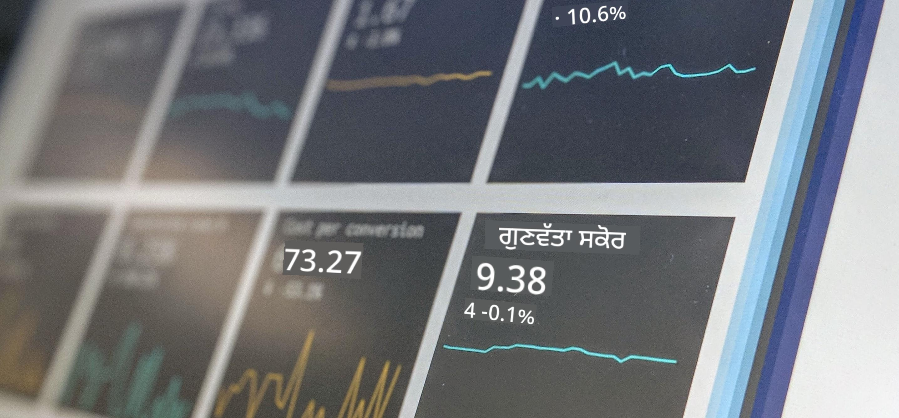

<!--
CO_OP_TRANSLATOR_METADATA:
{
  "original_hash": "696a8474a01054281704cbfb09148949",
  "translation_date": "2025-08-27T17:02:23+00:00",
  "source_file": "1-Introduction/README.md",
  "language_code": "pa"
}
-->
# ਡਾਟਾ ਸਾਇੰਸ ਦਾ ਪਰਿਚਯ

> ਫੋਟੋ <a href="https://unsplash.com/@dawson2406?utm_source=unsplash&utm_medium=referral&utm_content=creditCopyText">ਸਟੀਫਨ ਡਾਸਨ</a> ਦੁਆਰਾ <a href="https://unsplash.com/s/photos/data?utm_source=unsplash&utm_medium=referral&utm_content=creditCopyText">ਅਨਸਪਲੈਸ਼</a> 'ਤੇ
  
ਇਨ੍ਹਾਂ ਪਾਠਾਂ ਵਿੱਚ, ਤੁਸੀਂ ਜਾਣੋਗੇ ਕਿ ਡਾਟਾ ਸਾਇੰਸ ਨੂੰ ਕਿਵੇਂ ਪਰਿਭਾਸ਼ਿਤ ਕੀਤਾ ਜਾਂਦਾ ਹੈ ਅਤੇ ਉਹ ਨੈਤਿਕ ਵਿਚਾਰ ਜੋ ਇੱਕ ਡਾਟਾ ਸਾਇੰਟਿਸਟ ਨੂੰ ਧਿਆਨ ਵਿੱਚ ਰੱਖਣੇ ਚਾਹੀਦੇ ਹਨ। ਤੁਸੀਂ ਇਹ ਵੀ ਸਿੱਖੋਗੇ ਕਿ ਡਾਟਾ ਨੂੰ ਕਿਵੇਂ ਪਰਿਭਾਸ਼ਿਤ ਕੀਤਾ ਜਾਂਦਾ ਹੈ ਅਤੇ ਅੰਕੜੇ ਅਤੇ ਸੰਭਾਵਨਾ ਬਾਰੇ ਕੁਝ ਜਾਣਕਾਰੀ ਪ੍ਰਾਪਤ ਕਰੋਗੇ, ਜੋ ਕਿ ਡਾਟਾ ਸਾਇੰਸ ਦੇ ਮੁੱਖ ਅਕਾਦਮਿਕ ਖੇਤਰ ਹਨ।

### ਵਿਸ਼ੇ

1. [ਡਾਟਾ ਸਾਇੰਸ ਦੀ ਪਰਿਭਾਸ਼ਾ](01-defining-data-science/README.md)
2. [ਡਾਟਾ ਸਾਇੰਸ ਦੀ ਨੈਤਿਕਤਾ](02-ethics/README.md)
3. [ਡਾਟਾ ਦੀ ਪਰਿਭਾਸ਼ਾ](03-defining-data/README.md)
4. [ਅੰਕੜੇ ਅਤੇ ਸੰਭਾਵਨਾ ਦਾ ਪਰਿਚਯ](04-stats-and-probability/README.md)

### ਸ਼੍ਰੇਯ

ਇਹ ਪਾਠ ❤️ ਨਾਲ [ਨਿਤਿਆ ਨਰਸਿੰਮਨ](https://twitter.com/nitya) ਅਤੇ [ਦਿਮਿਤਰੀ ਸੋਸ਼ਨਿਕੋਵ](https://twitter.com/shwars) ਦੁਆਰਾ ਲਿਖੇ ਗਏ ਹਨ।

---

**ਅਸਵੀਕਾਰਨਾ**:  
ਇਹ ਦਸਤਾਵੇਜ਼ AI ਅਨੁਵਾਦ ਸੇਵਾ [Co-op Translator](https://github.com/Azure/co-op-translator) ਦੀ ਵਰਤੋਂ ਕਰਕੇ ਅਨੁਵਾਦ ਕੀਤਾ ਗਿਆ ਹੈ। ਜਦੋਂ ਕਿ ਅਸੀਂ ਸਹੀਤਾ ਲਈ ਯਤਨਸ਼ੀਲ ਹਾਂ, ਕਿਰਪਾ ਕਰਕੇ ਧਿਆਨ ਦਿਓ ਕਿ ਸਵੈਚਾਲਿਤ ਅਨੁਵਾਦਾਂ ਵਿੱਚ ਗਲਤੀਆਂ ਜਾਂ ਅਸੁਚੀਤਤਾਵਾਂ ਹੋ ਸਕਦੀਆਂ ਹਨ। ਮੂਲ ਦਸਤਾਵੇਜ਼ ਨੂੰ ਇਸਦੀ ਮੂਲ ਭਾਸ਼ਾ ਵਿੱਚ ਅਧਿਕਾਰਤ ਸਰੋਤ ਮੰਨਿਆ ਜਾਣਾ ਚਾਹੀਦਾ ਹੈ। ਮਹੱਤਵਪੂਰਨ ਜਾਣਕਾਰੀ ਲਈ, ਪੇਸ਼ੇਵਰ ਮਨੁੱਖੀ ਅਨੁਵਾਦ ਦੀ ਸਿਫਾਰਸ਼ ਕੀਤੀ ਜਾਂਦੀ ਹੈ। ਇਸ ਅਨੁਵਾਦ ਦੀ ਵਰਤੋਂ ਤੋਂ ਪੈਦਾ ਹੋਣ ਵਾਲੇ ਕਿਸੇ ਵੀ ਗਲਤਫਹਿਮੀ ਜਾਂ ਗਲਤ ਵਿਆਖਿਆ ਲਈ ਅਸੀਂ ਜ਼ਿੰਮੇਵਾਰ ਨਹੀਂ ਹਾਂ।