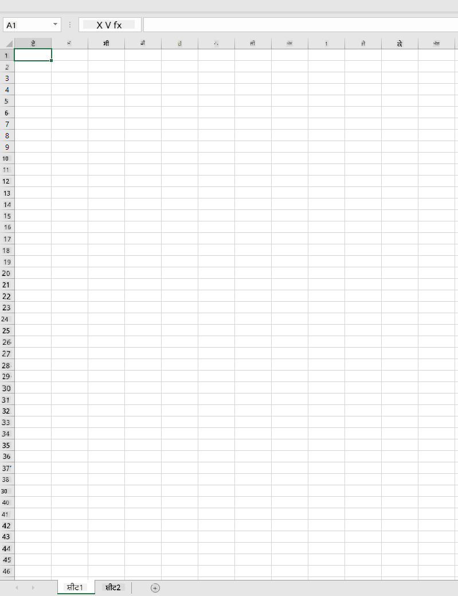
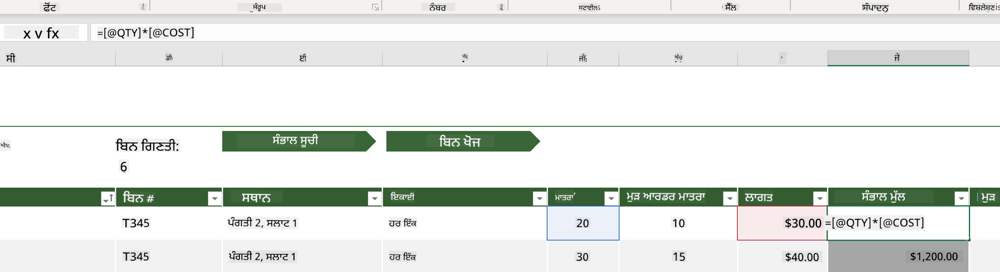
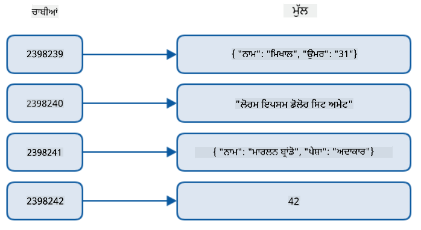
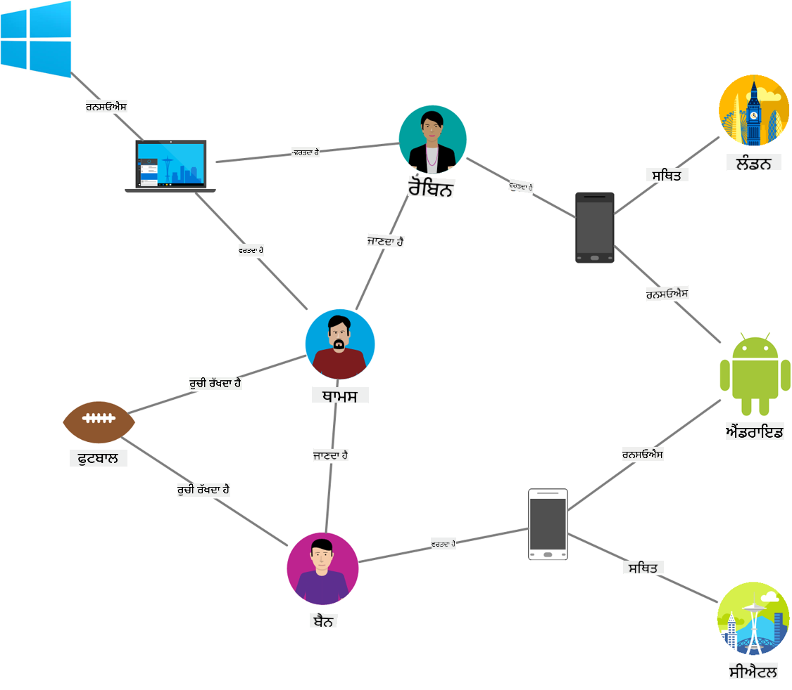
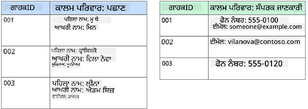
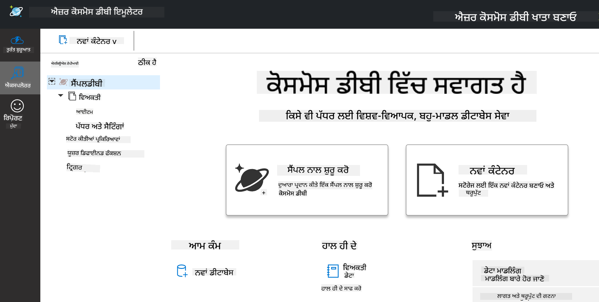
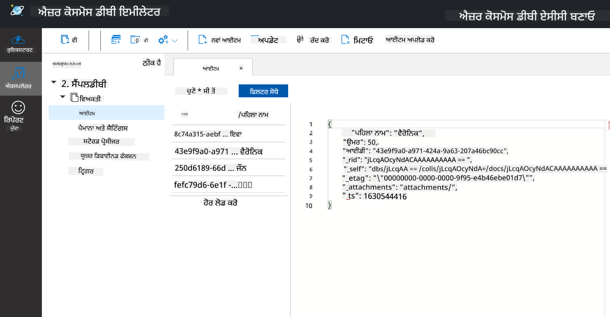
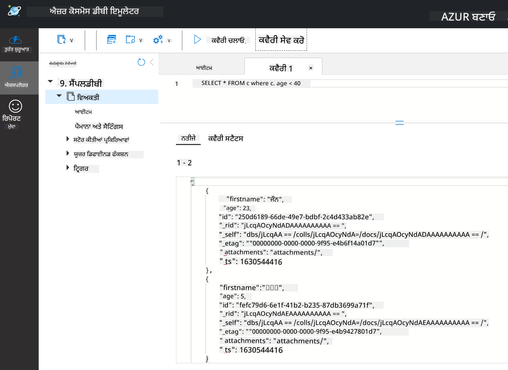

<!--
CO_OP_TRANSLATOR_METADATA:
{
  "original_hash": "32ddfef8121650f2ca2f3416fd283c37",
  "translation_date": "2025-08-27T16:59:01+00:00",
  "source_file": "2-Working-With-Data/06-non-relational/README.md",
  "language_code": "pa"
}
-->
# ਡਾਟਾ ਨਾਲ ਕੰਮ ਕਰਨਾ: ਗੈਰ-ਰਿਲੇਸ਼ਨਲ ਡਾਟਾ

| ਦੁਆਰਾ ਬਣਾਈ ਗਈ ਸਕੈਚਨੋਟ ](../../sketchnotes/06-NoSQL.png)|
|:---:|
|ਗੈਰ-ਰਿਲੇਸ਼ਨਲ ਡਾਟਾ ਨਾਲ ਕੰਮ ਕਰਨਾ - _[@nitya](https://twitter.com/nitya) ਦੁਆਰਾ ਸਕੈਚਨੋਟ_ |

## [ਪ੍ਰੀ-ਲੈਕਚਰ ਕਵਿਜ਼](https://purple-hill-04aebfb03.1.azurestaticapps.net/quiz/10)

ਡਾਟਾ ਸਿਰਫ਼ ਰਿਲੇਸ਼ਨਲ ਡਾਟਾਬੇਸ ਤੱਕ ਸੀਮਿਤ ਨਹੀਂ ਹੈ। ਇਸ ਪਾਠ ਵਿੱਚ ਗੈਰ-ਰਿਲੇਸ਼ਨਲ ਡਾਟਾ ਤੇ ਧਿਆਨ ਦਿੱਤਾ ਜਾਵੇਗਾ ਅਤੇ ਇਹ ਸਪ੍ਰੈਡਸ਼ੀਟਸ ਅਤੇ NoSQL ਦੇ ਬੁਨਿਆਦੀ ਪੱਖਾਂ ਨੂੰ ਕਵਰ ਕਰੇਗਾ।

## ਸਪ੍ਰੈਡਸ਼ੀਟਸ

ਸਪ੍ਰੈਡਸ਼ੀਟਸ ਡਾਟਾ ਨੂੰ ਸਟੋਰ ਅਤੇ ਐਕਸਪਲੋਰ ਕਰਨ ਦਾ ਇੱਕ ਲੋਕਪ੍ਰਿਯ ਤਰੀਕਾ ਹੈ ਕਿਉਂਕਿ ਇਸਨੂੰ ਸੈਟਅੱਪ ਕਰਨ ਅਤੇ ਸ਼ੁਰੂ ਕਰਨ ਲਈ ਘੱਟ ਮਿਹਨਤ ਦੀ ਲੋੜ ਹੁੰਦੀ ਹੈ। ਇਸ ਪਾਠ ਵਿੱਚ ਤੁਸੀਂ ਸਪ੍ਰੈਡਸ਼ੀਟ ਦੇ ਬੁਨਿਆਦੀ ਹਿੱਸੇ, ਫਾਰਮੂਲੇ ਅਤੇ ਫੰਕਸ਼ਨ ਸਿੱਖੋਗੇ। ਉਦਾਹਰਣਾਂ ਨੂੰ ਮਾਈਕਰੋਸਾਫਟ ਐਕਸਲ ਨਾਲ ਦਰਸਾਇਆ ਜਾਵੇਗਾ, ਪਰ ਜ਼ਿਆਦਾਤਰ ਹਿੱਸਿਆਂ ਅਤੇ ਵਿਸ਼ਿਆਂ ਦੇ ਹੋਰ ਸਪ੍ਰੈਡਸ਼ੀਟ ਸੌਫਟਵੇਅਰ ਨਾਲ ਮਿਲਦੇ-ਜੁਲਦੇ ਨਾਮ ਅਤੇ ਕਦਮ ਹੋਣਗੇ।



ਇੱਕ ਸਪ੍ਰੈਡਸ਼ੀਟ ਇੱਕ ਫਾਈਲ ਹੁੰਦੀ ਹੈ ਜੋ ਕੰਪਿਊਟਰ, ਡਿਵਾਈਸ ਜਾਂ ਕਲਾਉਡ ਬੇਸਡ ਫਾਈਲ ਸਿਸਟਮ ਵਿੱਚ ਐਕਸੈਸ ਕੀਤੀ ਜਾ ਸਕਦੀ ਹੈ। ਸੌਫਟਵੇਅਰ ਬ੍ਰਾਊਜ਼ਰ ਬੇਸਡ ਹੋ ਸਕਦਾ ਹੈ ਜਾਂ ਇੱਕ ਐਪਲੀਕੇਸ਼ਨ ਜੋ ਕੰਪਿਊਟਰ 'ਤੇ ਇੰਸਟਾਲ ਕੀਤੀ ਜਾਂਦੀ ਹੈ ਜਾਂ ਐਪ ਦੇ ਰੂਪ ਵਿੱਚ ਡਾਊਨਲੋਡ ਕੀਤੀ ਜਾਂਦੀ ਹੈ। ਐਕਸਲ ਵਿੱਚ ਇਹ ਫਾਈਲਾਂ **ਵਰਕਬੁੱਕਸ** ਵਜੋਂ ਪਰਿਭਾਸ਼ਿਤ ਕੀਤੀਆਂ ਜਾਂਦੀਆਂ ਹਨ ਅਤੇ ਇਸ ਪਾਠ ਦੇ ਬਾਕੀ ਹਿੱਸੇ ਵਿੱਚ ਇਹ ਟਰਮੀਨੋਲੋਜੀ ਵਰਤੀ ਜਾਵੇਗੀ।

ਇੱਕ ਵਰਕਬੁੱਕ ਵਿੱਚ ਇੱਕ ਜਾਂ ਇੱਕ ਤੋਂ ਵੱਧ **ਵਰਕਸ਼ੀਟਸ** ਹੁੰਦੀਆਂ ਹਨ, ਜਿੱਥੇ ਹਰ ਵਰਕਸ਼ੀਟ ਟੈਬਾਂ ਦੁਆਰਾ ਲੇਬਲ ਕੀਤੀ ਜਾਂਦੀ ਹੈ। ਇੱਕ ਵਰਕਸ਼ੀਟ ਦੇ ਅੰਦਰ ਚੌਰਸਾਕਾਰ **ਸੈਲਸ** ਹੁੰਦੇ ਹਨ, ਜਿਹਨਾਂ ਵਿੱਚ ਅਸਲ ਡਾਟਾ ਹੁੰਦਾ ਹੈ। ਇੱਕ ਸੈਲ ਕਤਾਰ ਅਤੇ ਕਾਲਮ ਦੇ ਚੌਰਾਹੇ 'ਤੇ ਹੁੰਦਾ ਹੈ, ਜਿੱਥੇ ਕਾਲਮਾਂ ਨੂੰ ਅੱਖਰਾਂ ਨਾਲ ਲੇਬਲ ਕੀਤਾ ਜਾਂਦਾ ਹੈ ਅਤੇ ਕਤਾਰਾਂ ਨੂੰ ਅੰਕਾਂ ਨਾਲ। ਕੁਝ ਸਪ੍ਰੈਡਸ਼ੀਟਸ ਵਿੱਚ ਪਹਿਲੀਆਂ ਕੁਝ ਕਤਾਰਾਂ ਵਿੱਚ ਹੈਡਰ ਹੁੰਦੇ ਹਨ ਜੋ ਸੈਲ ਵਿੱਚ ਡਾਟਾ ਦਾ ਵਰਣਨ ਕਰਦੇ ਹਨ।

ਐਕਸਲ ਵਰਕਬੁੱਕ ਦੇ ਇਹ ਬੁਨਿਆਦੀ ਤੱਤਾਂ ਵਰਤਦੇ ਹੋਏ, ਅਸੀਂ [ਮਾਈਕਰੋਸਾਫਟ ਟੈਂਪਲੇਟਸ](https://templates.office.com/) ਤੋਂ ਇੱਕ ਇਨਵੈਂਟਰੀ 'ਤੇ ਕੇਂਦਰਿਤ ਉਦਾਹਰਣ ਵਰਤਾਂਗੇ ਤਾਂ ਜੋ ਸਪ੍ਰੈਡਸ਼ੀਟ ਦੇ ਕੁਝ ਹੋਰ ਹਿੱਸਿਆਂ ਨੂੰ ਸਮਝਾਇਆ ਜਾ ਸਕੇ।

### ਇਨਵੈਂਟਰੀ ਦਾ ਪ੍ਰਬੰਧਨ

"InventoryExample" ਨਾਮਕ ਸਪ੍ਰੈਡਸ਼ੀਟ ਫਾਈਲ ਇੱਕ ਫਾਰਮੈਟ ਕੀਤੀ ਗਈ ਸਪ੍ਰੈਡਸ਼ੀਟ ਹੈ ਜੋ ਇਨਵੈਂਟਰੀ ਵਿੱਚ ਆਈਟਮਾਂ ਦੀ ਜਾਣਕਾਰੀ ਰੱਖਦੀ ਹੈ। ਇਸ ਵਿੱਚ ਤਿੰਨ ਵਰਕਸ਼ੀਟਸ ਹਨ, ਜਿਨ੍ਹਾਂ ਦੇ ਟੈਬ "Inventory List", "Inventory Pick List" ਅਤੇ "Bin Lookup" ਨਾਲ ਲੇਬਲ ਕੀਤੇ ਗਏ ਹਨ। Inventory List ਵਰਕਸ਼ੀਟ ਦੀ ਕਤਾਰ 4 ਹੈਡਰ ਹੈ, ਜੋ ਹੈਡਰ ਕਾਲਮ ਵਿੱਚ ਹਰ ਸੈਲ ਦੀ ਕੀਮਤ ਦਾ ਵਰਣਨ ਕਰਦੀ ਹੈ।



ਕਈ ਵਾਰ ਇੱਕ ਸੈਲ ਦੀ ਕੀਮਤ ਹੋਰ ਸੈਲਾਂ ਦੀਆਂ ਕੀਮਤਾਂ 'ਤੇ ਨਿਰਭਰ ਕਰਦੀ ਹੈ। Inventory List ਸਪ੍ਰੈਡਸ਼ੀਟ ਇਨਵੈਂਟਰੀ ਵਿੱਚ ਹਰ ਆਈਟਮ ਦੀ ਲਾਗਤ ਨੂੰ ਟਰੈਕ ਕਰਦੀ ਹੈ, ਪਰ ਜੇ ਸਾਨੂੰ ਪੂਰੀ ਇਨਵੈਂਟਰੀ ਦੀ ਕੁੱਲ ਕੀਮਤ ਪਤਾ ਲਗਾਉਣੀ ਹੋਵੇ? [**ਫਾਰਮੂਲੇ**](https://support.microsoft.com/en-us/office/overview-of-formulas-34519a4e-1e8d-4f4b-84d4-d642c4f63263) ਸੈਲ ਡਾਟਾ 'ਤੇ ਕਾਰਵਾਈ ਕਰਦੇ ਹਨ ਅਤੇ ਇਸ ਉਦਾਹਰਣ ਵਿੱਚ ਇਨਵੈਂਟਰੀ ਦੀ ਲਾਗਤ ਦੀ ਗਣਨਾ ਕਰਨ ਲਈ ਵਰਤੇ ਜਾਂਦੇ ਹਨ। ਇਸ ਸਪ੍ਰੈਡਸ਼ੀਟ ਨੇ Inventory Value ਕਾਲਮ ਵਿੱਚ ਇੱਕ ਫਾਰਮੂਲਾ ਵਰਤਿਆ ਹੈ ਜੋ QTY ਹੈਡਰ ਦੇ ਹੇਠਾਂ ਮਾਤਰਾ ਅਤੇ COST ਹੈਡਰ ਦੇ ਹੇਠਾਂ ਲਾਗਤ ਨੂੰ ਗੁਣਾ ਕਰਕੇ ਹਰ ਆਈਟਮ ਦੀ ਕੀਮਤ ਦੀ ਗਣਨਾ ਕਰਦਾ ਹੈ। ਇੱਕ ਸੈਲ ਨੂੰ ਡਬਲ ਕਲਿੱਕ ਕਰਨਾ ਜਾਂ ਹਾਈਲਾਈਟ ਕਰਨਾ ਫਾਰਮੂਲਾ ਦਿਖਾਵੇਗਾ। ਤੁਸੀਂ ਨੋਟਿਸ ਕਰੋਗੇ ਕਿ ਫਾਰਮੂਲੇ ਇੱਕ ਬਰਾਬਰ ਦੇ ਨਿਸ਼ਾਨ ਨਾਲ ਸ਼ੁਰੂ ਹੁੰਦੇ ਹਨ, ਜਿਸ ਤੋਂ ਬਾਅਦ ਗਣਨਾ ਜਾਂ ਕਾਰਵਾਈ ਹੁੰਦੀ ਹੈ।


ਅਸੀਂ ਇਨਵੈਂਟਰੀ ਵੈਲਯੂ ਦੀਆਂ ਸਾਰੀਆਂ ਕੀਮਤਾਂ ਨੂੰ ਜੋੜ ਕੇ ਇਸ ਦੀ ਕੁੱਲ ਕੀਮਤ ਪ੍ਰਾਪਤ ਕਰਨ ਲਈ ਇੱਕ ਹੋਰ ਫਾਰਮੂਲਾ ਵਰਤ ਸਕਦੇ ਹਾਂ। ਇਹ ਹਰ ਸੈਲ ਨੂੰ ਜੋੜ ਕੇ ਗਣਨਾ ਕੀਤੀ ਜਾ ਸਕਦੀ ਹੈ, ਪਰ ਇਹ ਇੱਕ ਥਕਾਵਟ ਭਰਿਆ ਕੰਮ ਹੋ ਸਕਦਾ ਹੈ। ਐਕਸਲ ਵਿੱਚ [**ਫੰਕਸ਼ਨਸ**](https://support.microsoft.com/en-us/office/sum-function-043e1c7d-7726-4e80-8f32-07b23e057f89) ਹੁੰਦੇ ਹਨ, ਜਿਹੜੇ ਸੈਲ ਦੀਆਂ ਕੀਮਤਾਂ 'ਤੇ ਗਣਨਾਵਾਂ ਕਰਨ ਲਈ ਪੂਰਵ-ਪਰਿਭਾਸ਼ਿਤ ਫਾਰਮੂਲੇ ਹਨ। ਫੰਕਸ਼ਨਸ ਨੂੰ ਆਰਗੂਮੈਂਟਸ ਦੀ ਲੋੜ ਹੁੰਦੀ ਹੈ, ਜੋ ਕਿ ਇਹ ਗਣਨਾਵਾਂ ਕਰਨ ਲਈ ਲੋੜੀਂਦੇ ਮੁੱਲ ਹੁੰਦੇ ਹਨ। ਜਦੋਂ ਫੰਕਸ਼ਨਸ ਨੂੰ ਇੱਕ ਤੋਂ ਵੱਧ ਆਰਗੂਮੈਂਟ ਦੀ ਲੋੜ ਹੁੰਦੀ ਹੈ, ਤਾਂ ਉਹਨਾਂ ਨੂੰ ਇੱਕ ਖਾਸ ਕ੍ਰਮ ਵਿੱਚ ਲਿਸਟ ਕੀਤਾ ਜਾਣਾ ਚਾਹੀਦਾ ਹੈ ਨਹੀਂ ਤਾਂ ਫੰਕਸ਼ਨ ਸਹੀ ਕੀਮਤ ਦੀ ਗਣਨਾ ਨਹੀਂ ਕਰ ਸਕਦਾ। ਇਸ ਉਦਾਹਰਣ ਵਿੱਚ SUM ਫੰਕਸ਼ਨ ਵਰਤਿਆ ਗਿਆ ਹੈ, ਅਤੇ Inventory Value ਦੀਆਂ ਕੀਮਤਾਂ ਨੂੰ ਆਰਗੂਮੈਂਟ ਵਜੋਂ ਵਰਤਿਆ ਗਿਆ ਹੈ ਤਾਂ ਜੋ ਕੁੱਲ ਕੀਮਤ B3 (ਕਤਾਰ 3, ਕਾਲਮ B) ਵਿੱਚ ਦਰਸਾਈ ਜਾ ਸਕੇ।

## NoSQL

NoSQL ਇੱਕ ਛਤਰੀ ਸ਼ਬਦ ਹੈ ਜੋ ਗੈਰ-ਰਿਲੇਸ਼ਨਲ ਡਾਟਾ ਨੂੰ ਸਟੋਰ ਕਰਨ ਦੇ ਵੱਖ-ਵੱਖ ਤਰੀਕਿਆਂ ਲਈ ਵਰਤਿਆ ਜਾਂਦਾ ਹੈ। ਇਸਨੂੰ "non-SQL", "non-relational" ਜਾਂ "not only SQL" ਵਜੋਂ ਸਮਝਿਆ ਜਾ ਸਕਦਾ ਹੈ। ਇਸ ਤਰ੍ਹਾਂ ਦੇ ਡਾਟਾਬੇਸ ਸਿਸਟਮਾਂ ਨੂੰ 4 ਕਿਸਮਾਂ ਵਿੱਚ ਵੰਡਿਆ ਜਾ ਸਕਦਾ ਹੈ।


> ਸਰੋਤ: [Michał Białecki Blog](https://www.michalbialecki.com/2018/03/18/azure-cosmos-db-key-value-database-cloud/)

[ਕੀ-ਵੈਲਯੂ](https://docs.microsoft.com/en-us/azure/architecture/data-guide/big-data/non-relational-data#keyvalue-data-stores) ਡਾਟਾਬੇਸ ਵਿਲੱਖਣ ਕੀਜ਼ ਨੂੰ ਜੋੜਦੇ ਹਨ, ਜੋ ਕਿ ਇੱਕ ਵਿਲੱਖਣ ਪਛਾਣਕਰਤਾ ਹੁੰਦਾ ਹੈ ਜੋ ਇੱਕ ਕੀਮਤ ਨਾਲ ਜੁੜਿਆ ਹੁੰਦਾ ਹੈ। ਇਹ ਜੋੜੇ ਇੱਕ [ਹੈਸ਼ ਟੇਬਲ](https://www.hackerearth.com/practice/data-structures/hash-tables/basics-of-hash-tables/tutorial/) ਦੀ ਵਰਤੋਂ ਕਰਕੇ ਸਟੋਰ ਕੀਤੇ ਜਾਂਦੇ ਹਨ ਜਿਸ ਵਿੱਚ ਇੱਕ ਉਚਿਤ ਹੈਸ਼ਿੰਗ ਫੰਕਸ਼ਨ ਹੁੰਦਾ ਹੈ।


> ਸਰੋਤ: [Microsoft](https://docs.microsoft.com/en-us/azure/cosmos-db/graph/graph-introduction#graph-database-by-example)

[ਗ੍ਰਾਫ](https://docs.microsoft.com/en-us/azure/architecture/data-guide/big-data/non-relational-data#graph-data-stores) ਡਾਟਾਬੇਸ ਡਾਟਾ ਵਿੱਚ ਰਿਸ਼ਤਿਆਂ ਦਾ ਵਰਣਨ ਕਰਦੇ ਹਨ ਅਤੇ ਇਹ ਨੋਡਸ ਅਤੇ ਐਜਜ਼ ਦੇ ਸੰਗ੍ਰਹਿ ਵਜੋਂ ਦਰਸਾਏ ਜਾਂਦੇ ਹਨ। ਇੱਕ ਨੋਡ ਇੱਕ ਇਕਾਈ ਦਾ ਪ੍ਰਤੀਨਿਧਿਤਾ ਕਰਦਾ ਹੈ, ਜਿਵੇਂ ਕਿ ਇੱਕ ਵਿਦਿਆਰਥੀ ਜਾਂ ਬੈਂਕ ਸਟੇਟਮੈਂਟ। ਐਜਜ਼ ਦੋ ਇਕਾਈਆਂ ਦੇ ਰਿਸ਼ਤੇ ਨੂੰ ਦਰਸਾਉਂਦੇ ਹਨ। ਹਰ ਨੋਡ ਅਤੇ ਐਜ ਦੇ ਗੁਣ ਹੁੰਦੇ ਹਨ ਜੋ ਹਰ ਨੋਡ ਅਤੇ ਐਜ ਬਾਰੇ ਵਾਧੂ ਜਾਣਕਾਰੀ ਪ੍ਰਦਾਨ ਕਰਦੇ ਹਨ।



[ਕਾਲਮਰ](https://docs.microsoft.com/en-us/azure/architecture/data-guide/big-data/non-relational-data#columnar-data-stores) ਡਾਟਾ ਸਟੋਰ ਡਾਟਾ ਨੂੰ ਕਾਲਮਾਂ ਅਤੇ ਕਤਾਰਾਂ ਵਿੱਚ ਸੰਗਠਿਤ ਕਰਦੇ ਹਨ, ਜਿਵੇਂ ਕਿ ਇੱਕ ਰਿਲੇਸ਼ਨਲ ਡਾਟਾ ਸਟ੍ਰਕਚਰ, ਪਰ ਹਰ ਕਾਲਮ ਨੂੰ ਕਾਲਮ ਪਰਿਵਾਰਾਂ ਵਿੱਚ ਵੰਡਿਆ ਜਾਂਦਾ ਹੈ। 

### ਡਾਕੂਮੈਂਟ ਡਾਟਾ ਸਟੋਰਜ਼ ਨਾਲ Azure Cosmos DB

[ਡਾਕੂਮੈਂਟ](https://docs.microsoft.com/en-us/azure/architecture/data-guide/big-data/non-relational-data#document-data-stores) ਡਾਟਾ ਸਟੋਰਜ਼ ਕੀ-ਵੈਲਯੂ ਡਾਟਾ ਸਟੋਰ ਦੇ ਸੰਕਲਪ 'ਤੇ ਅਧਾਰਿਤ ਹੁੰਦੇ ਹਨ ਅਤੇ ਖੇਤਰਾਂ ਅਤੇ ਵਸਤੂਆਂ ਦੀ ਇੱਕ ਲੜੀ ਤੋਂ ਬਣੇ ਹੁੰਦੇ ਹਨ। 

Cosmos DB ਡਾਟਾਬੇਸ "Not Only SQL" ਦੀ ਪਰਿਭਾਸ਼ਾ 'ਤੇ ਖਰਾ ਉਤਰਦਾ ਹੈ। Cosmos DB ਦਾ ਡਾਕੂਮੈਂਟ ਡਾਟਾਬੇਸ SQL 'ਤੇ ਨਿਰਭਰ ਕਰਦਾ ਹੈ। [ਪਿਛਲੇ ਪਾਠ](../05-relational-databases/README.md) ਵਿੱਚ SQL ਦੀਆਂ ਬੁਨਿਆਦੀਆਂ ਨੂੰ ਕਵਰ ਕੀਤਾ ਗਿਆ ਹੈ। Cosmos DB Emulator ਦੀ ਵਰਤੋਂ ਕਰਕੇ ਅਸੀਂ ਡਾਕੂਮੈਂਟ ਡਾਟਾਬੇਸ ਨੂੰ ਸਥਾਨਕ ਤੌਰ 'ਤੇ ਐਕਸਪਲੋਰ ਕਰ ਸਕਦੇ ਹਾਂ। Emulator ਬਾਰੇ ਹੋਰ ਪੜ੍ਹੋ [ਇੱਥੇ](https://docs.microsoft.com/en-us/azure/cosmos-db/local-emulator?tabs=ssl-netstd21)।

ਇੱਕ ਡਾਕੂਮੈਂਟ ਖੇਤਰਾਂ ਅਤੇ ਵਸਤੂਆਂ ਦੀ ਇੱਕ ਲੜੀ ਹੈ। ਹੇਠਾਂ ਇੱਕ ਡਾਕੂਮੈਂਟ ਦਾ ਉਦਾਹਰਣ ਦਿੱਤਾ ਗਿਆ ਹੈ।

```json
{
    "firstname": "Eva",
    "age": 44,
    "id": "8c74a315-aebf-4a16-bb38-2430a9896ce5",
    "_rid": "bHwDAPQz8s0BAAAAAAAAAA==",
    "_self": "dbs/bHwDAA==/colls/bHwDAPQz8s0=/docs/bHwDAPQz8s0BAAAAAAAAAA==/",
    "_etag": "\"00000000-0000-0000-9f95-010a691e01d7\"",
    "_attachments": "attachments/",
    "_ts": 1630544034
}
```

ਇਸ ਡਾਕੂਮੈਂਟ ਵਿੱਚ ਦਿਲਚਸਪੀ ਦੇ ਖੇਤਰ ਹਨ: `firstname`, `id`, ਅਤੇ `age`। Cosmos DB ਦੁਆਰਾ ਜਨਰੇਟ ਕੀਤੇ ਹੋਰ ਖੇਤਰ `_` ਨਾਲ ਸ਼ੁਰੂ ਹੁੰਦੇ ਹਨ।

#### Cosmos DB Emulator ਨਾਲ ਡਾਟਾ ਦੀ ਖੋਜ

ਤੁਸੀਂ Emulator ਨੂੰ [Windows ਲਈ ਇੱਥੇ](https://aka.ms/cosmosdb-emulator) ਡਾਊਨਲੋਡ ਅਤੇ ਇੰਸਟਾਲ ਕਰ ਸਕਦੇ ਹੋ। macOS ਅਤੇ Linux ਲਈ ਵਿਕਲਪਾਂ ਲਈ ਇਸ [ਡਾਕੂਮੈਂਟੇਸ਼ਨ](https://docs.microsoft.com/en-us/azure/cosmos-db/local-emulator?tabs=ssl-netstd21#run-on-linux-macos) ਨੂੰ ਵੇਖੋ।

Emulator ਇੱਕ ਬ੍ਰਾਊਜ਼ਰ ਵਿੰਡੋ ਲਾਂਚ ਕਰਦਾ ਹੈ, ਜਿੱਥੇ Explorer view ਤੁਹਾਨੂੰ ਡਾਕੂਮੈਂਟਸ ਦੀ ਖੋਜ ਕਰਨ ਦੀ ਆਗਿਆ ਦਿੰਦਾ ਹੈ।



ਜੇ ਤੁਸੀਂ ਅਨੁਸਰਣ ਕਰ ਰਹੇ ਹੋ, ਤਾਂ "Start with Sample" 'ਤੇ ਕਲਿੱਕ ਕਰੋ ਤਾਂ ਜੋ ਇੱਕ ਨਮੂਨਾ ਡਾਟਾਬੇਸ SampleDB ਬਣਾਇਆ ਜਾ ਸਕੇ। SampleDB ਨੂੰ ਵਧਾਉਣ ਲਈ ਤੀਰ 'ਤੇ ਕਲਿੱਕ ਕਰੋ, ਤੁਹਾਨੂੰ ਇੱਕ ਕੰਟੇਨਰ `Persons` ਮਿਲੇਗਾ। 



#### Cosmos DB Emulator ਨਾਲ ਡਾਕੂਮੈਂਟ ਡਾਟਾ ਦੀ ਕਵੈਰੀ ਕਰਨਾ

ਅਸੀਂ ਨਮੂਨਾ ਡਾਟਾ ਨੂੰ ਕਵੈਰੀ ਵੀ ਕਰ ਸਕਦੇ ਹਾਂ। 

`SELECT * FROM c` ਕੰਟੇਨਰ ਵਿੱਚ ਸਾਰੇ ਡਾਕੂਮੈਂਟਸ ਨੂੰ ਵਾਪਸ ਕਰਦਾ ਹੈ। ਚਲੋ ਇੱਕ where ਕਲੌਜ਼ ਸ਼ਾਮਲ ਕਰੀਏ ਅਤੇ ਉਹਨਾਂ ਨੂੰ ਲੱਭੀਏ ਜੋ 40 ਤੋਂ ਛੋਟੇ ਹਨ।

`SELECT * FROM c where c.age < 40`



ਕਵੈਰੀ ਦੋ ਡਾਕੂਮੈਂਟਸ ਵਾਪਸ ਕਰਦੀ ਹੈ। 

#### JSON ਅਤੇ ਡਾਕੂਮੈਂਟਸ

ਜੇ ਤੁਸੀਂ JavaScript Object Notation (JSON) ਨਾਲ ਜਾਣੂ ਹੋ, ਤਾਂ ਤੁਸੀਂ ਨੋਟਿਸ ਕਰੋਗੇ ਕਿ ਡਾਕੂਮੈਂਟਸ JSON ਵਰਗੇ ਲੱਗਦੇ ਹਨ। 

```json
{
    "created_at": "2021-08-31T19:03:01.000Z",
    "id": "1432780985872142341",
    "text": "Blank slate. Like this tweet if you’ve ever painted in Microsoft Paint before. https://t.co/cFeEs8eOPK",
    "_rid": "dhAmAIUsA4oHAAAAAAAAAA==",
    "_self": "dbs/dhAmAA==/colls/dhAmAIUsA4o=/docs/dhAmAIUsA4oHAAAAAAAAAA==/",
    "_etag": "\"00000000-0000-0000-9f84-a0958ad901d7\"",
    "_attachments": "attachments/",
    "_ts": 1630537000
```

ਇਸ ਡਾਕੂਮੈਂਟ ਵਿੱਚ ਦਿਲਚਸਪੀ ਦੇ ਖੇਤਰ ਹਨ: `created_at`, `id`, ਅਤੇ `text`।

## 🚀 ਚੁਣੌਤੀ

`TwitterData.json` ਫਾਈਲ ਨੂੰ SampleDB ਡਾਟਾਬੇਸ ਵਿੱਚ ਅਪਲੋਡ ਕਰੋ। 

1. ਨਵੇਂ ਕੰਟੇਨਰ ਬਟਨ 'ਤੇ ਕਲਿੱਕ ਕਰੋ
1. ਮੌਜੂਦਾ ਡਾਟਾਬੇਸ (SampleDB) ਚੁਣੋ
1. ਕੰਟੇਨਰ id ਬਣਾਓ
1. ਪਾਰਟੀਸ਼ਨ ਕੀ `/id` ਸੈਟ ਕਰੋ
1. OK 'ਤੇ ਕਲਿੱਕ ਕਰੋ

ਕੁਝ ਕਵੈਰੀਜ਼ ਚਲਾਉਣ ਦੀ ਕੋਸ਼ਿਸ਼ ਕਰੋ। 

## [ਪੋਸਟ-ਲੈਕਚਰ ਕਵਿਜ਼](https://purple-hill-04aebfb03.1.azurestaticapps.net/quiz/11)

## ਸਮੀਖਿਆ ਅਤੇ ਸਵੈ ਅਧਿਐਨ

- ਮਾਈਕਰੋਸਾਫਟ ਦੇ Excel ਲਈ [ਡਾਕੂਮੈਂਟੇਸ਼ਨ ਅਤੇ ਵੀਡੀਓਜ਼](https://support.microsoft.com/excel) ਦੀ ਵੱਡੀ ਲਾਇਬ੍ਰੇਰੀ ਹੈ। 
- [ਗੈਰ-ਰਿਲੇਸ਼ਨਲ ਡਾਟਾ ਅਤੇ NoSQL](https://docs.microsoft.com/en-us/azure/architecture/data-guide/big-data/non-relational-data) ਤੇ ਹੋਰ ਪੜ੍ਹੋ।
- Cosmos DB ਬਾਰੇ ਹੋਰ ਜਾਣੋ [ਇੱਥੇ](https://docs.microsoft.com

---

**ਅਸਵੀਕਤੀ**:  
ਇਹ ਦਸਤਾਵੇਜ਼ AI ਅਨੁਵਾਦ ਸੇਵਾ [Co-op Translator](https://github.com/Azure/co-op-translator) ਦੀ ਵਰਤੋਂ ਕਰਕੇ ਅਨੁਵਾਦ ਕੀਤਾ ਗਿਆ ਹੈ। ਜਦੋਂ ਕਿ ਅਸੀਂ ਸਹੀਤਾ ਲਈ ਯਤਨਸ਼ੀਲ ਹਾਂ, ਕਿਰਪਾ ਕਰਕੇ ਧਿਆਨ ਦਿਓ ਕਿ ਸਵੈਚਾਲਿਤ ਅਨੁਵਾਦਾਂ ਵਿੱਚ ਗਲਤੀਆਂ ਜਾਂ ਅਸੁਚਨਾਵਾਂ ਹੋ ਸਕਦੀਆਂ ਹਨ। ਇਸ ਦੀ ਮੂਲ ਭਾਸ਼ਾ ਵਿੱਚ ਮੌਜੂਦ ਅਸਲ ਦਸਤਾਵੇਜ਼ ਨੂੰ ਅਧਿਕਾਰਤ ਸਰੋਤ ਮੰਨਿਆ ਜਾਣਾ ਚਾਹੀਦਾ ਹੈ। ਮਹੱਤਵਪੂਰਨ ਜਾਣਕਾਰੀ ਲਈ, ਪੇਸ਼ੇਵਰ ਮਨੁੱਖੀ ਅਨੁਵਾਦ ਦੀ ਸਿਫਾਰਸ਼ ਕੀਤੀ ਜਾਂਦੀ ਹੈ। ਇਸ ਅਨੁਵਾਦ ਦੀ ਵਰਤੋਂ ਤੋਂ ਪੈਦਾ ਹੋਣ ਵਾਲੇ ਕਿਸੇ ਵੀ ਗਲਤਫਹਿਮੀ ਜਾਂ ਗਲਤ ਵਿਆਖਿਆ ਲਈ ਅਸੀਂ ਜ਼ਿੰਮੇਵਾਰ ਨਹੀਂ ਹਾਂ।