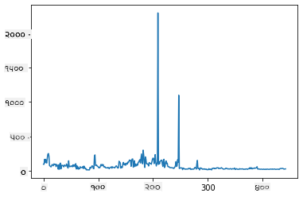
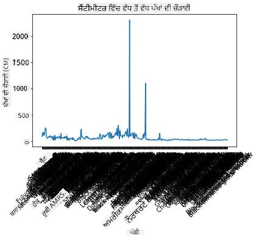
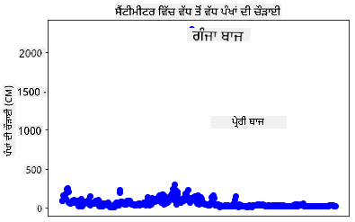
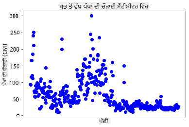
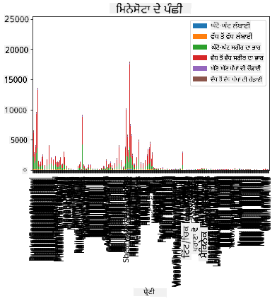
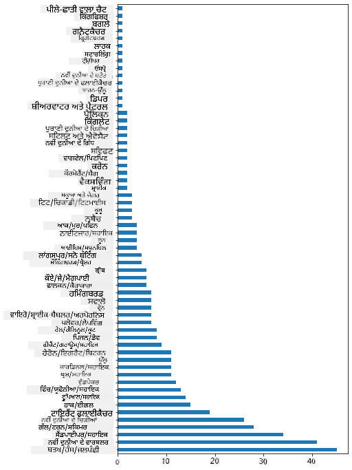
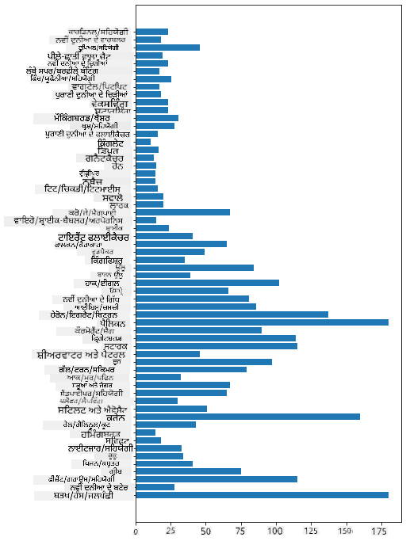
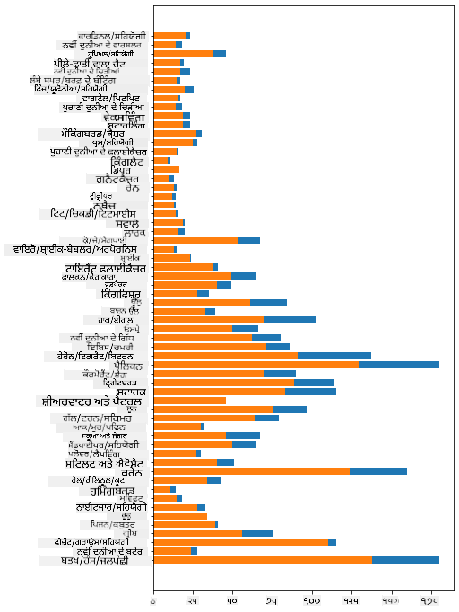

<!--
CO_OP_TRANSLATOR_METADATA:
{
  "original_hash": "43c402d9d90ae6da55d004519ada5033",
  "translation_date": "2025-08-27T18:40:45+00:00",
  "source_file": "3-Data-Visualization/09-visualization-quantities/README.md",
  "language_code": "pa"
}
-->
# ਮਾਤਰਾ ਨੂੰ ਦ੍ਰਿਸ਼ਮਾਨ ਕਰਨਾ

| ਦੁਆਰਾ ਬਣਾਈ ਗਈ ਸਕੈਚਨੋਟ ](../../sketchnotes/09-Visualizing-Quantities.png)|
|:---:|
| ਮਾਤਰਾ ਨੂੰ ਦ੍ਰਿਸ਼ਮਾਨ ਕਰਨਾ - _[@nitya](https://twitter.com/nitya) ਦੁਆਰਾ ਸਕੈਚਨੋਟ_ |

ਇਸ ਪਾਠ ਵਿੱਚ ਤੁਸੀਂ ਪਾਈਥਨ ਦੀਆਂ ਉਪਲਬਧ ਲਾਇਬ੍ਰੇਰੀਆਂ ਵਿੱਚੋਂ ਇੱਕ ਦੀ ਵਰਤੋਂ ਕਰਕੇ ਮਾਤਰਾ ਦੇ ਸੰਕਲਪ ਦੇ ਆਧਾਰ 'ਤੇ ਰੁਚਿਕਰ ਦ੍ਰਿਸ਼ਾਂ ਬਣਾਉਣ ਦੇ ਤਰੀਕੇ ਦੀ ਪੜਾਈ ਕਰੋਗੇ। ਮਿਨੇਸੋਟਾ ਦੇ ਪੰਛੀਆਂ ਬਾਰੇ ਸਾਫ ਕੀਤੇ ਗਏ ਡੇਟਾਸੈੱਟ ਦੀ ਵਰਤੋਂ ਕਰਕੇ, ਤੁਸੀਂ ਸਥਾਨਕ ਜੰਗਲੀ ਜੀਵਾਂ ਬਾਰੇ ਕਈ ਦਿਲਚਸਪ ਤੱਥ ਸਿੱਖ ਸਕਦੇ ਹੋ।  
## [ਪਾਠ-ਪੂਰਵ ਕਵਿਜ਼](https://purple-hill-04aebfb03.1.azurestaticapps.net/quiz/16)

## Matplotlib ਨਾਲ ਪੰਖਾਂ ਦੀ ਲੰਬਾਈ ਦਾ ਅਧਿਐਨ ਕਰੋ

ਸਧਾਰਣ ਅਤੇ ਜਟਿਲ ਦੋਹਾਂ ਕਿਸਮਾਂ ਦੇ ਪਲਾਟ ਅਤੇ ਚਾਰਟ ਬਣਾਉਣ ਲਈ ਇੱਕ ਸ਼ਾਨਦਾਰ ਲਾਇਬ੍ਰੇਰੀ ਹੈ [Matplotlib](https://matplotlib.org/stable/index.html)। ਆਮ ਤੌਰ 'ਤੇ, ਇਨ੍ਹਾਂ ਲਾਇਬ੍ਰੇਰੀਆਂ ਦੀ ਵਰਤੋਂ ਕਰਕੇ ਡੇਟਾ ਪਲਾਟ ਕਰਨ ਦੀ ਪ੍ਰਕਿਰਿਆ ਵਿੱਚ ਸ਼ਾਮਲ ਹੁੰਦਾ ਹੈ: ਆਪਣੇ ਡੇਟਾਫ੍ਰੇਮ ਦੇ ਉਹ ਹਿੱਸੇ ਪਛਾਣਨਾ ਜਿਨ੍ਹਾਂ ਨੂੰ ਤੁਸੀਂ ਨਿਸ਼ਾਨਾ ਬਣਾਉਣਾ ਚਾਹੁੰਦੇ ਹੋ, ਉਸ ਡੇਟਾ 'ਤੇ ਜ਼ਰੂਰੀ ਤਬਦੀਲੀਆਂ ਕਰਨਾ, ਇਸ ਦੇ x ਅਤੇ y ਧੁਰੇ ਦੀਆਂ ਮੁੱਲਾਂ ਨਿਰਧਾਰਤ ਕਰਨਾ, ਦਿਖਾਉਣ ਲਈ ਚਾਰਟ ਦੀ ਕਿਸਮ ਚੁਣਨਾ, ਅਤੇ ਫਿਰ ਪਲਾਟ ਦਿਖਾਉਣਾ। Matplotlib ਕਈ ਕਿਸਮ ਦੇ ਦ੍ਰਿਸ਼ਾਂ ਦੀ ਪੇਸ਼ਕਸ਼ ਕਰਦਾ ਹੈ, ਪਰ ਇਸ ਪਾਠ ਲਈ, ਆਓ ਉਹਨਾਂ 'ਤੇ ਧਿਆਨ ਕੇਂਦਰਿਤ ਕਰੀਏ ਜੋ ਮਾਤਰਾ ਨੂੰ ਦਿਖਾਉਣ ਲਈ ਸਭ ਤੋਂ ਉਚਿਤ ਹਨ: ਲਾਈਨ ਚਾਰਟ, ਸਕੈਟਰਪਲਾਟ, ਅਤੇ ਬਾਰ ਪਲਾਟ।

> ✅ ਆਪਣੇ ਡੇਟਾ ਦੀ ਬਣਤਰ ਅਤੇ ਕਹਾਣੀ ਨੂੰ ਦੱਸਣ ਲਈ ਸਭ ਤੋਂ ਵਧੀਆ ਚਾਰਟ ਦੀ ਵਰਤੋਂ ਕਰੋ।  
> - ਸਮੇਂ ਦੇ ਨਾਲ ਰੁਝਾਨਾਂ ਦਾ ਵਿਸ਼ਲੇਸ਼ਣ ਕਰਨ ਲਈ: ਲਾਈਨ  
> - ਮੁੱਲਾਂ ਦੀ ਤੁਲਨਾ ਕਰਨ ਲਈ: ਬਾਰ, ਕਾਲਮ, ਪਾਈ, ਸਕੈਟਰਪਲਾਟ  
> - ਦਿਖਾਉਣ ਲਈ ਕਿ ਹਿੱਸੇ ਪੂਰੇ ਨਾਲ ਕਿਵੇਂ ਸੰਬੰਧਿਤ ਹਨ: ਪਾਈ  
> - ਡੇਟਾ ਦੇ ਵੰਡਨ ਨੂੰ ਦਿਖਾਉਣ ਲਈ: ਸਕੈਟਰਪਲਾਟ, ਬਾਰ  
> - ਰੁਝਾਨ ਦਿਖਾਉਣ ਲਈ: ਲਾਈਨ, ਕਾਲਮ  
> - ਮੁੱਲਾਂ ਦੇ ਵਿਚਕਾਰ ਸੰਬੰਧ ਦਿਖਾਉਣ ਲਈ: ਲਾਈਨ, ਸਕੈਟਰਪਲਾਟ, ਬਬਲ  

ਜੇ ਤੁਹਾਡੇ ਕੋਲ ਡੇਟਾਸੈੱਟ ਹੈ ਅਤੇ ਤੁਹਾਨੂੰ ਪਤਾ ਲਗਾਉਣਾ ਹੈ ਕਿ ਕਿਸੇ ਦਿੱਤੇ ਗਏ ਆਈਟਮ ਦੀ ਮਾਤਰਾ ਕਿੰਨੀ ਹੈ, ਤਾਂ ਤੁਹਾਡਾ ਪਹਿਲਾ ਕੰਮ ਇਸ ਦੀਆਂ ਮੁੱਲਾਂ ਦੀ ਜਾਂਚ ਕਰਨਾ ਹੋਵੇਗਾ।  

✅ Matplotlib ਲਈ ਬਹੁਤ ਵਧੀਆ 'ਚੀਟ ਸ਼ੀਟ' [ਇੱਥੇ](https://matplotlib.org/cheatsheets/cheatsheets.pdf) ਉਪਲਬਧ ਹਨ।

## ਪੰਛੀਆਂ ਦੇ ਪੰਖਾਂ ਦੀ ਲੰਬਾਈ ਬਾਰੇ ਲਾਈਨ ਪਲਾਟ ਬਣਾਓ

ਪਾਠ ਫੋਲਡਰ ਦੇ ਰੂਟ ਵਿੱਚ `notebook.ipynb` ਫਾਈਲ ਖੋਲ੍ਹੋ ਅਤੇ ਇੱਕ ਸੈੱਲ ਸ਼ਾਮਲ ਕਰੋ।  

> ਨੋਟ: ਡੇਟਾ ਇਸ ਰਿਪੋਜ਼ਟਰੀ ਦੇ ਰੂਟ ਵਿੱਚ `/data` ਫੋਲਡਰ ਵਿੱਚ ਸਟੋਰ ਕੀਤਾ ਗਿਆ ਹੈ।  

```python
import pandas as pd
import matplotlib.pyplot as plt
birds = pd.read_csv('../../data/birds.csv')
birds.head()
```  
ਇਹ ਡੇਟਾ ਪਾਠ ਅਤੇ ਅੰਕਾਂ ਦਾ ਮਿਸ਼ਰਣ ਹੈ:  

|      | Name                         | ScientificName         | Category              | Order        | Family   | Genus       | ConservationStatus | MinLength | MaxLength | MinBodyMass | MaxBodyMass | MinWingspan | MaxWingspan |
| ---: | :--------------------------- | :--------------------- | :-------------------- | :----------- | :------- | :---------- | :----------------- | --------: | --------: | ----------: | ----------: | ----------: | ----------: |
|    0 | Black-bellied whistling-duck | Dendrocygna autumnalis | Ducks/Geese/Waterfowl | Anseriformes | Anatidae | Dendrocygna | LC                 |        47 |        56 |         652 |        1020 |          76 |          94 |
|    1 | Fulvous whistling-duck       | Dendrocygna bicolor    | Ducks/Geese/Waterfowl | Anseriformes | Anatidae | Dendrocygna | LC                 |        45 |        53 |         712 |        1050 |          85 |          93 |
|    2 | Snow goose                   | Anser caerulescens     | Ducks/Geese/Waterfowl | Anseriformes | Anatidae | Anser       | LC                 |        64 |        79 |        2050 |        4050 |         135 |         165 |
|    3 | Ross's goose                 | Anser rossii           | Ducks/Geese/Waterfowl | Anseriformes | Anatidae | Anser       | LC                 |      57.3 |        64 |        1066 |        1567 |         113 |         116 |
|    4 | Greater white-fronted goose  | Anser albifrons        | Ducks/Geese/Waterfowl | Anseriformes | Anatidae | Anser       | LC                 |        64 |        81 |        1930 |        3310 |         130 |         165 |

ਆਓ ਕੁਝ ਅੰਕਗਣਿਤ ਡੇਟਾ ਨੂੰ ਇੱਕ ਬੁਨਿਆਦੀ ਲਾਈਨ ਪਲਾਟ ਦੀ ਵਰਤੋਂ ਕਰਕੇ ਪਲਾਟ ਕਰੀਏ। ਮੰਨੋ ਤੁਸੀਂ ਇਨ੍ਹਾਂ ਦਿਲਚਸਪ ਪੰਛੀਆਂ ਲਈ ਵੱਧ ਤੋਂ ਵੱਧ ਪੰਖਾਂ ਦੀ ਲੰਬਾਈ ਦੇਖਣਾ ਚਾਹੁੰਦੇ ਹੋ।  

```python
wingspan = birds['MaxWingspan'] 
wingspan.plot()
```  
  

ਤੁਰੰਤ ਕੀ ਨਜ਼ਰ ਆਉਂਦਾ ਹੈ? ਘੱਟੋ-ਘੱਟ ਇੱਕ ਆਉਟਲਾਇਰ ਹੈ - ਇਹ ਕਾਫ਼ੀ ਪੰਖਾਂ ਦੀ ਲੰਬਾਈ ਹੈ! 2300 ਸੈਂਟੀਮੀਟਰ ਪੰਖਾਂ ਦੀ ਲੰਬਾਈ 23 ਮੀਟਰ ਦੇ ਬਰਾਬਰ ਹੈ - ਕੀ ਮਿਨੇਸੋਟਾ ਵਿੱਚ ਪਟੇਰੋਡੈਕਟਿਲ ਉੱਡ ਰਹੇ ਹਨ? ਆਓ ਜਾਂਚ ਕਰੀਏ।  

ਹਾਲਾਂਕਿ ਤੁਸੀਂ Excel ਵਿੱਚ ਇੱਕ ਤੇਜ਼ ਸੌਰਟ ਕਰਕੇ ਉਹ ਆਉਟਲਾਇਰ ਲੱਭ ਸਕਦੇ ਹੋ, ਜੋ ਸ਼ਾਇਦ ਟਾਈਪੋਜ਼ ਹਨ, ਪਲਾਟ ਦੇ ਅੰਦਰੋਂ ਦ੍ਰਿਸ਼ਾਂ ਦੀ ਪ੍ਰਕਿਰਿਆ ਜਾਰੀ ਰੱਖੋ।  

x-ਅਕਸ 'ਤੇ ਲੇਬਲ ਸ਼ਾਮਲ ਕਰੋ ਤਾਂ ਜੋ ਇਹ ਦਿਖਾਇਆ ਜਾ ਸਕੇ ਕਿ ਕਿਹੜੇ ਕਿਸਮ ਦੇ ਪੰਛੀ ਗੱਲ ਕਰ ਰਹੇ ਹਨ:  

```
plt.title('Max Wingspan in Centimeters')
plt.ylabel('Wingspan (CM)')
plt.xlabel('Birds')
plt.xticks(rotation=45)
x = birds['Name'] 
y = birds['MaxWingspan']

plt.plot(x, y)

plt.show()
```  
  

45 ਡਿਗਰੀ 'ਤੇ ਲੇਬਲਾਂ ਦੇ ਘੁੰਮਣ ਦੇ ਬਾਵਜੂਦ, ਇਹ ਪੜ੍ਹਨ ਲਈ ਬਹੁਤ ਜ਼ਿਆਦਾ ਹਨ। ਆਓ ਇੱਕ ਵੱਖਰਾ ਤਰੀਕਾ ਅਜ਼ਮਾਈਏ: ਸਿਰਫ ਉਹਨਾਂ ਆਉਟਲਾਇਰਾਂ ਨੂੰ ਲੇਬਲ ਕਰੋ ਅਤੇ ਚਾਰਟ ਦੇ ਅੰਦਰ ਲੇਬਲ ਸੈੱਟ ਕਰੋ। ਤੁਸੀਂ ਲੇਬਲਿੰਗ ਲਈ ਹੋਰ ਜਗ੍ਹਾ ਬਣਾਉਣ ਲਈ ਇੱਕ ਸਕੈਟਰ ਚਾਰਟ ਦੀ ਵਰਤੋਂ ਕਰ ਸਕਦੇ ਹੋ:  

```python
plt.title('Max Wingspan in Centimeters')
plt.ylabel('Wingspan (CM)')
plt.tick_params(axis='both',which='both',labelbottom=False,bottom=False)

for i in range(len(birds)):
    x = birds['Name'][i]
    y = birds['MaxWingspan'][i]
    plt.plot(x, y, 'bo')
    if birds['MaxWingspan'][i] > 500:
        plt.text(x, y * (1 - 0.05), birds['Name'][i], fontsize=12)
    
plt.show()
```  
ਇੱਥੇ ਕੀ ਹੋ ਰਿਹਾ ਹੈ? ਤੁਸੀਂ `tick_params` ਦੀ ਵਰਤੋਂ ਕਰਕੇ ਹੇਠਾਂ ਦੇ ਲੇਬਲਾਂ ਨੂੰ ਲੁਕਾਇਆ ਅਤੇ ਫਿਰ ਆਪਣੇ ਪੰਛੀਆਂ ਦੇ ਡੇਟਾਸੈੱਟ 'ਤੇ ਇੱਕ ਲੂਪ ਬਣਾਇਆ। `bo` ਦੀ ਵਰਤੋਂ ਕਰਕੇ ਛੋਟੇ ਨੀਲੇ ਗੋਲ ਡਾਟਾਂ ਨਾਲ ਚਾਰਟ ਪਲਾਟ ਕਰਦੇ ਹੋਏ, ਤੁਸੀਂ ਕਿਸੇ ਵੀ ਪੰਛੀ ਦੀ ਜਾਂਚ ਕੀਤੀ ਜਿਸ ਦੀ ਵੱਧ ਤੋਂ ਵੱਧ ਪੰਖਾਂ ਦੀ ਲੰਬਾਈ 500 ਤੋਂ ਵੱਧ ਸੀ ਅਤੇ ਜੇਕਰ ਹੋਵੇ ਤਾਂ ਡਾਟ ਦੇ ਕੋਲ ਉਸ ਦਾ ਲੇਬਲ ਦਿਖਾਇਆ। ਤੁਸੀਂ y-ਅਕਸ 'ਤੇ ਲੇਬਲਾਂ ਨੂੰ ਥੋੜ੍ਹਾ ਜਿਹਾ ਹਟਾਇਆ (`y * (1 - 0.05)`) ਅਤੇ ਪੰਛੀ ਦੇ ਨਾਮ ਨੂੰ ਲੇਬਲ ਵਜੋਂ ਵਰਤਿਆ।  

ਤੁਸੀਂ ਕੀ ਪਤਾ ਲਗਾਇਆ?  

  
## ਆਪਣੇ ਡੇਟਾ ਨੂੰ ਫਿਲਟਰ ਕਰੋ  

ਬਾਲਡ ਈਗਲ ਅਤੇ ਪ੍ਰੇਰੀ ਫਾਲਕਨ, ਹਾਲਾਂਕਿ ਸ਼ਾਇਦ ਬਹੁਤ ਵੱਡੇ ਪੰਛੀ ਹਨ, ਪਰ ਉਹ ਗਲਤ ਲੇਬਲ ਕੀਤੇ ਹੋਏ ਲੱਗਦੇ ਹਨ, ਉਨ੍ਹਾਂ ਦੀ ਵੱਧ ਤੋਂ ਵੱਧ ਪੰਖਾਂ ਦੀ ਲੰਬਾਈ ਵਿੱਚ ਇੱਕ ਵਾਧੂ `0` ਸ਼ਾਮਲ ਹੈ। ਇਹ ਸੰਭਾਵਨਾ ਘੱਟ ਹੈ ਕਿ ਤੁਸੀਂ 25 ਮੀਟਰ ਪੰਖਾਂ ਵਾਲੇ ਬਾਲਡ ਈਗਲ ਨੂੰ ਮਿਲੋਗੇ, ਪਰ ਜੇਕਰ ਮਿਲੇ, ਤਾਂ ਕਿਰਪਾ ਕਰਕੇ ਸਾਨੂੰ ਦੱਸੋ! ਆਓ ਇੱਕ ਨਵਾਂ ਡੇਟਾਫ੍ਰੇਮ ਬਣਾਈਏ ਜਿਸ ਵਿੱਚ ਉਹ ਦੋ ਆਉਟਲਾਇਰ ਸ਼ਾਮਲ ਨਾ ਹੋਣ:  

```python
plt.title('Max Wingspan in Centimeters')
plt.ylabel('Wingspan (CM)')
plt.xlabel('Birds')
plt.tick_params(axis='both',which='both',labelbottom=False,bottom=False)
for i in range(len(birds)):
    x = birds['Name'][i]
    y = birds['MaxWingspan'][i]
    if birds['Name'][i] not in ['Bald eagle', 'Prairie falcon']:
        plt.plot(x, y, 'bo')
plt.show()
```  

ਆਉਟਲਾਇਰਾਂ ਨੂੰ ਫਿਲਟਰ ਕਰਕੇ, ਹੁਣ ਤੁਹਾਡਾ ਡੇਟਾ ਹੋਰ ਸੰਗਠਿਤ ਅਤੇ ਸਮਝਣਯੋਗ ਹੈ।  

  

ਹੁਣ ਜਦੋਂ ਸਾਡੇ ਕੋਲ ਘੱਟੋ-ਘੱਟ ਪੰਖਾਂ ਦੀ ਲੰਬਾਈ ਦੇ ਹਿੱਸੇ ਵਿੱਚ ਇੱਕ ਸਾਫ਼ ਡੇਟਾਸੈੱਟ ਹੈ, ਆਓ ਇਹਨਾਂ ਪੰਛੀਆਂ ਬਾਰੇ ਹੋਰ ਪਤਾ ਲਗਾਈਏ।  

ਜਦੋਂ ਕਿ ਲਾਈਨ ਅਤੇ ਸਕੈਟਰ ਪਲਾਟ ਡੇਟਾ ਮੁੱਲਾਂ ਅਤੇ ਉਨ੍ਹਾਂ ਦੇ ਵੰਡਨ ਬਾਰੇ ਜਾਣਕਾਰੀ ਦਿਖਾ ਸਕਦੇ ਹਨ, ਅਸੀਂ ਇਸ ਡੇਟਾਸੈੱਟ ਵਿੱਚ ਮੌਜੂਦ ਮੁੱਲਾਂ ਬਾਰੇ ਸੋਚਣਾ ਚਾਹੁੰਦੇ ਹਾਂ। ਤੁਸੀਂ ਮਾਤਰਾ ਬਾਰੇ ਹੇਠਾਂ ਦਿੱਤੇ ਸਵਾਲਾਂ ਦੇ ਜਵਾਬ ਦੇਣ ਲਈ ਦ੍ਰਿਸ਼ਾਂ ਬਣਾਉਣ ਦੀ ਕੋਸ਼ਿਸ਼ ਕਰ ਸਕਦੇ ਹੋ:  

> ਪੰਛੀਆਂ ਦੀਆਂ ਕਿੰਨੀ ਸ਼੍ਰੇਣੀਆਂ ਹਨ, ਅਤੇ ਉਨ੍ਹਾਂ ਦੀ ਗਿਣਤੀ ਕੀ ਹੈ?  
> ਕਿੰਨੇ ਪੰਛੀ ਲੁਪਤ, ਖਤਰੇ ਵਿੱਚ, ਦੁਲਭ ਜਾਂ ਆਮ ਹਨ?  
> ਲਿਨੇਅਸ ਦੀ ਸ਼ਬਦਾਵਲੀ ਵਿੱਚ ਵੱਖ-ਵੱਖ ਜ਼ਨਸ ਅਤੇ ਆਰਡਰਾਂ ਦੀ ਗਿਣਤੀ ਕਿੰਨੀ ਹੈ?  
## ਬਾਰ ਚਾਰਟ ਦੀ ਪੜਚੋਲ ਕਰੋ  

ਜਦੋਂ ਤੁਹਾਨੂੰ ਡੇਟਾ ਦੇ ਸਮੂਹ ਦਿਖਾਉਣ ਦੀ ਲੋੜ ਹੁੰਦੀ ਹੈ, ਤਾਂ ਬਾਰ ਚਾਰਟ ਵਿਹਾਰਕ ਹੁੰਦੇ ਹਨ। ਆਓ ਇਸ ਡੇਟਾਸੈੱਟ ਵਿੱਚ ਮੌਜੂਦ ਪੰਛੀਆਂ ਦੀਆਂ ਸ਼੍ਰੇਣੀਆਂ ਦੀ ਪੜਚੋਲ ਕਰੀਏ ਤਾਂ ਜੋ ਵੇਖ ਸਕੀਏ ਕਿ ਕਿਹੜੀ ਸਭ ਤੋਂ ਆਮ ਹੈ।  

ਨੋਟਬੁੱਕ ਫਾਈਲ ਵਿੱਚ ਇੱਕ ਬੁਨਿਆਦੀ ਬਾਰ ਚਾਰਟ ਬਣਾਓ  

✅ ਨੋਟ, ਤੁਸੀਂ ਪਿਛਲੇ ਭਾਗ ਵਿੱਚ ਪਛਾਣੇ ਗਏ ਦੋ ਆਉਟਲਾਇਰ ਪੰਛੀਆਂ ਨੂੰ ਫਿਲਟਰ ਕਰ ਸਕਦੇ ਹੋ, ਉਨ੍ਹਾਂ ਦੀ ਪੰਖਾਂ ਦੀ ਲੰਬਾਈ ਵਿੱਚ ਟਾਈਪੋ ਨੂੰ ਸੋਧ ਸਕਦੇ ਹੋ, ਜਾਂ ਉਨ੍ਹਾਂ ਨੂੰ ਇਨ੍ਹਾਂ ਅਭਿਆਸਾਂ ਲਈ ਛੱਡ ਸਕਦੇ ਹੋ ਜੋ ਪੰਖਾਂ ਦੀ ਲੰਬਾਈ ਦੇ ਮੁੱਲਾਂ 'ਤੇ ਨਿਰਭਰ ਨਹੀਂ ਕਰਦੇ।  

ਜੇ ਤੁਸੀਂ ਇੱਕ ਬਾਰ ਚਾਰਟ ਬਣਾਉਣਾ ਚਾਹੁੰਦੇ ਹੋ, ਤਾਂ ਤੁਸੀਂ ਉਸ ਡੇਟਾ ਨੂੰ ਚੁਣ ਸਕਦੇ ਹੋ ਜਿਸ 'ਤੇ ਤੁਸੀਂ ਧਿਆਨ ਕੇਂਦਰਿਤ ਕਰਨਾ ਚਾਹੁੰਦੇ ਹੋ। ਬਾਰ ਚਾਰਟ ਕੱਚੇ ਡੇਟਾ ਤੋਂ ਬਣਾਏ ਜਾ ਸਕਦੇ ਹਨ:  

```python
birds.plot(x='Category',
        kind='bar',
        stacked=True,
        title='Birds of Minnesota')

```  
  

ਪਰ ਇਹ ਬਾਰ ਚਾਰਟ ਪੜ੍ਹਨ ਯੋਗ ਨਹੀਂ ਹੈ ਕਿਉਂਕਿ ਬਹੁਤ ਜ਼ਿਆਦਾ ਗੈਰ-ਸਮੂਹਬੱਧ ਡੇਟਾ ਹੈ। ਤੁਹਾਨੂੰ ਸਿਰਫ਼ ਉਸ ਡੇਟਾ ਨੂੰ ਚੁਣਨਾ ਚਾਹੀਦਾ ਹੈ ਜਿਸ ਨੂੰ ਤੁਸੀਂ ਪਲਾਟ ਕਰਨਾ ਚਾਹੁੰਦੇ ਹੋ, ਇਸ ਲਈ ਆਓ ਪੰਛੀਆਂ ਦੀ ਸ਼੍ਰੇਣੀ ਦੇ ਆਧਾਰ 'ਤੇ ਉਨ੍ਹਾਂ ਦੀ ਲੰਬਾਈ ਦੇਖੀਏ।  

ਆਪਣੇ ਡੇਟਾ ਨੂੰ ਸਿਰਫ਼ ਪੰਛੀਆਂ ਦੀ ਸ਼੍ਰੇਣੀ ਸ਼ਾਮਲ ਕਰਨ ਲਈ ਫਿਲਟਰ ਕਰੋ।  

✅ ਧਿਆਨ ਦਿਓ ਕਿ ਤੁਸੀਂ ਡੇਟਾ ਨੂੰ ਪ੍ਰਬੰਧਿਤ ਕਰਨ ਲਈ Pandas ਦੀ ਵਰਤੋਂ ਕਰਦੇ ਹੋ, ਅਤੇ ਫਿਰ ਚਾਰਟਿੰਗ ਲਈ Matplotlib ਦੀ ਵਰਤੋਂ ਕਰਦੇ ਹੋ।  

ਕਿਉਂਕਿ ਬਹੁਤ ਸਾਰੀਆਂ ਸ਼੍ਰੇਣੀਆਂ ਹਨ, ਤੁਸੀਂ ਇਸ ਚਾਰਟ ਨੂੰ ਖੜ੍ਹਾ ਦਿਖਾ ਸਕਦੇ ਹੋ ਅਤੇ ਸਾਰੇ ਡੇਟਾ ਲਈ ਇਸ ਦੀ ਉਚਾਈ ਨੂੰ ਠੀਕ ਕਰ ਸਕਦੇ ਹੋ:  

```python
category_count = birds.value_counts(birds['Category'].values, sort=True)
plt.rcParams['figure.figsize'] = [6, 12]
category_count.plot.barh()
```  
  

ਇਹ ਬਾਰ ਚਾਰਟ ਪੰਛੀਆਂ ਦੀ ਹਰ ਸ਼੍ਰੇਣੀ ਦੀ ਗਿਣਤੀ ਦਾ ਇੱਕ ਵਧੀਆ ਦ੍ਰਿਸ਼ ਦਿਖਾਉਂਦਾ ਹੈ। ਇੱਕ ਨਜ਼ਰ ਵਿੱਚ, ਤੁਸੀਂ ਵੇਖ ਸਕਦੇ ਹੋ ਕਿ ਇਸ ਖੇਤਰ ਵਿੱਚ ਸਭ ਤੋਂ ਵੱਧ ਪੰਛੀ Ducks/Geese/Waterfowl ਸ਼੍ਰੇਣੀ ਵਿੱਚ ਹਨ। ਮਿਨੇਸੋਟਾ 'ਦਸ ਹਜ਼ਾਰ ਝੀਲਾਂ ਦੀ ਧਰਤੀ' ਹੈ, ਇਸ ਲਈ ਇਹ ਹੈਰਾਨੀਜਨਕ ਨਹੀਂ ਹੈ!  

✅ ਇਸ ਡੇਟਾਸੈੱਟ 'ਤੇ ਕੁਝ ਹੋਰ ਗਿਣਤੀਆਂ ਦੀ ਕੋਸ਼ਿਸ਼ ਕਰੋ। ਕੀ ਕੁਝ ਤੁਹਾਨੂੰ ਹੈਰਾਨ ਕਰਦਾ ਹੈ?  

## ਡੇਟਾ ਦੀ ਤੁਲਨਾ  

ਤੁਸੀਂ ਨਵੀਆਂ ਧੁਰਾਂ ਬਣਾਕੇ ਸਮੂਹਬੱਧ ਡੇਟਾ ਦੀ ਵੱਖ-ਵੱਖ ਤਰ੍ਹਾਂ ਤੁਲਨਾ ਕਰ ਸਕਦੇ ਹੋ। ਪੰਛੀ ਦੀ ਸ਼੍ਰੇਣੀ ਦੇ ਆਧਾਰ 'ਤੇ ਪੰਛੀ ਦੀ ਵੱਧ ਤੋਂ ਵੱਧ ਲੰਬਾਈ ਦੀ ਤੁਲਨਾ ਕਰਨ ਦੀ ਕੋਸ਼ਿਸ਼ ਕਰੋ:  

```python
maxlength = birds['MaxLength']
plt.barh(y=birds['Category'], width=maxlength)
plt.rcParams['figure.figsize'] = [6, 12]
plt.show()
```  
  

ਇੱਥੇ ਕੁਝ ਵੀ ਹੈਰਾਨੀਜਨਕ ਨਹੀਂ ਹੈ: ਹਮਿੰਗਬਰਡ ਦੀ ਵੱਧ ਤੋਂ ਵੱਧ ਲੰਬਾਈ ਪੈਲਿਕਨ ਜਾਂ ਗੀਸ ਨਾਲੋਂ ਘੱਟ ਹੈ। ਇਹ ਚੰਗਾ ਹੈ ਜਦੋਂ ਡੇਟਾ ਤਰਕਸੰਗਤ ਲੱਗਦਾ ਹੈ!  

ਤੁਸੀਂ ਬਾਰ ਚਾਰਟ ਦੇ ਹੋਰ ਦਿਲਚਸਪ ਦ੍ਰਿਸ਼ ਬਣਾਉਣ ਲਈ ਡੇਟਾ ਨੂੰ ਓਵਰਲੇਪ ਕਰ ਸਕਦੇ ਹੋ। ਆਓ ਇੱਕ ਦਿੱਤੀ ਗਈ ਪੰਛੀ ਦੀ ਸ਼੍ਰੇਣੀ 'ਤੇ ਘੱਟੋ-ਘੱਟ ਅਤੇ ਵੱਧ ਤੋਂ ਵੱਧ ਲੰਬਾਈ ਨੂੰ ਓਵਰਲੇਪ ਕਰੀਏ:  

```python
minLength = birds['MinLength']
maxLength = birds['MaxLength']
category = birds['Category']

plt.barh(category, maxLength)
plt.barh(category, minLength)

plt.show()
```  
ਇਸ ਪਲਾਟ ਵਿੱਚ, ਤੁਸੀਂ ਘੱਟੋ-ਘੱਟ ਅਤੇ ਵੱਧ ਤੋਂ ਵੱਧ ਲੰਬਾਈ ਦੀ ਸ਼੍ਰੇਣੀ ਨੂੰ ਪੰਛੀ ਦੀ ਸ਼੍ਰੇਣੀ ਦੇ ਆਧਾਰ 'ਤੇ ਵੇਖ ਸਕਦੇ ਹੋ। ਤੁਸੀਂ ਨਿਸ਼ਚਿਤ ਤੌਰ 'ਤੇ ਕਹਿ ਸਕਦੇ ਹੋ ਕਿ, ਇਸ ਡੇਟਾ ਦੇ ਅਨੁਸਾਰ, ਜਿੰਨਾ ਵੱਡਾ ਪੰਛੀ, ਉਸ ਦੀ ਲੰਬਾਈ ਦੀ ਸ਼੍ਰੇਣੀ ਉਤਨੀ ਹੀ ਵੱਡੀ। ਦਿਲਚਸਪ!  

  

## 🚀 ਚੁਣੌਤੀ  

ਇਹ ਪੰਛੀ ਡੇਟਾਸੈੱਟ ਕਿਸੇ ਖਾਸ ਪਰਿਸਥਿਤਿਕ ਤੰਤਰ ਵਿੱਚ ਵੱਖ-ਵੱਖ ਕਿਸਮ ਦੇ ਪੰ

---

**ਅਸਵੀਕਾਰਨਾ**:  
ਇਹ ਦਸਤਾਵੇਜ਼ AI ਅਨੁਵਾਦ ਸੇਵਾ [Co-op Translator](https://github.com/Azure/co-op-translator) ਦੀ ਵਰਤੋਂ ਕਰਕੇ ਅਨੁਵਾਦ ਕੀਤਾ ਗਿਆ ਹੈ। ਜਦੋਂ ਕਿ ਅਸੀਂ ਸਹੀ ਹੋਣ ਦੀ ਕੋਸ਼ਿਸ਼ ਕਰਦੇ ਹਾਂ, ਕਿਰਪਾ ਕਰਕੇ ਧਿਆਨ ਦਿਓ ਕਿ ਸਵੈਚਾਲਿਤ ਅਨੁਵਾਦਾਂ ਵਿੱਚ ਗਲਤੀਆਂ ਜਾਂ ਅਸੁਚੱਜੇਪਣ ਹੋ ਸਕਦੇ ਹਨ। ਮੂਲ ਦਸਤਾਵੇਜ਼ ਨੂੰ ਇਸਦੀ ਮੂਲ ਭਾਸ਼ਾ ਵਿੱਚ ਅਧਿਕਾਰਤ ਸਰੋਤ ਮੰਨਿਆ ਜਾਣਾ ਚਾਹੀਦਾ ਹੈ। ਮਹੱਤਵਪੂਰਨ ਜਾਣਕਾਰੀ ਲਈ, ਪੇਸ਼ੇਵਰ ਮਨੁੱਖੀ ਅਨੁਵਾਦ ਦੀ ਸਿਫਾਰਸ਼ ਕੀਤੀ ਜਾਂਦੀ ਹੈ। ਇਸ ਅਨੁਵਾਦ ਦੀ ਵਰਤੋਂ ਤੋਂ ਪੈਦਾ ਹੋਣ ਵਾਲੇ ਕਿਸੇ ਵੀ ਗਲਤਫਹਿਮੀ ਜਾਂ ਗਲਤ ਵਿਆਖਿਆ ਲਈ ਅਸੀਂ ਜ਼ਿੰਮੇਵਾਰ ਨਹੀਂ ਹਾਂ।