<!--
CO_OP_TRANSLATOR_METADATA:
{
  "original_hash": "87faccac113d772551486a67a607153e",
  "translation_date": "2025-08-27T18:17:34+00:00",
  "source_file": "3-Data-Visualization/10-visualization-distributions/README.md",
  "language_code": "pa"
}
-->
# ਡਿਸਟ੍ਰਿਬਿਊਸ਼ਨਜ਼ ਨੂੰ ਵਿਜੁਅਲਾਈਜ਼ ਕਰਨਾ

| ਵੱਲੋਂ ਸਕੈਚਨੋਟ ](../../sketchnotes/10-Visualizing-Distributions.png)|
|:---:|
| ਡਿਸਟ੍ਰਿਬਿਊਸ਼ਨਜ਼ ਨੂੰ ਵਿਜੁਅਲਾਈਜ਼ ਕਰਨਾ - _[@nitya](https://twitter.com/nitya) ਵੱਲੋਂ ਸਕੈਚਨੋਟ_ |

ਪਿਛਲੇ ਪਾਠ ਵਿੱਚ, ਤੁਸੀਂ ਮਿਨੇਸੋਟਾ ਦੇ ਪੰਛੀਆਂ ਦੇ ਡਾਟਾਸੈੱਟ ਬਾਰੇ ਕੁਝ ਦਿਲਚਸਪ ਤੱਥ ਸਿੱਖੇ। ਤੁਸੀਂ ਆਊਟਲਾਇਅਰਜ਼ ਨੂੰ ਵਿਜੁਅਲਾਈਜ਼ ਕਰਕੇ ਗਲਤ ਡਾਟਾ ਲੱਭਿਆ ਅਤੇ ਵੱਖ-ਵੱਖ ਪੰਛੀ ਸ਼੍ਰੇਣੀਆਂ ਦੇ ਵੱਧ ਤੋਂ ਵੱਧ ਲੰਬਾਈ ਦੇ ਅਧਾਰ 'ਤੇ ਅੰਤਰ ਵੇਖੇ।

## [ਪਾਠ-ਪਹਿਲਾਂ ਕਵਿਜ਼](https://purple-hill-04aebfb03.1.azurestaticapps.net/quiz/18)
## ਪੰਛੀਆਂ ਦੇ ਡਾਟਾਸੈੱਟ ਦੀ ਪੜਚੋਲ ਕਰੋ

ਡਾਟਾ ਵਿੱਚ ਖੋਜ ਕਰਨ ਦਾ ਇੱਕ ਹੋਰ ਤਰੀਕਾ ਇਹ ਦੇਖਣਾ ਹੈ ਕਿ ਇਹ ਕਿਵੇਂ ਡਿਸਟ੍ਰਿਬਿਊਟ ਕੀਤਾ ਗਿਆ ਹੈ, ਜਾਂ ਕਿਵੇਂ ਡਾਟਾ ਇੱਕ ਧੁਰੇ ਦੇ ਨਾਲ ਸੰਗਠਿਤ ਹੈ। ਸ਼ਾਇਦ, ਉਦਾਹਰਣ ਵਜੋਂ, ਤੁਸੀਂ ਇਸ ਡਾਟਾਸੈੱਟ ਵਿੱਚ ਮਿਨੇਸੋਟਾ ਦੇ ਪੰਛੀਆਂ ਦੀ ਵੱਧ ਤੋਂ ਵੱਧ ਪੰਖਾਂ ਦੀ ਚੌੜਾਈ ਜਾਂ ਵੱਧ ਤੋਂ ਵੱਧ ਸਰੀਰਕ ਭਾਰ ਦੇ ਆਮ ਡਿਸਟ੍ਰਿਬਿਊਸ਼ਨ ਬਾਰੇ ਜਾਣਨਾ ਚਾਹੁੰਦੇ ਹੋ।

ਆਓ ਇਸ ਡਾਟਾਸੈੱਟ ਵਿੱਚ ਡਾਟਾ ਦੇ ਡਿਸਟ੍ਰਿਬਿਊਸ਼ਨਜ਼ ਬਾਰੇ ਕੁਝ ਤੱਥ ਪਤਾ ਕਰੀਏ। ਇਸ ਪਾਠ ਫੋਲਡਰ ਦੇ ਮੁੱਖ _notebook.ipynb_ ਫਾਈਲ ਵਿੱਚ, Pandas, Matplotlib, ਅਤੇ ਆਪਣੇ ਡਾਟਾ ਨੂੰ ਇੰਪੋਰਟ ਕਰੋ:

```python
import pandas as pd
import matplotlib.pyplot as plt
birds = pd.read_csv('../../data/birds.csv')
birds.head()
```

|      | ਨਾਮ                          | ਵਿਗਿਆਨਕ ਨਾਮ           | ਸ਼੍ਰੇਣੀ               | ਆਰਡਰ        | ਪਰਿਵਾਰ   | ਜਨਸ       | ਸੰਰਕਸ਼ਣ ਸਥਿਤੀ | ਘੱਟੋ-ਘੱਟ ਲੰਬਾਈ | ਵੱਧ ਤੋਂ ਵੱਧ ਲੰਬਾਈ | ਘੱਟੋ-ਘੱਟ ਸਰੀਰਕ ਭਾਰ | ਵੱਧ ਤੋਂ ਵੱਧ ਸਰੀਰਕ ਭਾਰ | ਘੱਟੋ-ਘੱਟ ਪੰਖਾਂ ਦੀ ਚੌੜਾਈ | ਵੱਧ ਤੋਂ ਵੱਧ ਪੰਖਾਂ ਦੀ ਚੌੜਾਈ |
| ---: | :--------------------------- | :--------------------- | :-------------------- | :----------- | :------- | :---------- | :----------------- | --------: | --------: | ----------: | ----------: | ----------: | ----------: |
|    0 | ਬਲੈਕ-ਬੈਲੀਡ ਵਿਸਲਿੰਗ-ਡੱਕ     | Dendrocygna autumnalis | ਬਤਖਾਂ/ਹੰਸ/ਜਲਪੰਛੀ     | Anseriformes | Anatidae | Dendrocygna | LC                 |        47 |        56 |         652 |        1020 |          76 |          94 |
|    1 | ਫੁਲਵਸ ਵਿਸਲਿੰਗ-ਡੱਕ           | Dendrocygna bicolor    | ਬਤਖਾਂ/ਹੰਸ/ਜਲਪੰਛੀ     | Anseriformes | Anatidae | Dendrocygna | LC                 |        45 |        53 |         712 |        1050 |          85 |          93 |
|    2 | ਸਨੋ ਗੂਜ਼                    | Anser caerulescens     | ਬਤਖਾਂ/ਹੰਸ/ਜਲਪੰਛੀ     | Anseriformes | Anatidae | Anser       | LC                 |        64 |        79 |        2050 |        4050 |         135 |         165 |
|    3 | ਰੌਸ ਦਾ ਗੂਜ਼                  | Anser rossii           | ਬਤਖਾਂ/ਹੰਸ/ਜਲਪੰਛੀ     | Anseriformes | Anatidae | Anser       | LC                 |      57.3 |        64 |        1066 |        1567 |         113 |         116 |
|    4 | ਗ੍ਰੇਟਰ ਵਾਈਟ-ਫਰੰਟਡ ਗੂਜ਼     | Anser albifrons        | ਬਤਖਾਂ/ਹੰਸ/ਜਲਪੰਛੀ     | Anseriformes | Anatidae | Anser       | LC                 |        64 |        81 |        1930 |        3310 |         130 |         165 |

ਆਮ ਤੌਰ 'ਤੇ, ਤੁਸੀਂ ਪਿਛਲੇ ਪਾਠ ਵਿੱਚ ਵਰਤੇ ਗਏ ਸਕੈਟਰ ਪਲਾਟ ਦੀ ਵਰਤੋਂ ਕਰਕੇ ਡਾਟਾ ਦੇ ਡਿਸਟ੍ਰਿਬਿਊਸ਼ਨ ਨੂੰ ਤੇਜ਼ੀ ਨਾਲ ਦੇਖ ਸਕਦੇ ਹੋ:

```python
birds.plot(kind='scatter',x='MaxLength',y='Order',figsize=(12,8))

plt.title('Max Length per Order')
plt.ylabel('Order')
plt.xlabel('Max Length')

plt.show()
```
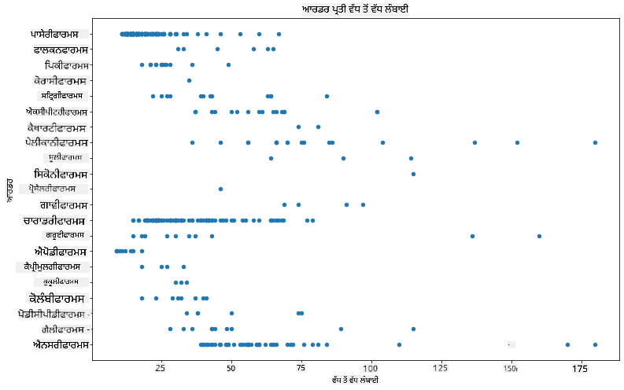

ਇਹ ਪੰਛੀ ਦੇ ਆਰਡਰ ਪ੍ਰਤੀ ਸਰੀਰਕ ਲੰਬਾਈ ਦੇ ਆਮ ਡਿਸਟ੍ਰਿਬਿਊਸ਼ਨ ਦਾ ਝਲਕ ਦਿੰਦਾ ਹੈ, ਪਰ ਇਹ ਸੱਚੇ ਡਿਸਟ੍ਰਿਬਿਊਸ਼ਨਜ਼ ਨੂੰ ਦਰਸਾਉਣ ਦਾ ਸਭ ਤੋਂ ਵਧੀਆ ਤਰੀਕਾ ਨਹੀਂ ਹੈ। ਇਹ ਕੰਮ ਆਮ ਤੌਰ 'ਤੇ ਹਿਸਟੋਗ੍ਰਾਮ ਬਣਾਉਣ ਦੁਆਰਾ ਕੀਤਾ ਜਾਂਦਾ ਹੈ।

## ਹਿਸਟੋਗ੍ਰਾਮ ਨਾਲ ਕੰਮ ਕਰਨਾ

Matplotlib ਹਿਸਟੋਗ੍ਰਾਮ ਦੀ ਵਰਤੋਂ ਕਰਕੇ ਡਾਟਾ ਡਿਸਟ੍ਰਿਬਿਊਸ਼ਨ ਨੂੰ ਵਿਜੁਅਲਾਈਜ਼ ਕਰਨ ਦੇ ਬਹੁਤ ਵਧੀਆ ਤਰੀਕੇ ਪੇਸ਼ ਕਰਦਾ ਹੈ। ਇਹ ਚਾਰਟ ਇੱਕ ਬਾਰ ਚਾਰਟ ਵਾਂਗ ਹੁੰਦਾ ਹੈ ਜਿੱਥੇ ਡਿਸਟ੍ਰਿਬਿਊਸ਼ਨ ਬਾਰਾਂ ਦੇ ਉਤਾਰ-ਚੜ੍ਹਾਅ ਰਾਹੀਂ ਵੇਖਿਆ ਜਾ ਸਕਦਾ ਹੈ। ਹਿਸਟੋਗ੍ਰਾਮ ਬਣਾਉਣ ਲਈ, ਤੁਹਾਨੂੰ ਸੰਖਿਆਤਮਕ ਡਾਟਾ ਦੀ ਲੋੜ ਹੁੰਦੀ ਹੈ। ਹਿਸਟੋਗ੍ਰਾਮ ਬਣਾਉਣ ਲਈ, ਤੁਸੀਂ ਚਾਰਟ ਨੂੰ 'hist' ਕਿਸਮ ਦੇ ਤੌਰ 'ਤੇ ਪਰਿਭਾਸ਼ਿਤ ਕਰਕੇ ਪਲਾਟ ਕਰ ਸਕਦੇ ਹੋ। ਇਹ ਚਾਰਟ ਪੂਰੇ ਡਾਟਾਸੈੱਟ ਦੀ ਸੰਖਿਆਤਮਕ ਡਾਟਾ ਦੀ ਰੇਂਜ ਲਈ MaxBodyMass ਦੇ ਡਿਸਟ੍ਰਿਬਿਊਸ਼ਨ ਨੂੰ ਦਰਸਾਉਂਦਾ ਹੈ। ਡਾਟਾ ਦੇ ਐਰੇ ਨੂੰ ਛੋਟੇ ਬਿਨਜ਼ ਵਿੱਚ ਵੰਡ ਕੇ, ਇਹ ਡਾਟਾ ਦੇ ਮੁੱਲਾਂ ਦੇ ਡਿਸਟ੍ਰਿਬਿਊਸ਼ਨ ਨੂੰ ਦਰਸਾ ਸਕਦਾ ਹੈ:

```python
birds['MaxBodyMass'].plot(kind = 'hist', bins = 10, figsize = (12,12))
plt.show()
```
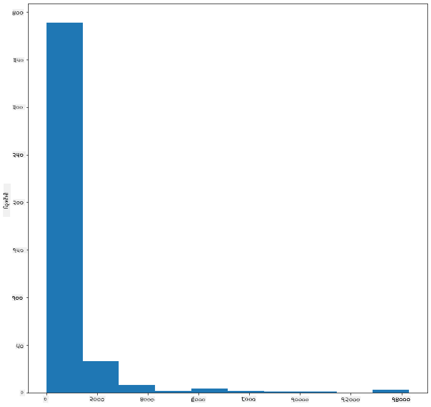

ਜਿਵੇਂ ਤੁਸੀਂ ਵੇਖ ਸਕਦੇ ਹੋ, ਇਸ ਡਾਟਾਸੈੱਟ ਵਿੱਚ ਮੌਜੂਦ 400+ ਪੰਛੀਆਂ ਵਿੱਚੋਂ ਜ਼ਿਆਦਾਤਰ ਦਾ ਵੱਧ ਤੋਂ ਵੱਧ ਸਰੀਰਕ ਭਾਰ 2000 ਤੋਂ ਘੱਟ ਹੈ। `bins` ਪੈਰਾਮੀਟਰ ਨੂੰ ਵਧੇਰੇ ਸੰਖਿਆ, ਜਿਵੇਂ ਕਿ 30, 'ਤੇ ਬਦਲ ਕੇ ਡਾਟਾ ਬਾਰੇ ਹੋਰ ਜਾਣਕਾਰੀ ਪ੍ਰਾਪਤ ਕਰੋ:

```python
birds['MaxBodyMass'].plot(kind = 'hist', bins = 30, figsize = (12,12))
plt.show()
```
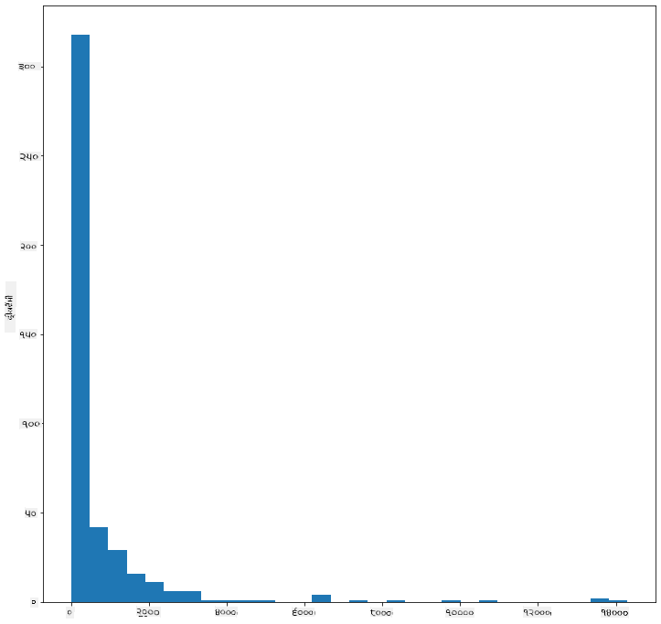

ਇਹ ਚਾਰਟ ਡਿਸਟ੍ਰਿਬਿਊਸ਼ਨ ਨੂੰ ਹੋਰ ਵਿਸਥਾਰ ਵਿੱਚ ਦਰਸਾਉਂਦਾ ਹੈ। ਇੱਕ ਚਾਰਟ ਜੋ ਵੱਧ ਖੱਬੇ ਪਾਸੇ ਝੁਕਿਆ ਹੋਇਆ ਨਹੀਂ ਹੈ, ਉਹ ਇਸ ਤਰੀਕੇ ਨਾਲ ਬਣਾਇਆ ਜਾ ਸਕਦਾ ਹੈ ਕਿ ਤੁਸੀਂ ਸਿਰਫ਼ ਇੱਕ ਦਿੱਤੇ ਗਏ ਰੇਂਜ ਦੇ ਅੰਦਰ ਡਾਟਾ ਚੁਣਦੇ ਹੋ:

ਆਪਣੇ ਡਾਟਾ ਨੂੰ ਫਿਲਟਰ ਕਰੋ ਤਾਂ ਜੋ ਸਿਰਫ਼ ਉਹ ਪੰਛੀ ਮਿਲਣ ਜਿਨ੍ਹਾਂ ਦਾ ਸਰੀਰਕ ਭਾਰ 60 ਤੋਂ ਘੱਟ ਹੈ, ਅਤੇ 40 `bins` ਦਿਖਾਓ:

```python
filteredBirds = birds[(birds['MaxBodyMass'] > 1) & (birds['MaxBodyMass'] < 60)]      
filteredBirds['MaxBodyMass'].plot(kind = 'hist',bins = 40,figsize = (12,12))
plt.show()     
```
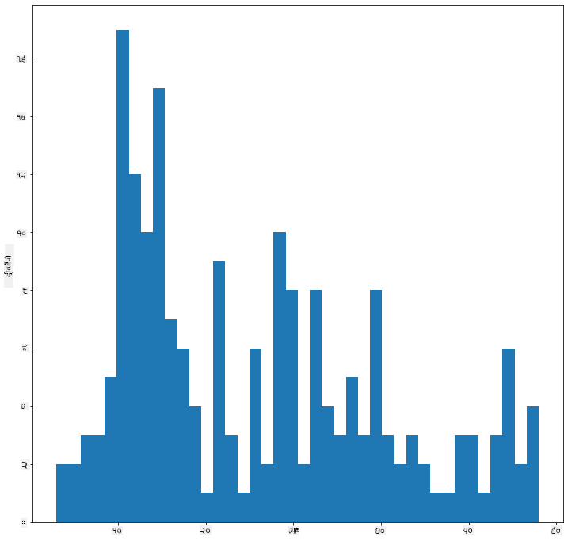

✅ ਕੁਝ ਹੋਰ ਫਿਲਟਰ ਅਤੇ ਡਾਟਾ ਪੌਇੰਟਸ ਦੀ ਕੋਸ਼ਿਸ਼ ਕਰੋ। ਡਾਟਾ ਦੇ ਪੂਰੇ ਡਿਸਟ੍ਰਿਬਿਊਸ਼ਨ ਨੂੰ ਵੇਖਣ ਲਈ, `['MaxBodyMass']` ਫਿਲਟਰ ਨੂੰ ਹਟਾਓ ਤਾਂ ਜੋ ਲੇਬਲਡ ਡਿਸਟ੍ਰਿਬਿਊਸ਼ਨਜ਼ ਦਿਖਾਏ ਜਾ ਸਕਣ।

ਹਿਸਟੋਗ੍ਰਾਮ ਵਿੱਚ ਕੁਝ ਵਧੀਆ ਰੰਗ ਅਤੇ ਲੇਬਲਿੰਗ ਸੁਧਾਰ ਵੀ ਹਨ ਜੋ ਤੁਸੀਂ ਅਜ਼ਮਾਉਣ ਲਈ ਕਰ ਸਕਦੇ ਹੋ:

ਦੋ ਡਿਸਟ੍ਰਿਬਿਊਸ਼ਨਜ਼ ਦੇ ਰਿਸ਼ਤੇ ਦੀ ਤੁਲਨਾ ਕਰਨ ਲਈ ਇੱਕ 2D ਹਿਸਟੋਗ੍ਰਾਮ ਬਣਾਓ। ਆਓ `MaxBodyMass` ਅਤੇ `MaxLength` ਦੀ ਤੁਲਨਾ ਕਰੀਏ। Matplotlib ਇੱਕ ਅੰਦਰੂਨੀ ਤਰੀਕਾ ਪੇਸ਼ ਕਰਦਾ ਹੈ ਜੋ ਚਮਕਦਾਰ ਰੰਗਾਂ ਦੀ ਵਰਤੋਂ ਕਰਕੇ ਸੰਮਿਲਨ ਦਿਖਾਉਂਦਾ ਹੈ:

```python
x = filteredBirds['MaxBodyMass']
y = filteredBirds['MaxLength']

fig, ax = plt.subplots(tight_layout=True)
hist = ax.hist2d(x, y)
```
ਇਹ ਦੋ ਤੱਤਾਂ ਦੇ ਵਿਚਕਾਰ ਇੱਕ ਉਮੀਦ ਕੀਤੀ ਗਈ ਧੁਰੇ ਦੇ ਨਾਲ ਸੰਬੰਧ ਦਿਖਾਉਂਦਾ ਹੈ, ਜਿਸ ਵਿੱਚ ਇੱਕ ਖਾਸ ਤਾਕਤਵਰ ਸੰਮਿਲਨ ਬਿੰਦੂ ਹੈ:

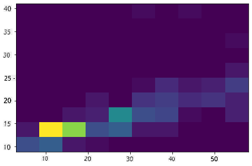

ਹਿਸਟੋਗ੍ਰਾਮ ਆਮ ਤੌਰ 'ਤੇ ਸੰਖਿਆਤਮਕ ਡਾਟਾ ਲਈ ਚੰਗੇ ਕੰਮ ਕਰਦੇ ਹਨ। ਜੇ ਤੁਸੀਂ ਪਾਠ-ਅਧਾਰਿਤ ਡਾਟਾ ਦੇ ਅਨੁਸਾਰ ਡਿਸਟ੍ਰਿਬਿਊਸ਼ਨਜ਼ ਵੇਖਣ ਦੀ ਲੋੜ ਹੈ ਤਾਂ ਕੀ ਕਰਨਾ ਚਾਹੀਦਾ ਹੈ? 
## ਪਾਠ-ਅਧਾਰਿਤ ਡਾਟਾ ਦੀ ਵਰਤੋਂ ਕਰਕੇ ਡਾਟਾਸੈੱਟ ਦੀ ਪੜਚੋਲ ਕਰੋ 

ਇਸ ਡਾਟਾਸੈੱਟ ਵਿੱਚ ਪੰਛੀ ਦੀ ਸ਼੍ਰੇਣੀ ਅਤੇ ਇਸ ਦੇ ਜਨਸ, ਪ੍ਰਜਾਤੀ, ਅਤੇ ਪਰਿਵਾਰ ਦੇ ਨਾਲ-ਨਾਲ ਇਸ ਦੀ ਸੰਰਕਸ਼ਣ ਸਥਿਤੀ ਬਾਰੇ ਵੀ ਚੰਗੀ ਜਾਣਕਾਰੀ ਸ਼ਾਮਲ ਹੈ। ਆਓ ਇਸ ਸੰਰਕਸ਼ਣ ਜਾਣਕਾਰੀ ਵਿੱਚ ਖੋਜ ਕਰੀਏ। ਪੰਛੀਆਂ ਦੀ ਸੰਰਕਸ਼ਣ ਸਥਿਤੀ ਦੇ ਅਨੁਸਾਰ ਡਿਸਟ੍ਰਿਬਿਊਸ਼ਨ ਕੀ ਹੈ?

> ✅ ਡਾਟਾਸੈੱਟ ਵਿੱਚ, ਸੰਰਕਸ਼ਣ ਸਥਿਤੀ ਨੂੰ ਵੇਰਵਾ ਕਰਨ ਲਈ ਕਈ ਸੰਖੇਪ ਸ਼ਬਦ ਵਰਤੇ ਜਾਂਦੇ ਹਨ। ਇਹ ਸੰਖੇਪ ਸ਼ਬਦ [IUCN ਰੈੱਡ ਲਿਸਟ ਸ਼੍ਰੇਣੀਆਂ](https://www.iucnredlist.org/) ਤੋਂ ਆਉਂਦੇ ਹਨ, ਜੋ ਪ੍ਰਜਾਤੀਆਂ ਦੀ ਸਥਿਤੀ ਨੂੰ ਸੂਚੀਬੱਧ ਕਰਦੀ ਹੈ।
> 
> - CR: ਗੰਭੀਰ ਖਤਰੇ ਵਿੱਚ
> - EN: ਖਤਰੇ ਵਿੱਚ
> - EX: ਲੁਪਤ
> - LC: ਘੱਟ ਚਿੰਤਾ
> - NT: ਖਤਰੇ ਦੇ ਨੇੜੇ
> - VU: ਸੰਵੇਦਨਸ਼ੀਲ

ਇਹ ਪਾਠ-ਅਧਾਰਿਤ ਮੁੱਲ ਹਨ ਇਸ ਲਈ ਤੁਹਾਨੂੰ ਹਿਸਟੋਗ੍ਰਾਮ ਬਣਾਉਣ ਲਈ ਇੱਕ ਰੂਪਾਂਤਰ ਕਰਨ ਦੀ ਲੋੜ ਹੋਵੇਗੀ। ਫਿਲਟਰ ਕੀਤਾ ਡਾਟਾਫ੍ਰੇਮ ਵਰਤ ਕੇ, ਇਸ ਦੀ ਸੰਰਕਸ਼ਣ ਸਥਿਤੀ ਨੂੰ ਘੱਟੋ-ਘੱਟ ਪੰਖਾਂ ਦੀ ਚੌੜਾਈ ਦੇ ਨਾਲ ਦਿਖਾਓ। ਤੁਹਾਨੂੰ ਕੀ ਦਿਖਦਾ ਹੈ?

```python
x1 = filteredBirds.loc[filteredBirds.ConservationStatus=='EX', 'MinWingspan']
x2 = filteredBirds.loc[filteredBirds.ConservationStatus=='CR', 'MinWingspan']
x3 = filteredBirds.loc[filteredBirds.ConservationStatus=='EN', 'MinWingspan']
x4 = filteredBirds.loc[filteredBirds.ConservationStatus=='NT', 'MinWingspan']
x5 = filteredBirds.loc[filteredBirds.ConservationStatus=='VU', 'MinWingspan']
x6 = filteredBirds.loc[filteredBirds.ConservationStatus=='LC', 'MinWingspan']

kwargs = dict(alpha=0.5, bins=20)

plt.hist(x1, **kwargs, color='red', label='Extinct')
plt.hist(x2, **kwargs, color='orange', label='Critically Endangered')
plt.hist(x3, **kwargs, color='yellow', label='Endangered')
plt.hist(x4, **kwargs, color='green', label='Near Threatened')
plt.hist(x5, **kwargs, color='blue', label='Vulnerable')
plt.hist(x6, **kwargs, color='gray', label='Least Concern')

plt.gca().set(title='Conservation Status', ylabel='Min Wingspan')
plt.legend();
```

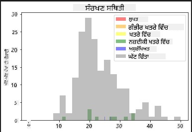

ਘੱਟੋ-ਘੱਟ ਪੰਖਾਂ ਦੀ ਚੌੜਾਈ ਅਤੇ ਸੰਰਕਸ਼ਣ ਸਥਿਤੀ ਦੇ ਵਿਚਕਾਰ ਕੋਈ ਵਧੀਆ ਸੰਬੰਧ ਨਹੀਂ ਲੱਗਦਾ। ਇਸ ਤਰੀਕੇ ਦੀ ਵਰਤੋਂ ਕਰਕੇ ਡਾਟਾਸੈੱਟ ਦੇ ਹੋਰ ਤੱਤਾਂ ਦੀ ਜਾਂਚ ਕਰੋ। ਤੁਸੀਂ ਵੱਖ-ਵੱਖ ਫਿਲਟਰਾਂ ਦੀ ਕੋਸ਼ਿਸ਼ ਵੀ ਕਰ ਸਕਦੇ ਹੋ। ਕੀ ਤੁਹਾਨੂੰ ਕੋਈ ਸੰਬੰਧ ਮਿਲਦਾ ਹੈ?

## ਡੈਂਸਿਟੀ ਪਲਾਟਸ

ਤੁਸੀਂ ਸ਼ਾਇਦ ਨੋਟ ਕੀਤਾ ਹੋਵੇਗਾ ਕਿ ਅਸੀਂ ਹੁਣ ਤੱਕ ਦੇਖੇ ਹਿਸਟੋਗ੍ਰਾਮ 'ਸਟੈਪਡ' ਹਨ ਅਤੇ ਇੱਕ ਆਰਕ ਵਿੱਚ ਹੌਲੀ ਨਹੀਂ ਵਗਦੇ। ਇੱਕ ਹੌਲੀ ਡੈਂਸਿਟੀ ਚਾਰਟ ਦਿਖਾਉਣ ਲਈ, ਤੁਸੀਂ ਡੈਂਸਿਟੀ ਪਲਾਟ ਦੀ ਕੋਸ਼ਿਸ਼ ਕਰ ਸਕਦੇ ਹੋ।

ਡੈਂਸਿਟੀ ਪਲਾਟਸ ਨਾਲ ਕੰਮ ਕਰਨ ਲਈ, ਇੱਕ ਨਵੀਂ ਪਲਾਟਿੰਗ ਲਾਇਬ੍ਰੇਰੀ, [Seaborn](https://seaborn.pydata.org/generated/seaborn.kdeplot.html) ਨਾਲ ਜਾਣੂ ਹੋਵੋ। 

Seaborn ਨੂੰ ਲੋਡ ਕਰਕੇ, ਇੱਕ ਬੁਨਿਆਦੀ ਡੈਂਸਿਟੀ ਪਲਾਟ ਦੀ ਕੋਸ਼ਿਸ਼ ਕਰੋ:

```python
import seaborn as sns
import matplotlib.pyplot as plt
sns.kdeplot(filteredBirds['MinWingspan'])
plt.show()
```
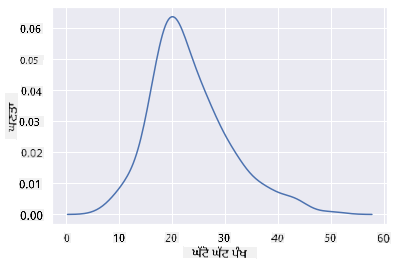

ਤੁਸੀਂ ਵੇਖ ਸਕਦੇ ਹੋ ਕਿ ਇਹ ਪਲਾਟ ਘੱਟੋ-ਘੱਟ ਪੰਖਾਂ ਦੀ ਚੌੜਾਈ ਡਾਟਾ ਲਈ ਪਿਛਲੇ ਚਾਰਟ ਨੂੰ ਦੁਹਰਾਉਂਦਾ ਹੈ; ਇਹ ਸਿਰਫ਼ ਕੁਝ ਹੌਲਾ ਹੈ। Seaborn ਦੀ ਦਸਤਾਵੇਜ਼ੀ ਦੇ ਅਨੁਸਾਰ, "ਹਿਸਟੋਗ੍ਰਾਮ ਦੇ ਮੁਕਾਬਲੇ, KDE ਇੱਕ ਪਲਾਟ ਪੈਦਾ ਕਰ ਸਕਦਾ ਹੈ ਜੋ ਘੱਟ ਭਰਿਆ ਹੋਵੇ ਅਤੇ ਵਧੇਰੇ ਵਿਆਖਿਆਯੋਗ ਹੋਵੇ, ਖਾਸ ਕਰਕੇ ਜਦੋਂ ਕਈ ਡਿਸਟ੍ਰਿਬਿਊਸ਼ਨਜ਼ ਨੂੰ ਖਿੱਚਿਆ ਜਾ ਰਿਹਾ ਹੋਵੇ। ਪਰ ਇਹ ਵਿਗੜਨ ਦੀ ਸੰਭਾਵਨਾ ਰੱਖਦਾ ਹੈ ਜੇਕਰ ਅਧਾਰਭੂਤ ਡਿਸਟ੍ਰਿਬਿਊਸ਼ਨ ਬਾਊਂਡਡ ਜਾਂ ਹੌਲਾ ਨਾ ਹੋਵੇ।" [ਸਰੋਤ](https://seaborn.pydata.org/generated/seaborn.kdeplot.html) ਅਰਥਾਤ, ਆਊਟਲਾਇਅਰਜ਼ ਹਮੇਸ਼ਾ ਤੁਹਾਡੇ ਚਾਰਟਾਂ ਨੂੰ ਗਲਤ ਵਿਹਾਰ ਕਰਨ ਲਈ ਮਜਬੂਰ ਕਰ ਸਕਦੇ ਹਨ।

ਜੇ ਤੁਸੀਂ ਦੂਜੇ ਚਾਰਟ ਵਿੱਚ ਉਸ ਜੱਗਡ MaxBodyMass ਲਾਈਨ ਨੂੰ ਦੁਬਾਰਾ ਵੇਖਣਾ ਚਾਹੁੰਦੇ ਹੋ, ਤਾਂ ਤੁਸੀਂ ਇਸ ਤਰੀਕੇ ਦੀ ਵਰਤੋਂ ਕਰਕੇ ਇਸਨੂੰ ਬਹੁਤ ਚੰਗੀ ਤਰ੍ਹਾਂ ਹੌਲਾ ਕਰ ਸਕਦੇ ਹੋ:

```python
sns.kdeplot(filteredBirds['MaxBodyMass'])
plt.show()
```
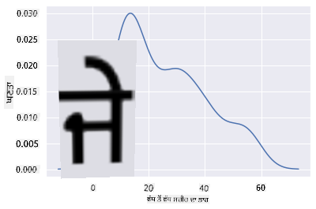

ਜੇ ਤੁਸੀਂ ਇੱਕ ਹੌਲੀ, ਪਰ ਬਹੁਤ ਜ਼ਿਆਦਾ ਹੌਲੀ ਲਾਈਨ ਨਹੀਂ ਚਾਹੁੰਦੇ, ਤਾਂ `bw_adjust` ਪੈਰਾਮੀਟਰ ਨੂੰ ਸੰਪਾਦਿਤ ਕਰੋ:

```python
sns.kdeplot(filteredBirds['MaxBodyMass'], bw_adjust=.2)
plt.show()
```
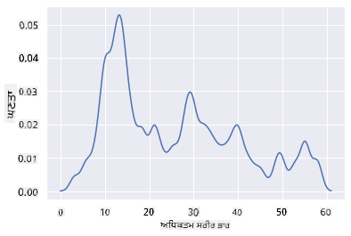

✅ ਇਸ ਕਿਸਮ ਦੇ ਪਲਾਟ ਲਈ ਉਪਲਬਧ ਪੈਰਾਮੀਟਰਾਂ ਬਾਰੇ ਪੜ੍ਹੋ ਅਤੇ ਪ੍ਰਯੋਗ ਕਰੋ!

ਇਸ ਕਿਸਮ ਦਾ ਚਾਰਟ ਸੁੰਦਰ ਤਰੀਕੇ ਨਾਲ ਵਿਆਖਿਆਤਮਕ ਵਿਜੁਅਲਾਈਜ਼ੇਸ਼ਨ ਪੇਸ਼ ਕਰਦਾ ਹੈ। ਉਦਾਹਰਣ ਲਈ, ਕੁਝ ਕੋਡ ਦੀਆਂ ਲਾਈਨਾਂ ਨਾਲ, ਤੁਸੀਂ ਪੰਛੀ ਦੇ ਆਰਡਰ ਪ੍ਰਤੀ ਵੱਧ ਤੋਂ ਵੱਧ ਸਰੀਰਕ ਭਾਰ ਦੀ ਡੈਂਸਿਟੀ ਦਿਖਾ ਸਕਦੇ ਹੋ:

```python
sns.kdeplot(
   data=filteredBirds, x="MaxBodyMass", hue="Order",
   fill=True, common_norm=False, palette="crest",
   alpha=.5, linewidth=0,
)
```

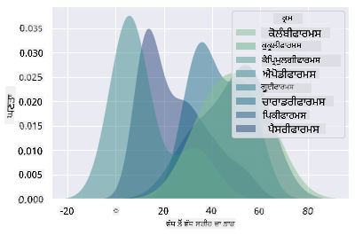

ਤੁਸੀਂ ਇੱਕ ਚਾਰਟ ਵਿੱਚ ਕਈ ਤੱਤਾਂ ਦੀ ਡੈਂਸਿਟੀ ਨੂੰ ਵੀ ਮੈਪ ਕਰ ਸਕਦੇ ਹੋ। ਪੰਛੀ ਦੀ ਵੱਧ ਤੋਂ ਵੱਧ ਲੰਬਾਈ ਅਤੇ ਘੱਟੋ-ਘੱਟ ਲੰਬਾਈ ਦੀ ਸੰਰਕਸ਼ਣ ਸਥਿਤੀ ਨਾਲ ਤੁਲਨਾ ਕਰੋ:

```python
sns.kdeplot(data=filteredBirds, x="MinLength", y="MaxLength", hue="ConservationStatus")
```

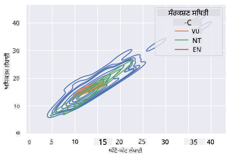

ਸ਼ਾਇਦ ਇਹ ਖੋਜ ਕਰਨ ਯੋਗ ਹੈ ਕਿ ਕੀ 'ਸੰਵੇਦਨਸ਼ੀਲ' ਪੰਛੀਆਂ ਦੀ ਲੰਬਾਈ ਦੇ ਅਨੁਸਾਰ ਕਲੱਸਟਰ ਮਹੱਤਵਪੂਰਨ ਹੈ ਜਾਂ ਨਹੀਂ।

## 🚀 ਚੁਣੌਤੀ

ਹਿਸਟੋਗ੍ਰਾਮ ਬੁਨਿਆਦੀ ਸਕੈਟਰਪਲਾਟਸ, ਬਾਰ ਚਾਰਟਸ, ਜਾਂ ਲਾਈਨ ਚਾਰਟਸ ਨਾਲੋਂ ਵਧੇਰੇ ਸੁਧਾਰਤ ਚਾਰਟ ਦੀ ਕਿਸਮ ਹਨ। ਇੰਟਰਨੈਟ 'ਤੇ ਜਾਓ ਅਤੇ ਹਿਸਟੋਗ੍ਰਾਮ ਦੀ ਵਰਤੋਂ ਦੇ ਚੰਗੇ ਉਦਾਹਰਣ ਲੱਭੋ। ਇਹ ਕਿਵੇਂ ਵਰਤੇ ਜਾਂਦੇ ਹਨ, ਇਹ ਕੀ ਦਰਸਾਉਂਦੇ ਹਨ, ਅਤੇ ਇਹ ਕਿਹੜੇ ਖੇਤਰਾਂ ਜਾਂ ਖੋਜ ਦੇ ਖੇਤਰਾਂ ਵਿੱਚ ਵਰਤੇ ਜਾਂਦੇ

---

**ਅਸਵੀਕਰਤੀ**:  
ਇਹ ਦਸਤਾਵੇਜ਼ AI ਅਨੁਵਾਦ ਸੇਵਾ [Co-op Translator](https://github.com/Azure/co-op-translator) ਦੀ ਵਰਤੋਂ ਕਰਕੇ ਅਨੁਵਾਦ ਕੀਤਾ ਗਿਆ ਹੈ। ਜਦੋਂ ਕਿ ਅਸੀਂ ਸਹੀ ਹੋਣ ਦੀ ਕੋਸ਼ਿਸ਼ ਕਰਦੇ ਹਾਂ, ਕਿਰਪਾ ਕਰਕੇ ਧਿਆਨ ਦਿਓ ਕਿ ਸਵੈਚਾਲਿਤ ਅਨੁਵਾਦਾਂ ਵਿੱਚ ਗਲਤੀਆਂ ਜਾਂ ਅਸੁਚਤਤਾਵਾਂ ਹੋ ਸਕਦੀਆਂ ਹਨ। ਇਸ ਦੀ ਮੂਲ ਭਾਸ਼ਾ ਵਿੱਚ ਮੌਜੂਦ ਅਸਲ ਦਸਤਾਵੇਜ਼ ਨੂੰ ਅਧਿਕਾਰਤ ਸਰੋਤ ਮੰਨਿਆ ਜਾਣਾ ਚਾਹੀਦਾ ਹੈ। ਮਹੱਤਵਪੂਰਨ ਜਾਣਕਾਰੀ ਲਈ, ਪੇਸ਼ੇਵਰ ਮਨੁੱਖੀ ਅਨੁਵਾਦ ਦੀ ਸਿਫਾਰਸ਼ ਕੀਤੀ ਜਾਂਦੀ ਹੈ। ਇਸ ਅਨੁਵਾਦ ਦੀ ਵਰਤੋਂ ਤੋਂ ਪੈਦਾ ਹੋਣ ਵਾਲੇ ਕਿਸੇ ਵੀ ਗਲਤ ਫਹਿਮੀ ਜਾਂ ਗਲਤ ਵਿਆਖਿਆ ਲਈ ਅਸੀਂ ਜ਼ਿੰਮੇਵਾਰ ਨਹੀਂ ਹਾਂ।