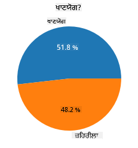
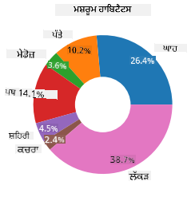
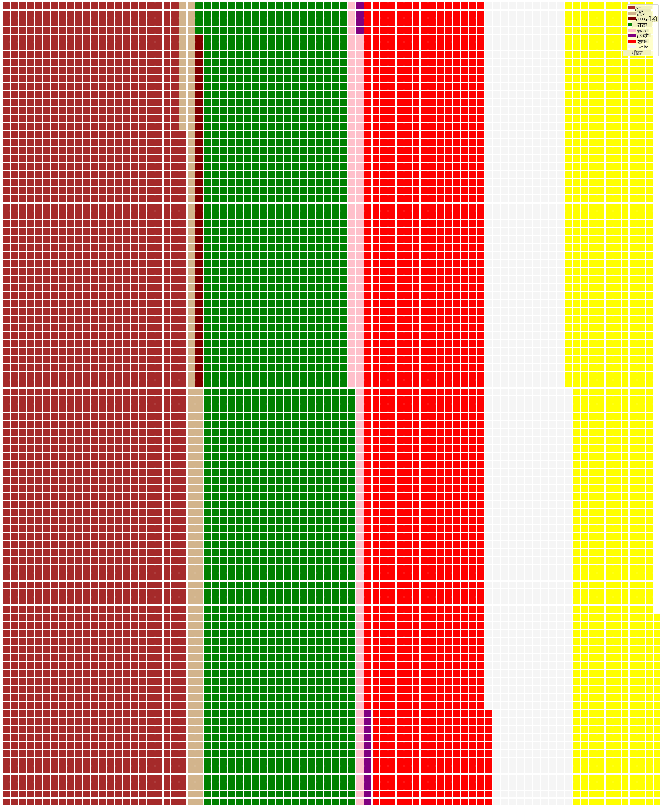

<!--
CO_OP_TRANSLATOR_METADATA:
{
  "original_hash": "cc490897ee2d276870472bcb31602d03",
  "translation_date": "2025-09-04T17:25:25+00:00",
  "source_file": "3-Data-Visualization/11-visualization-proportions/README.md",
  "language_code": "pa"
}
-->
# ਅਨੁਪਾਤਾਂ ਨੂੰ ਦ੍ਰਿਸ਼ਮਾਨ ਕਰਨਾ

| ਦੁਆਰਾ ਬਣਾਈ ਗਈ ਸਕੈਚਨੋਟ ](../../sketchnotes/11-Visualizing-Proportions.png)|
|:---:|
|ਅਨੁਪਾਤਾਂ ਨੂੰ ਦ੍ਰਿਸ਼ਮਾਨ ਕਰਨਾ - _[@nitya](https://twitter.com/nitya) ਦੁਆਰਾ ਬਣਾਈ ਗਈ ਸਕੈਚਨੋਟ_ |

ਇਸ ਪਾਠ ਵਿੱਚ, ਤੁਸੀਂ ਕੁਦਰਤ-ਕੇਂਦ੍ਰਿਤ ਡੇਟਾਸੈੱਟ ਦੀ ਵਰਤੋਂ ਕਰਕੇ ਅਨੁਪਾਤਾਂ ਨੂੰ ਦ੍ਰਿਸ਼ਮਾਨ ਕਰੋਗੇ, ਜਿਵੇਂ ਕਿ ਮਸ਼ਰੂਮਾਂ ਬਾਰੇ ਡੇਟਾਸੈੱਟ ਵਿੱਚ ਕਿੰਨੇ ਵੱਖ-ਵੱਖ ਕਿਸਮਾਂ ਦੇ ਫੰਗਸ ਹਨ। ਆਓ ਅਗਾਰਿਕਸ ਅਤੇ ਲੇਪਿਓਟਾ ਪਰਿਵਾਰਾਂ ਦੇ 23 ਪ੍ਰਜਾਤੀਆਂ ਦੇ ਗਿਲਡ ਮਸ਼ਰੂਮਾਂ ਬਾਰੇ ਆਡੂਬਨ ਤੋਂ ਪ੍ਰਾਪਤ ਡੇਟਾਸੈੱਟ ਦੀ ਵਰਤੋਂ ਕਰਕੇ ਇਹ ਦਿਲਚਸਪ ਫੰਗਸ ਦੀ ਖੋਜ ਕਰੀਏ। ਤੁਸੀਂ ਹੇਠਾਂ ਦਿੱਤੇ ਦ੍ਰਿਸ਼ਮਾਨਾਂ ਨਾਲ ਪ੍ਰਯੋਗ ਕਰੋਗੇ:

- ਪਾਈ ਚਾਰਟ 🥧
- ਡੋਨਟ ਚਾਰਟ 🍩
- ਵਾਫਲ ਚਾਰਟ 🧇

> 💡 ਮਾਈਕਰੋਸਾਫਟ ਰਿਸਰਚ ਦੁਆਰਾ ਬਣਾਇਆ ਗਿਆ ਇੱਕ ਬਹੁਤ ਦਿਲਚਸਪ ਪ੍ਰੋਜੈਕਟ [Charticulator](https://charticulator.com) ਡੇਟਾ ਦ੍ਰਿਸ਼ਮਾਨਾਂ ਲਈ ਇੱਕ ਮੁਫ਼ਤ ਡਰੈਗ ਅਤੇ ਡ੍ਰਾਪ ਇੰਟਰਫੇਸ ਪੇਸ਼ ਕਰਦਾ ਹੈ। ਆਪਣੇ ਇੱਕ ਟਿਊਟੋਰਿਅਲ ਵਿੱਚ ਉਹ ਇਸ ਮਸ਼ਰੂਮ ਡੇਟਾਸੈੱਟ ਦੀ ਵੀ ਵਰਤੋਂ ਕਰਦੇ ਹਨ! ਇਸ ਲਈ ਤੁਸੀਂ ਡੇਟਾ ਦੀ ਖੋਜ ਕਰ ਸਕਦੇ ਹੋ ਅਤੇ ਲਾਇਬ੍ਰੇਰੀ ਨੂੰ ਇੱਕੋ ਸਮੇਂ ਸਿੱਖ ਸਕਦੇ ਹੋ: [Charticulator ਟਿਊਟੋਰਿਅਲ](https://charticulator.com/tutorials/tutorial4.html)।

## [ਪਾਠ-ਪ੍ਰਸ਼ਨੋਤਰੀ](https://ff-quizzes.netlify.app/en/ds/)

## ਆਪਣੇ ਮਸ਼ਰੂਮਾਂ ਨੂੰ ਜਾਣੋ 🍄

ਮਸ਼ਰੂਮ ਬਹੁਤ ਦਿਲਚਸਪ ਹੁੰਦੇ ਹਨ। ਆਓ ਇੱਕ ਡੇਟਾਸੈੱਟ ਨੂੰ ਆਯਾਤ ਕਰਕੇ ਉਨ੍ਹਾਂ ਦਾ ਅਧਿਐਨ ਕਰੀਏ:

```python
import pandas as pd
import matplotlib.pyplot as plt
mushrooms = pd.read_csv('../../data/mushrooms.csv')
mushrooms.head()
```
ਇੱਕ ਟੇਬਲ ਪ੍ਰਿੰਟ ਕੀਤੀ ਜਾਂਦੀ ਹੈ ਜਿਸ ਵਿੱਚ ਵਿਸ਼ਲੇਸ਼ਣ ਲਈ ਕੁਝ ਸ਼ਾਨਦਾਰ ਡੇਟਾ ਹੁੰਦਾ ਹੈ:

| class     | cap-shape | cap-surface | cap-color | bruises | odor    | gill-attachment | gill-spacing | gill-size | gill-color | stalk-shape | stalk-root | stalk-surface-above-ring | stalk-surface-below-ring | stalk-color-above-ring | stalk-color-below-ring | veil-type | veil-color | ring-number | ring-type | spore-print-color | population | habitat |
| --------- | --------- | ----------- | --------- | ------- | ------- | --------------- | ------------ | --------- | ---------- | ----------- | ---------- | ------------------------ | ------------------------ | ---------------------- | ---------------------- | --------- | ---------- | ----------- | --------- | ----------------- | ---------- | ------- |
| Poisonous | Convex    | Smooth      | Brown     | Bruises | Pungent | Free            | Close        | Narrow    | Black      | Enlarging   | Equal      | Smooth                   | Smooth                   | White                  | White                  | Partial   | White      | One         | Pendant   | Black             | Scattered  | Urban   |
| Edible    | Convex    | Smooth      | Yellow    | Bruises | Almond  | Free            | Close        | Broad     | Black      | Enlarging   | Club       | Smooth                   | Smooth                   | White                  | White                  | Partial   | White      | One         | Pendant   | Brown             | Numerous   | Grasses |
| Edible    | Bell      | Smooth      | White     | Bruises | Anise   | Free            | Close        | Broad     | Brown      | Enlarging   | Club       | Smooth                   | Smooth                   | White                  | White                  | Partial   | White      | One         | Pendant   | Brown             | Numerous   | Meadows |
| Poisonous | Convex    | Scaly       | White     | Bruises | Pungent | Free            | Close        | Narrow    | Brown      | Enlarging   | Equal      | Smooth                   | Smooth                   | White                  | White                  | Partial   | White      | One         | Pendant   | Black             | Scattered  | Urban   |

ਤੁਰੰਤ ਹੀ, ਤੁਸੀਂ ਨੋਟ ਕਰਦੇ ਹੋ ਕਿ ਸਾਰਾ ਡੇਟਾ ਟੈਕਸਟ ਦੇ ਰੂਪ ਵਿੱਚ ਹੈ। ਤੁਸੀਂ ਇਸ ਡੇਟਾ ਨੂੰ ਚਾਰਟ ਵਿੱਚ ਵਰਤਣ ਯੋਗ ਬਣਾਉਣ ਲਈ ਇਸ ਨੂੰ ਰੂਪਾਂਤਰਿਤ ਕਰਨਾ ਪਵੇਗਾ। ਅਸਲ ਵਿੱਚ, ਜ਼ਿਆਦਾਤਰ ਡੇਟਾ ਇੱਕ ਆਬਜੈਕਟ ਦੇ ਰੂਪ ਵਿੱਚ ਦਰਸਾਇਆ ਗਿਆ ਹੈ:

```python
print(mushrooms.select_dtypes(["object"]).columns)
```

ਆਉਟਪੁੱਟ ਹੈ:

```output
Index(['class', 'cap-shape', 'cap-surface', 'cap-color', 'bruises', 'odor',
       'gill-attachment', 'gill-spacing', 'gill-size', 'gill-color',
       'stalk-shape', 'stalk-root', 'stalk-surface-above-ring',
       'stalk-surface-below-ring', 'stalk-color-above-ring',
       'stalk-color-below-ring', 'veil-type', 'veil-color', 'ring-number',
       'ring-type', 'spore-print-color', 'population', 'habitat'],
      dtype='object')
```
ਇਸ ਡੇਟਾ ਨੂੰ ਲਓ ਅਤੇ 'class' ਕਾਲਮ ਨੂੰ ਇੱਕ ਸ਼੍ਰੇਣੀ ਵਿੱਚ ਰੂਪਾਂਤਰਿਤ ਕਰੋ:

```python
cols = mushrooms.select_dtypes(["object"]).columns
mushrooms[cols] = mushrooms[cols].astype('category')
```

```python
edibleclass=mushrooms.groupby(['class']).count()
edibleclass
```

ਹੁਣ, ਜੇ ਤੁਸੀਂ ਮਸ਼ਰੂਮਾਂ ਦਾ ਡੇਟਾ ਪ੍ਰਿੰਟ ਕਰਦੇ ਹੋ, ਤਾਂ ਤੁਸੀਂ ਦੇਖ ਸਕਦੇ ਹੋ ਕਿ ਇਸ ਨੂੰ ਜ਼ਹਿਰੀਲੇ/ਖਾਣਯੋਗ ਸ਼੍ਰੇਣੀ ਦੇ ਅਨੁਸਾਰ ਸ਼੍ਰੇਣੀਆਂ ਵਿੱਚ ਸਮੂਹਬੱਧ ਕੀਤਾ ਗਿਆ ਹੈ:

|           | cap-shape | cap-surface | cap-color | bruises | odor | gill-attachment | gill-spacing | gill-size | gill-color | stalk-shape | ... | stalk-surface-below-ring | stalk-color-above-ring | stalk-color-below-ring | veil-type | veil-color | ring-number | ring-type | spore-print-color | population | habitat |
| --------- | --------- | ----------- | --------- | ------- | ---- | --------------- | ------------ | --------- | ---------- | ----------- | --- | ------------------------ | ---------------------- | ---------------------- | --------- | ---------- | ----------- | --------- | ----------------- | ---------- | ------- |
| class     |           |             |           |         |      |                 |              |           |            |             |     |                          |                        |                        |           |            |             |           |                   |            |         |
| Edible    | 4208      | 4208        | 4208      | 4208    | 4208 | 4208            | 4208         | 4208      | 4208       | 4208        | ... | 4208                     | 4208                   | 4208                   | 4208      | 4208       | 4208        | 4208      | 4208              | 4208       | 4208    |
| Poisonous | 3916      | 3916        | 3916      | 3916    | 3916 | 3916            | 3916         | 3916      | 3916       | 3916        | ... | 3916                     | 3916                   | 3916                   | 3916      | 3916       | 3916        | 3916      | 3916              | 3916       | 3916    |

ਜੇ ਤੁਸੀਂ ਇਸ ਟੇਬਲ ਵਿੱਚ ਪੇਸ਼ ਕੀਤੇ ਕ੍ਰਮ ਨੂੰ ਫਾਲੋ ਕਰਦੇ ਹੋ ਤਾਂ ਤੁਸੀਂ ਆਪਣੀ ਸ਼੍ਰੇਣੀ ਲੇਬਲ ਬਣਾਉਣ ਲਈ ਪਾਈ ਚਾਰਟ ਤਿਆਰ ਕਰ ਸਕਦੇ ਹੋ:

## ਪਾਈ!

```python
labels=['Edible','Poisonous']
plt.pie(edibleclass['population'],labels=labels,autopct='%.1f %%')
plt.title('Edible?')
plt.show()
```
ਲੋ, ਇੱਕ ਪਾਈ ਚਾਰਟ ਜੋ ਮਸ਼ਰੂਮਾਂ ਦੀਆਂ ਦੋ ਸ਼੍ਰੇਣੀਆਂ ਦੇ ਅਨੁਪਾਤਾਂ ਨੂੰ ਦਰਸਾਉਂਦਾ ਹੈ। ਲੇਬਲਾਂ ਦੇ ਕ੍ਰਮ ਨੂੰ ਸਹੀ ਪ੍ਰਾਪਤ ਕਰਨਾ ਬਹੁਤ ਮਹੱਤਵਪੂਰਨ ਹੈ, ਖਾਸ ਕਰਕੇ ਇੱਥੇ, ਇਸ ਲਈ ਯਕੀਨੀ ਬਣਾਓ ਕਿ ਲੇਬਲ ਐਰੇ ਬਣਾਉਣ ਦੇ ਕ੍ਰਮ ਦੀ ਪੁਸ਼ਟੀ ਕਰੋ!



## ਡੋਨਟ!

ਪਾਈ ਚਾਰਟ ਦਾ ਇੱਕ ਹੋਰ ਦ੍ਰਿਸ਼ਮਾਨ ਰੂਪ ਡੋਨਟ ਚਾਰਟ ਹੈ, ਜੋ ਪਾਈ ਚਾਰਟ ਵਿੱਚ ਵਿਚਕਾਰ ਇੱਕ ਛੇਦ ਹੁੰਦਾ ਹੈ। ਆਓ ਆਪਣੇ ਡੇਟਾ ਨੂੰ ਇਸ ਤਰੀਕੇ ਨਾਲ ਵੇਖੀਏ।

ਮਸ਼ਰੂਮਾਂ ਦੇ ਵੱਖ-ਵੱਖ ਆਵਾਸਾਂ ਨੂੰ ਵੇਖੋ:

```python
habitat=mushrooms.groupby(['habitat']).count()
habitat
```
ਇੱਥੇ, ਤੁਸੀਂ ਆਪਣੇ ਡੇਟਾ ਨੂੰ ਆਵਾਸ ਦੇ ਅਨੁਸਾਰ ਸਮੂਹਬੱਧ ਕਰ ਰਹੇ ਹੋ। ਇੱਥੇ 7 ਆਵਾਸ ਦਿੱਤੇ ਗਏ ਹਨ, ਇਸ ਲਈ ਆਪਣੇ ਡੋਨਟ ਚਾਰਟ ਲਈ ਉਨ੍ਹਾਂ ਨੂੰ ਲੇਬਲ ਵਜੋਂ ਵਰਤੋ:

```python
labels=['Grasses','Leaves','Meadows','Paths','Urban','Waste','Wood']

plt.pie(habitat['class'], labels=labels,
        autopct='%1.1f%%', pctdistance=0.85)
  
center_circle = plt.Circle((0, 0), 0.40, fc='white')
fig = plt.gcf()

fig.gca().add_artist(center_circle)
  
plt.title('Mushroom Habitats')
  
plt.show()
```



ਇਹ ਕੋਡ ਇੱਕ ਚਾਰਟ ਅਤੇ ਇੱਕ ਕੇਂਦਰੀ ਸਰਕਲ ਖਿੱਚਦਾ ਹੈ, ਫਿਰ ਉਸ ਕੇਂਦਰੀ ਸਰਕਲ ਨੂੰ ਚਾਰਟ ਵਿੱਚ ਸ਼ਾਮਲ ਕਰਦਾ ਹੈ। ਕੇਂਦਰੀ ਸਰਕਲ ਦੀ ਚੌੜਾਈ ਨੂੰ '0.40' ਨੂੰ ਕਿਸੇ ਹੋਰ ਮੁੱਲ ਵਿੱਚ ਬਦਲ ਕੇ ਸੰਪਾਦਿਤ ਕਰੋ।

ਡੋਨਟ ਚਾਰਟਾਂ ਨੂੰ ਕਈ ਤਰੀਕਿਆਂ ਨਾਲ ਸੰਪਾਦਿਤ ਕੀਤਾ ਜਾ ਸਕਦਾ ਹੈ ਤਾਂ ਜੋ ਲੇਬਲਾਂ ਨੂੰ ਵਧੀਆ ਪੜ੍ਹਨਯੋਗ ਬਣਾਇਆ ਜਾ ਸਕੇ। [ਡਾਕੂਮੈਂਟ](https://matplotlib.org/stable/gallery/pie_and_polar_charts/pie_and_donut_labels.html?highlight=donut) ਵਿੱਚ ਹੋਰ ਜਾਣਕਾਰੀ ਪ੍ਰਾਪਤ ਕਰੋ।

ਹੁਣ ਜਦੋਂ ਤੁਸੀਂ ਜਾਣ ਗਏ ਹੋ ਕਿ ਆਪਣੇ ਡੇਟਾ ਨੂੰ ਸਮੂਹਬੱਧ ਕਰਨਾ ਅਤੇ ਫਿਰ ਇਸ ਨੂੰ ਪਾਈ ਜਾਂ ਡੋਨਟ ਵਜੋਂ ਦਿਖਾਉਣਾ, ਤੁਸੀਂ ਹੋਰ ਕਿਸਮਾਂ ਦੇ ਚਾਰਟਾਂ ਦੀ ਖੋਜ ਕਰ ਸਕਦੇ ਹੋ। ਇੱਕ ਵਾਫਲ ਚਾਰਟ ਦੀ ਕੋਸ਼ਿਸ਼ ਕਰੋ, ਜੋ ਮਾਤਰਾ ਦੀ ਖੋਜ ਕਰਨ ਦਾ ਇੱਕ ਵੱਖਰਾ ਤਰੀਕਾ ਹੈ।

## ਵਾਫਲ!

'ਵਾਫਲ' ਕਿਸਮ ਦਾ ਚਾਰਟ ਮਾਤਰਾ ਨੂੰ 2D ਐਰੇ ਦੇ ਚੌਰਸਾਂ ਵਜੋਂ ਦ੍ਰਿਸ਼ਮਾਨ ਕਰਨ ਦਾ ਇੱਕ ਵੱਖਰਾ ਤਰੀਕਾ ਹੈ। ਇਸ ਡੇਟਾਸੈੱਟ ਵਿੱਚ ਮਸ਼ਰੂਮ ਕੈਪ ਦੇ ਰੰਗਾਂ ਦੀਆਂ ਵੱਖ-ਵੱਖ ਮਾਤਰਾਵਾਂ ਨੂੰ ਦ੍ਰਿਸ਼ਮਾਨ ਕਰਨ ਦੀ ਕੋਸ਼ਿਸ਼ ਕਰੋ। ਇਸ ਲਈ, ਤੁਹਾਨੂੰ [PyWaffle](https://pypi.org/project/pywaffle/) ਨਾਮਕ ਇੱਕ ਸਹਾਇਕ ਲਾਇਬ੍ਰੇਰੀ ਨੂੰ ਇੰਸਟਾਲ ਕਰਨਾ ਪਵੇਗਾ ਅਤੇ Matplotlib ਦੀ ਵਰਤੋਂ ਕਰਨੀ ਪਵੇਗੀ:

```python
pip install pywaffle
```

ਆਪਣੇ ਡੇਟਾ ਦੇ ਇੱਕ ਖੰਡ ਨੂੰ ਸਮੂਹਬੱਧ ਕਰਨ ਲਈ ਚੁਣੋ:

```python
capcolor=mushrooms.groupby(['cap-color']).count()
capcolor
```

ਲੇਬਲ ਬਣਾਉਣ ਅਤੇ ਫਿਰ ਆਪਣੇ ਡੇਟਾ ਨੂੰ ਸਮੂਹਬੱਧ ਕਰਕੇ ਇੱਕ ਵਾਫਲ ਚਾਰਟ ਬਣਾਓ:

```python
import pandas as pd
import matplotlib.pyplot as plt
from pywaffle import Waffle
  
data ={'color': ['brown', 'buff', 'cinnamon', 'green', 'pink', 'purple', 'red', 'white', 'yellow'],
    'amount': capcolor['class']
     }
  
df = pd.DataFrame(data)
  
fig = plt.figure(
    FigureClass = Waffle,
    rows = 100,
    values = df.amount,
    labels = list(df.color),
    figsize = (30,30),
    colors=["brown", "tan", "maroon", "green", "pink", "purple", "red", "whitesmoke", "yellow"],
)
```

ਵਾਫਲ ਚਾਰਟ ਦੀ ਵਰਤੋਂ ਕਰਕੇ, ਤੁਸੀਂ ਮਸ਼ਰੂਮ ਡੇਟਾਸੈੱਟ ਦੇ ਕੈਪ ਰੰਗਾਂ ਦੇ ਅਨੁਪਾਤਾਂ ਨੂੰ ਸਪਸ਼ਟ ਤੌਰ 'ਤੇ ਵੇਖ ਸਕਦੇ ਹੋ। ਦਿਲਚਸਪ ਗੱਲ ਇਹ ਹੈ ਕਿ ਇੱਥੇ ਬਹੁਤ ਸਾਰੇ ਹਰੇ ਕੈਪ ਵਾਲੇ ਮਸ਼ਰੂਮ ਹਨ!



✅ Pywaffle ਚਾਰਟਾਂ ਵਿੱਚ ਆਈਕਨ ਦਾ ਸਮਰਥਨ ਕਰਦਾ ਹੈ ਜੋ [Font Awesome](https://fontawesome.com/) ਵਿੱਚ ਉਪਲਬਧ ਕਿਸੇ ਵੀ ਆਈਕਨ ਦੀ ਵਰਤੋਂ ਕਰਦਾ ਹੈ। ਚੌਰਸਾਂ ਦੀ ਬਜਾਏ ਆਈਕਨ ਦੀ ਵਰਤੋਂ ਕਰਕੇ ਇੱਕ ਹੋਰ ਦਿਲਚਸਪ ਵਾਫਲ ਚਾਰਟ ਬਣਾਉਣ ਲਈ ਕੁਝ ਪ੍ਰਯੋਗ ਕਰੋ।

ਇਸ ਪਾਠ ਵਿੱਚ, ਤੁਸੀਂ ਅਨੁਪਾਤਾਂ ਨੂੰ ਦ੍ਰਿਸ਼ਮਾਨ ਕਰਨ ਦੇ ਤਿੰਨ ਤਰੀਕੇ ਸਿੱਖੇ। ਪਹਿਲਾਂ, ਤੁਹਾਨੂੰ ਆਪਣੇ ਡੇਟਾ ਨੂੰ ਸ਼੍ਰੇਣੀਆਂ ਵਿੱਚ ਸਮੂਹਬੱਧ ਕਰਨਾ ਪਵੇਗਾ ਅਤੇ ਫਿਰ ਇਹ ਫੈਸਲਾ ਕਰਨਾ ਪਵੇਗਾ ਕਿ ਡੇਟਾ ਨੂੰ ਦਿਖਾਉਣ ਦਾ ਸਭ ਤੋਂ ਵਧੀਆ ਤਰੀਕਾ ਕਿਹੜਾ ਹੈ - ਪਾਈ, ਡੋਨਟ, ਜਾਂ ਵਾਫਲ। ਸਾਰੇ ਦਿਲਚਸਪ ਹਨ ਅਤੇ ਉਪਭੋਗਤਾ ਨੂੰ ਡੇਟਾਸੈੱਟ ਦਾ ਤੁਰੰਤ ਸਨੈਪਸ਼ਾਟ ਦਿੰਦੇ ਹਨ।

## 🚀 ਚੁਣੌਤੀ

ਇਹ ਦਿਲਚਸਪ ਚਾਰਟਾਂ ਨੂੰ [Charticulator](https://charticulator.com) ਵਿੱਚ ਦੁਬਾਰਾ ਬਣਾਉਣ ਦੀ ਕੋਸ਼ਿਸ਼ ਕਰੋ।
## [ਪਾਠ-ਪ੍ਰਸ਼ਨੋਤਰੀ](https://purple-hill-04aebfb03.1.azurestaticapps.net/quiz/21)

## ਸਮੀਖਿਆ ਅਤੇ ਸਵੈ-ਅਧਿਐਨ

ਕਈ ਵਾਰ ਇਹ ਸਪਸ਼ਟ ਨਹੀਂ ਹੁੰਦਾ ਕਿ ਪਾਈ, ਡੋਨਟ, ਜਾਂ ਵਾਫਲ ਚਾਰਟ ਕਦੋਂ ਵਰਤਣਾ ਹੈ। ਇਸ ਵਿਸ਼ੇ 'ਤੇ ਪੜ੍ਹਨ ਲਈ ਕੁਝ ਲੇਖ:

https://www.beautiful.ai/blog/battle-of-the-charts-pie-chart-vs-donut-chart

https://medium.com/@hypsypops/pie-chart-vs-donut-chart-showdown-in-the-ring-5d24fd86a9ce

https://www.mit.edu/~mbarker/formula1/f1help/11-ch-c6.htm

https://medium.datadriveninvestor.com/data-visualization-done-the-right-way-with-tableau-waffle-chart-fdf2a19be402

ਹੋਰ ਜਾਣਕਾਰੀ ਪ੍ਰਾਪਤ ਕਰਨ ਲਈ ਕੁਝ ਖੋਜ ਕਰੋ।

## ਅਸਾਈਨਮੈਂਟ

[Excel ਵਿੱਚ ਕੋਸ਼ਿਸ਼ ਕਰੋ](assignment.md)

---

**ਅਸਵੀਕਾਰਨਾ**:  
ਇਹ ਦਸਤਾਵੇਜ਼ AI ਅਨੁਵਾਦ ਸੇਵਾ [Co-op Translator](https://github.com/Azure/co-op-translator) ਦੀ ਵਰਤੋਂ ਕਰਕੇ ਅਨੁਵਾਦ ਕੀਤਾ ਗਿਆ ਹੈ। ਜਦੋਂ ਕਿ ਅਸੀਂ ਸਹੀਤਾ ਲਈ ਯਤਨਸ਼ੀਲ ਹਾਂ, ਕਿਰਪਾ ਕਰਕੇ ਧਿਆਨ ਦਿਓ ਕਿ ਸਵੈਚਾਲਿਤ ਅਨੁਵਾਦਾਂ ਵਿੱਚ ਗਲਤੀਆਂ ਜਾਂ ਅਸੁਚਨਾਵਾਂ ਹੋ ਸਕਦੀਆਂ ਹਨ। ਮੂਲ ਦਸਤਾਵੇਜ਼, ਜੋ ਇਸਦੀ ਮੂਲ ਭਾਸ਼ਾ ਵਿੱਚ ਹੈ, ਨੂੰ ਅਧਿਕਾਰਤ ਸਰੋਤ ਮੰਨਿਆ ਜਾਣਾ ਚਾਹੀਦਾ ਹੈ। ਮਹੱਤਵਪੂਰਨ ਜਾਣਕਾਰੀ ਲਈ, ਪੇਸ਼ੇਵਰ ਮਨੁੱਖੀ ਅਨੁਵਾਦ ਦੀ ਸਿਫਾਰਸ਼ ਕੀਤੀ ਜਾਂਦੀ ਹੈ। ਇਸ ਅਨੁਵਾਦ ਦੀ ਵਰਤੋਂ ਤੋਂ ਪੈਦਾ ਹੋਣ ਵਾਲੇ ਕਿਸੇ ਵੀ ਗਲਤਫਹਿਮੀ ਜਾਂ ਗਲਤ ਵਿਆਖਿਆ ਲਈ ਅਸੀਂ ਜ਼ਿੰਮੇਵਾਰ ਨਹੀਂ ਹਾਂ।