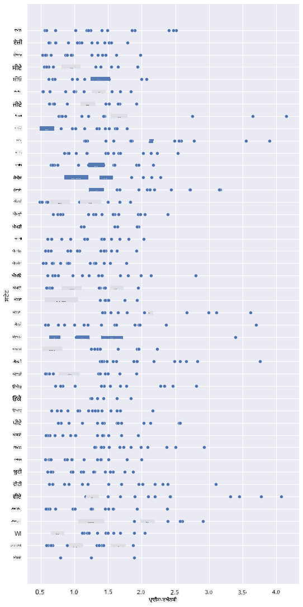
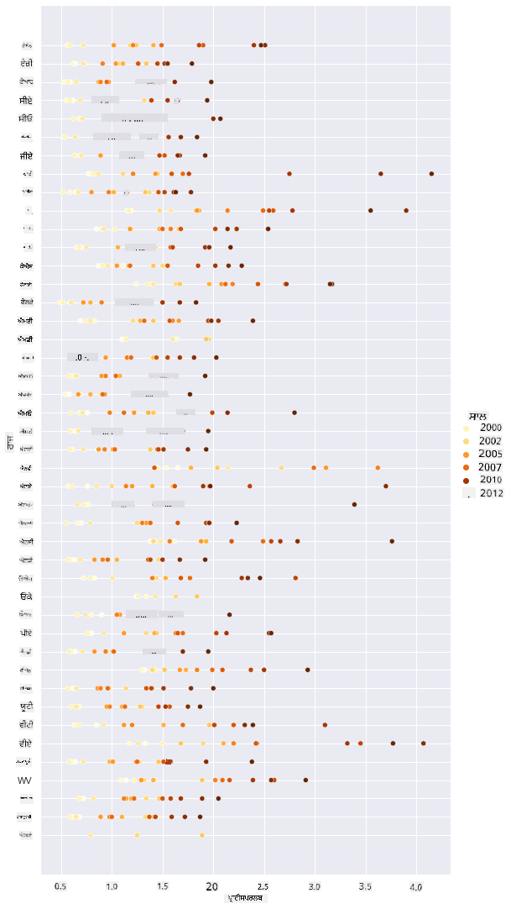
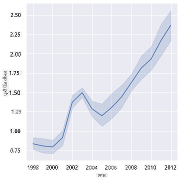
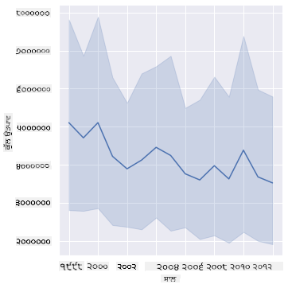
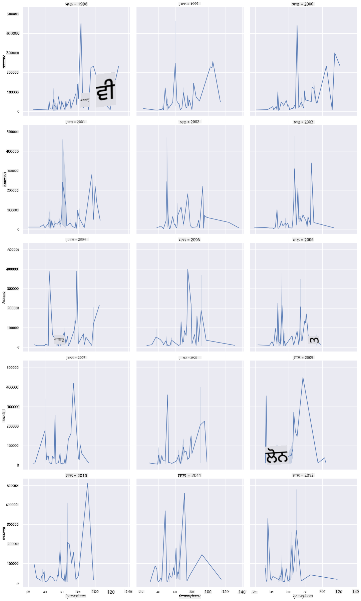
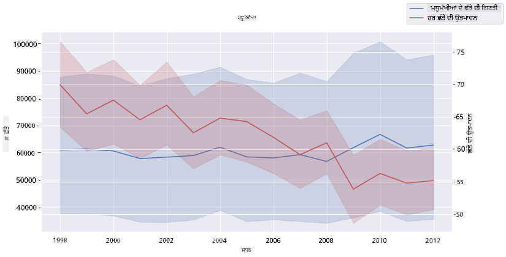

<!--
CO_OP_TRANSLATOR_METADATA:
{
  "original_hash": "0764fd4077f3f04a1d968ec371227744",
  "translation_date": "2025-09-06T11:34:32+00:00",
  "source_file": "3-Data-Visualization/12-visualization-relationships/README.md",
  "language_code": "pa"
}
-->
# ਰਿਸ਼ਤਿਆਂ ਦੀ ਦ੍ਰਿਸ਼ਟੀ: ਸ਼ਹਿਦ ਬਾਰੇ ਸਭ ਕੁਝ 🍯

|![ [(@sketchthedocs)] ਦੁਆਰਾ ਬਣਾਈ ਗਈ ਸਕੈਚਨੋਟ](https://sketchthedocs.dev) ](../../sketchnotes/12-Visualizing-Relationships.png)|
|:---:|
|ਰਿਸ਼ਤਿਆਂ ਦੀ ਦ੍ਰਿਸ਼ਟੀ - _[@nitya](https://twitter.com/nitya) ਦੁਆਰਾ ਬਣਾਈ ਗਈ ਸਕੈਚਨੋਟ_ |

ਸਾਡੇ ਖੋਜ ਦੇ ਕੁਦਰਤੀ ਕੇਂਦਰ ਨੂੰ ਜਾਰੀ ਰੱਖਦੇ ਹੋਏ, ਆਓ ਅਮਰੀਕਾ ਦੇ [ਕৃষੀ ਵਿਭਾਗ](https://www.nass.usda.gov/About_NASS/index.php) ਤੋਂ ਲਏ ਗਏ ਡਾਟਾਸੈੱਟ ਦੇ ਅਧਾਰ 'ਤੇ ਵੱਖ-ਵੱਖ ਕਿਸਮਾਂ ਦੇ ਸ਼ਹਿਦ ਦੇ ਰਿਸ਼ਤਿਆਂ ਨੂੰ ਦਰਸਾਉਣ ਲਈ ਦਿਲਚਸਪ ਦ੍ਰਿਸ਼ਟੀਕਰਨ ਖੋਜੀਏ।

ਇਹ ਡਾਟਾਸੈੱਟ, ਜੋ ਲਗਭਗ 600 ਆਈਟਮਾਂ 'ਤੇ ਆਧਾਰਿਤ ਹੈ, ਅਮਰੀਕਾ ਦੇ ਕਈ ਰਾਜਾਂ ਵਿੱਚ ਸ਼ਹਿਦ ਦੇ ਉਤਪਾਦਨ ਨੂੰ ਦਰਸਾਉਂਦਾ ਹੈ। ਉਦਾਹਰਣ ਲਈ, ਤੁਸੀਂ 1998-2012 ਦੇ ਸਮੇਂ ਵਿੱਚ ਕਿਸੇ ਦਿੱਤੇ ਗਏ ਰਾਜ ਵਿੱਚ ਸ਼ਹਿਦ ਦੇ ਉਤਪਾਦਨ ਦੇ ਸਾਲਾਨਾ ਅੰਕੜੇ ਦੇਖ ਸਕਦੇ ਹੋ, ਜਿਸ ਵਿੱਚ ਹਰ ਸਾਲ ਲਈ ਇੱਕ ਕਤਾਰ ਸ਼ਾਮਲ ਹੈ। ਇਸ ਵਿੱਚ ਕਾਲੋਨੀਆਂ ਦੀ ਗਿਣਤੀ, ਪ੍ਰਤੀ ਕਾਲੋਨੀ ਉਤਪਾਦਨ, ਕੁੱਲ ਉਤਪਾਦਨ, ਸਟਾਕ, ਪ੍ਰਤੀ ਪੌਂਡ ਕੀਮਤ, ਅਤੇ ਸ਼ਹਿਦ ਦੀ ਕੀਮਤ ਸ਼ਾਮਲ ਹੈ।

ਇਹ ਦਿਲਚਸਪ ਹੋਵੇਗਾ ਕਿ ਕਿਸੇ ਦਿੱਤੇ ਰਾਜ ਦੇ ਸਾਲਾਨਾ ਉਤਪਾਦਨ ਅਤੇ ਉਸ ਰਾਜ ਵਿੱਚ ਸ਼ਹਿਦ ਦੀ ਕੀਮਤ ਦੇ ਰਿਸ਼ਤੇ ਨੂੰ ਦ੍ਰਿਸ਼ਟੀਕਰਣ ਕੀਤਾ ਜਾਵੇ। ਵੱਖ-ਵੱਖ ਰਾਜਾਂ ਦੇ ਪ੍ਰਤੀ ਕਾਲੋਨੀ ਸ਼ਹਿਦ ਦੇ ਉਤਪਾਦਨ ਦੇ ਰਿਸ਼ਤੇ ਨੂੰ ਵੀ ਦ੍ਰਿਸ਼ਟੀਕਰਣ ਕੀਤਾ ਜਾ ਸਕਦਾ ਹੈ। ਇਹ ਸਮਾਂ 2006 ਵਿੱਚ ਪਹਿਲੀ ਵਾਰ ਦੇਖੇ ਗਏ 'ਕਾਲੋਨੀ ਕਾਲਾਪਸ ਡਿਸਆਰਡਰ' (http://npic.orst.edu/envir/ccd.html) ਨੂੰ ਕਵਰ ਕਰਦਾ ਹੈ, ਇਸ ਲਈ ਇਹ ਡਾਟਾਸੈੱਟ ਅਧਿਐਨ ਕਰਨ ਲਈ ਮਹੱਤਵਪੂਰਨ ਹੈ। 🐝

## [ਪ੍ਰੀ-ਲੈਕਚਰ ਕਵਿਜ਼](https://ff-quizzes.netlify.app/en/ds/quiz/22)

ਇਸ ਪਾਠ ਵਿੱਚ, ਤੁਸੀਂ Seaborn ਵਰਤ ਸਕਦੇ ਹੋ, ਜੋ ਤੁਸੀਂ ਪਹਿਲਾਂ ਵਰਤ ਚੁੱਕੇ ਹੋ, ਵੱਖ-ਵੱਖ ਚਰਾਂ ਦੇ ਰਿਸ਼ਤਿਆਂ ਨੂੰ ਦ੍ਰਿਸ਼ਟੀਕਰਣ ਕਰਨ ਲਈ ਇੱਕ ਚੰਗਾ ਲਾਇਬ੍ਰੇਰੀ ਹੈ। ਖਾਸ ਤੌਰ 'ਤੇ ਦਿਲਚਸਪ ਹੈ Seaborn ਦਾ `relplot` ਫੰਕਸ਼ਨ, ਜੋ ਸਾਧਾਰਨ ਤੌਰ 'ਤੇ '[ਸੰਖਿਆਕੀ ਰਿਸ਼ਤੇ](https://seaborn.pydata.org/tutorial/relational.html?highlight=relationships)' ਦਰਸਾਉਣ ਲਈ ਸਕੈਟਰ ਪਲਾਟ ਅਤੇ ਲਾਈਨ ਪਲਾਟ ਬਣਾਉਂਦਾ ਹੈ। ਇਹ ਡਾਟਾ ਸਾਇੰਟਿਸਟ ਨੂੰ ਚਰਾਂ ਦੇ ਆਪਸੀ ਰਿਸ਼ਤਿਆਂ ਨੂੰ ਬਿਹਤਰ ਸਮਝਣ ਵਿੱਚ ਮਦਦ ਕਰਦਾ ਹੈ।

## ਸਕੈਟਰਪਲਾਟ

ਸਕੈਟਰਪਲਾਟ ਦੀ ਵਰਤੋਂ ਕਰਕੇ ਦਰਸਾਓ ਕਿ ਸ਼ਹਿਦ ਦੀ ਕੀਮਤ ਸਾਲ ਦਰ ਸਾਲ, ਪ੍ਰਤੀ ਰਾਜ ਕਿਵੇਂ ਬਦਲੀ ਹੈ। Seaborn, `relplot` ਦੀ ਵਰਤੋਂ ਕਰਕੇ, ਰਾਜ ਦੇ ਡਾਟਾ ਨੂੰ ਸਮੂਹਬੱਧ ਕਰਦਾ ਹੈ ਅਤੇ ਸ਼੍ਰੇਣੀਬੱਧ ਅਤੇ ਸੰਖਿਆਕੀ ਡਾਟਾ ਲਈ ਡਾਟਾ ਪੌਇੰਟ ਦਿਖਾਉਂਦਾ ਹੈ।

ਆਓ ਡਾਟਾ ਅਤੇ Seaborn ਨੂੰ ਇੰਪੋਰਟ ਕਰਕੇ ਸ਼ੁਰੂ ਕਰੀਏ:

```python
import pandas as pd
import matplotlib.pyplot as plt
import seaborn as sns
honey = pd.read_csv('../../data/honey.csv')
honey.head()
```
ਤੁਸੀਂ ਨੋਟ ਕਰਦੇ ਹੋ ਕਿ ਸ਼ਹਿਦ ਦੇ ਡਾਟਾ ਵਿੱਚ ਕਈ ਦਿਲਚਸਪ ਕਾਲਮ ਹਨ, ਜਿਵੇਂ ਕਿ ਸਾਲ ਅਤੇ ਪ੍ਰਤੀ ਪੌਂਡ ਕੀਮਤ। ਆਓ ਇਸ ਡਾਟਾ ਨੂੰ ਅਮਰੀਕਾ ਦੇ ਰਾਜਾਂ ਦੁਆਰਾ ਸਮੂਹਬੱਧ ਕਰਕੇ ਖੋਜੀਏ:

| state | numcol | yieldpercol | totalprod | stocks   | priceperlb | prodvalue | year |
| ----- | ------ | ----------- | --------- | -------- | ---------- | --------- | ---- |
| AL    | 16000  | 71          | 1136000   | 159000   | 0.72       | 818000    | 1998 |
| AZ    | 55000  | 60          | 3300000   | 1485000  | 0.64       | 2112000   | 1998 |
| AR    | 53000  | 65          | 3445000   | 1688000  | 0.59       | 2033000   | 1998 |
| CA    | 450000 | 83          | 37350000  | 12326000 | 0.62       | 23157000  | 1998 |
| CO    | 27000  | 72          | 1944000   | 1594000  | 0.7        | 1361000   | 1998 |

ਸ਼ਹਿਦ ਦੀ ਕੀਮਤ ਅਤੇ ਉਸ ਦੇ ਅਮਰੀਕਾ ਦੇ ਰਾਜ ਦੇ ਮੂਲ ਦੇ ਰਿਸ਼ਤੇ ਨੂੰ ਦਰਸਾਉਣ ਲਈ ਇੱਕ ਬੁਨਿਆਦੀ ਸਕੈਟਰਪਲਾਟ ਬਣਾਓ। `y` ਧੁਰੇ ਨੂੰ ਇੰਨਾ ਉੱਚਾ ਬਣਾਓ ਕਿ ਸਾਰੇ ਰਾਜ ਦਿਖਾਈ ਦੇ ਸਕਣ:

```python
sns.relplot(x="priceperlb", y="state", data=honey, height=15, aspect=.5);
```


ਹੁਣ, ਸਾਲ ਦਰ ਸਾਲ ਸ਼ਹਿਦ ਦੀ ਕੀਮਤ ਦੇ ਵਿਕਾਸ ਨੂੰ ਦਰਸਾਉਣ ਲਈ ਸ਼ਹਿਦ ਦੇ ਰੰਗ ਦੀ ਯੋਜਨਾ ਨਾਲ ਉਹੀ ਡਾਟਾ ਦਿਖਾਓ। ਤੁਸੀਂ 'hue' ਪੈਰਾਮੀਟਰ ਸ਼ਾਮਲ ਕਰਕੇ ਇਹ ਕਰ ਸਕਦੇ ਹੋ:

> ✅ Seaborn ਵਿੱਚ ਵਰਤਣ ਲਈ [ਰੰਗ ਪੈਲੇਟਾਂ](https://seaborn.pydata.org/tutorial/color_palettes.html) ਬਾਰੇ ਹੋਰ ਜਾਣੋ - ਇੱਕ ਸੁੰਦਰ ਰੇਂਬੋ ਰੰਗ ਯੋਜਨਾ ਦੀ ਕੋਸ਼ਿਸ਼ ਕਰੋ!

```python
sns.relplot(x="priceperlb", y="state", hue="year", palette="YlOrBr", data=honey, height=15, aspect=.5);
```


ਇਸ ਰੰਗ ਯੋਜਨਾ ਦੇ ਬਦਲਾਅ ਨਾਲ, ਤੁਸੀਂ ਸਪਸ਼ਟ ਤੌਰ 'ਤੇ ਸਾਲ ਦਰ ਸਾਲ ਸ਼ਹਿਦ ਦੀ ਕੀਮਤ ਵਿੱਚ ਇੱਕ ਮਜ਼ਬੂਤ ਪ੍ਰਗਤੀ ਦੇਖ ਸਕਦੇ ਹੋ। ਜੇ ਤੁਸੀਂ ਡਾਟਾ ਦੇ ਨਮੂਨਾ ਸੈੱਟ ਨੂੰ ਜਾਂਚਣ ਲਈ (ਉਦਾਹਰਣ ਲਈ, ਅਰੀਜ਼ੋਨਾ) ਦੇਖੋ, ਤਾਂ ਤੁਸੀਂ ਸਾਲ ਦਰ ਸਾਲ ਕੀਮਤ ਵਿੱਚ ਵਾਧੇ ਦਾ ਪੈਟਰਨ ਦੇਖ ਸਕਦੇ ਹੋ, ਕੁਝ ਛੋਟੇ-ਮੋਟੇ ਅਪਵਾਦਾਂ ਦੇ ਨਾਲ:

| state | numcol | yieldpercol | totalprod | stocks  | priceperlb | prodvalue | year |
| ----- | ------ | ----------- | --------- | ------- | ---------- | --------- | ---- |
| AZ    | 55000  | 60          | 3300000   | 1485000 | 0.64       | 2112000   | 1998 |
| AZ    | 52000  | 62          | 3224000   | 1548000 | 0.62       | 1999000   | 1999 |
| AZ    | 40000  | 59          | 2360000   | 1322000 | 0.73       | 1723000   | 2000 |
| AZ    | 43000  | 59          | 2537000   | 1142000 | 0.72       | 1827000   | 2001 |
| AZ    | 38000  | 63          | 2394000   | 1197000 | 1.08       | 2586000   | 2002 |
| AZ    | 35000  | 72          | 2520000   | 983000  | 1.34       | 3377000   | 2003 |
| AZ    | 32000  | 55          | 1760000   | 774000  | 1.11       | 1954000   | 2004 |
| AZ    | 36000  | 50          | 1800000   | 720000  | 1.04       | 1872000   | 2005 |
| AZ    | 30000  | 65          | 1950000   | 839000  | 0.91       | 1775000   | 2006 |
| AZ    | 30000  | 64          | 1920000   | 902000  | 1.26       | 2419000   | 2007 |
| AZ    | 25000  | 64          | 1600000   | 336000  | 1.26       | 2016000   | 2008 |
| AZ    | 20000  | 52          | 1040000   | 562000  | 1.45       | 1508000   | 2009 |
| AZ    | 24000  | 77          | 1848000   | 665000  | 1.52       | 2809000   | 2010 |
| AZ    | 23000  | 53          | 1219000   | 427000  | 1.55       | 1889000   | 2011 |
| AZ    | 22000  | 46          | 1012000   | 253000  | 1.79       | 1811000   | 2012 |

ਰੰਗ ਦੀ ਬਜਾਏ ਆਕਾਰ ਦੀ ਵਰਤੋਂ ਕਰਕੇ ਇਸ ਪ੍ਰਗਤੀ ਨੂੰ ਦ੍ਰਿਸ਼ਟੀਕਰਣ ਕਰਨ ਦਾ ਇੱਕ ਹੋਰ ਤਰੀਕਾ ਹੈ। ਰੰਗ-ਅੰਧੇ ਉਪਭੋਗਤਾਵਾਂ ਲਈ, ਇਹ ਇੱਕ ਬਿਹਤਰ ਵਿਕਲਪ ਹੋ ਸਕਦਾ ਹੈ। ਆਪਣੇ ਦ੍ਰਿਸ਼ਟੀਕਰਣ ਨੂੰ ਸੋਧੋ ਤਾਂ ਜੋ ਕੀਮਤ ਵਿੱਚ ਵਾਧੇ ਨੂੰ ਡਾਟ ਦੇ ਘੇਰੇ ਵਿੱਚ ਵਾਧੇ ਦੁਆਰਾ ਦਰਸਾਇਆ ਜਾ ਸਕੇ:

```python
sns.relplot(x="priceperlb", y="state", size="year", data=honey, height=15, aspect=.5);
```
ਤੁਸੀਂ ਡਾਟ ਦੇ ਆਕਾਰ ਨੂੰ ਹੌਲੀ-ਹੌਲੀ ਵਧਦੇ ਹੋਏ ਦੇਖ ਸਕਦੇ ਹੋ।


ਕੀ ਇਹ ਸਪਲਾਈ ਅਤੇ ਡਿਮਾਂਡ ਦਾ ਸਧਾਰਨ ਮਾਮਲਾ ਹੈ? ਜਿਵੇਂ ਕਿ ਮੌਸਮ ਬਦਲਾਅ ਅਤੇ ਕਾਲੋਨੀ ਕਾਲਾਪਸ ਦੇ ਕਾਰਨ, ਕੀ ਸਾਲ ਦਰ ਸਾਲ ਖਰੀਦਣ ਲਈ ਘੱਟ ਸ਼ਹਿਦ ਉਪਲਬਧ ਹੈ, ਅਤੇ ਇਸ ਲਈ ਕੀਮਤ ਵਧਦੀ ਹੈ?

ਇਸ ਡਾਟਾਸੈੱਟ ਵਿੱਚ ਕੁਝ ਚਰਾਂ ਦੇ ਰਿਸ਼ਤੇ ਦੀ ਖੋਜ ਕਰਨ ਲਈ, ਆਓ ਕੁਝ ਲਾਈਨ ਚਾਰਟ ਖੋਜੀਏ।

## ਲਾਈਨ ਚਾਰਟ

ਸਵਾਲ: ਕੀ ਸਾਲ ਦਰ ਸਾਲ ਸ਼ਹਿਦ ਦੀ ਕੀਮਤ ਵਿੱਚ ਸਪਸ਼ਟ ਵਾਧਾ ਹੈ? ਤੁਸੀਂ ਇਸ ਨੂੰ ਸਭ ਤੋਂ ਆਸਾਨੀ ਨਾਲ ਇੱਕ ਸਿੰਗਲ ਲਾਈਨ ਚਾਰਟ ਬਣਾਕੇ ਖੋਜ ਸਕਦੇ ਹੋ:

```python
sns.relplot(x="year", y="priceperlb", kind="line", data=honey);
```
ਜਵਾਬ: ਹਾਂ, ਕੁਝ ਅਪਵਾਦਾਂ ਦੇ ਨਾਲ, ਖਾਸ ਤੌਰ 'ਤੇ 2003 ਦੇ ਆਸ-ਪਾਸ:



✅ ਕਿਉਂਕਿ Seaborn ਇੱਕ ਲਾਈਨ 'ਤੇ ਡਾਟਾ ਨੂੰ ਸਮੂਹਬੱਧ ਕਰ ਰਿਹਾ ਹੈ, ਇਹ "x ਮੁੱਲ 'ਤੇ ਕਈ ਮਾਪਾਂ ਨੂੰ ਦਰਸਾਉਣ ਲਈ ਮੀਨ ਅਤੇ ਮੀਨ ਦੇ ਆਸ-ਪਾਸ 95% ਭਰੋਸੇਯੋਗ ਅੰਤਰ" ਦਿਖਾਉਂਦਾ ਹੈ। [ਸਰੋਤ](https://seaborn.pydata.org/tutorial/relational.html)। ਇਸ ਸਮਾਂ-ਖਪਤ ਵਿਵਹਾਰ ਨੂੰ `ci=None` ਸ਼ਾਮਲ ਕਰਕੇ ਅਯੋਗ ਕੀਤਾ ਜਾ ਸਕਦਾ ਹੈ।

ਸਵਾਲ: ਖੈਰ, 2003 ਵਿੱਚ ਕੀ ਤੁਸੀਂ ਸ਼ਹਿਦ ਦੀ ਸਪਲਾਈ ਵਿੱਚ ਵੀ ਵਾਧਾ ਦੇਖ ਸਕਦੇ ਹੋ? ਜੇ ਤੁਸੀਂ ਸਾਲ ਦਰ ਸਾਲ ਕੁੱਲ ਉਤਪਾਦਨ ਨੂੰ ਦੇਖੋ ਤਾਂ ਕੀ ਹੋਵੇਗਾ?

```python
sns.relplot(x="year", y="totalprod", kind="line", data=honey);
```



ਜਵਾਬ: ਸੱਚਮੁੱਚ ਨਹੀਂ। ਜੇ ਤੁਸੀਂ ਕੁੱਲ ਉਤਪਾਦਨ ਨੂੰ ਦੇਖੋ, ਤਾਂ ਇਹ ਵਿਸ਼ੇਸ਼ ਸਾਲ ਵਿੱਚ ਵਾਧੇ ਵਿੱਚ ਦਿਖਾਈ ਦਿੰਦਾ ਹੈ, ਹਾਲਾਂਕਿ ਆਮ ਤੌਰ 'ਤੇ ਸ਼ਹਿਦ ਦੇ ਉਤਪਾਦਨ ਦੀ ਮਾਤਰਾ ਇਨ੍ਹਾਂ ਸਾਲਾਂ ਦੌਰਾਨ ਘਟ ਰਹੀ ਹੈ।

ਸਵਾਲ: ਇਸ ਮਾਮਲੇ ਵਿੱਚ, 2003 ਦੇ ਆਸ-ਪਾਸ ਸ਼ਹਿਦ ਦੀ ਕੀਮਤ ਵਿੱਚ ਵਾਧੇ ਦਾ ਕਾਰਨ ਕੀ ਹੋ ਸਕਦਾ ਹੈ?

ਇਸ ਨੂੰ ਖੋਜਣ ਲਈ, ਤੁਸੀਂ ਇੱਕ ਫੈਸਿਟ ਗ੍ਰਿਡ ਦੀ ਖੋਜ ਕਰ ਸਕਦੇ ਹੋ।

## ਫੈਸਿਟ ਗ੍ਰਿਡ

ਫੈਸਿਟ ਗ੍ਰਿਡ ਤੁਹਾਡੇ ਡਾਟਾਸੈੱਟ ਦੇ ਇੱਕ ਫੈਸਿਟ (ਸਾਡੇ ਮਾਮਲੇ ਵਿੱਚ, ਤੁਸੀਂ 'ਸਾਲ' ਚੁਣ ਸਕਦੇ ਹੋ) ਨੂੰ ਲੈਂਦਾ ਹੈ। Seaborn ਫਿਰ ਤੁਹਾਡੇ ਚੁਣੇ ਗਏ x ਅਤੇ y ਕੋਆਰਡੀਨੇਟਾਂ ਲਈ ਹਰ ਫੈਸਿਟ ਲਈ ਇੱਕ ਪਲਾਟ ਬਣਾਉਂਦਾ ਹੈ, ਜੋ ਸੌਖੇ ਦ੍ਰਿਸ਼ਟੀਕਰਣ ਦੀ ਤੁਲਨਾ ਲਈ ਹੈ। ਕੀ 2003 ਇਸ ਕਿਸਮ ਦੀ ਤੁਲਨਾ ਵਿੱਚ ਖਾਸ ਦਿਖਾਈ ਦਿੰਦਾ ਹੈ?

ਫੈਸਿਟ ਗ੍ਰਿਡ ਬਣਾਉਣ ਲਈ `relplot` ਦੀ ਵਰਤੋਂ ਜਾਰੀ ਰੱਖੋ ਜਿਵੇਂ ਕਿ [Seaborn ਦੀ ਦਸਤਾਵੇਜ਼](https://seaborn.pydata.org/generated/seaborn.FacetGrid.html?highlight=facetgrid#seaborn.FacetGrid) ਵਿੱਚ ਸਿਫਾਰਸ਼ ਕੀਤੀ ਗਈ ਹੈ।

```python
sns.relplot(
    data=honey, 
    x="yieldpercol", y="numcol",
    col="year", 
    col_wrap=3,
    kind="line"
    )
```
ਇਸ ਦ੍ਰਿਸ਼ਟੀਕਰਣ ਵਿੱਚ, ਤੁਸੀਂ ਸਾਲ ਦਰ ਸਾਲ ਅਤੇ ਰਾਜ ਦਰ ਰਾਜ ਪ੍ਰਤੀ ਕਾਲੋਨੀ ਉਤਪਾਦਨ ਅਤੇ ਕਾਲੋਨੀਆਂ ਦੀ ਗਿਣਤੀ ਦੀ ਤੁਲਨਾ ਕਰ ਸਕਦੇ ਹੋ, ਕਾਲਮਾਂ ਲਈ 3 'ਤੇ ਰੈਪ ਸੈਟ ਕਰਕੇ:



ਇਸ ਡਾਟਾਸੈੱਟ ਲਈ, ਸਾਲ ਦਰ ਸਾਲ ਅਤੇ ਰਾਜ ਦਰ ਰਾਜ ਕਾਲੋਨੀਆਂ ਦੀ ਗਿਣਤੀ ਅਤੇ ਉਨ੍ਹਾਂ ਦੇ ਉਤਪਾਦਨ ਵਿੱਚ ਕੁਝ ਵਿਸ਼ੇਸ਼ ਦਿਖਾਈ ਨਹੀਂ ਦਿੰਦਾ। ਕੀ ਇਹ ਦੋ ਚਰਾਂ ਦੇ ਰਿਸ਼ਤੇ ਨੂੰ ਖੋਜਣ ਲਈ ਦੇਖਣ ਦਾ ਇੱਕ ਵੱਖਰਾ ਤਰੀਕਾ ਹੈ?

## ਡੁਅਲ-ਲਾਈਨ ਪਲਾਟ

ਦੋ ਲਾਈਨਪਲਾਟ ਨੂੰ ਇੱਕ ਦੂਜੇ ਦੇ ਉੱਤੇ ਸਪਰਿੰਪੋਜ਼ ਕਰਕੇ, Seaborn ਦੇ 'despine' ਦੀ ਵਰਤੋਂ ਕਰਕੇ ਉਨ੍ਹਾਂ ਦੇ ਉੱਪਰਲੇ ਅਤੇ ਸੱਜੇ ਸਪਾਈਨ ਨੂੰ ਹਟਾਉਣ ਅਤੇ `ax.twinx` ਦੀ ਵਰਤੋਂ ਕਰਕੇ [Matplotlib ਤੋਂ ਲਿਆ ਗਿਆ](https://matplotlib.org/stable/api/_as_gen/matplotlib.axes.Axes.twinx.html)। Twinx ਇੱਕ ਚਾਰਟ ਨੂੰ x ਧੁਰੇ ਨੂੰ ਸਾਂਝਾ ਕਰਨ ਅਤੇ ਦੋ y ਧੁਰੇ ਦਿਖਾਉਣ ਦੀ ਆਗਿਆ ਦਿੰਦਾ ਹੈ। ਇਸ ਲਈ, ਪ੍ਰਤੀ ਕਾਲੋਨੀ ਉਤਪਾਦਨ ਅਤੇ ਕਾਲੋਨੀਆਂ ਦੀ ਗਿਣਤੀ ਦਿਖਾਓ, ਸਪਰਿੰਪੋਜ਼ ਕੀਤਾ:

```python
fig, ax = plt.subplots(figsize=(12,6))
lineplot = sns.lineplot(x=honey['year'], y=honey['numcol'], data=honey, 
                        label = 'Number of bee colonies', legend=False)
sns.despine()
plt.ylabel('# colonies')
plt.title('Honey Production Year over Year');

ax2 = ax.twinx()
lineplot2 = sns.lineplot(x=honey['year'], y=honey['yieldpercol'], ax=ax2, color="r", 
                         label ='Yield per colony', legend=False) 
sns.despine(right=False)
plt.ylabel('colony yield')
ax.figure.legend();
```


ਹਾਲਾਂਕਿ 2003 ਦੇ ਆਸ-ਪਾਸ ਕੁਝ ਵੀ ਸਪਸ਼ਟ ਤੌਰ 'ਤੇ ਦਿਖਾਈ ਨਹੀਂ ਦਿੰਦਾ, ਇਹ ਸਾਨੂੰ ਇਸ ਪਾਠ ਨੂੰ ਇੱਕ ਖੁਸ਼ੀਦਾਇਕ ਨੋਟ 'ਤੇ ਖਤਮ ਕਰਨ ਦੀ ਆਗਿਆ ਦਿੰਦਾ ਹੈ: ਹਾਲਾਂਕਿ ਕਾਲੋਨੀਆਂ ਦੀ ਗਿਣਤੀ ਵਿੱਚ ਕੁੱਲ ਘਟਾਅ ਹੈ, ਕਾਲੋਨੀਆਂ ਦੀ ਗਿਣਤੀ ਸਥਿਰ ਹੋ ਰਹੀ ਹੈ, ਭਾਵੇਂ ਉਨ੍ਹਾਂ ਦਾ ਪ੍ਰਤੀ ਕਾਲੋਨੀ ਉਤਪਾਦਨ ਘਟ ਰਿਹਾ ਹੈ।

ਜਾਓ, ਮੱਖੀਆਂ, ਜਾਓ!

🐝❤️
## 🚀 ਚੁਣੌਤੀ

ਇਸ ਪਾਠ ਵਿੱਚ, ਤੁਸੀਂ ਸਕੈਟਰਪਲਾਟ ਅਤੇ ਲਾਈਨ ਗ੍ਰਿਡਾਂ ਦੇ ਹੋਰ ਵਰਤੋਂ ਬਾਰੇ ਕੁਝ ਹੋਰ ਸਿੱਖਿਆ, ਜਿਸ ਵਿੱਚ ਫੈਸਿਟ ਗ੍ਰਿਡ ਸ਼ਾਮਲ ਹਨ। ਆਪਣੇ ਆਪ ਨੂੰ ਇੱਕ ਵੱਖਰੇ ਡਾਟਾਸੈੱਟ ਦੀ ਵਰਤੋਂ ਕਰਕੇ ਫੈਸਿਟ ਗ੍ਰਿਡ ਬਣਾਉਣ ਦੀ ਚੁਣੌਤੀ ਦਿਓ, ਸ਼ਾਇਦ ਉਹ ਜੋ ਤੁਸੀਂ ਪਹਿਲਾਂ ਪਾਠਾਂ ਵਿੱਚ ਵਰਤਿਆ ਸੀ। ਨੋਟ ਕਰੋ ਕਿ ਇਹ ਬਣਾਉਣ ਵਿੱਚ ਕਿੰਨਾ ਸਮਾਂ ਲੱਗਦਾ ਹੈ ਅਤੇ ਤੁਸੀਂ ਕਿੰਨੀ ਗ੍ਰਿਡਾਂ ਬਣਾਉਣ ਦੀ ਜ਼ਰੂਰਤ ਹੈ।

## [ਪੋਸਟ-ਲੈਕਚਰ ਕਵਿਜ਼](https

---

**ਅਸਵੀਕਰਤੀ**:  
ਇਹ ਦਸਤਾਵੇਜ਼ AI ਅਨੁਵਾਦ ਸੇਵਾ [Co-op Translator](https://github.com/Azure/co-op-translator) ਦੀ ਵਰਤੋਂ ਕਰਕੇ ਅਨੁਵਾਦ ਕੀਤਾ ਗਿਆ ਹੈ। ਜਦੋਂ ਕਿ ਅਸੀਂ ਸਹੀ ਹੋਣ ਦਾ ਯਤਨ ਕਰਦੇ ਹਾਂ, ਕਿਰਪਾ ਕਰਕੇ ਧਿਆਨ ਦਿਓ ਕਿ ਸਵੈਚਾਲਿਤ ਅਨੁਵਾਦਾਂ ਵਿੱਚ ਗਲਤੀਆਂ ਜਾਂ ਅਸੁੱਚਤਤਾਵਾਂ ਹੋ ਸਕਦੀਆਂ ਹਨ। ਇਸ ਦੀ ਮੂਲ ਭਾਸ਼ਾ ਵਿੱਚ ਮੌਜੂਦ ਮੂਲ ਦਸਤਾਵੇਜ਼ ਨੂੰ ਪ੍ਰਮਾਣਿਕ ਸਰੋਤ ਮੰਨਿਆ ਜਾਣਾ ਚਾਹੀਦਾ ਹੈ। ਮਹੱਤਵਪੂਰਨ ਜਾਣਕਾਰੀ ਲਈ, ਪੇਸ਼ੇਵਰ ਮਨੁੱਖੀ ਅਨੁਵਾਦ ਦੀ ਸਿਫਾਰਸ਼ ਕੀਤੀ ਜਾਂਦੀ ਹੈ। ਇਸ ਅਨੁਵਾਦ ਦੀ ਵਰਤੋਂ ਤੋਂ ਪੈਦਾ ਹੋਣ ਵਾਲੇ ਕਿਸੇ ਵੀ ਗਲਤਫਹਿਮੀ ਜਾਂ ਗਲਤ ਵਿਆਖਿਆ ਲਈ ਅਸੀਂ ਜ਼ਿੰਮੇਵਾਰ ਨਹੀਂ ਹਾਂ।  