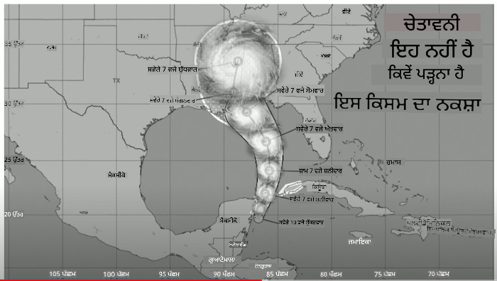
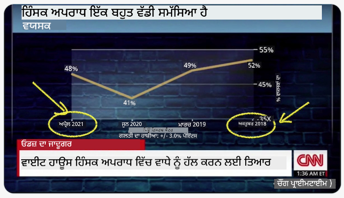
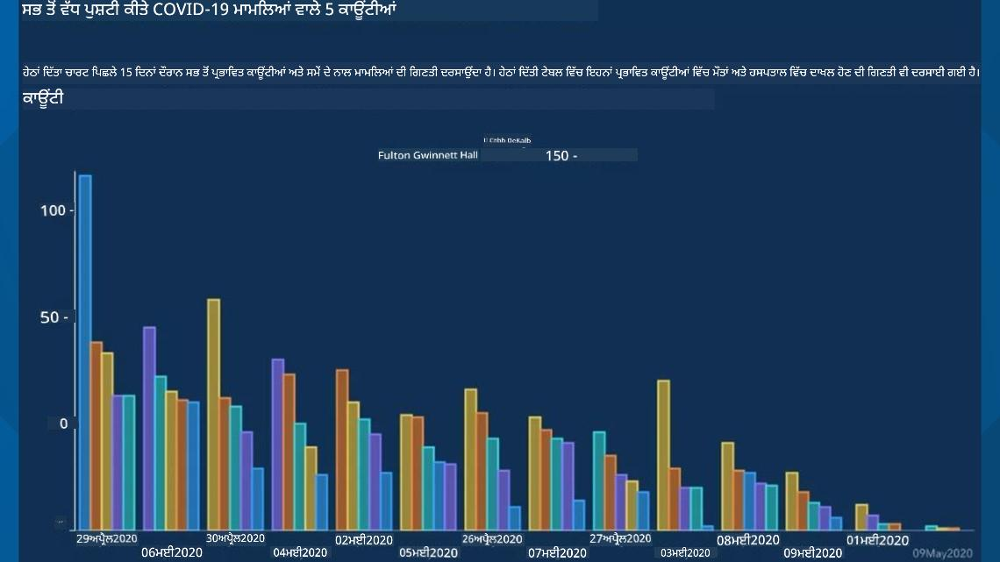
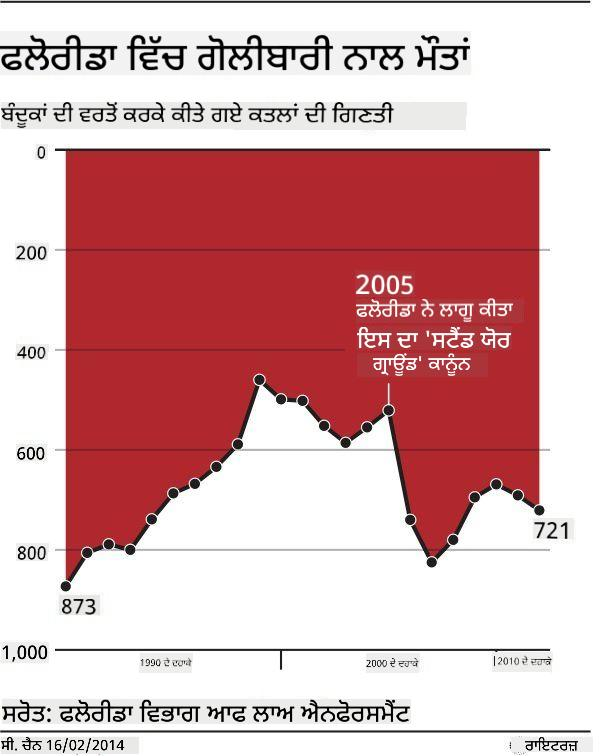
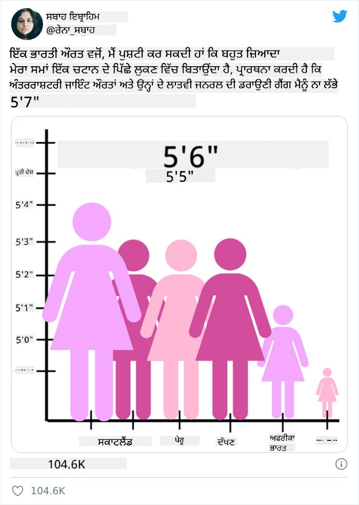
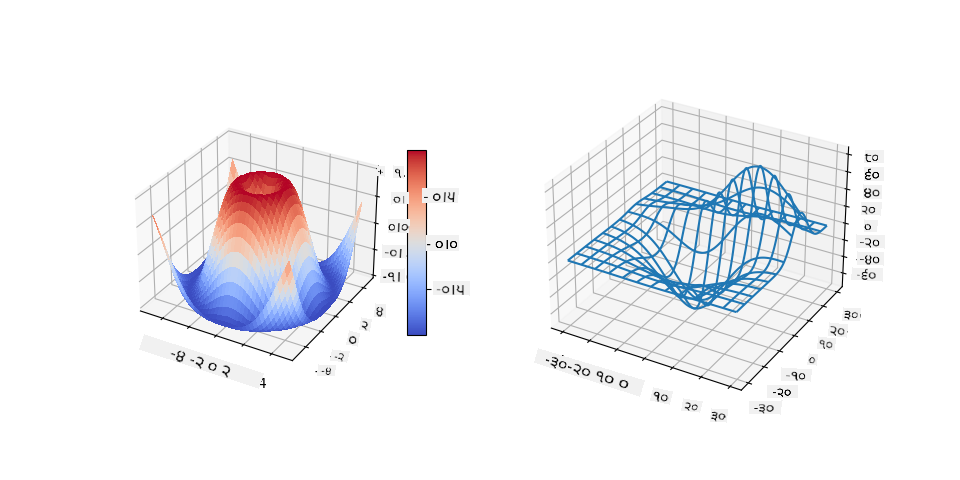
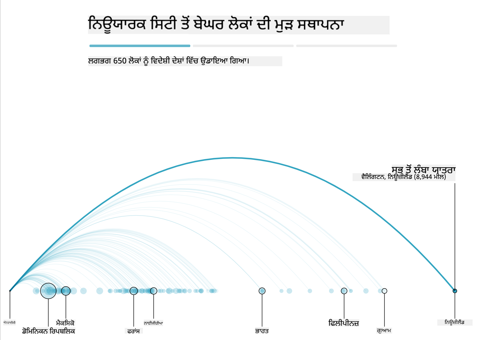

<!--
CO_OP_TRANSLATOR_METADATA:
{
  "original_hash": "4ec4747a9f4f7d194248ea29903ae165",
  "translation_date": "2025-08-27T18:13:31+00:00",
  "source_file": "3-Data-Visualization/13-meaningful-visualizations/README.md",
  "language_code": "pa"
}
-->
# ਮਾਨਾਂਵਾਂ ਭਰਪੂਰ ਵਿਜੁਅਲਾਈਜ਼ੇਸ਼ਨ ਬਣਾਉਣਾ

| ਵੱਲੋਂ ਬਣਾਈ ਗਈ ਸਕੈਚਨੋਟ ](../../sketchnotes/13-MeaningfulViz.png)|
|:---:|
| ਮਾਨਾਂਵਾਂ ਭਰਪੂਰ ਵਿਜੁਅਲਾਈਜ਼ੇਸ਼ਨ - _[@nitya](https://twitter.com/nitya) ਵੱਲੋਂ ਸਕੈਚਨੋਟ_ |

> "ਜੇ ਤੁਸੀਂ ਡਾਟਾ ਨੂੰ ਕਾਫ਼ੀ ਸਮੇਂ ਤੱਕ ਤੰਗ ਕਰੋ, ਤਾਂ ਇਹ ਕੁਝ ਵੀ ਕਬੂਲ ਕਰ ਲਵੇਗਾ" -- [ਰੋਨਾਲਡ ਕੋਸ](https://en.wikiquote.org/wiki/Ronald_Coase)

ਡਾਟਾ ਸਾਇੰਸਟ ਦਾ ਇੱਕ ਮੁੱਖ ਹੁਨਰ ਇਹ ਹੈ ਕਿ ਉਹ ਅਰਥਪੂਰਨ ਡਾਟਾ ਵਿਜੁਅਲਾਈਜ਼ੇਸ਼ਨ ਬਣਾਉਣ ਦੇ ਯੋਗ ਹੋਵੇ ਜੋ ਤੁਹਾਡੇ ਸਵਾਲਾਂ ਦੇ ਜਵਾਬ ਦੇਣ ਵਿੱਚ ਮਦਦ ਕਰੇ। ਡਾਟਾ ਨੂੰ ਵਿਜੁਅਲਾਈਜ਼ ਕਰਨ ਤੋਂ ਪਹਿਲਾਂ, ਇਹ ਯਕੀਨੀ ਬਣਾਉਣਾ ਜ਼ਰੂਰੀ ਹੈ ਕਿ ਤੁਸੀਂ ਇਸਨੂੰ ਪਿਛਲੇ ਪਾਠਾਂ ਵਿੱਚ ਸਾਫ਼ ਅਤੇ ਤਿਆਰ ਕੀਤਾ ਹੈ। ਇਸ ਤੋਂ ਬਾਅਦ, ਤੁਸੀਂ ਇਹ ਫੈਸਲਾ ਕਰ ਸਕਦੇ ਹੋ ਕਿ ਡਾਟਾ ਨੂੰ ਸਭ ਤੋਂ ਵਧੀਆ ਤਰੀਕੇ ਨਾਲ ਕਿਵੇਂ ਪੇਸ਼ ਕਰਨਾ ਹੈ।

ਇਸ ਪਾਠ ਵਿੱਚ, ਤੁਸੀਂ ਸਮੀਖਿਆ ਕਰੋਗੇ:

1. ਸਹੀ ਚਾਰਟ ਕਿਸਮ ਕਿਵੇਂ ਚੁਣੀ ਜਾਵੇ
2. ਧੋਖੇਬਾਜ਼ ਚਾਰਟਿੰਗ ਤੋਂ ਕਿਵੇਂ ਬਚਿਆ ਜਾਵੇ
3. ਰੰਗਾਂ ਨਾਲ ਕਿਵੇਂ ਕੰਮ ਕੀਤਾ ਜਾਵੇ
4. ਪੜ੍ਹਨਯੋਗਤਾ ਲਈ ਚਾਰਟਾਂ ਨੂੰ ਕਿਵੇਂ ਸਜਾਇਆ ਜਾਵੇ
5. ਐਨੀਮੇਟਡ ਜਾਂ 3D ਚਾਰਟਿੰਗ ਹੱਲ ਕਿਵੇਂ ਬਣਾਏ ਜਾਣ
6. ਰਚਨਾਤਮਕ ਵਿਜੁਅਲਾਈਜ਼ੇਸ਼ਨ ਕਿਵੇਂ ਬਣਾਈ ਜਾਵੇ

## [ਪਾਠ-ਪਹਿਲਾਂ ਕਵਿਜ਼](https://purple-hill-04aebfb03.1.azurestaticapps.net/quiz/24)

## ਸਹੀ ਚਾਰਟ ਕਿਸਮ ਚੁਣੋ

ਪਿਛਲੇ ਪਾਠਾਂ ਵਿੱਚ, ਤੁਸੀਂ Matplotlib ਅਤੇ Seaborn ਵਰਗੇ ਟੂਲਾਂ ਦੀ ਵਰਤੋਂ ਕਰਕੇ ਕਈ ਕਿਸਮ ਦੇ ਦਿਲਚਸਪ ਡਾਟਾ ਵਿਜੁਅਲਾਈਜ਼ੇਸ਼ਨ ਬਣਾਉਣ ਦਾ ਅਨੁਭਵ ਕੀਤਾ। ਆਮ ਤੌਰ 'ਤੇ, ਤੁਸੀਂ ਆਪਣੇ ਸਵਾਲ ਦੇ ਅਨੁਸਾਰ ਸਹੀ [ਚਾਰਟ ਦੀ ਕਿਸਮ](https://chartio.com/learn/charts/how-to-select-a-data-vizualization/) ਇਸ ਤਰ੍ਹਾਂ ਚੁਣ ਸਕਦੇ ਹੋ:

| ਤੁਹਾਨੂੰ ਇਹ ਕਰਨ ਦੀ ਲੋੜ ਹੈ:       | ਤੁਹਾਨੂੰ ਇਹ ਵਰਤਣਾ ਚਾਹੀਦਾ ਹੈ:         |
| -------------------------- | ------------------------------- |
| ਸਮੇਂ ਦੇ ਨਾਲ ਡਾਟਾ ਰੁਝਾਨ ਦਿਖਾਉਣਾ | ਲਾਈਨ                            |
| ਸ਼੍ਰੇਣੀਆਂ ਦੀ ਤੁਲਨਾ ਕਰਨੀ ਹੈ     | ਬਾਰ, ਪਾਈ                        |
| ਕੁੱਲ ਦੀ ਤੁਲਨਾ ਕਰਨੀ ਹੈ         | ਪਾਈ, ਸਟੈਕਡ ਬਾਰ                |
| ਸੰਬੰਧ ਦਿਖਾਉਣਾ ਹੈ            | ਸਕੈਟਰ, ਲਾਈਨ, ਫੈਸਿਟ, ਡੁਅਲ ਲਾਈਨ |
| ਵੰਡ ਦਿਖਾਉਣੀ ਹੈ             | ਸਕੈਟਰ, ਹਿਸਟੋਗ੍ਰਾਮ, ਬਾਕਸ         |
| ਅਨੁਪਾਤ ਦਿਖਾਉਣਾ ਹੈ           | ਪਾਈ, ਡੋਨਟ, ਵਾਫਲ              |

> ✅ ਤੁਹਾਡੇ ਡਾਟਾ ਦੀ ਬਣਾਵਟ ਦੇ ਅਨੁਸਾਰ, ਤੁਹਾਨੂੰ ਇਸਨੂੰ ਟੈਕਸਟ ਤੋਂ ਨੰਬਰਿਕ ਵਿੱਚ ਬਦਲਣ ਦੀ ਲੋੜ ਹੋ ਸਕਦੀ ਹੈ ਤਾਂ ਜੋ ਚਾਰਟ ਇਸਨੂੰ ਸਹਿਯੋਗ ਦੇ ਸਕੇ।

## ਧੋਖੇਬਾਜ਼ੀ ਤੋਂ ਬਚੋ

ਭਾਵੇਂ ਡਾਟਾ ਸਾਇੰਸਟ ਸਹੀ ਡਾਟਾ ਲਈ ਸਹੀ ਚਾਰਟ ਚੁਣਨ ਵਿੱਚ ਸਾਵਧਾਨ ਹੋਵੇ, ਫਿਰ ਵੀ ਕਈ ਤਰੀਕੇ ਹਨ ਜਿਨ੍ਹਾਂ ਨਾਲ ਡਾਟਾ ਨੂੰ ਇਸ ਤਰ੍ਹਾਂ ਪੇਸ਼ ਕੀਤਾ ਜਾ ਸਕਦਾ ਹੈ ਕਿ ਇਹ ਕਿਸੇ ਨਤੀਜੇ ਨੂੰ ਸਾਬਤ ਕਰੇ, ਪਰ ਇਸ ਨਾਲ ਡਾਟਾ ਦੀ ਸੱਚਾਈ ਨੂੰ ਨੁਕਸਾਨ ਪਹੁੰਚ ਸਕਦਾ ਹੈ। ਧੋਖੇਬਾਜ਼ ਚਾਰਟਾਂ ਅਤੇ ਇਨਫੋਗ੍ਰਾਫਿਕਸ ਦੇ ਕਈ ਉਦਾਹਰਨ ਹਨ!

[](https://www.youtube.com/watch?v=oX74Nge8Wkw "ਹਾਊ ਚਾਰਟਸ ਲਾਈ")

> 🎥 ਉੱਪਰ ਦਿੱਤੀ ਤਸਵੀਰ 'ਤੇ ਕਲਿੱਕ ਕਰੋ ਧੋਖੇਬਾਜ਼ ਚਾਰਟਾਂ ਬਾਰੇ ਕਾਨਫਰੰਸ ਟਾਕ ਦੇਖਣ ਲਈ

ਇਹ ਚਾਰਟ X ਧੁਰੇ ਨੂੰ ਉਲਟਾ ਦਿਖਾਉਂਦਾ ਹੈ ਤਾਂ ਜੋ ਸੱਚ ਦੇ ਉਲਟ ਦਿਖਾਇਆ ਜਾਵੇ, ਮਿਤੀ ਦੇ ਆਧਾਰ 'ਤੇ:



[ਇਹ ਚਾਰਟ](https://media.firstcoastnews.com/assets/WTLV/images/170ae16f-4643-438f-b689-50d66ca6a8d8/170ae16f-4643-438f-b689-50d66ca6a8d8_1140x641.jpg) ਹੋਰ ਵੀ ਧੋਖੇਬਾਜ਼ ਹੈ, ਕਿਉਂਕਿ ਅੱਖ ਸੱਜੇ ਪਾਸੇ ਖਿੱਚੀ ਜਾਂਦੀ ਹੈ ਇਹ ਨਤੀਜਾ ਕੱਢਣ ਲਈ ਕਿ ਸਮੇਂ ਦੇ ਨਾਲ COVID ਕੇਸ ਘਟੇ ਹਨ। ਪਰ ਜੇ ਤੁਸੀਂ ਮਿਤੀਆਂ ਨੂੰ ਧਿਆਨ ਨਾਲ ਦੇਖੋ, ਤਾਂ ਪਤਾ ਲੱਗਦਾ ਹੈ ਕਿ ਉਹਨਾਂ ਨੂੰ ਧੋਖੇਬਾਜ਼ੀ ਨਾਲ ਦੁਬਾਰਾ ਕ੍ਰਮਬੱਧ ਕੀਤਾ ਗਿਆ ਹੈ।



ਇਹ ਮਸ਼ਹੂਰ ਉਦਾਹਰਨ ਰੰਗ ਅਤੇ ਉਲਟੇ Y ਧੁਰੇ ਦੀ ਵਰਤੋਂ ਕਰਦੀ ਹੈ ਧੋਖਾ ਦੇਣ ਲਈ: ਬਜਾਏ ਇਸ ਨਤੀਜੇ 'ਤੇ ਪਹੁੰਚਣ ਦੇ ਕਿ ਗਨ ਕਾਨੂੰਨ ਪਾਸ ਹੋਣ ਤੋਂ ਬਾਅਦ ਗਨ ਮੌਤਾਂ ਵਧੀਆਂ, ਅਸਲ ਵਿੱਚ ਅੱਖ ਨੂੰ ਧੋਖਾ ਦਿੱਤਾ ਜਾਂਦਾ ਹੈ ਕਿ ਇਸਦਾ ਉਲਟ ਸੱਚ ਹੈ:



ਇਹ ਅਜੀਬ ਚਾਰਟ ਦਿਖਾਉਂਦਾ ਹੈ ਕਿ ਅਨੁਪਾਤ ਨੂੰ ਕਿਵੇਂ ਮਜ਼ਾਕੀਆ ਤਰੀਕੇ ਨਾਲ ਮੋੜਿਆ ਜਾ ਸਕਦਾ ਹੈ:



ਅਤੁਲਨਾਤਮਕ ਚੀਜ਼ਾਂ ਦੀ ਤੁਲਨਾ ਕਰਨਾ ਇੱਕ ਹੋਰ ਧੋਖੇਬਾਜ਼ ਤਰੀਕਾ ਹੈ। ਇੱਕ [ਸ਼ਾਨਦਾਰ ਵੈੱਬਸਾਈਟ](https://tylervigen.com/spurious-correlations) 'ਸਪਿਊਰੀਅਸ ਕੋਰਲੇਸ਼ਨਜ਼' ਬਾਰੇ ਹੈ ਜੋ 'ਤੱਥਾਂ' ਨੂੰ ਦਿਖਾਉਂਦੀ ਹੈ ਜਿਵੇਂ ਕਿ ਮੈਨ ਵਿੱਚ ਤਲਾਕ ਦੀ ਦਰ ਅਤੇ ਮਾਰਜਰੀਨ ਦੀ ਖਪਤ। ਇੱਕ Reddit ਗਰੁੱਪ ਵੀ ਡਾਟਾ ਦੇ [ਖਰਾਬ ਉਪਯੋਗ](https://www.reddit.com/r/dataisugly/top/?t=all) ਨੂੰ ਇਕੱਠਾ ਕਰਦਾ ਹੈ।

ਇਹ ਸਮਝਣਾ ਮਹੱਤਵਪੂਰਨ ਹੈ ਕਿ ਅੱਖ ਨੂੰ ਕਿਵੇਂ ਆਸਾਨੀ ਨਾਲ ਧੋਖਾ ਦਿੱਤਾ ਜਾ ਸਕਦਾ ਹੈ। ਭਾਵੇਂ ਡਾਟਾ ਸਾਇੰਸਟ ਦੀ ਨੀਅਤ ਚੰਗੀ ਹੋਵੇ, ਪਰ ਖਰਾਬ ਚਾਰਟ ਦੀ ਕਿਸਮ ਚੁਣਨਾ, ਜਿਵੇਂ ਕਿ ਬਹੁਤ ਸਾਰੀਆਂ ਸ਼੍ਰੇਣੀਆਂ ਵਾਲਾ ਪਾਈ ਚਾਰਟ, ਧੋਖੇਬਾਜ਼ੀ ਹੋ ਸਕਦੀ ਹੈ।

## ਰੰਗ

ਤੁਸੀਂ ਉੱਪਰ ਦਿੱਤੇ 'ਫਲੋਰੀਡਾ ਗਨ ਵਾਇਲੈਂਸ' ਚਾਰਟ ਵਿੱਚ ਦੇਖਿਆ ਕਿ ਰੰਗ ਕਿਵੇਂ ਚਾਰਟਾਂ ਵਿੱਚ ਇੱਕ ਵਾਧੂ ਅਰਥ ਦੀ ਪਰਤ ਜੋੜ ਸਕਦੇ ਹਨ, ਖਾਸ ਕਰਕੇ ਉਹਨਾਂ ਵਿੱਚ ਜੋ Matplotlib ਅਤੇ Seaborn ਵਰਗੀਆਂ ਲਾਇਬ੍ਰੇਰੀਆਂ ਦੀ ਵਰਤੋਂ ਕਰਕੇ ਨਹੀਂ ਬਣਾਏ ਗਏ। ਜੇ ਤੁਸੀਂ ਹੱਥੋਂ ਚਾਰਟ ਬਣਾ ਰਹੇ ਹੋ, ਤਾਂ [ਰੰਗ ਸਿਧਾਂਤ](https://colormatters.com/color-and-design/basic-color-theory) ਦਾ ਥੋੜ੍ਹਾ ਅਧਿਐਨ ਕਰੋ।

> ✅ ਚਾਰਟ ਡਿਜ਼ਾਈਨ ਕਰਦੇ ਸਮੇਂ, ਇਹ ਯਾਦ ਰੱਖੋ ਕਿ ਪਹੁੰਚਯੋਗਤਾ ਵਿਜੁਅਲਾਈਜ਼ੇਸ਼ਨ ਦਾ ਇੱਕ ਮਹੱਤਵਪੂਰਨ ਪਹلو ਹੈ। ਤੁਹਾਡੇ ਕੁਝ ਯੂਜ਼ਰ ਰੰਗਾਂ ਨੂੰ ਸਹੀ ਤਰੀਕੇ ਨਾਲ ਨਹੀਂ ਦੇਖ ਸਕਦੇ - ਕੀ ਤੁਹਾਡਾ ਚਾਰਟ ਵਿਜੁਅਲ ਰੁਕਾਵਟਾਂ ਵਾਲੇ ਯੂਜ਼ਰਾਂ ਲਈ ਠੀਕ ਦਿਖਦਾ ਹੈ?

ਚਾਰਟ ਲਈ ਰੰਗ ਚੁਣਦੇ ਸਮੇਂ ਸਾਵਧਾਨ ਰਹੋ, ਕਿਉਂਕਿ ਰੰਗ ਉਹ ਅਰਥ ਪ੍ਰਦਾਨ ਕਰ ਸਕਦੇ ਹਨ ਜੋ ਤੁਸੀਂ ਨਹੀਂ ਚਾਹੁੰਦੇ। ਉੱਪਰ ਦਿੱਤੇ 'ਹਾਈਟ' ਚਾਰਟ ਵਿੱਚ 'ਪਿੰਕ ਲੇਡੀਜ਼' ਇੱਕ ਵਿਸ਼ੇਸ਼ 'ਮਹਿਲਾਵਾਂ' ਵਾਲਾ ਅਰਥ ਪ੍ਰਦਾਨ ਕਰਦੇ ਹਨ ਜੋ ਚਾਰਟ ਦੀ ਅਜੀਬਤਾ ਵਿੱਚ ਵਾਧਾ ਕਰਦਾ ਹੈ।

ਜਦੋਂ ਕਿ [ਰੰਗਾਂ ਦੇ ਅਰਥ](https://colormatters.com/color-symbolism/the-meanings-of-colors) ਵਿਭਿੰਨ ਭਾਗਾਂ ਵਿੱਚ ਵੱਖਰੇ ਹੋ ਸਕਦੇ ਹਨ ਅਤੇ ਉਹਨਾਂ ਦੇ ਸ਼ੇਡ ਦੇ ਅਨੁਸਾਰ ਬਦਲ ਸਕਦੇ ਹਨ। ਆਮ ਤੌਰ 'ਤੇ, ਰੰਗਾਂ ਦੇ ਅਰਥ ਇਹ ਹਨ:

| ਰੰਗ    | ਅਰਥ                   |
| ------ | ------------------- |
| ਲਾਲ    | ਤਾਕਤ               |
| ਨੀਲਾ   | ਭਰੋਸਾ, ਵਫ਼ਾਦਾਰੀ      |
| ਪੀਲਾ   | ਖੁਸ਼ੀ, ਸਾਵਧਾਨੀ       |
| ਹਰਾ    | ਪਰਿਆਵਰਣ, ਨਸੀਬ, ਈਰਖਾ |
| ਜਾਮਨੀ  | ਖੁਸ਼ੀ               |
| ਸੰਤਰੀ  | ਉਤਸ਼ਾਹ             |

ਜੇ ਤੁਹਾਨੂੰ ਕਸਟਮ ਰੰਗਾਂ ਨਾਲ ਚਾਰਟ ਬਣਾਉਣ ਦਾ ਕੰਮ ਦਿੱਤਾ ਗਿਆ ਹੈ, ਤਾਂ ਯਕੀਨੀ ਬਣਾਓ ਕਿ ਤੁਹਾਡੇ ਚਾਰਟ ਪਹੁੰਚਯੋਗ ਹਨ ਅਤੇ ਤੁਸੀਂ ਚੁਣੇ ਰੰਗ ਉਹ ਅਰਥ ਪ੍ਰਦਾਨ ਕਰਦੇ ਹਨ ਜੋ ਤੁਸੀਂ ਦਿਖਾਉਣਾ ਚਾਹੁੰਦੇ ਹੋ।

## ਪੜ੍ਹਨਯੋਗਤਾ ਲਈ ਚਾਰਟਾਂ ਨੂੰ ਸਜਾਉਣਾ

ਜੇ ਚਾਰਟ ਪੜ੍ਹਨਯੋਗ ਨਹੀਂ ਹਨ, ਤਾਂ ਉਹ ਅਰਥਪੂਰਨ ਨਹੀਂ ਹਨ! ਆਪਣੇ ਡਾਟਾ ਦੇ ਅਨੁਸਾਰ ਚਾਰਟ ਦੀ ਚੌੜਾਈ ਅਤੇ ਉਚਾਈ ਨੂੰ ਸਜਾਉਣ ਲਈ ਸਮਾਂ ਲਓ। ਜੇਕਰ ਇੱਕ ਵੈਰੀਏਬਲ (ਜਿਵੇਂ ਕਿ ਸਾਰੇ 50 ਰਾਜ) ਦਿਖਾਉਣ ਦੀ ਲੋੜ ਹੈ, ਤਾਂ ਉਹਨਾਂ ਨੂੰ Y ਧੁਰੇ 'ਤੇ ਲੰਬਵਾਧ ਦਿਖਾਓ ਤਾਂ ਜੋ ਹੌਰਿਜ਼ਾਂਟਲ-ਸਕ੍ਰੋਲਿੰਗ ਚਾਰਟ ਤੋਂ ਬਚਿਆ ਜਾ ਸਕੇ।

ਆਪਣੇ ਧੁਰਿਆਂ ਨੂੰ ਲੇਬਲ ਕਰੋ, ਜ਼ਰੂਰਤ ਪਏ ਤਾਂ ਲੈਜੈਂਡ ਦਿਓ, ਅਤੇ ਡਾਟਾ ਦੀ ਵਧੀਆ ਸਮਝ ਲਈ ਟੂਲਟਿਪਸ ਪ੍ਰਦਾਨ ਕਰੋ।

ਜੇ ਤੁਹਾਡਾ ਡਾਟਾ ਟੈਕਸਟੂਅਲ ਅਤੇ X ਧੁਰੇ 'ਤੇ ਲੰਬਾ ਹੈ, ਤਾਂ ਪੜ੍ਹਨਯੋਗਤਾ ਲਈ ਟੈਕਸਟ ਨੂੰ ਝੁਕਾ ਸਕਦੇ ਹੋ। [Matplotlib](https://matplotlib.org/stable/tutorials/toolkits/mplot3d.html) 3D ਪਲੌਟਿੰਗ ਦੀ ਪੇਸ਼ਕਸ਼ ਕਰਦਾ ਹੈ, ਜੇ ਤੁਹਾਡਾ ਡਾਟਾ ਇਸਨੂੰ ਸਹਿਯੋਗ ਦਿੰਦਾ ਹੈ। `mpl_toolkits.mplot3d` ਦੀ ਵਰਤੋਂ ਕਰਕੇ ਸੁਧਾਰਸ਼ੀਲ ਡਾਟਾ ਵਿਜੁਅਲਾਈਜ਼ੇਸ਼ਨ ਬਣਾਈ ਜਾ ਸਕਦੀ ਹੈ।



## ਐਨੀਮੇਸ਼ਨ ਅਤੇ 3D ਚਾਰਟ ਡਿਸਪਲੇਅ

ਅੱਜ ਦੇ ਕੁਝ ਸਭ ਤੋਂ ਵਧੀਆ ਡਾਟਾ ਵਿਜੁਅਲਾਈਜ਼ੇਸ਼ਨ ਐਨੀਮੇਟਡ ਹਨ। ਸ਼ਿਰਲੀ ਵੂ ਨੇ D3 ਨਾਲ ਬਹੁਤ ਹੀ ਸ਼ਾਨਦਾਰ ਵਿਜੁਅਲਾਈਜ਼ੇਸ਼ਨ ਬਣਾਈਆਂ ਹਨ, ਜਿਵੇਂ ਕਿ '[ਫਿਲਮ ਫਲਾਵਰਜ਼](http://bl.ocks.org/sxywu/raw/d612c6c653fb8b4d7ff3d422be164a5d/)', ਜਿੱਥੇ ਹਰ ਫੁੱਲ ਇੱਕ ਫਿਲਮ ਦੀ ਵਿਜੁਅਲਾਈਜ਼ੇਸ਼ਨ ਹੈ। ਗਾਰਡੀਅਨ ਲਈ ਇੱਕ ਹੋਰ ਉਦਾਹਰਨ ਹੈ 'ਬੱਸਡ ਆਉਟ', ਜੋ ਇੱਕ ਇੰਟਰੈਕਟਿਵ ਅਨੁਭਵ ਹੈ ਜੋ ਵਿਜੁਅਲਾਈਜ਼ੇਸ਼ਨ ਨੂੰ ਗ੍ਰੀਨਸਾਕ ਅਤੇ D3 ਨਾਲ ਜੋੜਦਾ ਹੈ ਅਤੇ ਇੱਕ ਸਕ੍ਰੋਲਲੀਟੈਲਿੰਗ ਲੇਖ ਫਾਰਮੈਟ ਵਿੱਚ ਦਿਖਾਉਂਦਾ ਹੈ ਕਿ ਨਿਊਯਾਰਕ ਸਿਟੀ ਆਪਣੇ ਬੇਘਰ ਲੋਕਾਂ ਨੂੰ ਸ਼ਹਿਰ ਤੋਂ ਬਾਹਰ ਕਿਵੇਂ ਭੇਜਦਾ ਹੈ।



> "ਬੱਸਡ ਆਉਟ: ਅਮਰੀਕਾ ਆਪਣੇ ਬੇਘਰ ਲੋਕਾਂ ਨੂੰ ਕਿਵੇਂ ਹਿਲਾਉਂਦਾ ਹੈ" [ਗਾਰਡੀਅਨ](https://www.theguardian.com/us-news/ng-interactive/2017/dec/20/bussed-out-america-moves-homeless-people-country-study) ਤੋਂ। ਵਿਜੁਅਲਾਈਜ਼ੇਸ਼ਨ ਨਾਦੀਹ ਬ੍ਰੇਮਰ ਅਤੇ ਸ਼ਿਰਲੀ ਵੂ ਵੱਲੋਂ

ਭਾਵੇਂ ਇਹ ਪਾਠ ਇਨ੍ਹਾਂ ਸ਼ਕਤੀਸ਼ਾਲੀ ਵਿਜੁਅਲਾਈਜ਼ੇਸ਼ਨ ਲਾਇਬ੍ਰੇਰੀਆਂ ਨੂੰ ਸਿਖਾਉਣ ਲਈ ਕਾਫ਼ੀ ਨਹੀਂ ਹੈ, ਪਰ D3 ਨੂੰ Vue.js ਐਪ ਵਿੱਚ ਵਰਤਣ ਦੀ ਕੋਸ਼ਿਸ਼ ਕਰੋ। 

> "ਲੇਜ਼ ਲਿਆਜ਼ੋਂ ਡੇਂਜਰੇਜ਼" ਇੱਕ ਪੱਤਰਾਂ ਦੇ ਰੂਪ ਵਿੱਚ ਲਿਖਿਆ ਨਾਵਲ ਹੈ। 1782 ਵਿੱਚ ਚੋਡਰਲੋਸ ਡੇ ਲਾਕਲੋਸ ਵੱਲੋਂ ਲਿਖਿਆ ਗਿਆ, ਇਹ 18ਵੀਂ ਸਦੀ ਦੇ ਫਰਾਂਸੀਸੀ ਅਰਿਸਟੋਕ੍ਰੇਸੀ ਦੇ ਦੋ ਮੁੱਖ ਪਾਤਰਾਂ ਦੀ ਕਹਾਣੀ ਦੱਸਦਾ ਹੈ। 

ਤੁਸੀਂ ਇੱਕ ਵੈੱਬ ਐਪ ਪੂਰਾ ਕਰੋਗੇ ਜੋ ਇਸ ਸਮਾਜਿਕ ਨੈੱਟਵਰਕ ਦਾ ਐਨੀਮੇਟਡ ਦ੍ਰਿਸ਼ ਦਿਖਾਵੇਗਾ। 


## ਪ੍ਰੋਜੈਕਟ: D3.js ਦੀ ਵਰਤੋਂ ਕਰਕੇ ਨੈੱਟਵਰਕ ਦਿਖਾਉਣ ਵਾਲਾ ਚਾਰਟ ਬਣਾਓ

> ਇਸ ਪਾਠ ਫੋਲਡਰ ਵਿੱਚ ਇੱਕ `solution` ਫੋਲਡਰ ਸ਼ਾਮਲ ਹੈ ਜਿੱਥੇ ਤੁਸੀਂ ਸੰਪੂਰਨ ਪ੍ਰੋਜੈਕਟ ਨੂੰ ਰੂਪ ਰੇਖਾ ਵਜੋਂ ਪਾ ਸਕਦੇ ਹੋ।

1. ਸ਼ੁਰੂਆਤੀ ਫੋਲਡਰ ਦੀ ਰੂਟ ਵਿੱਚ README.md ਫਾਈਲ ਵਿੱਚ ਦਿੱਤੀਆਂ ਹਦਾਇਤਾਂ ਦੀ ਪਾਲਣਾ ਕਰੋ। ਯਕੀਨੀ ਬਣਾਓ ਕਿ ਤੁਹਾਡੇ ਕੰਪਿਊਟਰ 'ਤੇ NPM ਅਤੇ Node.js ਚੱਲ ਰਹੇ ਹਨ।

2. `starter/src` ਫੋਲਡਰ ਖੋਲ੍ਹੋ। ਤੁਹਾਨੂੰ ਇੱਕ `assets` ਫੋਲਡਰ ਮਿਲੇਗਾ ਜਿੱਥੇ ਇੱਕ .json ਫਾਈਲ ਹੈ ਜਿਸ ਵਿੱਚ ਸਾਰੇ ਪੱਤਰ ਹਨ, ਨੰਬਰਬੱਧ, 'to' ਅਤੇ 'from' ਨੋਟਸ ਨਾਲ।

3. `components/Nodes.vue` ਵਿੱਚ ਕੋਡ ਪੂਰਾ ਕਰੋ ਤਾਂ ਜੋ ਵਿਜੁਅਲਾਈਜ਼ੇਸ਼ਨ ਸੰਭਵ ਹੋ ਸਕੇ। `createLinks()` ਨਾਮਕ ਵਿਧੀ ਨੂੰ ਲੱਭੋ ਅਤੇ ਹੇਠਾਂ ਦਿੱਤਾ ਗਇਆ ਲੂਪ ਸ਼ਾਮਲ ਕਰੋ।

```javascript
//loop through letters
      let f = 0;
      let t = 0;
      for (var i = 0; i < letters.length; i++) {
          for (var j = 0; j < characters.length; j++) {
              
            if (characters[j] == letters[i].from) {
              f = j;
            }
            if (characters[j] == letters[i].to) {
              t = j;
            }
        }
        this.links.push({ sid: f, tid: t });
      }
  ```

ਆਪਣੇ ਟਰਮਿਨਲ ਤੋਂ ਐਪ ਚਲਾਓ (npm run serve) ਅਤੇ ਵਿਜੁਅਲਾਈਜ਼ੇਸ਼ਨ ਦਾ ਆਨੰਦ ਲਵੋ!

## 🚀 ਚੁਣੌਤੀ

ਇੰਟਰਨੈੱਟ 'ਤੇ ਧੋਖੇਬਾਜ਼ ਵਿਜੁਅਲਾਈਜ਼ੇਸ਼ਨ ਦੀ ਖੋਜ ਕਰੋ। ਲੇਖਕ ਯੂਜ਼ਰ ਨੂੰ ਕਿਵੇਂ ਧੋਖਾ ਦਿੰਦਾ ਹੈ, ਅਤੇ ਕੀ ਇਹ ਜਾਨਬੁੱਝ ਕੇ ਕੀਤਾ ਗਿਆ ਹੈ? ਵਿਜੁਅਲਾਈਜ਼ੇਸ਼ਨ ਨੂੰ ਠੀਕ ਕਰਨ ਦੀ ਕੋਸ਼ਿਸ਼ ਕਰੋ ਤਾਂ ਜੋ ਉਹ ਸਹੀ ਦਿਖਾਈ ਦੇ।

## [ਪਾਠ-ਬਾਅਦ ਕਵਿਜ਼](https://purple-hill-04aebfb03.1.azurestaticapps.net/quiz/25)

## ਸਮੀਖਿਆ ਅਤੇ ਸਵੈ ਅਧਿਐਨ

ਇਹਨਾਂ ਲੇਖਾਂ ਨੂੰ ਪੜ੍ਹੋ ਜੋ ਧੋਖੇਬਾਜ਼ ਡਾਟਾ ਵਿਜੁਅਲਾਈਜ਼ੇਸ਼ਨ ਬਾਰੇ ਹਨ:

https://gizmodo.com/how-to-lie-with-data-visualization-

---

**ਅਸਵੀਕਰਤੀ**:  
ਇਹ ਦਸਤਾਵੇਜ਼ AI ਅਨੁਵਾਦ ਸੇਵਾ [Co-op Translator](https://github.com/Azure/co-op-translator) ਦੀ ਵਰਤੋਂ ਕਰਕੇ ਅਨੁਵਾਦ ਕੀਤਾ ਗਿਆ ਹੈ। ਹਾਲਾਂਕਿ ਅਸੀਂ ਸਹੀ ਹੋਣ ਦੀ ਪੂਰੀ ਕੋਸ਼ਿਸ਼ ਕਰਦੇ ਹਾਂ, ਕਿਰਪਾ ਕਰਕੇ ਧਿਆਨ ਦਿਓ ਕਿ ਸਵੈਚਾਲਿਤ ਅਨੁਵਾਦਾਂ ਵਿੱਚ ਗਲਤੀਆਂ ਜਾਂ ਅਸੁਚੀਤਤਾਵਾਂ ਹੋ ਸਕਦੀਆਂ ਹਨ। ਮੂਲ ਦਸਤਾਵੇਜ਼, ਜੋ ਇਸਦੀ ਮੂਲ ਭਾਸ਼ਾ ਵਿੱਚ ਹੈ, ਨੂੰ ਅਧਿਕਾਰਤ ਸਰੋਤ ਮੰਨਿਆ ਜਾਣਾ ਚਾਹੀਦਾ ਹੈ। ਮਹੱਤਵਪੂਰਨ ਜਾਣਕਾਰੀ ਲਈ, ਪੇਸ਼ੇਵਰ ਮਨੁੱਖੀ ਅਨੁਵਾਦ ਦੀ ਸਿਫਾਰਸ਼ ਕੀਤੀ ਜਾਂਦੀ ਹੈ। ਇਸ ਅਨੁਵਾਦ ਦੀ ਵਰਤੋਂ ਤੋਂ ਪੈਦਾ ਹੋਣ ਵਾਲੇ ਕਿਸੇ ਵੀ ਗਲਤ ਫਹਿਮੀ ਜਾਂ ਗਲਤ ਵਿਆਖਿਆ ਲਈ ਅਸੀਂ ਜ਼ਿੰਮੇਵਾਰ ਨਹੀਂ ਹਾਂ।