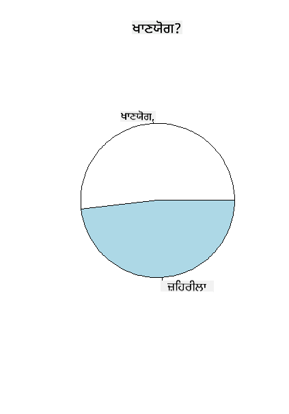
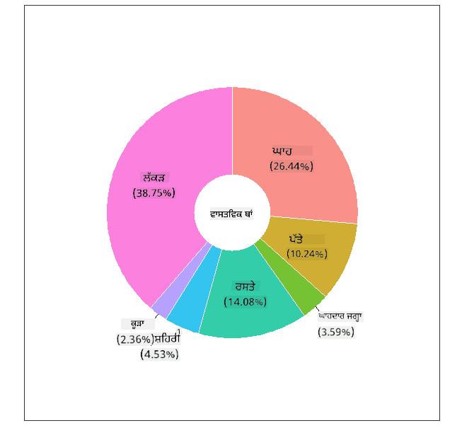
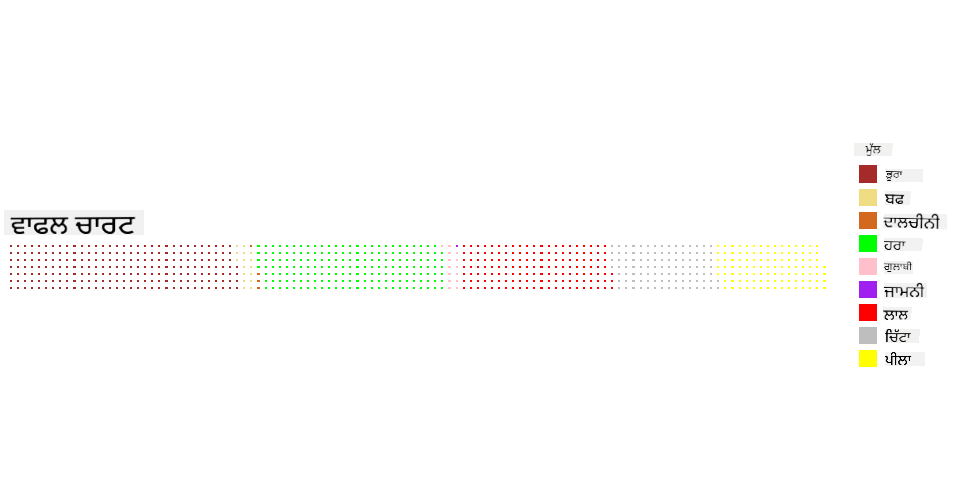

<!--
CO_OP_TRANSLATOR_METADATA:
{
  "original_hash": "47028abaaafa2bcb1079702d20569066",
  "translation_date": "2025-08-27T18:38:13+00:00",
  "source_file": "3-Data-Visualization/R/11-visualization-proportions/README.md",
  "language_code": "pa"
}
-->
# ਅਨੁਪਾਤਾਂ ਨੂੰ ਦਿਖਾਉਣਾ

| ਦੁਆਰਾ ਬਣਾਇਆ ਗਿਆ ਸਕੈਚਨੋਟ ](../../../sketchnotes/11-Visualizing-Proportions.png)|
|:---:|
|ਅਨੁਪਾਤਾਂ ਨੂੰ ਦਿਖਾਉਣਾ - _[@nitya](https://twitter.com/nitya) ਦੁਆਰਾ ਸਕੈਚਨੋਟ_ |

ਇਸ ਪਾਠ ਵਿੱਚ, ਤੁਸੀਂ ਕੁਦਰਤ-ਕੇਂਦਰਤ ਡਾਟਾਸੈਟ ਦੀ ਵਰਤੋਂ ਕਰਕੇ ਅਨੁਪਾਤਾਂ ਨੂੰ ਦਿਖਾਉਣਾ ਸਿੱਖੋਗੇ, ਜਿਵੇਂ ਕਿ ਮਸ਼ਰੂਮਾਂ ਬਾਰੇ ਡਾਟਾਸੈਟ ਵਿੱਚ ਕਿੰਨੇ ਵੱਖ-ਵੱਖ ਕਿਸਮਾਂ ਦੇ ਫੰਗਸ ਹਨ। ਆਓ, Audubon ਤੋਂ ਪ੍ਰਾਪਤ ਡਾਟਾਸੈਟ ਦੀ ਵਰਤੋਂ ਕਰਕੇ ਇਹ ਦਿਲਚਸਪ ਫੰਗਸ ਦੀ ਪੜਚੋਲ ਕਰੀਏ, ਜੋ Agaricus ਅਤੇ Lepiota ਪਰਿਵਾਰਾਂ ਦੇ 23 ਪ੍ਰਜਾਤੀਆਂ ਦੇ ਗਿਲਡ ਮਸ਼ਰੂਮਾਂ ਬਾਰੇ ਜਾਣਕਾਰੀ ਦਿੰਦਾ ਹੈ। ਤੁਸੀਂ ਹੇਠਾਂ ਦਿੱਤੇ ਸੁਆਦਿਸ਼ਟ ਵਿਜੁਅਲਾਈਜ਼ੇਸ਼ਨ ਨਾਲ ਪ੍ਰਯੋਗ ਕਰੋਗੇ:

- ਪਾਈ ਚਾਰਟ 🥧  
- ਡੋਨਟ ਚਾਰਟ 🍩  
- ਵਾਫਲ ਚਾਰਟ 🧇  

> 💡 ਮਾਈਕਰੋਸਾਫਟ ਰਿਸਰਚ ਦੁਆਰਾ ਬਣਾਇਆ ਗਿਆ ਇੱਕ ਬਹੁਤ ਦਿਲਚਸਪ ਪ੍ਰੋਜੈਕਟ [Charticulator](https://charticulator.com) ਡਾਟਾ ਵਿਜੁਅਲਾਈਜ਼ੇਸ਼ਨ ਲਈ ਮੁਫ਼ਤ ਡਰੈਗ ਅਤੇ ਡ੍ਰਾਪ ਇੰਟਰਫੇਸ ਪ੍ਰਦਾਨ ਕਰਦਾ ਹੈ। ਆਪਣੇ ਇੱਕ ਟਿਊਟੋਰਿਅਲ ਵਿੱਚ, ਉਹ ਇਸ ਮਸ਼ਰੂਮ ਡਾਟਾਸੈਟ ਦੀ ਵੀ ਵਰਤੋਂ ਕਰਦੇ ਹਨ! ਇਸ ਲਈ ਤੁਸੀਂ ਡਾਟਾ ਦੀ ਪੜਚੋਲ ਕਰ ਸਕਦੇ ਹੋ ਅਤੇ ਲਾਇਬ੍ਰੇਰੀ ਬਾਰੇ ਸਿੱਖ ਸਕਦੇ ਹੋ: [Charticulator ਟਿਊਟੋਰਿਅਲ](https://charticulator.com/tutorials/tutorial4.html)।

## [ਪਾਠ-ਪਹਿਲਾਂ ਕਵਿਜ਼](https://purple-hill-04aebfb03.1.azurestaticapps.net/quiz/20)

## ਆਪਣੇ ਮਸ਼ਰੂਮਾਂ ਨੂੰ ਜਾਣੋ 🍄

ਮਸ਼ਰੂਮ ਬਹੁਤ ਦਿਲਚਸਪ ਹੁੰਦੇ ਹਨ। ਆਓ, ਇੱਕ ਡਾਟਾਸੈਟ ਇੰਪੋਰਟ ਕਰੀਏ ਅਤੇ ਇਸਦਾ ਅਧਿਐਨ ਕਰੀਏ:

```r
mushrooms = read.csv('../../data/mushrooms.csv')
head(mushrooms)
```  
ਇੱਕ ਟੇਬਲ ਪ੍ਰਿੰਟ ਕੀਤੀ ਗਈ ਹੈ ਜਿਸ ਵਿੱਚ ਵਿਸ਼ਲੇਸ਼ਣ ਲਈ ਵਧੀਆ ਡਾਟਾ ਹੈ:

| class     | cap-shape | cap-surface | cap-color | bruises | odor    | gill-attachment | gill-spacing | gill-size | gill-color | stalk-shape | stalk-root | stalk-surface-above-ring | stalk-surface-below-ring | stalk-color-above-ring | stalk-color-below-ring | veil-type | veil-color | ring-number | ring-type | spore-print-color | population | habitat |
| --------- | --------- | ----------- | --------- | ------- | ------- | --------------- | ------------ | --------- | ---------- | ----------- | ---------- | ------------------------ | ------------------------ | ---------------------- | ---------------------- | --------- | ---------- | ----------- | --------- | ----------------- | ---------- | ------- |
| Poisonous | Convex    | Smooth      | Brown     | Bruises | Pungent | Free            | Close        | Narrow    | Black      | Enlarging   | Equal      | Smooth                   | Smooth                   | White                  | White                  | Partial   | White      | One         | Pendant   | Black             | Scattered  | Urban   |
| Edible    | Convex    | Smooth      | Yellow    | Bruises | Almond  | Free            | Close        | Broad     | Black      | Enlarging   | Club       | Smooth                   | Smooth                   | White                  | White                  | Partial   | White      | One         | Pendant   | Brown             | Numerous   | Grasses |
| Edible    | Bell      | Smooth      | White     | Bruises | Anise   | Free            | Close        | Broad     | Brown      | Enlarging   | Club       | Smooth                   | Smooth                   | White                  | White                  | Partial   | White      | One         | Pendant   | Brown             | Numerous   | Meadows |
| Poisonous | Convex    | Scaly       | White     | Bruises | Pungent | Free            | Close        | Narrow    | Brown      | Enlarging   | Equal      | Smooth                   | Smooth                   | White                  | White                  | Partial   | White      | One         | Pendant   | Black             | Scattered  | Urban   |
| Edible    | Convex    | Smooth      | Green     | No Bruises | None   | Free            | Crowded      | Broad     | Black      | Tapering    | Equal      | Smooth                   | Smooth                   | White                  | White                  | Partial   | White      | One         | Evanescent | Brown             | Abundant   | Grasses |
| Edible    | Convex    | Scaly       | Yellow    | Bruises | Almond  | Free            | Close        | Broad     | Brown      | Enlarging   | Club       | Smooth                   | Smooth                   | White                  | White                  | Partial   | White      | One         | Pendant   | Black             | Numerous   | Grasses |

ਤੁਰੰਤ ਹੀ, ਤੁਸੀਂ ਨੋਟ ਕਰਦੇ ਹੋ ਕਿ ਸਾਰਾ ਡਾਟਾ ਟੈਕਸਟ ਦੇ ਰੂਪ ਵਿੱਚ ਹੈ। ਇਸ ਡਾਟੇ ਨੂੰ ਚਾਰਟ ਵਿੱਚ ਵਰਤਣ ਲਈ ਤੁਹਾਨੂੰ ਇਸਨੂੰ ਰੂਪਾਂਤਰਿਤ ਕਰਨਾ ਪਵੇਗਾ। ਅਸਲ ਵਿੱਚ, ਜ਼ਿਆਦਾਤਰ ਡਾਟਾ ਇੱਕ ਆਬਜੈਕਟ ਦੇ ਰੂਪ ਵਿੱਚ ਦਰਸਾਇਆ ਗਿਆ ਹੈ:

```r
names(mushrooms)
```  

ਆਉਟਪੁਟ ਹੈ:

```output
[1] "class"                    "cap.shape"               
 [3] "cap.surface"              "cap.color"               
 [5] "bruises"                  "odor"                    
 [7] "gill.attachment"          "gill.spacing"            
 [9] "gill.size"                "gill.color"              
[11] "stalk.shape"              "stalk.root"              
[13] "stalk.surface.above.ring" "stalk.surface.below.ring"
[15] "stalk.color.above.ring"   "stalk.color.below.ring"  
[17] "veil.type"                "veil.color"              
[19] "ring.number"              "ring.type"               
[21] "spore.print.color"        "population"              
[23] "habitat"            
```  
ਇਸ ਡਾਟੇ ਨੂੰ ਲਓ ਅਤੇ 'class' ਕਾਲਮ ਨੂੰ ਇੱਕ ਸ਼੍ਰੇਣੀ ਵਿੱਚ ਰੂਪਾਂਤਰਿਤ ਕਰੋ:

```r
library(dplyr)
grouped=mushrooms %>%
  group_by(class) %>%
  summarise(count=n())
```  

ਹੁਣ, ਜੇ ਤੁਸੀਂ ਮਸ਼ਰੂਮਾਂ ਦਾ ਡਾਟਾ ਪ੍ਰਿੰਟ ਕਰਦੇ ਹੋ, ਤਾਂ ਤੁਸੀਂ ਦੇਖ ਸਕਦੇ ਹੋ ਕਿ ਇਸਨੂੰ ਜ਼ਹਿਰੀਲੇ/ਖਾਣਯੋਗ ਸ਼੍ਰੇਣੀ ਦੇ ਅਨੁਸਾਰ ਸ਼੍ਰੇਣੀਆਂ ਵਿੱਚ ਵੰਡਿਆ ਗਿਆ ਹੈ:  
```r
View(grouped)
```  

| class | count |
| --------- | --------- |
| Edible | 4208 |
| Poisonous| 3916 |

ਜੇ ਤੁਸੀਂ ਇਸ ਟੇਬਲ ਵਿੱਚ ਦਿੱਤੇ ਕ੍ਰਮ ਦਾ ਪਾਲਣ ਕਰਦੇ ਹੋ ਤਾਂ ਤੁਸੀਂ ਆਪਣੀਆਂ ਸ਼੍ਰੇਣੀ ਲੇਬਲਾਂ ਬਣਾਕੇ ਪਾਈ ਚਾਰਟ ਤਿਆਰ ਕਰ ਸਕਦੇ ਹੋ।

## ਪਾਈ!

```r
pie(grouped$count,grouped$class, main="Edible?")
```  
ਲੋ ਜੀ, ਇੱਕ ਪਾਈ ਚਾਰਟ ਜੋ ਮਸ਼ਰੂਮਾਂ ਦੀਆਂ ਦੋ ਸ਼੍ਰੇਣੀਆਂ ਦੇ ਅਨੁਸਾਰ ਡਾਟੇ ਦੇ ਅਨੁਪਾਤਾਂ ਨੂੰ ਦਿਖਾਉਂਦਾ ਹੈ। ਲੇਬਲਾਂ ਦੇ ਕ੍ਰਮ ਨੂੰ ਸਹੀ ਰੱਖਣਾ ਬਹੁਤ ਮਹੱਤਵਪੂਰਨ ਹੈ, ਖਾਸ ਕਰਕੇ ਇੱਥੇ, ਇਸ ਲਈ ਯਕੀਨੀ ਬਣਾਓ ਕਿ ਲੇਬਲ ਐਰੇ ਬਣਾਉਣ ਦੇ ਕ੍ਰਮ ਦੀ ਪੁਸ਼ਟੀ ਕਰੋ!



## ਡੋਨਟ!

ਪਾਈ ਚਾਰਟ ਦਾ ਇੱਕ ਹੋਰ ਦ੍ਰਿਸ਼ਟੀਕੋਣ ਹੈ ਡੋਨਟ ਚਾਰਟ, ਜੋ ਪਾਈ ਚਾਰਟ ਵਿੱਚ ਵਿਚਕਾਰ ਇੱਕ ਛੇਦ ਰੱਖਦਾ ਹੈ। ਆਓ, ਆਪਣੇ ਡਾਟੇ ਨੂੰ ਇਸ ਤਰੀਕੇ ਨਾਲ ਵੇਖੀਏ।

ਮਸ਼ਰੂਮਾਂ ਦੇ ਵੱਖ-ਵੱਖ ਹਬੀਟੈਟਾਂ ਨੂੰ ਵੇਖੋ:

```r
library(dplyr)
habitat=mushrooms %>%
  group_by(habitat) %>%
  summarise(count=n())
View(habitat)
```  
ਆਉਟਪੁਟ ਹੈ:  
| habitat| count |
| --------- | --------- |
| Grasses    | 2148 |
| Leaves| 832 |
| Meadows    | 292 |
| Paths| 1144 |
| Urban    | 368 |
| Waste| 192 |
| Wood| 3148 |

ਇੱਥੇ, ਤੁਸੀਂ ਆਪਣੇ ਡਾਟੇ ਨੂੰ ਹਬੀਟੈਟ ਦੇ ਅਧਾਰ 'ਤੇ ਗਰੁੱਪ ਕਰ ਰਹੇ ਹੋ। ਇੱਥੇ 7 ਹਬੀਟੈਟ ਹਨ, ਇਸ ਲਈ ਆਪਣੇ ਡੋਨਟ ਚਾਰਟ ਲਈ ਇਨ੍ਹਾਂ ਨੂੰ ਲੇਬਲਾਂ ਵਜੋਂ ਵਰਤੋ:

```r
library(ggplot2)
library(webr)
PieDonut(habitat, aes(habitat, count=count))
```  



ਇਹ ਕੋਡ ਦੋ ਲਾਇਬ੍ਰੇਰੀਆਂ - ggplot2 ਅਤੇ webr ਦੀ ਵਰਤੋਂ ਕਰਦਾ ਹੈ। webr ਲਾਇਬ੍ਰੇਰੀ ਦੇ PieDonut ਫੰਕਸ਼ਨ ਦੀ ਵਰਤੋਂ ਕਰਕੇ, ਅਸੀਂ ਆਸਾਨੀ ਨਾਲ ਡੋਨਟ ਚਾਰਟ ਬਣਾ ਸਕਦੇ ਹਾਂ!

R ਵਿੱਚ ਡੋਨਟ ਚਾਰਟ ਸਿਰਫ ggplot2 ਲਾਇਬ੍ਰੇਰੀ ਦੀ ਵਰਤੋਂ ਕਰਕੇ ਵੀ ਬਣਾਏ ਜਾ ਸਕਦੇ ਹਨ। ਇਸ ਬਾਰੇ ਹੋਰ ਜਾਣਕਾਰੀ ਲਈ [ਇੱਥੇ](https://www.r-graph-gallery.com/128-ring-or-donut-plot.html) ਪੜ੍ਹੋ ਅਤੇ ਖੁਦ ਪ੍ਰਯੋਗ ਕਰੋ।

ਹੁਣ ਜਦੋਂ ਤੁਸੀਂ ਜਾਣਦੇ ਹੋ ਕਿ ਆਪਣੇ ਡਾਟੇ ਨੂੰ ਕਿਵੇਂ ਗਰੁੱਪ ਕਰਨਾ ਹੈ ਅਤੇ ਇਸਨੂੰ ਪਾਈ ਜਾਂ ਡੋਨਟ ਦੇ ਰੂਪ ਵਿੱਚ ਕਿਵੇਂ ਦਿਖਾਉਣਾ ਹੈ, ਤਾਂ ਤੁਸੀਂ ਹੋਰ ਚਾਰਟਾਂ ਦੀ ਪੜਚੋਲ ਕਰ ਸਕਦੇ ਹੋ। ਇੱਕ ਵਾਫਲ ਚਾਰਟ ਦੀ ਕੋਸ਼ਿਸ਼ ਕਰੋ, ਜੋ ਮਾਤਰਾ ਦੀ ਪੜਚੋਲ ਕਰਨ ਦਾ ਇੱਕ ਵੱਖਰਾ ਤਰੀਕਾ ਹੈ।

## ਵਾਫਲ!

'ਵਾਫਲ' ਕਿਸਮ ਦਾ ਚਾਰਟ ਮਾਤਰਾ ਨੂੰ 2D ਸਕਵੇਅਰ ਐਰੇ ਦੇ ਰੂਪ ਵਿੱਚ ਦਿਖਾਉਣ ਦਾ ਇੱਕ ਵੱਖਰਾ ਤਰੀਕਾ ਹੈ। ਇਸ ਡਾਟਾਸੈਟ ਵਿੱਚ ਮਸ਼ਰੂਮ ਕੈਪ ਦੇ ਵੱਖ-ਵੱਖ ਰੰਗਾਂ ਦੀ ਮਾਤਰਾ ਨੂੰ ਦਿਖਾਉਣ ਦੀ ਕੋਸ਼ਿਸ਼ ਕਰੋ। ਇਸ ਲਈ, ਤੁਹਾਨੂੰ ਇੱਕ ਸਹਾਇਕ ਲਾਇਬ੍ਰੇਰੀ [waffle](https://cran.r-project.org/web/packages/waffle/waffle.pdf) ਨੂੰ ਇੰਸਟਾਲ ਕਰਨਾ ਪਵੇਗਾ ਅਤੇ ਇਸਦੀ ਵਰਤੋਂ ਕਰਕੇ ਆਪਣੀ ਵਿਜੁਅਲਾਈਜ਼ੇਸ਼ਨ ਤਿਆਰ ਕਰਨੀ ਪਵੇਗੀ:

```r
install.packages("waffle", repos = "https://cinc.rud.is")
```  

ਆਪਣੇ ਡਾਟੇ ਦਾ ਇੱਕ ਸੈਗਮੈਂਟ ਚੁਣੋ:

```r
library(dplyr)
cap_color=mushrooms %>%
  group_by(cap.color) %>%
  summarise(count=n())
View(cap_color)
```  

ਲੇਬਲ ਬਣਾਕੇ ਅਤੇ ਫਿਰ ਆਪਣੇ ਡਾਟੇ ਨੂੰ ਗਰੁੱਪ ਕਰਕੇ ਇੱਕ ਵਾਫਲ ਚਾਰਟ ਬਣਾਓ:

```r
library(waffle)
names(cap_color$count) = paste0(cap_color$cap.color)
waffle((cap_color$count/10), rows = 7, title = "Waffle Chart")+scale_fill_manual(values=c("brown", "#F0DC82", "#D2691E", "green", 
                                                                                     "pink", "purple", "red", "grey", 
                                                                                     "yellow","white"))
```  

ਵਾਫਲ ਚਾਰਟ ਦੀ ਵਰਤੋਂ ਕਰਕੇ, ਤੁਸੀਂ ਮਸ਼ਰੂਮਾਂ ਦੇ ਕੈਪ ਰੰਗਾਂ ਦੇ ਅਨੁਪਾਤਾਂ ਨੂੰ ਸਪਸ਼ਟ ਤੌਰ 'ਤੇ ਦੇਖ ਸਕਦੇ ਹੋ। ਦਿਲਚਸਪ ਗੱਲ ਇਹ ਹੈ ਕਿ ਬਹੁਤ ਸਾਰੇ ਹਰੇ ਕੈਪ ਵਾਲੇ ਮਸ਼ਰੂਮ ਹਨ!



ਇਸ ਪਾਠ ਵਿੱਚ, ਤੁਸੀਂ ਅਨੁਪਾਤਾਂ ਨੂੰ ਦਿਖਾਉਣ ਦੇ ਤਿੰਨ ਤਰੀਕੇ ਸਿੱਖੇ। ਪਹਿਲਾਂ, ਤੁਹਾਨੂੰ ਆਪਣੇ ਡਾਟੇ ਨੂੰ ਸ਼੍ਰੇਣੀਆਂ ਵਿੱਚ ਗਰੁੱਪ ਕਰਨਾ ਪੈਂਦਾ ਹੈ ਅਤੇ ਫਿਰ ਇਹ ਫੈਸਲਾ ਕਰਨਾ ਪੈਂਦਾ ਹੈ ਕਿ ਡਾਟੇ ਨੂੰ ਦਿਖਾਉਣ ਦਾ ਸਭ ਤੋਂ ਵਧੀਆ ਤਰੀਕਾ ਕਿਹੜਾ ਹੈ - ਪਾਈ, ਡੋਨਟ, ਜਾਂ ਵਾਫਲ। ਸਾਰੇ ਸੁਆਦਿਸ਼ਟ ਹਨ ਅਤੇ ਯੂਜ਼ਰ ਨੂੰ ਡਾਟਾਸੈਟ ਦੀ ਤੁਰੰਤ ਝਲਕ ਦਿੰਦੇ ਹਨ।

## 🚀 ਚੁਣੌਤੀ

ਇਹ ਸੁਆਦਿਸ਼ਟ ਚਾਰਟਾਂ ਨੂੰ [Charticulator](https://charticulator.com) ਵਿੱਚ ਦੁਬਾਰਾ ਬਣਾਉਣ ਦੀ ਕੋਸ਼ਿਸ਼ ਕਰੋ।  
## [ਪਾਠ-ਬਾਅਦ ਕਵਿਜ਼](https://purple-hill-04aebfb03.1.azurestaticapps.net/quiz/21)

## ਸਮੀਖਿਆ ਅਤੇ ਸਵੈ ਅਧਿਐਨ

ਕਈ ਵਾਰ ਇਹ ਸਪਸ਼ਟ ਨਹੀਂ ਹੁੰਦਾ ਕਿ ਪਾਈ, ਡੋਨਟ, ਜਾਂ ਵਾਫਲ ਚਾਰਟ ਕਦੋਂ ਵਰਤਣਾ ਹੈ। ਇਸ ਵਿਸ਼ੇ 'ਤੇ ਪੜ੍ਹਨ ਲਈ ਕੁਝ ਲੇਖ ਹੇਠਾਂ ਦਿੱਤੇ ਗਏ ਹਨ:

https://www.beautiful.ai/blog/battle-of-the-charts-pie-chart-vs-donut-chart  

https://medium.com/@hypsypops/pie-chart-vs-donut-chart-showdown-in-the-ring-5d24fd86a9ce  

https://www.mit.edu/~mbarker/formula1/f1help/11-ch-c6.htm  

https://medium.datadriveninvestor.com/data-visualization-done-the-right-way-with-tableau-waffle-chart-fdf2a19be402  

ਹੋਰ ਜਾਣਕਾਰੀ ਪ੍ਰਾਪਤ ਕਰਨ ਲਈ ਖੋਜ ਕਰੋ ਅਤੇ ਇਸ ਮੁਸ਼ਕਲ ਫੈਸਲੇ ਬਾਰੇ ਹੋਰ ਸਿੱਖੋ।  
## ਅਸਾਈਨਮੈਂਟ

[ਇਸਨੂੰ Excel ਵਿੱਚ ਅਜ਼ਮਾਓ](assignment.md)  

---

**ਅਸਵੀਕਤੀ**:  
ਇਹ ਦਸਤਾਵੇਜ਼ AI ਅਨੁਵਾਦ ਸੇਵਾ [Co-op Translator](https://github.com/Azure/co-op-translator) ਦੀ ਵਰਤੋਂ ਕਰਕੇ ਅਨੁਵਾਦ ਕੀਤਾ ਗਿਆ ਹੈ। ਜਦੋਂ ਕਿ ਅਸੀਂ ਸਹੀਤਾ ਲਈ ਯਤਨਸ਼ੀਲ ਹਾਂ, ਕਿਰਪਾ ਕਰਕੇ ਧਿਆਨ ਦਿਓ ਕਿ ਸਵੈਚਾਲਿਤ ਅਨੁਵਾਦਾਂ ਵਿੱਚ ਗਲਤੀਆਂ ਜਾਂ ਅਸੁਚੀਤਤਾਵਾਂ ਹੋ ਸਕਦੀਆਂ ਹਨ। ਇਸ ਦਸਤਾਵੇਜ਼ ਦਾ ਮੂਲ ਰੂਪ ਇਸਦੀ ਮੂਲ ਭਾਸ਼ਾ ਵਿੱਚ ਅਧਿਕਾਰਤ ਸਰੋਤ ਮੰਨਿਆ ਜਾਣਾ ਚਾਹੀਦਾ ਹੈ। ਮਹੱਤਵਪੂਰਨ ਜਾਣਕਾਰੀ ਲਈ, ਪੇਸ਼ੇਵਰ ਮਨੁੱਖੀ ਅਨੁਵਾਦ ਦੀ ਸਿਫਾਰਸ਼ ਕੀਤੀ ਜਾਂਦੀ ਹੈ। ਇਸ ਅਨੁਵਾਦ ਦੀ ਵਰਤੋਂ ਤੋਂ ਪੈਦਾ ਹੋਣ ਵਾਲੇ ਕਿਸੇ ਵੀ ਗਲਤਫਹਿਮੀ ਜਾਂ ਗਲਤ ਵਿਆਖਿਆ ਲਈ ਅਸੀਂ ਜ਼ਿੰਮੇਵਾਰ ਨਹੀਂ ਹਾਂ।