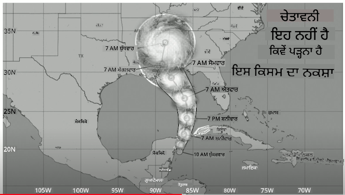
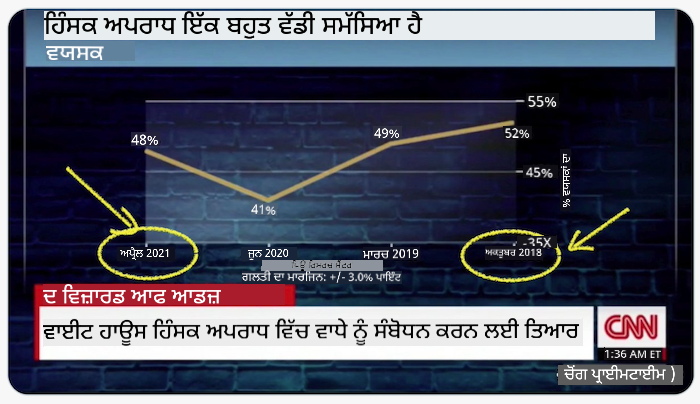
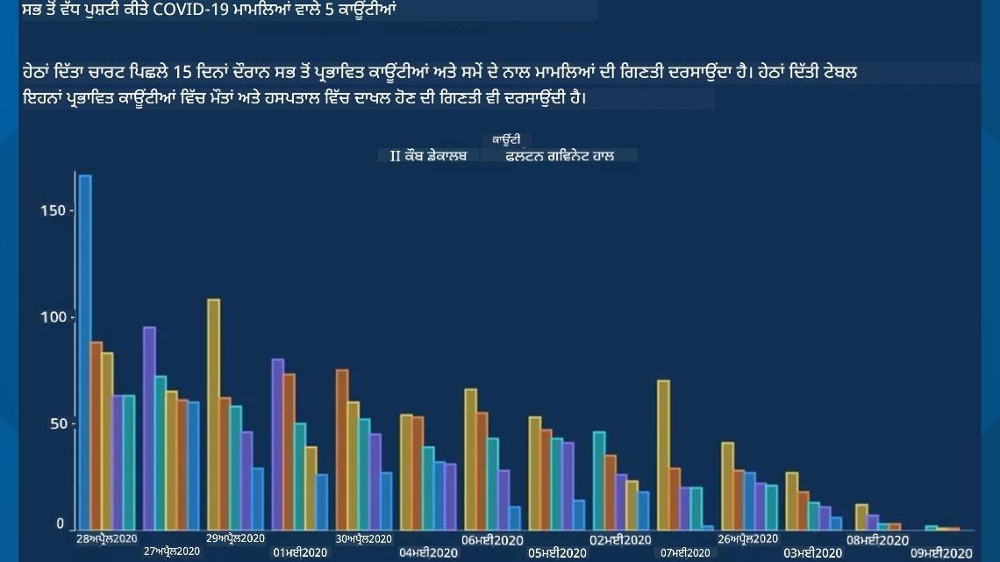
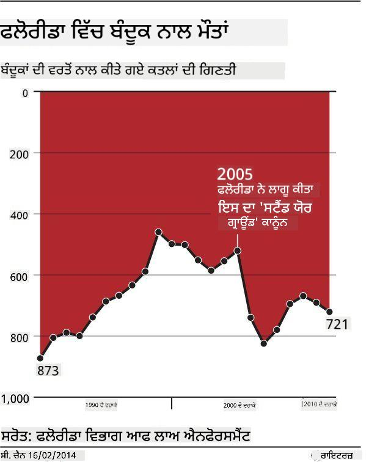
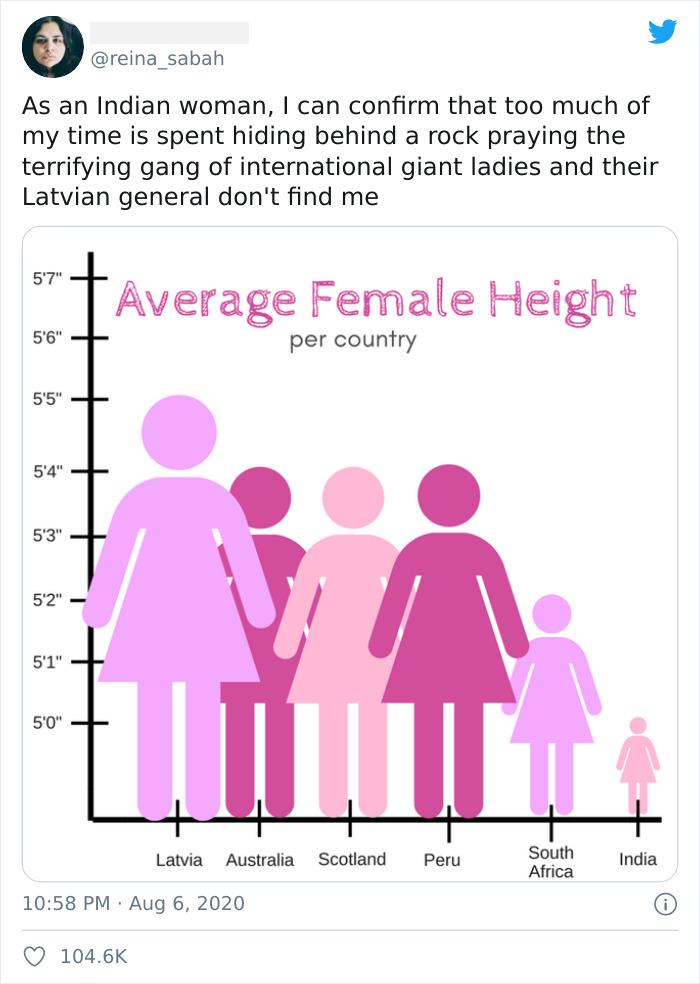
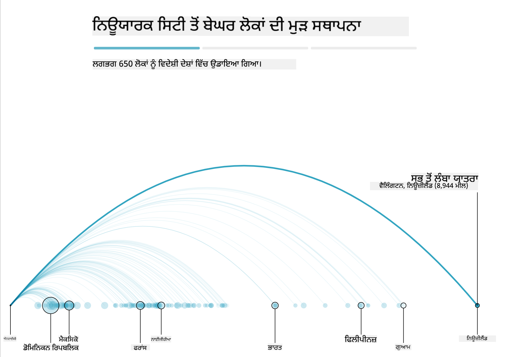
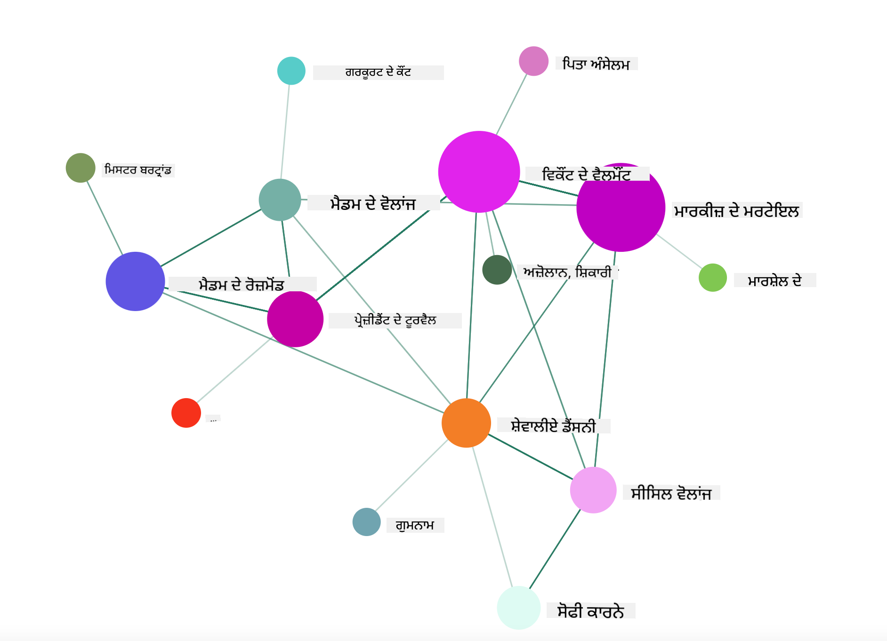

<!--
CO_OP_TRANSLATOR_METADATA:
{
  "original_hash": "b4039f1c76548d144a0aee0bf28304ec",
  "translation_date": "2025-08-27T18:35:33+00:00",
  "source_file": "3-Data-Visualization/R/13-meaningful-vizualizations/README.md",
  "language_code": "pa"
}
-->
# ਮਾਨਹੀਣ ਵਿਜੁਅਲਾਈਜ਼ੇਸ਼ਨ ਬਣਾਉਣਾ

| ](../../../sketchnotes/13-MeaningfulViz.png)|
|:---:|
| ਮਾਨਹੀਣ ਵਿਜੁਅਲਾਈਜ਼ੇਸ਼ਨ - _ਸਕੈਚਨੋਟ [@nitya](https://twitter.com/nitya)_ |

> "ਜੇ ਤੁਸੀਂ ਡਾਟਾ ਨੂੰ ਕਾਫ਼ੀ ਲੰਮੇ ਸਮੇਂ ਤੱਕ ਤੰਗ ਕਰੋ, ਤਾਂ ਇਹ ਕੁਝ ਵੀ ਸੱਚ ਮੰਨ ਲਵੇਗਾ" -- [ਰੋਨਾਲਡ ਕੋਸ](https://en.wikiquote.org/wiki/Ronald_Coase)

ਡਾਟਾ ਸਾਇੰਸਟ ਦਾ ਇੱਕ ਮੁੱਖ ਹੁਨਰ ਇਹ ਹੈ ਕਿ ਉਹ ਅਰਥਪੂਰਨ ਡਾਟਾ ਵਿਜੁਅਲਾਈਜ਼ੇਸ਼ਨ ਬਣਾਉਣ ਦੀ ਸਮਰੱਥਾ ਰੱਖਦਾ ਹੈ ਜੋ ਤੁਹਾਡੇ ਸਵਾਲਾਂ ਦੇ ਜਵਾਬ ਦੇਣ ਵਿੱਚ ਮਦਦ ਕਰ ਸਕੇ। ਡਾਟਾ ਨੂੰ ਵਿਜੁਅਲਾਈਜ਼ ਕਰਨ ਤੋਂ ਪਹਿਲਾਂ, ਇਹ ਯਕੀਨੀ ਬਣਾਉਣਾ ਜ਼ਰੂਰੀ ਹੈ ਕਿ ਇਹ ਸਾਫ਼ ਅਤੇ ਤਿਆਰ ਕੀਤਾ ਗਿਆ ਹੈ, ਜਿਵੇਂ ਤੁਸੀਂ ਪਿਛਲੇ ਪਾਠਾਂ ਵਿੱਚ ਕੀਤਾ ਸੀ। ਇਸ ਤੋਂ ਬਾਅਦ, ਤੁਸੀਂ ਇਹ ਫੈਸਲਾ ਕਰ ਸਕਦੇ ਹੋ ਕਿ ਡਾਟਾ ਨੂੰ ਸਭ ਤੋਂ ਵਧੀਆ ਤਰੀਕੇ ਨਾਲ ਕਿਵੇਂ ਪੇਸ਼ ਕਰਨਾ ਹੈ।

ਇਸ ਪਾਠ ਵਿੱਚ, ਤੁਸੀਂ ਸਮੀਖਿਆ ਕਰੋਗੇ:

1. ਸਹੀ ਚਾਰਟ ਕਿਸਮ ਕਿਵੇਂ ਚੁਣੀ ਜਾਵੇ
2. ਧੋਖੇਬਾਜ਼ ਚਾਰਟਿੰਗ ਤੋਂ ਕਿਵੇਂ ਬਚਿਆ ਜਾਵੇ
3. ਰੰਗਾਂ ਨਾਲ ਕਿਵੇਂ ਕੰਮ ਕੀਤਾ ਜਾਵੇ
4. ਪੜ੍ਹਨਯੋਗਤਾ ਲਈ ਚਾਰਟਾਂ ਨੂੰ ਕਿਵੇਂ ਸਜਾਇਆ ਜਾਵੇ
5. ਐਨੀਮੇਟਡ ਜਾਂ 3D ਚਾਰਟਿੰਗ ਹੱਲ ਕਿਵੇਂ ਬਣਾਏ ਜਾਣ
6. ਰਚਨਾਤਮਕ ਵਿਜੁਅਲਾਈਜ਼ੇਸ਼ਨ ਕਿਵੇਂ ਬਣਾਈ ਜਾਵੇ

## [ਪ੍ਰੀ-ਲੈਕਚਰ ਕਵਿਜ਼](https://purple-hill-04aebfb03.1.azurestaticapps.net/quiz/24)

## ਸਹੀ ਚਾਰਟ ਕਿਸਮ ਚੁਣੋ

ਪਿਛਲੇ ਪਾਠਾਂ ਵਿੱਚ, ਤੁਸੀਂ Matplotlib ਅਤੇ Seaborn ਵਰਗੇ ਟੂਲਾਂ ਦੀ ਵਰਤੋਂ ਕਰਕੇ ਕਈ ਰੁਚਿਕਰ ਡਾਟਾ ਵਿਜੁਅਲਾਈਜ਼ੇਸ਼ਨ ਬਣਾਉਣ ਦਾ ਅਨੁਭਵ ਕੀਤਾ। ਆਮ ਤੌਰ 'ਤੇ, ਤੁਸੀਂ ਆਪਣੇ ਸਵਾਲ ਦੇ ਅਨੁਸਾਰ ਸਹੀ [ਚਾਰਟ ਦੀ ਕਿਸਮ](https://chartio.com/learn/charts/how-to-select-a-data-vizualization/) ਚੁਣ ਸਕਦੇ ਹੋ ਇਸ ਤਾਲਿਕਾ ਦੀ ਮਦਦ ਨਾਲ:

| ਤੁਹਾਨੂੰ ਲੋੜ ਹੈ:            | ਤੁਹਾਨੂੰ ਵਰਤਣਾ ਚਾਹੀਦਾ ਹੈ:         |
| -------------------------- | ------------------------------- |
| ਸਮੇਂ ਦੇ ਨਾਲ ਡਾਟਾ ਰੁਝਾਨ ਦਿਖਾਉਣਾ | ਲਾਈਨ                          |
| ਸ਼੍ਰੇਣੀਆਂ ਦੀ ਤੁਲਨਾ ਕਰਨੀ ਹੈ | ਬਾਰ, ਪਾਈ                      |
| ਕੁੱਲ ਦੀ ਤੁਲਨਾ ਕਰਨੀ ਹੈ      | ਪਾਈ, ਸਟੈਕਡ ਬਾਰ                |
| ਸੰਬੰਧ ਦਿਖਾਉਣਾ ਹੈ          | ਸਕੈਟਰ, ਲਾਈਨ, ਫੈਸਿਟ, ਡੁਅਲ ਲਾਈਨ |
| ਵੰਡ ਦਿਖਾਉਣੀ ਹੈ            | ਸਕੈਟਰ, ਹਿਸਟੋਗ੍ਰਾਮ, ਬਾਕਸ       |
| ਅਨੁਪਾਤ ਦਿਖਾਉਣਾ ਹੈ         | ਪਾਈ, ਡੋਨਟ, ਵਾਫਲ               |

> ✅ ਤੁਹਾਡੇ ਡਾਟਾ ਦੀ ਬਣਾਵਟ ਦੇ ਅਨੁਸਾਰ, ਤੁਹਾਨੂੰ ਇਸਨੂੰ ਟੈਕਸਟ ਤੋਂ ਨੰਬਰਿਕ ਵਿੱਚ ਬਦਲਣਾ ਪੈ ਸਕਦਾ ਹੈ ਤਾਂ ਜੋ ਚਾਰਟ ਇਸਨੂੰ ਸਹਾਰ ਸਕੇ।

## ਧੋਖੇਬਾਜ਼ੀ ਤੋਂ ਬਚੋ

ਭਾਵੇਂ ਕਿ ਡਾਟਾ ਸਾਇੰਸਟ ਸਹੀ ਡਾਟਾ ਲਈ ਸਹੀ ਚਾਰਟ ਚੁਣਨ ਵਿੱਚ ਸਾਵਧਾਨ ਹੋਵੇ, ਫਿਰ ਵੀ ਕਈ ਤਰੀਕੇ ਹਨ ਜਿਨ੍ਹਾਂ ਨਾਲ ਡਾਟਾ ਨੂੰ ਇਸ ਤਰੀਕੇ ਨਾਲ ਪੇਸ਼ ਕੀਤਾ ਜਾ ਸਕਦਾ ਹੈ ਜੋ ਕਿਸੇ ਨਤੀਜੇ ਨੂੰ ਸਾਬਤ ਕਰੇ, ਪਰ ਕਈ ਵਾਰ ਇਹ ਡਾਟਾ ਨੂੰ ਗਲਤ ਢੰਗ ਨਾਲ ਪੇਸ਼ ਕਰ ਸਕਦਾ ਹੈ। ਧੋਖੇਬਾਜ਼ ਚਾਰਟਾਂ ਅਤੇ ਇਨਫੋਗ੍ਰਾਫਿਕਸ ਦੇ ਕਈ ਉਦਾਹਰਨ ਹਨ!

[](https://www.youtube.com/watch?v=oX74Nge8Wkw "ਹਾਊ ਚਾਰਟਸ ਲਾਈ")

> 🎥 ਉੱਪਰ ਦਿੱਤੀ ਤਸਵੀਰ 'ਤੇ ਕਲਿਕ ਕਰੋ ਧੋਖੇਬਾਜ਼ ਚਾਰਟਾਂ ਬਾਰੇ ਕਾਨਫਰੰਸ ਟਾਕ ਦੇਖਣ ਲਈ

ਇਹ ਚਾਰਟ X ਅਕਸ ਨੂੰ ਉਲਟਾ ਦਿਖਾਉਂਦਾ ਹੈ, ਜਿਸ ਨਾਲ ਸੱਚ ਦੇ ਉਲਟ ਨਤੀਜਾ ਦਿਖਾਇਆ ਜਾਂਦਾ ਹੈ:



[ਇਹ ਚਾਰਟ](https://media.firstcoastnews.com/assets/WTLV/images/170ae16f-4643-438f-b689-50d66ca6a8d8/170ae16f-4643-438f-b689-50d66ca6a8d8_1140x641.jpg) ਹੋਰ ਵੀ ਧੋਖੇਬਾਜ਼ ਹੈ, ਕਿਉਂਕਿ ਇਹ ਅੱਖ ਨੂੰ ਇਹ ਨਤੀਜਾ ਕੱਢਣ ਲਈ ਖਿੱਚਦਾ ਹੈ ਕਿ ਸਮੇਂ ਦੇ ਨਾਲ COVID ਕੇਸ ਘਟੇ ਹਨ। ਪਰ ਜੇ ਤੁਸੀਂ ਤਾਰੀਖਾਂ ਨੂੰ ਧਿਆਨ ਨਾਲ ਦੇਖੋ, ਤਾਂ ਪਤਾ ਲੱਗਦਾ ਹੈ ਕਿ ਉਹਨਾਂ ਨੂੰ ਧੋਖੇਬਾਜ਼ੀ ਨਾਲ ਦੁਬਾਰਾ ਕ੍ਰਮਬੱਧ ਕੀਤਾ ਗਿਆ ਹੈ।



ਇਹ ਮਸ਼ਹੂਰ ਉਦਾਹਰਨ ਰੰਗ ਅਤੇ ਉਲਟੇ Y ਅਕਸ ਦੀ ਵਰਤੋਂ ਕਰਕੇ ਧੋਖਾ ਦਿੰਦੀ ਹੈ: ਬਜਾਏ ਇਸਦੇ ਕਿ ਗਨ ਮੌਤਾਂ ਵਿੱਚ ਵਾਧਾ ਹੋਇਆ, ਅੱਖ ਨੂੰ ਇਹ ਗਲਤਫਹਮੀ ਹੋ ਸਕਦੀ ਹੈ ਕਿ ਉਲਟਾ ਸੱਚ ਹੈ:



ਇਹ ਅਜੀਬ ਚਾਰਟ ਦਿਖਾਉਂਦਾ ਹੈ ਕਿ ਅਨੁਪਾਤ ਨੂੰ ਕਿਵੇਂ ਮਜ਼ਾਕੀਆ ਤਰੀਕੇ ਨਾਲ ਮੋੜਿਆ ਜਾ ਸਕਦਾ ਹੈ:



ਅਤੁਲਨਾਤਮਕ ਚੀਜ਼ਾਂ ਦੀ ਤੁਲਨਾ ਕਰਨਾ ਇੱਕ ਹੋਰ ਧੋਖੇਬਾਜ਼ ਤਰੀਕਾ ਹੈ। ਇੱਕ [ਸ਼ਾਨਦਾਰ ਵੈੱਬਸਾਈਟ](https://tylervigen.com/spurious-correlations) 'ਸਪਿਊਰੀਅਸ ਕੋਰਲੇਸ਼ਨਜ਼' ਬਾਰੇ ਹੈ ਜੋ 'ਤੱਥਾਂ' ਨੂੰ ਦਿਖਾਉਂਦੀ ਹੈ ਜਿਵੇਂ ਕਿ ਮੈਨ ਵਿੱਚ ਤਲਾਕ ਦੀ ਦਰ ਅਤੇ ਮਾਰਜਰੀਨ ਦੀ ਖਪਤ। ਇੱਕ Reddit ਗਰੁੱਪ ਵੀ [ਡਾਟਾ ਦੇ ਬੁਰੇ ਉਪਯੋਗ](https://www.reddit.com/r/dataisugly/top/?t=all) ਨੂੰ ਇਕੱਠਾ ਕਰਦਾ ਹੈ।

ਇਹ ਸਮਝਣਾ ਮਹੱਤਵਪੂਰਨ ਹੈ ਕਿ ਅੱਖ ਨੂੰ ਕਿਵੇਂ ਆਸਾਨੀ ਨਾਲ ਧੋਖਾ ਦਿੱਤਾ ਜਾ ਸਕਦਾ ਹੈ। ਭਾਵੇਂ ਕਿ ਡਾਟਾ ਸਾਇੰਸਟ ਦੀ ਨੀਅਤ ਚੰਗੀ ਹੋਵੇ, ਪਰ ਗਲਤ ਕਿਸਮ ਦੇ ਚਾਰਟ ਦੀ ਚੋਣ, ਜਿਵੇਂ ਕਿ ਬਹੁਤ ਸਾਰੀਆਂ ਸ਼੍ਰੇਣੀਆਂ ਵਾਲਾ ਪਾਈ ਚਾਰਟ, ਧੋਖੇਬਾਜ਼ ਹੋ ਸਕਦਾ ਹੈ।

## ਰੰਗ

ਤੁਸੀਂ ਉੱਪਰ ਦਿੱਤੇ 'ਫਲੋਰੀਡਾ ਗਨ ਵਾਇਲੈਂਸ' ਚਾਰਟ ਵਿੱਚ ਦੇਖਿਆ ਕਿ ਰੰਗ ਕਿਵੇਂ ਚਾਰਟਾਂ ਵਿੱਚ ਇੱਕ ਵਾਧੂ ਅਰਥਪੂਰਨ ਪਰਤ ਜੋੜ ਸਕਦੇ ਹਨ, ਖਾਸ ਕਰਕੇ ਉਹ ਚਾਰਟ ਜੋ ggplot2 ਅਤੇ RColorBrewer ਵਰਗੀਆਂ ਲਾਇਬ੍ਰੇਰੀਆਂ ਦੀ ਵਰਤੋਂ ਨਾਲ ਨਹੀਂ ਬਣਾਏ ਗਏ। ਜੇ ਤੁਸੀਂ ਹੱਥ ਨਾਲ ਚਾਰਟ ਬਣਾ ਰਹੇ ਹੋ, ਤਾਂ [ਰੰਗ ਸਿਧਾਂਤ](https://colormatters.com/color-and-design/basic-color-theory) ਦਾ ਥੋੜਾ ਅਧਿਐਨ ਕਰੋ।

> ✅ ਚਾਰਟ ਡਿਜ਼ਾਈਨ ਕਰਦੇ ਸਮੇਂ ਯਕੀਨੀ ਬਣਾਓ ਕਿ ਪਹੁੰਚਯੋਗਤਾ ਇੱਕ ਮਹੱਤਵਪੂਰਨ ਪਹਲੂ ਹੈ। ਤੁਹਾਡੇ ਕੁਝ ਯੂਜ਼ਰ ਰੰਗਾਂ ਨੂੰ ਸਹੀ ਤਰੀਕੇ ਨਾਲ ਨਹੀਂ ਦੇਖ ਸਕਦੇ - ਕੀ ਤੁਹਾਡਾ ਚਾਰਟ ਵਿਜੁਅਲ ਇੰਪੇਅਰਮੈਂਟ ਵਾਲੇ ਯੂਜ਼ਰਾਂ ਲਈ ਠੀਕ ਦਿਖਦਾ ਹੈ?

ਚਾਰਟ ਲਈ ਰੰਗ ਚੁਣਦੇ ਸਮੇਂ ਸਾਵਧਾਨ ਰਹੋ, ਕਿਉਂਕਿ ਰੰਗ ਉਹ ਅਰਥ ਪ੍ਰਦਾਨ ਕਰ ਸਕਦੇ ਹਨ ਜੋ ਤੁਸੀਂ ਨਹੀਂ ਚਾਹੁੰਦੇ। 'ਪਿੰਕ ਲੇਡੀਜ਼' ਚਾਰਟ ਵਿੱਚ 'ਉਚਿਤ' ਅਰਥ ਦੇਣ ਵਾਲੇ ਰੰਗ ਇਸਨੂੰ ਹੋਰ ਵੀ ਅਜੀਬ ਬਣਾਉਂਦੇ ਹਨ।

ਜਦੋਂ ਕਿ [ਰੰਗਾਂ ਦੇ ਅਰਥ](https://colormatters.com/color-symbolism/the-meanings-of-colors) ਵਿਭਿੰਨ ਭਾਗਾਂ ਵਿੱਚ ਵੱਖਰੇ ਹੋ ਸਕਦੇ ਹਨ ਅਤੇ ਉਹਨਾਂ ਦੇ ਸ਼ੇਡ ਦੇ ਅਨੁਸਾਰ ਬਦਲ ਸਕਦੇ ਹਨ। ਆਮ ਤੌਰ 'ਤੇ, ਰੰਗਾਂ ਦੇ ਅਰਥ ਇਹ ਹਨ:

| ਰੰਗ    | ਅਰਥ                 |
| ------ | ------------------- |
| ਲਾਲ    | ਸ਼ਕਤੀ               |
| ਨੀਲਾ   | ਭਰੋਸਾ, ਵਫ਼ਾਦਾਰੀ    |
| ਪੀਲਾ   | ਖੁਸ਼ੀ, ਸਾਵਧਾਨੀ      |
| ਹਰਾ    | ਪਰਿਆਵਰਣ, ਨਸੀਬ, ਈਰਖਾ |
| ਜਾਮਨੀ  | ਖੁਸ਼ੀ               |
| ਸੰਤਰੀ  | ਉਤਸ਼ਾਹ             |

ਜੇ ਤੁਹਾਨੂੰ ਕਸਟਮ ਰੰਗਾਂ ਨਾਲ ਚਾਰਟ ਬਣਾਉਣ ਲਈ ਕਿਹਾ ਜਾਂਦਾ ਹੈ, ਤਾਂ ਯਕੀਨੀ ਬਣਾਓ ਕਿ ਤੁਹਾਡੇ ਚਾਰਟ ਪਹੁੰਚਯੋਗ ਹਨ ਅਤੇ ਤੁਸੀਂ ਚੁਣੇ ਰੰਗ ਉਹ ਅਰਥ ਪ੍ਰਦਾਨ ਕਰਦੇ ਹਨ ਜੋ ਤੁਸੀਂ ਦਿਖਾਉਣਾ ਚਾਹੁੰਦੇ ਹੋ।

## ਪੜ੍ਹਨਯੋਗਤਾ ਲਈ ਚਾਰਟਾਂ ਨੂੰ ਸਜਾਉਣਾ

ਜੇ ਚਾਰਟ ਪੜ੍ਹਨਯੋਗ ਨਹੀਂ ਹਨ, ਤਾਂ ਉਹ ਅਰਥਪੂਰਨ ਨਹੀਂ ਹਨ! ਆਪਣੇ ਚਾਰਟ ਦੀ ਚੌੜਾਈ ਅਤੇ ਉਚਾਈ ਨੂੰ ਆਪਣੇ ਡਾਟਾ ਨਾਲ ਚੰਗੀ ਤਰ੍ਹਾਂ ਮਾਪਣ ਲਈ ਇੱਕ ਪਲ ਲਓ। ਜੇਕਰ ਇੱਕ ਵੈਰੀਏਬਲ (ਜਿਵੇਂ ਕਿ ਸਾਰੇ 50 ਰਾਜ) ਦਿਖਾਉਣੇ ਹਨ, ਤਾਂ ਉਹਨਾਂ ਨੂੰ Y ਅਕਸ 'ਤੇ ਲੰਬਵਾਰ ਦਿਖਾਓ ਜੇ ਸੰਭਵ ਹੋਵੇ ਤਾਂ ਜ਼ਿਆਦਾ ਚੌੜਾਈ ਵਾਲੇ ਚਾਰਟ ਤੋਂ ਬਚਣ ਲਈ।

ਆਪਣੇ ਅਕਸਾਂ ਨੂੰ ਲੇਬਲ ਕਰੋ, ਜ਼ਰੂਰਤ ਪਏ ਤਾਂ ਇੱਕ ਲੈਜੈਂਡ ਪ੍ਰਦਾਨ ਕਰੋ, ਅਤੇ ਡਾਟਾ ਦੀ ਵਧੀਆ ਸਮਝ ਲਈ ਟੂਲਟਿਪਸ ਦਿਓ।

ਜੇ ਤੁਹਾਡਾ ਡਾਟਾ X ਅਕਸ 'ਤੇ ਟੈਕਸਟ ਅਤੇ ਲੰਬੇ ਵਾਕਾਂਸ਼ਾਂ ਵਾਲਾ ਹੈ, ਤਾਂ ਪੜ੍ਹਨਯੋਗਤਾ ਲਈ ਟੈਕਸਟ ਨੂੰ ਝੁਕਾ ਸਕਦੇ ਹੋ। [plot3D](https://cran.r-project.org/web/packages/plot3D/index.html) 3D ਪਲੌਟਿੰਗ ਦੀ ਪੇਸ਼ਕਸ਼ ਕਰਦਾ ਹੈ, ਜੇ ਤੁਹਾਡਾ ਡਾਟਾ ਇਸਨੂੰ ਸਹਾਰਦਾ ਹੈ। ਇਸ ਨਾਲ ਸੁਧਾਰਸ਼ੀਲ ਡਾਟਾ ਵਿਜੁਅਲਾਈਜ਼ੇਸ਼ਨ ਬਣਾਈ ਜਾ ਸਕਦੀ ਹੈ।


## ਐਨੀਮੇਸ਼ਨ ਅਤੇ 3D ਚਾਰਟ ਡਿਸਪਲੇਅ

ਅੱਜ ਦੇ ਕੁਝ ਸਭ ਤੋਂ ਵਧੀਆ ਡਾਟਾ ਵਿਜੁਅਲਾਈਜ਼ੇਸ਼ਨ ਐਨੀਮੇਟਡ ਹਨ। Shirley Wu ਨੇ D3 ਨਾਲ ਬਹੁਤ ਹੀ ਸ਼ਾਨਦਾਰ ਵਿਜੁਅਲਾਈਜ਼ੇਸ਼ਨ ਬਣਾਈਆਂ ਹਨ, ਜਿਵੇਂ ਕਿ '[ਫਿਲਮ ਫਲਾਵਰਜ਼](http://bl.ocks.org/sxywu/raw/d612c6c653fb8b4d7ff3d422be164a5d/)', ਜਿੱਥੇ ਹਰ ਫੁੱਲ ਇੱਕ ਫਿਲਮ ਦੀ ਵਿਜੁਅਲਾਈਜ਼ੇਸ਼ਨ ਹੈ। ਇੱਕ ਹੋਰ ਉਦਾਹਰਨ 'ਗਾਰਡੀਅਨ' ਲਈ 'ਬੱਸਡ ਆਉਟ' ਹੈ, ਜੋ ਇੱਕ ਇੰਟਰੈਕਟਿਵ ਅਨੁਭਵ ਹੈ ਜੋ ਵਿਜੁਅਲਾਈਜ਼ੇਸ਼ਨ ਨੂੰ ਗ੍ਰੀਨਸਾਕ ਅਤੇ D3 ਨਾਲ ਜੋੜਦਾ ਹੈ ਅਤੇ ਇੱਕ ਸਕ੍ਰੋਲਿੰਗ ਲੇਖ ਫਾਰਮੈਟ ਵਿੱਚ ਦਿਖਾਉਂਦਾ ਹੈ ਕਿ ਨਿਊਯਾਰਕ ਸਿਟੀ ਆਪਣੇ ਬੇਘਰ ਲੋਕਾਂ ਨੂੰ ਸ਼ਹਿਰ ਤੋਂ ਬਾਹਰ ਕਿਵੇਂ ਭੇਜਦਾ ਹੈ।



> "ਬੱਸਡ ਆਉਟ: ਅਮਰੀਕਾ ਆਪਣੇ ਬੇਘਰ ਲੋਕਾਂ ਨੂੰ ਕਿਵੇਂ ਹਿਲਾਉਂਦਾ ਹੈ" [ਗਾਰਡੀਅਨ](https://www.theguardian.com/us-news/ng-interactive/2017/dec/20/bussed-out-america-moves-homeless-people-country-study) ਤੋਂ। ਵਿਜੁਅਲਾਈਜ਼ੇਸ਼ਨ Nadieh Bremer ਅਤੇ Shirley Wu ਦੁਆਰਾ

ਇਹ ਪਾਠ ਇਨ੍ਹਾਂ ਸ਼ਕਤੀਸ਼ਾਲੀ ਵਿਜੁਅਲਾਈਜ਼ੇਸ਼ਨ ਲਾਇਬ੍ਰੇਰੀਆਂ ਨੂੰ ਸਿਖਾਉਣ ਲਈ ਕਾਫ਼ੀ ਨਹੀਂ ਹੈ, ਪਰ Vue.js ਐਪ ਵਿੱਚ D3 ਦੀ ਵਰਤੋਂ ਕਰਨ ਦੀ ਕੋਸ਼ਿਸ਼ ਕਰੋ। 

> "Les Liaisons Dangereuses" ਇੱਕ ਪੱਤਰਾਂ ਦੇ ਰੂਪ ਵਿੱਚ ਲਿਖਿਆ ਨਾਵਲ ਹੈ। 1782 ਵਿੱਚ Choderlos de Laclos ਦੁਆਰਾ ਲਿਖਿਆ ਗਿਆ, ਇਹ ਫ੍ਰੈਂਚ ਅਰਿਸਟੋਕ੍ਰੇਸੀ ਦੇ ਦੋ ਮੁੱਖ ਪਾਤਰਾਂ ਦੀ ਕਹਾਣੀ ਦੱਸਦਾ ਹੈ। 

ਤੁਸੀਂ ਇੱਕ ਵੈੱਬ ਐਪ ਪੂਰਾ ਕਰੋਗੇ ਜੋ ਇਸ ਸਮਾਜਿਕ ਨੈੱਟਵਰਕ ਦਾ ਐਨੀਮੇਟਡ ਦ੍ਰਿਸ਼ ਦਿਖਾਵੇਗਾ। 



## ਪ੍ਰੋਜੈਕਟ: D3.js ਦੀ ਵਰਤੋਂ ਕਰਕੇ ਨੈੱਟਵਰਕ ਦਿਖਾਉਣ ਲਈ ਚਾਰਟ ਬਣਾਓ

> ਇਸ ਪਾਠ ਫੋਲਡਰ ਵਿੱਚ ਇੱਕ `solution` ਫੋਲਡਰ ਸ਼ਾਮਲ ਹੈ ਜਿੱਥੇ ਤੁਸੀਂ ਸੰਪੂਰਨ ਪ੍ਰੋਜੈਕਟ ਨੂੰ ਰੂਪ ਰੇਖਾ ਵਜੋਂ ਪਾ ਸਕਦੇ ਹੋ।

1. README.md ਫਾਈਲ ਵਿੱਚ ਦਿੱਤੀਆਂ ਹਦਾਇਤਾਂ ਦੀ ਪਾਲਣਾ ਕਰੋ। ਯਕੀਨੀ ਬਣਾਓ ਕਿ ਤੁਹਾਡੇ ਕੰਪਿਊਟਰ 'ਤੇ NPM ਅਤੇ Node.js ਚੱਲ ਰਹੇ ਹਨ।

2. `starter/src` ਫੋਲਡਰ ਖੋਲ੍ਹੋ। ਤੁਸੀਂ ਇੱਕ `.json` ਫਾਈਲ ਪਾਵੋਗੇ ਜਿਸ ਵਿੱਚ ਸਾਰੇ ਪੱਤਰ ਹਨ।

3. `components/Nodes.vue` ਵਿੱਚ ਕੋਡ ਪੂਰਾ ਕਰੋ। `createLinks()` ਵਿਧੀ ਵਿੱਚ ਇਹ ਲੂਪ ਸ਼ਾਮਲ ਕਰੋ:

```javascript
//loop through letters
      let f = 0;
      let t = 0;
      for (var i = 0; i < letters.length; i++) {
          for (var j = 0; j < characters.length; j++) {
              
            if (characters[j] == letters[i].from) {
              f = j;
            }
            if (characters[j] == letters[i].to) {
              t = j;
            }
        }
        this.links.push({ sid: f, tid: t });
      }
  ```

ਆਪਣੇ ਐਪ ਨੂੰ ਟਰਮੀਨਲ ਤੋਂ ਚਲਾਓ (npm run serve) ਅਤੇ ਵਿਜੁਅਲਾਈਜ਼ੇਸ਼ਨ ਦਾ ਆਨੰਦ ਲਵੋ!

## 🚀 ਚੁਣੌਤੀ

ਇੰਟਰਨੈੱਟ 'ਤੇ ਧੋਖੇਬਾਜ਼ ਵਿਜੁਅਲਾਈਜ਼ੇਸ਼ਨ ਖੋਜੋ। ਲੇਖਕ ਯੂਜ਼ਰ ਨੂੰ ਕਿਵੇਂ ਧੋਖਾ ਦਿੰਦਾ ਹੈ, ਅਤੇ ਕੀ ਇਹ ਜਾਨਬੁੱਝ ਕੇ ਕੀਤਾ ਗਿਆ ਹੈ? ਵਿਜੁਅਲਾਈਜ਼ੇਸ਼ਨ ਨੂੰ ਠੀਕ ਕਰਨ ਦੀ ਕੋਸ਼ਿਸ਼ ਕਰੋ।

## [ਪੋਸਟ-ਲੈਕਚਰ ਕਵਿਜ਼](https://purple-hill-04aebfb03.1.azurestaticapps.net/quiz/25)

## ਸਮੀਖਿਆ ਅਤੇ ਸਵੈ ਅਧਿਐਨ

ਇਹਨਾਂ ਲੇਖਾਂ ਨੂੰ ਪੜ੍ਹੋ ਜੋ ਧੋਖੇਬਾਜ਼ ਡਾਟਾ ਵਿਜੁਅਲਾਈਜ਼ੇਸ਼ਨ ਬਾਰੇ ਹਨ:

https://gizmodo.com/how-to-lie-with-data-visualization-1563576606

http://ixd.prattsi.org/2017/12/visual-lies-usability-in-deceptive-data-visualizations/

ਇਹ ਦਿਲਚਸਪ ਵਿਜੁਅਲਾਈਜ਼ੇਸ਼ਨ ਦੇਖੋ ਜੋ ਇਤਿਹਾਸਕ ਸੰਸਾਧਨਾਂ ਅਤੇ ਕਲਾਕਾਰਾਂ ਲਈ ਹਨ:

https://handbook.pubpub.org/

ਇਸ ਲੇਖ ਨੂੰ ਦੇਖੋ ਕਿ ਐਨੀਮੇਸ਼ਨ ਕਿਵੇਂ ਤੁਹਾਡੀਆਂ ਵਿਜੁਅਲਾਈਜ਼ੇਸ਼ਨ ਨੂੰ ਸੁਧਾਰ ਸਕਦੀ ਹੈ:

https://medium.com/@EvanSinar/use-animation-to-supercharge-data-visualization-cd905a882ad4

## ਅਸਾਈਨਮੈਂਟ

[ਆਪਣੀ ਕਸਟਮ ਵਿਜੁਅਲਾਈਜ਼ੇਸ਼ਨ ਬਣਾਓ](assignment.md)

---

**ਅਸਵੀਕਾਰਨਾ**:  
ਇਹ ਦਸਤਾਵੇਜ਼ AI ਅਨੁਵਾਦ ਸੇਵਾ [Co-op Translator](https://github.com/Azure/co-op-translator) ਦੀ ਵਰਤੋਂ ਕਰਕੇ ਅਨੁਵਾਦ ਕੀਤਾ ਗਿਆ ਹੈ। ਹਾਲਾਂਕਿ ਅਸੀਂ ਸਹੀਅਤਾ ਲਈ ਯਤਨਸ਼ੀਲ ਹਾਂ, ਕਿਰਪਾ ਕਰਕੇ ਧਿਆਨ ਦਿਓ ਕਿ ਸਵੈਚਾਲਿਤ ਅਨੁਵਾਦਾਂ ਵਿੱਚ ਗਲਤੀਆਂ ਜਾਂ ਅਸੁਚਨਾਵਾਂ ਹੋ ਸਕਦੀਆਂ ਹਨ। ਮੂਲ ਦਸਤਾਵੇਜ਼ ਨੂੰ ਇਸਦੀ ਮੂਲ ਭਾਸ਼ਾ ਵਿੱਚ ਅਧਿਕਾਰਤ ਸਰੋਤ ਮੰਨਿਆ ਜਾਣਾ ਚਾਹੀਦਾ ਹੈ। ਮਹੱਤਵਪੂਰਨ ਜਾਣਕਾਰੀ ਲਈ, ਪੇਸ਼ੇਵਰ ਮਨੁੱਖੀ ਅਨੁਵਾਦ ਦੀ ਸਿਫਾਰਸ਼ ਕੀਤੀ ਜਾਂਦੀ ਹੈ। ਇਸ ਅਨੁਵਾਦ ਦੀ ਵਰਤੋਂ ਤੋਂ ਪੈਦਾ ਹੋਣ ਵਾਲੇ ਕਿਸੇ ਵੀ ਗਲਤਫਹਿਮੀ ਜਾਂ ਗਲਤ ਵਿਆਖਿਆ ਲਈ ਅਸੀਂ ਜ਼ਿੰਮੇਵਾਰ ਨਹੀਂ ਹਾਂ।