<!--
CO_OP_TRANSLATOR_METADATA:
{
  "original_hash": "14b2a7f1c63202920bd98eeb913f5614",
  "translation_date": "2025-08-27T17:41:28+00:00",
  "source_file": "5-Data-Science-In-Cloud/18-Low-Code/README.md",
  "language_code": "pa"
}
-->
# ਕਲਾਉਡ ਵਿੱਚ ਡਾਟਾ ਸਾਇੰਸ: "ਲੋ ਕੋਡ/ਨੋ ਕੋਡ" ਤਰੀਕਾ

| ਦੁਆਰਾ ਬਣਾਈ ਗਈ ਸਕੈਚਨੋਟ ](../../sketchnotes/18-DataScience-Cloud.png)|
|:---:|
| ਕਲਾਉਡ ਵਿੱਚ ਡਾਟਾ ਸਾਇੰਸ: ਲੋ ਕੋਡ - _[@nitya](https://twitter.com/nitya) ਦੁਆਰਾ ਬਣਾਈ ਗਈ ਸਕੈਚਨੋਟ_ |

ਸੂਚੀ:

- [ਕਲਾਉਡ ਵਿੱਚ ਡਾਟਾ ਸਾਇੰਸ: "ਲੋ ਕੋਡ/ਨੋ ਕੋਡ" ਤਰੀਕਾ](../../../../5-Data-Science-In-Cloud/18-Low-Code)
  - [ਪ੍ਰੀ-ਲੈਕਚਰ ਪ੍ਰਸ਼ਨੋਤਰੀ](../../../../5-Data-Science-In-Cloud/18-Low-Code)
  - [1. ਪਰਿਚਯ](../../../../5-Data-Science-In-Cloud/18-Low-Code)
    - [1.1 Azure Machine Learning ਕੀ ਹੈ?](../../../../5-Data-Science-In-Cloud/18-Low-Code)
    - [1.2 ਦਿਲ ਦੇ ਫੇਲ ਹੋਣ ਦੀ ਪੇਸ਼ਗੋਈ ਪ੍ਰੋਜੈਕਟ:](../../../../5-Data-Science-In-Cloud/18-Low-Code)
    - [1.3 ਦਿਲ ਦੇ ਫੇਲ ਹੋਣ ਦਾ ਡਾਟਾਸੈੱਟ:](../../../../5-Data-Science-In-Cloud/18-Low-Code)
  - [2. Azure ML Studio ਵਿੱਚ ਲੋ ਕੋਡ/ਨੋ ਕੋਡ ਮਾਡਲ ਟ੍ਰੇਨਿੰਗ](../../../../5-Data-Science-In-Cloud/18-Low-Code)
    - [2.1 Azure ML ਵਰਕਸਪੇਸ ਬਣਾਉਣਾ](../../../../5-Data-Science-In-Cloud/18-Low-Code)
    - [2.2 ਕੰਪਿਊਟ ਰਿਸੋਰਸ](../../../../5-Data-Science-In-Cloud/18-Low-Code)
      - [2.2.1 ਆਪਣੇ ਕੰਪਿਊਟ ਰਿਸੋਰਸ ਲਈ ਸਹੀ ਵਿਕਲਪ ਚੁਣਨਾ](../../../../5-Data-Science-In-Cloud/18-Low-Code)
      - [2.2.2 ਕੰਪਿਊਟ ਕਲੱਸਟਰ ਬਣਾਉਣਾ](../../../../5-Data-Science-In-Cloud/18-Low-Code)
    - [2.3 ਡਾਟਾਸੈੱਟ ਲੋਡ ਕਰਨਾ](../../../../5-Data-Science-In-Cloud/18-Low-Code)
    - [2.4 AutoML ਨਾਲ ਲੋ ਕੋਡ/ਨੋ ਕੋਡ ਟ੍ਰੇਨਿੰਗ](../../../../5-Data-Science-In-Cloud/18-Low-Code)
  - [3. ਲੋ ਕੋਡ/ਨੋ ਕੋਡ ਮਾਡਲ ਡਿਪਲੋਇਮੈਂਟ ਅਤੇ ਐਂਡਪੌਇੰਟ ਖਪਤ](../../../../5-Data-Science-In-Cloud/18-Low-Code)
    - [3.1 ਮਾਡਲ ਡਿਪਲੋਇਮੈਂਟ](../../../../5-Data-Science-In-Cloud/18-Low-Code)
    - [3.2 ਐਂਡਪੌਇੰਟ ਖਪਤ](../../../../5-Data-Science-In-Cloud/18-Low-Code)
  - [🚀 ਚੁਣੌਤੀ](../../../../5-Data-Science-In-Cloud/18-Low-Code)
  - [ਪੋਸਟ-ਲੈਕਚਰ ਪ੍ਰਸ਼ਨੋਤਰੀ](../../../../5-Data-Science-In-Cloud/18-Low-Code)
  - [ਸਮੀਖਿਆ ਅਤੇ ਸਵੈ ਅਧਿਐਨ](../../../../5-Data-Science-In-Cloud/18-Low-Code)
  - [ਅਸਾਈਨਮੈਂਟ](../../../../5-Data-Science-In-Cloud/18-Low-Code)

## [ਪ੍ਰੀ-ਲੈਕਚਰ ਪ੍ਰਸ਼ਨੋਤਰੀ](https://purple-hill-04aebfb03.1.azurestaticapps.net/quiz/34)

## 1. ਪਰਿਚਯ

### 1.1 Azure Machine Learning ਕੀ ਹੈ?

Azure ਕਲਾਉਡ ਪਲੇਟਫਾਰਮ 200 ਤੋਂ ਵੱਧ ਉਤਪਾਦਾਂ ਅਤੇ ਕਲਾਉਡ ਸੇਵਾਵਾਂ ਦਾ ਸਮੂਹ ਹੈ ਜੋ ਤੁਹਾਨੂੰ ਨਵੀਆਂ ਹੱਲਾਂ ਲਿਆਉਣ ਵਿੱਚ ਮਦਦ ਕਰਦਾ ਹੈ।  
ਡਾਟਾ ਸਾਇੰਟਿਸਟ ਡਾਟਾ ਦੀ ਖੋਜ ਅਤੇ ਪ੍ਰੀ-ਪ੍ਰੋਸੈਸਿੰਗ ਕਰਨ, ਅਤੇ ਸਹੀ ਮਾਡਲ ਬਣਾਉਣ ਲਈ ਵੱਖ-ਵੱਖ ਮਾਡਲ-ਟ੍ਰੇਨਿੰਗ ਐਲਗੋਰਿਥਮ ਦੀ ਕੋਸ਼ਿਸ਼ ਕਰਨ ਵਿੱਚ ਬਹੁਤ ਸਾਰਾ ਸਮਾਂ ਲਗਾਉਂਦੇ ਹਨ। ਇਹ ਕੰਮ ਸਮਾਂ-ਖਪਤ ਵਾਲੇ ਹੁੰਦੇ ਹਨ ਅਤੇ ਮਹਿੰਗੇ ਕੰਪਿਊਟ ਹਾਰਡਵੇਅਰ ਦੀ ਅਸਮਰਥ ਵਰਤੋਂ ਕਰਦੇ ਹਨ।

[Azure ML](https://docs.microsoft.com/azure/machine-learning/overview-what-is-azure-machine-learning?WT.mc_id=academic-77958-bethanycheum&ocid=AID3041109) ਇੱਕ ਕਲਾਉਡ-ਅਧਾਰਿਤ ਪਲੇਟਫਾਰਮ ਹੈ ਜੋ Azure ਵਿੱਚ ਮਸ਼ੀਨ ਲਰਨਿੰਗ ਹੱਲ ਬਣਾਉਣ ਅਤੇ ਚਲਾਉਣ ਲਈ ਵਰਤਿਆ ਜਾਂਦਾ ਹੈ। ਇਸ ਵਿੱਚ ਡਾਟਾ ਤਿਆਰ ਕਰਨ, ਮਾਡਲ ਟ੍ਰੇਨ ਕਰਨ, ਪੇਸ਼ਗੋਈ ਸੇਵਾਵਾਂ ਪ੍ਰਕਾਸ਼ਿਤ ਕਰਨ ਅਤੇ ਉਨ੍ਹਾਂ ਦੀ ਵਰਤੋਂ ਦੀ ਨਿਗਰਾਨੀ ਕਰਨ ਲਈ ਬਹੁਤ ਸਾਰੀਆਂ ਵਿਸ਼ੇਸ਼ਤਾਵਾਂ ਅਤੇ ਸਮਰੱਥਾਵਾਂ ਸ਼ਾਮਲ ਹਨ। ਸਭ ਤੋਂ ਮਹੱਤਵਪੂਰਨ ਗੱਲ ਇਹ ਹੈ ਕਿ ਇਹ ਡਾਟਾ ਸਾਇੰਟਿਸਟਾਂ ਨੂੰ ਮਾਡਲ ਟ੍ਰੇਨਿੰਗ ਨਾਲ ਜੁੜੇ ਸਮਾਂ-ਖਪਤ ਵਾਲੇ ਕੰਮਾਂ ਨੂੰ ਆਟੋਮੇਟ ਕਰਕੇ ਉਨ੍ਹਾਂ ਦੀ ਦੱਖਲਤਾ ਵਧਾਉਣ ਵਿੱਚ ਮਦਦ ਕਰਦਾ ਹੈ। ਇਹ ਉਨ੍ਹਾਂ ਨੂੰ ਕਲਾਉਡ-ਅਧਾਰਿਤ ਕੰਪਿਊਟ ਰਿਸੋਰਸ ਵਰਤਣ ਦੀ ਆਗਿਆ ਦਿੰਦਾ ਹੈ ਜੋ ਵੱਡੇ ਡਾਟਾ ਦੀ ਸੰਭਾਲ ਕਰਨ ਲਈ ਪ੍ਰਭਾਵਸ਼ਾਲੀ ਤਰੀਕੇ ਨਾਲ ਸਕੇਲ ਕਰਦੇ ਹਨ ਅਤੇ ਸਿਰਫ਼ ਵਰਤੋਂ ਦੇ ਸਮੇਂ ਹੀ ਖਰਚ ਹੁੰਦੇ ਹਨ।

Azure ML ਡਿਵੈਲਪਰਾਂ ਅਤੇ ਡਾਟਾ ਸਾਇੰਟਿਸਟਾਂ ਨੂੰ ਉਨ੍ਹਾਂ ਦੇ ਮਸ਼ੀਨ ਲਰਨਿੰਗ ਵਰਕਫਲੋਜ਼ ਲਈ ਸਾਰੇ ਟੂਲ ਪ੍ਰਦਾਨ ਕਰਦਾ ਹੈ। ਇਹ ਸ਼ਾਮਲ ਹਨ:

- **Azure Machine Learning Studio**: ਇਹ ਮਾਡਲ ਟ੍ਰੇਨਿੰਗ, ਡਿਪਲੋਇਮੈਂਟ, ਆਟੋਮੇਸ਼ਨ, ਟ੍ਰੈਕਿੰਗ ਅਤੇ ਐਸੈਟ ਮੈਨੇਜਮੈਂਟ ਲਈ ਲੋ ਕੋਡ ਅਤੇ ਨੋ ਕੋਡ ਵਿਕਲਪਾਂ ਲਈ ਇੱਕ ਵੈੱਬ ਪੋਰਟਲ ਹੈ। ਇਹ ਸਟੂਡੀਓ Azure Machine Learning SDK ਨਾਲ ਇੱਕ ਸਹੀ ਅਨੁਭਵ ਲਈ ਇੰਟੀਗ੍ਰੇਟ ਕਰਦਾ ਹੈ।
- **Jupyter Notebooks**: ML ਮਾਡਲਾਂ ਨੂੰ ਤੇਜ਼ੀ ਨਾਲ ਪ੍ਰੋਟੋਟਾਈਪ ਅਤੇ ਟੈਸਟ ਕਰਨ ਲਈ।
- **Azure Machine Learning Designer**: ਮਾਡਲ ਬਣਾਉਣ ਲਈ ਮੋਡੀਊਲਾਂ ਨੂੰ ਡਰੈਗ ਅਤੇ ਡ੍ਰੌਪ ਕਰਨ ਦੀ ਆਗਿਆ ਦਿੰਦਾ ਹੈ ਅਤੇ ਫਿਰ ਲੋ ਕੋਡ ਵਾਤਾਵਰਣ ਵਿੱਚ ਪਾਈਪਲਾਈਨ ਡਿਪਲੋਇ ਕਰਦਾ ਹੈ।
- **Automated machine learning UI (AutoML)**: ਮਸ਼ੀਨ ਲਰਨਿੰਗ ਮਾਡਲ ਵਿਕਾਸ ਦੇ ਦੁਹਰਾਏ ਜਾਣ ਵਾਲੇ ਕੰਮਾਂ ਨੂੰ ਆਟੋਮੇਟ ਕਰਦਾ ਹੈ, ਜਿਸ ਨਾਲ ਉੱਚ ਪੈਮਾਨੇ, ਦੱਖਲਤਾ ਅਤੇ ਉਤਪਾਦਕਤਾ ਨਾਲ ML ਮਾਡਲ ਬਣਾਉਣ ਦੀ ਆਗਿਆ ਮਿਲਦੀ ਹੈ।
- **Data Labelling**: ਡਾਟਾ ਨੂੰ ਆਟੋਮੈਟਿਕ ਲੇਬਲ ਕਰਨ ਲਈ ਇੱਕ ਸਹਾਇਕ ML ਟੂਲ।
- **Visual Studio Code ਲਈ ਮਸ਼ੀਨ ਲਰਨਿੰਗ ਐਕਸਟੈਂਸ਼ਨ**: ML ਪ੍ਰੋਜੈਕਟਾਂ ਨੂੰ ਬਣਾਉਣ ਅਤੇ ਪ੍ਰਬੰਧਿਤ ਕਰਨ ਲਈ ਇੱਕ ਪੂਰੀ-ਵਿਸ਼ੇਸ਼ਤਾਵਾਂ ਵਾਲਾ ਵਿਕਾਸ ਵਾਤਾਵਰਣ ਪ੍ਰਦਾਨ ਕਰਦਾ ਹੈ।
- **Machine learning CLI**: ਕਮਾਂਡ ਲਾਈਨ ਤੋਂ Azure ML ਰਿਸੋਰਸ ਮੈਨੇਜ ਕਰਨ ਲਈ ਕਮਾਂਡ ਪ੍ਰਦਾਨ ਕਰਦਾ ਹੈ।
- **ਖੁੱਲ੍ਹੇ-ਸਰੋਤ ਫਰੇਮਵਰਕਾਂ ਨਾਲ ਇੰਟੀਗ੍ਰੇਸ਼ਨ** ਜਿਵੇਂ ਕਿ PyTorch, TensorFlow, Scikit-learn ਅਤੇ ਹੋਰ ਬਹੁਤ ਕੁਝ, ਮਸ਼ੀਨ ਲਰਨਿੰਗ ਪ੍ਰਕਿਰਿਆ ਦੇ ਅੰਤ-ਤੱਕ ਪ੍ਰਬੰਧਨ ਲਈ।
- **MLflow**: ਇਹ ਤੁਹਾਡੇ ਮਸ਼ੀਨ ਲਰਨਿੰਗ ਪ੍ਰਯੋਗਾਂ ਦੇ ਜੀਵਨ ਚੱਕਰ ਨੂੰ ਪ੍ਰਬੰਧਿਤ ਕਰਨ ਲਈ ਇੱਕ ਖੁੱਲ੍ਹਾ-ਸਰੋਤ ਲਾਇਬ੍ਰੇਰੀ ਹੈ। **MLFlow Tracking** MLflow ਦਾ ਇੱਕ ਹਿੱਸਾ ਹੈ ਜੋ ਤੁਹਾਡੇ ਟ੍ਰੇਨਿੰਗ ਰਨ ਮੈਟ੍ਰਿਕਸ ਅਤੇ ਮਾਡਲ ਆਰਟੀਫੈਕਟ ਨੂੰ ਲੌਗ ਅਤੇ ਟ੍ਰੈਕ ਕਰਦਾ ਹੈ, ਭਾਵੇਂ ਤੁਹਾਡਾ ਪ੍ਰਯੋਗ ਕਿਸੇ ਵੀ ਵਾਤਾਵਰਣ ਵਿੱਚ ਹੋਵੇ।

### 1.2 ਦਿਲ ਦੇ ਫੇਲ ਹੋਣ ਦੀ ਪੇਸ਼ਗੋਈ ਪ੍ਰੋਜੈਕਟ:

ਪ੍ਰੋਜੈਕਟ ਬਣਾਉਣਾ ਅਤੇ ਉਨ੍ਹਾਂ ਨੂੰ ਬਣਾਉਣਾ ਤੁਹਾਡੇ ਹੁਨਰ ਅਤੇ ਗਿਆਨ ਦੀ ਜਾਂਚ ਕਰਨ ਦਾ ਸਭ ਤੋਂ ਵਧੀਆ ਤਰੀਕਾ ਹੈ। ਇਸ ਪਾਠ ਵਿੱਚ, ਅਸੀਂ ਦਿਲ ਦੇ ਫੇਲ ਹੋਣ ਦੇ ਹਮਲਿਆਂ ਦੀ ਪੇਸ਼ਗੋਈ ਕਰਨ ਲਈ ਇੱਕ ਡਾਟਾ ਸਾਇੰਸ ਪ੍ਰੋਜੈਕਟ ਬਣਾਉਣ ਦੇ ਦੋ ਵੱਖ-ਵੱਖ ਤਰੀਕੇ ਖੋਜਾਂਗੇ: Low code/No code ਅਤੇ Azure ML SDK ਰਾਹੀਂ, ਜਿਵੇਂ ਕਿ ਹੇਠਾਂ ਦਿੱਤੇ ਸਕੀਮਾ ਵਿੱਚ ਦਿਖਾਇਆ ਗਿਆ ਹੈ:

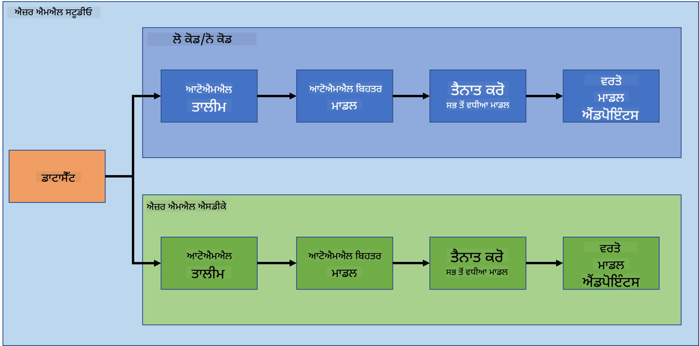

ਹਰ ਤਰੀਕੇ ਦੇ ਆਪਣੇ ਫਾਇਦੇ ਅਤੇ ਨੁਕਸਾਨ ਹਨ। Low code/No code ਤਰੀਕਾ ਸ਼ੁਰੂਆਤ ਕਰਨ ਲਈ ਆਸਾਨ ਹੈ ਕਿਉਂਕਿ ਇਸ ਵਿੱਚ GUI (ਗ੍ਰਾਫਿਕਲ ਯੂਜ਼ਰ ਇੰਟਰਫੇਸ) ਨਾਲ ਕੰਮ ਕਰਨਾ ਸ਼ਾਮਲ ਹੈ, ਜਿਸ ਲਈ ਕੋਡ ਦੀ ਕੋਈ ਪਿਛਲੀ ਜਾਣਕਾਰੀ ਲੋੜੀਂਦੀ ਨਹੀਂ। ਇਹ ਤਰੀਕਾ ਪ੍ਰੋਜੈਕਟ ਦੀ ਯੋਗਤਾ ਦੀ ਤੇਜ਼ੀ ਨਾਲ ਜਾਂਚ ਕਰਨ ਅਤੇ POC (ਪ੍ਰੂਫ ਆਫ ਕਾਂਸੈਪਟ) ਬਣਾਉਣ ਲਈ ਸਹਾਇਕ ਹੈ। ਹਾਲਾਂਕਿ, ਜਦੋਂ ਪ੍ਰੋਜੈਕਟ ਵਧਦਾ ਹੈ ਅਤੇ ਚੀਜ਼ਾਂ ਨੂੰ ਪ੍ਰੋਡਕਸ਼ਨ ਲਈ ਤਿਆਰ ਕਰਨ ਦੀ ਲੋੜ ਹੁੰਦੀ ਹੈ, ਤਾਂ GUI ਰਾਹੀਂ ਰਿਸੋਰਸ ਬਣਾਉਣਾ ਸੰਭਵ ਨਹੀਂ ਹੁੰਦਾ। ਇਸ ਸਥਿਤੀ ਵਿੱਚ, ਰਿਸੋਰਸ ਬਣਾਉਣ ਤੋਂ ਲੈ ਕੇ ਮਾਡਲ ਡਿਪਲੋਇਮੈਂਟ ਤੱਕ ਹਰ ਚੀਜ਼ ਨੂੰ ਪ੍ਰੋਗਰਾਮਿੰਗ ਰਾਹੀਂ ਆਟੋਮੇਟ ਕਰਨ ਦੀ ਲੋੜ ਹੁੰਦੀ ਹੈ। ਇੱਥੇ ਹੀ Azure ML SDK ਦੀ ਜਾਣਕਾਰੀ ਮਹੱਤਵਪੂਰਨ ਬਣ ਜਾਂਦੀ ਹੈ।

|                   | Low code/No code | Azure ML SDK              |
|-------------------|------------------|---------------------------|
| ਕੋਡ ਵਿੱਚ ਦੱਖਲਤਾ | ਲੋੜੀਂਦੀ ਨਹੀਂ     | ਲੋੜੀਂਦੀ ਹੈ                |
| ਵਿਕਾਸ ਲਈ ਸਮਾਂ    | ਤੇਜ਼ ਅਤੇ ਆਸਾਨ    | ਕੋਡ ਦੇ ਹੁਨਰ 'ਤੇ ਨਿਰਭਰ ਕਰਦਾ ਹੈ |
| ਪ੍ਰੋਡਕਸ਼ਨ ਲਈ ਤਿਆਰ | ਨਹੀਂ              | ਹਾਂ                        |

### 1.3 ਦਿਲ ਦੇ ਫੇਲ ਹੋਣ ਦਾ ਡਾਟਾਸੈੱਟ:

ਕਾਰਡੀਓਵੈਸਕੁਲਰ ਬਿਮਾਰੀਆਂ (CVDs) ਦੁਨੀਆ ਭਰ ਵਿੱਚ ਮੌਤ ਦਾ ਨੰਬਰ 1 ਕਾਰਨ ਹਨ, ਜੋ ਦੁਨੀਆ ਭਰ ਵਿੱਚ 31% ਮੌਤਾਂ ਲਈ ਜ਼ਿੰਮੇਵਾਰ ਹਨ। ਤੰਬਾਕੂ ਦੀ ਵਰਤੋਂ, ਅਣਹੈਲਥੀ ਡਾਇਟ ਅਤੇ ਮੋਟਾਪਾ, ਸ਼ਾਰੀਰਿਕ ਨਿਸ਼ਕ੍ਰਿਆਤਾ ਅਤੇ ਸ਼ਰਾਬ ਦੀ ਹਾਨੀਕਾਰਕ ਵਰਤੋਂ ਵਰਗੇ ਵਾਤਾਵਰਣਕ ਅਤੇ ਵਿਹਾਰਕ ਖਤਰੇ ਦੇ ਕਾਰਕ ਅੰਦਾਜ਼ਾ ਮਾਡਲਾਂ ਲਈ ਵਿਸ਼ੇਸ਼ਤਾਵਾਂ ਵਜੋਂ ਵਰਤੇ ਜਾ ਸਕਦੇ ਹਨ। CVD ਦੇ ਵਿਕਾਸ ਦੀ ਸੰਭਾਵਨਾ ਦਾ ਅੰਦਾਜ਼ਾ ਲਗਾਉਣ ਦੇ ਯੋਗ ਹੋਣਾ ਉੱਚ ਖਤਰੇ ਵਾਲੇ ਲੋਕਾਂ ਵਿੱਚ ਹਮਲਿਆਂ ਨੂੰ ਰੋਕਣ ਲਈ ਬਹੁਤ ਲਾਭਦਾਇਕ ਹੋ ਸਕਦਾ ਹੈ।

Kaggle ਨੇ ਇੱਕ [ਦਿਲ ਦੇ ਫੇਲ ਹੋਣ ਦਾ ਡਾਟਾਸੈੱਟ](https://www.kaggle.com/andrewmvd/heart-failure-clinical-data) ਜਨਤਕ ਤੌਰ 'ਤੇ ਉਪਲਬਧ ਕਰਵਾਇਆ ਹੈ, ਜਿਸਨੂੰ ਅਸੀਂ ਇਸ ਪ੍ਰੋਜੈਕਟ ਲਈ ਵਰਤਾਂਗੇ। ਤੁਸੀਂ ਹੁਣ ਡਾਟਾਸੈੱਟ ਡਾਊਨਲੋਡ ਕਰ ਸਕਦੇ ਹੋ। ਇਹ ਇੱਕ ਟੇਬੂਲਰ ਡਾਟਾਸੈੱਟ ਹੈ ਜਿਸ ਵਿੱਚ 13 ਕਾਲਮ (12 ਵਿਸ਼ੇਸ਼ਤਾਵਾਂ ਅਤੇ 1 ਟਾਰਗੇਟ ਵੈਰੀਏਬਲ) ਅਤੇ 299 ਕਤਾਰਾਂ ਹਨ।

|    | ਵੈਰੀਏਬਲ ਦਾ ਨਾਮ            | ਕਿਸਮ            | ਵੇਰਵਾ                                                   | ਉਦਾਹਰਨ           |
|----|---------------------------|-----------------|-------------------------------------------------------|-------------------|
| 1  | ਉਮਰ                      | ਗਿਣਤੀ           | ਮਰੀਜ਼ ਦੀ ਉਮਰ                                          | 25                |
| 2  | ਐਨੀਮੀਆ                  | ਬੂਲੀਅਨ         | ਲਾਲ ਖੂਨ ਦੇ ਸੈੱਲਾਂ ਜਾਂ ਹਿਮੋਗਲੋਬਿਨ ਦੀ ਘਟਨਾ            | 0 ਜਾਂ 1            |
| 3  | ਕ੍ਰੀਏਟਿਨਾਈਨ ਫਾਸਫੋਕਾਈਨੇਜ਼ | ਗਿਣਤੀ           | ਖੂਨ ਵਿੱਚ CPK ਐਂਜ਼ਾਈਮ ਦੀ ਪੱਧਰ                        | 542               |
| 4  | ਡਾਇਬਟੀਜ਼                 | ਬੂਲੀਅਨ         | ਜੇ ਮਰੀਜ਼ ਨੂੰ ਸ਼ੂਗਰ ਹੈ                                 | 0 ਜਾਂ 1            |
| 5  | ਇਜੈਕਸ਼ਨ ਫ੍ਰੈਕਸ਼ਨ         | ਗਿਣਤੀ           | ਹਰ ਸੰਕੋਚਣ 'ਤੇ ਦਿਲ ਨੂੰ ਛੱਡਣ ਵਾਲੇ ਖੂਨ ਦੀ ਪ੍ਰਤੀਸ਼ਤਤਾ   | 45                |
| 6  | ਉੱਚ ਰਕਤ ਦਬਾਅ            | ਬੂਲੀਅਨ         | ਜੇ ਮਰੀਜ਼ ਨੂੰ ਹਾਈਪਰਟੈਂਸ਼ਨ ਹੈ                          | 0 ਜਾਂ 1            |
| 7  | ਪਲੇਟਲੈਟਸ                 | ਗਿਣਤੀ           | ਖੂਨ ਵਿੱਚ ਪਲੇਟਲੈਟਸ ਦੀ ਮਾਤਰਾ                          | 149000            |
| 8  | ਸਿਰਮ ਕ੍ਰੀਏਟਿਨਾਈਨ        | ਗਿਣਤੀ           | ਖੂਨ ਵਿੱਚ ਸਿਰਮ ਕ੍ਰੀਏਟਿਨਾਈਨ ਦੀ ਪੱਧਰ                  | 0.5               |
| 9  | ਸਿਰਮ ਸੋਡੀਅਮ              | ਗਿਣਤੀ           | ਖੂਨ ਵਿੱਚ ਸਿਰਮ ਸੋਡੀਅਮ ਦੀ ਪੱਧਰ                         | 137               |
| 10 | ਲਿੰਗ                      | ਬੂਲੀਅਨ         | ਮਹਿਲਾ ਜਾਂ ਪੁਰਸ਼                                        | 0 ਜਾਂ 1            |
| 11 | ਧੂਮਰਪਾਨ                  | ਬੂਲੀਅਨ         | ਜੇ ਮਰੀਜ਼ ਧੂਮਰਪਾਨ ਕਰਦਾ ਹੈ                             | 0 ਜਾਂ 1            |
| 12 | ਸਮਾਂ                      | ਗਿਣਤੀ           | ਫਾਲੋਅਪ ਅਵਧੀ (ਦਿਨਾਂ ਵਿੱਚ)                             | 4                 |
|----|---------------------------|-----------------|-------------------------------------------------------|-------------------|
| 21 | ਮੌਤ_ਘਟਨਾ [ਟਾਰਗੇਟ]       | ਬੂਲੀਅਨ         | ਜੇ ਮਰੀਜ਼ ਫਾਲੋਅਪ ਅਵਧੀ ਦੌਰਾਨ ਮਰ ਜਾਂਦਾ ਹੈ               | 0 ਜਾਂ 1            |

ਡਾਟਾਸੈੱਟ ਪ੍ਰਾਪਤ ਕਰਨ ਤੋਂ ਬਾਅਦ, ਅਸੀਂ Azure ਵਿੱਚ ਪ੍ਰੋਜੈਕਟ ਸ਼ੁਰੂ ਕਰ ਸਕਦੇ ਹਾਂ।

## 2. Azure ML Studio ਵਿੱਚ ਲੋ ਕੋਡ/ਨੋ ਕੋਡ ਮਾਡਲ ਟ੍ਰੇਨਿੰਗ

### 2.1 Azure ML ਵਰਕਸਪੇਸ ਬਣਾਉਣਾ

Azure ML ਵਿੱਚ ਮਾਡਲ ਟ੍ਰੇਨ ਕਰਨ ਲਈ, ਤੁਹਾਨੂੰ ਪਹਿਲਾਂ ਇੱਕ Azure ML ਵਰਕਸਪੇਸ ਬਣਾਉਣ ਦੀ ਲੋੜ ਹੈ। ਵਰਕਸਪੇਸ Azure Machine Learning ਲਈ ਸਿਖਰ-ਪੱਧਰ ਦਾ ਰਿਸੋਰਸ ਹੈ, ਜੋ ਤੁਹਾਡੇ ਦੁਆਰਾ ਬਣਾਏ ਗਏ ਸਾਰੇ ਆਰਟੀਫੈਕਟਾਂ ਨਾਲ ਕੰਮ ਕਰਨ ਲਈ ਇੱਕ ਕੇਂਦਰੀ ਸਥਾਨ ਪ੍ਰਦਾਨ ਕਰਦਾ ਹੈ। ਵਰਕਸਪੇਸ ਸਾਰੇ ਟ੍ਰੇਨਿੰਗ ਰਨ ਦਾ ਇਤਿਹਾਸ ਰੱਖਦਾ ਹੈ, ਜਿਸ ਵਿੱਚ ਲੌਗ, ਮੈਟ੍ਰਿਕਸ, ਆਉਟਪੁੱਟ, ਅਤੇ ਤੁਹਾਡੇ ਸਕ੍ਰਿਪਟਾਂ ਦੀ ਸਨੈਪਸ਼ਾਟ ਸ਼ਾਮਲ ਹੁੰਦੀ ਹੈ। ਤੁਸੀਂ ਇਸ ਜਾਣਕਾਰੀ ਦੀ ਵਰਤੋਂ ਕਰਕੇ ਇਹ ਨਿਰਧਾਰਤ ਕਰ ਸਕਦੇ ਹੋ ਕਿ ਕਿਹੜਾ ਟ੍ਰੇਨਿੰਗ ਰਨ ਸਭ ਤੋਂ ਵਧੀਆ ਮਾਡਲ ਪੈਦਾ ਕਰਦਾ ਹੈ। [ਹੋਰ ਜਾਣੋ](https://docs.microsoft.com/azure/machine-learning/concept-workspace?WT.mc_id=academic-77958-bethanycheum&ocid=AID3041109)

ਇਹ ਸਿਫਾਰਸ਼ ਕੀਤੀ ਜਾਂਦੀ ਹੈ ਕਿ ਤੁਸੀਂ ਆਪਣੇ ਓਪਰੇਟਿੰਗ ਸਿਸਟਮ ਨਾਲ ਅਨੁਕੂਲ ਸਭ ਤੋਂ ਅਪ-ਟੂ-ਡੇਟ ਬ੍ਰਾਊਜ਼ਰ ਦੀ ਵਰਤੋਂ ਕਰੋ। ਹੇਠਾਂ ਦਿੱਤੇ ਬ੍ਰਾਊਜ਼ਰ ਸਹਾਇਕ ਹਨ:

- ਮਾਈਕਰੋਸਾਫਟ ਐਜ (ਨਵਾਂ ਮਾਈਕਰੋਸਾਫਟ ਐਜ, ਨਵਾਂ ਵਰਜਨ। ਮਾਈਕਰੋਸਾਫਟ ਐਜ ਲੈਗਸੀ ਨਹੀਂ)
- ਸਫਾਰੀ (ਨਵਾਂ ਵਰਜਨ, ਸਿਰਫ ਮੈਕ ਲਈ)
- ਕ੍ਰੋਮ (ਨਵਾਂ ਵਰਜਨ)
- ਫਾਇਰਫਾਕਸ
- **ਜੁੜਿਆ ਹੋਇਆ ਕੰਪਿਊਟ**: ਮੌਜੂਦਾ Azure ਕੰਪਿਊਟ ਸਰੋਤਾਂ ਨਾਲ ਲਿੰਕ ਕਰਦਾ ਹੈ, ਜਿਵੇਂ ਕਿ Virtual Machines ਜਾਂ Azure Databricks ਕਲੱਸਟਰ।

#### 2.2.1 ਆਪਣੇ ਕੰਪਿਊਟ ਸਰੋਤਾਂ ਲਈ ਸਹੀ ਵਿਕਲਪ ਚੁਣਨਾ

ਕੰਪਿਊਟ ਸਰੋਤ ਬਣਾਉਣ ਸਮੇਂ ਕੁਝ ਮਹੱਤਵਪੂਰਨ ਗੱਲਾਂ ਦਾ ਧਿਆਨ ਰੱਖਣਾ ਚਾਹੀਦਾ ਹੈ, ਅਤੇ ਇਹ ਚੋਣਾਂ ਅਹਿਮ ਫੈਸਲੇ ਹੋ ਸਕਦੇ ਹਨ।

**ਤੁਹਾਨੂੰ CPU ਚਾਹੀਦਾ ਹੈ ਜਾਂ GPU?**

CPU (Central Processing Unit) ਇੱਕ ਇਲੈਕਟ੍ਰਾਨਿਕ ਸਰਕਟਰੀ ਹੈ ਜੋ ਕੰਪਿਊਟਰ ਪ੍ਰੋਗਰਾਮ ਦੇ ਹੁਕਮਾਂ ਨੂੰ ਅੰਜਾਮ ਦਿੰਦੀ ਹੈ। GPU (Graphics Processing Unit) ਇੱਕ ਵਿਸ਼ੇਸ਼ ਇਲੈਕਟ੍ਰਾਨਿਕ ਸਰਕਟ ਹੈ ਜੋ ਗ੍ਰਾਫਿਕਸ-ਸਬੰਧੀ ਕੋਡ ਨੂੰ ਬਹੁਤ ਤੇਜ਼ੀ ਨਾਲ ਚਲਾਉਣ ਦੇ ਯੋਗ ਹੈ।

CPU ਅਤੇ GPU ਦੇ ਆਰਕੀਟੈਕਚਰ ਵਿੱਚ ਮੁੱਖ ਅੰਤਰ ਇਹ ਹੈ ਕਿ CPU ਵਿਆਪਕ ਕੰਮਾਂ ਨੂੰ ਤੇਜ਼ੀ ਨਾਲ ਸੰਭਾਲਣ ਲਈ ਡਿਜ਼ਾਈਨ ਕੀਤਾ ਗਿਆ ਹੈ (ਜਿਵੇਂ ਕਿ CPU ਘੜੀ ਦੀ ਗਤੀ ਨਾਲ ਮਾਪਿਆ ਜਾਂਦਾ ਹੈ), ਪਰ ਇਹ ਕੰਮਾਂ ਦੀ ਸਮਕਾਲੀਤਾ ਵਿੱਚ ਸੀਮਿਤ ਹੁੰਦਾ ਹੈ। GPU ਪੈਰਲਲ ਕੰਪਿਊਟਿੰਗ ਲਈ ਡਿਜ਼ਾਈਨ ਕੀਤੇ ਗਏ ਹਨ ਅਤੇ ਇਸ ਲਈ ਡੀਪ ਲਰਨਿੰਗ ਕੰਮਾਂ ਲਈ ਬਹੁਤ ਵਧੀਆ ਹਨ।

| CPU                                     | GPU                         |
|-----------------------------------------|-----------------------------|
| ਘੱਟ ਮਹਿੰਗਾ                              | ਜ਼ਿਆਦਾ ਮਹਿੰਗਾ              |
| ਘੱਟ ਸਮਕਾਲੀਤਾ                           | ਵਧੀਆ ਸਮਕਾਲੀਤਾ             |
| ਡੀਪ ਲਰਨਿੰਗ ਮਾਡਲਾਂ ਨੂੰ ਸਿਖਾਉਣ ਵਿੱਚ ਹੌਲੀ | ਡੀਪ ਲਰਨਿੰਗ ਲਈ ਉਤਕ੍ਰਿਸ਼ਟ    |

**ਕਲੱਸਟਰ ਦਾ ਆਕਾਰ**

ਵੱਡੇ ਕਲੱਸਟਰ ਜ਼ਿਆਦਾ ਮਹਿੰਗੇ ਹੁੰਦੇ ਹਨ ਪਰ ਇਹ ਬਿਹਤਰ ਪ੍ਰਤੀਕ੍ਰਿਆਸ਼ੀਲਤਾ ਪ੍ਰਦਾਨ ਕਰਦੇ ਹਨ। ਇਸ ਲਈ, ਜੇ ਤੁਹਾਡੇ ਕੋਲ ਸਮਾਂ ਹੈ ਪਰ ਪੈਸੇ ਘੱਟ ਹਨ, ਤਾਂ ਤੁਹਾਨੂੰ ਛੋਟੇ ਕਲੱਸਟਰ ਨਾਲ ਸ਼ੁਰੂ ਕਰਨਾ ਚਾਹੀਦਾ ਹੈ। ਵਿਰੋਧੀ ਤੌਰ 'ਤੇ, ਜੇ ਤੁਹਾਡੇ ਕੋਲ ਪੈਸਾ ਹੈ ਪਰ ਸਮਾਂ ਘੱਟ ਹੈ, ਤਾਂ ਤੁਹਾਨੂੰ ਵੱਡੇ ਕਲੱਸਟਰ ਨਾਲ ਸ਼ੁਰੂ ਕਰਨਾ ਚਾਹੀਦਾ ਹੈ।

**VM ਆਕਾਰ**

ਤੁਹਾਡੇ ਸਮੇਂ ਅਤੇ ਬਜਟ ਦੀਆਂ ਪਾਬੰਦੀਆਂ ਦੇ ਅਧਾਰ 'ਤੇ, ਤੁਸੀਂ ਆਪਣੇ RAM, ਡਿਸਕ, ਕੋਰਾਂ ਦੀ ਗਿਣਤੀ ਅਤੇ ਘੜੀ ਦੀ ਗਤੀ ਦਾ ਆਕਾਰ ਵਧਾ ਸਕਦੇ ਹੋ। ਇਹ ਸਾਰੇ ਪੈਰਾਮੀਟਰ ਵਧਾਉਣਾ ਮਹਿੰਗਾ ਹੋਵੇਗਾ, ਪਰ ਇਹ ਬਿਹਤਰ ਪ੍ਰਦਰਸ਼ਨ ਦੇਵੇਗਾ।

**Dedicated ਜਾਂ Low-Priority Instances?**

Low-priority instance ਦਾ ਮਤਲਬ ਹੈ ਕਿ ਇਹ ਰੁਕਾਵਟਯੋਗ ਹੈ: ਮੂਲ ਤੌਰ 'ਤੇ, Microsoft Azure ਉਹ ਸਰੋਤ ਲੈ ਸਕਦਾ ਹੈ ਅਤੇ ਉਨ੍ਹਾਂ ਨੂੰ ਕਿਸੇ ਹੋਰ ਕੰਮ ਲਈ ਸੌਂਪ ਸਕਦਾ ਹੈ, ਇਸ ਤਰ੍ਹਾਂ ਇੱਕ ਜੌਬ ਨੂੰ ਰੁਕਾਵਟ ਪਾਉਣ ਵਾਲਾ। ਇੱਕ Dedicated instance, ਜਾਂ non-interruptible, ਦਾ ਮਤਲਬ ਹੈ ਕਿ ਜੌਬ ਤੁਹਾਡੀ ਇਜਾਜ਼ਤ ਤੋਂ ਬਿਨਾਂ ਕਦੇ ਵੀ ਖਤਮ ਨਹੀਂ ਕੀਤੀ ਜਾਵੇਗੀ। 
ਇਹ ਸਮਾਂ ਅਤੇ ਪੈਸੇ ਦੇ ਵਿਚਾਰ ਦਾ ਇੱਕ ਹੋਰ ਪੱਖ ਹੈ, ਕਿਉਂਕਿ interruptible instances Dedicated ones ਨਾਲੋਂ ਘੱਟ ਮਹਿੰਗੇ ਹੁੰਦੇ ਹਨ।

#### 2.2.2 ਕੰਪਿਊਟ ਕਲੱਸਟਰ ਬਣਾਉਣਾ

[Azure ML workspace](https://ml.azure.com/) ਵਿੱਚ ਜੋ ਅਸੀਂ ਪਹਿਲਾਂ ਬਣਾਇਆ ਸੀ, ਕੰਪਿਊਟ 'ਤੇ ਜਾਓ ਅਤੇ ਤੁਸੀਂ ਵੱਖ-ਵੱਖ ਕੰਪਿਊਟ ਸਰੋਤਾਂ ਨੂੰ ਵੇਖ ਸਕੋਗੇ ਜੋ ਅਸੀਂ ਹੁਣੇ ਚਰਚਾ ਕੀਤੀ (ਜਿਵੇਂ ਕਿ compute instances, compute clusters, inference clusters ਅਤੇ attached compute)। ਇਸ ਪ੍ਰੋਜੈਕਟ ਲਈ, ਸਾਨੂੰ ਮਾਡਲ ਟ੍ਰੇਨਿੰਗ ਲਈ ਇੱਕ ਕੰਪਿਊਟ ਕਲੱਸਟਰ ਦੀ ਲੋੜ ਹੋਵੇਗੀ। Studio ਵਿੱਚ, "Compute" ਮੀਨੂ 'ਤੇ ਕਲਿੱਕ ਕਰੋ, ਫਿਰ "Compute cluster" ਟੈਬ 'ਤੇ ਕਲਿੱਕ ਕਰੋ ਅਤੇ ਕੰਪਿਊਟ ਕਲੱਸਟਰ ਬਣਾਉਣ ਲਈ "+ New" ਬਟਨ 'ਤੇ ਕਲਿੱਕ ਕਰੋ।

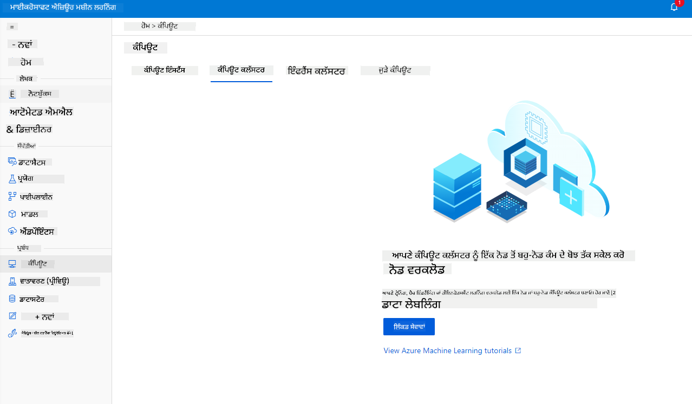

1. ਆਪਣੇ ਵਿਕਲਪ ਚੁਣੋ: Dedicated vs Low priority, CPU ਜਾਂ GPU, VM ਆਕਾਰ ਅਤੇ ਕੋਰਾਂ ਦੀ ਗਿਣਤੀ (ਤੁਸੀਂ ਇਸ ਪ੍ਰੋਜੈਕਟ ਲਈ ਡਿਫਾਲਟ ਸੈਟਿੰਗਾਂ ਰੱਖ ਸਕਦੇ ਹੋ)।
2. Next ਬਟਨ 'ਤੇ ਕਲਿੱਕ ਕਰੋ।

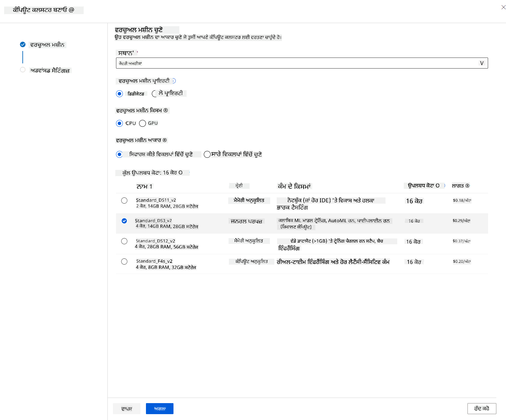

3. ਕਲੱਸਟਰ ਨੂੰ ਇੱਕ ਕੰਪਿਊਟ ਨਾਮ ਦਿਓ।
4. ਆਪਣੇ ਵਿਕਲਪ ਚੁਣੋ: ਘੱਟੋ-ਘੱਟ/ਵੱਧ ਤੋਂ ਵੱਧ ਨੋਡਾਂ ਦੀ ਗਿਣਤੀ, scale down ਤੋਂ ਪਹਿਲਾਂ idle seconds, SSH access। ਧਿਆਨ ਦਿਓ ਕਿ ਜੇ ਘੱਟੋ-ਘੱਟ ਨੋਡਾਂ ਦੀ ਗਿਣਤੀ 0 ਹੈ, ਤਾਂ ਤੁਸੀਂ ਕਲੱਸਟਰ idle ਹੋਣ 'ਤੇ ਪੈਸਾ ਬਚਾ ਸਕਦੇ ਹੋ। ਧਿਆਨ ਦਿਓ ਕਿ ਵੱਧ ਤੋਂ ਵੱਧ ਨੋਡਾਂ ਦੀ ਗਿਣਤੀ ਜ਼ਿਆਦਾ ਹੋਣ 'ਤੇ ਟ੍ਰੇਨਿੰਗ ਛੇਤੀ ਹੋਵੇਗੀ। ਵੱਧ ਤੋਂ ਵੱਧ ਨੋਡਾਂ ਦੀ ਸਿਫਾਰਸ਼ੀ ਗਿਣਤੀ 3 ਹੈ।  
5. "Create" ਬਟਨ 'ਤੇ ਕਲਿੱਕ ਕਰੋ। ਇਹ ਕਦਮ ਕੁਝ ਮਿੰਟ ਲੈ ਸਕਦਾ ਹੈ।

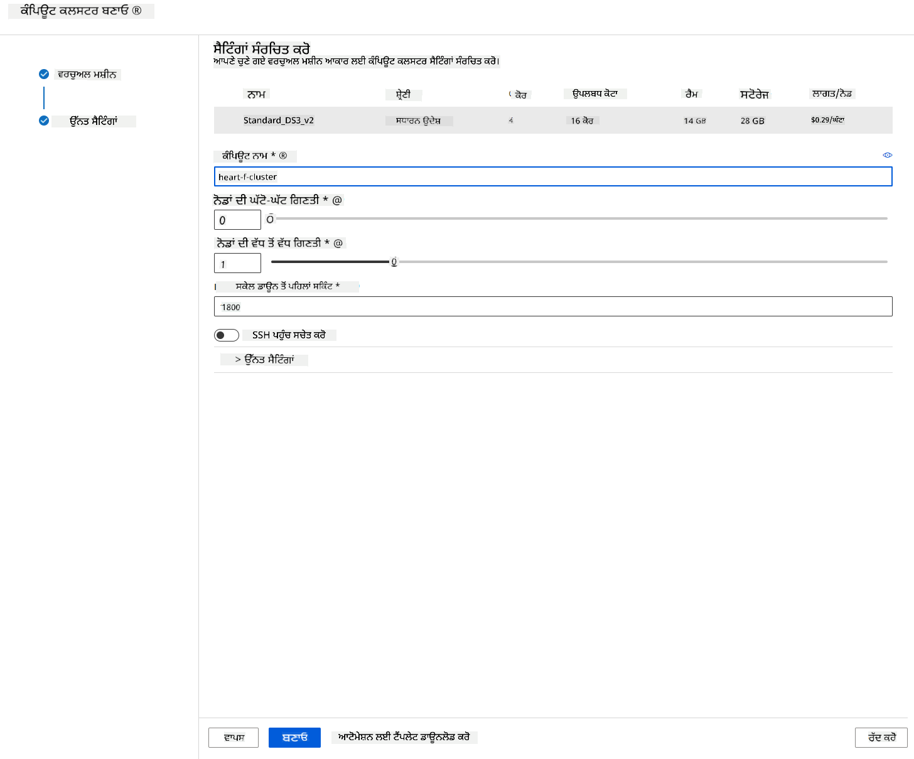

ਸ਼ਾਨਦਾਰ! ਹੁਣ ਜਦੋਂ ਕਿ ਸਾਡੇ ਕੋਲ ਇੱਕ Compute cluster ਹੈ, ਸਾਨੂੰ ਡਾਟਾ ਨੂੰ Azure ML Studio ਵਿੱਚ ਲੋਡ ਕਰਨ ਦੀ ਲੋੜ ਹੈ।

### 2.3 ਡਾਟਾਸੇਟ ਲੋਡ ਕਰਨਾ

1. [Azure ML workspace](https://ml.azure.com/) ਵਿੱਚ ਜੋ ਅਸੀਂ ਪਹਿਲਾਂ ਬਣਾਇਆ ਸੀ, "Datasets" 'ਤੇ ਕਲਿੱਕ ਕਰੋ ਅਤੇ "+ Create dataset" ਬਟਨ 'ਤੇ ਕਲਿੱਕ ਕਰਕੇ ਇੱਕ ਡਾਟਾਸੇਟ ਬਣਾਓ। "From local files" ਵਿਕਲਪ ਚੁਣੋ ਅਤੇ Kaggle ਡਾਟਾਸੇਟ ਨੂੰ ਚੁਣੋ ਜੋ ਅਸੀਂ ਪਹਿਲਾਂ ਡਾਊਨਲੋਡ ਕੀਤਾ ਸੀ।

   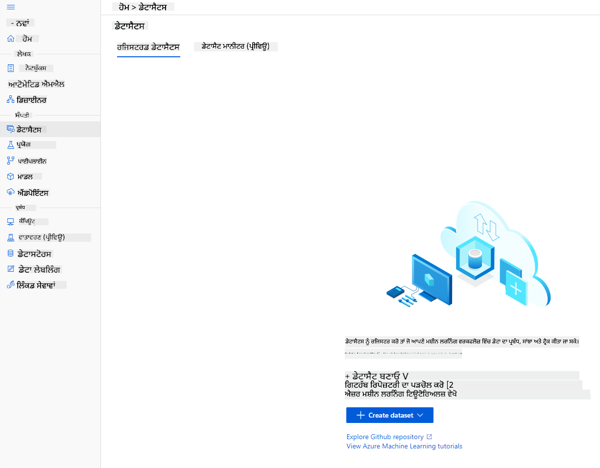

2. ਆਪਣੇ ਡਾਟਾਸੇਟ ਨੂੰ ਇੱਕ ਨਾਮ, ਕਿਸਮ ਅਤੇ ਵੇਰਵਾ ਦਿਓ। Next 'ਤੇ ਕਲਿੱਕ ਕਰੋ। ਫਾਈਲਾਂ ਤੋਂ ਡਾਟਾ ਅੱਪਲੋਡ ਕਰੋ। Next 'ਤੇ ਕਲਿੱਕ ਕਰੋ।

   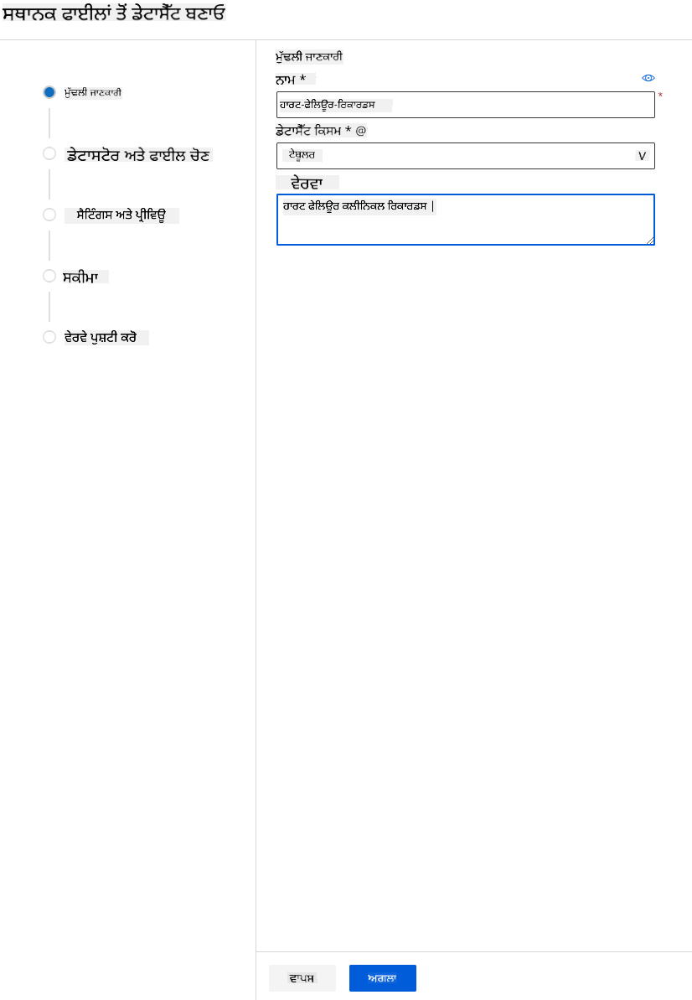

3. Schema ਵਿੱਚ, ਹੇਠਾਂ ਦਿੱਤੇ ਫੀਚਰਾਂ ਲਈ ਡਾਟਾ ਕਿਸਮ ਨੂੰ Boolean ਵਿੱਚ ਬਦਲੋ: anaemia, diabetes, high blood pressure, sex, smoking, ਅਤੇ DEATH_EVENT। Next 'ਤੇ ਕਲਿੱਕ ਕਰੋ ਅਤੇ Create 'ਤੇ ਕਲਿੱਕ ਕਰੋ।

   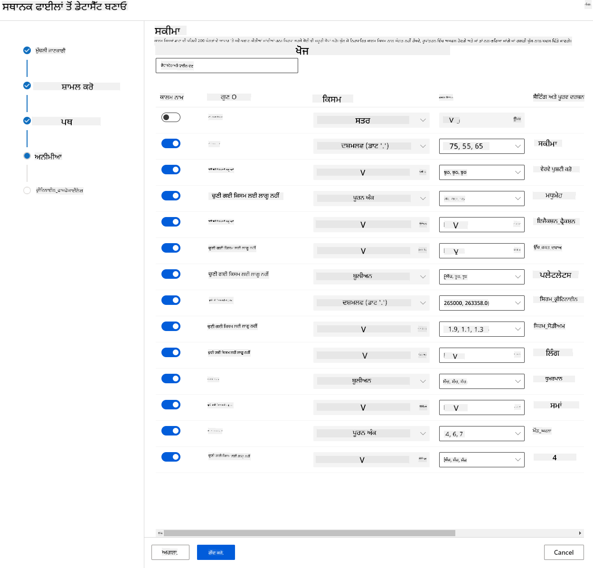

ਸ਼ਾਨਦਾਰ! ਹੁਣ ਜਦੋਂ ਕਿ ਡਾਟਾਸੇਟ ਜਗ੍ਹਾ 'ਤੇ ਹੈ ਅਤੇ ਕੰਪਿਊਟ ਕਲੱਸਟਰ ਬਣਾਇਆ ਗਿਆ ਹੈ, ਅਸੀਂ ਮਾਡਲ ਦੀ ਟ੍ਰੇਨਿੰਗ ਸ਼ੁਰੂ ਕਰ ਸਕਦੇ ਹਾਂ!

### 2.4 AutoML ਨਾਲ ਘੱਟ ਕੋਡ/ਬਿਨਾ ਕੋਡ ਟ੍ਰੇਨਿੰਗ

ਪ੍ਰੰਪਰਾਗਤ ਮਸ਼ੀਨ ਲਰਨਿੰਗ ਮਾਡਲ ਵਿਕਾਸ ਸਰੋਤ-ਗ੍ਰਾਹਕ ਹੁੰਦਾ ਹੈ, ਜਿਸ ਵਿੱਚ ਕਈ ਮਾਡਲਾਂ ਨੂੰ ਬਣਾਉਣ ਅਤੇ ਤੁਲਨਾ ਕਰਨ ਲਈ ਮਹੱਤਵਪੂਰਨ ਡੋਮੇਨ ਗਿਆਨ ਅਤੇ ਸਮੇਂ ਦੀ ਲੋੜ ਹੁੰਦੀ ਹੈ।  
Automated machine learning (AutoML) ਮਸ਼ੀਨ ਲਰਨਿੰਗ ਮਾਡਲ ਵਿਕਾਸ ਦੇ ਸਮਾਂ-ਖਪਤ ਵਾਲੇ, ਦੁਹਰਾਏ ਜਾਣ ਵਾਲੇ ਕੰਮਾਂ ਨੂੰ ਆਟੋਮੈਟ ਕਰਨ ਦੀ ਪ੍ਰਕਿਰਿਆ ਹੈ। ਇਹ ਡਾਟਾ ਸਾਇੰਟਿਸਟਾਂ, ਵਿਸ਼ਲੇਸ਼ਕਾਂ, ਅਤੇ ਡਿਵੈਲਪਰਾਂ ਨੂੰ ML ਮਾਡਲਾਂ ਨੂੰ ਵੱਡੇ ਪੈਮਾਨੇ, ਕੁਸ਼ਲਤਾ, ਅਤੇ ਉਤਪਾਦਕਤਾ ਨਾਲ ਬਣਾਉਣ ਦੀ ਆਗਿਆ ਦਿੰਦਾ ਹੈ, ਸਾਰੇ ਮਾਡਲ ਗੁਣਵੱਤਾ ਨੂੰ ਕਾਇਮ ਰੱਖਦੇ ਹੋਏ। ਇਹ ਉਤਪਾਦਨ-ਤਿਆਰ ML ਮਾਡਲਾਂ ਨੂੰ ਪ੍ਰਾਪਤ ਕਰਨ ਲਈ ਲੱਗਣ ਵਾਲੇ ਸਮੇਂ ਨੂੰ ਘਟਾਉਂਦਾ ਹੈ, ਬਹੁਤ ਹੀ ਆਸਾਨੀ ਅਤੇ ਕੁਸ਼ਲਤਾ ਨਾਲ। [ਹੋਰ ਜਾਣੋ](https://docs.microsoft.com/azure/machine-learning/concept-automated-ml?WT.mc_id=academic-77958-bethanycheum&ocid=AID3041109)

1. [Azure ML workspace](https://ml.azure.com/) ਵਿੱਚ ਜੋ ਅਸੀਂ ਪਹਿਲਾਂ ਬਣਾਇਆ ਸੀ, "Automated ML" 'ਤੇ ਕਲਿੱਕ ਕਰੋ ਅਤੇ ਉਹ ਡਾਟਾਸੇਟ ਚੁਣੋ ਜੋ ਤੁਸੀਂ ਹੁਣੇ ਅੱਪਲੋਡ ਕੀਤਾ ਸੀ। Next 'ਤੇ ਕਲਿੱਕ ਕਰੋ।

   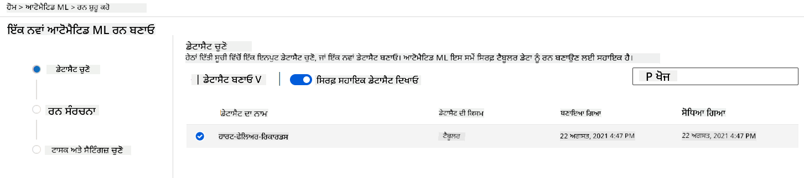

2. ਇੱਕ ਨਵਾਂ experiment name, target column (DEATH_EVENT) ਅਤੇ ਉਹ compute cluster ਦਾਖਲ ਕਰੋ ਜੋ ਅਸੀਂ ਬਣਾਇਆ ਸੀ। Next 'ਤੇ ਕਲਿੱਕ ਕਰੋ।

   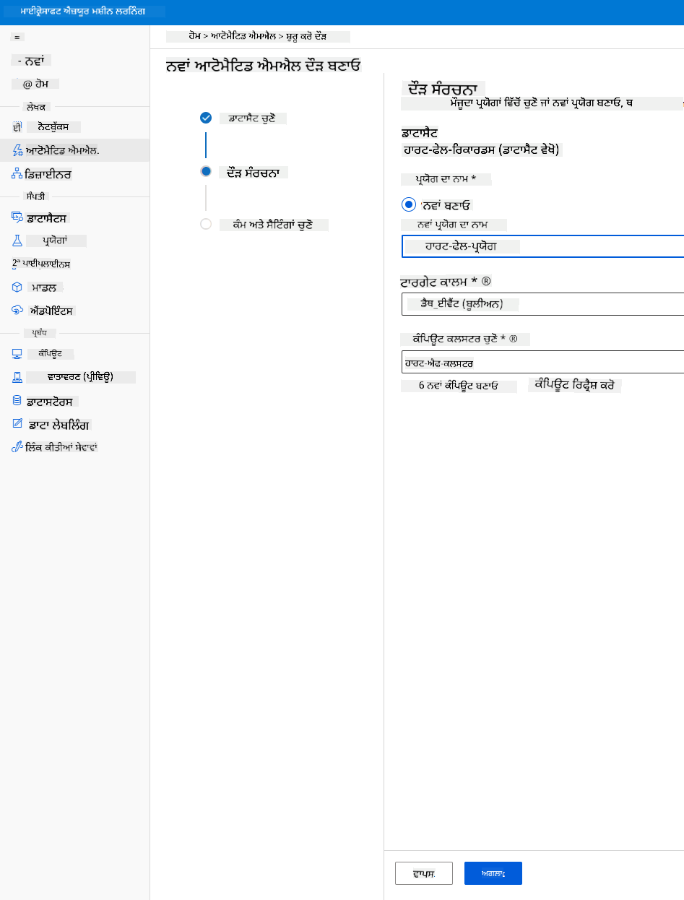

3. "Classification" ਚੁਣੋ ਅਤੇ Finish 'ਤੇ ਕਲਿੱਕ ਕਰੋ। ਇਹ ਕਦਮ 30 ਮਿੰਟ ਤੋਂ 1 ਘੰਟੇ ਦੇ ਵਿਚਕਾਰ ਲੈ ਸਕਦਾ ਹੈ, ਤੁਹਾਡੇ compute cluster ਦੇ ਆਕਾਰ ਦੇ ਅਨੁਸਾਰ।

   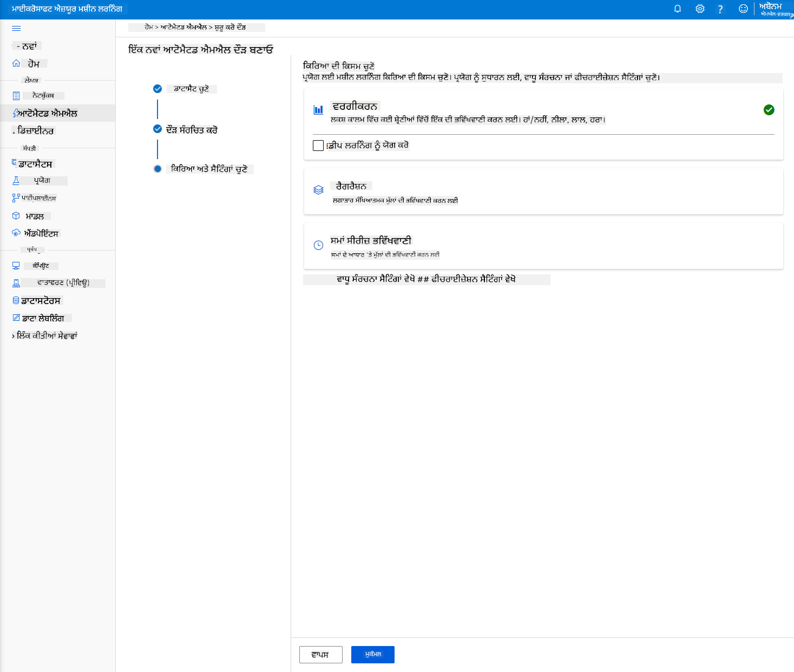

4. ਜਦੋਂ run ਪੂਰਾ ਹੋ ਜਾਂਦਾ ਹੈ, "Automated ML" ਟੈਬ 'ਤੇ ਕਲਿੱਕ ਕਰੋ, ਆਪਣੇ run 'ਤੇ ਕਲਿੱਕ ਕਰੋ, ਅਤੇ "Best model summary" ਕਾਰਡ ਵਿੱਚ Algorithm 'ਤੇ ਕਲਿੱਕ ਕਰੋ।

   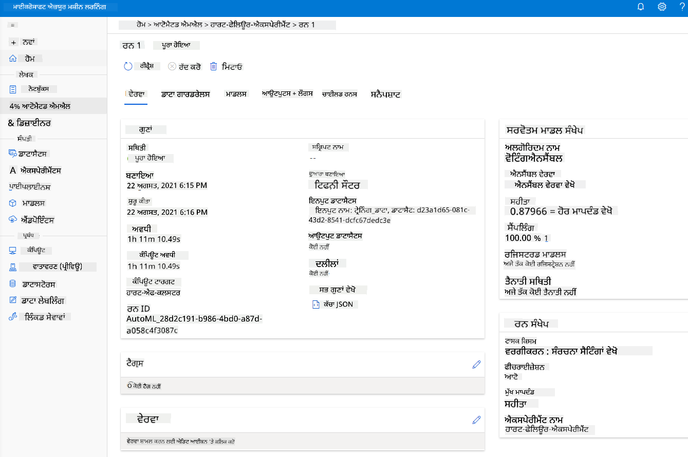

ਇੱਥੇ ਤੁਸੀਂ AutoML ਦੁਆਰਾ ਬਣਾਏ ਗਏ ਸਭ ਤੋਂ ਵਧੀਆ ਮਾਡਲ ਦੀ ਵਿਸਤ੍ਰਿਤ ਵੇਰਵਾ ਦੇਖ ਸਕਦੇ ਹੋ। ਤੁਸੀਂ Models ਟੈਬ ਵਿੱਚ ਹੋਰ ਮੋਡਾਂ ਦੀ ਵੀ ਖੋਜ ਕਰ ਸਕਦੇ ਹੋ। Explanations (preview button) ਵਿੱਚ ਮਾਡਲਾਂ ਦੀ ਖੋਜ ਕਰਨ ਲਈ ਕੁਝ ਮਿੰਟ ਲਓ। ਜਦੋਂ ਤੁਸੀਂ ਉਹ ਮਾਡਲ ਚੁਣ ਲੈਂਦੇ ਹੋ ਜੋ ਤੁਸੀਂ ਵਰਤਣਾ ਚਾਹੁੰਦੇ ਹੋ (ਇੱਥੇ ਅਸੀਂ AutoML ਦੁਆਰਾ ਚੁਣੇ ਗਏ ਸਭ ਤੋਂ ਵਧੀਆ ਮਾਡਲ ਨੂੰ ਚੁਣਾਂਗੇ), ਅਸੀਂ ਵੇਖਾਂਗੇ ਕਿ ਅਸੀਂ ਇਸਨੂੰ deploy ਕਿਵੇਂ ਕਰ ਸਕਦੇ ਹਾਂ।

## 3. ਘੱਟ ਕੋਡ/ਬਿਨਾ ਕੋਡ ਮਾਡਲ ਡਿਪਲੌਇਮੈਂਟ ਅਤੇ endpoint ਖਪਤ
### 3.1 ਮਾਡਲ ਡਿਪਲੌਇਮੈਂਟ

Automated machine learning ਇੰਟਰਫੇਸ ਤੁਹਾਨੂੰ ਸਭ ਤੋਂ ਵਧੀਆ ਮਾਡਲ ਨੂੰ ਕੁਝ ਕਦਮਾਂ ਵਿੱਚ ਇੱਕ ਵੈੱਬ ਸੇਵਾ ਵਜੋਂ deploy ਕਰਨ ਦੀ ਆਗਿਆ ਦਿੰਦਾ ਹੈ। Deployment ਮਾਡਲ ਦੇ ਇੰਟੀਗ੍ਰੇਸ਼ਨ ਦਾ ਮਤਲਬ ਹੈ ਤਾਂ ਜੋ ਇਹ ਨਵੇਂ ਡਾਟਾ ਦੇ ਅਧਾਰ 'ਤੇ ਅਨੁਮਾਨ ਲਗਾ ਸਕੇ ਅਤੇ ਸੰਭਾਵਿਤ ਮੌਕਿਆਂ ਦੇ ਖੇਤਰਾਂ ਦੀ ਪਛਾਣ ਕਰ ਸਕੇ। ਇਸ ਪ੍ਰੋਜੈਕਟ ਲਈ, ਵੈੱਬ ਸੇਵਾ 'ਤੇ deployment ਦਾ ਮਤਲਬ ਹੈ ਕਿ ਮੈਡੀਕਲ ਐਪਲੀਕੇਸ਼ਨ ਮਾਡਲ ਨੂੰ ਖਪਤ ਕਰਨ ਦੇ ਯੋਗ ਹੋਣਗੀਆਂ ਤਾਂ ਜੋ ਆਪਣੇ ਮਰੀਜ਼ਾਂ ਦੇ ਦਿਲ ਦੇ ਦੌਰੇ ਦੇ ਖਤਰੇ ਦਾ live ਅਨੁਮਾਨ ਲਗਾ ਸਕਣ।

ਸਭ ਤੋਂ ਵਧੀਆ ਮਾਡਲ ਦੇ ਵੇਰਵੇ ਵਿੱਚ, "Deploy" ਬਟਨ 'ਤੇ ਕਲਿੱਕ ਕਰੋ।

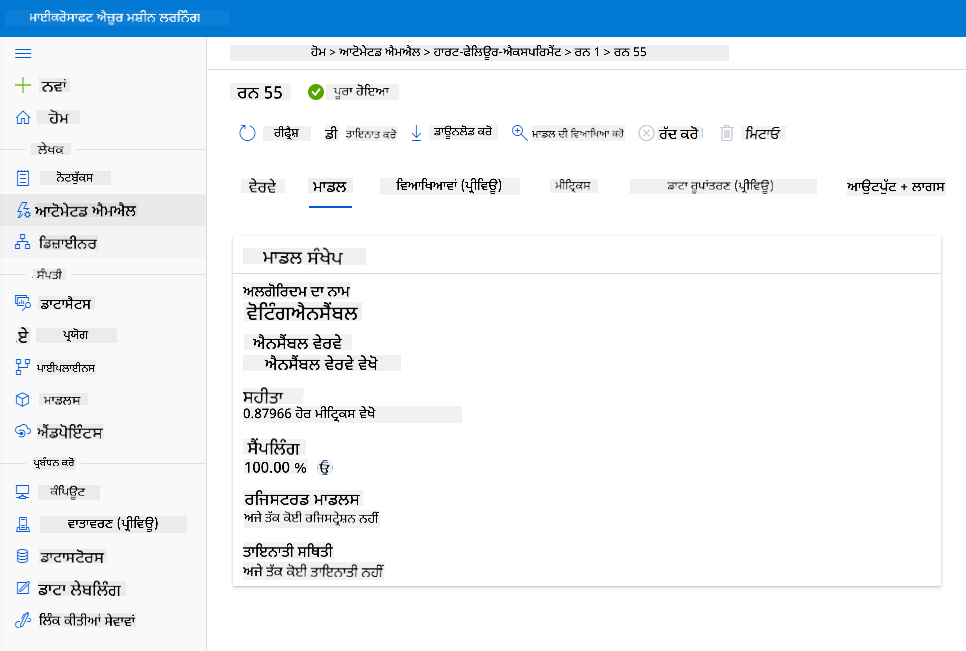

15. ਇਸਨੂੰ ਇੱਕ ਨਾਮ, ਵੇਰਵਾ, compute type (Azure Container Instance), authentication enable ਕਰੋ ਅਤੇ Deploy 'ਤੇ ਕਲਿੱਕ ਕਰੋ। ਇਹ ਕਦਮ ਪੂਰਾ ਹੋਣ ਵਿੱਚ ਲਗਭਗ 20 ਮਿੰਟ ਲੈ ਸਕਦਾ ਹੈ। Deployment ਪ੍ਰਕਿਰਿਆ ਵਿੱਚ ਕਈ ਕਦਮ ਸ਼ਾਮਲ ਹਨ ਜਿਵੇਂ ਕਿ ਮਾਡਲ ਨੂੰ ਰਜਿਸਟਰ ਕਰਨਾ, ਸਰੋਤਾਂ ਨੂੰ ਜਨਰੇਟ ਕਰਨਾ, ਅਤੇ ਉਨ੍ਹਾਂ ਨੂੰ ਵੈੱਬ ਸੇਵਾ ਲਈ ਕਨਫਿਗਰ ਕਰਨਾ। Deploy status ਦੇ ਹੇਠਾਂ ਇੱਕ ਸਥਿਤੀ ਸੁਨੇਹਾ ਦਿਖਾਈ ਦਿੰਦਾ ਹੈ। Deployment ਸਥਿਤੀ ਦੀ ਜਾਂਚ ਕਰਨ ਲਈ ਸਮੇਂ-ਸਮੇਂ 'ਤੇ Refresh 'ਤੇ ਕਲਿੱਕ ਕਰੋ। ਜਦੋਂ ਸਥਿਤੀ "Healthy" ਹੁੰਦੀ ਹੈ, ਤਾਂ ਇਹ deploy ਹੋ ਗਿਆ ਹੈ ਅਤੇ ਚੱਲ ਰਿਹਾ ਹੈ।

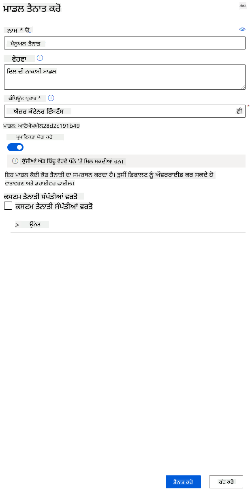

16. ਜਦੋਂ ਇਹ deploy ਹੋ ਜਾਂਦਾ ਹੈ, Endpoint ਟੈਬ 'ਤੇ ਕਲਿੱਕ ਕਰੋ ਅਤੇ ਉਹ endpoint ਚੁਣੋ ਜੋ ਤੁਸੀਂ ਹੁਣੇ deploy ਕੀਤਾ ਸੀ। ਇੱਥੇ ਤੁਸੀਂ endpoint ਬਾਰੇ ਸਾਰੀਆਂ ਜਾਣਕਾਰੀ ਪ੍ਰਾਪਤ ਕਰ ਸਕਦੇ ਹੋ।

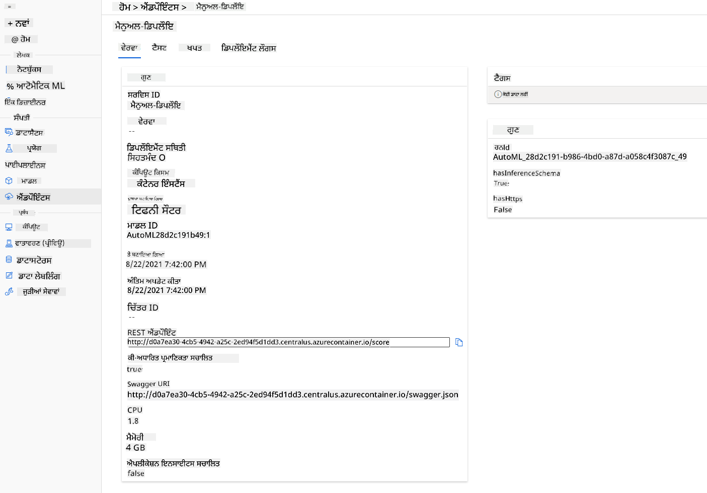

ਸ਼ਾਨਦਾਰ! ਹੁਣ ਜਦੋਂ ਕਿ ਸਾਡੇ ਕੋਲ ਇੱਕ ਮਾਡਲ deploy ਹੋ ਗਿਆ ਹੈ, ਅਸੀਂ endpoint ਦੀ ਖਪਤ ਸ਼ੁਰੂ ਕਰ ਸਕਦੇ ਹਾਂ।

### 3.2 Endpoint ਖਪਤ

"Consume" ਟੈਬ 'ਤੇ ਕਲਿੱਕ ਕਰੋ। ਇੱਥੇ ਤੁਸੀਂ REST endpoint ਅਤੇ consumption ਵਿਕਲਪ ਵਿੱਚ ਇੱਕ python script ਪ੍ਰਾਪਤ ਕਰ ਸਕਦੇ ਹੋ। python ਕੋਡ ਨੂੰ ਪੜ੍ਹਨ ਲਈ ਕੁਝ ਸਮਾਂ ਲਓ।

ਇਹ ਸਕ੍ਰਿਪਟ ਸਿੱਧੇ ਤੁਹਾਡੇ ਸਥਾਨਕ ਮਸ਼ੀਨ ਤੋਂ ਚਲਾਈ ਜਾ ਸਕਦੀ ਹੈ ਅਤੇ ਤੁਹਾਡੇ endpoint ਨੂੰ ਖਪਤ ਕਰੇਗੀ।

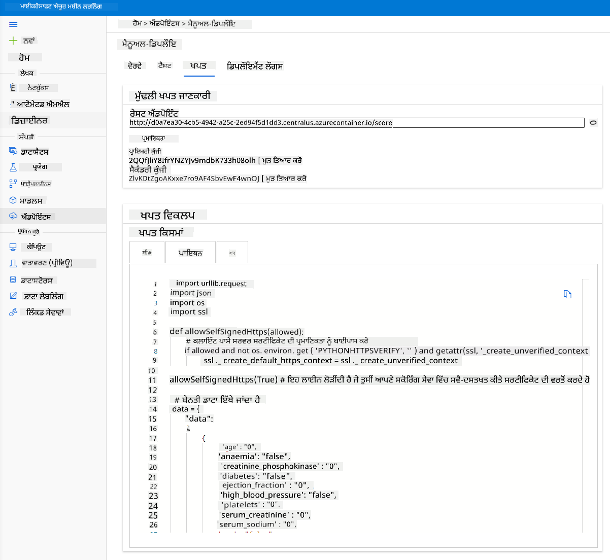

ਇਹ 2 ਲਾਈਨਾਂ ਦੇ ਕੋਡ ਨੂੰ ਚੈੱਕ ਕਰਨ ਲਈ ਕੁਝ ਸਮਾਂ ਲਓ:

```python
url = 'http://98e3715f-xxxx-xxxx-xxxx-9ec22d57b796.centralus.azurecontainer.io/score'
api_key = '' # Replace this with the API key for the web service
```  
`url` ਵੈਰੀਏਬਲ Consume ਟੈਬ ਵਿੱਚ ਮਿਲੇ REST endpoint ਹੈ ਅਤੇ `api_key` ਵੈਰੀਏਬਲ Consume ਟੈਬ ਵਿੱਚ ਮਿਲੀ ਪ੍ਰਾਇਮਰੀ key ਹੈ (ਸਿਰਫ ਉਸ ਸਥਿਤੀ ਵਿੱਚ ਜਦੋਂ ਤੁਸੀਂ authentication enable ਕੀਤਾ ਹੈ)। ਇਹ ਹੈ ਕਿ ਸਕ੍ਰਿਪਟ endpoint ਨੂੰ ਕਿਵੇਂ ਖਪਤ ਕਰ ਸਕਦੀ ਹੈ।

18. ਸਕ੍ਰਿਪਟ ਚਲਾਉਣ 'ਤੇ, ਤੁਹਾਨੂੰ ਹੇਠਾਂ ਦਿੱਤਾ ਆਉਟਪੁੱਟ ਦੇਖਣਾ ਚਾਹੀਦਾ ਹੈ:  
```python
    b'"{\\"result\\": [true]}"'
    ```  
ਇਸਦਾ ਮਤਲਬ ਹੈ ਕਿ ਦਿੱਤੇ ਡਾਟਾ ਲਈ ਦਿਲ ਦੇ ਦੌਰੇ ਦੀ ਭਵਿੱਖਵਾਣੀ ਸੱਚ ਹੈ। ਇਹ ਸਮਝਦਾਰ ਹੈ ਕਿਉਂਕਿ ਜੇ ਤੁਸੀਂ ਸਕ੍ਰਿਪਟ ਵਿੱਚ ਆਟੋਮੈਟਿਕ ਤੌਰ 'ਤੇ ਜਨਰੇਟ ਕੀਤੇ ਡਾਟਾ ਨੂੰ ਧਿਆਨ ਨਾਲ ਦੇਖੋ, ਤਾਂ ਸਭ ਕੁਝ ਡਿਫਾਲਟ ਰੂਪ ਵਿੱਚ 0 ਅਤੇ false ਹੈ। ਤੁਸੀਂ ਹੇਠਾਂ ਦਿੱਤੇ input sample ਨਾਲ ਡਾਟਾ ਬਦਲ ਸਕਦੇ ਹੋ:

```python
data = {
    "data":
    [
        {
            'age': "0",
            'anaemia': "false",
            'creatinine_phosphokinase': "0",
            'diabetes': "false",
            'ejection_fraction': "0",
            'high_blood_pressure': "false",
            'platelets': "0",
            'serum_creatinine': "0",
            'serum_sodium': "0",
            'sex': "false",
            'smoking': "false",
            'time': "0",
        },
        {
            'age': "60",
            'anaemia': "false",
            'creatinine_phosphokinase': "500",
            'diabetes': "false",
            'ejection_fraction': "38",
            'high_blood_pressure': "false",
            'platelets': "260000",
            'serum_creatinine': "1.40",
            'serum_sodium': "137",
            'sex': "false",
            'smoking': "false",
            'time': "130",
        },
    ],
}
```  
ਸਕ੍ਰਿਪਟ ਇਹ ਰਿਟਰਨ ਕਰੇਗਾ:  
```python
    b'"{\\"result\\": [true, false]}"'
    ```  

ਮੁਬਾਰਕਾਂ! ਤੁਸੀਂ ਮਾਡਲ ਨੂੰ deploy ਕੀਤਾ, train ਕੀਤਾ ਅਤੇ Azure ML 'ਤੇ consume ਕੀਤਾ!

> **_NOTE:_** ਜਦੋਂ ਤੁਸੀਂ ਪ੍ਰੋਜੈਕਟ ਪੂਰਾ ਕਰ ਲੈਂਦੇ ਹੋ, ਤਾਂ ਸਾਰੇ ਸਰੋਤਾਂ ਨੂੰ ਮਿਟਾਉਣਾ ਨਾ ਭੁੱਲੋ।  
## 🚀 ਚੁਣੌਤੀ

AutoML ਦੁਆਰਾ ਜਨਰੇਟ ਕੀਤੇ ਸਿਖਰ ਦੇ ਮਾਡਲਾਂ ਲਈ ਮਾਡਲ explanations ਅਤੇ ਵੇਰਵੇ ਨੂੰ ਧਿਆਨ ਨਾਲ ਦੇਖੋ। ਸਮਝਣ ਦੀ ਕੋਸ਼ਿਸ਼ ਕਰੋ ਕਿ ਸਭ ਤੋਂ ਵਧੀਆ ਮਾਡਲ ਹੋਰਾਂ ਨਾਲੋਂ ਕਿਉਂ ਵਧੀਆ ਹੈ। ਕਿਹੜੇ algorithm ਦੀ ਤੁਲਨਾ ਕੀਤੀ ਗਈ? ਉਨ੍ਹਾਂ ਵਿੱਚ ਕੀ ਅੰਤਰ ਹਨ? ਇਸ ਮਾਮਲੇ ਵਿੱਚ ਸਭ ਤੋਂ ਵਧੀਆ algorithm ਕਿਉਂ ਵਧੀਆ ਪ੍ਰਦਰਸ਼ਨ ਕਰ ਰਿਹਾ ਹੈ?

## [Post-Lecture Quiz](https://purple-hill-04aebfb03.1.azurestaticapps.net/quiz/35)

## ਸਮੀਖਿਆ ਅਤੇ ਸਵੈ-ਅਧਿਐਨ

ਇਸ ਪਾਠ ਵਿੱਚ, ਤੁਸੀਂ ਸਿੱਖਿਆ ਕਿ ਦਿਲ ਦੇ ਦੌਰੇ ਦੇ ਖਤਰੇ ਦੀ ਭਵਿੱਖਵਾਣੀ ਕਰਨ ਲਈ ਮਾਡਲ ਨੂੰ train, deploy ਅਤੇ consume ਕਿਵੇਂ ਕਰਨਾ ਹੈ, Low code/No code ਢੰਗ ਵਿੱਚ ਕਲਾਉਡ ਵਿੱਚ। ਜੇ ਤੁਸੀਂ ਇਹ ਨਹੀਂ ਕੀਤਾ ਹੈ, ਤਾਂ AutoML ਦੁਆਰਾ ਜਨਰੇਟ ਕੀਤੇ ਮਾਡਲ explanations ਵਿੱਚ ਡੂੰਘਾਈ ਵਿੱਚ ਜਾਓ ਅਤੇ ਸਮਝਣ ਦੀ ਕੋਸ਼ਿਸ਼ ਕਰੋ ਕਿ ਸਭ ਤੋਂ ਵਧੀਆ ਮਾਡਲ ਹੋਰਾਂ ਨਾਲੋਂ ਕਿਉਂ ਵਧੀਆ ਹੈ।

ਤੁਸੀਂ Low code/No code AutoML ਵਿੱਚ ਹੋਰ ਅੱਗੇ ਜਾ ਸਕਦੇ ਹੋ ਇਸ [ਦਸਤਾਵੇਜ਼](https://docs.microsoft.com/azure/machine-learning/tutorial-first-experiment-automated-ml?WT.mc_id=academic-77958-bethanycheum&ocid=AID3041109) ਨੂੰ ਪੜ੍ਹ ਕੇ।

## ਅਸਾਈਨਮੈਂਟ

[Low code

---

**ਅਸਵੀਕਤੀ**:  
ਇਹ ਦਸਤਾਵੇਜ਼ AI ਅਨੁਵਾਦ ਸੇਵਾ [Co-op Translator](https://github.com/Azure/co-op-translator) ਦੀ ਵਰਤੋਂ ਕਰਕੇ ਅਨੁਵਾਦ ਕੀਤਾ ਗਿਆ ਹੈ। ਹਾਲਾਂਕਿ ਅਸੀਂ ਸਹੀ ਹੋਣ ਦੀ ਪੂਰੀ ਕੋਸ਼ਿਸ਼ ਕਰਦੇ ਹਾਂ, ਕਿਰਪਾ ਕਰਕੇ ਧਿਆਨ ਦਿਓ ਕਿ ਸਵੈਚਾਲਿਤ ਅਨੁਵਾਦਾਂ ਵਿੱਚ ਗਲਤੀਆਂ ਜਾਂ ਅਸੁਚਨਾਵਾਂ ਹੋ ਸਕਦੀਆਂ ਹਨ। ਇਸ ਦਸਤਾਵੇਜ਼ ਦੇ ਮੂਲ ਭਾਸ਼ਾ ਵਿੱਚ ਲਿਖੇ ਗ੍ਰੰਥ ਨੂੰ ਅਧਿਕਾਰਤ ਸਰੋਤ ਮੰਨਿਆ ਜਾਣਾ ਚਾਹੀਦਾ ਹੈ। ਮਹੱਤਵਪੂਰਨ ਜਾਣਕਾਰੀ ਲਈ, ਪੇਸ਼ੇਵਰ ਮਨੁੱਖੀ ਅਨੁਵਾਦ ਦੀ ਸਿਫਾਰਸ਼ ਕੀਤੀ ਜਾਂਦੀ ਹੈ। ਇਸ ਅਨੁਵਾਦ ਦੀ ਵਰਤੋਂ ਤੋਂ ਪੈਦਾ ਹੋਣ ਵਾਲੇ ਕਿਸੇ ਵੀ ਗਲਤਫਹਿਮੀ ਜਾਂ ਗਲਤ ਵਿਆਖਿਆ ਲਈ ਅਸੀਂ ਜ਼ਿੰਮੇਵਾਰ ਨਹੀਂ ਹਾਂ।