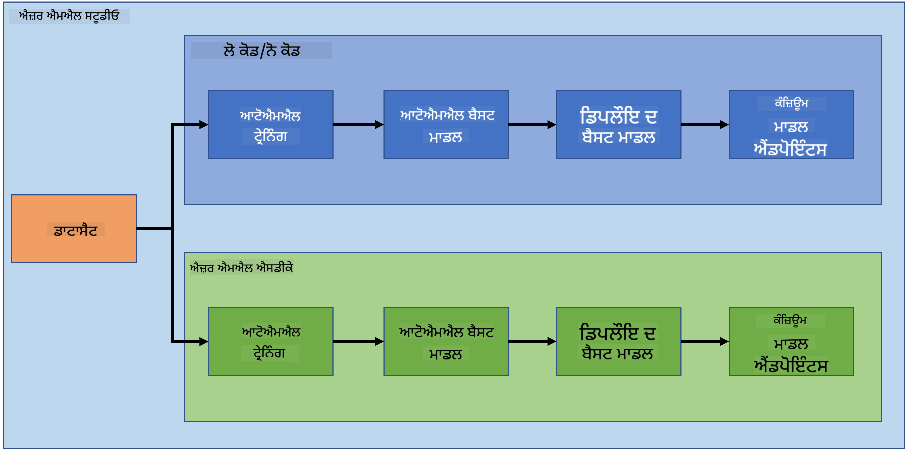
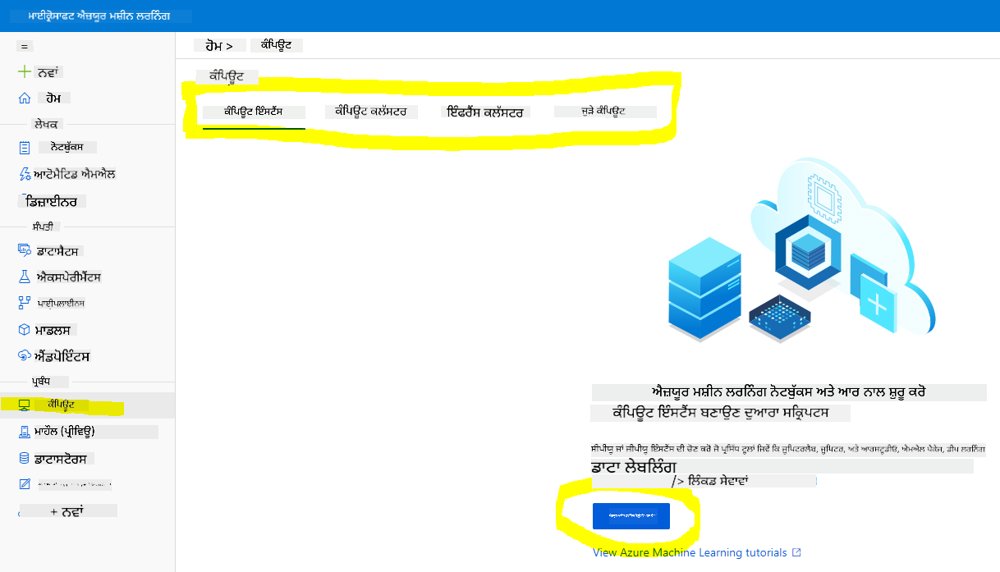
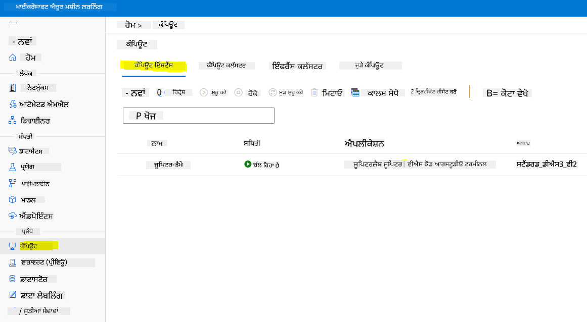
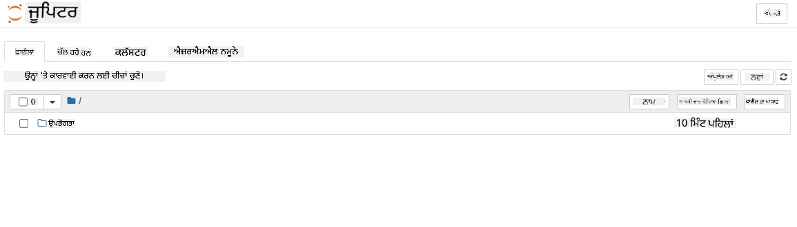

<!--
CO_OP_TRANSLATOR_METADATA:
{
  "original_hash": "5da2d6b3736f6d668b89de9bf3bdd31b",
  "translation_date": "2025-09-04T17:13:49+00:00",
  "source_file": "5-Data-Science-In-Cloud/19-Azure/README.md",
  "language_code": "pa"
}
-->
# ਕਲਾਉਡ ਵਿੱਚ ਡਾਟਾ ਸਾਇੰਸ: "Azure ML SDK" ਦਾ ਤਰੀਕਾ

|![ [(@sketchthedocs)] ਦੁਆਰਾ ਬਣਾਈ ਗਈ ਸਕੈਚਨੋਟ](https://sketchthedocs.dev) ](../../sketchnotes/19-DataScience-Cloud.png)|
|:---:|
| ਕਲਾਉਡ ਵਿੱਚ ਡਾਟਾ ਸਾਇੰਸ: Azure ML SDK - _[@nitya](https://twitter.com/nitya) ਦੁਆਰਾ ਬਣਾਈ ਗਈ ਸਕੈਚਨੋਟ_ |

ਸਮੱਗਰੀ ਦੀ ਸੂਚੀ:

- [ਕਲਾਉਡ ਵਿੱਚ ਡਾਟਾ ਸਾਇੰਸ: "Azure ML SDK" ਦਾ ਤਰੀਕਾ](../../../../5-Data-Science-In-Cloud/19-Azure)
  - [ਪ੍ਰੀ-ਲੈਕਚਰ ਕਵਿਜ਼](../../../../5-Data-Science-In-Cloud/19-Azure)
  - [1. ਜਾਣ ਪਛਾਣ](../../../../5-Data-Science-In-Cloud/19-Azure)
    - [1.1 Azure ML SDK ਕੀ ਹੈ?](../../../../5-Data-Science-In-Cloud/19-Azure)
    - [1.2 ਹਾਰਟ ਫੇਲਿਅਰ ਪ੍ਰਡਿਕਸ਼ਨ ਪ੍ਰੋਜੈਕਟ ਅਤੇ ਡਾਟਾਸੈਟ ਦੀ ਜਾਣ ਪਛਾਣ](../../../../5-Data-Science-In-Cloud/19-Azure)
  - [2. Azure ML SDK ਨਾਲ ਮਾਡਲ ਟ੍ਰੇਨ ਕਰਨਾ](../../../../5-Data-Science-In-Cloud/19-Azure)
    - [2.1 Azure ML ਵਰਕਸਪੇਸ ਬਣਾਉਣਾ](../../../../5-Data-Science-In-Cloud/19-Azure)
    - [2.2 ਕੰਪਿਊਟ ਇੰਸਟੈਂਸ ਬਣਾਉਣਾ](../../../../5-Data-Science-In-Cloud/19-Azure)
    - [2.3 ਡਾਟਾਸੈਟ ਲੋਡ ਕਰਨਾ](../../../../5-Data-Science-In-Cloud/19-Azure)
    - [2.4 ਨੋਟਬੁੱਕ ਬਣਾਉਣਾ](../../../../5-Data-Science-In-Cloud/19-Azure)
    - [2.5 ਮਾਡਲ ਟ੍ਰੇਨ ਕਰਨਾ](../../../../5-Data-Science-In-Cloud/19-Azure)
      - [2.5.1 ਵਰਕਸਪੇਸ, ਐਕਸਪੇਰੀਮੈਂਟ, ਕੰਪਿਊਟ ਕਲੱਸਟਰ ਅਤੇ ਡਾਟਾਸੈਟ ਸੈਟਅਪ](../../../../5-Data-Science-In-Cloud/19-Azure)
      - [2.5.2 AutoML ਕਨਫਿਗਰੇਸ਼ਨ ਅਤੇ ਟ੍ਰੇਨਿੰਗ](../../../../5-Data-Science-In-Cloud/19-Azure)
  - [3. Azure ML SDK ਨਾਲ ਮਾਡਲ ਡਿਪਲੌਇਮੈਂਟ ਅਤੇ ਐਂਡਪੌਇੰਟ ਖਪਤ](../../../../5-Data-Science-In-Cloud/19-Azure)
    - [3.1 ਸਭ ਤੋਂ ਵਧੀਆ ਮਾਡਲ ਸੇਵ ਕਰਨਾ](../../../../5-Data-Science-In-Cloud/19-Azure)
    - [3.2 ਮਾਡਲ ਡਿਪਲੌਇਮੈਂਟ](../../../../5-Data-Science-In-Cloud/19-Azure)
    - [3.3 ਐਂਡਪੌਇੰਟ ਖਪਤ](../../../../5-Data-Science-In-Cloud/19-Azure)
  - [🚀 ਚੁਣੌਤੀ](../../../../5-Data-Science-In-Cloud/19-Azure)
  - [ਪੋਸਟ-ਲੈਕਚਰ ਕਵਿਜ਼](../../../../5-Data-Science-In-Cloud/19-Azure)
  - [ਸਮੀਖਿਆ ਅਤੇ ਸਵੈ-ਅਧਿਐਨ](../../../../5-Data-Science-In-Cloud/19-Azure)
  - [ਅਸਾਈਨਮੈਂਟ](../../../../5-Data-Science-In-Cloud/19-Azure)

## [ਪ੍ਰੀ-ਲੈਕਚਰ ਕਵਿਜ਼](https://purple-hill-04aebfb03.1.azurestaticapps.net/quiz/36)

## 1. ਜਾਣ ਪਛਾਣ

### 1.1 Azure ML SDK ਕੀ ਹੈ?

ਡਾਟਾ ਸਾਇੰਟਿਸਟ ਅਤੇ AI ਡਿਵੈਲਪਰ Azure Machine Learning SDK ਦੀ ਵਰਤੋਂ ਕਰਦੇ ਹਨ ਤਾਂ ਜੋ Azure Machine Learning ਸੇਵਾ ਨਾਲ ਮਸ਼ੀਨ ਲਰਨਿੰਗ ਵਰਕਫਲੋ ਬਣਾਉਣ ਅਤੇ ਚਲਾਉਣ ਲਈ। ਤੁਸੀਂ ਇਸ ਸੇਵਾ ਨਾਲ ਕਿਸੇ ਵੀ Python ਮਾਹੌਲ ਵਿੱਚ ਇੰਟਰਐਕਟ ਕਰ ਸਕਦੇ ਹੋ, ਜਿਵੇਂ ਕਿ Jupyter Notebooks, Visual Studio Code, ਜਾਂ ਤੁਹਾਡਾ ਮਨਪਸੰਦ Python IDE।

SDK ਦੇ ਮੁੱਖ ਖੇਤਰ ਸ਼ਾਮਲ ਹਨ:

- ਮਸ਼ੀਨ ਲਰਨਿੰਗ ਐਕਸਪੇਰੀਮੈਂਟ ਵਿੱਚ ਵਰਤੇ ਜਾਣ ਵਾਲੇ ਡਾਟਾਸੈਟ ਦੇ ਲਾਈਫਸਾਈਕਲ ਦੀ ਖੋਜ, ਤਿਆਰੀ ਅਤੇ ਪ੍ਰਬੰਧਨ।
- ਮਸ਼ੀਨ ਲਰਨਿੰਗ ਐਕਸਪੇਰੀਮੈਂਟ ਦੀ ਨਿਗਰਾਨੀ, ਲੌਗਿੰਗ ਅਤੇ ਆਯੋਜਨ ਲਈ ਕਲਾਉਡ ਸਰੋਤਾਂ ਦਾ ਪ੍ਰਬੰਧਨ।
- ਮਾਡਲ ਨੂੰ ਸਥਾਨਕ ਤੌਰ 'ਤੇ ਜਾਂ ਕਲਾਉਡ ਸਰੋਤਾਂ ਦੀ ਵਰਤੋਂ ਕਰਕੇ ਟ੍ਰੇਨ ਕਰੋ, ਜਿਸ ਵਿੱਚ GPU-ਤੇਜ਼ ਮਾਡਲ ਟ੍ਰੇਨਿੰਗ ਸ਼ਾਮਲ ਹੈ।
- ਆਟੋਮੈਟਿਕ ਮਸ਼ੀਨ ਲਰਨਿੰਗ ਦੀ ਵਰਤੋਂ ਕਰੋ, ਜੋ ਕਨਫਿਗਰੇਸ਼ਨ ਪੈਰਾਮੀਟਰ ਅਤੇ ਟ੍ਰੇਨਿੰਗ ਡਾਟਾ ਨੂੰ ਸਵੀਕਾਰ ਕਰਦਾ ਹੈ। ਇਹ ਅਲਗੋਰਿਥਮ ਅਤੇ ਹਾਈਪਰਪੈਰਾਮੀਟਰ ਸੈਟਿੰਗਾਂ ਦੇ ਮਾਧਿਅਮ ਨਾਲ ਸਵੈ-ਚਲਿਤ ਤੌਰ 'ਤੇ ਚਲਦਾ ਹੈ ਤਾਂ ਜੋ ਪ੍ਰਡਿਕਸ਼ਨ ਲਈ ਸਭ ਤੋਂ ਵਧੀਆ ਮਾਡਲ ਲੱਭ ਸਕੇ।
- ਵੈੱਬ ਸੇਵਾਵਾਂ ਨੂੰ ਡਿਪਲੌਇ ਕਰੋ ਤਾਂ ਜੋ ਤੁਹਾਡੇ ਟ੍ਰੇਨ ਕੀਤੇ ਮਾਡਲ ਨੂੰ RESTful ਸੇਵਾਵਾਂ ਵਿੱਚ ਬਦਲਿਆ ਜਾ ਸਕੇ ਜੋ ਕਿਸੇ ਵੀ ਐਪਲੀਕੇਸ਼ਨ ਵਿੱਚ ਵਰਤੀ ਜਾ ਸਕਦੀ ਹੈ।

[Azure Machine Learning SDK ਬਾਰੇ ਹੋਰ ਜਾਣੋ](https://docs.microsoft.com/python/api/overview/azure/ml?WT.mc_id=academic-77958-bethanycheum&ocid=AID3041109)

[ਪਿਛਲੇ ਪਾਠ](../18-Low-Code/README.md) ਵਿੱਚ, ਅਸੀਂ ਦੇਖਿਆ ਕਿ ਕਿਵੇਂ Low code/No code ਤਰੀਕੇ ਨਾਲ ਮਾਡਲ ਨੂੰ ਟ੍ਰੇਨ, ਡਿਪਲੌਇ ਅਤੇ ਖਪਤ ਕਰਨਾ ਹੈ। ਅਸੀਂ Heart Failure ਡਾਟਾਸੈਟ ਦੀ ਵਰਤੋਂ ਕਰਕੇ Heart failure prediction ਮਾਡਲ ਬਣਾਇਆ। ਇਸ ਪਾਠ ਵਿੱਚ, ਅਸੀਂ ਬਿਲਕੁਲ ਉਹੀ ਕੰਮ ਕਰਨ ਜਾ ਰਹੇ ਹਾਂ ਪਰ Azure Machine Learning SDK ਦੀ ਵਰਤੋਂ ਕਰਕੇ।



### 1.2 ਹਾਰਟ ਫੇਲਿਅਰ ਪ੍ਰਡਿਕਸ਼ਨ ਪ੍ਰੋਜੈਕਟ ਅਤੇ ਡਾਟਾਸੈਟ ਦੀ ਜਾਣ ਪਛਾਣ

[ਇਥੇ](../18-Low-Code/README.md) ਹਾਰਟ ਫੇਲਿਅਰ ਪ੍ਰਡਿਕਸ਼ਨ ਪ੍ਰੋਜੈਕਟ ਅਤੇ ਡਾਟਾਸੈਟ ਦੀ ਜਾਣ ਪਛਾਣ ਦੀ ਜਾਂਚ ਕਰੋ।

## 2. Azure ML SDK ਨਾਲ ਮਾਡਲ ਟ੍ਰੇਨ ਕਰਨਾ
### 2.1 Azure ML ਵਰਕਸਪੇਸ ਬਣਾਉਣਾ

ਸਰਲਤਾ ਲਈ, ਅਸੀਂ ਜੂਪਿਟਰ ਨੋਟਬੁੱਕ 'ਤੇ ਕੰਮ ਕਰਨ ਜਾ ਰਹੇ ਹਾਂ। ਇਸਦਾ ਮਤਲਬ ਹੈ ਕਿ ਤੁਹਾਡੇ ਕੋਲ ਪਹਿਲਾਂ ਹੀ ਵਰਕਸਪੇਸ ਅਤੇ ਕੰਪਿਊਟ ਇੰਸਟੈਂਸ ਹੈ। ਜੇ ਤੁਹਾਡੇ ਕੋਲ ਪਹਿਲਾਂ ਹੀ ਵਰਕਸਪੇਸ ਹੈ, ਤਾਂ ਤੁਸੀਂ ਸਿੱਧੇ ਸੈਕਸ਼ਨ 2.3 ਨੋਟਬੁੱਕ ਬਣਾਉਣ 'ਤੇ ਜਾ ਸਕਦੇ ਹੋ।

ਜੇ ਨਹੀਂ, ਤਾਂ ਕਿਰਪਾ ਕਰਕੇ [ਪਿਛਲੇ ਪਾਠ](../18-Low-Code/README.md) ਵਿੱਚ ਸੈਕਸ਼ਨ **2.1 Azure ML ਵਰਕਸਪੇਸ ਬਣਾਉਣਾ** ਵਿੱਚ ਦਿੱਤੀਆਂ ਹਦਾਇਤਾਂ ਦੀ ਪਾਲਣਾ ਕਰੋ।

### 2.2 ਕੰਪਿਊਟ ਇੰਸਟੈਂਸ ਬਣਾਉਣਾ

[Azure ML ਵਰਕਸਪੇਸ](https://ml.azure.com/) ਵਿੱਚ ਜੋ ਅਸੀਂ ਪਹਿਲਾਂ ਬਣਾਇਆ ਸੀ, ਕੰਪਿਊਟ ਮੀਨੂ 'ਤੇ ਜਾਓ ਅਤੇ ਤੁਹਾਨੂੰ ਉਪਲਬਧ ਵੱਖ-ਵੱਖ ਕੰਪਿਊਟ ਸਰੋਤਾਂ ਦੇਖਣ ਨੂੰ ਮਿਲਣਗੇ।



ਆਓ ਇੱਕ ਕੰਪਿਊਟ ਇੰਸਟੈਂਸ ਬਣਾਈਏ ਤਾਂ ਜੋ ਜੂਪਿਟਰ ਨੋਟਬੁੱਕ ਪ੍ਰੋਵੀਜ਼ਨ ਕੀਤਾ ਜਾ ਸਕੇ।  
1. + New ਬਟਨ 'ਤੇ ਕਲਿਕ ਕਰੋ।  
2. ਆਪਣੇ ਕੰਪਿਊਟ ਇੰਸਟੈਂਸ ਨੂੰ ਇੱਕ ਨਾਮ ਦਿਓ।  
3. ਆਪਣੇ ਵਿਕਲਪ ਚੁਣੋ: CPU ਜਾਂ GPU, VM ਸਾਈਜ਼ ਅਤੇ ਕੋਰ ਨੰਬਰ।  
4. Create ਬਟਨ 'ਤੇ ਕਲਿਕ ਕਰੋ।  

ਵਧਾਈ ਹੋਵੇ, ਤੁਸੀਂ ਸਿਰਫ ਇੱਕ ਕੰਪਿਊਟ ਇੰਸਟੈਂਸ ਬਣਾਇਆ ਹੈ! ਅਸੀਂ ਇਸ ਕੰਪਿਊਟ ਇੰਸਟੈਂਸ ਦੀ ਵਰਤੋਂ [ਨੋਟਬੁੱਕ ਬਣਾਉਣ ਦੇ ਸੈਕਸ਼ਨ](../../../../5-Data-Science-In-Cloud/19-Azure) ਵਿੱਚ ਕਰਨ ਜਾ ਰਹੇ ਹਾਂ।

### 2.3 ਡਾਟਾਸੈਟ ਲੋਡ ਕਰਨਾ
ਜੇ ਤੁਸੀਂ ਹਾਲੇ ਤੱਕ ਡਾਟਾਸੈਟ ਅੱਪਲੋਡ ਨਹੀਂ ਕੀਤਾ ਹੈ, ਤਾਂ [ਪਿਛਲੇ ਪਾਠ](../18-Low-Code/README.md) ਵਿੱਚ ਸੈਕਸ਼ਨ **2.3 ਡਾਟਾਸੈਟ ਲੋਡ ਕਰਨਾ** ਨੂੰ ਵੇਖੋ।

### 2.4 ਨੋਟਬੁੱਕ ਬਣਾਉਣਾ

> **_NOTE:_** ਅਗਲੇ ਕਦਮ ਲਈ ਤੁਸੀਂ ਜਾਂ ਤਾਂ ਨਵਾਂ ਨੋਟਬੁੱਕ ਸ਼ੁਰੂ ਤੋਂ ਬਣਾਉਣ ਦਾ ਚੋਣ ਕਰ ਸਕਦੇ ਹੋ, ਜਾਂ ਤੁਸੀਂ [ਅਸੀਂ ਬਣਾਇਆ ਨੋਟਬੁੱਕ](notebook.ipynb) ਆਪਣੇ Azure ML Studio ਵਿੱਚ ਅੱਪਲੋਡ ਕਰ ਸਕਦੇ ਹੋ। ਇਸਨੂੰ ਅੱਪਲੋਡ ਕਰਨ ਲਈ, ਸਿਰਫ "Notebook" ਮੀਨੂ 'ਤੇ ਕਲਿਕ ਕਰੋ ਅਤੇ ਨੋਟਬੁੱਕ ਅੱਪਲੋਡ ਕਰੋ।

ਨੋਟਬੁੱਕ ਡਾਟਾ ਸਾਇੰਸ ਪ੍ਰਕਿਰਿਆ ਦਾ ਇੱਕ ਬਹੁਤ ਮਹੱਤਵਪੂਰਨ ਹਿੱਸਾ ਹਨ। ਇਹਨਾਂ ਦੀ ਵਰਤੋਂ Exploratory Data Analysis (EDA) ਕਰਨ, ਮਾਡਲ ਟ੍ਰੇਨ ਕਰਨ ਲਈ ਕੰਪਿਊਟ ਕਲੱਸਟਰ ਨੂੰ ਕਾਲ ਕਰਨ, ਅਤੇ ਐਂਡਪੌਇੰਟ ਡਿਪਲੌਇ ਕਰਨ ਲਈ ਕੀਤੀ ਜਾ ਸਕਦੀ ਹੈ।

ਨੋਟਬੁੱਕ ਬਣਾਉਣ ਲਈ, ਸਾਨੂੰ ਇੱਕ ਕੰਪਿਊਟ ਨੋਡ ਦੀ ਲੋੜ ਹੈ ਜੋ ਜੂਪਿਟਰ ਨੋਟਬੁੱਕ ਇੰਸਟੈਂਸ ਨੂੰ ਸਰਵ ਕਰ ਰਿਹਾ ਹੈ। ਵਾਪਸ [Azure ML ਵਰਕਸਪੇਸ](https://ml.azure.com/) 'ਤੇ ਜਾਓ ਅਤੇ Compute instances 'ਤੇ ਕਲਿਕ ਕਰੋ। ਕੰਪਿਊਟ ਇੰਸਟੈਂਸ ਦੀ ਸੂਚੀ ਵਿੱਚ ਤੁਹਾਨੂੰ [ਅਸੀਂ ਪਹਿਲਾਂ ਬਣਾਇਆ ਕੰਪਿਊਟ ਇੰਸਟੈਂਸ](../../../../5-Data-Science-In-Cloud/19-Azure) ਦੇਖਣਾ ਚਾਹੀਦਾ ਹੈ।

1. Applications ਸੈਕਸ਼ਨ ਵਿੱਚ, Jupyter ਵਿਕਲਪ 'ਤੇ ਕਲਿਕ ਕਰੋ।  
2. "Yes, I understand" ਬਾਕਸ ਨੂੰ ਟਿਕ ਕਰੋ ਅਤੇ Continue ਬਟਨ 'ਤੇ ਕਲਿਕ ਕਰੋ।  
  
3. ਇਹ ਤੁਹਾਡੇ ਜੂਪਿਟਰ ਨੋਟਬੁੱਕ ਇੰਸਟੈਂਸ ਨਾਲ ਇੱਕ ਨਵਾਂ ਬ੍ਰਾਊਜ਼ਰ ਟੈਬ ਖੋਲ੍ਹੇਗਾ। "New" ਬਟਨ 'ਤੇ ਕਲਿਕ ਕਰਕੇ ਨੋਟਬੁੱਕ ਬਣਾਓ।  



ਹੁਣ ਜਦੋਂ ਸਾਡੇ ਕੋਲ ਨੋਟਬੁੱਕ ਹੈ, ਅਸੀਂ Azure ML SDK ਨਾਲ ਮਾਡਲ ਟ੍ਰੇਨ ਕਰਨਾ ਸ਼ੁਰੂ ਕਰ ਸਕਦੇ ਹਾਂ।

### 2.5 ਮਾਡਲ ਟ੍ਰੇਨ ਕਰਨਾ

ਸਭ ਤੋਂ ਪਹਿਲਾਂ, ਜੇ ਤੁਹਾਨੂੰ ਕਦੇ ਵੀ ਸ਼ੱਕ ਹੋਵੇ, ਤਾਂ [Azure ML SDK ਡੌਕੂਮੈਂਟੇਸ਼ਨ](https://docs.microsoft.com/python/api/overview/azure/ml?WT.mc_id=academic-77958-bethanycheum&ocid=AID3041109) ਨੂੰ ਵੇਖੋ। ਇਸ ਵਿੱਚ ਉਹ ਸਾਰੀਆਂ ਜਾਣਕਾਰੀਆਂ ਹਨ ਜੋ ਅਸੀਂ ਇਸ ਪਾਠ ਵਿੱਚ ਦੇਖਣ ਜਾ ਰਹੇ ਮੌਡਿਊਲ ਨੂੰ ਸਮਝਣ ਲਈ ਲੋੜੀਂਦੀਆਂ ਹਨ।

#### 2.5.1 ਵਰਕਸਪੇਸ, ਐਕਸਪੇਰੀਮੈਂਟ, ਕੰਪਿਊਟ ਕਲੱਸਟਰ ਅਤੇ ਡਾਟਾਸੈਟ ਸੈਟਅਪ

ਤੁਹਾਨੂੰ ਹੇਠਾਂ ਦਿੱਤੇ ਕੋਡ ਦੀ ਵਰਤੋਂ ਕਰਕੇ ਕਨਫਿਗਰੇਸ਼ਨ ਫਾਈਲ ਤੋਂ `workspace` ਲੋਡ ਕਰਨ ਦੀ ਲੋੜ ਹੈ:

```python
from azureml.core import Workspace
ws = Workspace.from_config()
```

ਇਹ `Workspace` ਕਿਸਮ ਦਾ ਇੱਕ ਆਬਜੈਕਟ ਵਾਪਸ ਕਰਦਾ ਹੈ ਜੋ ਵਰਕਸਪੇਸ ਨੂੰ ਦਰਸਾਉਂਦਾ ਹੈ। ਫਿਰ ਤੁਹਾਨੂੰ ਹੇਠਾਂ ਦਿੱਤੇ ਕੋਡ ਦੀ ਵਰਤੋਂ ਕਰਕੇ ਇੱਕ `experiment` ਬਣਾਉਣ ਦੀ ਲੋੜ ਹੈ:

```python
from azureml.core import Experiment
experiment_name = 'aml-experiment'
experiment = Experiment(ws, experiment_name)
```  
ਵਰਕਸਪੇਸ ਤੋਂ ਐਕਸਪੇਰੀਮੈਂਟ ਨੂੰ ਪ੍ਰਾਪਤ ਕਰਨ ਜਾਂ ਬਣਾਉਣ ਲਈ, ਤੁਸੀਂ ਐਕਸਪੇਰੀਮੈਂਟ ਨਾਮ ਦੀ ਬੇਨਤੀ ਕਰਦੇ ਹੋ। ਐਕਸਪੇਰੀਮੈਂਟ ਦਾ ਨਾਮ 3-36 ਅੱਖਰਾਂ ਦਾ ਹੋਣਾ ਚਾਹੀਦਾ ਹੈ, ਇੱਕ ਅੱਖਰ ਜਾਂ ਨੰਬਰ ਨਾਲ ਸ਼ੁਰੂ ਹੋਣਾ ਚਾਹੀਦਾ ਹੈ, ਅਤੇ ਸਿਰਫ ਅੱਖਰਾਂ, ਨੰਬਰਾਂ, ਅੰਡਰਸਕੋਰ ਅਤੇ ਡੈਸ਼ ਸ਼ਾਮਲ ਕਰ ਸਕਦਾ ਹੈ। ਜੇ ਵਰਕਸਪੇਸ ਵਿੱਚ ਐਕਸਪੇਰੀਮੈਂਟ ਨਹੀਂ ਮਿਲਦਾ, ਤਾਂ ਇੱਕ ਨਵਾਂ ਐਕਸਪੇਰੀਮੈਂਟ ਬਣਾਇਆ ਜਾਂਦਾ ਹੈ।

ਹੁਣ ਤੁਹਾਨੂੰ ਹੇਠਾਂ ਦਿੱਤੇ ਕੋਡ ਦੀ ਵਰਤੋਂ ਕਰਕੇ ਟ੍ਰੇਨਿੰਗ ਲਈ ਇੱਕ ਕੰਪਿਊਟ ਕਲੱਸਟਰ ਬਣਾਉਣ ਦੀ ਲੋੜ ਹੈ। ਧਿਆਨ ਦਿਓ ਕਿ ਇਹ ਕਦਮ ਕੁਝ ਮਿੰਟ ਲੈ ਸਕਦਾ ਹੈ।  

```python
from azureml.core.compute import AmlCompute

aml_name = "heart-f-cluster"
try:
    aml_compute = AmlCompute(ws, aml_name)
    print('Found existing AML compute context.')
except:
    print('Creating new AML compute context.')
    aml_config = AmlCompute.provisioning_configuration(vm_size = "Standard_D2_v2", min_nodes=1, max_nodes=3)
    aml_compute = AmlCompute.create(ws, name = aml_name, provisioning_configuration = aml_config)
    aml_compute.wait_for_completion(show_output = True)

cts = ws.compute_targets
compute_target = cts[aml_name]
```

ਤੁਹਾਨੂੰ ਹੇਠਾਂ ਦਿੱਤੇ ਤਰੀਕੇ ਨਾਲ ਵਰਕਸਪੇਸ ਤੋਂ ਡਾਟਾਸੈਟ ਪ੍ਰਾਪਤ ਕਰਨਾ ਹੈ:  

```python
dataset = ws.datasets['heart-failure-records']
df = dataset.to_pandas_dataframe()
df.describe()
```  
#### 2.5.2 AutoML ਕਨਫਿਗਰੇਸ਼ਨ ਅਤੇ ਟ੍ਰੇਨਿੰਗ

AutoML ਕਨਫਿਗਰੇਸ਼ਨ ਸੈਟ ਕਰਨ ਲਈ, [AutoMLConfig ਕਲਾਸ](https://docs.microsoft.com/python/api/azureml-train-automl-client/azureml.train.automl.automlconfig(class)?WT.mc_id=academic-77958-bethanycheum&ocid=AID3041109) ਦੀ ਵਰਤੋਂ ਕਰੋ।

ਜਿਵੇਂ ਕਿ ਡੌਕ ਵਿੱਚ ਵਰਣਨ ਕੀਤਾ ਗਿਆ ਹੈ, ਤੁਹਾਡੇ ਕੋਲ ਖੇਡਣ ਲਈ ਬਹੁਤ ਸਾਰੇ ਪੈਰਾਮੀਟਰ ਹਨ। ਇਸ ਪ੍ਰੋਜੈਕਟ ਲਈ, ਅਸੀਂ ਹੇਠਾਂ ਦਿੱਤੇ ਪੈਰਾਮੀਟਰ ਦੀ ਵਰਤੋਂ ਕਰਨ ਜਾ ਰਹੇ ਹਾਂ:

- `experiment_timeout_minutes`: ਅਧਿਕਤਮ ਸਮਾਂ (ਮਿੰਟਾਂ ਵਿੱਚ) ਜੋ ਐਕਸਪੇਰੀਮੈਂਟ ਨੂੰ ਚਲਾਉਣ ਦੀ ਆਗਿਆ ਹੈ।  
- `max_concurrent_iterations`: ਐਕਸਪੇਰੀਮੈਂਟ ਲਈ ਅਧਿਕਤਮ ਸੰਖਿਆ।  
- `primary_metric`: ਐਕਸਪੇਰੀਮੈਂਟ ਦੀ ਸਥਿਤੀ ਨੂੰ ਨਿਰਧਾਰਤ ਕਰਨ ਲਈ ਮੁੱਖ ਮਾਪ।  
- `compute_target`: Automated Machine Learning ਐਕਸਪੇਰੀਮੈਂਟ ਚਲਾਉਣ ਲਈ Azure Machine Learning ਕੰਪਿਊਟ ਟਾਰਗਟ।  
- `task`: ਚਲਾਉਣ ਲਈ ਟਾਸਕ ਦੀ ਕਿਸਮ।  
- `training_data`: ਟ੍ਰੇਨਿੰਗ ਡਾਟਾ।  
- `label_column_name`: ਲੇਬਲ ਕਾਲਮ ਦਾ ਨਾਮ।  
- `path`: ਪ੍ਰੋਜੈਕਟ ਫੋਲਡਰ ਦਾ ਪੂਰਾ ਪਾਥ।  
- `enable_early_stopping`: ਜੇ ਸਕੋਰ ਛੋਟੇ ਸਮੇਂ ਵਿੱਚ ਸੁਧਾਰ ਨਹੀਂ ਕਰ ਰਿਹਾ ਹੈ।  
- `featurization`: ਫੀਚਰਾਈਜ਼ੇਸ਼ਨ ਸਵੈ-ਚਲਿਤ ਹੋਵੇ।  
- `debug_log`: ਡਿਬੱਗ ਜਾਣਕਾਰੀ ਲਿਖਣ ਲਈ ਲੌਗ ਫਾਈਲ।  

```python
from azureml.train.automl import AutoMLConfig

project_folder = './aml-project'

automl_settings = {
    "experiment_timeout_minutes": 20,
    "max_concurrent_iterations": 3,
    "primary_metric" : 'AUC_weighted'
}

automl_config = AutoMLConfig(compute_target=compute_target,
                             task = "classification",
                             training_data=dataset,
                             label_column_name="DEATH_EVENT",
                             path = project_folder,  
                             enable_early_stopping= True,
                             featurization= 'auto',
                             debug_log = "automl_errors.log",
                             **automl_settings
                            )
```  
ਹੁਣ ਜਦੋਂ ਤੁਹਾਡੀ ਕਨਫਿਗਰੇਸ਼ਨ ਸੈਟ ਹੈ, ਤੁਸੀਂ ਹੇਠਾਂ ਦਿੱਤੇ ਕੋਡ ਦੀ ਵਰਤੋਂ ਕਰਕੇ ਮਾਡਲ ਟ੍ਰੇਨ ਕਰ ਸਕਦੇ ਹੋ। ਇਹ ਕਦਮ ਤੁਹਾਡੇ ਕਲੱਸਟਰ ਸਾਈਜ਼ ਦੇ ਅਨੁਸਾਰ ਇੱਕ ਘੰਟੇ ਤੱਕ ਲੈ ਸਕਦਾ ਹੈ।  

```python
remote_run = experiment.submit(automl_config)
```  
ਤੁਸੀਂ RunDetails ਵਿਜਟ ਚਲਾ ਸਕਦੇ ਹੋ ਤਾਂ ਜੋ ਵੱਖ-ਵੱਖ ਐਕਸਪੇਰੀਮੈਂਟ ਦਿਖਾਏ ਜਾ ਸਕਣ।  
```python
from azureml.widgets import RunDetails
RunDetails(remote_run).show()
```  
## 3. Azure ML SDK ਨਾਲ ਮਾਡਲ ਡਿਪਲੌਇਮੈਂਟ ਅਤੇ ਐਂਡਪੌਇੰਟ ਖਪਤ

### 3.1 ਸਭ ਤੋਂ ਵਧੀਆ ਮਾਡਲ ਸੇਵ ਕਰਨਾ

`remote_run` [AutoMLRun](https://docs.microsoft.com/python/api/azureml-train-automl-client/azureml.train.automl.run.automlrun?WT.mc_id=academic-77958-bethanycheum&ocid=AID3041109) ਕਿਸਮ ਦਾ ਇੱਕ ਆਬਜੈਕਟ ਹੈ। ਇਸ ਆਬਜੈਕਟ ਵਿੱਚ `get_output()` ਵਿਧੀ ਸ਼ਾਮਲ ਹੈ ਜੋ ਸਭ ਤੋਂ ਵਧੀਆ ਰਨ ਅਤੇ ਸੰਬੰਧਿਤ ਫਿਟ ਕੀਤੇ ਮਾਡਲ ਨੂੰ ਵਾਪਸ ਕਰਦਾ ਹੈ।

```python
best_run, fitted_model = remote_run.get_output()
```
```python
response = aci_service.run(input_data=test_sample)
response
```  
ਇਸ ਦਾ ਆਉਟਪੁਟ `'{"result": [false]}'` ਹੋਣਾ ਚਾਹੀਦਾ ਹੈ। ਇਸਦਾ ਮਤਲਬ ਹੈ ਕਿ ਜੋ ਮਰੀਜ਼ ਦੀ ਜਾਣਕਾਰੀ ਅਸੀਂ ਐਂਡਪੌਇੰਟ ਨੂੰ ਭੇਜੀ ਸੀ, ਉਸ ਤੋਂ ਜਨਰੇਟ ਹੋਈ ਪੇਡਿਕਸ਼ਨ `false` ਹੈ, ਜਿਸਦਾ ਅਰਥ ਹੈ ਕਿ ਇਸ ਵਿਅਕਤੀ ਨੂੰ ਦਿਲ ਦਾ ਦੌਰਾ ਪੈਣ ਦੀ ਸੰਭਾਵਨਾ ਨਹੀਂ ਹੈ।  

ਮੁਬਾਰਕਾਂ! ਤੁਸੀਂ Azure ML SDK ਦੀ ਵਰਤੋਂ ਕਰਕੇ Azure ML 'ਤੇ ਟ੍ਰੇਨ ਅਤੇ ਡਿਪਲੌਇ ਕੀਤੇ ਮਾਡਲ ਨੂੰ ਸਫਲਤਾਪੂਰਵਕ ਵਰਤ ਲਿਆ ਹੈ!  

> **_NOTE:_** ਪ੍ਰੋਜੈਕਟ ਖਤਮ ਕਰਨ ਤੋਂ ਬਾਅਦ, ਸਾਰੇ ਰਿਸੋਰਸਜ਼ ਨੂੰ ਮਿਟਾਉਣਾ ਨਾ ਭੁੱਲੋ।  

## 🚀 ਚੁਣੌਤੀ  

SDK ਰਾਹੀਂ ਹੋਰ ਬਹੁਤ ਕੁਝ ਕੀਤਾ ਜਾ ਸਕਦਾ ਹੈ, ਪਰ ਅਫਸੋਸ, ਅਸੀਂ ਇਸ ਪਾਠ ਵਿੱਚ ਸਾਰਾ ਕੁਝ ਨਹੀਂ ਦੇਖ ਸਕਦੇ। ਪਰ ਚੰਗੀ ਖ਼ਬਰ ਇਹ ਹੈ ਕਿ SDK ਡੌਕਯੂਮੈਂਟੇਸ਼ਨ ਨੂੰ ਸਮਝਣ ਦੀ ਯੋਗਤਾ ਤੁਹਾਨੂੰ ਖੁਦ ਬਹੁਤ ਅੱਗੇ ਲੈ ਜਾ ਸਕਦੀ ਹੈ। Azure ML SDK ਡੌਕਯੂਮੈਂਟੇਸ਼ਨ ਨੂੰ ਦੇਖੋ ਅਤੇ `Pipeline` ਕਲਾਸ ਨੂੰ ਲੱਭੋ ਜੋ ਤੁਹਾਨੂੰ ਪਾਈਪਲਾਈਨ ਬਣਾਉਣ ਦੀ ਆਗਿਆ ਦਿੰਦੀ ਹੈ। ਪਾਈਪਲਾਈਨ ਕਦਮਾਂ ਦਾ ਇਕ ਸੰਗ੍ਰਹਿ ਹੈ ਜੋ ਵਰਕਫਲੋ ਵਜੋਂ ਚਲਾਇਆ ਜਾ ਸਕਦਾ ਹੈ।  

**ਸੁਝਾਅ:** [SDK ਡੌਕਯੂਮੈਂਟੇਸ਼ਨ](https://docs.microsoft.com/python/api/overview/azure/ml/?view=azure-ml-py?WT.mc_id=academic-77958-bethanycheum&ocid=AID3041109) 'ਤੇ ਜਾਓ ਅਤੇ ਖੋਜ ਬਾਰ ਵਿੱਚ "Pipeline" ਵਰਗੇ ਕੀਵਰਡ ਟਾਈਪ ਕਰੋ। ਤੁਹਾਨੂੰ ਖੋਜ ਦੇ ਨਤੀਜਿਆਂ ਵਿੱਚ `azureml.pipeline.core.Pipeline` ਕਲਾਸ ਮਿਲਣੀ ਚਾਹੀਦੀ ਹੈ।  

## [ਪਾਠ-ਪ੍ਰਚਾਰ ਕਵਿਜ਼](https://ff-quizzes.netlify.app/en/ds/)  

## ਸਮੀਖਾ ਅਤੇ ਸਵੈ ਅਧਿਐਨ  

ਇਸ ਪਾਠ ਵਿੱਚ, ਤੁਸੀਂ ਸਿੱਖਿਆ ਕਿ ਕਿਵੇਂ Azure ML SDK ਦੀ ਵਰਤੋਂ ਕਰਕੇ ਕਲਾਉਡ ਵਿੱਚ ਦਿਲ ਦੇ ਦੌਰੇ ਦੇ ਖਤਰੇ ਦੀ ਪੇਡਿਕਸ਼ਨ ਕਰਨ ਲਈ ਮਾਡਲ ਨੂੰ ਟ੍ਰੇਨ, ਡਿਪਲੌਇ ਅਤੇ ਵਰਤਣਾ ਹੈ। ਇਸ [ਡੌਕਯੂਮੈਂਟੇਸ਼ਨ](https://docs.microsoft.com/python/api/overview/azure/ml/?view=azure-ml-py?WT.mc_id=academic-77958-bethanycheum&ocid=AID3041109) ਨੂੰ ਚੈੱਕ ਕਰੋ ਤਾਂ ਜੋ Azure ML SDK ਬਾਰੇ ਹੋਰ ਜਾਣਕਾਰੀ ਪ੍ਰਾਪਤ ਕੀਤੀ ਜਾ ਸਕੇ। Azure ML SDK ਦੀ ਵਰਤੋਂ ਕਰਕੇ ਆਪਣਾ ਮਾਡਲ ਬਣਾਉਣ ਦੀ ਕੋਸ਼ਿਸ਼ ਕਰੋ।  

## ਅਸਾਈਨਮੈਂਟ  

[Azure ML SDK ਦੀ ਵਰਤੋਂ ਕਰਕੇ ਡਾਟਾ ਸਾਇੰਸ ਪ੍ਰੋਜੈਕਟ](assignment.md)  

---

**ਅਸਵੀਕਾਰਨਾ**:  
ਇਹ ਦਸਤਾਵੇਜ਼ AI ਅਨੁਵਾਦ ਸੇਵਾ [Co-op Translator](https://github.com/Azure/co-op-translator) ਦੀ ਵਰਤੋਂ ਕਰਕੇ ਅਨੁਵਾਦ ਕੀਤਾ ਗਿਆ ਹੈ। ਜਦੋਂ ਕਿ ਅਸੀਂ ਸਹੀਤਾ ਲਈ ਯਤਨਸ਼ੀਲ ਹਾਂ, ਕਿਰਪਾ ਕਰਕੇ ਧਿਆਨ ਦਿਓ ਕਿ ਸਵੈਚਾਲਿਤ ਅਨੁਵਾਦਾਂ ਵਿੱਚ ਗਲਤੀਆਂ ਜਾਂ ਅਸੁਚਤਤਾਵਾਂ ਹੋ ਸਕਦੀਆਂ ਹਨ। ਮੂਲ ਦਸਤਾਵੇਜ਼ ਨੂੰ ਇਸਦੀ ਮੂਲ ਭਾਸ਼ਾ ਵਿੱਚ ਅਧਿਕਾਰਤ ਸਰੋਤ ਮੰਨਿਆ ਜਾਣਾ ਚਾਹੀਦਾ ਹੈ। ਮਹੱਤਵਪੂਰਨ ਜਾਣਕਾਰੀ ਲਈ, ਪੇਸ਼ੇਵਰ ਮਨੁੱਖੀ ਅਨੁਵਾਦ ਦੀ ਸਿਫਾਰਸ਼ ਕੀਤੀ ਜਾਂਦੀ ਹੈ। ਇਸ ਅਨੁਵਾਦ ਦੀ ਵਰਤੋਂ ਤੋਂ ਪੈਦਾ ਹੋਣ ਵਾਲੇ ਕਿਸੇ ਵੀ ਗਲਤਫਹਿਮੀ ਜਾਂ ਗਲਤ ਵਿਆਖਿਆ ਲਈ ਅਸੀਂ ਜ਼ਿੰਮੇਵਾਰ ਨਹੀਂ ਹਾਂ।