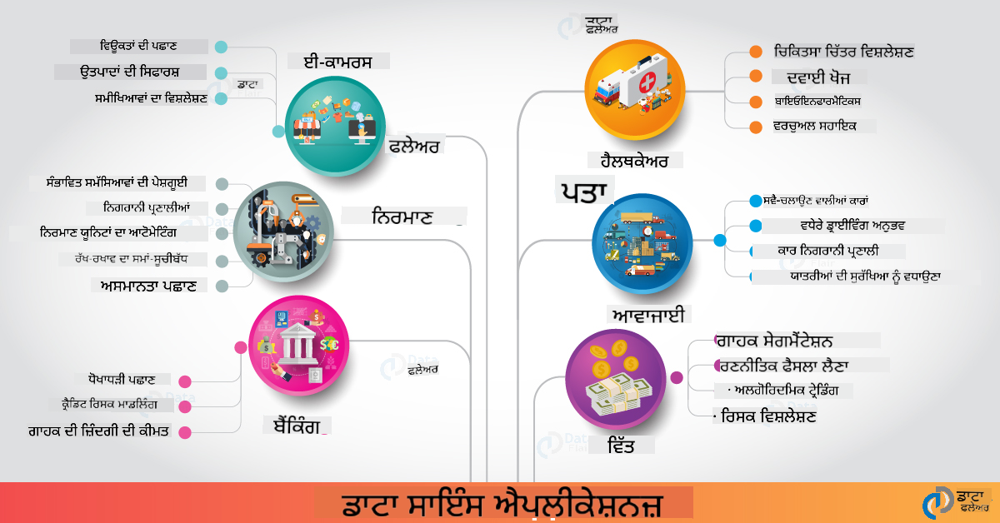

<!--
CO_OP_TRANSLATOR_METADATA:
{
  "original_hash": "67076ed50f54e7d26ba1ba378d6078f1",
  "translation_date": "2025-08-27T17:33:55+00:00",
  "source_file": "6-Data-Science-In-Wild/20-Real-World-Examples/README.md",
  "language_code": "pa"
}
-->
# ਰੀਅਲ ਵਰਲਡ ਵਿੱਚ ਡਾਟਾ ਸਾਇੰਸ

| ![ [(@sketchthedocs)] ਦੁਆਰਾ ਬਣਾਈ ਗਈ ਸਕੈਚਨੋਟ](https://sketchthedocs.dev) ](../../sketchnotes/20-DataScience-RealWorld.png) |
| :--------------------------------------------------------------------------------------------------------------: |
|               ਰੀਅਲ ਵਰਲਡ ਵਿੱਚ ਡਾਟਾ ਸਾਇੰਸ - _[@nitya](https://twitter.com/nitya) ਦੁਆਰਾ ਸਕੈਚਨੋਟ_               |

ਅਸੀਂ ਇਸ ਸਿੱਖਣ ਯਾਤਰਾ ਦੇ ਅੰਤ ਦੇ ਨੇੜੇ ਪਹੁੰਚ ਰਹੇ ਹਾਂ!

ਅਸੀਂ ਡਾਟਾ ਸਾਇੰਸ ਅਤੇ ਨੈਤਿਕਤਾ ਦੀਆਂ ਪਰਿਭਾਸ਼ਾਵਾਂ ਨਾਲ ਸ਼ੁਰੂਆਤ ਕੀਤੀ, ਡਾਟਾ ਵਿਸ਼ਲੇਸ਼ਣ ਅਤੇ ਵਿਜ਼ੁਅਲਾਈਜ਼ੇਸ਼ਨ ਲਈ ਵੱਖ-ਵੱਖ ਟੂਲ ਅਤੇ ਤਕਨੀਕਾਂ ਦੀ ਪੜਚੋਲ ਕੀਤੀ, ਡਾਟਾ ਸਾਇੰਸ ਲਾਈਫਸਾਈਕਲ ਦੀ ਸਮੀਖਿਆ ਕੀਤੀ, ਅਤੇ ਕਲਾਉਡ ਕੰਪਿਊਟਿੰਗ ਸੇਵਾਵਾਂ ਨਾਲ ਡਾਟਾ ਸਾਇੰਸ ਵਰਕਫਲੋਜ਼ ਨੂੰ ਸਕੇਲ ਅਤੇ ਆਟੋਮੇਟ ਕਰਨ ਦੇ ਤਰੀਕੇ ਵੇਖੇ। ਤਾਂ, ਤੁਸੀਂ ਸ਼ਾਇਦ ਸੋਚ ਰਹੇ ਹੋ: _"ਇਹ ਸਾਰੀਆਂ ਸਿੱਖਣਾਂ ਨੂੰ ਰੀਅਲ ਵਰਲਡ ਸੰਦਰਭਾਂ ਨਾਲ ਕਿਵੇਂ ਜੋੜਿਆ ਜਾਵੇ?"_

ਇਸ ਪਾਠ ਵਿੱਚ, ਅਸੀਂ ਉਦਯੋਗ ਵਿੱਚ ਡਾਟਾ ਸਾਇੰਸ ਦੇ ਰੀਅਲ ਵਰਲਡ ਐਪਲੀਕੇਸ਼ਨਾਂ ਦੀ ਪੜਚੋਲ ਕਰਾਂਗੇ ਅਤੇ ਖੋਜ, ਡਿਜ਼ੀਟਲ ਹਿਊਮੈਨਿਟੀਜ਼ ਅਤੇ ਸਸਤੇ ਵਿਕਾਸ ਦੇ ਸੰਦਰਭਾਂ ਵਿੱਚ ਖਾਸ ਉਦਾਹਰਣਾਂ ਵਿੱਚ ਡੁੱਬਾਂਗੇ। ਅਸੀਂ ਵਿਦਿਆਰਥੀ ਪ੍ਰੋਜੈਕਟ ਦੇ ਮੌਕੇ ਵੇਖਾਂਗੇ ਅਤੇ ਤੁਹਾਡੀ ਸਿੱਖਣ ਯਾਤਰਾ ਜਾਰੀ ਰੱਖਣ ਵਿੱਚ ਮਦਦ ਕਰਨ ਲਈ ਉਪਯੋਗ ਸਰੋਤਾਂ ਨਾਲ ਸਮਾਪਤ ਕਰਾਂਗੇ!

## ਪਾਠ ਤੋਂ ਪਹਿਲਾਂ ਕਵਿਜ਼

[ਪਾਠ ਤੋਂ ਪਹਿਲਾਂ ਕਵਿਜ਼](https://purple-hill-04aebfb03.1.azurestaticapps.net/quiz/38)

## ਡਾਟਾ ਸਾਇੰਸ + ਉਦਯੋਗ

AI ਦੇ ਲੋਕਤੰਤਰਿਕਰਨ ਦੇ ਕਾਰਨ, ਵਿਕਾਸਕਾਰਾਂ ਲਈ ਹੁਣ AI-ਚਲਿਤ ਫੈਸਲਾ-ਲੈਣ ਅਤੇ ਡਾਟਾ-ਚਲਿਤ ਅੰਤਰਦ੍ਰਿਸ਼ਟੀ ਨੂੰ ਉਪਭੋਗਤਾ ਅਨੁਭਵਾਂ ਅਤੇ ਵਿਕਾਸ ਵਰਕਫਲੋਜ਼ ਵਿੱਚ ਡਿਜ਼ਾਈਨ ਅਤੇ ਇੰਟੀਗਰੇਟ ਕਰਨਾ ਆਸਾਨ ਹੋ ਗਿਆ ਹੈ। ਇੱਥੇ ਕੁਝ ਉਦਾਹਰਣ ਹਨ ਕਿ ਕਿਵੇਂ ਡਾਟਾ ਸਾਇੰਸ ਨੂੰ ਉਦਯੋਗ ਵਿੱਚ "ਲਾਗੂ" ਕੀਤਾ ਜਾਂਦਾ ਹੈ:

* [ਗੂਗਲ ਫਲੂ ਟ੍ਰੈਂਡਸ](https://www.wired.com/2015/10/can-learn-epic-failure-google-flu-trends/) ਨੇ ਖੋਜ ਸ਼ਬਦਾਂ ਨੂੰ ਫਲੂ ਟ੍ਰੈਂਡਸ ਨਾਲ ਜੋੜਨ ਲਈ ਡਾਟਾ ਸਾਇੰਸ ਦੀ ਵਰਤੋਂ ਕੀਤੀ। ਹਾਲਾਂਕਿ ਇਸ ਪਹੁੰਚ ਵਿੱਚ ਖਾਮੀਆਂ ਸਨ, ਇਸ ਨੇ ਡਾਟਾ-ਚਲਿਤ ਸਿਹਤ ਸੰਭਾਲ ਦੀ ਭਵਿੱਖਵਾਣੀ ਦੀਆਂ ਸੰਭਾਵਨਾਵਾਂ (ਅਤੇ ਚੁਣੌਤੀਆਂ) ਬਾਰੇ ਜਾਗਰੂਕਤਾ ਵਧਾਈ।

* [UPS ਰੂਟਿੰਗ ਭਵਿੱਖਵਾਣੀਆਂ](https://www.technologyreview.com/2018/11/21/139000/how-ups-uses-ai-to-outsmart-bad-weather/) - UPS ਕਿਵੇਂ ਡਾਟਾ ਸਾਇੰਸ ਅਤੇ ਮਸ਼ੀਨ ਲਰਨਿੰਗ ਦੀ ਵਰਤੋਂ ਕਰਦਾ ਹੈ ਇਹ ਸਮਝਾਉਂਦਾ ਹੈ ਕਿ ਮੌਸਮ ਦੀਆਂ ਸਥਿਤੀਆਂ, ਟ੍ਰੈਫਿਕ ਪੈਟਰਨ, ਡਿਲਿਵਰੀ ਦੀਆਂ ਸਮਾਂ-ਸੀਮਾਵਾਂ ਅਤੇ ਹੋਰ ਗੱਲਾਂ ਨੂੰ ਧਿਆਨ ਵਿੱਚ ਰੱਖਦੇ ਹੋਏ ਡਿਲਿਵਰੀ ਲਈ ਵਧੀਆ ਰੂਟਾਂ ਦੀ ਭਵਿੱਖਵਾਣੀ ਕੀਤੀ ਜਾਵੇ।

* [NYC ਟੈਕਸੀਕੈਬ ਰੂਟ ਵਿਜ਼ੁਅਲਾਈਜ਼ੇਸ਼ਨ](http://chriswhong.github.io/nyctaxi/) - [ਸੁਤੰਤਰਤਾ ਦੀ ਜਾਣਕਾਰੀ ਦੇ ਕਾਨੂੰਨਾਂ](https://chriswhong.com/open-data/foil_nyc_taxi/) ਦੀ ਵਰਤੋਂ ਕਰਕੇ ਇਕੱਠੇ ਕੀਤੇ ਡਾਟਾ ਨੇ NYC ਟੈਕਸੀਕੈਬਸ ਦੇ ਜੀਵਨ ਦੇ ਇੱਕ ਦਿਨ ਨੂੰ ਵਿਜ਼ੁਅਲਾਈਜ਼ ਕਰਨ ਵਿੱਚ ਮਦਦ ਕੀਤੀ, ਜਿਸ ਨਾਲ ਸਾਨੂੰ ਸਮਝਣ ਵਿੱਚ ਮਦਦ ਮਿਲੀ ਕਿ ਉਹ ਵਿਆਸਤ ਸ਼ਹਿਰ ਵਿੱਚ ਕਿਵੇਂ ਚਲਦੇ ਹਨ, ਉਹ ਕਿੰਨਾ ਪੈਸਾ ਕਮਾਉਂਦੇ ਹਨ, ਅਤੇ ਹਰ 24-ਘੰਟੇ ਦੀ ਮਿਆਦ ਵਿੱਚ ਯਾਤਰਾਵਾਂ ਦੀ ਮਿਆਦ।

* [Uber ਡਾਟਾ ਸਾਇੰਸ ਵਰਕਬੈਂਚ](https://eng.uber.com/dsw/) - Uber ਦਿਨ ਵਿੱਚ ਲੱਖਾਂ ਯਾਤਰਾਵਾਂ ਤੋਂ ਇਕੱਠੇ ਕੀਤੇ ਡਾਟਾ (ਪਿਕਅਪ ਅਤੇ ਡ੍ਰਾਪਆਫ ਸਥਾਨਾਂ, ਯਾਤਰਾ ਦੀ ਮਿਆਦ, ਪਸੰਦੀਦਾ ਰੂਟ ਆਦਿ) ਦੀ ਵਰਤੋਂ ਕਰਦਾ ਹੈ ਡਾਟਾ ਵਿਸ਼ਲੇਸ਼ਣ ਟੂਲ ਬਣਾਉਣ ਲਈ ਜੋ ਕੀਮਤ, ਸੁਰੱਖਿਆ, ਧੋਖਾਧੜੀ ਦੀ ਪਛਾਣ ਅਤੇ ਨੈਵੀਗੇਸ਼ਨ ਫੈਸਲਿਆਂ ਵਿੱਚ ਮਦਦ ਕਰਦਾ ਹੈ।

* [ਖੇਡ ਵਿਸ਼ਲੇਸ਼ਣ](https://towardsdatascience.com/scope-of-analytics-in-sports-world-37ed09c39860) - _ਭਵਿੱਖਵਾਣੀ ਵਿਸ਼ਲੇਸ਼ਣ_ (ਟੀਮ ਅਤੇ ਖਿਡਾਰੀ ਵਿਸ਼ਲੇਸ਼ਣ - [ਮਨੀਬਾਲ](https://datasciencedegree.wisconsin.edu/blog/moneyball-proves-importance-big-data-big-ideas/) ਦੇ ਬਾਰੇ ਸੋਚੋ - ਅਤੇ ਪ੍ਰਸ਼ੰਸਕ ਪ੍ਰਬੰਧਨ) ਅਤੇ _ਡਾਟਾ ਵਿਜ਼ੁਅਲਾਈਜ਼ੇਸ਼ਨ_ (ਟੀਮ ਅਤੇ ਪ੍ਰਸ਼ੰਸਕ ਡੈਸ਼ਬੋਰਡ, ਖੇਡ ਆਦਿ) 'ਤੇ ਧਿਆਨ ਦਿੰਦਾ ਹੈ, ਜਿਸ ਵਿੱਚ ਪ੍ਰਤਿਭਾ ਖੋਜ, ਖੇਡ ਜੂਆ ਅਤੇ ਸਟਾਕ/ਸਥਾਨ ਪ੍ਰਬੰਧਨ ਵਰਗੀਆਂ ਐਪਲੀਕੇਸ਼ਨਾਂ ਸ਼ਾਮਲ ਹਨ।

* [ਬੈਂਕਿੰਗ ਵਿੱਚ ਡਾਟਾ ਸਾਇੰਸ](https://data-flair.training/blogs/data-science-in-banking/) - ਵਿੱਤੀ ਉਦਯੋਗ ਵਿੱਚ ਡਾਟਾ ਸਾਇੰਸ ਦੀ ਮਹੱਤਤਾ ਨੂੰ ਰਿਸਕ ਮਾਡਲਿੰਗ ਅਤੇ ਧੋਖਾਧੜੀ ਦੀ ਪਛਾਣ ਤੋਂ ਲੈ ਕੇ ਗਾਹਕ ਸੇਗਮੈਂਟੇਸ਼ਨ, ਰੀਅਲ-ਟਾਈਮ ਭਵਿੱਖਵਾਣੀ ਅਤੇ ਸਿਫਾਰਸ਼ੀ ਸਿਸਟਮ ਤੱਕ ਦੀਆਂ ਐਪਲੀਕੇਸ਼ਨਾਂ ਨਾਲ ਹਾਈਲਾਈਟ ਕਰਦਾ ਹੈ। ਭਵਿੱਖਵਾਣੀ ਵਿਸ਼ਲੇਸ਼ਣ ਮਹੱਤਵਪੂਰਨ ਮਾਪਦੰਡਾਂ ਨੂੰ ਚਲਾਉਂਦਾ ਹੈ ਜਿਵੇਂ ਕਿ [ਕ੍ਰੈਡਿਟ ਸਕੋਰ](https://dzone.com/articles/using-big-data-and-predictive-analytics-for-credit)।

* [ਸਿਹਤ ਸੰਭਾਲ ਵਿੱਚ ਡਾਟਾ ਸਾਇੰਸ](https://data-flair.training/blogs/data-science-in-healthcare/) - ਐਪਲੀਕੇਸ਼ਨਾਂ ਨੂੰ ਹਾਈਲਾਈਟ ਕਰਦਾ ਹੈ ਜਿਵੇਂ ਕਿ ਮੈਡੀਕਲ ਇਮੇਜਿੰਗ (ਜਿਵੇਂ ਕਿ MRI, X-Ray, CT-Scan), ਜਿਨੋਮਿਕਸ (DNA ਸੀਕਵੇਂਸਿੰਗ), ਦਵਾਈ ਵਿਕਾਸ (ਰਿਸਕ ਅਸੈਸਮੈਂਟ, ਸਫਲਤਾ ਦੀ ਭਵਿੱਖਵਾਣੀ), ਭਵਿੱਖਵਾਣੀ ਵਿਸ਼ਲੇਸ਼ਣ (ਮਰੀਜ਼ ਦੀ ਦੇਖਭਾਲ ਅਤੇ ਸਪਲਾਈ ਲਾਜਿਸਟਿਕਸ), ਬਿਮਾਰੀ ਟ੍ਰੈਕਿੰਗ ਅਤੇ ਰੋਕਥਾਮ ਆਦਿ।

 ਚਿੱਤਰ ਸ੍ਰੋਤ: [ਡਾਟਾ ਫਲੇਅਰ: 6 ਸ਼ਾਨਦਾਰ ਡਾਟਾ ਸਾਇੰਸ ਐਪਲੀਕੇਸ਼ਨ](https://data-flair.training/blogs/data-science-applications/)

ਚਿੱਤਰ ਵਿੱਚ ਡਾਟਾ ਸਾਇੰਸ ਤਕਨੀਕਾਂ ਨੂੰ ਲਾਗੂ ਕਰਨ ਲਈ ਹੋਰ ਖੇਤਰ ਅਤੇ ਉਦਾਹਰਣ ਦਿਖਾਏ ਗਏ ਹਨ। ਹੋਰ ਐਪਲੀਕੇਸ਼ਨਾਂ ਦੀ ਪੜਚੋਲ ਕਰਨਾ ਚਾਹੁੰਦੇ ਹੋ? ਹੇਠਾਂ ਦਿੱਤੇ [ਸਮੀਖਿਆ ਅਤੇ ਸਵੈ-ਅਧਿਐਨ](../../../../6-Data-Science-In-Wild/20-Real-World-Examples) ਭਾਗ ਨੂੰ ਵੇਖੋ।

## ਡਾਟਾ ਸਾਇੰਸ + ਖੋਜ

| ![ [(@sketchthedocs)] ਦੁਆਰਾ ਬਣਾਈ ਗਈ ਸਕੈਚਨੋਟ](https://sketchthedocs.dev) ](../../sketchnotes/20-DataScience-Research.png) |
| :---------------------------------------------------------------------------------------------------------------: |
|              ਡਾਟਾ ਸਾਇੰਸ ਅਤੇ ਖੋਜ - _[@nitya](https://twitter.com/nitya) ਦੁਆਰਾ ਸਕੈਚਨੋਟ_              |

ਜਦੋਂ ਕਿ ਰੀਅਲ ਵਰਲਡ ਐਪਲੀਕੇਸ਼ਨ ਅਕਸਰ ਵੱਡੇ ਪੱਧਰ 'ਤੇ ਉਦਯੋਗ ਦੇ ਕੇਸਾਂ 'ਤੇ ਧਿਆਨ ਕੇਂਦ੍ਰਿਤ ਕਰਦੇ ਹਨ, _ਖੋਜ_ ਐਪਲੀਕੇਸ਼ਨ ਅਤੇ ਪ੍ਰੋਜੈਕਟ ਦੋ ਦ੍ਰਿਸ਼ਟਿਕੋਣਾਂ ਤੋਂ ਲਾਭਦਾਇਕ ਹੋ ਸਕਦੇ ਹਨ:

* _ਨਵੀਨਤਾ ਦੇ ਮੌਕੇ_ - ਅਗਲੇ ਪੀੜ੍ਹੀ ਦੇ ਐਪਲੀਕੇਸ਼ਨਾਂ ਲਈ ਉਪਭੋਗਤਾ ਅਨੁਭਵਾਂ ਦੀ ਤੇਜ਼ ਪ੍ਰੋਟੋਟਾਈਪਿੰਗ ਅਤੇ ਟੈਸਟਿੰਗ ਦੀ ਪੜਚੋਲ ਕਰੋ।
* _ਤੈਨਾਤੀ ਚੁਣੌਤੀਆਂ_ - ਰੀਅਲ ਵਰਲਡ ਸੰਦਰਭਾਂ ਵਿੱਚ ਡਾਟਾ ਸਾਇੰਸ ਤਕਨਾਲੋਜੀਆਂ ਦੇ ਸੰਭਾਵਿਤ ਨੁਕਸਾਨ ਜਾਂ ਅਣਜਾਣੇ ਨਤੀਜਿਆਂ ਦੀ ਜਾਂਚ ਕਰੋ।

ਵਿਦਿਆਰਥੀਆਂ ਲਈ, ਇਹ ਖੋਜ ਪ੍ਰੋਜੈਕਟ ਸਿੱਖਣ ਅਤੇ ਸਹਿਯੋਗ ਦੇ ਮੌਕੇ ਪ੍ਰਦਾਨ ਕਰ ਸਕਦੇ ਹਨ ਜੋ ਤੁਹਾਡੀ ਵਿਸ਼ੇ ਦੀ ਸਮਝ ਵਿੱਚ ਸੁਧਾਰ ਕਰ ਸਕਦੇ ਹਨ, ਅਤੇ ਸਬੰਧਤ ਲੋਕਾਂ ਜਾਂ ਟੀਮਾਂ ਨਾਲ ਤੁਹਾਡੀ ਜਾਗਰੂਕਤਾ ਅਤੇ ਸਹਿਭਾਗਤਾ ਨੂੰ ਵਧਾ ਸਕਦੇ ਹਨ ਜੋ ਰੁਚੀ ਦੇ ਖੇਤਰਾਂ ਵਿੱਚ ਕੰਮ ਕਰ ਰਹੇ ਹਨ। ਤਾਂ ਖੋਜ ਪ੍ਰੋਜੈਕਟ ਕਿਵੇਂ ਦਿਖਦੇ ਹਨ ਅਤੇ ਉਹ ਕਿਵੇਂ ਪ੍ਰਭਾਵ ਪਾ ਸਕਦੇ ਹਨ?

ਆਓ ਇੱਕ ਉਦਾਹਰਣ ਵੇਖੀਏ - [MIT ਜੈਂਡਰ ਸ਼ੇਡਸ ਸਟਡੀ](http://gendershades.org/overview.html) ਜੋਇ ਬੂਲਾਮਵਿਨੀ (MIT ਮੀਡੀਆ ਲੈਬਸ) ਦੁਆਰਾ ਕੀਤੀ ਗਈ ਅਤੇ [ਸਿਗਨੇਚਰ ਖੋਜ ਪੇਪਰ](http://proceedings.mlr.press/v81/buolamwini18a/buolamwini18a.pdf) ਜੋ ਟਿਮਨਿਟ ਗੇਬਰੂ (ਤਦ ਮਾਈਕਰੋਸਾਫਟ ਰੀਸਰਚ ਵਿੱਚ) ਨਾਲ ਸਹਿ-ਲਿਖਿਆ ਗਿਆ ਸੀ, ਜਿਸ ਨੇ ਧਿਆਨ ਦਿੱਤਾ:

* **ਕੀ:** ਖੋਜ ਪ੍ਰੋਜੈਕਟ ਦਾ ਉਦੇਸ਼ _ਜੈਂਡਰ ਅਤੇ ਚਮੜੀ ਦੇ ਰੰਗ ਦੇ ਆਧਾਰ 'ਤੇ ਆਟੋਮੈਟਿਕ ਫੇਸ਼ਲ ਵਿਸ਼ਲੇਸ਼ਣ ਐਲਗੋਰਿਥਮ ਅਤੇ ਡਾਟਾਸੈਟਸ ਵਿੱਚ ਮੌਜੂਦ ਪੱਖਪਾਤ ਦਾ ਮੁਲਾਂਕਣ ਕਰਨਾ_ ਸੀ।
* **ਕਿਉਂ:** ਫੇਸ਼ਲ ਵਿਸ਼ਲੇਸ਼ਣ ਨੂੰ ਕਾਨੂੰਨ ਪ੍ਰਵਿਰਤੀ, ਹਵਾਈ ਅੱਡੇ ਦੀ ਸੁਰੱਖਿਆ, ਭਰਤੀ ਪ੍ਰਣਾਲੀਆਂ ਅਤੇ ਹੋਰ ਖੇਤਰਾਂ ਵਿੱਚ ਵਰਤਿਆ ਜਾਂਦਾ ਹੈ - ਜਿੱਥੇ ਗਲਤ ਵਰਗੀਕਰਨ (ਜਿਵੇਂ ਕਿ ਪੱਖਪਾਤ ਦੇ ਕਾਰਨ) ਪ੍ਰਭਾਵਿਤ ਵਿਅਕਤੀਆਂ ਜਾਂ ਸਮੂਹਾਂ ਲਈ ਸੰਭਾਵਿਤ ਆਰਥਿਕ ਅਤੇ ਸਮਾਜਿਕ ਨੁਕਸਾਨ ਪੈਦਾ ਕਰ ਸਕਦਾ ਹੈ। ਵਰਤੋਂ ਵਿੱਚ ਨਿਰਪੱਖਤਾ ਲਈ ਪੱਖਪਾਤ ਨੂੰ ਸਮਝਣਾ (ਅਤੇ ਖਤਮ ਜਾਂ ਘਟਾਉਣਾ) ਮਹੱਤਵਪੂਰਨ ਹੈ।
* **ਕਿਵੇਂ:** ਖੋਜਕਰਤਾਵਾਂ ਨੇ ਪਛਾਣ ਕੀਤੀ ਕਿ ਮੌਜੂਦਾ ਬੈਂਚਮਾਰਕ ਮੁੱਖ ਤੌਰ 'ਤੇ ਹਲਕੇ ਚਮੜੀ ਵਾਲੇ ਵਿਸ਼ਿਆਂ ਦੀ ਵਰਤੋਂ ਕਰਦੇ ਹਨ, ਅਤੇ ਇੱਕ ਨਵਾਂ ਡਾਟਾ ਸੈੱਟ (1000+ ਚਿੱਤਰ) ਤਿਆਰ ਕੀਤਾ ਜੋ ਜੈਂਡਰ ਅਤੇ ਚਮੜੀ ਦੇ ਰੰਗ ਦੇ ਆਧਾਰ 'ਤੇ _ਵਧੇਰੇ ਸੰਤੁਲਿਤ_ ਸੀ। ਡਾਟਾ ਸੈੱਟ ਨੂੰ Microsoft, IBM ਅਤੇ Face++ ਤੋਂ ਤਿੰਨ ਜੈਂਡਰ ਵਰਗੀਕਰਨ ਉਤਪਾਦਾਂ ਦੀ ਸ਼ੁੱਧਤਾ ਦਾ ਮੁਲਾਂਕਣ ਕਰਨ ਲਈ ਵਰਤਿਆ ਗਿਆ।

ਨਤੀਜਿਆਂ ਨੇ ਦਿਖਾਇਆ ਕਿ ਹਾਲਾਂਕਿ ਕੁੱਲ ਵਰਗੀਕਰਨ ਸ਼ੁੱਧਤਾ ਚੰਗੀ ਸੀ, ਵੱਖ-ਵੱਖ ਉਪਸਮੂਹਾਂ ਵਿੱਚ ਗਲਤੀ ਦੀਆਂ ਦਰਾਂ ਵਿੱਚ ਇੱਕ ਨਜ਼ਰਅੰਦਾਜ਼ ਕਰਨ ਯੋਗ ਅੰਤਰ ਸੀ - **ਗਲਤ ਜੈਂਡਰ ਪਛਾਣ** ਮਹਿਲਾਵਾਂ ਜਾਂ ਗੂੜ੍ਹੇ ਚਮੜੀ ਵਾਲੇ ਵਿਅਕਤੀਆਂ ਲਈ ਵਧੇਰੇ ਸੀ, ਜੋ ਪੱਖਪਾਤ ਦਾ ਸੰਕੇਤ ਦਿੰਦਾ ਹੈ।

**ਮੁੱਖ ਨਤੀਜੇ:** ਜਾਗਰੂਕਤਾ ਵਧਾਈ ਕਿ ਡਾਟਾ ਸਾਇੰਸ ਨੂੰ ਵਧੇਰੇ _ਪ੍ਰਤੀਨਿਧੀ ਡਾਟਾਸੈਟਸ_ (ਸੰਤੁਲਿਤ ਉਪਸਮੂਹ) ਅਤੇ ਵਧੇਰੇ _ਸਮਾਵੇਸ਼ੀ ਟੀਮਾਂ_ (ਵਿਭਿੰਨ ਪਿਛੋਕੜ) ਦੀ ਲੋੜ ਹੈ ਤਾਂ ਜੋ AI ਹੱਲਾਂ ਵਿੱਚ ਅਜਿਹੇ ਪੱਖਪਾਤ ਨੂੰ ਪਹਿਲਾਂ ਹੀ ਪਛਾਣਿਆ ਜਾ ਸਕੇ ਅਤੇ ਖਤਮ ਜਾਂ ਘਟਾਇਆ ਜਾ ਸਕੇ। ਇਸ ਤਰ੍ਹਾਂ ਦੇ ਖੋਜ ਯਤਨ ਬਹੁਤ ਸਾਰੀਆਂ ਸੰਸਥਾਵਾਂ ਨੂੰ _ਜਿੰਮੇਵਾਰ AI_ ਲਈ ਸਿਧਾਂਤ ਅਤੇ ਅਭਿਆਸ ਪਰਿਭਾਸ਼ਿਤ ਕਰਨ ਵਿੱਚ ਸਹਾਇਕ ਹਨ, ਜੋ ਉਨ੍ਹਾਂ ਦੇ AI ਉਤਪਾਦਾਂ ਅਤੇ ਪ੍ਰਕਿਰਿਆਵਾਂ ਵਿੱਚ ਨਿਰਪੱਖਤਾ ਵਿੱਚ ਸੁਧਾਰ ਕਰਦੇ ਹਨ।

**ਮਾਈਕਰੋਸਾਫਟ ਵਿੱਚ ਸਬੰਧਤ ਖੋਜ ਯਤਨਾਂ ਬਾਰੇ ਜਾਣਨਾ ਚਾਹੁੰਦੇ ਹੋ?**

* [ਮਾਈਕਰੋਸਾਫਟ ਰੀਸਰਚ ਪ੍ਰੋਜੈਕਟਸ](https://www.microsoft.com/research/research-area/artificial-intelligence/?facet%5Btax%5D%5Bmsr-research-area%5D%5B%5D=13556&facet%5Btax%5D%5Bmsr-content-type%5D%5B%5D=msr-project) 'ਤੇ Artificial Intelligence ਦੇ ਖੇਤਰ ਵਿੱਚ ਪੜਚੋਲ ਕਰੋ।
* [ਮਾਈਕਰੋਸਾਫਟ ਰੀਸਰਚ ਡਾਟਾ ਸਾਇੰਸ ਸਮਰ ਸਕੂਲ](https://www.microsoft.com/en-us/research/academic-program/data-science-summer-school/) ਤੋਂ ਵਿਦਿਆਰਥੀ ਪ੍ਰੋਜੈਕਟਸ ਦੀ ਪੜਚੋਲ ਕਰੋ।
* [Fairlearn](https://fairlearn.org/) ਪ੍ਰੋਜੈਕਟ ਅਤੇ [ਜਿੰਮੇਵਾਰ AI](https://www.microsoft.com/en-us/ai/responsible-ai?activetab=pivot1%3aprimaryr6) ਪਹਲਾਂ ਦੀ ਜਾਂਚ ਕਰੋ।

## ਡਾਟਾ ਸਾਇੰਸ + ਹਿਊਮੈਨਿਟੀਜ਼

| ![ [(@sketchthedocs)] ਦੁਆਰਾ ਬਣਾਈ ਗਈ ਸਕੈਚਨੋਟ](https://sketchthedocs.dev) ](../../sketchnotes/20-DataScience-Humanities.png) |
| :---------------------------------------------------------------------------------------------------------------: |
|              ਡਾਟਾ ਸਾਇੰਸ ਅਤੇ ਡਿਜ਼ੀਟਲ ਹਿਊਮੈਨਿਟੀਜ਼ - _[@nitya](https://twitter.com/nitya) ਦੁਆਰਾ ਸਕੈਚਨੋਟ_              |

ਡਿਜ਼ੀਟਲ ਹਿਊਮੈਨਿਟੀਜ਼ [ਇਸ ਤਰ੍ਹਾਂ ਪਰਿਭਾਸ਼ਿਤ ਕੀਤੀ ਗਈ ਹੈ](https://digitalhumanities.stanford.edu/about-dh-stanford) ਕਿ "ਕੰਪਿਊਟੇਸ਼ਨਲ ਤਰੀਕਿਆਂ ਨੂੰ ਮਨੁੱਖੀ ਪੜਚੋਲ ਨਾਲ ਜੋੜਨ ਵਾਲੇ ਅਭਿਆਸਾਂ ਅਤੇ ਪਹੁੰਚਾਂ ਦਾ ਇਕ ਸੰਗ੍ਰਹਿ"। [ਸਟੈਨਫੋਰਡ ਪ੍ਰੋਜੈਕਟ](https://digitalhumanities.stanford.edu/projects) ਜਿਵੇਂ ਕਿ _"ਇਤਿਹਾਸ ਨੂੰ ਮੁੜ ਸ਼ੁਰੂ ਕਰਨਾ"_ ਅਤੇ _"ਕਵਿਤਾ ਵਾਲਾ ਸੋਚ"_ [ਡਿਜ਼ੀਟਲ ਹਿਊਮੈਨਿਟੀਜ਼ ਅਤੇ ਡਾਟਾ ਸਾਇੰਸ](https://digitalhumanities.stanford.edu/digital-humanities-and-data-science)
**ਪਲੇਨਟਰੀ ਕੰਪਿਊਟਰ ਪ੍ਰੋਜੈਕਟ ਇਸ ਸਮੇਂ ਪ੍ਰੀਵਿਊ ਵਿੱਚ ਹੈ (ਸਤੰਬਰ 2021 ਤੱਕ)** - ਇਹ ਹੈ ਕਿ ਤੁਸੀਂ ਡਾਟਾ ਸਾਇੰਸ ਦੀ ਵਰਤੋਂ ਕਰਕੇ ਸਸਤੇ ਹੱਲਾਂ ਵਿੱਚ ਯੋਗਦਾਨ ਪਾਉਣ ਦੀ ਸ਼ੁਰੂਆਤ ਕਿਵੇਂ ਕਰ ਸਕਦੇ ਹੋ।

* [ਐਕਸੈੱਸ ਦੀ ਬੇਨਤੀ ਕਰੋ](https://planetarycomputer.microsoft.com/account/request) ਤਾਕਿ ਖੋਜ ਸ਼ੁਰੂ ਕੀਤੀ ਜਾ ਸਕੇ ਅਤੇ ਸਾਥੀਆਂ ਨਾਲ ਜੁੜਿਆ ਜਾ ਸਕੇ।
* [ਡਾਕੂਮੈਂਟੇਸ਼ਨ ਦੀ ਖੋਜ ਕਰੋ](https://planetarycomputer.microsoft.com/docs/overview/about) ਤਾਕਿ ਸਮਝਿਆ ਜਾ ਸਕੇ ਕਿ ਕਿਹੜੇ ਡਾਟਾਸੈਟ ਅਤੇ API ਸਹਾਇਕ ਹਨ।
* [Ecosystem Monitoring](https://analytics-lab.org/ecosystemmonitoring/) ਵਰਗੇ ਐਪਲੀਕੇਸ਼ਨ ਦੀ ਖੋਜ ਕਰੋ ਜੋ ਐਪਲੀਕੇਸ਼ਨ ਆਈਡੀਆ ਲਈ ਪ੍ਰੇਰਣਾ ਦੇ ਸਕਦੇ ਹਨ।

ਸੋਚੋ ਕਿ ਤੁਸੀਂ ਕਿਵੇਂ ਡਾਟਾ ਵਿਜੁਅਲਾਈਜ਼ੇਸ਼ਨ ਦੀ ਵਰਤੋਂ ਕਰਕੇ ਮੌਸਮੀ ਤਬਦੀਲੀ ਅਤੇ ਜੰਗਲਾਂ ਦੀ ਕਟਾਈ ਵਰਗੇ ਖੇਤਰਾਂ ਵਿੱਚ ਸਬੰਧਤ ਅੰਦਰੂਨੀ ਜਾਣਕਾਰੀ ਨੂੰ ਉਜਾਗਰ ਜਾਂ ਵਧਾ ਸਕਦੇ ਹੋ। ਜਾਂ ਸੋਚੋ ਕਿ ਇਹ ਅੰਦਰੂਨੀ ਜਾਣਕਾਰੀ ਕਿਵੇਂ ਨਵੇਂ ਯੂਜ਼ਰ ਅਨੁਭਵ ਬਣਾਉਣ ਲਈ ਵਰਤੀ ਜਾ ਸਕਦੀ ਹੈ ਜੋ ਜ਼ਿੰਮੇਵਾਰ ਜੀਵਨ ਲਈ ਵਿਹਾਰਕ ਬਦਲਾਅ ਪ੍ਰੇਰਿਤ ਕਰ ਸਕੇ।

## ਡਾਟਾ ਸਾਇੰਸ + ਵਿਦਿਆਰਥੀ

ਅਸੀਂ ਉਦਯੋਗ ਅਤੇ ਖੋਜ ਵਿੱਚ ਅਸਲ ਦੁਨੀਆ ਦੇ ਐਪਲੀਕੇਸ਼ਨਾਂ ਬਾਰੇ ਗੱਲ ਕੀਤੀ ਹੈ ਅਤੇ ਡਿਜੀਟਲ ਹਿਊਮੈਨਿਟੀਜ਼ ਅਤੇ ਸਸਤੇ ਹੱਲਾਂ ਵਿੱਚ ਡਾਟਾ ਸਾਇੰਸ ਦੇ ਐਪਲੀਕੇਸ਼ਨ ਉਦਾਹਰਣਾਂ ਦੀ ਖੋਜ ਕੀਤੀ ਹੈ। ਤਾਂ ਤੁਸੀਂ ਡਾਟਾ ਸਾਇੰਸ ਬਿਗਿਨਰਜ਼ ਵਜੋਂ ਆਪਣੀਆਂ ਕੌਸ਼ਲਾਂ ਕਿਵੇਂ ਬਣਾਉਣਗੇ ਅਤੇ ਆਪਣੀ ਮਹਾਰਤ ਕਿਵੇਂ ਸਾਂਝੀ ਕਰੋਗੇ?

ਇਹ ਰਹੇ ਕੁਝ ਡਾਟਾ ਸਾਇੰਸ ਵਿਦਿਆਰਥੀ ਪ੍ਰੋਜੈਕਟਾਂ ਦੇ ਉਦਾਹਰਣ ਜੋ ਤੁਹਾਨੂੰ ਪ੍ਰੇਰਿਤ ਕਰ ਸਕਦੇ ਹਨ।

* [MSR Data Science Summer School](https://www.microsoft.com/en-us/research/academic-program/data-science-summer-school/#!projects) ਨਾਲ GitHub [projects](https://github.com/msr-ds3) ਜੋ ਹੇਠਾਂ ਦਿੱਤੇ ਵਿਸ਼ਿਆਂ ਦੀ ਖੋਜ ਕਰਦੇ ਹਨ:
   - [ਪੁਲਿਸ ਦੇ ਜ਼ਬਰਦਸਤੀ ਦੇ ਇਸਤੇਮਾਲ ਵਿੱਚ ਨਸਲੀ ਪੱਖਪਾਤ](https://www.microsoft.com/en-us/research/video/data-science-summer-school-2019-replicating-an-empirical-analysis-of-racial-differences-in-police-use-of-force/) | [Github](https://github.com/msr-ds3/stop-question-frisk)
   - [ਨਿਊਯਾਰਕ ਸਬਵੇ ਸਿਸਟਮ ਦੀ ਭਰੋਸੇਯੋਗਤਾ](https://www.microsoft.com/en-us/research/video/data-science-summer-school-2018-exploring-the-reliability-of-the-nyc-subway-system/) | [Github](https://github.com/msr-ds3/nyctransit)
* [ਮੈਟਰੀਅਲ ਕਲਚਰ ਨੂੰ ਡਿਜੀਟਲ ਬਣਾਉਣਾ: ਸਿਰਕਪ ਵਿੱਚ ਸਮਾਜਿਕ-ਆਰਥਿਕ ਵੰਡਾਂ ਦੀ ਖੋਜ](https://claremont.maps.arcgis.com/apps/Cascade/index.html?appid=bdf2aef0f45a4674ba41cd373fa23afc) - [Ornella Altunyan](https://twitter.com/ornelladotcom) ਅਤੇ ਕਲੇਰਮੌਂਟ ਦੀ ਟੀਮ ਵੱਲੋਂ, [ArcGIS StoryMaps](https://storymaps.arcgis.com/) ਦੀ ਵਰਤੋਂ ਕਰਦੇ ਹੋਏ।

## 🚀 ਚੁਣੌਤੀ

ਉਹ ਲੇਖ ਲੱਭੋ ਜੋ ਡਾਟਾ ਸਾਇੰਸ ਪ੍ਰੋਜੈਕਟਾਂ ਦੀ ਸਿਫਾਰਸ਼ ਕਰਦੇ ਹਨ ਜੋ ਸ਼ੁਰੂਆਤੀ ਲਈ ਆਸਾਨ ਹਨ - ਜਿਵੇਂ [ਇਹ 50 ਵਿਸ਼ੇ](https://www.upgrad.com/blog/data-science-project-ideas-topics-beginners/) ਜਾਂ [ਇਹ 21 ਪ੍ਰੋਜੈਕਟ ਆਈਡੀਆ](https://www.intellspot.com/data-science-project-ideas) ਜਾਂ [ਇਹ 16 ਪ੍ਰੋਜੈਕਟ ਸੋਰਸ ਕੋਡ ਨਾਲ](https://data-flair.training/blogs/data-science-project-ideas/) ਜੋ ਤੁਸੀਂ ਡਿਕੰਸਟ੍ਰਕਟ ਅਤੇ ਰੀਮਿਕਸ ਕਰ ਸਕਦੇ ਹੋ। ਅਤੇ ਆਪਣੀਆਂ ਸਿੱਖਣ ਯਾਤਰਾਵਾਂ ਬਾਰੇ ਬਲੌਗ ਕਰਨਾ ਨਾ ਭੁੱਲੋ ਅਤੇ ਸਾਡੇ ਨਾਲ ਆਪਣੀਆਂ ਅੰਦਰੂਨੀ ਜਾਣਕਾਰੀਆਂ ਸਾਂਝੀਆਂ ਕਰੋ।

## ਲੈਕਚਰ ਬਾਅਦ ਕਵੀਜ਼

[ਲੈਕਚਰ ਬਾਅਦ ਕਵੀਜ਼](https://purple-hill-04aebfb03.1.azurestaticapps.net/quiz/39)

## ਸਮੀਖਿਆ ਅਤੇ ਸਵੈ ਅਧਿਐਨ

ਹੋਰ ਕੇਸਾਂ ਦੀ ਖੋਜ ਕਰਨਾ ਚਾਹੁੰਦੇ ਹੋ? ਇੱਥੇ ਕੁਝ ਸਬੰਧਤ ਲੇਖ ਹਨ:
* [17 ਡਾਟਾ ਸਾਇੰਸ ਐਪਲੀਕੇਸ਼ਨ ਅਤੇ ਉਦਾਹਰਣ](https://builtin.com/data-science/data-science-applications-examples) - ਜੁਲਾਈ 2021
* [ਅਸਲ ਦੁਨੀਆ ਵਿੱਚ 11 ਸ਼ਾਨਦਾਰ ਡਾਟਾ ਸਾਇੰਸ ਐਪਲੀਕੇਸ਼ਨ](https://myblindbird.com/data-science-applications-real-world/) - ਮਈ 2021
* [ਅਸਲ ਦੁਨੀਆ ਵਿੱਚ ਡਾਟਾ ਸਾਇੰਸ](https://towardsdatascience.com/data-science-in-the-real-world/home) - ਲੇਖ ਸੰਗ੍ਰਹਿ
* ਡਾਟਾ ਸਾਇੰਸ ਵਿੱਚ: [ਸਿੱਖਿਆ](https://data-flair.training/blogs/data-science-in-education/), [ਖੇਤੀਬਾੜੀ](https://data-flair.training/blogs/data-science-in-agriculture/), [ਵਿੱਤ](https://data-flair.training/blogs/data-science-in-finance/), [ਫਿਲਮਾਂ](https://data-flair.training/blogs/data-science-at-movies/) ਅਤੇ ਹੋਰ।

## ਅਸਾਈਨਮੈਂਟ

[ਪਲੇਨਟਰੀ ਕੰਪਿਊਟਰ ਡਾਟਾਸੈਟ ਦੀ ਖੋਜ ਕਰੋ](assignment.md)

---

**ਅਸਵੀਕਾਰਨਾ**:  
ਇਹ ਦਸਤਾਵੇਜ਼ AI ਅਨੁਵਾਦ ਸੇਵਾ [Co-op Translator](https://github.com/Azure/co-op-translator) ਦੀ ਵਰਤੋਂ ਕਰਕੇ ਅਨੁਵਾਦ ਕੀਤਾ ਗਿਆ ਹੈ। ਜਦੋਂ ਕਿ ਅਸੀਂ ਸਹੀਤਾ ਲਈ ਯਤਨਸ਼ੀਲ ਹਾਂ, ਕਿਰਪਾ ਕਰਕੇ ਧਿਆਨ ਦਿਓ ਕਿ ਸਵੈਚਾਲਿਤ ਅਨੁਵਾਦਾਂ ਵਿੱਚ ਗਲਤੀਆਂ ਜਾਂ ਅਸੁਚਨਾਵਾਂ ਹੋ ਸਕਦੀਆਂ ਹਨ। ਮੂਲ ਦਸਤਾਵੇਜ਼, ਜੋ ਇਸਦੀ ਮੂਲ ਭਾਸ਼ਾ ਵਿੱਚ ਹੈ, ਨੂੰ ਅਧਿਕਾਰਤ ਸਰੋਤ ਮੰਨਿਆ ਜਾਣਾ ਚਾਹੀਦਾ ਹੈ। ਮਹੱਤਵਪੂਰਨ ਜਾਣਕਾਰੀ ਲਈ, ਪੇਸ਼ੇਵਰ ਮਨੁੱਖੀ ਅਨੁਵਾਦ ਦੀ ਸਿਫਾਰਸ਼ ਕੀਤੀ ਜਾਂਦੀ ਹੈ। ਇਸ ਅਨੁਵਾਦ ਦੀ ਵਰਤੋਂ ਤੋਂ ਪੈਦਾ ਹੋਣ ਵਾਲੇ ਕਿਸੇ ਵੀ ਗਲਤ ਫਹਿਮੀ ਜਾਂ ਗਲਤ ਵਿਆਖਿਆ ਲਈ ਅਸੀਂ ਜ਼ਿੰਮੇਵਾਰ ਨਹੀਂ ਹਾਂ।