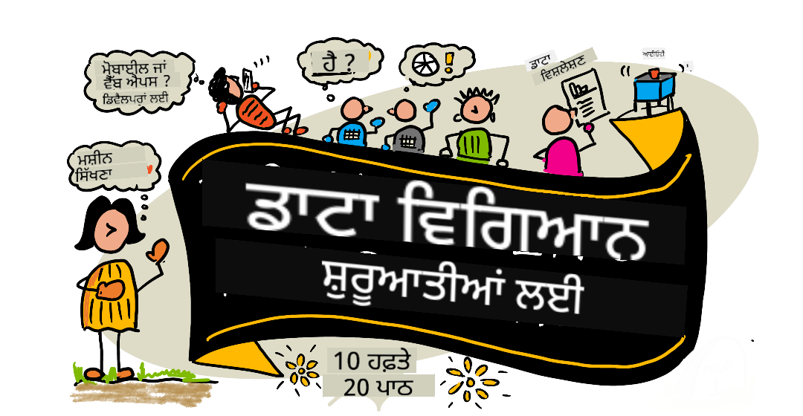

<!--
CO_OP_TRANSLATOR_METADATA:
{
  "original_hash": "dd9a1deb4da680b2cf11ba2e9f5a0a6e",
  "translation_date": "2025-09-29T21:44:35+00:00",
  "source_file": "README.md",
  "language_code": "pa"
}
-->
# ਡਾਟਾ ਸਾਇੰਸ ਸ਼ੁਰੂਆਤੀ ਲਈ - ਇੱਕ ਪਾਠਕ੍ਰਮ

Azure Cloud Advocates ਮਾਈਕਰੋਸਾਫਟ ਵਿੱਚ 10 ਹਫ਼ਤਿਆਂ ਦਾ, 20 ਪਾਠਾਂ ਵਾਲਾ ਪਾਠਕ੍ਰਮ ਪੇਸ਼ ਕਰਨ ਵਿੱਚ ਖੁਸ਼ ਹਨ ਜੋ ਡਾਟਾ ਸਾਇੰਸ ਬਾਰੇ ਹੈ। ਹਰ ਪਾਠ ਵਿੱਚ ਪਾਠ ਤੋਂ ਪਹਿਲਾਂ ਅਤੇ ਪਾਠ ਤੋਂ ਬਾਅਦ ਦੇ ਕਵਿਜ਼, ਪਾਠ ਪੂਰਾ ਕਰਨ ਲਈ ਲਿਖਤ ਹਦਾਇਤਾਂ, ਇੱਕ ਹੱਲ ਅਤੇ ਇੱਕ ਅਸਾਈਨਮੈਂਟ ਸ਼ਾਮਲ ਹੈ। ਸਾਡੇ ਪ੍ਰੋਜੈਕਟ-ਅਧਾਰਿਤ ਪੈਡਾਗੌਜੀ ਤੁਹਾਨੂੰ ਸਿੱਖਣ ਦਿੰਦੀ ਹੈ ਜਦੋਂ ਤੁਸੀਂ ਬਣਾਉਂਦੇ ਹੋ, ਜੋ ਨਵੀਆਂ ਹੁਨਰਾਂ ਨੂੰ 'ਟਿਕਾਉਣ' ਦਾ ਸਾਬਤ ਤਰੀਕਾ ਹੈ।

**ਸਾਡੇ ਲੇਖਕਾਂ ਨੂੰ ਦਿਲੋਂ ਧੰਨਵਾਦ:** [Jasmine Greenaway](https://www.twitter.com/paladique), [Dmitry Soshnikov](http://soshnikov.com), [Nitya Narasimhan](https://twitter.com/nitya), [Jalen McGee](https://twitter.com/JalenMcG), [Jen Looper](https://twitter.com/jenlooper), [Maud Levy](https://twitter.com/maudstweets), [Tiffany Souterre](https://twitter.com/TiffanySouterre), [Christopher Harrison](https://www.twitter.com/geektrainer)।

**🙏 ਵਿਸ਼ੇਸ਼ ਧੰਨਵਾਦ 🙏 ਸਾਡੇ [Microsoft Student Ambassador](https://studentambassadors.microsoft.com/) ਲੇਖਕਾਂ, ਸਮੀਖਾਕਾਰਾਂ ਅਤੇ ਸਮੱਗਰੀ ਯੋਗਦਾਨਕਰਤਿਆਂ ਨੂੰ,** ਜਿਵੇਂ ਕਿ Aaryan Arora, [Aditya Garg](https://github.com/AdityaGarg00), [Alondra Sanchez](https://www.linkedin.com/in/alondra-sanchez-molina/), [Ankita Singh](https://www.linkedin.com/in/ankitasingh007), [Anupam Mishra](https://www.linkedin.com/in/anupam--mishra/), [Arpita Das](https://www.linkedin.com/in/arpitadas01/), ChhailBihari Dubey, [Dibri Nsofor](https://www.linkedin.com/in/dibrinsofor), [Dishita Bhasin](https://www.linkedin.com/in/dishita-bhasin-7065281bb), [Majd Safi](https://www.linkedin.com/in/majd-s/), [Max Blum](https://www.linkedin.com/in/max-blum-6036a1186/), [Miguel Correa](https://www.linkedin.com/in/miguelmque/), [Mohamma Iftekher (Iftu) Ebne Jalal](https://twitter.com/iftu119), [Nawrin Tabassum](https://www.linkedin.com/in/nawrin-tabassum), [Raymond Wangsa Putra](https://www.linkedin.com/in/raymond-wp/), [Rohit Yadav](https://www.linkedin.com/in/rty2423), Samridhi Sharma, [Sanya Sinha](https://www.linkedin.com/mwlite/in/sanya-sinha-13aab1200), [Sheena Narula](https://www.linkedin.com/in/sheena-narua-n/), [Tauqeer Ahmad](https://www.linkedin.com/in/tauqeerahmad5201/), Yogendrasingh Pawar, [Vidushi Gupta](https://www.linkedin.com/in/vidushi-gupta07/), [Jasleen Sondhi](https://www.linkedin.com/in/jasleen-sondhi/)।

||
|:---:|
| ਡਾਟਾ ਸਾਇੰਸ ਸ਼ੁਰੂਆਤੀ ਲਈ - _Sketchnote by [@nitya](https://twitter.com/nitya)_ |

### 🌐 ਬਹੁ-ਭਾਸ਼ਾ ਸਹਾਇਤਾ

#### GitHub Action ਰਾਹੀਂ ਸਹਾਇਤ (ਆਟੋਮੈਟਿਕ ਅਤੇ ਹਮੇਸ਼ਾ ਅਪ-ਟੂ-ਡੇਟ)

[French](../fr/README.md) | [Spanish](../es/README.md) | [German](../de/README.md) | [Russian](../ru/README.md) | [Arabic](../ar/README.md) | [Persian (Farsi)](../fa/README.md) | [Urdu](../ur/README.md) | [Chinese (Simplified)](../zh/README.md) | [Chinese (Traditional, Macau)](../mo/README.md) | [Chinese (Traditional, Hong Kong)](../hk/README.md) | [Chinese (Traditional, Taiwan)](../tw/README.md) | [Japanese](../ja/README.md) | [Korean](../ko/README.md) | [Hindi](../hi/README.md) | [Bengali](../bn/README.md) | [Marathi](../mr/README.md) | [Nepali](../ne/README.md) | [Punjabi (Gurmukhi)](./README.md) | [Portuguese (Portugal)](../pt/README.md) | [Portuguese (Brazil)](../br/README.md) | [Italian](../it/README.md) | [Polish](../pl/README.md) | [Turkish](../tr/README.md) | [Greek](../el/README.md) | [Thai](../th/README.md) | [Swedish](../sv/README.md) | [Danish](../da/README.md) | [Norwegian](../no/README.md) | [Finnish](../fi/README.md) | [Dutch](../nl/README.md) | [Hebrew](../he/README.md) | [Vietnamese](../vi/README.md) | [Indonesian](../id/README.md) | [Malay](../ms/README.md) | [Tagalog (Filipino)](../tl/README.md) | [Swahili](../sw/README.md) | [Hungarian](../hu/README.md) | [Czech](../cs/README.md) | [Slovak](../sk/README.md) | [Romanian](../ro/README.md) | [Bulgarian](../bg/README.md) | [Serbian (Cyrillic)](../sr/README.md) | [Croatian](../hr/README.md) | [Slovenian](../sl/README.md) | [Ukrainian](../uk/README.md) | [Burmese (Myanmar)](../my/README.md)

**ਜੇ ਤੁਸੀਂ ਹੋਰ ਭਾਸ਼ਾਵਾਂ ਵਿੱਚ ਅਨੁਵਾਦ ਕਰਵਾਉਣਾ ਚਾਹੁੰਦੇ ਹੋ, ਸਹਾਇਤ ਭਾਸ਼ਾਵਾਂ ਦੀ ਸੂਚੀ [ਇੱਥੇ](https://github.com/Azure/co-op-translator/blob/main/getting_started/supported-languages.md) ਦਿੱਤੀ ਗਈ ਹੈ।**

#### ਸਾਡੇ ਸਮੁਦਾਇ ਵਿੱਚ ਸ਼ਾਮਲ ਹੋਵੋ 

ਸਾਡੇ ਕੋਲ ਇੱਕ Discord 'Learn with AI' ਸੀਰੀਜ਼ ਚੱਲ ਰਹੀ ਹੈ। ਹੋਰ ਜਾਣਕਾਰੀ ਪ੍ਰਾਪਤ ਕਰੋ ਅਤੇ ਸਾਡੇ ਨਾਲ [Learn with AI Series](https://aka.ms/learnwithai/discord) ਵਿੱਚ 18 - 30 ਸਤੰਬਰ, 2025 ਤੱਕ ਸ਼ਾਮਲ ਹੋਵੋ। ਤੁਸੀਂ GitHub Copilot ਨੂੰ ਡਾਟਾ ਸਾਇੰਸ ਲਈ ਵਰਤਣ ਦੇ ਟਿਪਸ ਅਤੇ ਟ੍ਰਿਕਸ ਸਿੱਖੋਗੇ।

# ਕੀ ਤੁਸੀਂ ਵਿਦਿਆਰਥੀ ਹੋ?

ਹੇਠਾਂ ਦਿੱਤੇ ਸਰੋਤਾਂ ਨਾਲ ਸ਼ੁਰੂਆਤ ਕਰੋ:

- [Student Hub page](https://docs.microsoft.com/en-gb/learn/student-hub?WT.mc_id=academic-77958-bethanycheum) ਇਸ ਪੇਜ 'ਤੇ ਤੁਹਾਨੂੰ ਸ਼ੁਰੂਆਤੀ ਸਰੋਤ, ਵਿਦਿਆਰਥੀ ਪੈਕ ਅਤੇ ਮੁਫ਼ਤ ਸਰਟੀਫਿਕੇਟ ਵਾਊਚਰ ਪ੍ਰਾਪਤ ਕਰਨ ਦੇ ਤਰੀਕੇ ਮਿਲਣਗੇ। ਇਹ ਇੱਕ ਪੇਜ ਹੈ ਜਿਸਨੂੰ ਤੁਸੀਂ ਬੁੱਕਮਾਰਕ ਕਰਨਾ ਚਾਹੁੰਦੇ ਹੋ ਅਤੇ ਸਮੇਂ-ਸਮੇਂ 'ਤੇ ਚੈੱਕ ਕਰਨਾ ਚਾਹੁੰਦੇ ਹੋ ਕਿਉਂਕਿ ਅਸੀਂ ਘੱਟੋ-ਘੱਟ ਮਹੀਨਾਵਾਰ ਸਮੱਗਰੀ ਬਦਲਦੇ ਰਹਿੰਦੇ ਹਾਂ।
- [Microsoft Learn Student Ambassadors](https://studentambassadors.microsoft.com?WT.mc_id=academic-77958-bethanycheum) ਵਿਦਿਆਰਥੀ ਐਮਬੈਸਡਰਾਂ ਦੇ ਗਲੋਬਲ ਸਮੁਦਾਇ ਵਿੱਚ ਸ਼ਾਮਲ ਹੋਵੋ, ਇਹ ਮਾਈਕਰੋਸਾਫਟ ਵਿੱਚ ਤੁਹਾਡਾ ਰਸਤਾ ਹੋ ਸਕਦਾ ਹੈ।

# ਸ਼ੁਰੂਆਤ ਕਰਨਾ

> **ਅਧਿਆਪਕਾਂ**: ਅਸੀਂ [ਕੁਝ ਸੁਝਾਅ ਸ਼ਾਮਲ ਕੀਤੇ ਹਨ](for-teachers.md) ਕਿ ਇਸ ਪਾਠਕ੍ਰਮ ਨੂੰ ਕਿਵੇਂ ਵਰਤਿਆ ਜਾ ਸਕਦਾ ਹੈ। ਸਾਡੇ [ਚਰਚਾ ਫੋਰਮ](https://github.com/microsoft/Data-Science-For-Beginners/discussions) ਵਿੱਚ ਤੁਹਾਡੀ ਪ੍ਰਤੀਕ੍ਰਿਆ ਦੀ ਉਮੀਦ ਹੈ!

> **[ਵਿਦਿਆਰਥੀ](https://aka.ms/student-page)**: ਇਸ ਪਾਠਕ੍ਰਮ ਨੂੰ ਆਪਣੇ ਆਪ ਵਰਤਣ ਲਈ, ਪੂਰੇ ਰਿਪੋ ਨੂੰ ਫੋਰਕ ਕਰੋ ਅਤੇ ਆਪਣੇ ਆਪ ਅਭਿਆਸ ਪੂਰੇ ਕਰੋ, ਪਾਠ ਤੋਂ ਪਹਿਲਾਂ ਦੇ ਕਵਿਜ਼ ਨਾਲ ਸ਼ੁਰੂ ਕਰੋ। ਫਿਰ ਪਾਠ ਪੜ੍ਹੋ ਅਤੇ ਬਾਕੀ ਗਤੀਵਿਧੀਆਂ ਪੂਰੀਆਂ ਕਰੋ। ਪਾਠਾਂ ਨੂੰ ਸਮਝ ਕੇ ਪ੍ਰੋਜੈਕਟ ਬਣਾਉਣ ਦੀ ਕੋਸ਼ਿਸ਼ ਕਰੋ ਨਾ ਕਿ ਹੱਲ ਕੋਡ ਨੂੰ ਕਾਪੀ ਕਰਨ ਦੀ; ਹਾਲਾਂਕਿ, ਉਹ ਕੋਡ ਪ੍ਰੋਜੈਕਟ-ਅਧਾਰਿਤ ਪਾਠਾਂ ਦੇ /solutions ਫੋਲਡਰ ਵਿੱਚ ਉਪਲਬਧ ਹੈ। ਇੱਕ ਹੋਰ ਵਿਚਾਰ ਇਹ ਹੋ ਸਕਦਾ ਹੈ ਕਿ ਦੋਸਤਾਂ ਨਾਲ ਇੱਕ ਅਧਿਐਨ ਸਮੂਹ ਬਣਾਓ ਅਤੇ ਸਮੱਗਰੀ ਨੂੰ ਇਕੱਠੇ ਪੜ੍ਹੋ। ਹੋਰ ਅਧਿਐਨ ਲਈ, ਅਸੀਂ [Microsoft Learn](https://docs.microsoft.com/en-us/users/jenlooper-2911/collections/qprpajyoy3x0g7?WT.mc_id=academic-77958-bethanycheum) ਦੀ ਸਿਫਾਰਸ਼ ਕਰਦੇ ਹਾਂ।

## ਟੀਮ ਨਾਲ ਮਿਲੋ

**Gif by** [Mohit Jaisal](https://www.linkedin.com/in/mohitjaisal)

> 🎥 ਉਪਰ ਦਿੱਤੀ ਤਸਵੀਰ 'ਤੇ ਕਲਿਕ ਕਰੋ ਪ੍ਰੋਜੈਕਟ ਅਤੇ ਉਹ ਲੋਕਾਂ ਬਾਰੇ ਵੀਡੀਓ ਦੇਖਣ ਲਈ ਜਿਨ੍ਹਾਂ ਨੇ ਇਸਨੂੰ ਬਣਾਇਆ!

## ਪੈਡਾਗੌਜੀ

ਅਸੀਂ ਇਸ ਪਾਠਕ੍ਰਮ ਨੂੰ ਬਣਾਉਣ ਦੌਰਾਨ ਦੋ ਪੈਡਾਗੌਜੀਕਲ ਸਿਧਾਂਤਾਂ ਨੂੰ ਚੁਣਿਆ ਹੈ: ਇਹ ਯਕੀਨੀ ਬਣਾਉਣਾ ਕਿ ਇਹ ਪ੍ਰੋਜੈਕਟ-ਅਧਾਰਿਤ ਹੈ ਅਤੇ ਇਹ ਵਿੱਚ ਵਾਰੰ-ਵਾਰ ਕਵਿਜ਼ ਸ਼ਾਮਲ ਹਨ। ਇਸ ਸੀਰੀਜ਼ ਦੇ ਅੰਤ ਤੱਕ, ਵਿਦਿਆਰਥੀ ਡਾਟਾ ਸਾਇੰਸ ਦੇ ਮੁੱਢਲੇ ਸਿਧਾਂਤਾਂ ਨੂੰ ਸਿੱਖ ਚੁੱਕੇ ਹੋਣਗੇ, ਜਿਸ ਵਿੱਚ ਨੈਤਿਕ ਧਾਰਨਾਵਾਂ, ਡਾਟਾ ਤਿਆਰੀ, ਡਾਟਾ ਨਾਲ ਕੰਮ ਕਰਨ ਦੇ ਵੱਖ-ਵੱਖ ਤਰੀਕੇ, ਡਾਟਾ ਵਿਜ਼ੁਅਲਾਈਜ਼ੇਸ਼ਨ, ਡਾਟਾ ਵਿਸ਼ਲੇਸ਼ਣ, ਡਾਟਾ ਸਾਇੰਸ ਦੇ ਅਸਲ-ਜਗਤ ਦੇ ਉਪਯੋਗ ਅਤੇ ਹੋਰ ਸ਼ਾਮਲ ਹਨ।

ਇਸ ਤੋਂ ਇਲਾਵਾ, ਕਲਾਸ ਤੋਂ ਪਹਿਲਾਂ ਇੱਕ ਘੱਟ-ਦਬਾਅ ਵਾਲਾ ਕਵਿਜ਼ ਵਿਦਿਆਰਥੀ ਨੂੰ ਇੱਕ ਵਿਸ਼ੇ ਨੂੰ ਸਿੱਖਣ ਵੱਲ ਧਿਆਨ ਕੇਂਦਰਿਤ ਕਰਨ ਲਈ ਸੈਟ ਕਰਦਾ ਹੈ, ਜਦੋਂ ਕਿ ਕਲਾਸ ਤੋਂ ਬਾਅਦ ਦੂਜਾ ਕਵਿਜ਼ ਹੋਰ ਰਿਟੇਨਸ਼ਨ ਨੂੰ ਯਕੀਨੀ ਬਣਾਉਂਦਾ ਹੈ। ਇਹ ਪਾਠਕ੍ਰਮ ਲਚਕੀਲਾ ਅਤੇ ਮਜ਼ੇਦਾਰ ਬਣਾਇਆ ਗਿਆ ਹੈ ਅਤੇ ਇਸਨੂੰ ਪੂਰੇ ਜਾਂ ਅੰਸ਼ਿਕ ਤੌਰ 'ਤੇ ਲਿਆ ਜਾ ਸਕਦਾ ਹੈ। ਪ੍ਰੋਜੈਕਟ ਛੋਟੇ ਸ਼ੁਰੂ ਹੁੰਦੇ ਹਨ ਅਤੇ 10 ਹਫ਼ਤਿਆਂ ਦੇ ਚੱਕਰ ਦੇ ਅੰਤ ਤੱਕ ਵਧੇਰੇ ਜਟਿਲ ਹੋ ਜਾਂਦੇ ਹਨ।

> ਸਾਡੇ [Code of Conduct](CODE_OF_CONDUCT.md), [Contributing](CONTRIBUTING.md), [Translation](TRANSLATIONS.md) ਦਿਸ਼ਾ-ਨਿਰਦੇਸ਼ਾਂ ਨੂੰ ਵੇਖੋ। ਅਸੀਂ ਤੁਹਾਡੀ ਰਚਨਾਤਮਕ ਪ੍ਰਤੀਕ੍ਰਿਆ ਦਾ ਸਵਾਗਤ ਕਰਦੇ ਹਾਂ!

## ਹਰ ਪਾਠ ਵਿੱਚ ਸ਼ਾਮਲ ਹੈ:

- ਵਿਕਲਪਿਕ ਸਕੈਚਨੋਟ
- ਵਿਕਲਪਿਕ ਸਹਾਇਕ ਵੀਡੀਓ
- ਪਾਠ ਤੋਂ ਪਹਿਲਾਂ ਵਾਰਮਅਪ ਕਵਿਜ਼
- ਲਿਖਤ ਪਾਠ
- ਪ੍ਰੋਜੈਕਟ-ਅਧਾਰਿਤ ਪਾਠਾਂ ਲਈ, ਪ੍ਰੋਜੈਕਟ ਬਣਾਉਣ ਦੇ ਕਦਮ-ਦਰ-ਕਦਮ ਗਾਈਡ
- ਗਿਆਨ ਜਾਂਚ
- ਇੱਕ ਚੁਣੌਤੀ
- ਸਹਾਇਕ ਪੜ੍ਹਾਈ
- ਅਸਾਈਨਮੈਂਟ
- [ਪਾਠ ਤੋਂ ਬਾਅਦ ਕਵਿਜ਼](https://ff-quizzes.netlify.app/en/)

> **ਕਵਿਜ਼ਾਂ ਬਾਰੇ ਇੱਕ ਨੋਟ**: ਸਾਰੇ ਕਵਿਜ਼ Quiz-App ਫੋਲਡਰ ਵਿੱਚ ਸ਼ਾਮਲ ਹਨ, ਕੁੱਲ 40 ਕਵਿਜ਼, ਹਰ ਇੱਕ ਵਿੱਚ ਤਿੰਨ ਪ੍ਰਸ਼ਨ। ਇਹ ਪਾਠਾਂ ਵਿੱਚੋਂ ਲਿੰਕ ਕੀਤੇ ਗਏ ਹਨ, ਪਰ Quiz-App ਨੂੰ ਸਥਾਨਕ ਤੌਰ 'ਤੇ ਚਲਾਇਆ ਜਾ ਸਕਦਾ ਹੈ ਜਾਂ Azure 'ਤੇ ਡਿਪਲੌਇ ਕੀਤਾ ਜਾ ਸਕਦਾ ਹੈ; `quiz-app` ਫੋਲਡਰ ਵਿੱਚ ਦਿੱਤੇ ਨਿਰਦੇਸ਼ਾਂ ਦੀ ਪਾਲਣਾ ਕਰੋ। ਇਹ ਹੌਲੀ-ਹੌਲੀ ਸਥਾਨਕਕਰਨ ਕੀਤੇ ਜਾ ਰਹੇ ਹਨ।

## ਪਾਠ

||
|:---:|
| ਡਾਟਾ ਸਾਇੰਸ ਫਾਰ ਬਿਗਿਨਰਸ: ਰੋਡਮੈਪ - _ਸਕੈਚਨੋਟ [@nitya](https://twitter.com/nitya) ਦੁਆਰਾ_ |

| ਪਾਠ ਨੰਬਰ | ਵਿਸ਼ਾ | ਪਾਠ ਸਮੂਹ | ਸਿੱਖਣ ਦੇ ਉਦੇਸ਼ | ਜੁੜਿਆ ਪਾਠ | ਲੇਖਕ |
| :-----------: | :----------------------------------------: | :--------------------------------------------------: | :-----------------------------------------------------------------------------------------------------------------------------------------------------------------------: | :---------------------------------------------------------------------: | :----: |
| 01 | ਡਾਟਾ ਸਾਇੰਸ ਦੀ ਪਰਿਭਾਸ਼ਾ | [ਪ੍ਰਸਤਾਵਨਾ](1-Introduction/README.md) | ਡਾਟਾ ਸਾਇੰਸ ਦੇ ਮੁੱਢਲੇ ਸਿਧਾਂਤਾਂ ਨੂੰ ਸਮਝੋ ਅਤੇ ਇਹ ਕਿਵੇਂ ਕ੍ਰਿਤਮ ਬੁੱਧੀ, ਮਸ਼ੀਨ ਲਰਨਿੰਗ ਅਤੇ ਵੱਡੇ ਡਾਟਾ ਨਾਲ ਸੰਬੰਧਿਤ ਹੈ। | [ਪਾਠ](1-Introduction/01-defining-data-science/README.md) [ਵੀਡੀਓ](https://youtu.be/beZ7Mb_oz9I) | [Dmitry](http://soshnikov.com) |
| 02 | ਡਾਟਾ ਸਾਇੰਸ ਨੈਤਿਕਤਾ | [ਪ੍ਰਸਤਾਵਨਾ](1-Introduction/README.md) | ਡਾਟਾ ਨੈਤਿਕਤਾ ਦੇ ਸਿਧਾਂਤ, ਚੁਣੌਤੀਆਂ ਅਤੇ ਫਰੇਮਵਰਕ। | [ਪਾਠ](1-Introduction/02-ethics/README.md) | [Nitya](https://twitter.com/nitya) |
| 03 | ਡਾਟਾ ਦੀ ਪਰਿਭਾਸ਼ਾ | [ਪ੍ਰਸਤਾਵਨਾ](1-Introduction/README.md) | ਡਾਟਾ ਕਿਵੇਂ ਵਰਗਬੱਧ ਕੀਤਾ ਜਾਂਦਾ ਹੈ ਅਤੇ ਇਸਦੇ ਆਮ ਸਰੋਤ। | [ਪਾਠ](1-Introduction/03-defining-data/README.md) | [Jasmine](https://www.twitter.com/paladique) |
| 04 | ਅੰਕੜੇ ਅਤੇ ਸੰਭਾਵਨਾ ਦਾ ਪ੍ਰਸਤਾਵ | [ਪ੍ਰਸਤਾਵਨਾ](1-Introduction/README.md) | ਡਾਟਾ ਨੂੰ ਸਮਝਣ ਲਈ ਸੰਭਾਵਨਾ ਅਤੇ ਅੰਕੜੇ ਦੇ ਗਣਿਤਕ ਤਕਨੀਕਾਂ। | [ਪਾਠ](1-Introduction/04-stats-and-probability/README.md) [ਵੀਡੀਓ](https://youtu.be/Z5Zy85g4Yjw) | [Dmitry](http://soshnikov.com) |
| 05 | ਰਿਲੇਸ਼ਨਲ ਡਾਟਾ ਨਾਲ ਕੰਮ ਕਰਨਾ | [ਡਾਟਾ ਨਾਲ ਕੰਮ ਕਰਨਾ](2-Working-With-Data/README.md) | ਰਿਲੇਸ਼ਨਲ ਡਾਟਾ ਦਾ ਪ੍ਰਸਤਾਵ ਅਤੇ ਸਟ੍ਰਕਚਰਡ ਕਵੈਰੀ ਲੈਂਗਵੇਜ (SQL) ਦੀ ਮਦਦ ਨਾਲ ਰਿਲੇਸ਼ਨਲ ਡਾਟਾ ਦੀ ਜਾਂਚ ਅਤੇ ਵਿਸ਼ਲੇਸ਼ਣ ਦੇ ਮੁੱਢਲੇ ਸਿਧਾਂਤ। | [ਪਾਠ](2-Working-With-Data/05-relational-databases/README.md) | [Christopher](https://www.twitter.com/geektrainer) | | |
| 06 | NoSQL ਡਾਟਾ ਨਾਲ ਕੰਮ ਕਰਨਾ | [ਡਾਟਾ ਨਾਲ ਕੰਮ ਕਰਨਾ](2-Working-With-Data/README.md) | ਗੈਰ-ਰਿਲੇਸ਼ਨਲ ਡਾਟਾ ਦਾ ਪ੍ਰਸਤਾਵ, ਇਸਦੇ ਵੱਖ-ਵੱਖ ਕਿਸਮਾਂ ਅਤੇ ਦਸਤਾਵੇਜ਼ ਡਾਟਾਬੇਸ ਦੀ ਜਾਂਚ ਅਤੇ ਵਿਸ਼ਲੇਸ਼ਣ ਦੇ ਮੁੱਢਲੇ ਸਿਧਾਂਤ। | [ਪਾਠ](2-Working-With-Data/06-non-relational/README.md) | [Jasmine](https://twitter.com/paladique)|
| 07 | ਪਾਇਥਨ ਨਾਲ ਕੰਮ ਕਰਨਾ | [ਡਾਟਾ ਨਾਲ ਕੰਮ ਕਰਨਾ](2-Working-With-Data/README.md) | Pandas ਵਰਗੀਆਂ ਲਾਇਬ੍ਰੇਰੀਆਂ ਦੀ ਮਦਦ ਨਾਲ ਡਾਟਾ ਦੀ ਜਾਂਚ ਲਈ ਪਾਇਥਨ ਦੀ ਵਰਤੋਂ ਦੇ ਮੁੱਢਲੇ ਸਿਧਾਂਤ। ਪਾਇਥਨ ਪ੍ਰੋਗਰਾਮਿੰਗ ਦੀ ਬੁਨਿਆਦੀ ਸਮਝ ਸਿਫਾਰਸ਼ੀ ਹੈ। | [ਪਾਠ](2-Working-With-Data/07-python/README.md) [ਵੀਡੀਓ](https://youtu.be/dZjWOGbsN4Y) | [Dmitry](http://soshnikov.com) |
| 08 | ਡਾਟਾ ਤਿਆਰੀ | [ਡਾਟਾ ਨਾਲ ਕੰਮ ਕਰਨਾ](2-Working-With-Data/README.md) | ਗੁੰਝਲਦਾਰ, ਗਲਤ ਜਾਂ ਅਧੂਰੇ ਡਾਟਾ ਨੂੰ ਹੱਲ ਕਰਨ ਲਈ ਡਾਟਾ ਸਾਫ ਕਰਨ ਅਤੇ ਰੂਪਾਂਤਰਿਤ ਕਰਨ ਦੀਆਂ ਤਕਨੀਕਾਂ। | [ਪਾਠ](2-Working-With-Data/08-data-preparation/README.md) | [Jasmine](https://www.twitter.com/paladique) |
| 09 | ਮਾਤਰਾ ਦੀ ਵਿਜ਼ੁਅਲਾਈਜ਼ੇਸ਼ਨ | [ਡਾਟਾ ਵਿਜ਼ੁਅਲਾਈਜ਼ੇਸ਼ਨ](3-Data-Visualization/README.md) | ਮਾਤਰਾ ਡਾਟਾ ਨੂੰ ਵਿਜ਼ੁਅਲਾਈਜ਼ ਕਰਨ ਲਈ Matplotlib ਦੀ ਵਰਤੋਂ ਸਿੱਖੋ 🦆 | [ਪਾਠ](3-Data-Visualization/09-visualization-quantities/README.md) | [Jen](https://twitter.com/jenlooper) |
| 10 | ਡਾਟਾ ਦੇ ਵੰਡ ਦੀ ਵਿਜ਼ੁਅਲਾਈਜ਼ੇਸ਼ਨ | [ਡਾਟਾ ਵਿਜ਼ੁਅਲਾਈਜ਼ੇਸ਼ਨ](3-Data-Visualization/README.md) | ਇੱਕ ਅੰਤਰਾਲ ਵਿੱਚ ਅਵਲੋਕਨ ਅਤੇ ਰੁਝਾਨਾਂ ਨੂੰ ਵਿਜ਼ੁਅਲਾਈਜ਼ ਕਰਨਾ। | [ਪਾਠ](3-Data-Visualization/10-visualization-distributions/README.md) | [Jen](https://twitter.com/jenlooper) |
| 11 | ਅਨੁਪਾਤ ਦੀ ਵਿਜ਼ੁਅਲਾਈਜ਼ੇਸ਼ਨ | [ਡਾਟਾ ਵਿਜ਼ੁਅਲਾਈਜ਼ੇਸ਼ਨ](3-Data-Visualization/README.md) | ਵਿਸ਼ੇਸ਼ ਅਤੇ ਸਮੂਹਬੱਧ ਪ੍ਰਤੀਸ਼ਤਾਂ ਨੂੰ ਵਿਜ਼ੁਅਲਾਈਜ਼ ਕਰਨਾ। | [ਪਾਠ](3-Data-Visualization/11-visualization-proportions/README.md) | [Jen](https://twitter.com/jenlooper) |
| 12 | ਸੰਬੰਧਾਂ ਦੀ ਵਿਜ਼ੁਅਲਾਈਜ਼ੇਸ਼ਨ | [ਡਾਟਾ ਵਿਜ਼ੁਅਲਾਈਜ਼ੇਸ਼ਨ](3-Data-Visualization/README.md) | ਡਾਟਾ ਦੇ ਸਮੂਹਾਂ ਅਤੇ ਇਸਦੇ ਚਰਾਂ ਦੇ ਵਿਚਕਾਰ ਸੰਬੰਧਾਂ ਅਤੇ ਸਹਿ-ਸੰਬੰਧਾਂ ਨੂੰ ਵਿਜ਼ੁਅਲਾਈਜ਼ ਕਰਨਾ। | [ਪਾਠ](3-Data-Visualization/12-visualization-relationships/README.md) | [Jen](https://twitter.com/jenlooper) |
| 13 | ਅਰਥਪੂਰਨ ਵਿਜ਼ੁਅਲਾਈਜ਼ੇਸ਼ਨ | [ਡਾਟਾ ਵਿਜ਼ੁਅਲਾਈਜ਼ੇਸ਼ਨ](3-Data-Visualization/README.md) | ਸਮੱਸਿਆ ਹੱਲ ਕਰਨ ਅਤੇ ਅੰਤਰਦ੍ਰਿਸ਼ਟੀ ਲਈ ਤੁਹਾਡੇ ਵਿਜ਼ੁਅਲਾਈਜ਼ੇਸ਼ਨ ਨੂੰ ਮੁੱਲਵਾਨ ਬਣਾਉਣ ਲਈ ਤਕਨੀਕਾਂ ਅਤੇ ਮਾਰਗਦਰਸ਼ਨ। | [ਪਾਠ](3-Data-Visualization/13-meaningful-visualizations/README.md) | [Jen](https://twitter.com/jenlooper) |
| 14 | ਡਾਟਾ ਸਾਇੰਸ ਲਾਈਫਸਾਈਕਲ ਦਾ ਪ੍ਰਸਤਾਵ | [ਲਾਈਫਸਾਈਕਲ](4-Data-Science-Lifecycle/README.md) | ਡਾਟਾ ਸਾਇੰਸ ਲਾਈਫਸਾਈਕਲ ਦਾ ਪ੍ਰਸਤਾਵ ਅਤੇ ਡਾਟਾ ਪ੍ਰਾਪਤ ਕਰਨ ਅਤੇ ਕੱਢਣ ਦਾ ਪਹਿਲਾ ਕਦਮ। | [ਪਾਠ](4-Data-Science-Lifecycle/14-Introduction/README.md) | [Jasmine](https://twitter.com/paladique) |
| 15 | ਵਿਸ਼ਲੇਸ਼ਣ | [ਲਾਈਫਸਾਈਕਲ](4-Data-Science-Lifecycle/README.md) | ਡਾਟਾ ਸਾਇੰਸ ਲਾਈਫਸਾਈਕਲ ਦਾ ਇਹ ਚਰਨ ਡਾਟਾ ਨੂੰ ਵਿਸ਼ਲੇਸ਼ਣ ਕਰਨ ਦੀਆਂ ਤਕਨੀਕਾਂ 'ਤੇ ਧਿਆਨ ਕੇਂਦ੍ਰਿਤ ਕਰਦਾ ਹੈ। | [ਪਾਠ](4-Data-Science-Lifecycle/15-analyzing/README.md) | [Jasmine](https://twitter.com/paladique) | | |
| 16 | ਸੰਚਾਰ | [ਲਾਈਫਸਾਈਕਲ](4-Data-Science-Lifecycle/README.md) | ਡਾਟਾ ਤੋਂ ਪ੍ਰਾਪਤ ਅੰਤਰਦ੍ਰਿਸ਼ਟੀ ਨੂੰ ਇਸ ਤਰੀਕੇ ਨਾਲ ਪੇਸ਼ ਕਰਨ 'ਤੇ ਧਿਆਨ ਕੇਂਦ੍ਰਿਤ ਕਰਦਾ ਹੈ ਜੋ ਫੈਸਲੇ ਕਰਨ ਵਾਲਿਆਂ ਲਈ ਸਮਝਣਾ ਆਸਾਨ ਬਣਾਉਂਦਾ ਹੈ। | [ਪਾਠ](4-Data-Science-Lifecycle/16-communication/README.md) | [Jalen](https://twitter.com/JalenMcG) | | |
| 17 | ਕਲਾਉਡ ਵਿੱਚ ਡਾਟਾ ਸਾਇੰਸ | [ਕਲਾਉਡ ਡਾਟਾ](5-Data-Science-In-Cloud/README.md) | ਪਾਠਾਂ ਦੀ ਇਹ ਲੜੀ ਕਲਾਉਡ ਵਿੱਚ ਡਾਟਾ ਸਾਇੰਸ ਅਤੇ ਇਸਦੇ ਫਾਇਦਿਆਂ ਦਾ ਪ੍ਰਸਤਾਵ ਕਰਦੀ ਹੈ। | [ਪਾਠ](5-Data-Science-In-Cloud/17-Introduction/README.md) | [Tiffany](https://twitter.com/TiffanySouterre) ਅਤੇ [Maud](https://twitter.com/maudstweets) |
| 18 | ਕਲਾਉਡ ਵਿੱਚ ਡਾਟਾ ਸਾਇੰਸ | [ਕਲਾਉਡ ਡਾਟਾ](5-Data-Science-In-Cloud/README.md) | ਲੋ ਕੋਡ ਟੂਲਜ਼ ਦੀ ਵਰਤੋਂ ਕਰਕੇ ਮਾਡਲਾਂ ਨੂੰ ਟ੍ਰੇਨ ਕਰਨਾ। |[ਪਾਠ](5-Data-Science-In-Cloud/18-Low-Code/README.md) | [Tiffany](https://twitter.com/TiffanySouterre) ਅਤੇ [Maud](https://twitter.com/maudstweets) |
| 19 | ਕਲਾਉਡ ਵਿੱਚ ਡਾਟਾ ਸਾਇੰਸ | [ਕਲਾਉਡ ਡਾਟਾ](5-Data-Science-In-Cloud/README.md) | Azure Machine Learning Studio ਦੀ ਵਰਤੋਂ ਕਰਕੇ ਮਾਡਲਾਂ ਨੂੰ ਡਿਪਲੌਇ ਕਰਨਾ। | [ਪਾਠ](5-Data-Science-In-Cloud/19-Azure/README.md)| [Tiffany](https://twitter.com/TiffanySouterre) ਅਤੇ [Maud](https://twitter.com/maudstweets) |
| 20 | ਜੰਗਲੀ ਹਾਲਾਤ ਵਿੱਚ ਡਾਟਾ ਸਾਇੰਸ | [ਜੰਗਲੀ ਹਾਲਾਤ](6-Data-Science-In-Wild/README.md) | ਅਸਲ ਦੁਨੀਆ ਵਿੱਚ ਡਾਟਾ ਸਾਇੰਸ ਚਲਿਤ ਪ੍ਰੋਜੈਕਟ। | [ਪਾਠ](6-Data-Science-In-Wild/20-Real-World-Examples/README.md) | [Nitya](https://twitter.com/nitya) |

## GitHub Codespaces

ਇਸ ਸੈਂਪਲ ਨੂੰ Codespace ਵਿੱਚ ਖੋਲ੍ਹਣ ਲਈ ਹੇਠਾਂ ਦਿੱਤੇ ਕਦਮਾਂ ਦੀ ਪਾਲਣਾ ਕਰੋ:
1. ਕੋਡ ਡ੍ਰੌਪ-ਡਾਊਨ ਮੀਨੂ 'ਤੇ ਕਲਿਕ ਕਰੋ ਅਤੇ Open with Codespaces ਵਿਕਲਪ ਚੁਣੋ।
2. ਪੈਨ ਦੇ ਹੇਠਾਂ + New codespace ਚੁਣੋ।
ਹੋਰ ਜਾਣਕਾਰੀ ਲਈ, [GitHub ਦਸਤਾਵੇਜ਼](https://docs.github.com/en/codespaces/developing-in-codespaces/creating-a-codespace-for-a-repository#creating-a-codespace) ਨੂੰ ਚੈੱਕ ਕਰੋ।

## VSCode ਰਿਮੋਟ - ਕੰਟੇਨਰ
ਆਪਣੀ ਸਥਾਨਕ ਮਸ਼ੀਨ ਅਤੇ VSCode ਦੀ ਵਰਤੋਂ ਕਰਕੇ ਇਸ ਰਿਪੋ ਨੂੰ ਕੰਟੇਨਰ ਵਿੱਚ ਖੋਲ੍ਹਣ ਲਈ ਹੇਠਾਂ ਦਿੱਤੇ ਕਦਮਾਂ ਦੀ ਪਾਲਣਾ ਕਰੋ:

1. ਜੇਕਰ ਇਹ ਪਹਿਲੀ ਵਾਰ ਹੈ ਕਿ ਤੁਸੀਂ ਡਿਵੈਲਪਮੈਂਟ ਕੰਟੇਨਰ ਦੀ ਵਰਤੋਂ ਕਰ ਰਹੇ ਹੋ, ਤਾਂ ਕਿਰਪਾ ਕਰਕੇ ਯਕੀਨੀ ਬਣਾਓ ਕਿ ਤੁਹਾਡੀ ਸਿਸਟਮ [ਸ਼ੁਰੂਆਤੀ ਦਸਤਾਵੇਜ਼](https://code.visualstudio.com/docs/devcontainers/containers#_getting-started) ਵਿੱਚ ਦਿੱਤੇ ਪੂਰਕਾਂ ਨੂੰ ਪੂਰਾ ਕਰਦੀ ਹੈ (ਜਿਵੇਂ Docker ਇੰਸਟਾਲ ਕੀਤਾ ਹੋਵੇ)।

ਇਸ ਰਿਪੋਜ਼ਟਰੀ ਦੀ ਵਰਤੋਂ ਕਰਨ ਲਈ, ਤੁਸੀਂ ਇਸਨੂੰ ਇੱਕ ਅਲੱਗ Docker ਵਾਲੀਅਮ ਵਿੱਚ ਖੋਲ੍ਹ ਸਕਦੇ ਹੋ:

**ਨੋਟ**: ਇਸਦੇ ਅੰਦਰ, ਇਹ ਰਿਮੋਟ-ਕੰਟੇਨਰ: **Clone Repository in Container Volume...** ਕਮਾਂਡ ਦੀ ਵਰਤੋਂ ਕਰੇਗਾ ਜੋ ਸਥਾਨਕ ਫਾਈਲ ਸਿਸਟਮ ਦੀ ਬਜਾਏ Docker ਵਾਲੀਅਮ ਵਿੱਚ ਸਰੋਤ ਕੋਡ ਨੂੰ ਕਲੋਨ ਕਰਨ ਲਈ। [ਵਾਲੀਅਮ](https://docs.docker.com/storage/volumes/) ਡਾਟਾ ਨੂੰ ਸਥਿਰ ਕਰਨ ਲਈ ਪਸੰਦੀਦਾ ਤਰੀਕਾ ਹਨ।

ਜਾਂ ਸਥਾਨਕ ਤੌਰ 'ਤੇ ਕਲੋਨ ਕੀਤੀ ਜਾਂ ਡਾਊਨਲੋਡ ਕੀਤੀ ਗਈ ਰਿਪੋਜ਼ਟਰੀ ਨੂੰ ਖੋਲ੍ਹੋ:

- ਇਸ ਰਿਪੋਜ਼ਟਰੀ ਨੂੰ ਆਪਣੇ ਸਥਾਨਕ ਫਾਈਲ ਸਿਸਟਮ 'ਤੇ ਕਲੋਨ ਕਰੋ।
- F1 ਦਬਾਓ ਅਤੇ **Remote-Containers: Open Folder in Container...** ਕਮਾਂਡ ਚੁਣੋ।
- ਇਸ ਫੋਲਡਰ ਦੀ ਕਲੋਨ ਕੀਤੀ ਕਾਪੀ ਚੁਣੋ, ਕੰਟੇਨਰ ਨੂੰ ਸ਼ੁਰੂ ਕਰਨ ਦੀ ਉਡੀਕ ਕਰੋ, ਅਤੇ ਚੀਜ਼ਾਂ ਨੂੰ ਅਜ਼ਮਾਓ।

## ਆਫਲਾਈਨ ਪਹੁੰਚ

ਤੁਸੀਂ [Docsify](https://docsify.js.org/#/) ਦੀ ਵਰਤੋਂ ਕਰਕੇ ਇਸ ਦਸਤਾਵੇਜ਼ ਨੂੰ ਆਫਲਾਈਨ ਚਲਾ ਸਕਦੇ ਹੋ। ਇਸ ਰਿਪੋ ਨੂੰ ਫੋਰਕ ਕਰੋ, [Docsify ਇੰਸਟਾਲ ਕਰੋ](https://docsify.js.org/#/quickstart) ਆਪਣੇ ਸਥਾਨਕ ਮਸ਼ੀਨ 'ਤੇ, ਫਿਰ ਇਸ ਰਿਪੋ ਦੇ ਰੂਟ ਫੋਲਡਰ ਵਿੱਚ `docsify serve` ਟਾਈਪ ਕਰੋ। ਵੈਬਸਾਈਟ ਤੁਹਾਡੇ localhost `localhost:3000` 'ਤੇ ਪੋਰਟ 3000 'ਤੇ ਸਰਵ ਕੀਤੀ ਜਾਵੇਗੀ।

> ਨੋਟ, ਨੋਟਬੁੱਕ Docsify ਰਾਹੀਂ ਰੈਂਡਰ ਨਹੀਂ ਕੀਤੇ ਜਾਣਗੇ, ਇਸ ਲਈ ਜਦੋਂ ਤੁਹਾਨੂੰ ਨੋਟਬੁੱਕ ਚਲਾਉਣ ਦੀ ਲੋੜ ਹੋਵੇ, ਤਾਂ ਇਸਨੂੰ Python kernel ਚਲਾਉਣ ਵਾਲੇ VS Code ਵਿੱਚ ਅਲੱਗ ਕਰਕੇ ਚਲਾਓ।

## ਹੋਰ ਪਾਠਕ੍ਰਮ

ਸਾਡੀ ਟੀਮ ਹੋਰ ਪਾਠਕ੍ਰਮ ਤਿਆਰ ਕਰਦੀ ਹੈ! ਚੈੱਕ ਕਰੋ:

- [Edge AI for Beginners](https://aka.ms/edgeai-for-beginners)
- [AI Agents for Beginners](https://aka.ms/ai-agents-beginners)
- [Generative AI for Beginners](https://aka.ms/genai-beginners)
- [Generative AI for Beginners .NET](https://github.com/microsoft/Generative-AI-for-beginners-dotnet)
- [Generative AI with JavaScript](https://github.com/microsoft/generative-ai-with-javascript)
- [Generative AI with Java](https://aka.ms/genaijava)
- [AI for Beginners](https://aka.ms/ai-beginners)
- [Data Science for Beginners](https://aka.ms/datascience-beginners)
- [Bash for Beginners](https://github.com/microsoft/bash-for-beginners)
- [ML for Beginners](https://aka.ms/ml-beginners)
- [Cybersecurity for Beginners](https://github.com/microsoft/Security-101) 
- [Web Dev for Beginners](https://aka.ms/webdev-beginners)
- [IoT for Beginners](https://aka.ms/iot-beginners)
- [Machine Learning for Beginners](https://aka.ms/ml-beginners)
- [XR Development for Beginners](https://aka.ms/xr-dev-for-beginners)
- [Mastering GitHub Copilot for AI Paired Programming](https://aka.ms/GitHubCopilotAI)
- [XR Development for Beginners](https://github.com/microsoft/xr-development-for-beginners)
- [Mastering GitHub Copilot for C#/.NET Developers](https://github.com/microsoft/mastering-github-copilot-for-dotnet-csharp-developers)
- [Choose Your Own Copilot Adventure](https://github.com/microsoft/CopilotAdventures)

---

**ਅਸਵੀਕਰਤਾ**:  
ਇਹ ਦਸਤਾਵੇਜ਼ AI ਅਨੁਵਾਦ ਸੇਵਾ [Co-op Translator](https://github.com/Azure/co-op-translator) ਦੀ ਵਰਤੋਂ ਕਰਕੇ ਅਨੁਵਾਦ ਕੀਤਾ ਗਿਆ ਹੈ। ਹਾਲਾਂਕਿ ਅਸੀਂ ਸਹੀਅਤ ਲਈ ਯਤਨਸ਼ੀਲ ਹਾਂ, ਕਿਰਪਾ ਕਰਕੇ ਧਿਆਨ ਦਿਓ ਕਿ ਸਵੈਚਾਲਿਤ ਅਨੁਵਾਦਾਂ ਵਿੱਚ ਗਲਤੀਆਂ ਜਾਂ ਅਸੁਚੀਤਤਾਵਾਂ ਹੋ ਸਕਦੀਆਂ ਹਨ। ਇਸ ਦਸਤਾਵੇਜ਼ ਦਾ ਮੂਲ ਰੂਪ ਇਸਦੀ ਮੂਲ ਭਾਸ਼ਾ ਵਿੱਚ ਅਧਿਕਾਰਤ ਸਰੋਤ ਮੰਨਿਆ ਜਾਣਾ ਚਾਹੀਦਾ ਹੈ। ਮਹੱਤਵਪੂਰਨ ਜਾਣਕਾਰੀ ਲਈ, ਪੇਸ਼ੇਵਰ ਮਨੁੱਖੀ ਅਨੁਵਾਦ ਦੀ ਸਿਫਾਰਸ਼ ਕੀਤੀ ਜਾਂਦੀ ਹੈ। ਅਸੀਂ ਇਸ ਅਨੁਵਾਦ ਦੀ ਵਰਤੋਂ ਤੋਂ ਪੈਦਾ ਹੋਣ ਵਾਲੇ ਕਿਸੇ ਵੀ ਗਲਤਫਹਿਮੀ ਜਾਂ ਗਲਤ ਵਿਆਖਿਆ ਲਈ ਜ਼ਿੰਮੇਵਾਰ ਨਹੀਂ ਹਾਂ।