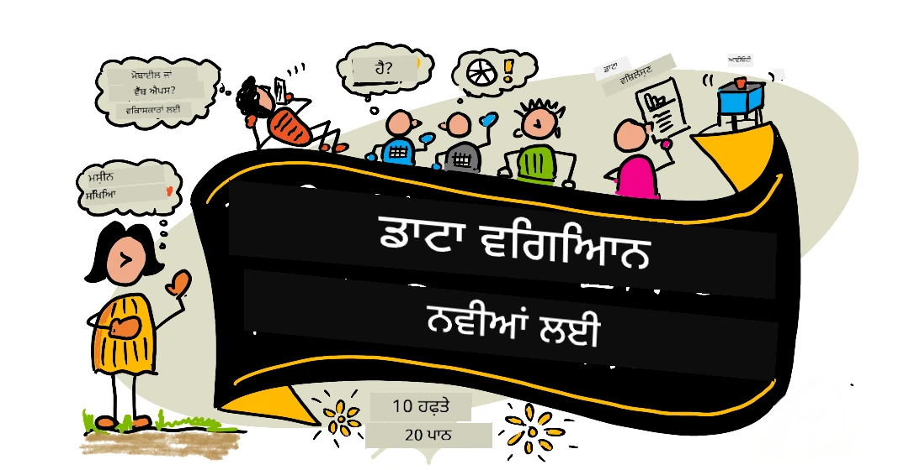
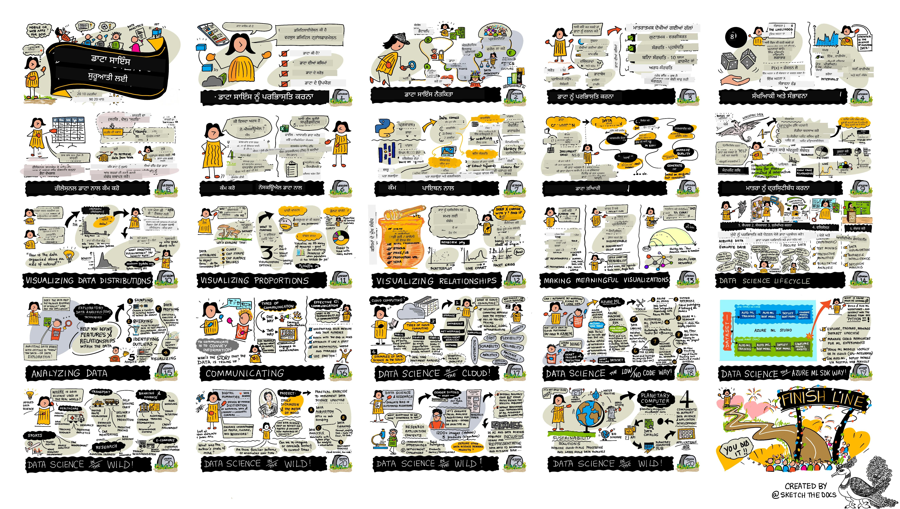

# ਨਵਿਆਂ ਲਈ ਡਾਟਾ ਸਾਇੰਸ - ਇੱਕ ਕਰੀਕੁਲਮ

[](https://github.com/codespaces/new?hide_repo_select=true&ref=main&repo=344191198)

[](https://github.com/microsoft/Data-Science-For-Beginners/blob/master/LICENSE)
[](https://GitHub.com/microsoft/Data-Science-For-Beginners/graphs/contributors/)
[](https://GitHub.com/microsoft/Data-Science-For-Beginners/issues/)
[](https://GitHub.com/microsoft/Data-Science-For-Beginners/pulls/)
[](http://makeapullrequest.com)

[](https://GitHub.com/microsoft/Data-Science-For-Beginners/watchers/)
[](https://GitHub.com/microsoft/Data-Science-For-Beginners/network/)
[](https://GitHub.com/microsoft/Data-Science-For-Beginners/stargazers/)


[](https://discord.gg/nTYy5BXMWG)

[](https://aka.ms/foundry/forum)

ਮਾਇਕਰੋਸੌਫਟ ਵਿਖੇ ਅਜੇਰ ਕਲਾਉਡ ਐਡਵੋਕੇਟਸ ਡਾਟਾ ਸਾਇੰਸ ਬਾਰੇ 10 ਹਫ਼ਤੇ, 20 ਸਬਕਾਂ ਦਾ ਕਰੀਕੁਲਮ ਪੇਸ਼ ਕਰਨ 'ਚ ਖੁਸ਼ ਹਨ। ਹਰ ਸਬਕ ਵਿੱਚ ਪ੍ਰੀ-ਸਬਕ ਅਤੇ ਪੋਸਟ-ਸਬਕ ਕੁਇਜ਼, ਸਬਕ ਪੂਰਾ ਕਰਨ ਲਈ ਲਿਖਤੀ ਦਿਸ਼ਾ-ਨਿਰਦੇਸ਼, ਇੱਕ ਹੱਲ ਅਤੇ ਇੱਕ ਅਸਾਈਨਮੈਂਟ ਸ਼ਾਮਲ ਹੈ। ਸਾਡੇ ਪ੍ਰੋਜੈਕਟ-ਆਧਾਰਿਤ ਸਿੱਖਣ ਦੇ ਤਰੀਕੇ ਨਾਲ ਤੁਹਾਨੂੰ ਇਹ ਸਿਖਣ ਦਾ ਮੌਕਾ ਮਿਲਦਾ ਹੈ ਕਿ ਜੋ ਸਿੱਖਿਆ ਗਈ ਹੈ ਉਹ ਲੰਬੇ ਸਮੇਂ ਤੱਕ ਯਾਦ ਰਹੇ।

**ਸਾਡੇ ਲੇਖਕਾਂ ਨੂੰ ਦਿਲੋਂ ਧੰਨਵਾਦ:** [Jasmine Greenaway](https://www.twitter.com/paladique), [Dmitry Soshnikov](http://soshnikov.com), [Nitya Narasimhan](https://twitter.com/nitya), [Jalen McGee](https://twitter.com/JalenMcG), [Jen Looper](https://twitter.com/jenlooper), [Maud Levy](https://twitter.com/maudstweets), [Tiffany Souterre](https://twitter.com/TiffanySouterre), [Christopher Harrison](https://www.twitter.com/geektrainer).

**🙏 ਖਾਸ ਧੰਨਵਾਦ 🙏 ਸਾਡੇ [Microsoft Student Ambassador](https://studentambassadors.microsoft.com/) ਲੇਖਕਾਂ, ਸਮੀਖਿਆਕਾਂ ਅਤੇ ਸਮੱਗਰੀ ਯੋਗਦਾਨਦਾਤਾਵਾਂ ਨੂੰ,** ਖਾਸ ਤੌਰ 'ਤੇ ਆਰਯਨ ਅਰੋੜਾ, [ਅਦਿਤਯ ਗਰਗ](https://github.com/AdityaGarg00), [ਅਲੋਂਦਰਾ ਸਾਂਚੇਜ਼](https://www.linkedin.com/in/alondra-sanchez-molina/), [ਅੰਕੀਤਾ ਸਿੰਘ](https://www.linkedin.com/in/ankitasingh007), [ਅਨੁਪਮ ਮਿਸ਼ਰਾ](https://www.linkedin.com/in/anupam--mishra/), [ਅਰਪਿਤਾ ਦਾਸ](https://www.linkedin.com/in/arpitadas01/), ਛੈਲਬਿਹਾਰੀ ਦੁਬੇ, [ਦਿਬਰੀ ਨਸੋਫੋਰ](https://www.linkedin.com/in/dibrinsofor), [ਦਿਸ਼ਿਤਾ ਭਾਸ਼ੀਨ](https://www.linkedin.com/in/dishita-bhasin-7065281bb), [ਮਾਜ਼ਦ ਸਾਫੀ](https://www.linkedin.com/in/majd-s/), [ਮੈਕਸ ਬਲਮ](https://www.linkedin.com/in/max-blum-6036a1186/), [ਮਿਗੁਏਲ ਕੋਰੇਆ](https://www.linkedin.com/in/miguelmque/), [ਮੋਹੰਮਦ ਇਫਤেখਰ (ਇਫਤੂ) ਇਬਨੇ ਜਲਾਲ](https://twitter.com/iftu119), [ਨਾਵਰੀਨ ਤਬਾਸ਼ੁਮ](https://www.linkedin.com/in/nawrin-tabassum), [ਰੇਮੰਡ ਵਾਂਗਸਾ ਪੁਤਰਾ](https://www.linkedin.com/in/raymond-wp/), [ਰੋਹਿਤ ਯਾਦਵ](https://www.linkedin.com/in/rty2423), ਸਮ੍ਰਿਧੀ ਸ਼ਰਮਾ, [ਸਾਨਿਆ ਸਿੰਹਾ](https://www.linkedin.com/mwlite/in/sanya-sinha-13aab1200),
[ਸ਼ੀਨਾ ਨਾਰੂਲਾ](https://www.linkedin.com/in/sheena-narua-n/), [ਤਉਕੀਰ ਅਹਿਮਦ](https://www.linkedin.com/in/tauqeerahmad5201/), ਯੋਗਿੰਦਰਸਿੰਘ ਪਾਵਰ , [ਵਿਦੁਸ਼ੀ ਗੁਪਤਾ](https://www.linkedin.com/in/vidushi-gupta07/), [ਜਸਲੀਨ ਸੋਂਧੀ](https://www.linkedin.com/in/jasleen-sondhi/)

||
|:---:|
| ਨਵਿਆਂ ਲਈ ਡਾਟਾ ਸਾਇੰਸ - _ਸਕੈਚਨੋਟ ਦੁਆਰਾ [@nitya](https://twitter.com/nitya)_ |

### 🌐 ਬਹੁ-ਭਾਸ਼ਾਈ ਸਹਾਇਤਾ

#### GitHub ਐਕਸ਼ਨ ਰਾਹੀਂ ਸਹਾਇਤਾ ਪ੍ਰਾਪਤ (ਆਟੋਮੇਟਿਕ ਅਤੇ ਹਮੇਸ਼ਾ ਅਪ-ਟੂ-ਡੇਟ)

<!-- CO-OP TRANSLATOR LANGUAGES TABLE START -->
[Arabic](../ar/README.md) | [Bengali](../bn/README.md) | [Bulgarian](../bg/README.md) | [Burmese (Myanmar)](../my/README.md) | [Chinese (Simplified)](../zh-CN/README.md) | [Chinese (Traditional, Hong Kong)](../zh-HK/README.md) | [Chinese (Traditional, Macau)](../zh-MO/README.md) | [Chinese (Traditional, Taiwan)](../zh-TW/README.md) | [Croatian](../hr/README.md) | [Czech](../cs/README.md) | [Danish](../da/README.md) | [Dutch](../nl/README.md) | [Estonian](../et/README.md) | [Finnish](../fi/README.md) | [French](../fr/README.md) | [German](../de/README.md) | [Greek](../el/README.md) | [Hebrew](../he/README.md) | [Hindi](../hi/README.md) | [Hungarian](../hu/README.md) | [Indonesian](../id/README.md) | [Italian](../it/README.md) | [Japanese](../ja/README.md) | [Kannada](../kn/README.md) | [Khmer](../km/README.md) | [Korean](../ko/README.md) | [Lithuanian](../lt/README.md) | [Malay](../ms/README.md) | [Malayalam](../ml/README.md) | [Marathi](../mr/README.md) | [Nepali](../ne/README.md) | [Nigerian Pidgin](../pcm/README.md) | [Norwegian](../no/README.md) | [Persian (Farsi)](../fa/README.md) | [Polish](../pl/README.md) | [Portuguese (Brazil)](../pt-BR/README.md) | [Portuguese (Portugal)](../pt-PT/README.md) | [Punjabi (Gurmukhi)](./README.md) | [Romanian](../ro/README.md) | [Russian](../ru/README.md) | [Serbian (Cyrillic)](../sr/README.md) | [Slovak](../sk/README.md) | [Slovenian](../sl/README.md) | [Spanish](../es/README.md) | [Swahili](../sw/README.md) | [Swedish](../sv/README.md) | [Tagalog (Filipino)](../tl/README.md) | [Tamil](../ta/README.md) | [Telugu](../te/README.md) | [Thai](../th/README.md) | [Turkish](../tr/README.md) | [Ukrainian](../uk/README.md) | [Urdu](../ur/README.md) | [Vietnamese](../vi/README.md)

> **ਲੋਕਲੀ ਕਲੋਨ ਕਰਨਾ ਪਸੰਦ ਕਰਦੇ ਹੋ?**
>
> ਇਹ ਰਿਪੋਜ਼ਟਰੀ 50+ ਭਾਸ਼ਾਈ ਅਨੁਵਾਦ ਸ਼ਾਮਲ ਕਰਦੀ ਹੈ, ਜਿਸ ਨਾਲ ਡਾਊਨਲੋਡ ਦਾ ਆਕਾਰ ਕਾਫ਼ੀ ਵੱਧ ਜਾਂਦਾ ਹੈ। ਬਗੈਰ ਅਨੁਵਾਦਾਂ ਦੇ ਕਲੋਨ ਕਰਨ ਲਈ, sparse checkout ਵਰਤੋ:
>
> **Bash / macOS / Linux:**
> ```bash
> git clone --filter=blob:none --sparse https://github.com/microsoft/Data-Science-For-Beginners.git
> cd Data-Science-For-Beginners
> git sparse-checkout set --no-cone '/*' '!translations' '!translated_images'
> ```
>
> **CMD (Windows):**
> ```cmd
> git clone --filter=blob:none --sparse https://github.com/microsoft/Data-Science-For-Beginners.git
> cd Data-Science-For-Beginners
> git sparse-checkout set --no-cone "/*" "!translations" "!translated_images"
> ```
>
> ਇਸ ਨਾਲ ਤੁਹਾਨੂੰ ਕੋਰਸ ਪੂਰਾ ਕਰਨ ਲਈ ਜ਼ਰੂਰੀ ਸਭ ਕੁਝ ਤੇਜ਼ ਡਾਊਨਲੋਡ ਮਿਲੇਗਾ।
<!-- CO-OP TRANSLATOR LANGUAGES TABLE END -->

**ਜੇ ਤੁਸੀਂ ਵਾਧੂ ਅਨੁਵਾਦ ਭਾਸ਼ਾਵਾਂ ਦੀ ਸਹਾਇਤਾ ਚਾਹੁੰਦੇ ਹੋ ਤਾਂ ਉਹ ਇੱਥੇ ਦਿੱਤੀਆਂ ਗਈਆਂ ਹਨ [ਇੱਥੇ](https://github.com/Azure/co-op-translator/blob/main/getting_started/supported-languages.md)**

#### ਸਾਡੀ ਕਮਿਊਨਿਟੀ ਵਿੱਚ ਸ਼ਾਮਲ ਹੋਵੋ 
[](https://discord.gg/nTYy5BXMWG)

ਸਾਨੂੰ ਇੱਕ ਡਿਸਕੋਰਡ ਲਰਨ ਵਿਥ ਏਆਈ ਸੀਰੀਜ਼ ਚੱਲ ਰਹੀ ਹੈ, ਵਧੇਰੇ ਜਾਣਕਾਰੀ ਲਈ ਅਤੇ ਸਾਡੇ ਨਾਲ ਸ਼ਾਮਲ ਹੋਵੋ [Learn with AI Series](https://aka.ms/learnwithai/discord) 18 ਤੋਂ 30 ਸਤੰਬਰ, 2025 ਤੱਕ। ਤੁਸੀਂ ਡਾਟਾ ਸਾਇੰਸ ਲਈ GitHub ਕੋਪਾਈਲਟ ਤੋਂ ਵਰਤੋਂ ਦੇ ਟਿਪ ਅਤੇ ਚਾਲਾਂ ਮਿਲਣਗੀਆਂ।


# ਕੀ ਤੁਸੀਂ ਵਿਦਿਆਰਥੀ ਹੋ?

ਹੇਠ ਲਿਖੇ ਸਰੋਤਾਂ ਨਾਲ ਸ਼ੁਰੂ ਕਰੋ:

- [ਵਿਦਿਆਰਥੀ ਹੱਬ ਪੇਜ](https://docs.microsoft.com/en-gb/learn/student-hub?WT.mc_id=academic-77958-bethanycheum) ਇਸ ਪੇਜ 'ਤੇ ਤੁਹਾਨੂੰ ਬਿਗਿਨਰ ਸਰੋਤ, ਵਿਦਿਆਰਥੀ ਪੈਕ ਅਤੇ ਮੁਫ਼ਤ ਸਰਟੀਫਿਕੇਟ ਵਾਊਚਰ ਹਾਸਿਲ ਕਰਨ ਦੇ ਤਰੀਕੇ ਮਿਲਣਗੇ। ਇਹ ਇੱਕ ਪੇਜ ਹੈ ਜਿਸ ਨੂੰ ਤੁਸੀਂ ਬੁੱਕਮਾਰਕ ਕਰਨਾ ਚਾਹੋਗੇ ਅਤੇ ਸਮੇਂ ਸਮੇਂ 'ਤੇ ਦੇਖਦੇ ਰਹੋਗੇ ਕਿਉਂਕਿ ਅਸੀਂ ਹਰ ਮਹੀਨੇ ਸਮੱਗਰੀ ਬਦਲਦੇ ਹਾਂ।
- [ਮਾਇਕਰੋਸੌਫਟ ਲਰਨ ਵਿਦਿਆਰਥੀ ਐਂਬੈਸਡਰ](https://studentambassadors.microsoft.com?WT.mc_id=academic-77958-bethanycheum) ਵਿਦਿਆਰਥੀ ਐਂਬੈਸਡਰਾਂ ਦੀ ਗਲੋਬਲ ਕਮਿਊਨਿਟੀ ਵਿੱਚ ਸ਼ਾਮਲ ਹੋਵੋ, ਇਹ ਤੁਹਾਡਾ ਮਾਇਕਰੋਸੌਫਟ ਵਿੱਚ ਜਾਣ ਦਾ ਰਾਸ্তা ਹੋ ਸਕਦਾ ਹੈ।

# ਸ਼ੁਰੂਆਤ

## 📚 ਡੌਕਯੂਮੈਂਟੇਸ਼ਨ

- **[ਇੰਸਟਾਲੇਸ਼ਨ ਗਾਈਡ](INSTALLATION.md)** - ਨਵਾਂ ਸੈੱਟਅੱਪ ਲਈ ਕਦਮ-ਦਰ-ਕਦਮ ਦਿਸ਼ਾ-ਨਿਰਦੇਸ਼
- **[ਉਪਯੋਗ ਗਾਈਡ](USAGE.md)** - ਉਦਾਹਰਣਾਂ ਅਤੇ ਸਧਾਰਣ ਵਰਕਫਲੋਜ਼
- **[ਟ੍ਰਬਲਸ਼ੂਟਿੰਗ](TROUBLESHOOTING.md)** - ਆਮ ਸਮੱਸਿਆਵਾਂ ਦੇ ਹੱਲ
- **[ਯੋਗਦਾਨ ਗਾਈਡ](CONTRIBUTING.md)** - ਇਸ ਪ੍ਰੋਜੈਕਟ ਵਿੱਚ ਯੋਗਦਾਨ ਦੇਣ ਦਾ ਤਰੀਕਾ
- **[ਅਧਿਆਪਕਾਂ ਲਈ](for-teachers.md)** - ਪਾਠਦਾਨ ਦਿਸ਼ਾ-ਨਿਰਦੇਸ਼ ਅਤੇ ਕਲਾਸਰੂਮ ਸਰੋਤ

## 👨‍🎓 ਵਿਦਿਆਰਥੀਆਂ ਲਈ
> **ਪੂਰੇ ਨਵੀਂ ਸਿੱਖਣ ਵਾਲੇ:** ਡਾਟਾ ਸਾਇੰਸ ਦੇ ਨਵੇਂ ਕਿਵੇਂ ਹਨ? ਸਾਡੇ [ਬਿਗਿਨਰ-ਮਿਤ੍ਰ ਉਦਾਹਰਣਾਂ](examples/README.md) ਨਾਲ ਸ਼ੁਰੂ ਕਰੋ! ਇਹ ਸادہ, ਵਧੀਆ ਟਿੱਪਣੀਆਂ ਵਾਲੇ ਉਦਾਹਰਣ ਤੁਹਾਨੂੰ ਬੁਨਿਆਦੀ ਗੱਲਾਂ ਸਮਝਣ ਵਿੱਚ ਮਦਦ ਕਰਨਗੇ ਪਹਿਲਾਂ ਕਿ ਤੁਸੀਂ ਪੂਰੇ ਕਰੀਕੁਲਮ ਵਿੱਚ ਡੁੱਬ ਜਾਓ।
> **[ਵਿਦਿਆਰਥੀ](https://aka.ms/student-page)**: ਆਪਣੇ ਆਪ ਲਈ ਇਹ ਕਰੀਕੁਲਮ ਵਰਤਣ ਲਈ, ਪੂਰਾ ਰੇਪੋ ਫੋਰਕ ਕਰੋ ਅਤੇ ਆਪਣੇ ਆਪ ਸਕੂਲੀ ਕਸਰਤਾਂ ਪੂਰੀਆਂ ਕਰੋ, ਪ੍ਰੀ-ਲੈਕਚਰ ਕੁਇਜ਼ ਤੋਂ ਸ਼ੁਰੂ ਕਰਕੇ। ਫਿਰ ਲੈਕਚਰ ਪੜ੍ਹੋ ਅਤੇ ਬਾਕੀ ਸਰਗਰਮੀਆਂ ਪੂਰੀਆਂ ਕਰੋ। ਹੱਲ ਕੋਡ ਦੀ ਨਕਲ ਕਰਨ ਦੀ ਥਾਂ ਪਾਠਾਂ ਨੂੰ ਸਮਝ ਕੇ ਪਰੋਜੈਕਟ ਬਣਾਓ; ਹਾਲਾਂਕਿ, ਉਹ ਕੋਡ /solutions ਫੋਲਡਰਾਂ ਵਿੱਚ ਹਰ ਪ੍ਰੋਜੈਕਟ-ਕੇਂਦਰਿਤ ਪਾਠ ਵਿੱਚ ਮੌਜੂਦ ਹੈ। ਇੱਕ ਹੋਰ ਵਿਚਾਰ ਦੋਸਤਾਂ ਨਾਲ ਸਟਡੀ ਗਰੂਪ ਬਣਾਉਣਾ ਅਤੇ ਇਕੱਠੇ ਸਮੱਗਰੀ ਤੋਂ ਗੁਜ਼ਰਨਾ ਹੈ। ਅੱਗੇ ਪੜ੍ਹਾਈ ਲਈ, ਅਸੀਂ [Microsoft Learn](https://docs.microsoft.com/en-us/users/jenlooper-2911/collections/qprpajyoy3x0g7?WT.mc_id=academic-77958-bethanycheum) ਦੀ ਸਿਫਾਰਿਸ਼ ਕਰਦੇ ਹਾਂ।

**ਤੁਰੰਤ ਸ਼ੁਰੂਆਤ:**
1. ਆਪਣਾ ਮਾਹੌਲ ਸੈੱਟ ਕਰਨ ਲਈ [ਇੰਸਟਾਲੇਸ਼ਨ ਗਾਈਡ](INSTALLATION.md) ਵੇਖੋ
2. ਕਰੀਕੁਲਮ ਨਾਲ ਕੰਮ ਕਰਨ ਲਈ [ਉਪਯੋਗ ਗਾਈਡ](USAGE.md) ਸਮੀਖਿਆ ਕਰੋ
3. ਪਾਠ 1 ਨਾਲ ਸ਼ੁਰੂ ਕਰੋ ਅਤੇ ਲੜੀਵਾਰ ਤੌਰ ਤੇ ਅੱਗੇ ਵੱਧੋ
4. ਸਹਾਇਤਾ ਲਈ ਸਾਡੇ [ਡਿਸਕੋਰਡ ਕਮਿਊਨਿਟੀ](https://aka.ms/ds4beginners/discord) ਵਿੱਚ ਸ਼ਾਮਲ ਹੋਵੋ

## 👩‍🏫 ਅਧਿਆਪਕਾਂ ਲਈ
> **ਅਧਿਆਪਕਾਂ**: ਅਸੀਂ ਇਸ ਕੋਰਸਕ੍ਰਮ ਨੂੰ ਵਰਤਣ ਲਈ ਕੁਝ ਸੁਝਾਅ [ਸ਼ਾਮਲ ਕੀਤੇ ਹਨ](for-teachers.md)। ਅਸੀਂ ਤੁਹਾਡੇ ਫੀਡਬੈਕ ਨੂੰ [ਸਾਡੇ ਚਰਚਾ ਫੋਰਮ ਵਿੱਚ](https://github.com/microsoft/Data-Science-For-Beginners/discussions) ਪ੍ਰਾਪਤ ਕਰਨਾ ਪਸੰਦ ਕਰਾਂਗੇ!

## ਟੀਮ ਨਾਲ ਮਿਲੋ

[](https://youtu.be/8mzavjQSMM4 "ਪ੍ਰਮੋ ਵੀਡੀਓ")

**ਗਿਫ ਬਣਾ ਚੁੱਕੇ** [ਮੋਹਿਤ ਜੈਸਲ](https://www.linkedin.com/in/mohitjaisal)

> 🎥 ਉੱਪਰ ਦਿੱਤੀ ਤਸਵੀਰ 'ਤੇ ਕਲਿੱਕ ਕਰੋ ਪ੍ਰੋਜੈਕਟ ਅਤੇ ਇਸਨੂੰ ਬਣਾਉਣ ਵਾਲੇ ਲੋਕਾਂ ਬਾਰੇ ਵੀਡੀਓ ਲਈ!

## ਅਧਿਆਪਕੀ ਨੀਤੀਆਂ

ਅਸੀਂ ਇਹ ਕੋਰਸਕ੍ਰਮ ਬਣਾਉਂਦੇ ਸਮੇਂ ਦੋ ਅਧਿਆਪਕੀ ਸਿਧਾਂਤ ਚੁਣੇ ਹਨ: ਇਹ ਯਕੀਨੀ ਬਣਾਉਣਾ ਕਿ ਇਹ ਪ੍ਰੋਜੈਕਟ-ਅਧਾਰਿਤ ਹੈ ਅਤੇ ਇਸ ਵਿੱਚ ਬਾਰੰਬਾਰ ਕੁਇਜ਼ ਸ਼ਾਮਲ ਹਨ। ਇਸ ਸੀਰੀਜ਼ ਦੇ ਅੰਤ ਤੱਕ, ਵਿਦਿਆਰਥੀ ਡਾਟਾ ਸਾਇੰਸ ਦੇ ਮੂਲ ਸਿਧਾਂਤ ਸਿੱਖ ਲੈਣਗੇ, ਜਿਸ ਵਿੱਚ ਨੈਤਿਕ ਸਿਧਾਂਤ, ਡਾਟਾ ਤਿਆਰੀ, ਡਾਟਾ ਨਾਲ ਕੰਮ ਕਰਨ ਦੇ ਵੱਖ-ਵੱਖ ਤਰੀਕੇ, ਡਾਟਾ ਵਿਜ਼ੂਲਾਈਜ਼ੇਸ਼ਨ, ਡਾਟਾ ਵਿਸ਼ਲੇਸ਼ਣ, ਡਾਟਾ ਸਾਇੰਸ ਦੇ ਅਸਲ ਵਿਸ਼ਵ ਦਿਉਤਾਂ ਅਤੇ ਹੋਰ ਸ਼ਾਮਲ ਹਨ।

ਇਸ ਤੋਂ ਇਲਾਵਾ, ਕਲਾਸ ਤੋਂ ਪਹਿਲਾਂ ਇੱਕ ਘੱਟ-ਦਬਾਅ ਵਾਲਾ ਕੁਇਜ਼ ਵਿਦਿਆਰਥੀ ਦੇ ਵਿਸ਼ੇ ਨੂੰ ਸਿੱਖਣ ਦੇ ਉਦੇਸ਼ ਨੂੰ ਸੈਟ ਕਰਦਾ ਹੈ, ਜਦਕਿ ਕਲਾਸ ਤੋਂ ਬਾਅਦ ਦੂਜਾ ਕੁਇਜ਼ ਹੋਰ ਰੋਕ ਰੱਖਣ ਨੂੰ ਯਕੀਨੀ ਬਣਾਉਂਦਾ ਹੈ। ਇਹ ਕੋਰਸਕ੍ਰਮ ਲਚਕੀਲਾ ਅਤੇ ਰੁਚਿਕਰ ਬਣਾਇਆ ਗਿਆ ਹੈ ਅਤੇ ਇਸ ਨੂੰ ਪੂਰੇ ਤੌਰ 'ਤੇ ਜਾਂ ਹਿੱਸੇ ਵੱਜੋਂ ਲਿਆ ਜਾ ਸਕਦਾ ਹੈ। ਪ੍ਰੋਜੈਕਟ ਛੋਟੇ ਸ਼ੁਰੂ ਹੁੰਦੇ ਹਨ ਅਤੇ 10 ਹਫ਼ਤਿਆਂ ਦੇ ਚੱਕਰ ਦੇ ਅੰਤ ਤੱਕ ਧੀਰੇ-ਧੀਰੇ ਗੁੰਝਲਦਾਰ ਹੁੰਦੇ ਜਾਂਦੇ ਹਨ।

> ਸਾਡੇ [ਆਚਰਣ ਕੋਡ](CODE_OF_CONDUCT.md), [ਯੋਗਦਾਨ](CONTRIBUTING.md), [ਅਨੁਵਾਦ](TRANSLATIONS.md) ਦਿਸ਼ਾ-ਨਿਰਦੇਸ਼ ਵੇਖੋ। ਅਸੀਂ ਤੁਹਾਡੇ ਰਚਨਾਤਮਕ ਫੀਡਬੈਕ ਦਾ ਸਵਾਗਤ ਕਰਦੇ ਹਾਂ!

## ਹਰ ਪਾਠ ਵਿੱਚ ਸ਼ਾਮਲ ਹੈ:

- ਵਿਕਲਪਿਕ ਸਕੈਚਨੋਟ  
- ਵਿਕਲਪਿਕ ਸਹਾਇਕ ਵੀਡੀਓ  
- ਪਾਠ ਤੋਂ ਪਹਿਲਾਂ ਦੀ ਤਿਆਰੀ ਲਈ ਕੁਇਜ਼  
- ਲਿਖਤ ਪਾਠ  
- ਪ੍ਰੋਜੈਕਟ-ਅਧਾਰਿਤ ਪਾਠਾਂ ਲਈ, ਪ੍ਰੋਜੈਕਟ ਬਣਾਉਣ ਲਈ ਕਦਮ-ਦਰ-ਕਦਮ ਗਾਈਡਾਂ  
- ਗਿਆਨ ਦੀ ਜਾਂਚ  
- ਇੱਕ ਚੈਲੀੰਜ  
- ਸਹਾਇਕ ਪਾਠ  
- ਅਸਾਈਨਮੈਂਟ  
- [ਪਾਠ ਬਾਅਦ ਦਾ ਕੁਇਜ਼](https://ff-quizzes.netlify.app/en/)

> **ਕੁਇਜ਼ਾਂ ਬਾਰੇ ਇੱਕ ਨੋਟ**: ਸਾਰੇ ਕੁਇਜ਼ Quiz-App ਫੋਲਡਰ ਵਿੱਚ ਹਨ, ਕੁੱਲ 40 ਕੁਇਜ਼ ਹਰ ਇੱਕ ਵਿੱਚ ਤਿੰਨ ਸੋਆਲਾਂ ਨਾਲ। ਇਹ ਪਾਠਾਂ ਦੇ ਅੰਦਰੋਂ ਲਿੰਕ ਕੀਤੇ ਗਏ ਹਨ, ਪਰ ਕੁਇਜ਼ ਐਪ ਨੂੰ ਸਥਾਨਕ ਤੌਰ 'ਤੇ ਚਲਾਇਆ ਜਾਂ ਸਕਦਾ ਹੈ ਜਾਂ Azure 'ਤੇ ਡਿਪਲੌਏ ਕੀਤਾ ਜਾ ਸਕਦਾ ਹੈ; `quiz-app` ਫੋਲਡਰ ਵਿੱਚ ਦਿੱਤੇ ਅਦੇਸ਼ਾਂ ਨੂੰ ਫਾਲੋ ਕਰੋ। ਇਹ ਹੌਲੀ-ਹੌਲੀ ਲੋਕਲਾਈਜ਼ ਹੋ ਰਹੇ ਹਨ।

## 🎓 ਸ਼ੁਰੂਆਤੀ-ਮਿੱਤਰ ਉਦਾਹਰਨਾਂ

**ਡਾਟਾ ਸਾਇੰਸ ਵਿੱਚ ਨਵਾਂ?** ਅਸੀਂ ਇੱਕ ਖਾਸ [ਉਦਾਹਰਨਾਂ ਡਾਇਰੈਕਟਰੀ](examples/README.md) ਬਣਾਈ ਹੈ ਜਿਸ ਵਿੱਚ ਸਧਾਰਣ, ਚੰਗੀ ਤਰ੍ਹਾਂ ਟਿੱਪਣੀ ਕੀਤੀ ਕੋਡ ਹੈ ਜੋ ਤੁਹਾਨੂੰ ਸ਼ੁਰੂਆਤ ਕਰਨ ਵਿੱਚ ਮਦਦ ਕਰੇਗਾ:

- 🌟 **ਹੈਲੋ ਵਰਲਡ** - ਤੁਹਾਡਾ ਪਹਿਲਾ ਡਾਟਾ ਸਾਇੰਸ ਪ੍ਰੋਗਰਾਮ  
- 📂 **ਡਾਟਾ ਲੋਡ ਕਰਨਾ** - ਡੇਟਾਸੈੱਟਾਂ ਨੂੰ ਪੜ੍ਹਨਾ ਅਤੇ ਖੰਗਾਲਣਾ ਸਿੱਖੋ  
- 📊 **ਸਧਾਰਣ ਵਿਸ਼ਲੇਸ਼ਣ** - ਅੰਕੜੇ ਗਿਣੋ ਤੇ ਨਮੂਨੇ ਲੱਭੋ  
- 📈 **ਮੂਲ ਵਿਜ਼ੂਲਾਈਜ਼ੇਸ਼ਨ** - ਚਾਰਟ ਅਤੇ ਗ੍ਰਾਫ ਬਣਾਓ  
- 🔬 **ਅਸਲੀ ਦੁਨੀਆ ਦਾ ਪ੍ਰੋਜੈਕਟ** - ਸ਼ੁਰੂ ਤੋਂ ਅੰਤ ਤੱਕ ਪੂਰਾ ਵਰਕਫ਼ਲੋ

ਹਰ ਉਦਾਹਰਨ ਵਿੱਚ ਹਰ ਕਦਮ ਨੂੰ ਸਮਝਾਉਣ ਵਾਲੀਆਂ ਵਿਸਥਾਰਤ ਟਿੱਪਣੀਆਂ ਹਨ, ਜੋ ਨਵੀਨਤਮ ਸ਼ੁਰੂਆਤੀਆਂ ਲਈ ਬਿਲਕੁਲ ਸਹੀ ਹਨ!

👉 **[ਉਦਾਹਰਨਾਂ ਨਾਲ ਸ਼ੁਰੂ ਕਰੋ](examples/README.md)** 👈

## ਪਾਠ


||
|:---:|
| ਡਾਟਾ ਸਾਇੰਸ ਫਾਰ ਬਿਗਿਨਰਜ਼: ਰੋਡਮੇਪ - _ਸਕੈਚਨੋਟ ਬਾਇ [@nitya](https://twitter.com/nitya)_ |


| ਪਾਠ ਦੀ ਸੰਖਿਆ | ਵਿਸ਼ਾ | ਪਾਠ ਸਮੂਹ | ਸਿੱਖਣ ਦੇ ਲਕੜੇ | ਲਿੰਕਡ ਪਾਠ | ਲੇਖਕ |
| :-----------: | :----------------------------------------: | :--------------------------------------------------: | :-----------------------------------------------------------------------------------------------------------------------------------------------------------------------: | :---------------------------------------------------------------------: | :----: |
| 01 | ਡਾਟਾ ਸਾਇੰਸ ਦੀ ਪਰਿਭਾਸ਼ਾ | [ਪਰਿਚਯ](1-Introduction/README.md) | ਡਾਟਾ ਸਾਇੰਸ ਦੇ ਸਿਧਾਂਤ ਆਸੂਲ ਅਤੇ ਇਸਦਾ ਕ੍ਰਿਤ੍ਰਿਮ ਬੁੱਧੀ, ਮਸ਼ੀਨ ਲਰਨਿੰਗ ਅਤੇ ਵੱਡੇ ਡਾਟਾ ਨਾਲ ਸਬੰਧ ਜਾਣੋ | [ਪਾਠ](1-Introduction/01-defining-data-science/README.md) [ਵੀਡੀਓ](https://youtu.be/beZ7Mb_oz9I) | [ਦਿਮਿਤਰੀ](http://soshnikov.com) |
| 02 | ਡਾਟਾ ਸਾਇੰਸ ਈਥਿਕਸ | [ਪਰਿਚਯ](1-Introduction/README.md) | ਡਾਟਾ ਏਥਿਕਸ ਦੇ ਸਿਧਾਂਤ, ਚੁਣੌਤੀਆਂ ਅਤੇ ਢਾਂਚੇ | [ਪਾਠ](1-Introduction/02-ethics/README.md) | [ਨਿਤਿਆ](https://twitter.com/nitya) |
| 03 | ਡਾਟਾ ਦੀ ਪਰਿਭਾਸ਼ਾ | [ਪਰਿਚਯ](1-Introduction/README.md) | ਡਾਟਾ ਦੀ ਵਰਗੀਕਰਨ ਅਤੇ ਆਮ ਸਰੋਤ | [ਪਾਠ](1-Introduction/03-defining-data/README.md) | [ਜੈਸਮੀਨ](https://www.twitter.com/paladique) |
| 04 | ਸਾਂਖਿਆਕੀ ਅਤੇ ਸੰਭਾਵਨਾ ਦਾ ਪਰਿਚਯ | [ਪਰਿਚਯ](1-Introduction/README.md) | ਡਾਟਾ ਨੂੰ ਸਮਝਣ ਲਈ ਸੰਭਾਵਨਾ ਅਤੇ ਸਾਂਖਿਆਕੀ ਦੀਆਂ ਗਣਿਤਕ ਤਕਨੀਕਾਂ | [ਪਾਠ](1-Introduction/04-stats-and-probability/README.md) [ਵੀਡੀਓ](https://youtu.be/Z5Zy85g4Yjw) | [ਦਿਮਿਤਰੀ](http://soshnikov.com) |
| 05 | ਰਿਲੇਸ਼ਨਲ ਡਾਟਾ ਨਾਲ ਕੰਮ ਕਰਨਾ | [ਡਾਟਾ ਨਾਲ ਕੰਮ](2-Working-With-Data/README.md) | ਰਿਲੇਸ਼ਨਲ ਡਾਟਾ ਅਤੇ ਇਸਨੂੰ ਖੰਗਾਲਣ ਅਤੇ ਵਿਸ਼ਲੇਸ਼ਣ ਕਰਨ ਦੇ ਮੂਲ ਤਤਵਾਂ ਨੂੰ ਸਮਝੋ ਨਾਲ Structured Query Language, ਜਾਂ SQL (ਜਿਸਨੂੰ "ਸੀ-ਕੈੱਲ" ਉਚਾਰਿਆ ਜਾਂਦਾ ਹੈ) | [ਪਾਠ](2-Working-With-Data/05-relational-databases/README.md) | [ਕ੍ਰਿਸਟੋਫਰ](https://www.twitter.com/geektrainer) | | |
| 06 | ਨੋਐਸਕਿਊਐਲ ਡਾਟਾ ਨਾਲ ਕੰਮ ਕਰਨਾ | [ਡਾਟਾ ਨਾਲ ਕੰਮ](2-Working-With-Data/README.md) | ਗੈਰ-ਰਿਲੇਸ਼ਨਲ ਡਾਟਾ, ਇਸਦੇ ਕਈ ਕਿਸਮਾਂ ਅਤੇ ਡਾਕੂਮੈਂਟ ਡੇਟਾਬੇਸ ਖੰਗਾਲਣ ਅਤੇ ਵਿਸ਼ਲੇਸ਼ਣ ਦੇ ਮੂਲ ਤਤਵਾਂ ਦਾ ਪਰਿਚਯ | [ਪਾਠ](2-Working-With-Data/06-non-relational/README.md) | [ਜੈਸਮੀਨ](https://twitter.com/paladique) |
| 07 | ਪਾਇਥਨ ਨਾਲ ਕੰਮ ਕਰਨਾ | [ਡਾਟਾ ਨਾਲ ਕੰਮ](2-Working-With-Data/README.md) | ਪਾਇਥਨ ਦੀਆਂ ਬੁਨਿਆਦੀ ਵਰਤੋਂਵਾਂ ਜਿਵੇਂ Pandas ਵਰਗੀਆਂ ਲਾਇਬ੍ਰੇਰੀਆਂ ਨਾਲ ਡਾਟਾ ਖੰਗਾਲਣ ਲਈ। ਪਾਇਥਨ ਪ੍ਰੋਗ੍ਰਾਮਿੰਗ ਦੀ ਬੁਨਿਆਦੀ ਸਮਝ ਸਿਫ਼ਾਰਸ਼ੀ ਹੈ। | [ਪਾਠ](2-Working-With-Data/07-python/README.md) [ਵੀਡੀਓ](https://youtu.be/dZjWOGbsN4Y) | [ਦਿਮਿਤਰੀ](http://soshnikov.com) |
| 08 | ਡਾਟਾ ਤਿਆਰੀ | [ਡਾਟਾ ਨਾਲ ਕੰਮ](2-Working-With-Data/README.md) | ਡਾਟਾ ਦੀ ਸਫਾਈ ਅਤੇ ਬਦਲਾਅ ਦੀਆਂ ਤਕਨੀਕਾਂ ਜੋ ਗੁੰਮ, ਗਲਤ ਜਾਂ ਅਧੂਰੇ ਡਾਟਾ ਦੀਆਂ ਸਮੱਸਿਆਵਾਂ ਨੂੰ ਸੰਭਾਲਣ ਲਈ ਹਨ | [ਪਾਠ](2-Working-With-Data/08-data-preparation/README.md) | [ਜੈਸਮੀਨ](https://www.twitter.com/paladique) |
| 09 | ਮਾਤਰਾ ਦੀ ਵਿਜ਼ੂਲਾਈਜ਼ੇਸ਼ਨ | [ਡਾਟਾ ਵਿਜ਼ੂਲਾਈਜ਼ੇਸ਼ਨ](3-Data-Visualization/README.md) | ਮੈਟਪਲਾਟਲਿਬ ਦੀ ਵਰਤੋਂ ਕਰਕੇ ਪੰਛੀ ਡਾਟਾ ਨੂੰ ਵਿਜ਼ੂਲਾਈਜ਼ ਕਰਨਾ ਸਿੱਖੋ 🦆 | [ਪਾਠ](3-Data-Visualization/09-visualization-quantities/README.md) | [ਜੇਨ](https://twitter.com/jenlooper) |
| 10 | ਡਾਟਾ ਦੇ ਵੰਡੀਆਂ ਦੀ ਵਿਜ਼ੂਲਾਈਜ਼ੇਸ਼ਨ | [ਡਾਟਾ ਵਿਜ਼ੂਲਾਈਜ਼ੇਸ਼ਨ](3-Data-Visualization/README.md) | ਇੱਕ ਅੰਤਰਾਲ ਵਿੱਚ ਨਿਰੀਖਣ ਅਤੇ ਰੁਝਾਨਾਂ ਦੀ ਵਿਜ਼ੂਲਾਈਜ਼ੇਸ਼ਨ | [ਪਾਠ](3-Data-Visualization/10-visualization-distributions/README.md) | [ਜੇਨ](https://twitter.com/jenlooper) |
| 11 | ਅਨੁਪਾਤ ਦੀ ਵਿਜ਼ੂਲਾਈਜ਼ੇਸ਼ਨ | [ਡਾਟਾ ਵਿਜ਼ੂਲਾਈਜ਼ੇਸ਼ਨ](3-Data-Visualization/README.md) | ਅਲੱਗ-ਅਲੱਗ ਅਤੇ ਗਰੁੱਪ ਵਿੱਚ ਬੰਟੇ ਪ੍ਰਤੀਸ਼ਤਾਂ ਦੀ ਵਿਜ਼ੂਲਾਈਜ਼ੇਸ਼ਨ | [ਪਾਠ](3-Data-Visualization/11-visualization-proportions/README.md) | [ਜੇਨ](https://twitter.com/jenlooper) |
| 12 | ਸੰਬੰਧਾਂ ਦੀ ਵਿਜ਼ੂਲਾਈਜ਼ੇਸ਼ਨ | [ਡਾਟਾ ਵਿਜ਼ੂਲਾਈਜ਼ੇਸ਼ਨ](3-Data-Visualization/README.md) | ਡਾਟਾ ਅਤੇ ਇਸਦੇ ਵੈਰੀਏਬਲਾਂ ਦੇ ਸੈੱਟਾਂ ਵਿਚਕਾਰ ਜੁੜਾਅ ਅਤੇ ਸਬੰਧਾਂ ਦੀ ਵਿਜ਼ੂਲਾਈਜ਼ੇਸ਼ਨ | [ਪਾਠ](3-Data-Visualization/12-visualization-relationships/README.md) | [ਜੇਨ](https://twitter.com/jenlooper) |
| 13 | ਮੱਤਵਪੂਰਣ ਵਿਜ਼ੂਲਾਈਜ਼ੇਸ਼ਨ | [ਡਾਟਾ ਵਿਜ਼ੂਲਾਈਜ਼ੇਸ਼ਨ](3-Data-Visualization/README.md) | ਤੇਜ਼ ਸਮੱਸਿਆ ਨਿਵਾਰਣ ਅਤੇ ਜ਼ਾਹਿਰਾ ਲਈ ਵਿਜ਼ੂਲਾਈਜ਼ੇਸ਼ਨ ਬਣਾਉਣ ਲਈ ਤਕਨੀਕਾਂ ਅਤੇ ਮਾਰਗਦਰਸ਼ਨ | [ਪਾਠ](3-Data-Visualization/13-meaningful-visualizations/README.md) | [ਜੇਨ](https://twitter.com/jenlooper) |
| 14 | ਡਾਟਾ ਸਾਇੰਸ ਲਾਈਫਸਾਈਕਲ ਦਾ ਪਰਿਚਯ | [ਲਾਈਫਸਾਈਕਲ](4-Data-Science-Lifecycle/README.md) | ਡਾਟਾ ਸਾਇੰਸ ਦੇ ਲਾਈਫਸਾਈਕਲ ਦਾ ਪਰਿਚਯ ਅਤੇ ਇਸਦਾ ਪਹਿਲਾ ਕਦਮ ਡਾਟਾ ਹਾਸਲ ਅਤੇ ਨਿਕਾਲਣਾ | [ਪਾਠ](4-Data-Science-Lifecycle/14-Introduction/README.md) | [ਜੈਸਮੀਨ](https://twitter.com/paladique) |
| 15 | ਵਿਸ਼ਲੇਸ਼ਣ | [ਲਾਈਫਸਾਈਕਲ](4-Data-Science-Lifecycle/README.md) | ਡਾਟਾ ਸਾਇੰਸ ਲਾਈਫਸਾਈਕਲ ਵਿੱਚ ਇਹ ਕਦਮ ਡਾਟਾ ਵਿਸ਼ਲੇਸ਼ਣ ਦੀਆਂ ਤਕਨੀਕਾਂ 'ਤੇ ਧਿਆਨ ਕੇਂਦ੍ਰਿਤ ਕਰਦਾ ਹੈ | [ਪਾਠ](4-Data-Science-Lifecycle/15-analyzing/README.md) | [ਜੈਸਮੀਨ](https://twitter.com/paladique) | | |
| 16 | ਸੰਚਾਰ | [ਲਾਈਫਸਾਈਕਲ](4-Data-Science-Lifecycle/README.md) | ਡਾਟਾ ਸਾਇੰਸ ਲਾਈਫਸਾਈਕਲ ਦਾ ਇਹ ਭਾਗ ਡਾਟਾ ਤੋਂ ਨਿਸ਼ਕਰਸ਼ਾਂ ਨੂੰ ਇਸਤਰੀ ਸੰਵਿਗਿਆਨ ਨਾਲ ਪੇਸ਼ ਕਰਨਾ ਹੈ ਜੋ ਫੈਸਲਾ ਕਰਨ ਵਾਲਿਆਂ ਲਈ ਸਮਝਣਾ ਆਸਾਨ ਬਣਾਉਂਦਾ ਹੈ | [ਪਾਠ](4-Data-Science-Lifecycle/16-communication/README.md) | [ਜੇਲਨ](https://twitter.com/JalenMcG) | | |
| 17 | ਕਲਾਉਡ ਵਿੱਚ ਡਾਟਾ ਸਾਇੰਸ | [ਕਲਾਉਡ ਡਾਟਾ](5-Data-Science-In-Cloud/README.md) | ਇਹ ਸੀਰੀਜ਼ ਕਲਾਉਡ ਵਿੱਚ ਡਾਟਾ ਸਾਇੰਸ ਅਤੇ ਇਸਦੇ ਫਾਇਦਿਆਂ ਦੀ ਜਾਣਕਾਰੀ ਦਿੰਦੀ ਹੈ | [ਪਾਠ](5-Data-Science-In-Cloud/17-Introduction/README.md) | [ਟਿਫਨੀ](https://twitter.com/TiffanySouterre) ਅਤੇ [ਮੌਡ](https://twitter.com/maudstweets) |
| 18 | ਕਲਾਉਡ ਵਿੱਚ ਡਾਟਾ ਸਾਇੰਸ | [ਕਲਾਉਡ ਡਾਟਾ](5-Data-Science-In-Cloud/README.md) | Low Code ਟੂਲਾਂ ਨਾਲ ਮਾਡਲਾਂ ਦਾ ਪ੍ਰਸ਼ਿਕਸ਼ਣ | [ਪਾਠ](5-Data-Science-In-Cloud/18-Low-Code/README.md) | [ਟਿਫਨੀ](https://twitter.com/TiffanySouterre) ਅਤੇ [ਮੌਡ](https://twitter.com/maudstweets) |
| 19 | ਕਲਾਉਡ ਵਿੱਚ ਡਾਟਾ ਸਾਇੰਸ | [ਕਲਾਉਡ ਡਾਟਾ](5-Data-Science-In-Cloud/README.md) | Azure Machine Learning Studio ਨਾਲ ਮਾਡਲਾਂ ਨੂੰ ਡਿਪਲੌਏ ਕਰਨਾ | [ਪਾਠ](5-Data-Science-In-Cloud/19-Azure/README.md) | [ਟਿਫਨੀ](https://twitter.com/TiffanySouterre) ਅਤੇ [ਮੌਡ](https://twitter.com/maudstweets) |
| 20 | ਜੰਗਲੀ ਵਿੱਚ ਡਾਟਾ ਸਾਇੰਸ | [ਜੰਗਲੀ ਵਿੱਚ](6-Data-Science-In-Wild/README.md) | ਅਸਲੀ ਦੁਨੀਆ ਵਿੱਚ ਡਾਟਾ ਸਾਇੰਸ ਚਲਾਏ ਪ੍ਰੋਜੈਕਟ | [ਪਾਠ](6-Data-Science-In-Wild/20-Real-World-Examples/README.md) | [ਨਿਤਿਆ](https://twitter.com/nitya) |

## GitHub Codespaces

ਇਸ ਸੈਂਪਲ ਨੂੰ Codespace ਵਿੱਚ ਖੋਲ੍ਹਣ ਲਈ ਇਹ ਕਦਮਾਂ ਦਾ ਪਾਲਣ ਕਰੋ:  
1. Code ਡ੍ਰੌਪ-ਡਾਊਨ ਮੇਨੂ 'ਤੇ ਕਲਿੱਕ ਕਰੋ ਅਤੇ Open with Codespaces ਵਿਕਲਪ ਚੁਣੋ।  
2. ਪੈਨ ਦੇ ਹੇਠਾਂ + ਨਵਾਂ ਕੋਡਸਪੇਸ ਚੁਣੋ।  
ਹੋਰ ਜਾਣਕਾਰੀ ਲਈ, [GitHub ਡੌਕੀੂਮੇਨਟੇਸ਼ਨ](https://docs.github.com/en/codespaces/developing-in-codespaces/creating-a-codespace-for-a-repository#creating-a-codespace) ਚੈੱਕ ਕਰੋ।

## VSCode ਰਿਮੋਟ - ਕੰਟੇਨਰਸ  
ਆਪਣੀ ਸਥਾਨਕ ਮਸ਼ੀਨ ਅਤੇ VSCode ਦੀ ਵਰਤੋਂ ਕਰਕੇ ਇਸ ਰਿਪੋਜ਼ਿਟਰੀ ਨੂੰ ਕੰਟੇਨਰ ਵਿੱਚ ਖੋਲ੍ਹਣ ਲਈ VS Code Remote - Containers ਐਕਸਟੇਂਸ਼ਨ ਵਰਤੋਂ:

1. ਜੇ ਇਹ ਤੁਹਾਡਾ ਪਹਿਲਾ ਵਾਰੀ ਡਿਵੈਲਪਮੈਂਟ ਕੰਟੇਨਰ ਵਰਤ ਰਹੇ ਹੋ, ਤਾਂ ਕਿਰਪਾ ਕਰਕੇ ਯਕੀਨੀ ਬਣਾਓ ਕਿ ਤੁਹਾਡੀ ਸਿਸਟਮ ਪਹਿਲਾਂ ਤੋਂ ਲੋੜੀਂਦੇ ਜਿਨਸੀ ਰੱਖਦੀ ਹੈ (ਜਿਵੇਂ Docker ਇੰਸਟਾਲ ਹੋਇਆ ਹੋਵੇ) [ਗੇਟਿੰਗ ਸਟਾਰਟਿਡ ਦਸਤਾਵੇਜ਼](https://code.visualstudio.com/docs/devcontainers/containers#_getting-started) ਵਿੱਚ।

ਇਸ ਰਿਪੋਜ਼ਿਟਰੀ ਨੂੰ ਵਰਤਣ ਲਈ, ਤੁਸੀਂ ਇਸਨੂੰ ਆਈਸੋਲੇਟਡ Docker ਵਾਲਿਊਮ ਵਿੱਚ ਖੋਲ੍ਹ ਸਕਦੇ ਹੋ:  

**ਨੋਟ**: ਇਹ ਖੁਦ-ਮਹਿੰਦੀ Remote-Containers: **Clone Repository in Container Volume...** ਕਮਾਂਡ ਵਰਤਦਾ ਹੈ, ਜੋ ਸਪੋਰਟਸ ਕੰਟੇਨਰ ਡਾਟਾ ਲਈ ਸਥਾਨਕ ਫਾਈਲਸਿਸਟਮ ਦੇ ਬਦਲੇ Docker ਵਾਲਿਊਮ ਵਿੱਚ ਸੋਰਸ ਕੋਡ ਕਲੋਨ ਕਰਦਾ ਹੈ। [ਵਾਲਿਊਮ](https://docs.docker.com/storage/volumes/) ਕੰਟੇਨਰ ਡਾਟਾ ਨੂੰ ਸਥਾਈ ਕਰਨ ਲਈ ਪਸੰਦੀਦਾ ਮੀਕੈਨਿਜ਼ਮ ਹਨ।  

ਜਾਂ ਸਥਾਨਕ ਤੌਰ 'ਤੇ ਕਲੋਨ ਕੀਤੇ ਜਾਂ ਡਾਊਨਲੋਡ ਕੀਤੇ ਵਰਜਨ ਨੂੰ ਖੋਲ੍ਹੋ:  

- ਇਸ ਰਿਪੋਜ਼ਿਟਰੀ ਨੂੰ ਆਪਣੀ ਸਥਾਨਕ ਫਾਈਲਸਿਸਟਮ 'ਤੇ ਕਲੋਨ ਕਰੋ।  
- F1 ਦਬਾਓ ਅਤੇ **Remote-Containers: Open Folder in Container...** ਕਮਾਂਡ ਚੁਣੋ।  
- ਇਸ ਫੋਲਡਰ ਦੀ ਕਲੋਨ ਕੀਤੀ ਕਾਪੀ ਚੁਣੋ, ਕੰਟੇਨਰ ਚਾਲੂ ਹੋਣ ਦੀ ਉਡੀਕ ਕਰੋ ਅਤੇ ਅਨੁਭਵ ਕਰੋ।  

## ਆਫਲਾਈਨ ਪਹੁੰਚ

ਤੁਸੀਂ [Docsify](https://docsify.js.org/#/) ਦੀ ਵਰਤੋਂ ਕਰਕੇ ਇਸ ਦਸਤਾਵੇਜ਼ ਨੂੰ ਆਫਲਾਈਨ ਚਲਾ ਸਕਦੇ ਹੋ। ਇਸ ਰਿਪੋ ਨੂੰ ਫੋਰਕ ਕਰੋ, ਆਪਣੀ ਸਥਾਨਕ ਮਸ਼ੀਨ 'ਤੇ [Docsify ਇੰਸਟਾਲ ਕਰੋ](https://docsify.js.org/#/quickstart), ਫਿਰ ਇਸ ਰਿਪੋ ਦੇ ਰੂਟ ਫੋਲਡਰ ਵਿੱਚ `docsify serve` ਟਾਈਪ ਕਰੋ। ਵੈੱਬਸਾਈਟ ਤੁਹਾਡੇ ਲੋਕਲਹੋਸਟ `localhost:3000` 'ਤੇ ਪੋੁਰਟ 3000 'ਤੇ ਸਰਵ ਕੀਤੀ ਜਾਵੇਗੀ।

> ਨੋਟ, ਨੋਟਬੁੱਕ Docsify ਰਾਹੀਂ ਰੈਂਡਰ ਨਹੀਂ ਹੋਣਗੇ, ਇਸ ਲਈ ਜਦੋਂ ਤੁਹਾਨੂੰ ਨੋਟਬੁੱਕ ਚਲਾਉਣੀ ਹੋਵੇ, ਤਾਂ ਉਹ ਵੱਖਰੇ ਤੌਰ 'ਤੇ VS Code ਵਿੱਚ ਪਾਇਥਨ ਕਰਨਲ ਰਾਹੀਂ ਚਲਾਓ।

## ਹੋਰ ਕੋਰਸਕ੍ਰਮਾਂ

ਸਾਡੀ ਟੀਮ ਹੋਰ ਕੋਰਸਕ੍ਰਮਾਂ ਤਿਆਰ ਕਰਦੀ ਹੈ! ਦੇਖੋ:

<!-- CO-OP TRANSLATOR OTHER COURSES START -->
### LangChain
[](https://aka.ms/langchain4j-for-beginners)
[](https://aka.ms/langchainjs-for-beginners?WT.mc_id=m365-94501-dwahlin)
[](https://github.com/microsoft/langchain-for-beginners?WT.mc_id=m365-94501-dwahlin)
---

### ਅਜ਼ੂਰ / ਐਜ / MCP / ਏਜੰਟਜ਼
[](https://github.com/microsoft/AZD-for-beginners?WT.mc_id=academic-105485-koreyst)
[](https://github.com/microsoft/edgeai-for-beginners?WT.mc_id=academic-105485-koreyst)
[](https://github.com/microsoft/mcp-for-beginners?WT.mc_id=academic-105485-koreyst)
[](https://github.com/microsoft/ai-agents-for-beginners?WT.mc_id=academic-105485-koreyst)

---
 
### ਜਨਰੇਟਿਵ ਏਆਈ ਸੀਰੀਜ਼
[](https://github.com/microsoft/generative-ai-for-beginners?WT.mc_id=academic-105485-koreyst)
[-9333EA?style=for-the-badge&labelColor=E5E7EB&color=9333EA)](https://github.com/microsoft/Generative-AI-for-beginners-dotnet?WT.mc_id=academic-105485-koreyst)
[-C084FC?style=for-the-badge&labelColor=E5E7EB&color=C084FC)](https://github.com/microsoft/generative-ai-for-beginners-java?WT.mc_id=academic-105485-koreyst)
[-E879F9?style=for-the-badge&labelColor=E5E7EB&color=E879F9)](https://github.com/microsoft/generative-ai-with-javascript?WT.mc_id=academic-105485-koreyst)

---
 
### ਕੋਰ ਸਿੱਖਿਆ
[](https://aka.ms/ml-beginners?WT.mc_id=academic-105485-koreyst)
[](https://aka.ms/datascience-beginners?WT.mc_id=academic-105485-koreyst)
[](https://aka.ms/ai-beginners?WT.mc_id=academic-105485-koreyst)
[](https://github.com/microsoft/Security-101?WT.mc_id=academic-96948-sayoung)
[](https://aka.ms/webdev-beginners?WT.mc_id=academic-105485-koreyst)
[](https://aka.ms/iot-beginners?WT.mc_id=academic-105485-koreyst)
[](https://github.com/microsoft/xr-development-for-beginners?WT.mc_id=academic-105485-koreyst)

---
 
### ਕੋਪਾਇਲਟ ਸੀਰੀਜ਼
[](https://aka.ms/GitHubCopilotAI?WT.mc_id=academic-105485-koreyst)
[](https://github.com/microsoft/mastering-github-copilot-for-dotnet-csharp-developers?WT.mc_id=academic-105485-koreyst)
[](https://github.com/microsoft/CopilotAdventures?WT.mc_id=academic-105485-koreyst)
<!-- CO-OP TRANSLATOR OTHER COURSES END -->

## ਸਹਾਇਤਾ ਪ੍ਰਾਪਤ ਕਰਨਾ

**ਮੁਸ਼ਕਲਾਂ ਆ ਰਹੀਆਂ ਹਨ?** ਸਧਾਰਣ ਸਮੱਸਿਆਵਾਂ ਲਈ ਹੱਲਾਂ ਦੇ ਲਈ ਸਾਡੇ [Troubleshooting Guide](TROUBLESHOOTING.md) ਨੂੰ ਵੇਖੋ।

ਜੇ ਤੁਸੀਂ ਫਸ ਜਾਂਦੇ ਹੋ ਜਾਂ ਐਆਈ ਐਪ ਬਣਾਉਣ ਬਾਰੇ ਕੋਈ ਸਵਾਲ ਹੈ। MCP ਬਾਰੇ ਵਿਚਾਰ-ਵਟਾਂਦਰੇ ਵਿੱਚ ਸਾਥੀ ਸਿੱਖਣ ਵਾਲੇ ਅਤੇ ਤਜਰਬੇਕਾਰ ਵਿਕਾਸਕਾਰਾਂ ਨਾਲ ਜੁੜੋ। ਇਹ ਇੱਕ ਸਮਰਥਕ ਸਮਾਜ ਹੈ ਜਿੱਥੇ ਸਵਾਲਾਂ ਦਾ ਸਵਾਗਤ ਹੈ ਅਤੇ ਗਿਆਨ ਖੁੱਲ੍ਹੀ ਤਰ੍ਹਾਂ ਸਾਂਝਾ ਕੀਤਾ ਜਾਂਦਾ ਹੈ।

[](https://discord.gg/nTYy5BXMWG)

ਜੇ ਤੁਹਾਡੇ ਕੋਲ ਉਤਪਾਦ ਫੀਡਬੈਕ ਜਾਂ ਬਣਾਉਣ ਦੌਰਾਨ ਗ਼ਲਤੀਆਂ ਹਨ ਤਾਂ:

[](https://aka.ms/foundry/forum)

---

<!-- CO-OP TRANSLATOR DISCLAIMER START -->
**ਡਿਸਕਲੇमर**:  
ਇਸ ਦਸਤावेਜ਼ ਦਾ ਅਨੁਵਾਦ AI ਅਨੁਵਾਦ ਸੇਵਾ [Co-op Translator](https://github.com/Azure/co-op-translator) ਦੀ ਵਰਤੋਂ ਕਰਕੇ ਕੀਤਾ ਗਿਆ ਹੈ। ਜਦੋਂ ਅਸੀਂ ਸਹੀਤਾ ਲਈ کوشش ਕਰਦੇ ਹਾਂ, ਤਾਂ ਵੀ ਕਿਰਪਾ ਕਰਕੇ ਧਿਆਨ ਦਿਓ ਕਿ ਸਵੈਚਾਲਿਤ ਅਨੁਵਾਦਾਂ ਵਿੱਚ ਗਲਤੀਆਂ ਜਾਂ ਅਸੂਚੀਤਾਈ ਹੋ ਸਕਦੀ ਹੈ। ਮੂਲ ਦਸਤਾਵੇਜ਼ ਆਪਣੀ ਮੂਲ ਭਾਸ਼ਾ ਵਿੱਚ ਹੀ ਅਥਾਰਟੀਟੇਟਿਵ ਸਰੋਤ ਸਮਝਿਆ ਜਾਣਾ ਚਾਹੀਦਾ ਹੈ। ਜ਼ਰੂਰੀ ਜਾਣਕਾਰੀ ਲਈ ਪੇਸ਼ੇਵਰ ਮਨੁੱਖੀ ਅਨੁਵਾਦ ਦੀ ਸਿਫਾਰਸ਼ ਕੀਤੀ ਜਾਂਦੀ ਹੈ। ਇਸ ਅਨੁਵਾਦ ਦੀ ਵਰਤੋਂ ਤੋਂ ਉੱਪਜਣ ਵਾਲੀਆਂ ਕਿਸੇ ਵੀ ਗਲਤ ਫਹਿਮੀਆਂ ਜਾਂ ਗਲਤ ਅਰਥ ਲਾਉਣ ਲਈ ਅਸੀਂ ਜ਼ਿੰਮੇਵਾਰ ਨਹੀਂ ਹਾਂ।
<!-- CO-OP TRANSLATOR DISCLAIMER END -->