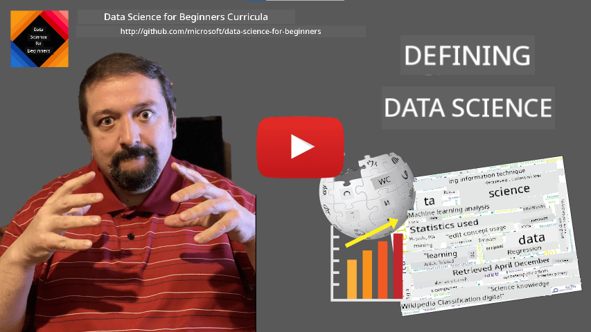
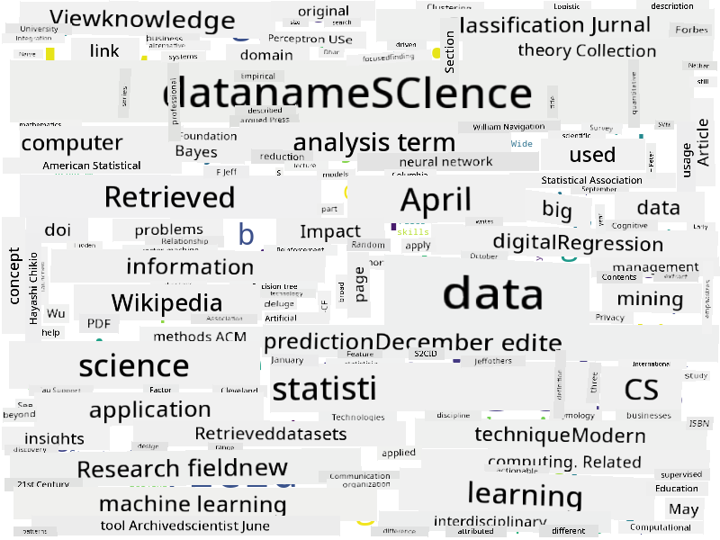

<!--
CO_OP_TRANSLATOR_METADATA:
{
  "original_hash": "43212cc1ac137b7bb1dcfb37ca06b0f4",
  "translation_date": "2025-11-18T18:29:20+00:00",
  "source_file": "1-Introduction/01-defining-data-science/README.md",
  "language_code": "pcm"
}
-->
# Wetin Be Data Science

|  ](../../sketchnotes/01-Definitions.png) |
| :----------------------------------------------------------------------------------------------------: |
|              Wetin Be Data Science - _Sketchnote by [@nitya](https://twitter.com/nitya)_               |

---

## [Pre-lecture quiz](https://ff-quizzes.netlify.app/en/ds/quiz/0)

## Wetin Be Data?
For our everyday life, data dey everywhere around us. Di text wey you dey read now na data. Di list of phone numbers of your friends for your smartphone na data, same as di time wey dey show for your watch. As human beings, we dey naturally use data, like when we dey count di money we get or dey write letter give our friends.

But, data don become more important since dem create computers. Di main work of computers na to do calculations, but dem need data to work on. So, we need to sabi how computers dey store and process data.

Since Internet show, di work of computers as data handling machine don increase. If you think am well, we dey use computers more now for data processing and communication, instead of just calculations. When we dey write email give person or dey search for something online - na data we dey create, store, send, and manipulate.
> You fit remember di last time wey you use computer to really calculate something?

## Wetin Be Data Science?

For [Wikipedia](https://en.wikipedia.org/wiki/Data_science), **Data Science** na *scientific field wey dey use scientific methods to take find knowledge and insights from structured and unstructured data, and apply di knowledge and actionable insights from data for plenty different areas*. 

Dis definition dey show di important things about data science:

* Di main goal of data science na to **find knowledge** from data, meaning - to **understand** data, find hidden relationships and build **model**.
* Data science dey use **scientific methods**, like probability and statistics. When dem first talk about *data science*, some people talk say na just new name for statistics. But now, e don clear say di field big pass statistics.    
* Di knowledge wey we find suppose give us **actionable insights**, meaning practical things wey we fit use for real business situations.
* We suppose sabi work with both **structured** and **unstructured** data. We go talk more about di types of data later for di course.
* **Application domain** na important thing, and data scientists dey need small knowledge for di area of di problem, like finance, medicine, marketing, etc.

> Another important thing for Data Science na say e dey study how we fit gather, store, and work on data using computers. While statistics dey give us di maths foundation, data science dey use di maths to really find insights from data.

One way (wey dem talk say [Jim Gray](https://en.wikipedia.org/wiki/Jim_Gray_(computer_scientist)) suggest) to look data science na to see am as separate science style:
* **Empirical**, wey dey depend on observations and experiment results
* **Theoretical**, wey new ideas dey come from di knowledge wey we already get
* **Computational**, wey we dey find new principles from computational experiments
* **Data-Driven**, wey dey find relationships and patterns for data  

## Other Fields Wey Relate to Data Science

Because data dey everywhere, data science na broad field wey touch many other areas.

<dl>
<dt>Databases</dt>
<dd>
One important thing na <b>how to store</b> di data, meaning how to arrange am so e go quick to process. Different types of databases dey to store structured and unstructured data, we go talk about dem for <a href="../../2-Working-With-Data/README.md">our course</a>.
</dd>
<dt>Big Data</dt>
<dd>
Sometimes we need to store and process plenty data wey get simple structure. Special ways and tools dey to store di data for distributed way on computer cluster, and process am well.
</dd>
<dt>Machine Learning</dt>
<dd>
One way to understand data na to <b>build model</b> wey fit predict wetin we want. To create models from data na wetin we dey call <b>machine learning</b>. You fit check our <a href="https://aka.ms/ml-beginners">Machine Learning for Beginners</a> Curriculum to learn more.
</dd>
<dt>Artificial Intelligence</dt>
<dd>
One part of machine learning wey dem dey call artificial intelligence (AI) dey also depend on data, and e involve building complex models wey dey act like human brain. AI methods dey help us turn unstructured data (like natural language) into structured insights. 
</dd>
<dt>Visualization</dt>
<dd>
Plenty data fit confuse person, but if we create better visualizations with di data, we fit understand am better and get conclusions. So, e dey important to sabi different ways to show information - we go talk about am for <a href="../../3-Data-Visualization/README.md">Section 3</a> of our course. Related areas na <b>Infographics</b>, and <b>Human-Computer Interaction</b>.
</dd>
</dl>

## Types of Data

As we don talk before, data dey everywhere. We just need to capture am well! E good to know di difference between **structured** and **unstructured** data. Structured data dey usually arranged well, like table or tables, while unstructured data na just collection of files. Sometimes, we fit talk about **semi-structured** data, wey get small structure but e fit vary.

| Structured                                                                   | Semi-structured                                                                                | Unstructured                            |
| ---------------------------------------------------------------------------- | ---------------------------------------------------------------------------------------------- | --------------------------------------- |
| List of people with their phone numbers                                      | Wikipedia pages with links                                                                     | Text of Encyclopedia Britannica        |
| Temperature in all rooms of a building at every minute for the last 20 years | Collection of scientific papers in JSON format with authors, data of publication, and abstract | File share with corporate documents     |
| Data for age and gender of all people entering the building                  | Internet pages                                                                                 | Raw video feed from surveillance camera |

## Where You Fit Get Data

Plenty places dey to get data, and e no go possible to list all of dem! But, make we mention some common places:

* **Structured**
  - **Internet of Things** (IoT), like sensors wey dey measure temperature or pressure, dey give plenty useful data. For example, if office building get IoT sensors, we fit control heating and lighting automatically to save money. 
  - **Surveys** wey we dey ask users to do after dem buy something or visit website.
  - **Behavior analysis** fit help us understand how users dey use website, and why dem dey leave di site.
* **Unstructured**
  - **Texts** fit give us insights, like overall **sentiment score**, or keywords and meaning.
  - **Images** or **Video**. Surveillance camera video fit help us check road traffic and warn people about traffic jam.
  - Web server **Logs** fit help us know di pages wey people dey visit most and how long dem dey stay.
* Semi-structured
  - **Social Network** graphs fit give us data about user personality and how dem fit spread information.
  - If we get plenty party pictures, we fit use am to check **Group Dynamics** by building graph of people wey snap together.

If you sabi different places to get data, you fit think of different ways to use data science to understand situations better and improve business.

## Wetin You Fit Do With Data

For Data Science, we dey focus on di following steps for data journey:

<dl>
<dt>1) Data Acquisition</dt>
<dd>
Di first step na to collect di data. Sometimes e dey easy, like data wey dey enter database from web app, but sometimes we need special ways. For example, IoT sensors fit give too much data, so e good to use buffering endpoints like IoT Hub to collect di data before processing.
</dd>
<dt>2) Data Storage</dt>
<dd>
To store data fit hard, especially for big data. When you wan store data, think about how you go query di data later. Different ways dey to store data:
<ul>
<li>Relational database dey store tables, and e dey use SQL to query dem. Tables dey grouped into schemas. Sometimes we need to change di data to fit di schema.</li>
<li><a href="https://en.wikipedia.org/wiki/NoSQL">NoSQL</a> database, like <a href="https://azure.microsoft.com/services/cosmos-db/?WT.mc_id=academic-77958-bethanycheum">CosmosDB</a>, no dey force schema on data, and e dey store complex data like JSON documents or graphs. But, NoSQL no get di rich querying power of SQL, and e no fit enforce referential integrity.</li>
<li><a href="https://en.wikipedia.org/wiki/Data_lake">Data Lake</a> dey store large raw, unstructured data. E dey used for big data wey no fit one machine, and e dey processed by server cluster. <a href="https://en.wikipedia.org/wiki/Apache_Parquet">Parquet</a> na common format for big data.</li> 
</ul>
</dd>
<dt>3) Data Processing</dt>
<dd>
Dis na di most interesting part, wey involve changing di data from original form to form wey fit use for visualization or model training. For unstructured data like text or images, we fit use AI techniques to extract <b>features</b> and turn am to structured form.
</dd>
<dt>4) Visualization / Human Insights</dt>
<dd>
To understand data, we need to visualize am. With different visualization techniques, we fit find di right way to get insight. Sometimes, data scientist go "play with data", dey visualize am many times to find relationships. We fit also use statistics to test hypothesis or prove correlation between data.   
</dd>
<dt>5) Training a predictive model</dt>
<dd>
Since di main goal of data science na to make decisions with data, we fit use <a href="http://github.com/microsoft/ml-for-beginners">Machine Learning</a> to build predictive model. We fit use di model to predict with new data sets wey get similar structure.
</dd>
</dl>

Of course, depending on di data, some steps fit no dey (e.g., if data dey already for database, or if we no need model training), or some steps fit repeat (like data processing).

## Digitalization and Digital Transformation

For di last ten years, many businesses don dey understand how important data dey for business decisions. To use data science for business, di first thing na to collect data, meaning to turn business processes to digital form. Dis na wetin dem dey call **digitalization**. To use data science techniques on di data to guide decisions fit increase productivity or even change di business, and dem dey call am **digital transformation**.

Make we use example. Suppose we get data science course (like dis one) wey we dey teach online, and we wan use data science to improve am. How we go do am?

We fit start by asking "Wetin we fit digitize?" Di simplest way na to measure how long e dey take students to finish each module, and measure di knowledge dem get by giving test after each module. By checking di average time-to-complete for all students, we fit know di modules wey dey hard pass, and work to make dem easier.
> You fit talk say dis approach no too make sense, because modules fit get different lengths. E go probably make sense pass if we divide di time by di length of di module (based on di number of characters), and compare di values like dat.

When we dey analyze results for multiple-choice tests, we fit try see which concepts students dey struggle to understand, and use dat info take improve di content. To do dis one, we need design di tests so dat each question go match one particular concept or knowledge chunk.

If we wan make am even more complex, we fit draw graph wey go show di time wey each module dey take against di age category of di students. We fit discover say for some age categories, e dey take too much time to finish di module, or say students dey stop halfway before dem finish am. Dis one fit help us recommend di module for di right age group, and reduce di way people go vex if dem no get wetin dem expect.

## 🚀 Challenge

For dis challenge, we go try find concepts wey relate to Data Science by looking at texts. We go carry one Wikipedia article about Data Science, download and process di text, then build one word cloud like dis one:

Go check [`notebook.ipynb`](../../../../1-Introduction/01-defining-data-science/notebook.ipynb ':ignore') to read di code. You fit also run di code, and see how e dey do all di data transformations live.

> If you no sabi how to run code for Jupyter Notebook, check [dis article](https://soshnikov.com/education/how-to-execute-notebooks-from-github/).

## [Post-lecture quiz](https://ff-quizzes.netlify.app/en/ds/quiz/1)

## Assignments

* **Task 1**: Change di code wey dey above to find related concepts for di fields of **Big Data** and **Machine Learning**  
* **Task 2**: [Think About Data Science Scenarios](assignment.md)

## Credits

Dis lesson na Dmitry Soshnikov write am with ♥️ [Dmitry Soshnikov](http://soshnikov.com)

---

<!-- CO-OP TRANSLATOR DISCLAIMER START -->
**Disclaimer**:  
Dis docu don dey translate wit AI translation service [Co-op Translator](https://github.com/Azure/co-op-translator). Even though we dey try make am accurate, abeg sabi say automated translation fit get mistake or no correct well. Di original docu for im native language na di main correct source. For important information, e go beta make professional human translator check am. We no go fit take blame for any misunderstanding or wrong interpretation wey fit happen because you use dis translation.
<!-- CO-OP TRANSLATOR DISCLAIMER END -->