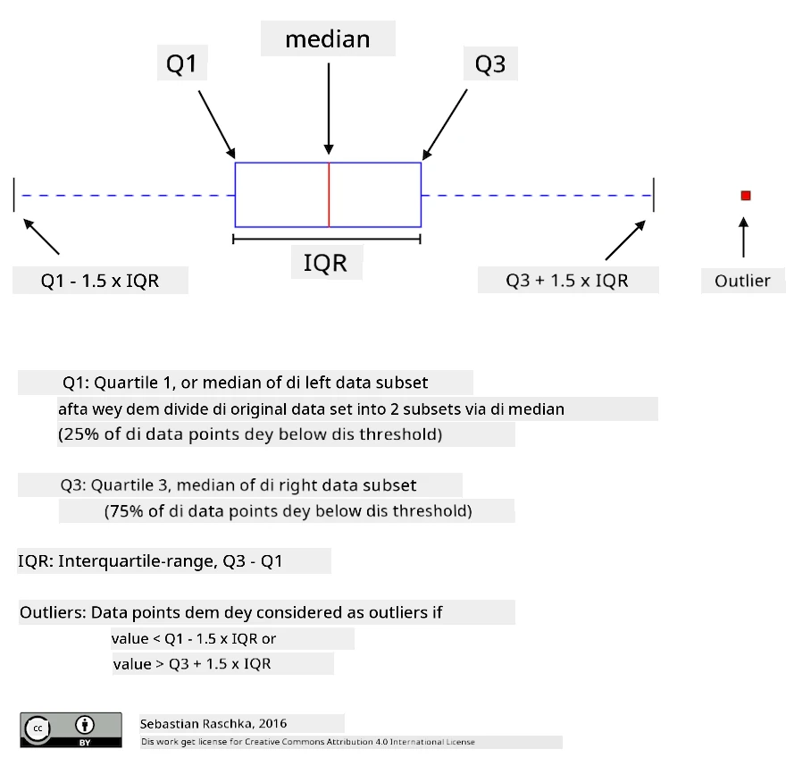
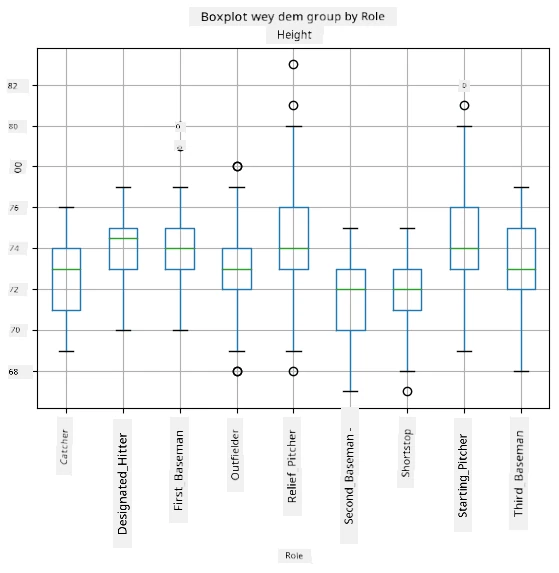
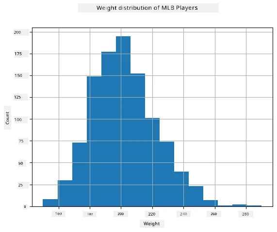

<!--
CO_OP_TRANSLATOR_METADATA:
{
  "original_hash": "ce95884566a74db72572cd51f0cb25ad",
  "translation_date": "2025-11-18T18:36:15+00:00",
  "source_file": "1-Introduction/04-stats-and-probability/README.md",
  "language_code": "pcm"
}
-->
# Small Introduction to Statistics and Probability

| ](../../sketchnotes/04-Statistics-Probability.png)|
|:---:|
| Statistics and Probability - _Sketchnote by [@nitya](https://twitter.com/nitya)_ |

Statistics and Probability na two areas for Mathematics wey dey connect well well, and dem dey important for Data Science. You fit dey work with data even if you no sabi mathematics deep, but e still good make you sabi small small things. For here, we go give you small introduction wey go help you start.

[](https://youtu.be/Z5Zy85g4Yjw)


## [Pre-lecture quiz](https://ff-quizzes.netlify.app/en/ds/quiz/6)

## Probability and Random Variables

**Probability** na number wey dey between 0 and 1 wey dey show how likely one **event** go happen. E dey defined as number of positive outcomes (wey go lead to the event), divided by total number of outcomes, as long as all outcomes get equal chance. For example, if we roll dice, the probability say we go get even number na 3/6 = 0.5.

When we dey talk about events, we dey use **random variables**. For example, the random variable wey represent number wey we get when we roll dice go get values from 1 to 6. The set of numbers from 1 to 6 na **sample space**. We fit talk about the probability of random variable wey dey take one particular value, like P(X=3)=1/6.

The random variable for the example wey we talk before na **discrete**, because e get countable sample space, wey mean say e get separate values wey we fit count. Sometimes, sample space fit be range of real numbers, or the whole set of real numbers. This kind variable na **continuous**. Example na the time wey bus go arrive.

## Probability Distribution

For discrete random variables, e easy to describe the probability of each event with function P(X). For each value *s* from sample space *S*, e go give number from 0 to 1, wey the sum of all values of P(X=s) for all events go equal 1.

The most popular discrete distribution na **uniform distribution**, wey sample space get N elements, with equal probability of 1/N for each one.

E dey harder to describe the probability distribution of continuous variable, wey values dey come from interval [a,b], or the whole set of real numbers &Ropf;. Think about bus arrival time. For exact arrival time *t*, the probability say bus go arrive at that exact time na 0!

> Now you sabi say events wey get 0 probability dey happen, and e dey happen plenty times! At least anytime bus dey arrive!

We fit only talk about the probability say variable go fall inside one interval of values, like P(t<sub>1</sub>&le;X&lt;t<sub>2</sub>). For this case, probability distribution dey described by **probability density function** p(x), wey be like this:


  
Continuous version of uniform distribution na **continuous uniform**, wey dey defined for one finite interval. Probability say value X go fall inside interval wey get length l na proportional to l, and e go reach 1.

Another important distribution na **normal distribution**, we go talk about am more later.

## Mean, Variance and Standard Deviation

Imagine say we draw sequence of n samples of random variable X: x<sub>1</sub>, x<sub>2</sub>, ..., x<sub>n</sub>. We fit define **mean** (or **arithmetic average**) value of the sequence the usual way as (x<sub>1</sub>+x<sub>2</sub>+x<sub>n</sub>)/n. As we dey increase the size of the sample (i.e. take the limit with n&rarr;&infin;), we go get the mean (also called **expectation**) of the distribution. We go use **E**(x) to represent expectation.

> E fit show say for any discrete distribution wey get values {x<sub>1</sub>, x<sub>2</sub>, ..., x<sub>N</sub>} and probabilities p<sub>1</sub>, p<sub>2</sub>, ..., p<sub>N</sub>, the expectation go equal E(X)=x<sub>1</sub>p<sub>1</sub>+x<sub>2</sub>p<sub>2</sub>+...+x<sub>N</sub>p<sub>N</sub>.

To know how far the values dey spread, we fit calculate variance &sigma;<sup>2</sup> = &sum;(x<sub>i</sub> - &mu;)<sup>2</sup>/n, where &mu; na the mean of the sequence. The value &sigma; na **standard deviation**, and &sigma;<sup>2</sup> na **variance**.

## Mode, Median and Quartiles

Sometimes, mean no dey show the "typical" value for data well. For example, if e get few extreme values wey dey out of range, dem fit affect the mean. Another good way na **median**, wey be value wey half of data points dey lower than am, and the other half dey higher.

To help us understand how data dey spread, e good to talk about **quartiles**:

* First quartile, or Q1, na value wey 25% of the data dey below am
* Third quartile, or Q3, na value wey 75% of the data dey below am

We fit show the relationship between median and quartiles with diagram wey dem dey call **box plot**:



For here, we fit calculate **inter-quartile range** IQR=Q3-Q1, and **outliers** - values wey dey outside the boundaries [Q1-1.5*IQR,Q3+1.5*IQR].

For small distribution wey get few possible values, one good "typical" value na the one wey dey appear most often, wey dem dey call **mode**. E dey useful for categorical data, like colors. Imagine say we get two groups of people - some wey like red well, and others wey like blue. If we code colors with numbers, the mean value for favorite color fit dey somewhere for orange-green spectrum, wey no go show the actual preference of any group. But the mode go be one of the colors, or both colors, if the number of people wey choose dem dey equal (for this case we go call the sample **multimodal**).

## Real-world Data

When we dey analyze real-life data, dem no dey random variables like that, because we no dey do experiments wey result dey unknown. For example, think about baseball team players, and their body data like height, weight and age. Those numbers no dey random exactly, but we fit still use the same mathematical ideas. For example, sequence of people's weights fit be sequence of values wey dey come from one random variable. Below na sequence of weights of real baseball players from [Major League Baseball](http://mlb.mlb.com/index.jsp), wey dem take from [this dataset](http://wiki.stat.ucla.edu/socr/index.php/SOCR_Data_MLB_HeightsWeights) (we show only first 20 values for your convenience):

```
[180.0, 215.0, 210.0, 210.0, 188.0, 176.0, 209.0, 200.0, 231.0, 180.0, 188.0, 180.0, 185.0, 160.0, 180.0, 185.0, 197.0, 189.0, 185.0, 219.0]
```

> **Note**: To see example of how to work with this dataset, check the [accompanying notebook](notebook.ipynb). E get challenges for this lesson, and you fit complete dem by adding code to the notebook. If you no sabi how to work with data, no worry - we go come back to working with data using Python later. If you no sabi how to run code for Jupyter Notebook, check [this article](https://soshnikov.com/education/how-to-execute-notebooks-from-github/).

Here na box plot wey dey show mean, median and quartiles for our data:


Since our data get information about different player **roles**, we fit also do box plot by role - e go help us see how parameter values dey different for roles. This time we go look height:



This diagram dey show say, on average, height of first basemen dey higher than height of second basemen. Later for this lesson, we go learn how to test this idea more formally, and how to show say our data dey statistically significant to prove am.

> When we dey work with real-world data, we dey assume say all data points na samples wey dey come from one probability distribution. This assumption dey allow us use machine learning techniques and build predictive models wey dey work.

To see how our data dey spread, we fit draw graph wey dem dey call **histogram**. X-axis go get number of different weight intervals (bins), and vertical axis go show how many times our random variable sample dey inside one interval.



From this histogram, you fit see say all values dey gather around one mean weight, and as we dey go far from that weight, the fewer weights we go see. E mean say e no likely say baseball player weight go dey very different from the mean weight. Variance of weights dey show how much weights fit dey different from the mean.

> If we take weights of other people, not baseball players, the distribution fit change. But the shape of the distribution go still dey the same, only the mean and variance go change. So, if we train our model with baseball players, e fit give wrong results if we use am for university students, because the underlying distribution dey different.

## Normal Distribution

The distribution of weights wey we see before na very common, and many measurements for real world dey follow the same type of distribution, but with different mean and variance. This distribution na **normal distribution**, and e dey very important for statistics.

To use normal distribution na correct way to generate random weights of potential baseball players. Once we sabi mean weight `mean` and standard deviation `std`, we fit generate 1000 weight samples like this:
```python
samples = np.random.normal(mean,std,1000)
``` 

If we draw histogram of the samples we generate, e go look like the one wey we show before. And if we increase the number of samples and bins, we fit generate picture of normal distribution wey dey closer to perfect:


*Normal Distribution with mean=0 and std.dev=1*

## Confidence Intervals

When we dey talk about weights of baseball players, we dey assume say e get one **random variable W** wey represent the ideal probability distribution of weights of all baseball players (we dey call am **population**). Our sequence of weights na subset of all baseball players wey we dey call **sample**. One interesting question na, we fit know the parameters of distribution of W, like mean and variance of the population?

The easiest answer na to calculate mean and variance of our sample. But e fit happen say our random sample no represent the whole population well. So e make sense to talk about **confidence interval**.

> **Confidence interval** na estimation of true mean of the population based on our sample, wey dey accurate with certain probability (or **level of confidence**).

Imagine say we get sample X<sub>1</sub>, ..., X<sub>n</sub> from our distribution. Anytime we draw sample from our distribution, we go get different mean value &mu;. So &mu; fit be random variable. **Confidence interval** with confidence p na pair of values (L<sub>p</sub>,R<sub>p</sub>), wey mean say **P**(L<sub>p</sub>&leq;&mu;&leq;R<sub>p</sub>) = p, i.e. probability say measured mean value go dey inside the interval go equal p.

E go pass this small introduction to explain how dem dey calculate confidence intervals well. You fit find more details [on Wikipedia](https://en.wikipedia.org/wiki/Confidence_interval). In short, we dey define the distribution of computed sample mean compared to the true mean of the population, wey dem dey call **student distribution**.
> **Interestin fact**: Dem name Student distribution afta one mathematician wey im name na William Sealy Gosset. E publish im paper wit di pseudonym "Student". E dey work for Guinness brewery, and one of di tori be say im oga no wan make public sabi say dem dey use statistical test to check di quality of raw materials.

If we wan estimate di mean &mu; of our population wit confidence p, we go need take *(1-p)/2-th percentile* of a Student distribution A. We fit get am from tables or use computer wit some built-in functions for statistical software (like Python, R, etc.). Di interval for &mu; go be X&pm;A*D/&radic;n, where X na di mean wey we get from di sample, and D na di standard deviation.

> **Note**: We no go discuss di important concept of [degrees of freedom](https://en.wikipedia.org/wiki/Degrees_of_freedom_(statistics)) for here, but e dey very important for Student distribution. If you wan sabi am well, check better books on statistics.

Example of how to calculate confidence interval for weights and heights dey for di [accompanying notebooks](notebook.ipynb).

| p | Weight mean |
|-----|-----------|
| 0.85 | 201.73±0.94 |
| 0.90 | 201.73±1.08 |
| 0.95 | 201.73±1.28 |

Notice say as di confidence probability dey increase, di confidence interval dey wide pass.

## Hypothesis Testing 

For our baseball players dataset, we get different player roles, and we fit summarize dem like dis (check di [accompanying notebook](notebook.ipynb) to see how we calculate dis table):

| Role | Height | Weight | Count |
|------|--------|--------|-------|
| Catcher | 72.723684 | 204.328947 | 76 |
| Designated_Hitter | 74.222222 | 220.888889 | 18 |
| First_Baseman | 74.000000 | 213.109091 | 55 |
| Outfielder | 73.010309 | 199.113402 | 194 |
| Relief_Pitcher | 74.374603 | 203.517460 | 315 |
| Second_Baseman | 71.362069 | 184.344828 | 58 |
| Shortstop | 71.903846 | 182.923077 | 52 |
| Starting_Pitcher | 74.719457 | 205.163636 | 221 |
| Third_Baseman | 73.044444 | 200.955556 | 45 |

We fit notice say di mean height of first basemen high pass di one of second basemen. So, we fit wan conclude say **first basemen tall pass second basemen**.

> Dis kain statement na wetin dem dey call **hypothesis**, because we no sabi for sure whether e true or not.

But e no dey always clear whether we fit make dis kain conclusion. From wetin we don discuss, we sabi say each mean get im own confidence interval, so di difference fit just be statistical error. We need one more formal way to test di hypothesis.

Make we calculate di confidence intervals for di heights of first and second basemen separately:

| Confidence | First Basemen | Second Basemen |
|------------|---------------|----------------|
| 0.85 | 73.62..74.38 | 71.04..71.69 |
| 0.90 | 73.56..74.44 | 70.99..71.73 |
| 0.95 | 73.47..74.53 | 70.92..71.81 |

We fit see say di intervals no overlap for any confidence level. Dis one prove our hypothesis say first basemen tall pass second basemen.

More formally, di problem we dey solve na to check if **two probability distributions dey di same**, or at least get di same parameters. Depending on di distribution, we go use different tests. If we sabi say di distributions dey normal, we fit use **[Student t-test](https://en.wikipedia.org/wiki/Student%27s_t-test)**.

For Student t-test, we go calculate wetin dem dey call **t-value**, wey dey show di difference between di means, based on di variance. E don show say t-value dey follow **student distribution**, wey go help us get di threshold value for any confidence level **p** (we fit calculate am or check am for numerical tables). We go then compare di t-value to di threshold to accept or reject di hypothesis.

For Python, we fit use **SciPy** package, wey get `ttest_ind` function (plus many other useful statistical functions!). E go calculate di t-value for us, and e go also help us find di confidence p-value, so we fit just look di confidence to make conclusion.

For example, di comparison between di heights of first and second basemen give us dis result: 
```python
from scipy.stats import ttest_ind

tval, pval = ttest_ind(df.loc[df['Role']=='First_Baseman',['Height']], df.loc[df['Role']=='Designated_Hitter',['Height']],equal_var=False)
print(f"T-value = {tval[0]:.2f}\nP-value: {pval[0]}")
```
```
T-value = 7.65
P-value: 9.137321189738925e-12
```
For our case, di p-value dey very low, meaning say we get strong evidence say first basemen tall pass.

We get other types of hypothesis wey we fit test, like:
* To prove say one sample follow one distribution. For our case, we assume say heights dey normally distributed, but we need formal statistical check.
* To prove say di mean value of one sample match one predefined value.
* To compare di means of different samples (e.g., di difference in happiness levels among different age groups).

## Law of Large Numbers and Central Limit Theorem

One reason why normal distribution dey important na because of **central limit theorem**. If we get one big sample of independent N values X<sub>1</sub>, ..., X<sub>N</sub>, wey dem sample from any distribution wey get mean &mu; and variance &sigma;<sup>2</sup>, then, if N big well well (when N&rarr;&infin;), di mean &Sigma;<sub>i</sub>X<sub>i</sub> go dey normally distributed, wit mean &mu; and variance &sigma;<sup>2</sup>/N.

> Another way to explain di central limit theorem na say no matter di distribution, if you calculate di mean of di sum of any random variable values, you go end up wit normal distribution.

From di central limit theorem, e also mean say, when N&rarr;&infin;, di probability say di sample mean go equal &mu; go be 1. Dis one na wetin dem dey call **di law of large numbers**.

## Covariance and Correlation

One thing wey Data Science dey do na to find di relationship between data. We go talk say two sequences **correlate** if dem dey behave di same way at di same time, like if dem dey rise/fall together, or if one dey rise when di other one dey fall. In short, e go be like say di two sequences get some kind connection.

> Correlation no mean say one dey cause di other; sometimes both variables fit dey depend on one external cause, or e fit just be coincidence. But strong mathematical correlation fit show say di two variables dey somehow connected.

Mathematically, di main concept wey dey show di relationship between two random variables na **covariance**, wey we dey calculate like dis: Cov(X,Y) = **E**\[(X-**E**(X))(Y-**E**(Y))\]. We dey calculate di deviation of di two variables from their mean values, then multiply di deviations. If di two variables dey deviate together, di product go dey positive, and di covariance go dey positive. If di two variables dey deviate opposite (one go down when di other go up), di product go dey negative, and di covariance go dey negative. If di deviations no dey related, di covariance go dey near zero.

Di absolute value of covariance no dey tell us how strong di correlation dey, because e depend on di size of di values. To normalize am, we fit divide di covariance by di standard deviation of di two variables, to get **correlation**. Di good thing be say correlation dey always between [-1,1], where 1 mean strong positive correlation, -1 mean strong negative correlation, and 0 mean no correlation (di variables dey independent).

**Example**: We fit calculate di correlation between di weights and heights of baseball players from di dataset wey we mention:
```python
print(np.corrcoef(weights,heights))
```
Di result go give us **correlation matrix** like dis:
```
array([[1.        , 0.52959196],
       [0.52959196, 1.        ]])
```

> Correlation matrix C fit dey calculate for any number of input sequences S<sub>1</sub>, ..., S<sub>n</sub>. Di value of C<sub>ij</sub> na di correlation between S<sub>i</sub> and S<sub>j</sub>, and di diagonal elements go always be 1 (self-correlation of S<sub>i</sub>).

For our case, di value 0.53 show say weight and height of person get some correlation. We fit also draw scatter plot of one value against di other to see di relationship:


> More examples of correlation and covariance dey for di [accompanying notebook](notebook.ipynb).

## Conclusion

For dis section, we don learn:

* di basic statistical properties of data, like mean, variance, mode, and quartiles
* different distributions of random variables, including normal distribution
* how to find correlation between different properties
* how to use mathematics and statistics to prove some hypotheses
* how to calculate confidence intervals for random variable based on data sample

Even though dis no be everything wey dey for probability and statistics, e suppose give you better foundation to start dis course.

## 🚀 Challenge

Use di sample code for di notebook to test other hypothesis like: 
1. First basemen old pass second basemen
2. First basemen tall pass third basemen
3. Shortstops tall pass second basemen

## [Post-lecture quiz](https://ff-quizzes.netlify.app/en/ds/quiz/7)

## Review & Self Study

Probability and statistics na very broad topic wey fit even get im own course. If you wan sabi di theory well, you fit read some of dis books:

1. [Carlos Fernandez-Granda](https://cims.nyu.edu/~cfgranda/) from New York University get better lecture notes [Probability and Statistics for Data Science](https://cims.nyu.edu/~cfgranda/pages/stuff/probability_stats_for_DS.pdf) (available online)
1. [Peter and Andrew Bruce. Practical Statistics for Data Scientists.](https://www.oreilly.com/library/view/practical-statistics-for/9781491952955/) [[sample code in R](https://github.com/andrewgbruce/statistics-for-data-scientists)]. 
1. [James D. Miller. Statistics for Data Science](https://www.packtpub.com/product/statistics-for-data-science/9781788290678) [[sample code in R](https://github.com/PacktPublishing/Statistics-for-Data-Science)]

## Assignment

[Small Diabetes Study](assignment.md)

## Credits

Dis lesson na work of ♥️ by [Dmitry Soshnikov](http://soshnikov.com)

---

<!-- CO-OP TRANSLATOR DISCLAIMER START -->
**Disclaimer**:  
Dis dokyument don translate wit AI translation service [Co-op Translator](https://github.com/Azure/co-op-translator). Even as we dey try make am accurate, abeg no forget say automatic translation fit get mistake or no dey correct well. Di original dokyument for im native language na di main source wey you go fit trust. For important mata, e better make professional human translation dey use. We no go fit take blame for any misunderstanding or wrong interpretation wey fit happen because you use dis translation.
<!-- CO-OP TRANSLATOR DISCLAIMER END -->