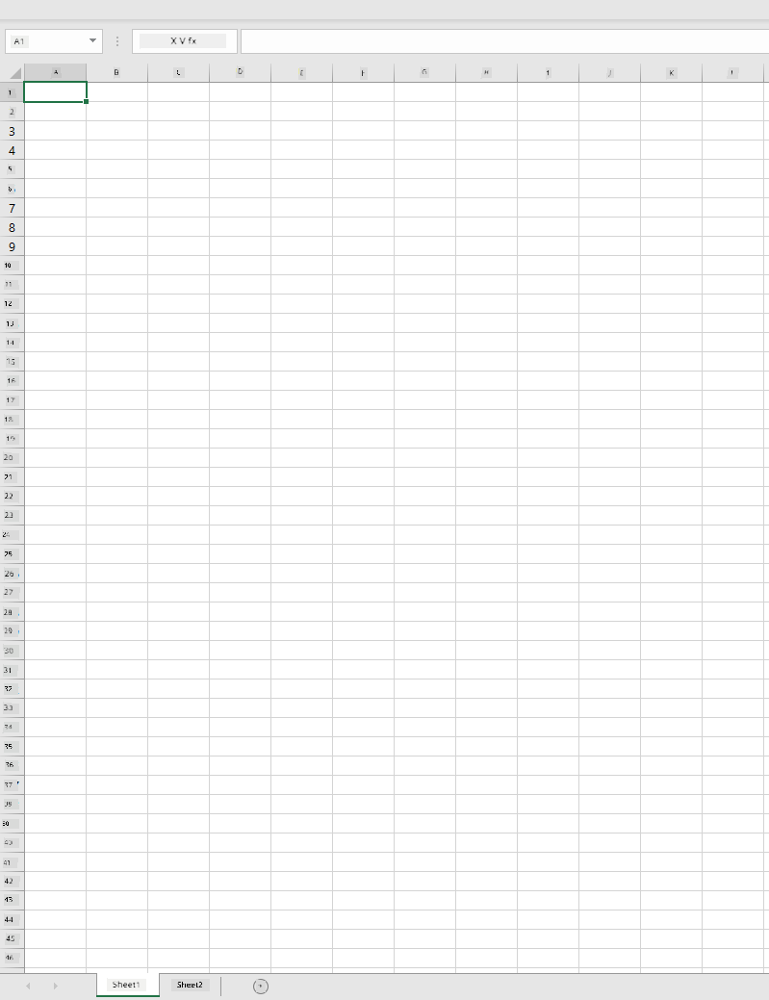
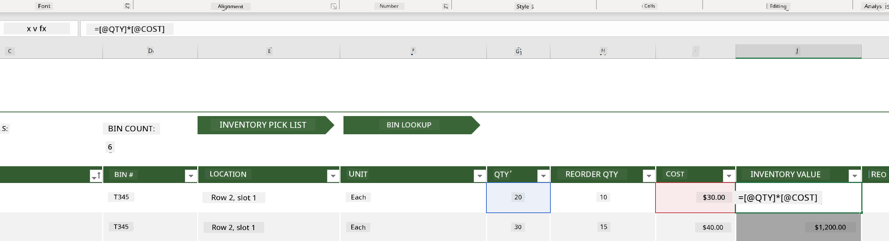
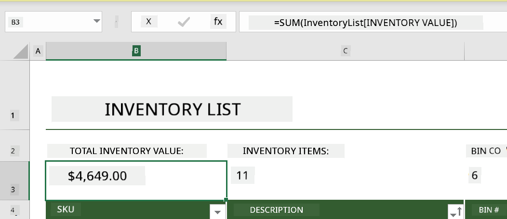
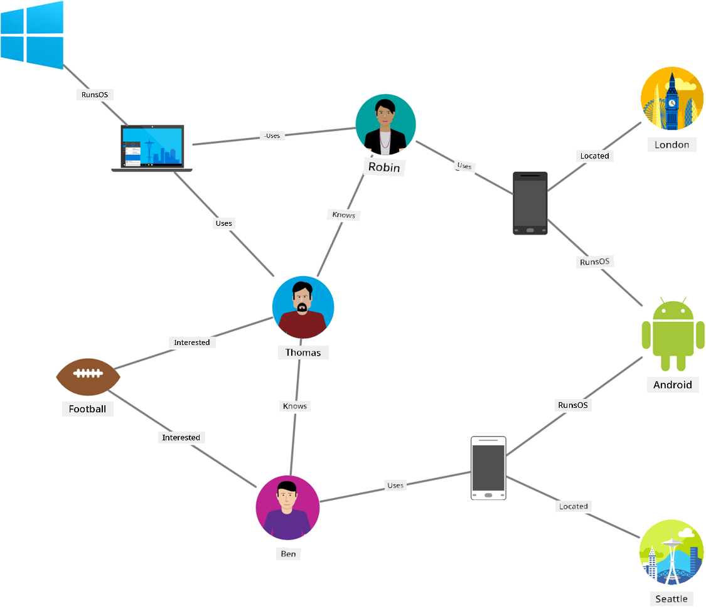
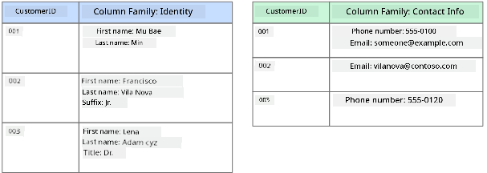
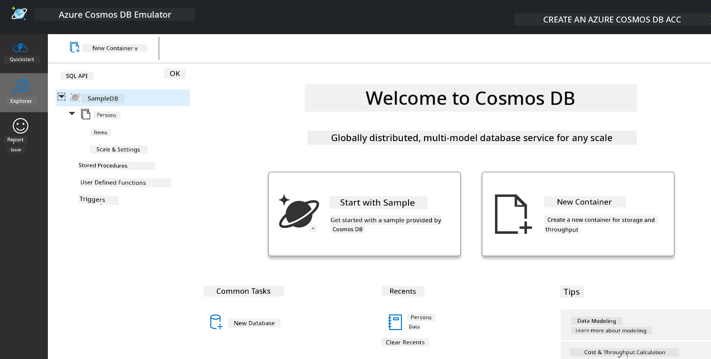
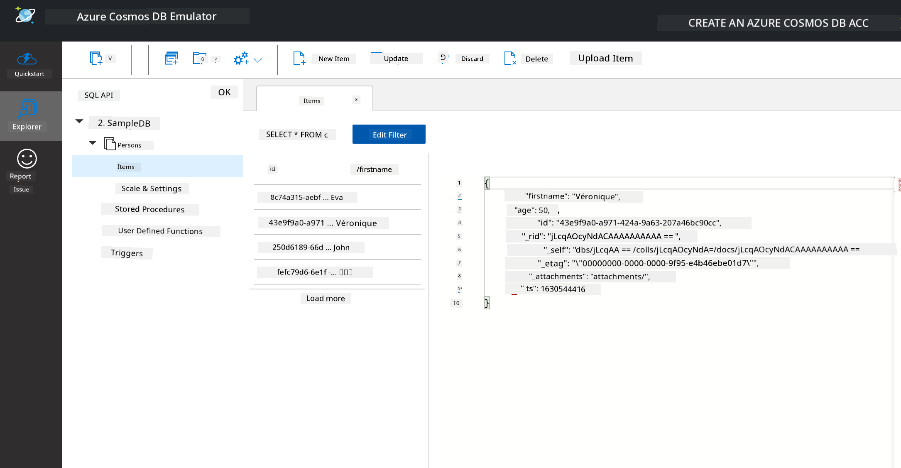
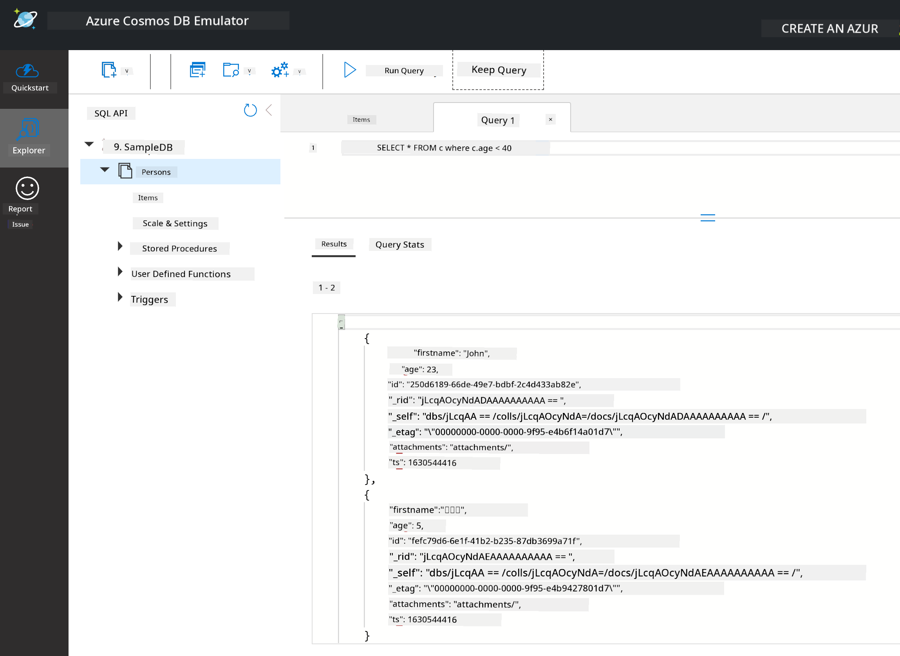

<!--
CO_OP_TRANSLATOR_METADATA:
{
  "original_hash": "c182e87f9f80be7e7cdffc7b40bbfccf",
  "translation_date": "2025-11-18T18:21:41+00:00",
  "source_file": "2-Working-With-Data/06-non-relational/README.md",
  "language_code": "pcm"
}
-->
# How to Work with Data: Non-Relational Data

| ](../../sketchnotes/06-NoSQL.png)|
|:---:|
|How to Work with NoSQL Data - _Sketchnote by [@nitya](https://twitter.com/nitya)_ |

## [Pre-Lecture Quiz](https://ff-quizzes.netlify.app/en/ds/quiz/10)

Data no dey only for relational databases. Dis lesson go talk about non-relational data and e go cover di basics of spreadsheets and NoSQL.

## Spreadsheets

Spreadsheets na one popular way wey people dey use store and check data because e no too hard to setup and start. For dis lesson, you go sabi di basic parts of spreadsheet, plus formulas and functions. Di examples go dey show with Microsoft Excel, but most of di parts and topics go get similar names and steps for other spreadsheet software.



Spreadsheet na file wey you fit access for di file system of computer, device, or cloud-based file system. Di software fit dey browser-based or na app wey you go install for computer or download as app. For Excel, dem dey call dis files **workbooks** and na dis name we go dey use for di rest of di lesson.

Workbook dey get one or more **worksheets**, and each worksheet dey get tabs wey dem take label am. Inside worksheet, you go see rectangles wey dem dey call **cells**, and na di cells dey carry di real data. Cell na di place wey row and column dey meet, and di columns dey get alphabetical characters while di rows dey get numbers. Some spreadsheets dey get headers for di first few rows to explain di data wey dey inside di cell.

With dis basic parts of Excel workbook, we go use example from [Microsoft Templates](https://templates.office.com/) wey dey focus on inventory to show more parts of spreadsheet.

### How to Manage Inventory

Di spreadsheet file wey dem call "InventoryExample" na formatted spreadsheet of items wey dey inside inventory. E get three worksheets, and di tabs na "Inventory List", "Inventory Pick List" and "Bin Lookup". Row 4 for di Inventory List worksheet na di header, wey dey explain di value of each cell for di header column.



Sometimes, di value wey dey inside one cell dey depend on di values wey dey other cells to calculate am. Di Inventory List spreadsheet dey track di cost of every item for di inventory, but wetin if we wan know di value of everything wey dey di inventory? [**Formulas**](https://support.microsoft.com/en-us/office/overview-of-formulas-34519a4e-1e8d-4f4b-84d4-d642c4f63263) dey perform actions on cell data and e dey calculate di cost of di inventory for dis example. Dis spreadsheet use formula for di Inventory Value column to calculate di value of each item by multiplying di quantity under di QTY header and di cost under di COST header. If you double-click or highlight di cell, you go see di formula. You go notice say formulas dey start with equals sign, followed by di calculation or operation.



We fit use another formula to add all di values for Inventory Value together to get di total value. You fit calculate am by adding each cell one by one, but dat one go dey stressful. Excel get [**functions**](https://support.microsoft.com/en-us/office/sum-function-043e1c7d-7726-4e80-8f32-07b23e057f89), wey be predefined formulas to calculate cell values. Functions dey need arguments, wey be di values wey dem go use calculate. If functions need more than one argument, you go need arrange dem well or di function no go calculate di correct value. Dis example use di SUM function, and e use di values for Inventory Value as di argument to calculate di total wey dey under row 3, column B (dem dey call am B3).

## NoSQL

NoSQL na general name for di different ways wey people dey store non-relational data. E fit mean "non-SQL", "non-relational" or "not only SQL". Dis type of database systems dey divide into 4 types.


> Source from [Michał Białecki Blog](https://www.michalbialecki.com/2018/03/18/azure-cosmos-db-key-value-database-cloud/)

[Key-value](https://docs.microsoft.com/en-us/azure/architecture/data-guide/big-data/non-relational-data#keyvalue-data-stores) databases dey pair unique keys, wey be di identifier wey dey connect with value. Dem dey store dis pairs with [hash table](https://www.hackerearth.com/practice/data-structures/hash-tables/basics-of-hash-tables/tutorial/) wey get correct hashing function.


> Source from [Microsoft](https://docs.microsoft.com/en-us/azure/cosmos-db/graph/graph-introduction#graph-database-by-example)

[Graph](https://docs.microsoft.com/en-us/azure/architecture/data-guide/big-data/non-relational-data#graph-data-stores) databases dey explain relationships for data and dem dey show am as collection of nodes and edges. Node dey represent entity, like student or bank statement. Edges dey show di relationship between two entities. Each node and edge get properties wey dey give more information about di node and edges.



[Columnar](https://docs.microsoft.com/en-us/azure/architecture/data-guide/big-data/non-relational-data#columnar-data-stores) data stores dey arrange data into columns and rows like relational data structure, but each column dey divide into groups wey dem dey call column family. All di data under one column dey related and you fit retrieve or change am as one unit.

### Document Data Stores with di Azure Cosmos DB

[Document](https://docs.microsoft.com/en-us/azure/architecture/data-guide/big-data/non-relational-data#document-data-stores) data stores dey build on di idea of key-value data store and e dey made up of fields and objects. Dis section go show document databases with di Cosmos DB emulator.

Cosmos DB database fit mean "Not Only SQL", because di document database for Cosmos DB dey use SQL to query di data. Di [previous lesson](../05-relational-databases/README.md) on SQL don explain di basics of di language, and we go fit use some of di same queries for document database here. We go use Cosmos DB Emulator, wey go allow us create and check document database locally for computer. Read more about di Emulator [here](https://docs.microsoft.com/en-us/azure/cosmos-db/local-emulator?tabs=ssl-netstd21).

Document na collection of fields and object values, and di fields dey explain wetin di object value mean. Below na example of document.

```json
{
    "firstname": "Eva",
    "age": 44,
    "id": "8c74a315-aebf-4a16-bb38-2430a9896ce5",
    "_rid": "bHwDAPQz8s0BAAAAAAAAAA==",
    "_self": "dbs/bHwDAA==/colls/bHwDAPQz8s0=/docs/bHwDAPQz8s0BAAAAAAAAAA==/",
    "_etag": "\"00000000-0000-0000-9f95-010a691e01d7\"",
    "_attachments": "attachments/",
    "_ts": 1630544034
}
```

Di fields wey dey important for dis document na: `firstname`, `id`, and `age`. Di rest of di fields wey get underscores na Cosmos DB generate dem.

#### How to Check Data with di Cosmos DB Emulator

You fit download and install di emulator [for Windows here](https://aka.ms/cosmosdb-emulator). Check dis [documentation](https://docs.microsoft.com/en-us/azure/cosmos-db/local-emulator?tabs=ssl-netstd21#run-on-linux-macos) for how to run di Emulator for macOS and Linux.

Di Emulator go open browser window, and di Explorer view go allow you check documents.



If you dey follow di steps, click "Start with Sample" to create sample database wey dem call SampleDB. If you expand Sample DB by clicking di arrow, you go see container wey dem call `Persons`. Container dey hold collection of items, wey be di documents inside di container. You fit check di four documents wey dey under `Items`.



#### How to Query Document Data with di Cosmos DB Emulator

You fit query di sample data by clicking di new SQL Query button (second button from di left).

`SELECT * FROM c` go show all di documents wey dey inside di container. Make we add where clause to find everybody wey dey younger than 40.

`SELECT * FROM c where c.age < 40`

 

Di query go show two documents, and you go notice say di age value for each document dey less than 40.

#### JSON and Documents

If you sabi JavaScript Object Notation (JSON), you go notice say documents dey look like JSON. Di `PersonsData.json` file dey inside dis directory with more data wey you fit upload to di Persons container for di Emulator with di `Upload Item` button.

Most times, APIs wey dey return JSON data fit dey directly transfer and store for document databases. Below na another document, e dey represent tweets from di Microsoft Twitter account wey dem collect using di Twitter API, then dem insert am into Cosmos DB.

```json
{
    "created_at": "2021-08-31T19:03:01.000Z",
    "id": "1432780985872142341",
    "text": "Blank slate. Like this tweet if you’ve ever painted in Microsoft Paint before. https://t.co/cFeEs8eOPK",
    "_rid": "dhAmAIUsA4oHAAAAAAAAAA==",
    "_self": "dbs/dhAmAA==/colls/dhAmAIUsA4o=/docs/dhAmAIUsA4oHAAAAAAAAAA==/",
    "_etag": "\"00000000-0000-0000-9f84-a0958ad901d7\"",
    "_attachments": "attachments/",
    "_ts": 1630537000
```

Di fields wey dey important for dis document na: `created_at`, `id`, and `text`.

## 🚀 Challenge

Di `TwitterData.json` file dey wey you fit upload to di SampleDB database. E better make you add am to separate container. You fit do am by:

1. Clicking di new container button for di top right
1. Choosing di existing database (SampleDB) and creating container id for di container
1. Setting di partition key to `/id`
1. Clicking OK (you fit ignore di rest of di information for dis view because na small dataset wey dey run locally for your machine)
1. Open di new container and upload di Twitter Data file with `Upload Item` button

Try run some select queries to find di documents wey get Microsoft for di text field. Hint: try use di [LIKE keyword](https://docs.microsoft.com/en-us/azure/cosmos-db/sql/sql-query-keywords#using-like-with-the--wildcard-character)

## [Post-lecture quiz](https://ff-quizzes.netlify.app/en/ds/quiz/11)

## Review & Self Study

- Some extra formatting and features dey for dis spreadsheet wey dis lesson no cover. Microsoft get [big library of documentation and videos](https://support.microsoft.com/excel) on Excel if you wan learn more.

- Dis architectural documentation dey explain di characteristics of di different types of non-relational data: [Non-relational Data and NoSQL](https://docs.microsoft.com/en-us/azure/architecture/data-guide/big-data/non-relational-data)

- Cosmos DB na cloud-based non-relational database wey fit store di different NoSQL types wey dis lesson mention. Learn more about dis types for dis [Cosmos DB Microsoft Learn Module](https://docs.microsoft.com/en-us/learn/paths/work-with-nosql-data-in-azure-cosmos-db/)

## Assignment

[Soda Profits](assignment.md)

---

<!-- CO-OP TRANSLATOR DISCLAIMER START -->
**Disclaimer**:  
Dis docu don dey translate wit AI translation service [Co-op Translator](https://github.com/Azure/co-op-translator). Even though we dey try make am accurate, abeg sabi say automated translations fit get mistake or no dey 100% correct. Di original docu for di native language na di main correct source. For important information, e better make una use professional human translation. We no go fit take blame for any misunderstanding or wrong interpretation wey fit happen because of dis translation.
<!-- CO-OP TRANSLATOR DISCLAIMER END -->