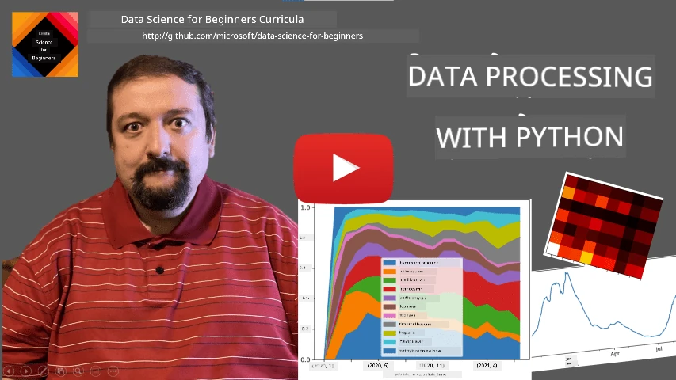
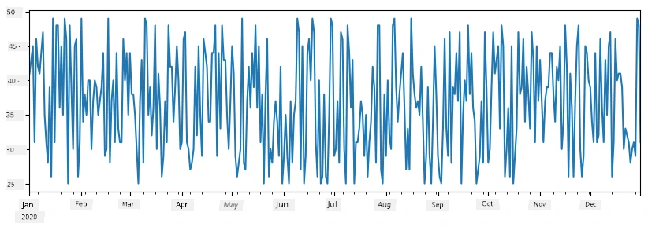

<!--
CO_OP_TRANSLATOR_METADATA:
{
  "original_hash": "7bfec050f4717dcc2dfd028aca9d21f3",
  "translation_date": "2025-11-18T18:18:59+00:00",
  "source_file": "2-Working-With-Data/07-python/README.md",
  "language_code": "pcm"
}
-->
# How to Work with Data: Python and Pandas Library

|  ](../../sketchnotes/07-WorkWithPython.png) |
| :-------------------------------------------------------------------------------------------------------: |
|                 Working With Python - _Sketchnote by [@nitya](https://twitter.com/nitya)_                 |

[](https://youtu.be/dZjWOGbsN4Y)

Database dey give beta way to store data and use query language to find am, but di most flexible way to process data na to write your own program wey go manipulate di data. Sometimes, e go better to use database query, but if di data processing wey you wan do dey complex, SQL no go fit handle am well. 

You fit use any programming language to process data, but some languages dey better for data work. Data scientists dey usually like di following languages:

* **[Python](https://www.python.org/)**, na general-purpose programming language wey dey simple for beginners. E get plenty extra libraries wey go help you solve different problems, like extracting data from ZIP archive or converting picture to grayscale. Apart from data science, Python dey also useful for web development. 
* **[R](https://www.r-project.org/)** na traditional tool wey dem design for statistical data processing. E get big library repository (CRAN), wey make am good for data processing. But R no be general-purpose programming language, and e no dey common outside data science.
* **[Julia](https://julialang.org/)** na language wey dem design for data science. E dey faster than Python, so e dey good for scientific experiments.

For dis lesson, we go focus on how to use Python for simple data processing. We go assume say you sabi di basics of di language. If you wan learn Python well, check di following resources:

* [Learn Python in a Fun Way with Turtle Graphics and Fractals](https://github.com/shwars/pycourse) - Quick intro course for Python Programming wey dey GitHub
* [Take your First Steps with Python](https://docs.microsoft.com/en-us/learn/paths/python-first-steps/?WT.mc_id=academic-77958-bethanycheum) Learning Path on [Microsoft Learn](http://learn.microsoft.com/?WT.mc_id=academic-77958-bethanycheum)

Data fit dey in different forms. For dis lesson, we go look three types of data - **tabular data**, **text**, and **images**.

We go show small examples of data processing instead of full overview of all di libraries. Dis go help you understand wetin dey possible and where you fit find solutions when you need am.

> **Beta advice**. If you wan do something for data wey you no sabi, search am online. [Stackoverflow](https://stackoverflow.com/) get plenty useful Python code examples for common tasks.

## [Pre-lecture quiz](https://ff-quizzes.netlify.app/en/ds/quiz/12)

## Tabular Data and Dataframes

You don already see tabular data when we talk about relational databases. If you get plenty data wey dey inside different linked tables, SQL go make sense to use. But sometimes, you fit get one table of data and you wan understand di data or find insight, like di distribution or correlation between values. For data science, we dey do plenty transformation of original data and visualization. Python dey make dis easy.

Two libraries dey very useful for tabular data in Python:
* **[Pandas](https://pandas.pydata.org/)** dey help you work with **Dataframes**, wey be like relational tables. You fit get named columns and do different operations on rows, columns, and di whole dataframe.
* **[Numpy](https://numpy.org/)** na library for **tensors**, wey be multi-dimensional **arrays**. Arrays dey simpler than dataframes, but e get more mathematical operations and dey faster.

Other libraries wey you suppose sabi:
* **[Matplotlib](https://matplotlib.org/)** na library for data visualization and graph plotting
* **[SciPy](https://www.scipy.org/)** na library for extra scientific functions. We don mention am before when we talk about probability and statistics.

Dis na example code wey you go use to import di libraries for Python program:
```python
import numpy as np
import pandas as pd
import matplotlib.pyplot as plt
from scipy import ... # you need to specify exact sub-packages that you need
``` 

Pandas dey focus on some basic ideas.

### Series 

**Series** na sequence of values, like list or numpy array. Di difference be say series get **index**, and when you dey operate on series (like add dem), di index go dey important. Index fit be simple like integer row number (default index for series from list or array), or e fit get complex structure like date interval.

> **Note**: Di notebook [`notebook.ipynb`](notebook.ipynb) get small Pandas code wey fit help you. We go show small examples here, but you fit check di full notebook.

Example: We wan analyze sales for our ice-cream shop. Make we create series of sales numbers (items sold each day) for some time:
```python
start_date = "Jan 1, 2020"
end_date = "Mar 31, 2020"
idx = pd.date_range(start_date,end_date)
print(f"Length of index is {len(idx)}")
items_sold = pd.Series(np.random.randint(25,50,size=len(idx)),index=idx)
items_sold.plot()
```


Now, every week we dey do party for friends, and we dey carry extra 10 packs of ice-cream. We fit create another series wey dey indexed by week to show dis:
```python
additional_items = pd.Series(10,index=pd.date_range(start_date,end_date,freq="W"))
```
When we add di two series together, we go get total number:
```python
total_items = items_sold.add(additional_items,fill_value=0)
total_items.plot()
```


> **Note** say we no use simple syntax `total_items+additional_items`. If we use am, we go get plenty `NaN` (*Not a Number*) values for di result series. Dis na because some index points for `additional_items` series no get values, and adding `NaN` to anything go give `NaN`. So we need to use `fill_value` parameter when we dey add.

For time series, we fit **resample** di series with different time intervals. Example: If we wan calculate monthly mean sales volume, we fit use dis code:
```python
monthly = total_items.resample("1M").mean()
ax = monthly.plot(kind='bar')
```


### DataFrame

DataFrame na collection of series wey get di same index. We fit join series together to form DataFrame:
```python
a = pd.Series(range(1,10))
b = pd.Series(["I","like","to","play","games","and","will","not","change"],index=range(0,9))
df = pd.DataFrame([a,b])
```
Dis go create horizontal table like dis:
|     | 0   | 1    | 2   | 3   | 4      | 5   | 6      | 7    | 8    |
| --- | --- | ---- | --- | --- | ------ | --- | ------ | ---- | ---- |
| 0   | 1   | 2    | 3   | 4   | 5      | 6   | 7      | 8    | 9    |
| 1   | I   | like | to  | use | Python | and | Pandas | very | much |

We fit also use Series as columns and give column names with dictionary:
```python
df = pd.DataFrame({ 'A' : a, 'B' : b })
```
Dis go give table like dis:

|     | A   | B      |
| --- | --- | ------ |
| 0   | 1   | I      |
| 1   | 2   | like   |
| 2   | 3   | to     |
| 3   | 4   | use    |
| 4   | 5   | Python |
| 5   | 6   | and    |
| 6   | 7   | Pandas |
| 7   | 8   | very   |
| 8   | 9   | much   |

**Note** say we fit get dis table layout by transposing di previous table, like dis:
```python
df = pd.DataFrame([a,b]).T..rename(columns={ 0 : 'A', 1 : 'B' })
```
Here `.T` na operation to transpose DataFrame, wey dey change rows and columns, and `rename` dey help us rename columns to match di example.

Some important operations we fit do for DataFrames:

**Column selection**. We fit select one column with `df['A']` - dis go return Series. We fit also select subset of columns into another DataFrame with `df[['B','A']]`.

**Filtering** rows wey meet criteria. Example: To keep rows wey column `A` dey greater than 5, write `df[df['A']>5]`.

> **Note**: Filtering dey work like dis. Expression `df['A']<5` go return boolean series wey show if expression na `True` or `False` for each element of original series `df['A']`. Boolean series as index go return subset of rows. You no fit use normal Python boolean expression like `df[df['A']>5 and df['A']<7]`. Instead, use special `&` operation for boolean series, like `df[(df['A']>5) & (df['A']<7)]` (*brackets dey important*).

**Creating new computable columns**. We fit create new columns for DataFrame with simple expression like dis:
```python
df['DivA'] = df['A']-df['A'].mean() 
``` 
Dis example dey calculate divergence of A from mean value. Wetin dey happen be say we dey compute series and assign am to left-hand-side to create new column. So, we no fit use operations wey no work with series, like dis wrong code:
```python
# Wrong code -> df['ADescr'] = "Low" if df['A'] < 5 else "Hi"
df['LenB'] = len(df['B']) # <- Wrong result
``` 
Dis example dey wrong because e dey assign di length of series `B` to all values in di column, instead of di length of individual elements.

If we wan compute complex expressions, we fit use `apply` function. Di last example fit look like dis:
```python
df['LenB'] = df['B'].apply(lambda x : len(x))
# or 
df['LenB'] = df['B'].apply(len)
```

After dis operations, we go get DataFrame like dis:

|     | A   | B      | DivA | LenB |
| --- | --- | ------ | ---- | ---- |
| 0   | 1   | I      | -4.0 | 1    |
| 1   | 2   | like   | -3.0 | 4    |
| 2   | 3   | to     | -2.0 | 2    |
| 3   | 4   | use    | -1.0 | 3    |
| 4   | 5   | Python | 0.0  | 6    |
| 5   | 6   | and    | 1.0  | 3    |
| 6   | 7   | Pandas | 2.0  | 6    |
| 7   | 8   | very   | 3.0  | 4    |
| 8   | 9   | much   | 4.0  | 4    |

**Selecting rows by numbers** fit use `iloc`. Example: To select first 5 rows:
```python
df.iloc[:5]
```

**Grouping** dey useful for result like *pivot tables* for Excel. Example: If we wan calculate mean value of column `A` for each `LenB`, we fit group DataFrame by `LenB` and call `mean`:
```python
df.groupby(by='LenB')[['A','DivA']].mean()
```
If we wan calculate mean and count of elements in group, we fit use `aggregate` function:
```python
df.groupby(by='LenB') \
 .aggregate({ 'DivA' : len, 'A' : lambda x: x.mean() }) \
 .rename(columns={ 'DivA' : 'Count', 'A' : 'Mean'})
```
Dis go give table like dis:

| LenB | Count | Mean     |
| ---- | ----- | -------- |
| 1    | 1     | 1.000000 |
| 2    | 1     | 3.000000 |
| 3    | 2     | 5.000000 |
| 4    | 3     | 6.333333 |
| 6    | 2     | 6.000000 |

### How to Get Data
We don see how e easy to build Series and DataFrames from Python objects. But data dey usually come as text file or Excel table. Luckily, Pandas get simple way wey we fit use load data from disk. For example, to read CSV file na just like this:
```python
df = pd.read_csv('file.csv')
```
We go see more examples of how to load data, including how to fetch am from external websites, for the "Challenge" section.

### Printing and Plotting

Data Scientist dey always need to explore data, so e dey important to fit visualize am. When DataFrame big, sometimes we just wan confirm say we dey do everything correct by printing the first few rows. You fit do am by calling `df.head()`. If you dey run am from Jupyter Notebook, e go print the DataFrame in better tabular form.

We don also see how to use `plot` function to visualize some columns. Even though `plot` dey very useful for plenty tasks, and e support different graph types with `kind=` parameter, you fit still use raw `matplotlib` library to plot something wey complex pass. We go cover data visualization well for separate course lessons.

This overview don cover the most important Pandas concepts, but the library dey very rich, and e no get limit to wetin you fit do with am! Make we now use this knowledge to solve specific problem.

## 🚀 Challenge 1: Analyzing COVID Spread

The first problem wey we go focus on na how COVID-19 epidemic dey spread. To do this, we go use data wey show the number of infected people for different countries, wey [Center for Systems Science and Engineering](https://systems.jhu.edu/) (CSSE) for [Johns Hopkins University](https://jhu.edu/) provide. The dataset dey available for [this GitHub Repository](https://github.com/CSSEGISandData/COVID-19).

Since we wan show how to handle data, we dey invite you to open [`notebook-covidspread.ipynb`](notebook-covidspread.ipynb) and read am from top to bottom. You fit also run the cells, and try some challenges wey we don leave for you for the end.


> If you no sabi how to run code for Jupyter Notebook, check [this article](https://soshnikov.com/education/how-to-execute-notebooks-from-github/).

## Working with Unstructured Data

Even though data dey usually come in tabular form, sometimes we need to handle data wey no too structured, like text or images. For this case, to use the data processing techniques we don see before, we need to **extract** structured data. Here be some examples:

* Extract keywords from text, and check how often those keywords dey appear
* Use neural networks to extract information about objects for picture
* Get information about people emotions from video camera feed

## 🚀 Challenge 2: Analyzing COVID Papers

For this challenge, we go continue with the COVID pandemic topic, and focus on how to process scientific papers about the matter. [CORD-19 Dataset](https://www.kaggle.com/allen-institute-for-ai/CORD-19-research-challenge) get over 7000 papers (at the time we dey write this) about COVID, with metadata and abstracts (and for about half of them, full text dey available too).

Full example of how to analyze this dataset using [Text Analytics for Health](https://docs.microsoft.com/azure/cognitive-services/text-analytics/how-tos/text-analytics-for-health/?WT.mc_id=academic-77958-bethanycheum) cognitive service dey [this blog post](https://soshnikov.com/science/analyzing-medical-papers-with-azure-and-text-analytics-for-health/). We go discuss simplified version of this analysis.

> **NOTE**: We no dey provide copy of the dataset for this repository. You go first need to download the [`metadata.csv`](https://www.kaggle.com/allen-institute-for-ai/CORD-19-research-challenge?select=metadata.csv) file from [this dataset on Kaggle](https://www.kaggle.com/allen-institute-for-ai/CORD-19-research-challenge). You fit need to register with Kaggle. You fit also download the dataset without registration [from here](https://ai2-semanticscholar-cord-19.s3-us-west-2.amazonaws.com/historical_releases.html), but e go include all full texts plus metadata file.

Open [`notebook-papers.ipynb`](notebook-papers.ipynb) and read am from top to bottom. You fit also run the cells, and try some challenges wey we don leave for you for the end.


## Processing Image Data

Recently, strong AI models don dey wey fit help us understand images. Plenty tasks fit dey solved using pre-trained neural networks or cloud services. Some examples include:

* **Image Classification**, wey fit help you categorize image into one of the pre-defined classes. You fit train your own image classifiers easily using services like [Custom Vision](https://azure.microsoft.com/services/cognitive-services/custom-vision-service/?WT.mc_id=academic-77958-bethanycheum)
* **Object Detection** to detect different objects for image. Services like [computer vision](https://azure.microsoft.com/services/cognitive-services/computer-vision/?WT.mc_id=academic-77958-bethanycheum) fit detect plenty common objects, and you fit train [Custom Vision](https://azure.microsoft.com/services/cognitive-services/custom-vision-service/?WT.mc_id=academic-77958-bethanycheum) model to detect specific objects wey you dey interested in.
* **Face Detection**, including Age, Gender and Emotion detection. You fit do this with [Face API](https://azure.microsoft.com/services/cognitive-services/face/?WT.mc_id=academic-77958-bethanycheum).

All these cloud services fit dey called using [Python SDKs](https://docs.microsoft.com/samples/azure-samples/cognitive-services-python-sdk-samples/cognitive-services-python-sdk-samples/?WT.mc_id=academic-77958-bethanycheum), and e fit dey easily added to your data exploration workflow.

Here be some examples of how to explore data from Image data sources:
* For the blog post [How to Learn Data Science without Coding](https://soshnikov.com/azure/how-to-learn-data-science-without-coding/) we dey explore Instagram photos, dey try understand wetin dey make people like photo more. We first extract as much information from pictures as we fit using [computer vision](https://azure.microsoft.com/services/cognitive-services/computer-vision/?WT.mc_id=academic-77958-bethanycheum), then use [Azure Machine Learning AutoML](https://docs.microsoft.com/azure/machine-learning/concept-automated-ml/?WT.mc_id=academic-77958-bethanycheum) to build interpretable model.
* For [Facial Studies Workshop](https://github.com/CloudAdvocacy/FaceStudies) we dey use [Face API](https://azure.microsoft.com/services/cognitive-services/face/?WT.mc_id=academic-77958-bethanycheum) to extract emotions from people for photos from events, to try understand wetin dey make people happy.

## Conclusion

Whether you get structured or unstructured data, using Python you fit do all steps wey concern data processing and understanding. Python na probably the most flexible way to process data, and na why most data scientists dey use Python as their main tool. To learn Python well well na good idea if you serious about your data science journey!

## [Post-lecture quiz](https://ff-quizzes.netlify.app/en/ds/quiz/13)

## Review & Self Study

**Books**
* [Wes McKinney. Python for Data Analysis: Data Wrangling with Pandas, NumPy, and IPython](https://www.amazon.com/gp/product/1491957662)

**Online Resources**
* Official [10 minutes to Pandas](https://pandas.pydata.org/pandas-docs/stable/user_guide/10min.html) tutorial
* [Documentation on Pandas Visualization](https://pandas.pydata.org/pandas-docs/stable/user_guide/visualization.html)

**Learning Python**
* [Learn Python in a Fun Way with Turtle Graphics and Fractals](https://github.com/shwars/pycourse)
* [Take your First Steps with Python](https://docs.microsoft.com/learn/paths/python-first-steps/?WT.mc_id=academic-77958-bethanycheum) Learning Path on [Microsoft Learn](http://learn.microsoft.com/?WT.mc_id=academic-77958-bethanycheum)

## Assignment

[Perform more detailed data study for the challenges above](assignment.md)

## Credits

This lesson don dey authored with ♥️ by [Dmitry Soshnikov](http://soshnikov.com)

---

<!-- CO-OP TRANSLATOR DISCLAIMER START -->
**Disclaimer**:  
Dis document don dey translate wit AI translation service [Co-op Translator](https://github.com/Azure/co-op-translator). Even though we dey try make am accurate, abeg sabi say automated translations fit get mistake or no dey 100% correct. Di original document for di native language na di main correct source. For important information, e better make una use professional human translation. We no go fit take blame for any misunderstanding or wrong interpretation wey fit happen because of dis translation.
<!-- CO-OP TRANSLATOR DISCLAIMER END -->