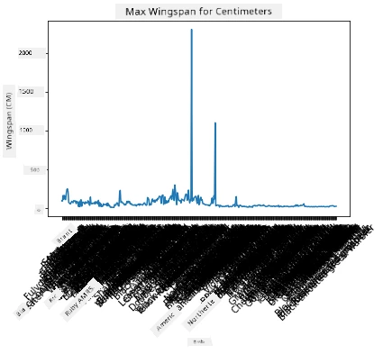
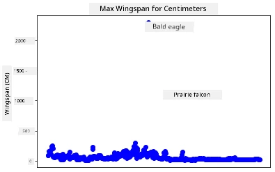
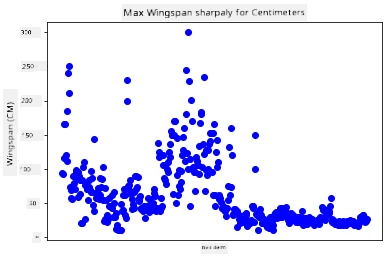
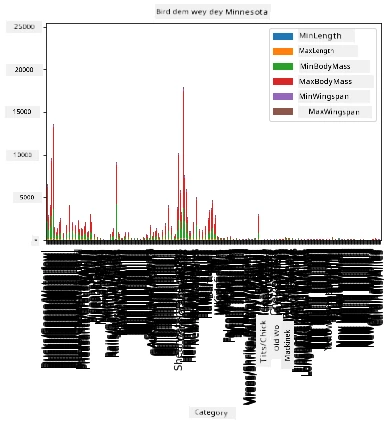

<!--
CO_OP_TRANSLATOR_METADATA:
{
  "original_hash": "a49d78e32e280c410f04e5f2a2068e77",
  "translation_date": "2025-11-18T18:56:43+00:00",
  "source_file": "3-Data-Visualization/09-visualization-quantities/README.md",
  "language_code": "pcm"
}
-->
# Visualizing Quantities

| ](../../sketchnotes/09-Visualizing-Quantities.png)|
|:---:|
| Visualizing Quantities - _Sketchnote by [@nitya](https://twitter.com/nitya)_ |

For dis lesson, you go learn how to use one Python library wey dey available to sabi how to create better visualizations wey dey focus on quantity. Using one clean dataset about birds wey dey Minnesota, you fit learn plenty interesting things about di local wildlife.  
## [Pre-lecture quiz](https://ff-quizzes.netlify.app/en/ds/quiz/16)

## Check wingspan with Matplotlib

One correct library wey fit help you create simple and advanced plots and charts na [Matplotlib](https://matplotlib.org/stable/index.html). Di general way to plot data with dis library na to first identify di part of your dataframe wey you wan use, do any transform wey di data need, assign di x and y axis values, decide di kind plot wey you wan show, and then show di plot. Matplotlib get plenty types of visualizations, but for dis lesson, we go focus on di ones wey dey good for visualizing quantity: line charts, scatterplots, and bar plots.

> ✅ Use di best chart wey go fit di structure of your data and di story wey you wan tell.  
> - To check trends wey dey happen over time: line  
> - To compare values: bar, column, pie, scatterplot  
> - To show how parts dey relate to di whole: pie  
> - To show how data dey spread: scatterplot, bar  
> - To show trends: line, column  
> - To show relationships between values: line, scatterplot, bubble  

If you get dataset and you wan find out how much of one item dey inside, di first thing wey you go do na to check di values.

✅ Matplotlib get correct 'cheat sheets' wey dey available [here](https://matplotlib.org/cheatsheets/cheatsheets.pdf).

## Create line plot for bird wingspan values

Open di `notebook.ipynb` file wey dey di root of dis lesson folder and add one cell.

> Note: di data dey di root of dis repo for di `/data` folder.

```python
import pandas as pd
import matplotlib.pyplot as plt
birds = pd.read_csv('../../data/birds.csv')
birds.head()
```
Dis data na mix of text and numbers:

|      | Name                         | ScientificName         | Category              | Order        | Family   | Genus       | ConservationStatus | MinLength | MaxLength | MinBodyMass | MaxBodyMass | MinWingspan | MaxWingspan |
| ---: | :--------------------------- | :--------------------- | :-------------------- | :----------- | :------- | :---------- | :----------------- | --------: | --------: | ----------: | ----------: | ----------: | ----------: |
|    0 | Black-bellied whistling-duck | Dendrocygna autumnalis | Ducks/Geese/Waterfowl | Anseriformes | Anatidae | Dendrocygna | LC                 |        47 |        56 |         652 |        1020 |          76 |          94 |
|    1 | Fulvous whistling-duck       | Dendrocygna bicolor    | Ducks/Geese/Waterfowl | Anseriformes | Anatidae | Dendrocygna | LC                 |        45 |        53 |         712 |        1050 |          85 |          93 |
|    2 | Snow goose                   | Anser caerulescens     | Ducks/Geese/Waterfowl | Anseriformes | Anatidae | Anser       | LC                 |        64 |        79 |        2050 |        4050 |         135 |         165 |
|    3 | Ross's goose                 | Anser rossii           | Ducks/Geese/Waterfowl | Anseriformes | Anatidae | Anser       | LC                 |      57.3 |        64 |        1066 |        1567 |         113 |         116 |
|    4 | Greater white-fronted goose  | Anser albifrons        | Ducks/Geese/Waterfowl | Anseriformes | Anatidae | Anser       | LC                 |        64 |        81 |        1930 |        3310 |         130 |         165 |

Make we start by plotting some of di numeric data using one basic line plot. Suppose you wan see di maximum wingspan for dis birds.

```python
wingspan = birds['MaxWingspan'] 
wingspan.plot()
```


Wetin you notice quick quick? E be like say one bird get wingspan wey dey very big - dat one na outlier! 2300 centimeter wingspan na 23 meters - abi na Pterodactyl dey fly for Minnesota? Make we check am.

Even though you fit use Excel to sort di data quick quick find di outliers, we go continue di visualization process from di plot.

Add labels to di x-axis to show di kind birds wey dey di data:

```
plt.title('Max Wingspan in Centimeters')
plt.ylabel('Wingspan (CM)')
plt.xlabel('Birds')
plt.xticks(rotation=45)
x = birds['Name'] 
y = birds['MaxWingspan']

plt.plot(x, y)

plt.show()
```


Even though we rotate di labels to 45 degrees, e still too much to read. Make we try another way: label only di outliers and put di labels inside di chart. You fit use scatter chart to get more space for di labeling:

```python
plt.title('Max Wingspan in Centimeters')
plt.ylabel('Wingspan (CM)')
plt.tick_params(axis='both',which='both',labelbottom=False,bottom=False)

for i in range(len(birds)):
    x = birds['Name'][i]
    y = birds['MaxWingspan'][i]
    plt.plot(x, y, 'bo')
    if birds['MaxWingspan'][i] > 500:
        plt.text(x, y * (1 - 0.05), birds['Name'][i], fontsize=12)
    
plt.show()
```
Wetindey happen here? You use `tick_params` to hide di bottom labels and then loop through di birds dataset. You plot di chart with small round blue dots by using `bo`, check for any bird wey get maximum wingspan wey pass 500, and display di label next to di dot. You shift di labels small for di y axis (`y * (1 - 0.05)`) and use di bird name as di label.

Wetin you discover?


## Filter your data

Di Bald Eagle and di Prairie Falcon, even though dem be big birds, e be like say di wingspan wey dem get na typo, dem add extra `0`. E no dey possible say Bald Eagle go get 25 meter wingspan, but if e dey possible, abeg tell us! Make we create new dataframe wey no go include di two outliers:

```python
plt.title('Max Wingspan in Centimeters')
plt.ylabel('Wingspan (CM)')
plt.xlabel('Birds')
plt.tick_params(axis='both',which='both',labelbottom=False,bottom=False)
for i in range(len(birds)):
    x = birds['Name'][i]
    y = birds['MaxWingspan'][i]
    if birds['Name'][i] not in ['Bald eagle', 'Prairie falcon']:
        plt.plot(x, y, 'bo')
plt.show()
```

By removing di outliers, di data go dey more clear and easy to understand.



Now wey di dataset don clean for di wingspan part, make we learn more about di birds.

Even though line and scatter plots fit show information about data values and how dem dey spread, we go wan think about di values wey dey di dataset. You fit create visualizations to answer dis questions about quantity:

> How many categories of birds dey, and how many dey each category?  
> How many birds dey extinct, endangered, rare, or common?  
> How many dey di different genus and orders for Linnaeus's terminology?  
## Explore bar charts

Bar charts dey useful when you wan show groupings of data. Make we check di categories of birds wey dey dis dataset to see which one dey plenty pass.

For di notebook file, create one basic bar chart.

✅ Note, you fit either remove di two outlier birds wey we find for di last section, correct di typo for their wingspan, or leave dem for dis exercises wey no depend on wingspan values.

If you wan create bar chart, you fit select di data wey you wan focus on. Bar charts fit dey created from raw data:

```python
birds.plot(x='Category',
        kind='bar',
        stacked=True,
        title='Birds of Minnesota')

```


Dis bar chart no dey clear because di data no dey grouped. You need to select only di data wey you wan plot, so make we check di length of birds based on their category.

Filter di data to include only di bird category.

✅ Notice say you dey use Pandas to manage di data, and then Matplotlib dey do di charting.

Since di categories plenty, you fit display di chart vertically and adjust di height to fit all di data:

```python
category_count = birds.value_counts(birds['Category'].values, sort=True)
plt.rcParams['figure.figsize'] = [6, 12]
category_count.plot.barh()
```


Dis bar chart dey show di number of birds for each category. You go quick see say di Ducks/Geese/Waterfowl category get di highest number of birds. Minnesota na 'land of 10,000 lakes' so e no dey surprising!

✅ Try some other counts for dis dataset. Wetin surprise you?

## Comparing data

You fit try different comparisons of grouped data by creating new axes. Try compare di MaxLength of birds based on their category:

```python
maxlength = birds['MaxLength']
plt.barh(y=birds['Category'], width=maxlength)
plt.rcParams['figure.figsize'] = [6, 12]
plt.show()
```


Nothing dey surprising here: hummingbirds get di least MaxLength compared to Pelicans or Geese. E dey good when data dey make sense!

You fit create more interesting bar charts by putting data together. Make we put Minimum and Maximum Length together for di bird categories:

```python
minLength = birds['MinLength']
maxLength = birds['MaxLength']
category = birds['Category']

plt.barh(category, maxLength)
plt.barh(category, minLength)

plt.show()
```
For dis plot, you fit see di range per bird category for Minimum Length and Maximum Length. You fit talk say, based on dis data, di bigger di bird, di larger di length range. E dey interesting!


## 🚀 Challenge

Dis bird dataset get plenty information about different types of birds wey dey one ecosystem. Search online to see if you fit find other bird datasets. Practice how to build charts and graphs for di birds to discover things wey you no sabi before.

## [Post-lecture quiz](https://ff-quizzes.netlify.app/en/ds/quiz/17)

## Review & Self Study

Dis first lesson don show you small about how to use Matplotlib to visualize quantities. Do some research about other ways to work with datasets for visualization. [Plotly](https://github.com/plotly/plotly.py) na one wey we no go cover for dis lessons, so check wetin e fit do.  
## Assignment

[Lines, Scatters, and Bars](assignment.md)

---

<!-- CO-OP TRANSLATOR DISCLAIMER START -->
**Disclaimer**:  
Dis dokyument don use AI transle-shon service [Co-op Translator](https://github.com/Azure/co-op-translator) do di transle-shon. Even as we dey try make am correct, abeg make you sabi say AI transle-shon fit get mistake or no dey accurate well. Di original dokyument wey dey for im native language na di one wey you go take as di correct source. For important mata, e good make you use professional human transle-shon. We no go fit take blame for any misunderstanding or wrong interpretation wey fit happen because you use dis transle-shon.
<!-- CO-OP TRANSLATOR DISCLAIMER END -->