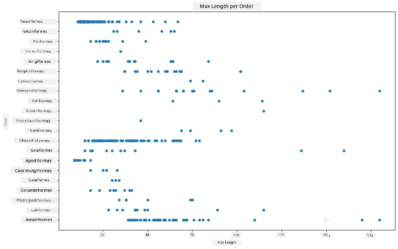
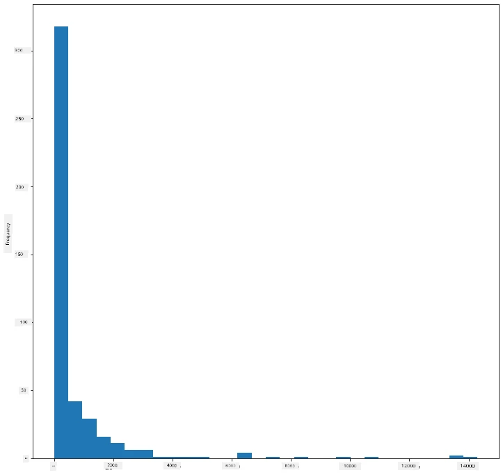
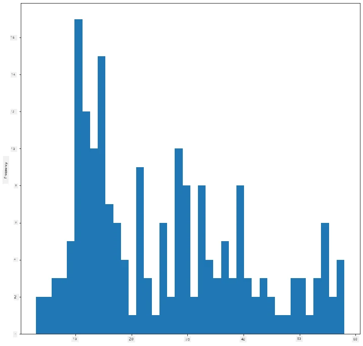
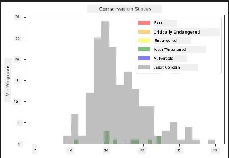
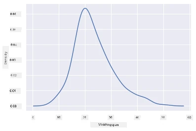
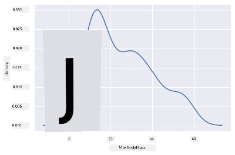
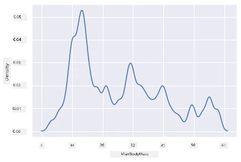

<!--
CO_OP_TRANSLATOR_METADATA:
{
  "original_hash": "80a20467e046d312809d008395051fc7",
  "translation_date": "2025-11-18T18:44:27+00:00",
  "source_file": "3-Data-Visualization/10-visualization-distributions/README.md",
  "language_code": "pcm"
}
-->
# Visualizing Distributions

| ](../../sketchnotes/10-Visualizing-Distributions.png)|
|:---:|
| Visualizing Distributions - _Sketchnote by [@nitya](https://twitter.com/nitya)_ |

For di last lesson, you don learn some interestin tins about one dataset wey dey talk about di birds wey dey Minnesota. You don find some wrong data by using outliers to visualize am, and you don check di difference wey dey between di bird categories based on dia maximum length.

## [Pre-lecture quiz](https://ff-quizzes.netlify.app/en/ds/quiz/18)
## Explore di birds dataset

Another way wey you fit take dig into data na to look how e dey spread, or how di data dey arrange along one axis. Maybe, for example, you wan sabi di general distribution for dis dataset, of di maximum wingspan or maximum body mass for di birds wey dey Minnesota.

Make we find some facts about di distributions of data wey dey dis dataset. For di _notebook.ipynb_ file wey dey di root of dis lesson folder, import Pandas, Matplotlib, and your data:

```python
import pandas as pd
import matplotlib.pyplot as plt
birds = pd.read_csv('../../data/birds.csv')
birds.head()
```

|      | Name                         | ScientificName         | Category              | Order        | Family   | Genus       | ConservationStatus | MinLength | MaxLength | MinBodyMass | MaxBodyMass | MinWingspan | MaxWingspan |
| ---: | :--------------------------- | :--------------------- | :-------------------- | :----------- | :------- | :---------- | :----------------- | --------: | --------: | ----------: | ----------: | ----------: | ----------: |
|    0 | Black-bellied whistling-duck | Dendrocygna autumnalis | Ducks/Geese/Waterfowl | Anseriformes | Anatidae | Dendrocygna | LC                 |        47 |        56 |         652 |        1020 |          76 |          94 |
|    1 | Fulvous whistling-duck       | Dendrocygna bicolor    | Ducks/Geese/Waterfowl | Anseriformes | Anatidae | Dendrocygna | LC                 |        45 |        53 |         712 |        1050 |          85 |          93 |
|    2 | Snow goose                   | Anser caerulescens     | Ducks/Geese/Waterfowl | Anseriformes | Anatidae | Anser       | LC                 |        64 |        79 |        2050 |        4050 |         135 |         165 |
|    3 | Ross's goose                 | Anser rossii           | Ducks/Geese/Waterfowl | Anseriformes | Anatidae | Anser       | LC                 |      57.3 |        64 |        1066 |        1567 |         113 |         116 |
|    4 | Greater white-fronted goose  | Anser albifrons        | Ducks/Geese/Waterfowl | Anseriformes | Anatidae | Anser       | LC                 |        64 |        81 |        1930 |        3310 |         130 |         165 |

Normally, you fit quick look how di data dey spread by using scatter plot like we do for di last lesson:

```python
birds.plot(kind='scatter',x='MaxLength',y='Order',figsize=(12,8))

plt.title('Max Length per Order')
plt.ylabel('Order')
plt.xlabel('Max Length')

plt.show()
```


Dis one dey give overview of di general distribution of body length per bird Order, but e no be di best way to show true distributions. Di work wey dey fit dis one na to create Histogram.
## Working with histograms

Matplotlib get better ways to show data distribution using Histograms. Dis type of chart be like bar chart wey di distribution go show as di bars dey rise and fall. To build histogram, you need numeric data. To build Histogram, you fit plot chart wey you go define di kind as 'hist' for Histogram. Dis chart dey show di distribution of MaxBodyMass for di whole dataset range of numeric data. By dividing di array of data wey e get into smaller bins, e fit show di distribution of di data values:

```python
birds['MaxBodyMass'].plot(kind = 'hist', bins = 10, figsize = (12,12))
plt.show()
```


As you fit see, most of di 400+ birds wey dey dis dataset dey fall for di range wey dey under 2000 for dia Max Body Mass. You fit get more insight for di data by changing di `bins` parameter to higher number, like 30:

```python
birds['MaxBodyMass'].plot(kind = 'hist', bins = 30, figsize = (12,12))
plt.show()
```


Dis chart dey show di distribution in more detailed way. You fit create chart wey no go dey too skewed to di left by making sure say you only select data wey dey inside one given range:

Filter your data make e only show birds wey dia body mass dey under 60, and show 40 `bins`:

```python
filteredBirds = birds[(birds['MaxBodyMass'] > 1) & (birds['MaxBodyMass'] < 60)]      
filteredBirds['MaxBodyMass'].plot(kind = 'hist',bins = 40,figsize = (12,12))
plt.show()     
```


✅ Try some other filters and data points. To see di full distribution of di data, remove di `['MaxBodyMass']` filter to show labeled distributions.

Di histogram get some nice color and labeling enhancements wey you fit try too:

Create 2D histogram to compare di relationship wey dey between two distributions. Make we compare `MaxBodyMass` vs. `MaxLength`. Matplotlib get built-in way to show convergence using brighter colors:

```python
x = filteredBirds['MaxBodyMass']
y = filteredBirds['MaxLength']

fig, ax = plt.subplots(tight_layout=True)
hist = ax.hist2d(x, y)
```
E be like say di correlation wey dey between dis two elements dey follow di expected axis, with one strong point of convergence:


Histograms dey work well by default for numeric data. Wetin you go do if you wan see distributions based on text data? 
## Explore di dataset for distributions using text data 

Dis dataset get better information about di bird category and dia genus, species, and family as well as dia conservation status. Make we dig into dis conservation information. Wetin be di distribution of di birds based on dia conservation status?

> ✅ For di dataset, dem dey use some acronyms to describe conservation status. Dis acronyms dey come from di [IUCN Red List Categories](https://www.iucnredlist.org/), one organization wey dey catalog species' status.
> 
> - CR: Critically Endangered
> - EN: Endangered
> - EX: Extinct
> - LC: Least Concern
> - NT: Near Threatened
> - VU: Vulnerable

Dis na text-based values so you go need to do transform to create histogram. Using di filteredBirds dataframe, show dia conservation status alongside dia Minimum Wingspan. Wetin you see? 

```python
x1 = filteredBirds.loc[filteredBirds.ConservationStatus=='EX', 'MinWingspan']
x2 = filteredBirds.loc[filteredBirds.ConservationStatus=='CR', 'MinWingspan']
x3 = filteredBirds.loc[filteredBirds.ConservationStatus=='EN', 'MinWingspan']
x4 = filteredBirds.loc[filteredBirds.ConservationStatus=='NT', 'MinWingspan']
x5 = filteredBirds.loc[filteredBirds.ConservationStatus=='VU', 'MinWingspan']
x6 = filteredBirds.loc[filteredBirds.ConservationStatus=='LC', 'MinWingspan']

kwargs = dict(alpha=0.5, bins=20)

plt.hist(x1, **kwargs, color='red', label='Extinct')
plt.hist(x2, **kwargs, color='orange', label='Critically Endangered')
plt.hist(x3, **kwargs, color='yellow', label='Endangered')
plt.hist(x4, **kwargs, color='green', label='Near Threatened')
plt.hist(x5, **kwargs, color='blue', label='Vulnerable')
plt.hist(x6, **kwargs, color='gray', label='Least Concern')

plt.gca().set(title='Conservation Status', ylabel='Min Wingspan')
plt.legend();
```



E no dey look like say good correlation dey between minimum wingspan and conservation status. Test other elements of di dataset using dis method. You fit try different filters too. You see any correlation?

## Density plots

You fit don notice say di histograms wey we don look so far dey 'stepped' and e no dey flow smooth for arc. To show smoother density chart, you fit try density plot.

To work with density plots, make you sabi one new plotting library, [Seaborn](https://seaborn.pydata.org/generated/seaborn.kdeplot.html). 

Load Seaborn, try one basic density plot:

```python
import seaborn as sns
import matplotlib.pyplot as plt
sns.kdeplot(filteredBirds['MinWingspan'])
plt.show()
```


You fit see how di plot dey resemble di previous one for Minimum Wingspan data; e just dey smoother small. According to Seaborn documentation, "Relative to a histogram, KDE fit produce plot wey no go dey too crowded and e go dey easy to understand, especially when you dey draw multiple distributions. But e fit introduce distortions if di underlying distribution dey bounded or e no smooth. Like histogram, di quality of di representation still depend on di selection of good smoothing parameters." [source](https://seaborn.pydata.org/generated/seaborn.kdeplot.html) In other words, outliers as usual go make your charts misbehave.

If you wan revisit dat jagged MaxBodyMass line for di second chart wey you build, you fit smooth am well by recreating am using dis method:

```python
sns.kdeplot(filteredBirds['MaxBodyMass'])
plt.show()
```


If you wan smooth line wey no go too smooth, edit di `bw_adjust` parameter: 

```python
sns.kdeplot(filteredBirds['MaxBodyMass'], bw_adjust=.2)
plt.show()
```


✅ Read about di parameters wey dey available for dis type of plot and experiment!

Dis type of chart dey offer better explanatory visualizations. With few lines of code, for example, you fit show di max body mass density per bird Order:

```python
sns.kdeplot(
   data=filteredBirds, x="MaxBodyMass", hue="Order",
   fill=True, common_norm=False, palette="crest",
   alpha=.5, linewidth=0,
)
```


You fit also map di density of plenty variables for one chart. Test di MaxLength and MinLength of bird compared to dia conservation status:

```python
sns.kdeplot(data=filteredBirds, x="MinLength", y="MaxLength", hue="ConservationStatus")
```


Maybe e go make sense to research whether di cluster of 'Vulnerable' birds based on dia lengths dey meaningful or not.

## 🚀 Challenge

Histograms na more advanced type of chart compared to basic scatterplots, bar charts, or line charts. Go search for di internet to find better examples of how dem dey use histograms. How dem dey use am, wetin dem dey show, and for which fields or areas dem dey use am well?

## [Post-lecture quiz](https://ff-quizzes.netlify.app/en/ds/quiz/19)

## Review & Self Study

For dis lesson, you don use Matplotlib and you don start to work with Seaborn to show more advanced charts. Do some research on `kdeplot` for Seaborn, one "continuous probability density curve for one or more dimensions". Read di [documentation](https://seaborn.pydata.org/generated/seaborn.kdeplot.html) to understand how e dey work.

## Assignment

[Apply your skills](assignment.md)

---

<!-- CO-OP TRANSLATOR DISCLAIMER START -->
**Disclaimer**:  
Dis dokyument don use AI transle-shon service [Co-op Translator](https://github.com/Azure/co-op-translator) do di transle-shon. Even as we dey try make am accurate, abeg make you sabi say transle-shon wey machine do fit get mistake or no correct well. Di original dokyument for im native language na di one wey you go take as di correct source. For important mata, e good make you use professional human transle-shon. We no go fit take blame for any misunderstanding or wrong interpretation wey fit happen because you use dis transle-shon.
<!-- CO-OP TRANSLATOR DISCLAIMER END -->