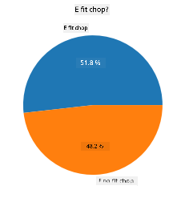
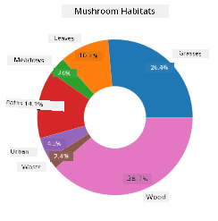
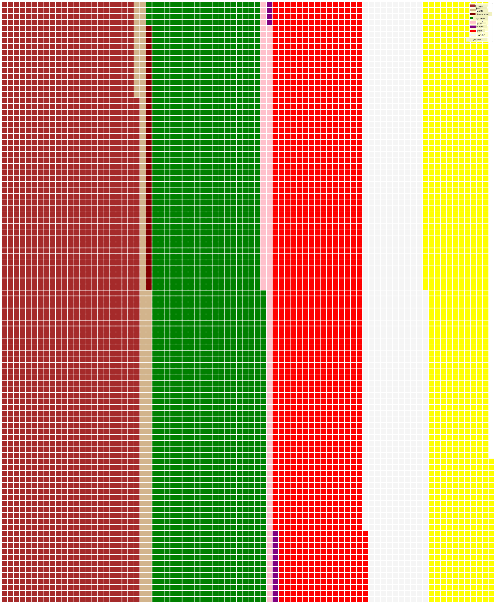

<!--
CO_OP_TRANSLATOR_METADATA:
{
  "original_hash": "42119bcc97bee88254e381156d770f3c",
  "translation_date": "2025-11-18T18:45:40+00:00",
  "source_file": "3-Data-Visualization/11-visualization-proportions/README.md",
  "language_code": "pcm"
}
-->
# Visualizing Proportions

| ](../../sketchnotes/11-Visualizing-Proportions.png)|
|:---:|
|Visualizing Proportions - _Sketchnote by [@nitya](https://twitter.com/nitya)_ |

For dis lesson, you go use one dataset wey dey focus on nature to show proportions, like how many different types of fungi dey inside one dataset about mushrooms. Make we check dis fungi wey dey interesting well-well using one dataset wey Audubon provide, wey get details about 23 species of gilled mushrooms for Agaricus and Lepiota families. You go try some sweet visualizations like:

- Pie charts 🥧
- Donut charts 🍩
- Waffle charts 🧇

> 💡 One project wey dey very interesting na [Charticulator](https://charticulator.com) wey Microsoft Research do. E dey free and e get drag and drop interface for data visualizations. For one of their tutorials, dem use dis mushroom dataset! So you fit check the data and learn the library at the same time: [Charticulator tutorial](https://charticulator.com/tutorials/tutorial4.html).

## [Pre-lecture quiz](https://ff-quizzes.netlify.app/en/ds/quiz/20)

## Know your mushrooms 🍄

Mushrooms dey very interesting. Make we import one dataset to study dem:

```python
import pandas as pd
import matplotlib.pyplot as plt
mushrooms = pd.read_csv('../../data/mushrooms.csv')
mushrooms.head()
```
One table go show with some correct data for analysis:


| class     | cap-shape | cap-surface | cap-color | bruises | odor    | gill-attachment | gill-spacing | gill-size | gill-color | stalk-shape | stalk-root | stalk-surface-above-ring | stalk-surface-below-ring | stalk-color-above-ring | stalk-color-below-ring | veil-type | veil-color | ring-number | ring-type | spore-print-color | population | habitat |
| --------- | --------- | ----------- | --------- | ------- | ------- | --------------- | ------------ | --------- | ---------- | ----------- | ---------- | ------------------------ | ------------------------ | ---------------------- | ---------------------- | --------- | ---------- | ----------- | --------- | ----------------- | ---------- | ------- |
| Poisonous | Convex    | Smooth      | Brown     | Bruises | Pungent | Free            | Close        | Narrow    | Black      | Enlarging   | Equal      | Smooth                   | Smooth                   | White                  | White                  | Partial   | White      | One         | Pendant   | Black             | Scattered  | Urban   |
| Edible    | Convex    | Smooth      | Yellow    | Bruises | Almond  | Free            | Close        | Broad     | Black      | Enlarging   | Club       | Smooth                   | Smooth                   | White                  | White                  | Partial   | White      | One         | Pendant   | Brown             | Numerous   | Grasses |
| Edible    | Bell      | Smooth      | White     | Bruises | Anise   | Free            | Close        | Broad     | Brown      | Enlarging   | Club       | Smooth                   | Smooth                   | White                  | White                  | Partial   | White      | One         | Pendant   | Brown             | Numerous   | Meadows |
| Poisonous | Convex    | Scaly       | White     | Bruises | Pungent | Free            | Close        | Narrow    | Brown      | Enlarging   | Equal      | Smooth                   | Smooth                   | White                  | White                  | Partial   | White      | One         | Pendant   | Black             | Scattered  | Urban   |

As you dey look am, you go notice say all the data na text. You go need change dis data so you fit use am for chart. Most of the data sef dey as object:

```python
print(mushrooms.select_dtypes(["object"]).columns)
```

The output na:

```output
Index(['class', 'cap-shape', 'cap-surface', 'cap-color', 'bruises', 'odor',
       'gill-attachment', 'gill-spacing', 'gill-size', 'gill-color',
       'stalk-shape', 'stalk-root', 'stalk-surface-above-ring',
       'stalk-surface-below-ring', 'stalk-color-above-ring',
       'stalk-color-below-ring', 'veil-type', 'veil-color', 'ring-number',
       'ring-type', 'spore-print-color', 'population', 'habitat'],
      dtype='object')
```
Take dis data and change the 'class' column to category:

```python
cols = mushrooms.select_dtypes(["object"]).columns
mushrooms[cols] = mushrooms[cols].astype('category')
```

```python
edibleclass=mushrooms.groupby(['class']).count()
edibleclass
```

Now, if you print the mushrooms data, you go see say e don group into categories based on the poisonous/edible class:


|           | cap-shape | cap-surface | cap-color | bruises | odor | gill-attachment | gill-spacing | gill-size | gill-color | stalk-shape | ... | stalk-surface-below-ring | stalk-color-above-ring | stalk-color-below-ring | veil-type | veil-color | ring-number | ring-type | spore-print-color | population | habitat |
| --------- | --------- | ----------- | --------- | ------- | ---- | --------------- | ------------ | --------- | ---------- | ----------- | --- | ------------------------ | ---------------------- | ---------------------- | --------- | ---------- | ----------- | --------- | ----------------- | ---------- | ------- |
| class     |           |             |           |         |      |                 |              |           |            |             |     |                          |                        |                        |           |            |             |           |                   |            |         |
| Edible    | 4208      | 4208        | 4208      | 4208    | 4208 | 4208            | 4208         | 4208      | 4208       | 4208        | ... | 4208                     | 4208                   | 4208                   | 4208      | 4208       | 4208        | 4208      | 4208              | 4208       | 4208    |
| Poisonous | 3916      | 3916        | 3916      | 3916    | 3916 | 3916            | 3916         | 3916      | 3916       | 3916        | ... | 3916                     | 3916                   | 3916                   | 3916      | 3916       | 3916        | 3916      | 3916              | 3916       | 3916    |

If you follow the order wey dey for dis table to create your class category labels, you fit build one pie chart:

## Pie!

```python
labels=['Edible','Poisonous']
plt.pie(edibleclass['population'],labels=labels,autopct='%.1f %%')
plt.title('Edible?')
plt.show()
```
Voila, one pie chart wey dey show the proportions of dis data based on dis two classes of mushrooms. E dey very important to arrange the labels well, especially for here, so make sure say you check the order wey you take build the label array!



## Donuts!

One pie chart wey dey look more interesting na donut chart, wey be pie chart wey get hole for middle. Make we check our data with dis method.

Look the different habitats wey mushrooms dey grow:

```python
habitat=mushrooms.groupby(['habitat']).count()
habitat
```
For here, you dey group your data by habitat. Dem get 7 listed, so use dem as labels for your donut chart:

```python
labels=['Grasses','Leaves','Meadows','Paths','Urban','Waste','Wood']

plt.pie(habitat['class'], labels=labels,
        autopct='%1.1f%%', pctdistance=0.85)
  
center_circle = plt.Circle((0, 0), 0.40, fc='white')
fig = plt.gcf()

fig.gca().add_artist(center_circle)
  
plt.title('Mushroom Habitats')
  
plt.show()
```



Dis code dey draw one chart and one center circle, then e go add dat center circle for the chart. You fit change the width of the center circle by editing `0.40` to another value.

Donut charts fit change in different ways to make the labels dey clear. The labels fit dey highlighted to make dem easy to read. Learn more for the [docs](https://matplotlib.org/stable/gallery/pie_and_polar_charts/pie_and_donut_labels.html?highlight=donut).

Now wey you sabi how to group your data and show am as pie or donut, you fit try other types of charts. Try waffle chart, wey be another way to show quantity.

## Waffles!

Waffle chart na another way to show quantities as 2D array of squares. Try show the different quantities of mushroom cap colors for dis dataset. To do dis, you go need install one helper library wey dem call [PyWaffle](https://pypi.org/project/pywaffle/) and use Matplotlib:

```python
pip install pywaffle
```

Select one part of your data to group:

```python
capcolor=mushrooms.groupby(['cap-color']).count()
capcolor
```

Create one waffle chart by creating labels and then grouping your data:

```python
import pandas as pd
import matplotlib.pyplot as plt
from pywaffle import Waffle
  
data ={'color': ['brown', 'buff', 'cinnamon', 'green', 'pink', 'purple', 'red', 'white', 'yellow'],
    'amount': capcolor['class']
     }
  
df = pd.DataFrame(data)
  
fig = plt.figure(
    FigureClass = Waffle,
    rows = 100,
    values = df.amount,
    labels = list(df.color),
    figsize = (30,30),
    colors=["brown", "tan", "maroon", "green", "pink", "purple", "red", "whitesmoke", "yellow"],
)
```

With waffle chart, you fit see the proportions of cap colors for dis mushrooms dataset. E dey interesting say plenty green-capped mushrooms dey!



✅ Pywaffle dey support icons inside the charts wey fit use any icon wey dey [Font Awesome](https://fontawesome.com/). Try experiment to create one more interesting waffle chart wey go use icons instead of squares.

For dis lesson, you don learn three ways to show proportions. First, you go group your data into categories, then decide the best way to show the data - pie, donut, or waffle. All of dem dey sweet and dey give the user quick snapshot of the dataset.

## 🚀 Challenge

Try recreate dis sweet charts for [Charticulator](https://charticulator.com).
## [Post-lecture quiz](https://ff-quizzes.netlify.app/en/ds/quiz/21)

## Review & Self Study

Sometimes e no dey clear when to use pie, donut, or waffle chart. Check dis articles to read more about dis matter:

https://www.beautiful.ai/blog/battle-of-the-charts-pie-chart-vs-donut-chart

https://medium.com/@hypsypops/pie-chart-vs-donut-chart-showdown-in-the-ring-5d24fd86a9ce

https://www.mit.edu/~mbarker/formula1/f1help/11-ch-c6.htm

https://medium.datadriveninvestor.com/data-visualization-done-the-right-way-with-tableau-waffle-chart-fdf2a19be402

Do some research to find more information about dis decision wey dey sticky.

## Assignment

[Try am for Excel](assignment.md)

---

<!-- CO-OP TRANSLATOR DISCLAIMER START -->
**Disclaimer**:  
Dis dokyument don translate wit AI translation service [Co-op Translator](https://github.com/Azure/co-op-translator). Even as we dey try make am accurate, abeg sabi say machine translation fit get mistake or no correct well. Di original dokyument for im native language na di main source wey you go trust. For important mata, na beta make you use professional human translation. We no go fit take blame for any misunderstanding or wrong interpretation wey fit happen because you use dis translation.
<!-- CO-OP TRANSLATOR DISCLAIMER END -->