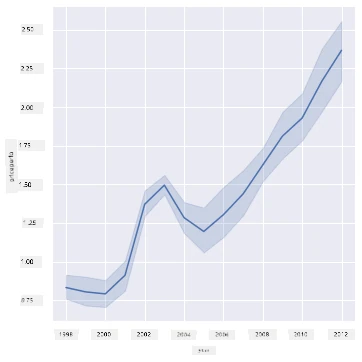
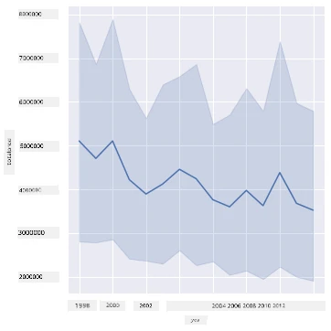
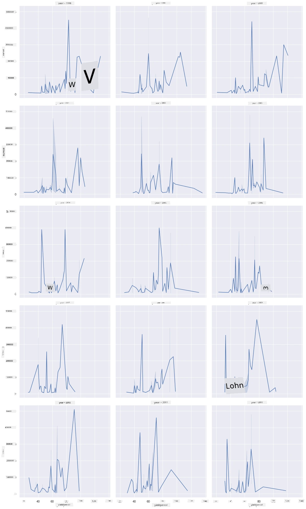
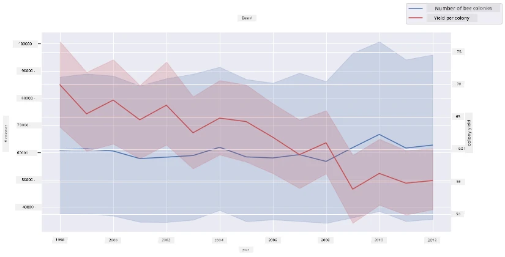

<!--
CO_OP_TRANSLATOR_METADATA:
{
  "original_hash": "0764fd4077f3f04a1d968ec371227744",
  "translation_date": "2025-11-18T18:55:37+00:00",
  "source_file": "3-Data-Visualization/12-visualization-relationships/README.md",
  "language_code": "pcm"
}
-->
# Visualizing Relationships: All About Honey 🍯

| ](../../sketchnotes/12-Visualizing-Relationships.png)|
|:---:|
|Visualizing Relationships - _Sketchnote by [@nitya](https://twitter.com/nitya)_ |

As we dey continue wit di nature focus for our research, make we check beta ways to show di relationship wey dey between different kain honey, based on one dataset wey come from di [United States Department of Agriculture](https://www.nass.usda.gov/About_NASS/index.php). 

Dis dataset get about 600 items wey dey show honey production for plenty U.S. states. For example, you fit look di number of colonies, yield per colony, total production, stocks, price per pound, and di value of di honey wey dem produce for one state from 1998-2012, wit one row per year for each state. 

E go dey interesting to show di relationship wey dey between di production for one state per year and di price of honey for dat state. Or you fit show di relationship wey dey between di honey yield per colony for different states. Dis year range cover di time wey 'CCD' or 'Colony Collapse Disorder' first show for 2006 (http://npic.orst.edu/envir/ccd.html), so na one important dataset to study. 🐝

## [Pre-lecture quiz](https://ff-quizzes.netlify.app/en/ds/quiz/22)

For dis lesson, you fit use Seaborn, wey you don use before, as one good library to show di relationship wey dey between variables. Di `relplot` function for Seaborn dey very useful to create scatter plots and line plots wey go help you quickly show '[statistical relationships](https://seaborn.pydata.org/tutorial/relational.html?highlight=relationships)', wey go help data scientist understand how di variables dey relate to each other.

## Scatterplots

Use scatterplot to show how di price of honey don change year by year for each state. Seaborn, wit `relplot`, dey group di state data well and e dey show data points for both categorical and numeric data. 

Make we start by importing di data and Seaborn:

```python
import pandas as pd
import matplotlib.pyplot as plt
import seaborn as sns
honey = pd.read_csv('../../data/honey.csv')
honey.head()
```
You go notice say di honey data get plenty interesting columns, like year and price per pound. Make we check dis data, grouped by U.S. state:

| state | numcol | yieldpercol | totalprod | stocks   | priceperlb | prodvalue | year |
| ----- | ------ | ----------- | --------- | -------- | ---------- | --------- | ---- |
| AL    | 16000  | 71          | 1136000   | 159000   | 0.72       | 818000    | 1998 |
| AZ    | 55000  | 60          | 3300000   | 1485000  | 0.64       | 2112000   | 1998 |
| AR    | 53000  | 65          | 3445000   | 1688000  | 0.59       | 2033000   | 1998 |
| CA    | 450000 | 83          | 37350000  | 12326000 | 0.62       | 23157000  | 1998 |
| CO    | 27000  | 72          | 1944000   | 1594000  | 0.7        | 1361000   | 1998 |

Create one basic scatterplot to show di relationship wey dey between di price per pound of honey and di U.S. state wey e come from. Make di `y` axis tall enough to show all di states:

```python
sns.relplot(x="priceperlb", y="state", data=honey, height=15, aspect=.5);
```


Now, show di same data wit honey color scheme to show how di price don change over di years. You fit do dis by adding 'hue' parameter to show di change year by year:

> ✅ Learn more about di [color palettes wey you fit use for Seaborn](https://seaborn.pydata.org/tutorial/color_palettes.html) - try one fine rainbow color scheme!

```python
sns.relplot(x="priceperlb", y="state", hue="year", palette="YlOrBr", data=honey, height=15, aspect=.5);
```


Wit dis color scheme change, you fit see say di price of honey don dey increase over di years. If you check one sample set for di data to confirm (like Arizona for example), you go see say di price dey increase year by year, wit small exceptions:

| state | numcol | yieldpercol | totalprod | stocks  | priceperlb | prodvalue | year |
| ----- | ------ | ----------- | --------- | ------- | ---------- | --------- | ---- |
| AZ    | 55000  | 60          | 3300000   | 1485000 | 0.64       | 2112000   | 1998 |
| AZ    | 52000  | 62          | 3224000   | 1548000 | 0.62       | 1999000   | 1999 |
| AZ    | 40000  | 59          | 2360000   | 1322000 | 0.73       | 1723000   | 2000 |
| AZ    | 43000  | 59          | 2537000   | 1142000 | 0.72       | 1827000   | 2001 |
| AZ    | 38000  | 63          | 2394000   | 1197000 | 1.08       | 2586000   | 2002 |
| AZ    | 35000  | 72          | 2520000   | 983000  | 1.34       | 3377000   | 2003 |
| AZ    | 32000  | 55          | 1760000   | 774000  | 1.11       | 1954000   | 2004 |
| AZ    | 36000  | 50          | 1800000   | 720000  | 1.04       | 1872000   | 2005 |
| AZ    | 30000  | 65          | 1950000   | 839000  | 0.91       | 1775000   | 2006 |
| AZ    | 30000  | 64          | 1920000   | 902000  | 1.26       | 2419000   | 2007 |
| AZ    | 25000  | 64          | 1600000   | 336000  | 1.26       | 2016000   | 2008 |
| AZ    | 20000  | 52          | 1040000   | 562000  | 1.45       | 1508000   | 2009 |
| AZ    | 24000  | 77          | 1848000   | 665000  | 1.52       | 2809000   | 2010 |
| AZ    | 23000  | 53          | 1219000   | 427000  | 1.55       | 1889000   | 2011 |
| AZ    | 22000  | 46          | 1012000   | 253000  | 1.79       | 1811000   | 2012 |

Another way to show dis progression na to use size instead of color. For people wey no fit see color well, dis one go better. Edit your visualization to show di increase of price by di increase in dot size:

```python
sns.relplot(x="priceperlb", y="state", size="year", data=honey, height=15, aspect=.5);
```
You go see say di size of di dots dey increase small small.


E be like say na supply and demand dey cause dis? Abi na climate change and colony collapse dey make honey dey reduce year by year, wey make di price dey go up?

To find di correlation wey dey between some of di variables for dis dataset, make we check some line charts.

## Line charts

Question: Di price of honey per pound dey rise year by year? You fit check dis easily by creating one single line chart:

```python
sns.relplot(x="year", y="priceperlb", kind="line", data=honey);
```
Answer: Yes, wit small exceptions around di year 2003:



✅ Because Seaborn dey group di data around one line, e dey show "di multiple measurements for each x value by plotting di mean and di 95% confidence interval around di mean". [Source](https://seaborn.pydata.org/tutorial/relational.html). You fit stop dis behavior by adding `ci=None`.

Question: For 2003, we fit see say di honey supply increase? Wetin go happen if you check total production year by year?

```python
sns.relplot(x="year", y="totalprod", kind="line", data=honey);
```



Answer: E no really show. If you check total production, e be like say e increase for dat year, even though generally di amount of honey wey dem dey produce dey reduce for dis years.

Question: So wetin fit cause di spike for di price of honey around 2003? 

To find dis, you fit use facet grid.

## Facet grids

Facet grids dey take one part of your dataset (for dis case, you fit choose 'year' so e no go too plenty). Seaborn fit make one plot for each of di facets wey you choose for x and y coordinates so e go dey easy to compare. 2003 go stand out for dis kain comparison?

Create one facet grid by using `relplot` as Seaborn recommend for [their documentation](https://seaborn.pydata.org/generated/seaborn.FacetGrid.html?highlight=facetgrid#seaborn.FacetGrid). 

```python
sns.relplot(
    data=honey, 
    x="yieldpercol", y="numcol",
    col="year", 
    col_wrap=3,
    kind="line"
    )
```
For dis visualization, you fit compare di yield per colony and number of colonies year by year, side by side wit wrap set at 3 for di columns:



For dis dataset, nothing special dey show for di number of colonies and their yield year by year and state by state. We fit look di correlation between dis two variables in another way?

## Dual-line Plots

Try multiline plot by putting two lineplots on top of each other, use Seaborn's 'despine' to remove di top and right spines, and use `ax.twinx` [from Matplotlib](https://matplotlib.org/stable/api/_as_gen/matplotlib.axes.Axes.twinx.html). Twinx dey allow chart to share di x axis and show two y axes. So, show di yield per colony and number of colonies together:

```python
fig, ax = plt.subplots(figsize=(12,6))
lineplot = sns.lineplot(x=honey['year'], y=honey['numcol'], data=honey, 
                        label = 'Number of bee colonies', legend=False)
sns.despine()
plt.ylabel('# colonies')
plt.title('Honey Production Year over Year');

ax2 = ax.twinx()
lineplot2 = sns.lineplot(x=honey['year'], y=honey['yieldpercol'], ax=ax2, color="r", 
                         label ='Yield per colony', legend=False) 
sns.despine(right=False)
plt.ylabel('colony yield')
ax.figure.legend();
```


Even though nothing dey obvious for di year 2003, e dey show say di number of colonies dey stabilize even though their yield per colony dey reduce.

Go, bees, go!

🐝❤️
## 🚀 Challenge

For dis lesson, you don learn more about how to use scatterplots and line grids, including facet grids. Try create one facet grid wit another dataset, maybe one wey you don use before for dis lessons. Note how long e dey take to create and how you need to dey careful about di number of grids wey you dey draw wit dis techniques.

## [Post-lecture quiz](https://ff-quizzes.netlify.app/en/ds/quiz/23)

## Review & Self Study

Line plots fit dey simple or dey complex. Read more for di [Seaborn documentation](https://seaborn.pydata.org/generated/seaborn.lineplot.html) about di different ways wey you fit build dem. Try improve di line charts wey you don build for dis lesson wit other methods wey dey for di docs.
## Assignment

[Dive into the beehive](assignment.md)

---

<!-- CO-OP TRANSLATOR DISCLAIMER START -->
**Disclaimer**:  
Dis dokyument don use AI translet service [Co-op Translator](https://github.com/Azure/co-op-translator) do di translet. Even as we dey try make am correct, abeg sabi say AI translet fit get mistake or no dey accurate well. Di original dokyument for im native language na di one wey you go take as di correct source. For important mata, e good make professional human translet am. We no go fit take blame for any misunderstanding or wrong interpretation wey fit happen because you use dis translet.
<!-- CO-OP TRANSLATOR DISCLAIMER END -->