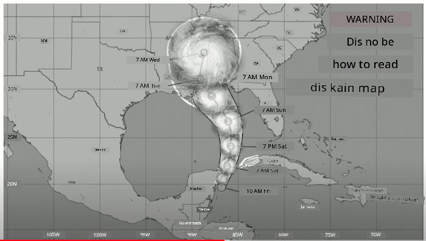
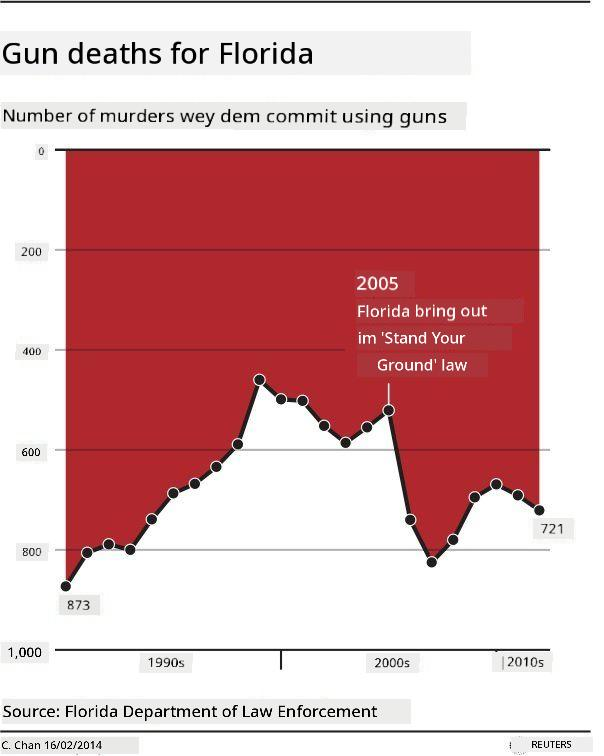
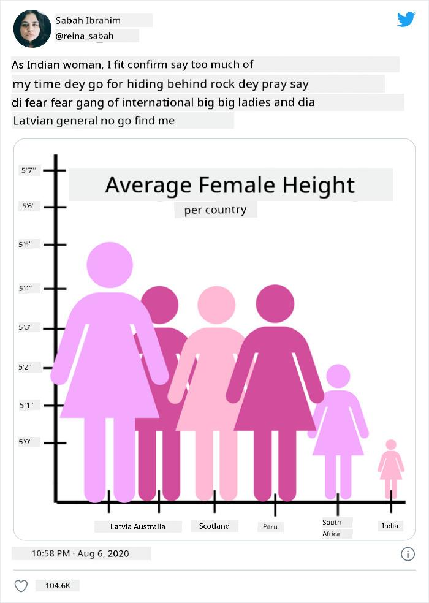
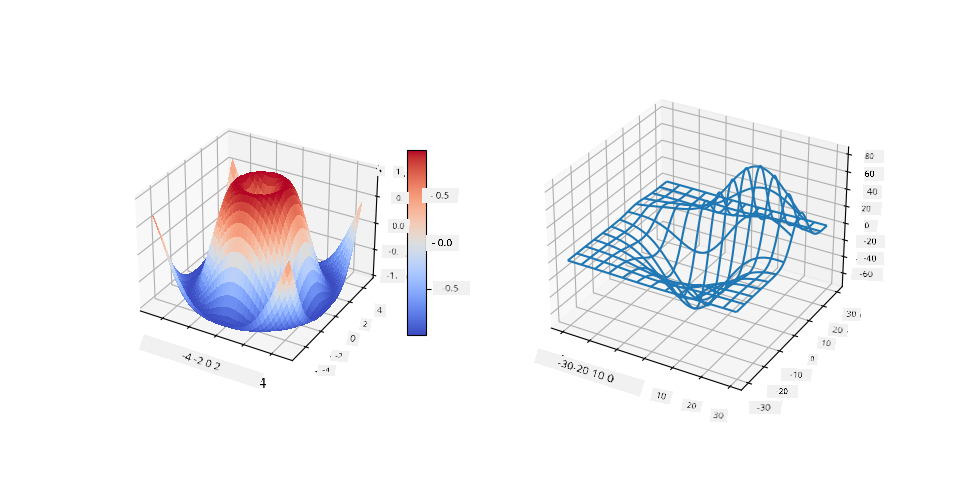
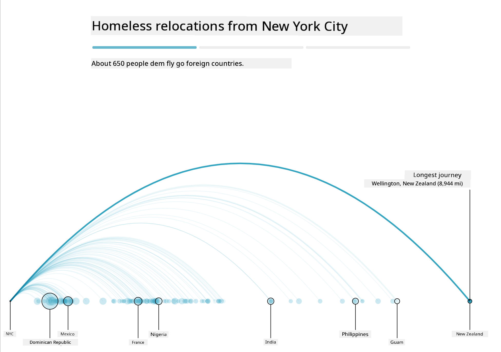
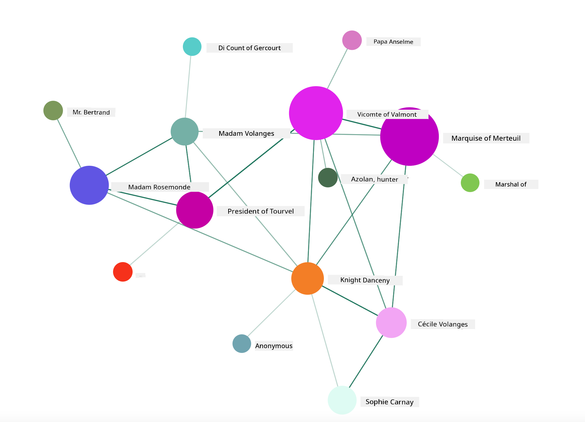

<!--
CO_OP_TRANSLATOR_METADATA:
{
  "original_hash": "cfb068050337a36e348debaa502a24fa",
  "translation_date": "2025-11-18T18:47:13+00:00",
  "source_file": "3-Data-Visualization/13-meaningful-visualizations/README.md",
  "language_code": "pcm"
}
-->
# How to Make Visualizations Wey Get Meaning

| ](../../sketchnotes/13-MeaningfulViz.png)|
|:---:|
| Visualizations Wey Get Meaning - _Sketchnote by [@nitya](https://twitter.com/nitya)_ |

> "If you torture data well well, e go confess anything" -- [Ronald Coase](https://en.wikiquote.org/wiki/Ronald_Coase)

One skill wey data scientist suppose sabi na how to make visualizations wey go help answer questions wey dey your mind. Before you go fit show your data, you go first clean am and prepare am, like you don do for the lessons wey you don learn before. After that, you fit begin decide how you go take show the data.

For this lesson, you go learn:

1. How to choose the correct chart type
2. How to avoid charts wey dey deceive
3. How to use color well
4. How to style your charts make e dey easy to read
5. How to make animated or 3D charts
6. How to make creative visualizations

## [Pre-Lecture Quiz](https://ff-quizzes.netlify.app/en/ds/quiz/24)

## Choose the correct chart type

For the lessons wey you don do before, you don try different types of data visualizations using Matplotlib and Seaborn. Normally, you fit use this table to choose the [correct chart type](https://chartio.com/learn/charts/how-to-select-a-data-vizualization/) for the question wey you dey ask:

| Wetin you wan do:          | Wetin you go use:               |
| -------------------------- | ------------------------------- |
| Show data trends over time | Line                            |
| Compare categories         | Bar, Pie                        |
| Compare totals             | Pie, Stacked Bar                |
| Show relationships         | Scatter, Line, Facet, Dual Line |
| Show distributions         | Scatter, Histogram, Box         |
| Show proportions           | Pie, Donut, Waffle              |

> ✅ Depending on how your data be, you fit need to change am from text to numbers before e go work for the chart wey you wan use.

## Avoid charts wey dey deceive

Even if data scientist choose the correct chart for the correct data, e still get plenty ways wey person fit show data wey go make e look like e dey prove one point, but e go dey spoil the data truth. E get many examples of charts and infographics wey dey deceive!

[](https://www.youtube.com/watch?v=oX74Nge8Wkw "How charts lie")

> 🎥 Click the image above to watch conference talk about charts wey dey deceive

This chart turn the X axis upside down to show opposite of wetin really happen, based on date:


[This chart](https://media.firstcoastnews.com/assets/WTLV/images/170ae16f-4643-438f-b689-50d66ca6a8d8/170ae16f-4643-438f-b689-50d66ca6a8d8_1140x641.jpg) dey even more deceptive, because e go make your eye think say COVID cases don reduce for different counties. But if you look the dates well, you go see say dem don rearrange am to make e look like e dey go down.


This popular example use color AND turn the Y axis upside down to deceive: instead of showing say gun deaths increase after dem pass gun-friendly law, e go make your eye think say na opposite happen:



This funny chart show how proportion fit dey manipulated, e go even make you laugh:



Another bad trick na to compare things wey no suppose dey compared. E get [one nice website](https://tylervigen.com/spurious-correlations) wey dey show 'spurious correlations' wey dey connect things like divorce rate for Maine and margarine consumption. Reddit group also dey collect [bad examples](https://www.reddit.com/r/dataisugly/top/?t=all) of how people dey use data.

E dey important to understand how charts fit deceive person eye. Even if data scientist no mean bad, if dem choose bad chart type, like pie chart wey get too many categories, e fit still deceive.

## Color

For the 'Florida gun violence' chart wey we see before, e show how color fit add extra meaning to charts, especially ones wey no use libraries like Matplotlib and Seaborn wey get tested color palettes. If you dey make chart by yourself, try study [color theory](https://colormatters.com/color-and-design/basic-color-theory).

> ✅ Remember say accessibility dey important for visualization. Some people fit dey color blind - your chart suppose still dey okay for people wey get visual impairments?

Make sure say you choose color well for your chart, because color fit pass message wey you no mean. The 'pink ladies' for the 'height' chart wey we see before dey show one kind 'feminine' meaning wey make the chart look funny.

Even though [color meaning](https://colormatters.com/color-symbolism/the-meanings-of-colors) fit dey different for different parts of the world, and e fit change based on the shade, generally, color meanings include:

| Color  | Meaning             |
| ------ | ------------------- |
| red    | power               |
| blue   | trust, loyalty      |
| yellow | happiness, caution  |
| green  | ecology, luck, envy |
| purple | happiness           |
| orange | vibrance            |

If dem tell you to make chart wey get custom colors, make sure say your chart dey accessible and the color wey you choose match the message wey you wan pass.

## Style your charts make e dey easy to read

Charts no go get meaning if people no fit read am! Take time to style the width and height of your chart make e fit your data well. If one variable (like all 50 states) need to show, try show am vertically for the Y axis if e possible, so you no go need horizontal scrolling.

Label your axes, add legend if e dey necessary, and give tooltips to help people understand the data better.

If your data dey text form and e long for the X axis, you fit angle the text make e easy to read. [Matplotlib](https://matplotlib.org/stable/tutorials/toolkits/mplot3d.html) fit help you do 3D plotting if your data fit work for am. You fit use `mpl_toolkits.mplot3d` to make advanced data visualizations.



## Animation and 3D chart display

Some of the best data visualizations wey we get today dey animated. Shirley Wu don make amazing ones with D3, like '[film flowers](http://bl.ocks.org/sxywu/raw/d612c6c653fb8b4d7ff3d422be164a5d/)', where each flower dey show one movie. Another example for the Guardian na 'bussed out', wey combine visualizations with Greensock and D3 plus scrollytelling article format to show how NYC dey handle homeless people by sending dem out of the city.



> "Bussed Out: How America Moves its Homeless" from [the Guardian](https://www.theguardian.com/us-news/ng-interactive/2017/dec/20/bussed-out-america-moves-homeless-people-country-study). Visualizations by Nadieh Bremer & Shirley Wu

Even though this lesson no go fit teach you everything about these powerful visualization libraries, you fit try D3 for Vue.js app to show visualization of the book "Dangerous Liaisons" as animated social network.

> "Les Liaisons Dangereuses" na novel wey dem write as letters. E dey written for 1782 by Choderlos de Laclos, e dey talk about the bad social moves of two French aristocrats for 18th century, Vicomte de Valmont and Marquise de Merteuil. Both of dem die for the end but dem cause plenty social wahala. The story dey unfold as letters wey dem write to people for their circle, dey plan revenge or just dey cause trouble. You fit make visualization of these letters to see the main people for the story, visually.

You go complete web app wey go show animated view of this social network. E dey use one library wey dem build to [show network](https://github.com/emiliorizzo/vue-d3-network) using Vue.js and D3. When the app dey run, you fit move the nodes around for the screen to shuffle the data.



## Project: Make chart to show network using D3.js

> This lesson folder get `solution` folder wey you fit check for the completed project.

1. Follow the instructions for the README.md file for the starter folder root. Make sure say you don install NPM and Node.js for your machine before you install your project dependencies.

2. Open the `starter/src` folder. You go see `assets` folder wey get .json file with all the letters from the novel, numbered, with 'to' and 'from' annotation.

3. Finish the code for `components/Nodes.vue` to make the visualization work. Look for the method wey dem call `createLinks()` and add this nested loop.

Loop through the .json object to collect the 'to' and 'from' data for the letters and build the `links` object so the visualization library fit use am:

```javascript
//loop through letters
      let f = 0;
      let t = 0;
      for (var i = 0; i < letters.length; i++) {
          for (var j = 0; j < characters.length; j++) {
              
            if (characters[j] == letters[i].from) {
              f = j;
            }
            if (characters[j] == letters[i].to) {
              t = j;
            }
        }
        this.links.push({ sid: f, tid: t });
      }
  ```

Run your app from the terminal (npm run serve) and enjoy the visualization!

## 🚀 Challenge

Go online to find examples of charts wey dey deceive. How the person take fool the user, and e dey intentional? Try fix the charts to show how dem suppose look.

## [Post-lecture quiz](https://ff-quizzes.netlify.app/en/ds/quiz/25)

## Review & Self Study

Check these articles about charts wey dey deceive:

https://gizmodo.com/how-to-lie-with-data-visualization-1563576606

http://ixd.prattsi.org/2017/12/visual-lies-usability-in-deceptive-data-visualizations/

See these interesting visualizations for historical assets and artifacts:

https://handbook.pubpub.org/

Read this article about how animation fit make your visualizations better:

https://medium.com/@EvanSinar/use-animation-to-supercharge-data-visualization-cd905a882ad4

## Assignment

[Make your own custom visualization](assignment.md)

---

<!-- CO-OP TRANSLATOR DISCLAIMER START -->
**Disclaimer**:  
Dis docu don dey translate wit AI translation service [Co-op Translator](https://github.com/Azure/co-op-translator). Even though we dey try make e accurate, abeg sabi say automated translations fit get mistake or no correct well. Di original docu for di language wey dem write am first na di main correct one. For important information, e go beta make professional human translator check am. We no go fit take blame for any misunderstanding or wrong interpretation wey fit happen because of dis translation.
<!-- CO-OP TRANSLATOR DISCLAIMER END -->