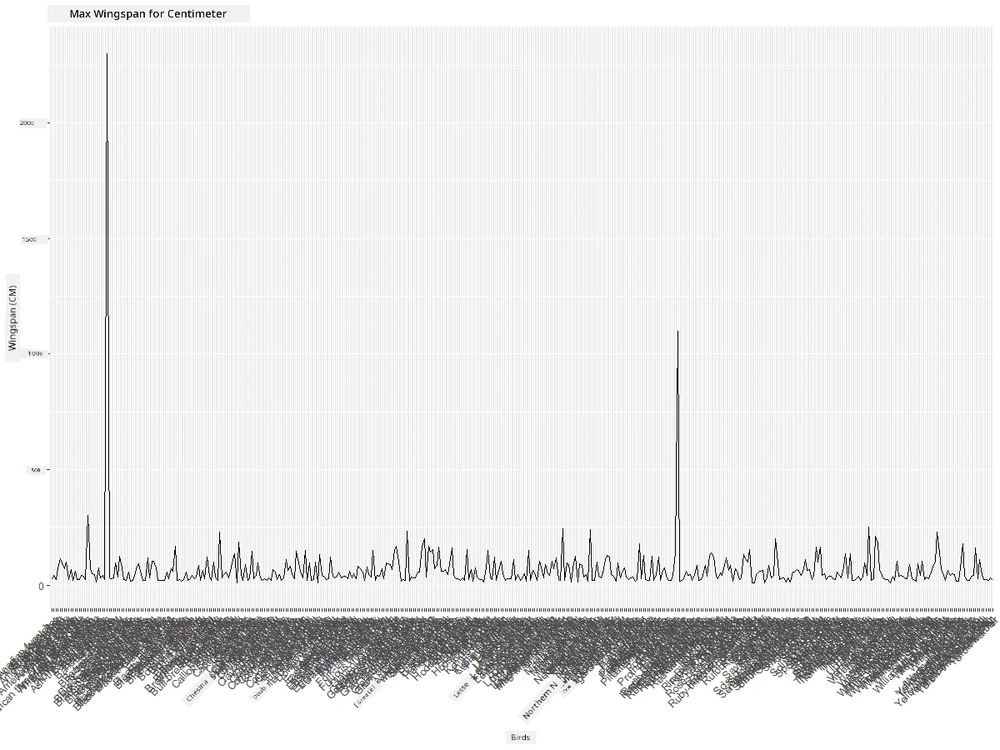
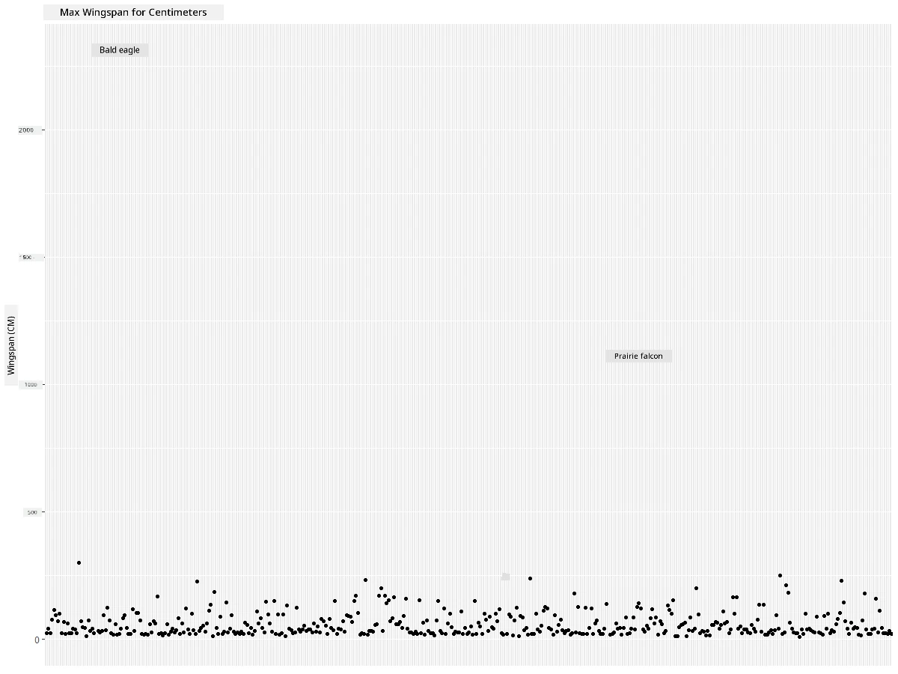
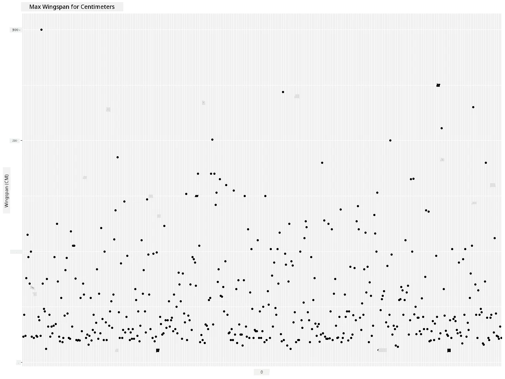
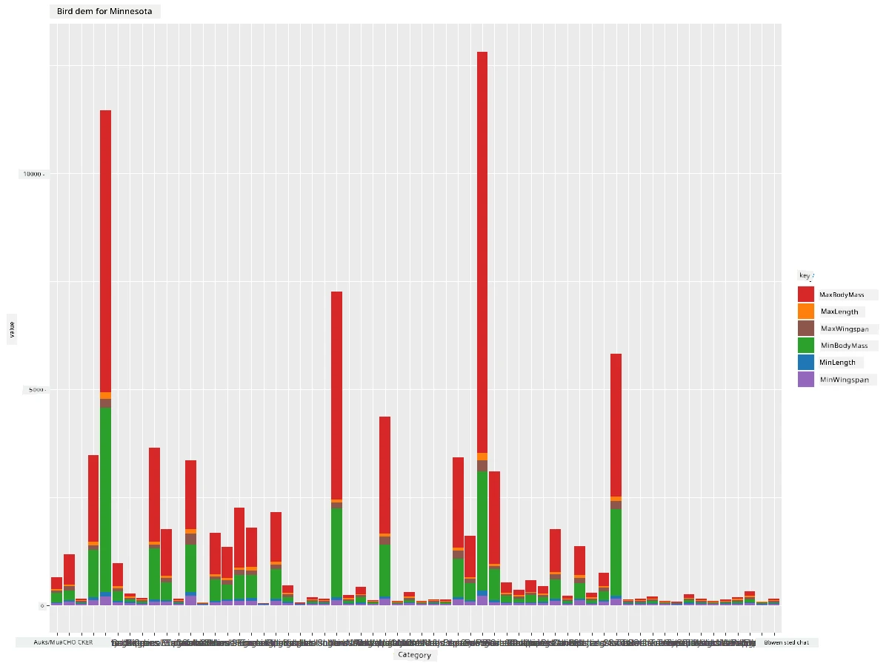
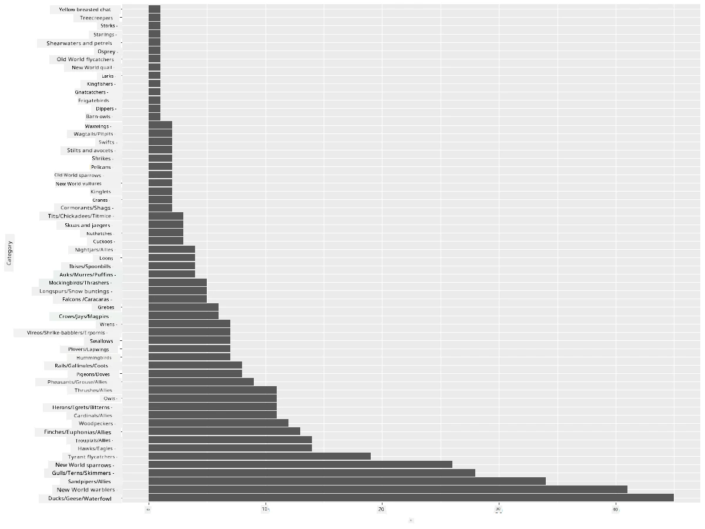
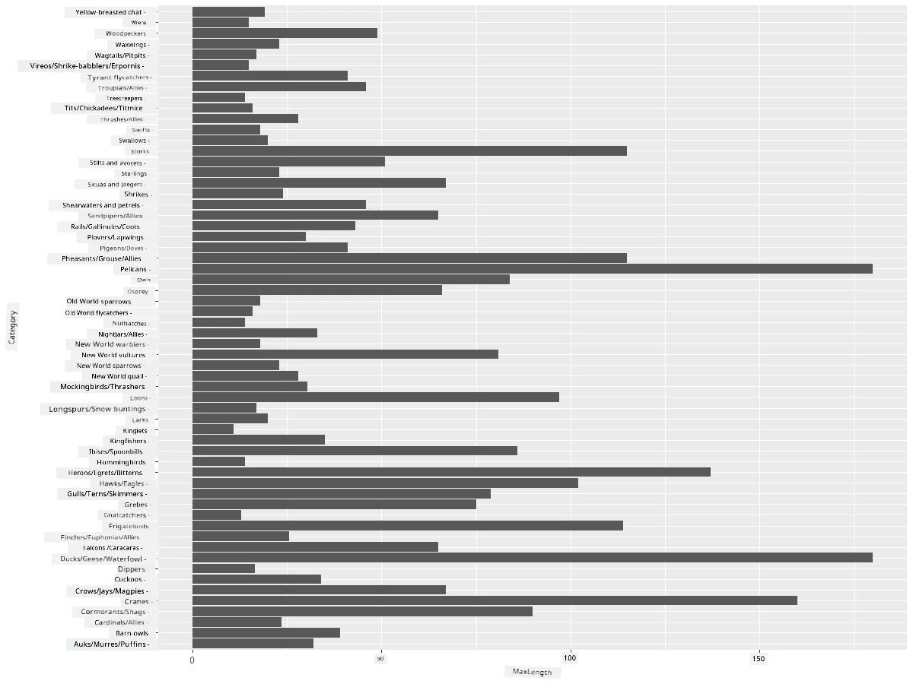
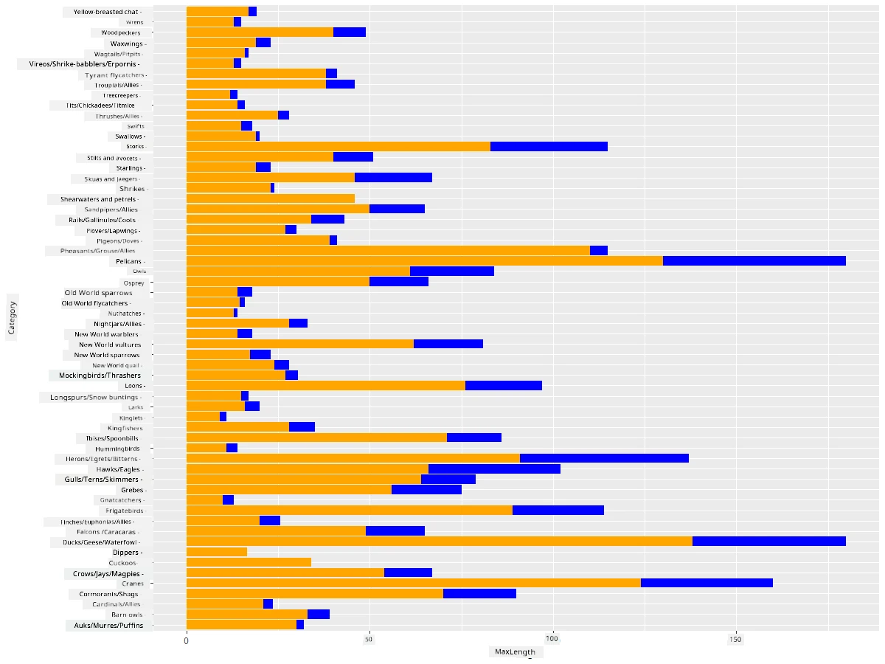

<!--
CO_OP_TRANSLATOR_METADATA:
{
  "original_hash": "22acf28f518a4769ea14fa42f4734b9f",
  "translation_date": "2025-11-18T18:53:52+00:00",
  "source_file": "3-Data-Visualization/R/09-visualization-quantities/README.md",
  "language_code": "pcm"
}
-->
# Visualizing Quantities
| ](https://github.com/microsoft/Data-Science-For-Beginners/blob/main/sketchnotes/09-Visualizing-Quantities.png)|
|:---:|
| Visualizing Quantities - _Sketchnote by [@nitya](https://twitter.com/nitya)_ |

For dis lesson, you go learn how to use some R package libraries wey dey available to create better visualizations wey dey focus on quantity. Using clean dataset about birds wey dey Minnesota, you fit learn plenty interesting tins about di local wildlife. 
## [Pre-lecture quiz](https://purple-hill-04aebfb03.1.azurestaticapps.net/quiz/16)

## Observe wingspan with ggplot2
One better library wey fit help you create simple and complex plots and charts na [ggplot2](https://cran.r-project.org/web/packages/ggplot2/index.html). Di general process to plot data using dis libraries na to first identify di part of your dataframe wey you wan target, do any transform wey di data need, assign di x and y axis values, decide di kind plot wey you wan show, and then show di plot.

`ggplot2` na system wey dey use di Grammar of Graphics to create graphics. Di [Grammar of Graphics](https://en.wikipedia.org/wiki/Ggplot2) na general way to break graphs into semantic components like scales and layers. In short, di way wey `ggplot2` dey make am easy to create plots and graphs for univariate or multivariate data with small code na why e popular pass for R visualizations. Di user go just tell `ggplot2` how to map di variables to aesthetics, di graphical primitives to use, and `ggplot2` go handle di rest.

> ✅ Plot = Data + Aesthetics + Geometry
> - Data na di dataset
> - Aesthetics na di variables wey you wan study (x and y variables)
> - Geometry na di type of plot (line plot, bar plot, etc.)

Choose di best geometry (type of plot) wey go fit your data and di story wey you wan tell through di plot. 

> - To analyze trends: line, column
> - To compare values: bar, column, pie, scatterplot
> - To show how parts relate to a whole: pie
> - To show distribution of data: scatterplot, bar
> - To show relationships between values: line, scatterplot, bubble

✅ You fit also check dis descriptive [cheatsheet](https://nyu-cdsc.github.io/learningr/assets/data-visualization-2.1.pdf) for ggplot2.

## Build a line plot about bird wingspan values

Open di R console and import di dataset. 
> Note: Di dataset dey inside di root of dis repo for di `/data` folder.

Make we import di dataset and look di head (top 5 rows) of di data.

```r
birds <- read.csv("../../data/birds.csv",fileEncoding="UTF-8-BOM")
head(birds)
```
Di head of di data get mix of text and numbers:

|      | Name                         | ScientificName         | Category              | Order        | Family   | Genus       | ConservationStatus | MinLength | MaxLength | MinBodyMass | MaxBodyMass | MinWingspan | MaxWingspan |
| ---: | :--------------------------- | :--------------------- | :-------------------- | :----------- | :------- | :---------- | :----------------- | --------: | --------: | ----------: | ----------: | ----------: | ----------: |
|    0 | Black-bellied whistling-duck | Dendrocygna autumnalis | Ducks/Geese/Waterfowl | Anseriformes | Anatidae | Dendrocygna | LC                 |        47 |        56 |         652 |        1020 |          76 |          94 |
|    1 | Fulvous whistling-duck       | Dendrocygna bicolor    | Ducks/Geese/Waterfowl | Anseriformes | Anatidae | Dendrocygna | LC                 |        45 |        53 |         712 |        1050 |          85 |          93 |
|    2 | Snow goose                   | Anser caerulescens     | Ducks/Geese/Waterfowl | Anseriformes | Anatidae | Anser       | LC                 |        64 |        79 |        2050 |        4050 |         135 |         165 |
|    3 | Ross's goose                 | Anser rossii           | Ducks/Geese/Waterfowl | Anseriformes | Anatidae | Anser       | LC                 |      57.3 |        64 |        1066 |        1567 |         113 |         116 |
|    4 | Greater white-fronted goose  | Anser albifrons        | Ducks/Geese/Waterfowl | Anseriformes | Anatidae | Anser       | LC                 |        64 |        81 |        1930 |        3310 |         130 |         165 |

Make we start to dey plot some of di numeric data using basic line plot. Suppose you wan see di maximum wingspan for dis birds.

```r
install.packages("ggplot2")
library("ggplot2")
ggplot(data=birds, aes(x=Name, y=MaxWingspan,group=1)) +
  geom_line() 
```
Here, you go install di `ggplot2` package and then import am into di workspace using di `library("ggplot2")` command. To plot any plot for ggplot, di `ggplot()` function dey used and you go specify di dataset, x and y variables as attributes. For dis case, we dey use di `geom_line()` function because we wan plot line plot.


Wetin you notice immediately? E be like say one outlier dey - di wingspan big well well! Wingspan wey pass 2000 centimeters na more than 20 meters - Pterodactyl dey waka for Minnesota? Make we check am.

Even though you fit do quick sort for Excel to find di outliers, we go continue di visualization process from di plot.

Add labels to di x-axis to show di kind birds wey dey di question:

```r
ggplot(data=birds, aes(x=Name, y=MaxWingspan,group=1)) +
  geom_line() +
  theme(axis.text.x = element_text(angle = 45, hjust=1))+
  xlab("Birds") +
  ylab("Wingspan (CM)") +
  ggtitle("Max Wingspan in Centimeters")
```
We dey specify di angle for di `theme` and di x and y axis labels for `xlab()` and `ylab()` respectively. Di `ggtitle()` dey give name to di graph/plot.



Even as we rotate di labels to 45 degrees, e still too much to read. Make we try another strategy: label only di outliers and set di labels inside di chart. You fit use scatter chart to make space for di labeling:

```r
ggplot(data=birds, aes(x=Name, y=MaxWingspan,group=1)) +
  geom_point() +
  geom_text(aes(label=ifelse(MaxWingspan>500,as.character(Name),'')),hjust=0,vjust=0) + 
  theme(axis.title.x=element_blank(), axis.text.x=element_blank(), axis.ticks.x=element_blank())
  ylab("Wingspan (CM)") +
  ggtitle("Max Wingspan in Centimeters") + 
```
Wetindey happen here? You use di `geom_point()` function to plot scatter points. With dis, you add labels for birds wey get `MaxWingspan > 500` and also hide di labels for di x axis to make di plot clean.

Wetin you discover?



## Filter your data

Di Bald Eagle and di Prairie Falcon, even though dem be big birds, e be like say dem get typo, wey add extra 0 to their maximum wingspan. E no dey likely say you go see Bald Eagle wey get 25 meter wingspan, but if e happen, abeg tell us! Make we create new dataframe wey no go include di two outliers:

```r
birds_filtered <- subset(birds, MaxWingspan < 500)

ggplot(data=birds_filtered, aes(x=Name, y=MaxWingspan,group=1)) +
  geom_point() +
  ylab("Wingspan (CM)") +
  xlab("Birds") +
  ggtitle("Max Wingspan in Centimeters") + 
  geom_text(aes(label=ifelse(MaxWingspan>500,as.character(Name),'')),hjust=0,vjust=0) +
  theme(axis.text.x=element_blank(), axis.ticks.x=element_blank())
```
We create new dataframe `birds_filtered` and then plot scatter plot. By removing di outliers, your data go dey more clean and easy to understand.



Now wey we don clean di dataset for wingspan, make we learn more about dis birds.

Even though line and scatter plots fit show information about data values and their distributions, we wan think about di values wey dey di dataset. You fit create visualizations to answer di following questions about quantity:

> How many categories of birds dey, and wetin be their numbers?
> How many birds dey extinct, endangered, rare, or common?
> How many dey for di various genus and orders for Linnaeus's terminology?
## Explore bar charts

Bar charts dey useful when you wan show groupings of data. Make we explore di categories of birds wey dey dis dataset to see which one dey common pass by number.
Make we create bar chart for di filtered data.

```r
install.packages("dplyr")
install.packages("tidyverse")

library(lubridate)
library(scales)
library(dplyr)
library(ggplot2)
library(tidyverse)

birds_filtered %>% group_by(Category) %>%
  summarise(n=n(),
  MinLength = mean(MinLength),
  MaxLength = mean(MaxLength),
  MinBodyMass = mean(MinBodyMass),
  MaxBodyMass = mean(MaxBodyMass),
  MinWingspan=mean(MinWingspan),
  MaxWingspan=mean(MaxWingspan)) %>% 
  gather("key", "value", - c(Category, n)) %>%
  ggplot(aes(x = Category, y = value, group = key, fill = key)) +
  geom_bar(stat = "identity") +
  scale_fill_manual(values = c("#D62728", "#FF7F0E", "#8C564B","#2CA02C", "#1F77B4", "#9467BD")) +                   
  xlab("Category")+ggtitle("Birds of Minnesota")

```
For di following snippet, we dey install di [dplyr](https://www.rdocumentation.org/packages/dplyr/versions/0.7.8) and [lubridate](https://www.rdocumentation.org/packages/lubridate/versions/1.8.0) packages to help manipulate and group data to plot stacked bar chart. First, you go group di data by di `Category` of bird and then summarise di `MinLength`, `MaxLength`, `MinBodyMass`,`MaxdyMass`,`MinWingspan`,`MaxWingspan` columns. Then, plot di bar chart using `ggplot2` package and specify di colours for di different category and di labels. 



Dis bar chart, however, no dey readable because di data no dey grouped well. You need select only di data wey you wan plot, so make we look di length of birds based on their category.

Filter your data to include only di bird's category.

Since di categories plenty, you fit display dis chart vertically and adjust di height to fit all di data:

```r
birds_count<-dplyr::count(birds_filtered, Category, sort = TRUE)
birds_count$Category <- factor(birds_count$Category, levels = birds_count$Category)
ggplot(birds_count,aes(Category,n))+geom_bar(stat="identity")+coord_flip()
```
You first count unique values for di `Category` column and then sort dem into new dataframe `birds_count`. Dis sorted data go then dey factored for di same level so e go plot in di sorted way. Using `ggplot2` you go then plot di data for bar chart. Di `coord_flip()` go plot horizontal bars. 



Dis bar chart dey show better view of di number of birds for each category. You go quickly see say di largest number of birds for dis area dey for Ducks/Geese/Waterfowl category. Minnesota na 'land of 10,000 lakes' so e no dey surprising!

✅ Try some other counts for dis dataset. Wetin surprise you?

## Comparing data

You fit try different comparisons of grouped data by creating new axes. Try compare di MaxLength of bird, based on di category:

```r
birds_grouped <- birds_filtered %>%
  group_by(Category) %>%
  summarise(
  MaxLength = max(MaxLength, na.rm = T),
  MinLength = max(MinLength, na.rm = T)
           ) %>%
  arrange(Category)
  
ggplot(birds_grouped,aes(Category,MaxLength))+geom_bar(stat="identity")+coord_flip()
```
We group di `birds_filtered` data by `Category` and then plot bar graph. 



Nothing dey surprising here: hummingbirds get di least MaxLength compared to Pelicans or Geese. E dey good when data make sense!

You fit create more interesting visualizations of bar charts by superimposing data. Make we superimpose Minimum and Maximum Length for given bird category:

```r
ggplot(data=birds_grouped, aes(x=Category)) +
  geom_bar(aes(y=MaxLength), stat="identity", position ="identity",  fill='blue') +
  geom_bar(aes(y=MinLength), stat="identity", position="identity", fill='orange')+
  coord_flip()
```


## 🚀 Challenge

Dis bird dataset get plenty information about different types of birds wey dey one ecosystem. Search online and see if you fit find other bird-oriented datasets. Practice how to build charts and graphs about dis birds to discover facts wey you no know before.
## [Post-lecture quiz](https://purple-hill-04aebfb03.1.azurestaticapps.net/quiz/17)

## Review & Self Study

Dis first lesson don show you small information about how to use `ggplot2` to visualize quantities. Do research about other ways to work with datasets for visualization. Look for datasets wey you fit visualize using other packages like [Lattice](https://stat.ethz.ch/R-manual/R-devel/library/lattice/html/Lattice.html) and [Plotly](https://github.com/plotly/plotly.R#readme)

## Assignment
[Lines, Scatters, and Bars](assignment.md)

---

<!-- CO-OP TRANSLATOR DISCLAIMER START -->
**Disclaimer**:  
Dis dokyument don use AI transleshion service [Co-op Translator](https://github.com/Azure/co-op-translator) do di transleshion. Even as we dey try make am accurate, abeg make you sabi say transleshion wey machine do fit get mistake or no dey correct well. Di original dokyument for im native language na di one wey you go take as di correct source. For important informashon, e good make you use professional human transleshion. We no go fit take blame for any misunderstanding or wrong way person take understand di transleshion wey dis dokyument get.
<!-- CO-OP TRANSLATOR DISCLAIMER END -->