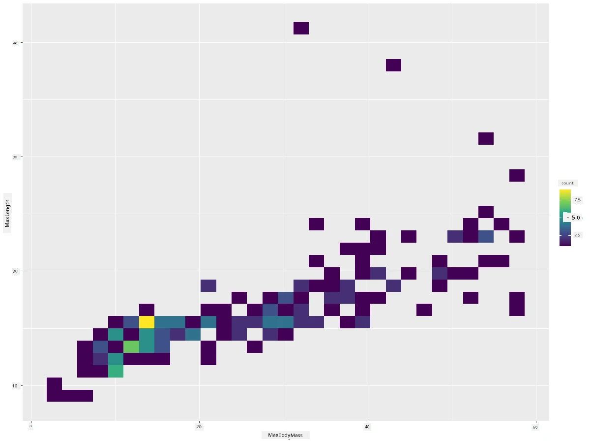
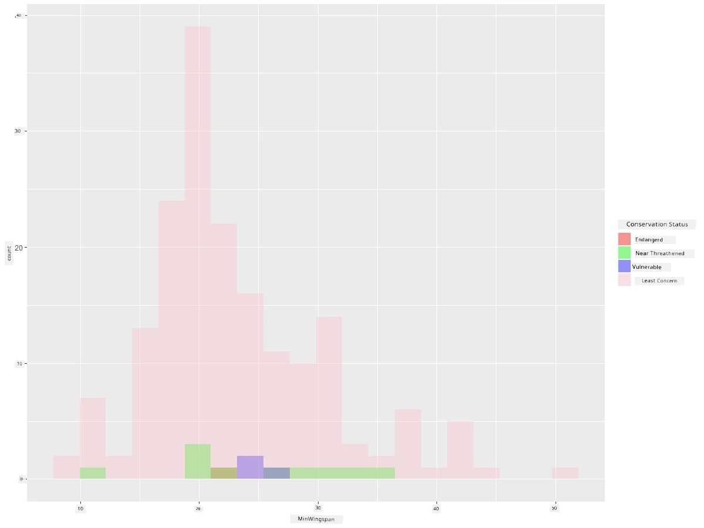
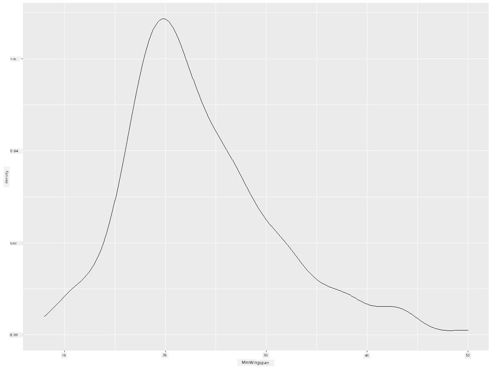
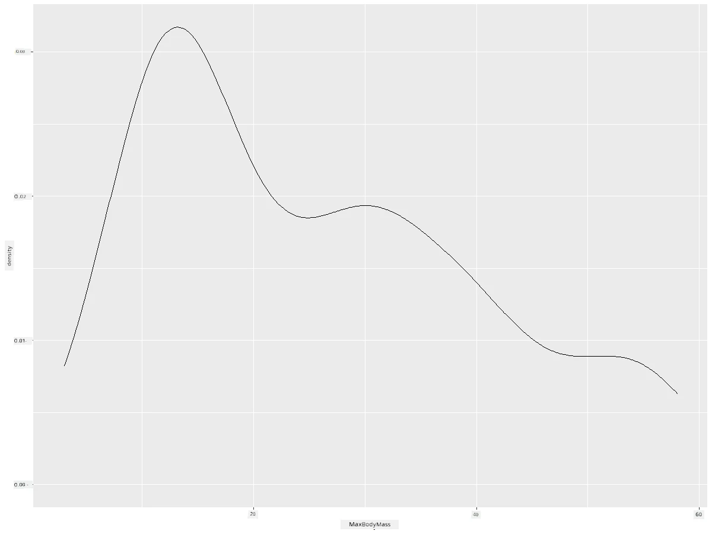

<!--
CO_OP_TRANSLATOR_METADATA:
{
  "original_hash": "ea67c0c40808fd723594de6896c37ccf",
  "translation_date": "2025-11-18T18:49:15+00:00",
  "source_file": "3-Data-Visualization/R/10-visualization-distributions/README.md",
  "language_code": "pcm"
}
-->
# Visualizing Distributions

| ](https://github.com/microsoft/Data-Science-For-Beginners/blob/main/sketchnotes/10-Visualizing-Distributions.png)|
|:---:|
| Visualizing Distributions - _Sketchnote by [@nitya](https://twitter.com/nitya)_ |

For di last lesson, you don learn some interestin tins about one dataset wey dey talk about di birds wey dey Minnesota. You don find some wrong data by visualizin outliers and you don look di difference wey dey between di bird categories by dia maximum length.

## [Pre-lecture quiz](https://purple-hill-04aebfb03.1.azurestaticapps.net/quiz/18)
## Explore di birds dataset

Another way wey you fit take check data na to look how e dey spread, or how di data dey arrange along one axis. Maybe, for example, you wan sabi di general spread for dis dataset, di maximum wingspan or maximum body mass for di birds wey dey Minnesota.

Make we find some tins about di way di data dey spread for dis dataset. For your R console, import `ggplot2` and di database. Remove di outliers from di database just like how we do am for di last topic.

```r
library(ggplot2)

birds <- read.csv("../../data/birds.csv",fileEncoding="UTF-8-BOM")

birds_filtered <- subset(birds, MaxWingspan < 500)
head(birds_filtered)
```
|      | Name                         | ScientificName         | Category              | Order        | Family   | Genus       | ConservationStatus | MinLength | MaxLength | MinBodyMass | MaxBodyMass | MinWingspan | MaxWingspan |
| ---: | :--------------------------- | :--------------------- | :-------------------- | :----------- | :------- | :---------- | :----------------- | --------: | --------: | ----------: | ----------: | ----------: | ----------: |
|    0 | Black-bellied whistling-duck | Dendrocygna autumnalis | Ducks/Geese/Waterfowl | Anseriformes | Anatidae | Dendrocygna | LC                 |        47 |        56 |         652 |        1020 |          76 |          94 |
|    1 | Fulvous whistling-duck       | Dendrocygna bicolor    | Ducks/Geese/Waterfowl | Anseriformes | Anatidae | Dendrocygna | LC                 |        45 |        53 |         712 |        1050 |          85 |          93 |
|    2 | Snow goose                   | Anser caerulescens     | Ducks/Geese/Waterfowl | Anseriformes | Anatidae | Anser       | LC                 |        64 |        79 |        2050 |        4050 |         135 |         165 |
|    3 | Ross's goose                 | Anser rossii           | Ducks/Geese/Waterfowl | Anseriformes | Anatidae | Anser       | LC                 |      57.3 |        64 |        1066 |        1567 |         113 |         116 |
|    4 | Greater white-fronted goose  | Anser albifrons        | Ducks/Geese/Waterfowl | Anseriformes | Anatidae | Anser       | LC                 |        64 |        81 |        1930 |        3310 |         130 |         165 |

Normally, you fit quick look how di data dey spread by usin scatter plot like how we do am for di last lesson:

```r
ggplot(data=birds_filtered, aes(x=Order, y=MaxLength,group=1)) +
  geom_point() +
  ggtitle("Max Length per order") + coord_flip()
```


Dis one dey show di general spread of body length per bird Order, but e no be di best way to show true distributions. Di better way na to use Histogram.

## Working with histograms

`ggplot2` get better ways to show how data dey spread by usin Histograms. Dis type of chart be like bar chart wey di spread go show as di bars dey rise and fall. To build Histogram, you need numeric data. To build Histogram, you fit plot chart wey di kind na 'hist' for Histogram. Dis chart dey show di spread of MaxBodyMass for di whole dataset range of numeric data. By dividin di array of data into smaller bins, e fit show how di data values dey spread:

```r
ggplot(data = birds_filtered, aes(x = MaxBodyMass)) + 
  geom_histogram(bins=10)+ylab('Frequency')
```


As you fit see, most of di 400+ birds for dis dataset dey fall for di range wey dey under 2000 for dia Max Body Mass. You fit sabi more about di data by changin di `bins` parameter to higher number, like 30:

```r
ggplot(data = birds_filtered, aes(x = MaxBodyMass)) + geom_histogram(bins=30)+ylab('Frequency')
```


Dis chart dey show di spread in more detailed way. You fit create chart wey no go dey too skewed to di left by makin sure say you only select data wey dey inside one given range:

Filter your data to get only di birds wey dia body mass dey under 60, and show 30 `bins`:

```r
birds_filtered_1 <- subset(birds_filtered, MaxBodyMass > 1 & MaxBodyMass < 60)
ggplot(data = birds_filtered_1, aes(x = MaxBodyMass)) + 
  geom_histogram(bins=30)+ylab('Frequency')
```


✅ Try some other filters and data points. To see di full spread of di data, remove di `['MaxBodyMass']` filter to show labeled distributions.

Di histogram get some nice color and labeling wey you fit try too:

Create 2D histogram to compare di relationship wey dey between two spreads. Make we compare `MaxBodyMass` vs. `MaxLength`. `ggplot2` get built-in way to show convergence by usin brighter colors:

```r
ggplot(data=birds_filtered_1, aes(x=MaxBodyMass, y=MaxLength) ) +
  geom_bin2d() +scale_fill_continuous(type = "viridis")
```
E be like say di correlation wey dey between dis two elements dey follow di expected axis, with one strong point of convergence:



Histograms dey work well for numeric data by default. But wetin if you wan see how text data dey spread? 
## Explore di dataset for distributions usin text data 

Dis dataset get better information about di bird category and dia genus, species, and family as well as dia conservation status. Make we check di conservation information. How di birds dey spread according to dia conservation status?

> ✅ For di dataset, dem dey use some acronyms to describe conservation status. Dis acronyms dey come from di [IUCN Red List Categories](https://www.iucnredlist.org/), one organization wey dey catalog species' status.
> 
> - CR: Critically Endangered
> - EN: Endangered
> - EX: Extinct
> - LC: Least Concern
> - NT: Near Threatened
> - VU: Vulnerable

Dis na text-based values so you go need to do transform to create histogram. Usin di filteredBirds dataframe, show di conservation status alongside di Minimum Wingspan. Wetin you see?

```r
birds_filtered_1$ConservationStatus[birds_filtered_1$ConservationStatus == 'EX'] <- 'x1' 
birds_filtered_1$ConservationStatus[birds_filtered_1$ConservationStatus == 'CR'] <- 'x2'
birds_filtered_1$ConservationStatus[birds_filtered_1$ConservationStatus == 'EN'] <- 'x3'
birds_filtered_1$ConservationStatus[birds_filtered_1$ConservationStatus == 'NT'] <- 'x4'
birds_filtered_1$ConservationStatus[birds_filtered_1$ConservationStatus == 'VU'] <- 'x5'
birds_filtered_1$ConservationStatus[birds_filtered_1$ConservationStatus == 'LC'] <- 'x6'

ggplot(data=birds_filtered_1, aes(x = MinWingspan, fill = ConservationStatus)) +
  geom_histogram(position = "identity", alpha = 0.4, bins = 20) +
  scale_fill_manual(name="Conservation Status",values=c("red","green","blue","pink"),labels=c("Endangered","Near Threathened","Vulnerable","Least Concern"))
```



E no dey look like say good correlation dey between minimum wingspan and conservation status. Test other elements for di dataset usin dis method. You fit try different filters too. You see any correlation?

## Density plots

You fit don notice say di histograms wey we don look so far dey 'stepped' and e no dey flow smooth like arc. To show smoother density chart, you fit try density plot.

Make we work with density plot now!

```r
ggplot(data = birds_filtered_1, aes(x = MinWingspan)) + 
  geom_density()
```


You fit see how di plot dey resemble di previous one for Minimum Wingspan data; e just dey smoother small. If you wan revisit dat jagged MaxBodyMass line for di second chart wey you build, you fit smooth am well by recreatin am usin dis method:

```r
ggplot(data = birds_filtered_1, aes(x = MaxBodyMass)) + 
  geom_density()
```


If you wan smooth line wey no go too smooth, edit di `adjust` parameter: 

```r
ggplot(data = birds_filtered_1, aes(x = MaxBodyMass)) + 
  geom_density(adjust = 1/5)
```


✅ Read about di parameters wey dey available for dis type of plot and experiment!

Dis type of chart dey offer better explanatory visualizations. With few lines of code, for example, you fit show di max body mass density per bird Order:

```r
ggplot(data=birds_filtered_1,aes(x = MaxBodyMass, fill = Order)) +
  geom_density(alpha=0.5)
```


## 🚀 Challenge

Histograms na more advanced type of chart compared to basic scatterplots, bar charts, or line charts. Go search for di internet to find better examples of how dem dey use histograms. How dem dey use am, wetin dem dey show, and for which fields or areas dem dey use am well?

## [Post-lecture quiz](https://purple-hill-04aebfb03.1.azurestaticapps.net/quiz/19)

## Review & Self Study

For dis lesson, you don use `ggplot2` and start to dey work to show more advanced charts. Do some research on `geom_density_2d()` wey be "continuous probability density curve for one or more dimensions". Read through [di documentation](https://ggplot2.tidyverse.org/reference/geom_density_2d.html) to understand how e dey work.

## Assignment

[Apply your skills](assignment.md)

---

<!-- CO-OP TRANSLATOR DISCLAIMER START -->
**Disclaimer**:  
Dis dokyument don translate wit AI translation service [Co-op Translator](https://github.com/Azure/co-op-translator). Even though we dey try make am accurate, abeg sabi say machine translation fit get mistake or no dey correct well. Di original dokyument for im native language na di main source wey you go fit trust. For important mata, e good make professional human translator check am. We no go fit take blame for any misunderstanding or wrong interpretation wey fit happen because you use dis translation.
<!-- CO-OP TRANSLATOR DISCLAIMER END -->