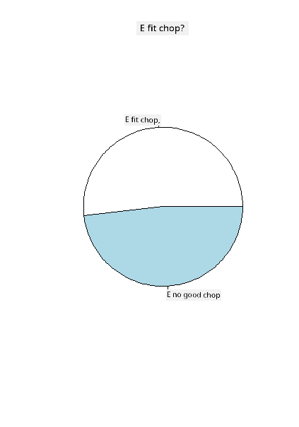
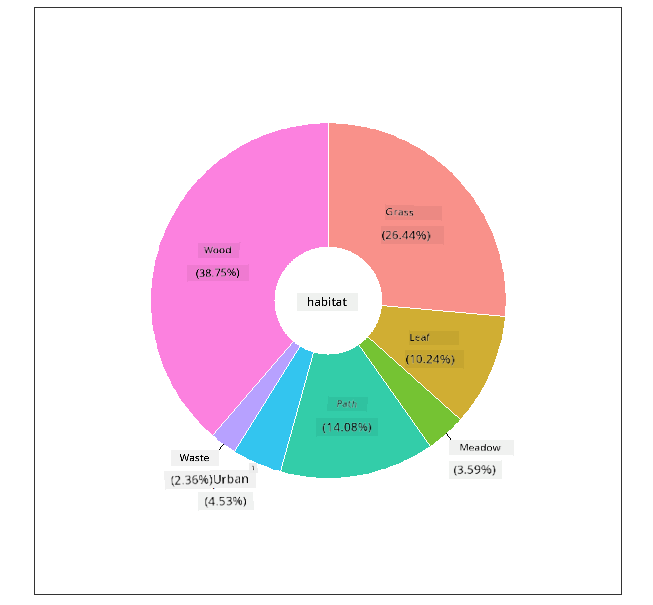
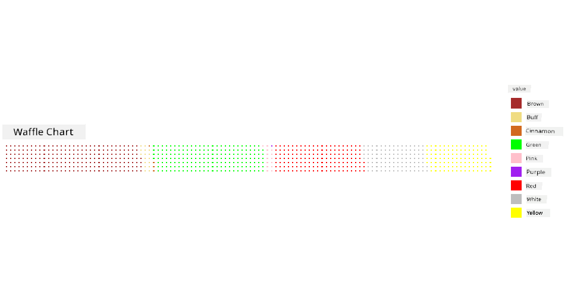

<!--
CO_OP_TRANSLATOR_METADATA:
{
  "original_hash": "47028abaaafa2bcb1079702d20569066",
  "translation_date": "2025-11-18T18:50:41+00:00",
  "source_file": "3-Data-Visualization/R/11-visualization-proportions/README.md",
  "language_code": "pcm"
}
-->
# Visualizing Proportions

| ](../../../sketchnotes/11-Visualizing-Proportions.png)|
|:---:|
|Visualizing Proportions - _Sketchnote by [@nitya](https://twitter.com/nitya)_ |

For dis lesson, you go use one dataset wey dey focus on nature to show proportions, like how many different types of fungi dey inside one dataset about mushrooms. Make we check dis fungi wey dey interesting well-well using one dataset wey Audubon provide, wey get details about 23 species of gilled mushrooms for Agaricus and Lepiota families. You go try some sweet visualizations like:

- Pie charts 🥧
- Donut charts 🍩
- Waffle charts 🧇

> 💡 One project wey dey very interesting na [Charticulator](https://charticulator.com) wey Microsoft Research do. E dey free and e get drag and drop interface for data visualizations. For one of their tutorials, dem use dis mushroom dataset! So you fit explore the data and learn the library at the same time: [Charticulator tutorial](https://charticulator.com/tutorials/tutorial4.html).

## [Pre-lecture quiz](https://purple-hill-04aebfb03.1.azurestaticapps.net/quiz/20)

## Know your mushrooms 🍄

Mushrooms dey very interesting. Make we import one dataset to study dem:

```r
mushrooms = read.csv('../../data/mushrooms.csv')
head(mushrooms)
```
One table go show with some correct data for analysis:


| class     | cap-shape | cap-surface | cap-color | bruises | odor    | gill-attachment | gill-spacing | gill-size | gill-color | stalk-shape | stalk-root | stalk-surface-above-ring | stalk-surface-below-ring | stalk-color-above-ring | stalk-color-below-ring | veil-type | veil-color | ring-number | ring-type | spore-print-color | population | habitat |
| --------- | --------- | ----------- | --------- | ------- | ------- | --------------- | ------------ | --------- | ---------- | ----------- | ---------- | ------------------------ | ------------------------ | ---------------------- | ---------------------- | --------- | ---------- | ----------- | --------- | ----------------- | ---------- | ------- |
| Poisonous | Convex    | Smooth      | Brown     | Bruises | Pungent | Free            | Close        | Narrow    | Black      | Enlarging   | Equal      | Smooth                   | Smooth                   | White                  | White                  | Partial   | White      | One         | Pendant   | Black             | Scattered  | Urban   |
| Edible    | Convex    | Smooth      | Yellow    | Bruises | Almond  | Free            | Close        | Broad     | Black      | Enlarging   | Club       | Smooth                   | Smooth                   | White                  | White                  | Partial   | White      | One         | Pendant   | Brown             | Numerous   | Grasses |
| Edible    | Bell      | Smooth      | White     | Bruises | Anise   | Free            | Close        | Broad     | Brown      | Enlarging   | Club       | Smooth                   | Smooth                   | White                  | White                  | Partial   | White      | One         | Pendant   | Brown             | Numerous   | Meadows |
| Poisonous | Convex    | Scaly       | White     | Bruises | Pungent | Free            | Close        | Narrow    | Brown      | Enlarging   | Equal      | Smooth                   | Smooth                   | White                  | White                  | Partial   | White      | One         | Pendant   | Black             | Scattered  | Urban 
| Edible | Convex       |Smooth       | Green     | No Bruises| None   |Free            | Crowded       | Broad     | Black      | Tapering   | Equal      |  Smooth | Smooth                    | White                 | White                  | Partial    | White     | One         | Evanescent | Brown             | Abundant | Grasses
|Edible  |  Convex      | Scaly   | Yellow         | Bruises  | Almond  | Free | Close  |   Broad   |   Brown  | Enlarging   |   Club                      | Smooth                  | Smooth    | White                 |  White                | Partial      | White    |  One  |  Pendant | Black   | Numerous | Grasses
      
As you dey look am, you go notice say all the data na text. You go need change dis data so you fit use am for chart. Most of the data sef, na object:

```r
names(mushrooms)
```

The output na:

```output
[1] "class"                    "cap.shape"               
 [3] "cap.surface"              "cap.color"               
 [5] "bruises"                  "odor"                    
 [7] "gill.attachment"          "gill.spacing"            
 [9] "gill.size"                "gill.color"              
[11] "stalk.shape"              "stalk.root"              
[13] "stalk.surface.above.ring" "stalk.surface.below.ring"
[15] "stalk.color.above.ring"   "stalk.color.below.ring"  
[17] "veil.type"                "veil.color"              
[19] "ring.number"              "ring.type"               
[21] "spore.print.color"        "population"              
[23] "habitat"            
```
Take dis data and change the 'class' column to category:

```r
library(dplyr)
grouped=mushrooms %>%
  group_by(class) %>%
  summarise(count=n())
```


Now, if you print the mushrooms data, you go see say dem don group am into categories based on the poisonous/edible class:
```r
View(grouped)
```


| class | count |
| --------- | --------- |
| Edible | 4208 |
| Poisonous| 3916 |


If you follow the order wey dey for dis table to create your class category labels, you fit make pie chart. 

## Pie!

```r
pie(grouped$count,grouped$class, main="Edible?")
```
Voila, one pie chart wey dey show the proportions of dis data based on dis two classes of mushrooms. E dey very important to arrange the labels well, especially for here, so make sure say you check the order wey you take build the label array!



## Donuts!

One pie chart wey dey more interesting na donut chart, wey be pie chart wey get hole for middle. Make we check our data with dis method.

Look the different habitats wey mushrooms dey grow:

```r
library(dplyr)
habitat=mushrooms %>%
  group_by(habitat) %>%
  summarise(count=n())
View(habitat)
```
The output na:
| habitat| count |
| --------- | --------- |
| Grasses    | 2148 |
| Leaves| 832 |
| Meadows    | 292 |
| Paths| 1144 |
| Urban    | 368 |
| Waste| 192 |
| Wood| 3148 |


For here, you dey group your data by habitat. Dem get 7 listed, so use dem as labels for your donut chart:

```r
library(ggplot2)
library(webr)
PieDonut(habitat, aes(habitat, count=count))
```



Dis code dey use two libraries- ggplot2 and webr. With the PieDonut function for webr library, e easy to create donut chart!

You fit also make donut charts for R using only ggplot2 library. You fit learn more about am [here](https://www.r-graph-gallery.com/128-ring-or-donut-plot.html) and try am yourself.

Now wey you sabi how to group your data and show am as pie or donut, you fit try other types of charts. Try waffle chart, wey be another way to show quantity.
## Waffles!

Waffle chart na another way to show quantities as 2D array of squares. Try show the different quantities of mushroom cap colors for dis dataset. To do dis, you go need install one helper library wey dem call [waffle](https://cran.r-project.org/web/packages/waffle/waffle.pdf) and use am to make your visualization:

```r
install.packages("waffle", repos = "https://cinc.rud.is")
```

Select one part of your data to group:

```r
library(dplyr)
cap_color=mushrooms %>%
  group_by(cap.color) %>%
  summarise(count=n())
View(cap_color)
```

Make waffle chart by creating labels and then grouping your data:

```r
library(waffle)
names(cap_color$count) = paste0(cap_color$cap.color)
waffle((cap_color$count/10), rows = 7, title = "Waffle Chart")+scale_fill_manual(values=c("brown", "#F0DC82", "#D2691E", "green", 
                                                                                     "pink", "purple", "red", "grey", 
                                                                                     "yellow","white"))
```

With waffle chart, you fit see the proportions of cap colors for dis mushrooms dataset. E dey interesting say plenty mushrooms get green cap!



For dis lesson, you don learn three ways to show proportions. First, you go need group your data into categories and then decide the best way to show the data - pie, donut, or waffle. All of dem dey sweet and dey give the user quick snapshot of one dataset.

## 🚀 Challenge

Try make dis sweet charts for [Charticulator](https://charticulator.com).
## [Post-lecture quiz](https://purple-hill-04aebfb03.1.azurestaticapps.net/quiz/21)

## Review & Self Study

Sometimes e no dey clear when to use pie, donut, or waffle chart. Here be some articles wey you fit read about dis matter:

https://www.beautiful.ai/blog/battle-of-the-charts-pie-chart-vs-donut-chart

https://medium.com/@hypsypops/pie-chart-vs-donut-chart-showdown-in-the-ring-5d24fd86a9ce

https://www.mit.edu/~mbarker/formula1/f1help/11-ch-c6.htm

https://medium.datadriveninvestor.com/data-visualization-done-the-right-way-with-tableau-waffle-chart-fdf2a19be402

Do some research to find more information about dis decision wey dey hard.
## Assignment

[Try am for Excel](assignment.md)

---

<!-- CO-OP TRANSLATOR DISCLAIMER START -->
**Disclaimer**:  
Dis dokyument don use AI transleshion service [Co-op Translator](https://github.com/Azure/co-op-translator) do di transleshion. Even as we dey try make am accurate, abeg make you sabi say automatik transleshion fit get mistake or no dey correct well. Di original dokyument for im native language na di one wey you go take as di main source. For important mata, e good make you use professional human transleshion. We no go fit take blame for any misunderstanding or wrong interpretation wey fit happen because you use dis transleshion.
<!-- CO-OP TRANSLATOR DISCLAIMER END -->