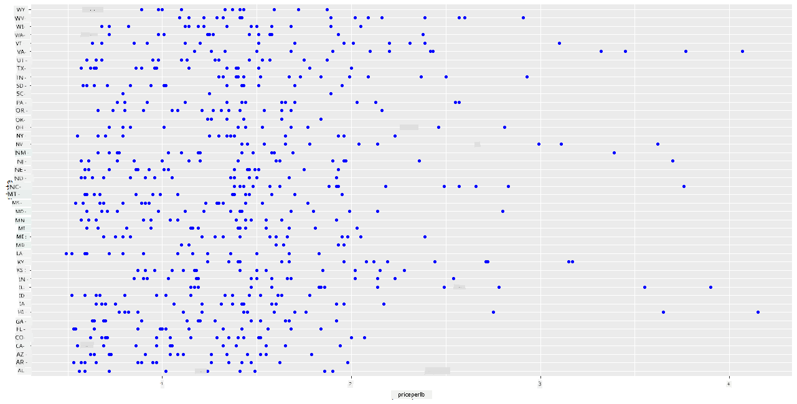
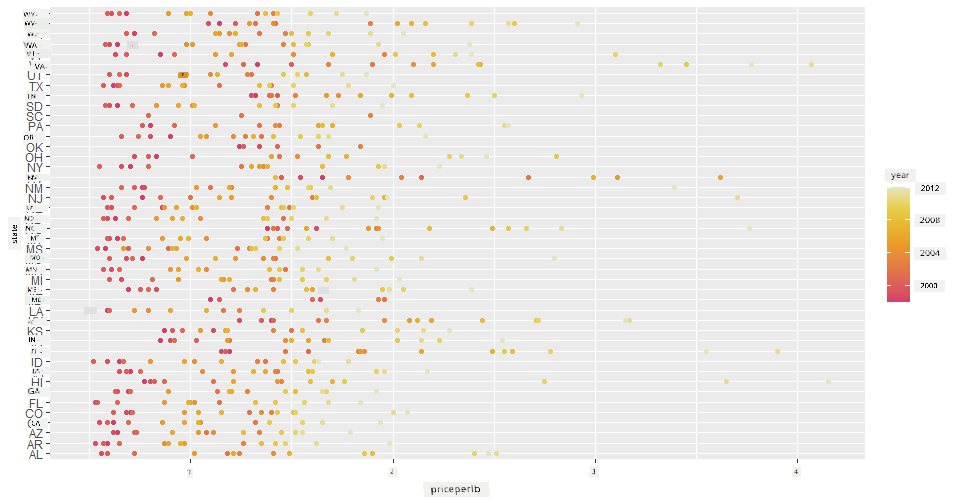
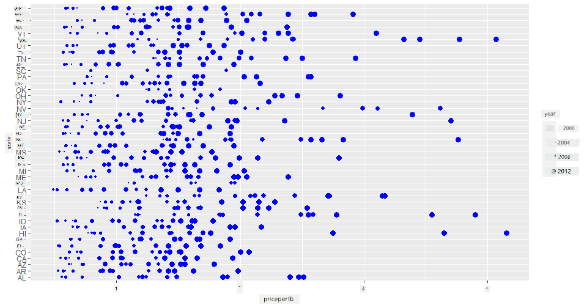
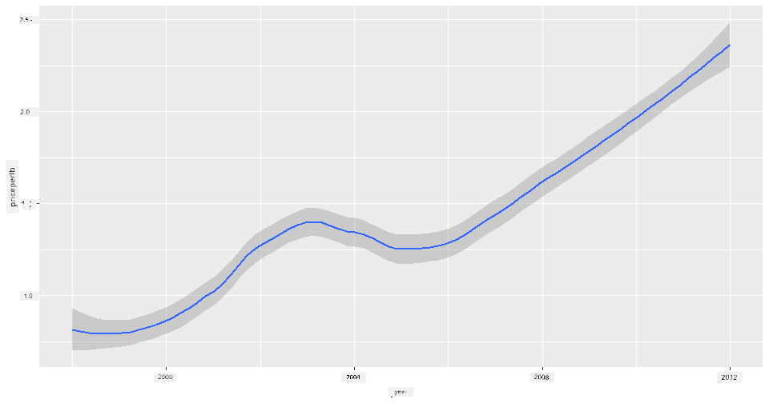
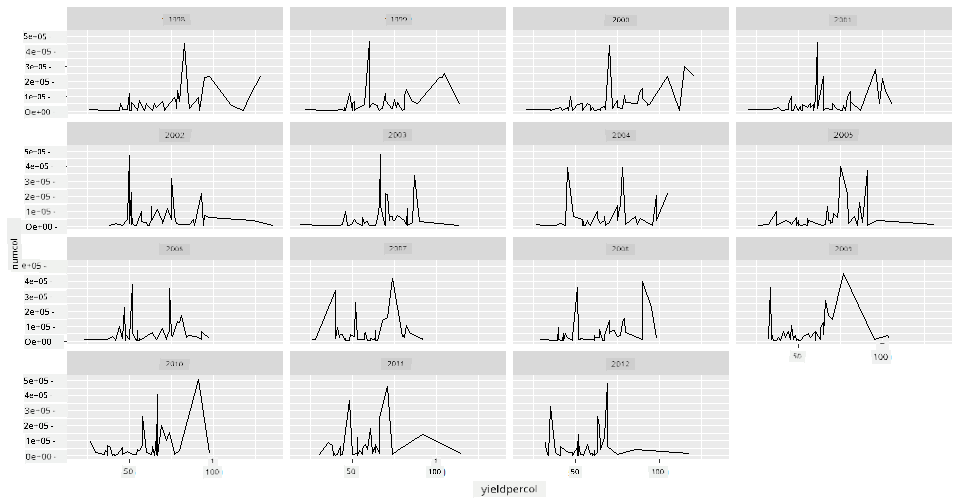
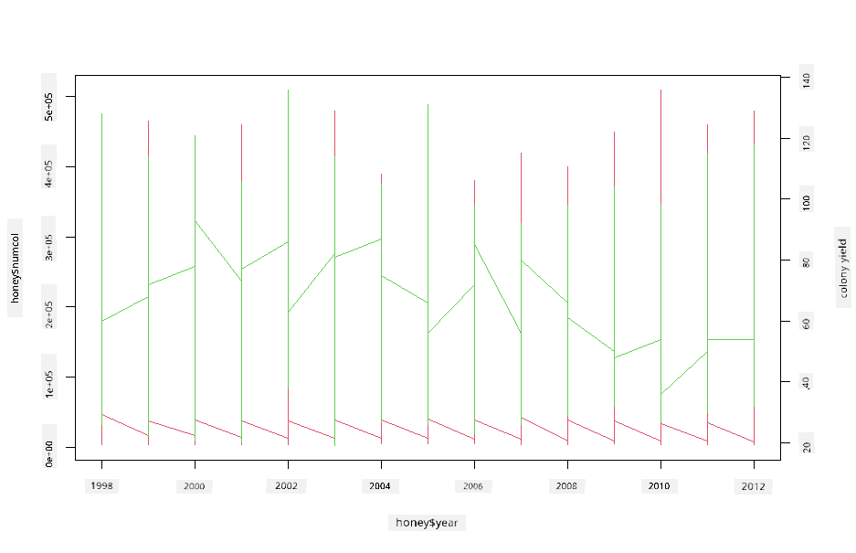

<!--
CO_OP_TRANSLATOR_METADATA:
{
  "original_hash": "a33c5d4b4156a2b41788d8720b6f724c",
  "translation_date": "2025-11-18T18:52:37+00:00",
  "source_file": "3-Data-Visualization/R/12-visualization-relationships/README.md",
  "language_code": "pcm"
}
-->
# Visualizing Relationships: All About Honey 🍯

| ](../../../sketchnotes/12-Visualizing-Relationships.png)|
|:---:|
|Visualizing Relationships - _Sketchnote by [@nitya](https://twitter.com/nitya)_ |

As we dey continue wit di nature focus for our research, make we find beta ways to show di relationship wey dey between different kain honey, based on one dataset wey come from [United States Department of Agriculture](https://www.nass.usda.gov/About_NASS/index.php). 

Dis dataset wey get about 600 items dey show honey production for plenty U.S. states. For example, you fit check di number of colonies, yield per colony, total production, stocks, price per pound, and di value of di honey wey dem produce for one state from 1998-2012, wit one row per year for each state. 

E go dey interesting to show di relationship wey dey between one state production per year and di price of honey for dat state. Or you fit show di relationship wey dey between states honey yield per colony. Dis year range cover di time wey 'CCD' or 'Colony Collapse Disorder' first show for 2006 (http://npic.orst.edu/envir/ccd.html), so na one important dataset to study. 🐝

## [Pre-lecture quiz](https://purple-hill-04aebfb03.1.azurestaticapps.net/quiz/22)

For dis lesson, you fit use ggplot2, wey you don use before, as one beta library to show di relationship wey dey between variables. Di interesting part na how ggplot2 `geom_point` and `qplot` function dey allow scatter plots and line plots to quickly show '[statistical relationships](https://ggplot2.tidyverse.org/)', wey go help di data scientist understand how di variables dey relate to each other.

## Scatterplots

Use scatterplot to show how di price of honey don change year by year for each state. ggplot2, wit `ggplot` and `geom_point`, dey group di state data well and dey show data points for both categorical and numeric data. 

Make we start by importing di data and Seaborn:

```r
honey=read.csv('../../data/honey.csv')
head(honey)
```
You go notice say di honey data get plenty interesting columns, like year and price per pound. Make we check dis data, grouped by U.S. state:

| state | numcol | yieldpercol | totalprod | stocks   | priceperlb | prodvalue | year |
| ----- | ------ | ----------- | --------- | -------- | ---------- | --------- | ---- |
| AL    | 16000  | 71          | 1136000   | 159000   | 0.72       | 818000    | 1998 |
| AZ    | 55000  | 60          | 3300000   | 1485000  | 0.64       | 2112000   | 1998 |
| AR    | 53000  | 65          | 3445000   | 1688000  | 0.59       | 2033000   | 1998 |
| CA    | 450000 | 83          | 37350000  | 12326000 | 0.62       | 23157000  | 1998 |
| CO    | 27000  | 72          | 1944000   | 1594000  | 0.7        | 1361000   | 1998 |
| FL    | 230000 | 98          |22540000   | 4508000  | 0.64       | 14426000  | 1998 |


Create one basic scatterplot to show di relationship wey dey between di price per pound of honey and di U.S. state wey e come from. Make di `y` axis tall enough to show all di states:

```r
library(ggplot2)
ggplot(honey, aes(x = priceperlb, y = state)) +
  geom_point(colour = "blue")
```


Now, show di same data wit honey color scheme to show how di price don change over di years. You fit do dis by adding 'scale_color_gradientn' parameter to show di change, year by year:

> ✅ Learn more about di [scale_color_gradientn](https://www.rdocumentation.org/packages/ggplot2/versions/0.9.1/topics/scale_colour_gradientn) - try one fine rainbow color scheme!

```r
ggplot(honey, aes(x = priceperlb, y = state, color=year)) +
  geom_point()+scale_color_gradientn(colours = colorspace::heat_hcl(7))
```


Wit dis color scheme change, you fit see say di price of honey don dey increase over di years. If you check one sample set for di data to confirm (pick one state, Arizona for example), you go see say di price dey increase year by year, wit small exceptions:

| state | numcol | yieldpercol | totalprod | stocks  | priceperlb | prodvalue | year |
| ----- | ------ | ----------- | --------- | ------- | ---------- | --------- | ---- |
| AZ    | 55000  | 60          | 3300000   | 1485000 | 0.64       | 2112000   | 1998 |
| AZ    | 52000  | 62          | 3224000   | 1548000 | 0.62       | 1999000   | 1999 |
| AZ    | 40000  | 59          | 2360000   | 1322000 | 0.73       | 1723000   | 2000 |
| AZ    | 43000  | 59          | 2537000   | 1142000 | 0.72       | 1827000   | 2001 |
| AZ    | 38000  | 63          | 2394000   | 1197000 | 1.08       | 2586000   | 2002 |
| AZ    | 35000  | 72          | 2520000   | 983000  | 1.34       | 3377000   | 2003 |
| AZ    | 32000  | 55          | 1760000   | 774000  | 1.11       | 1954000   | 2004 |
| AZ    | 36000  | 50          | 1800000   | 720000  | 1.04       | 1872000   | 2005 |
| AZ    | 30000  | 65          | 1950000   | 839000  | 0.91       | 1775000   | 2006 |
| AZ    | 30000  | 64          | 1920000   | 902000  | 1.26       | 2419000   | 2007 |
| AZ    | 25000  | 64          | 1600000   | 336000  | 1.26       | 2016000   | 2008 |
| AZ    | 20000  | 52          | 1040000   | 562000  | 1.45       | 1508000   | 2009 |
| AZ    | 24000  | 77          | 1848000   | 665000  | 1.52       | 2809000   | 2010 |
| AZ    | 23000  | 53          | 1219000   | 427000  | 1.55       | 1889000   | 2011 |
| AZ    | 22000  | 46          | 1012000   | 253000  | 1.79       | 1811000   | 2012 |


Another way to show dis progression na to use size instead of color. For people wey no dey see color well, dis one fit better. Edit your visualization to show di increase of price by di increase in dot circumference:

```r
ggplot(honey, aes(x = priceperlb, y = state)) +
  geom_point(aes(size = year),colour = "blue") +
  scale_size_continuous(range = c(0.25, 3))
```
You go see say di size of di dots dey increase small small.



E be like say na simple case of supply and demand? Abi na climate change and colony collapse dey make honey dey reduce year by year, and di price dey increase?

To find di correlation wey dey between some of di variables for dis dataset, make we check some line charts.

## Line charts

Question: Di price of honey per pound dey rise year by year? You fit see dis one well by creating one single line chart:

```r
qplot(honey$year,honey$priceperlb, geom='smooth', span =0.5, xlab = "year",ylab = "priceperlb")
```
Answer: Yes, wit small exceptions around di year 2003:



Question: For 2003, we fit see say di honey supply increase? Wetin go happen if you check total production year by year?

```python
qplot(honey$year,honey$totalprod, geom='smooth', span =0.5, xlab = "year",ylab = "totalprod")
```


Answer: E no really show. If you check total production, e be like say e increase for dat year, even though di honey wey dem dey produce dey reduce for di years.

Question: Wetin fit cause di spike for di price of honey around 2003? 

To find dis one, you fit use facet grid.

## Facet grids

Facet grids dey take one part of your dataset (for dis case, you fit choose 'year' so e no go too plenty). Seaborn go fit make plot for each of di parts of your chosen x and y coordinates so e go dey easy to compare. 2003 dey stand out for dis kain comparison?

Create one facet grid by using `facet_wrap` as di ggplot2 documentation recommend [ggplot2's documentation](https://ggplot2.tidyverse.org/reference/facet_wrap.html). 

```r
ggplot(honey, aes(x=yieldpercol, y = numcol,group = 1)) + 
  geom_line() + facet_wrap(vars(year))
```
For dis visualization, you fit compare di yield per colony and number of colonies year by year, side by side wit wrap set at 3 for di columns:



For dis dataset, nothing special dey show for di number of colonies and their yield, year by year and state by state. E get another way to find di correlation wey dey between dis two variables?

## Dual-line Plots

Try multiline plot by putting two lineplots on top of each other, using R `par` and `plot` function. We go dey plot di year for di x axis and show two y axes. So, show di yield per colony and number of colonies, together:

```r
par(mar = c(5, 4, 4, 4) + 0.3)              
plot(honey$year, honey$numcol, pch = 16, col = 2,type="l")              
par(new = TRUE)                             
plot(honey$year, honey$yieldpercol, pch = 17, col = 3,              
     axes = FALSE, xlab = "", ylab = "",type="l")
axis(side = 4, at = pretty(range(y2)))      
mtext("colony yield", side = 4, line = 3)   
```


Even though nothing dey show clearly for di year 2003, e dey allow us end dis lesson wit small happy note: even though di number of colonies dey reduce, di number of colonies don dey stable even if their yield per colony dey reduce.

Go, bees, go!

🐝❤️
## 🚀 Challenge

For dis lesson, you don learn small about di different ways to use scatterplots and line grids, including facet grids. Try challenge yourself to create one facet grid using another dataset, maybe one wey you don use before for dis lessons. Note how long e dey take to create and how you go need to dey careful about how many grids you go draw wit dis techniques.
## [Post-lecture quiz](https://purple-hill-04aebfb03.1.azurestaticapps.net/quiz/23)

## Review & Self Study

Line plots fit dey simple or dey complex. Try read small for di [ggplot2 documentation](https://ggplot2.tidyverse.org/reference/geom_path.html#:~:text=geom_line()%20connects%20them%20in,which%20cases%20are%20connected%20together) about di different ways you fit build dem. Try improve di line charts wey you don build for dis lesson wit other methods wey dey di docs.
## Assignment

[Dive into the beehive](assignment.md)

---

<!-- CO-OP TRANSLATOR DISCLAIMER START -->
**Disclaimer**:  
Dis dokyument don use AI translet service [Co-op Translator](https://github.com/Azure/co-op-translator) do di translet. Even as we dey try make am correct, abeg make you sabi say AI translet fit get mistake or no dey accurate well. Di original dokyument wey dey for im native language na di one wey you go take as di correct source. For important mata, e good make you use professional human translet. We no go fit take blame for any misunderstanding or wrong interpretation wey fit happen because you use dis translet.
<!-- CO-OP TRANSLATOR DISCLAIMER END -->