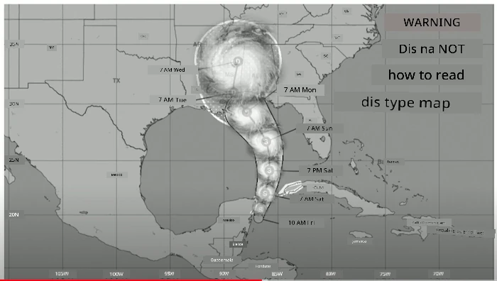
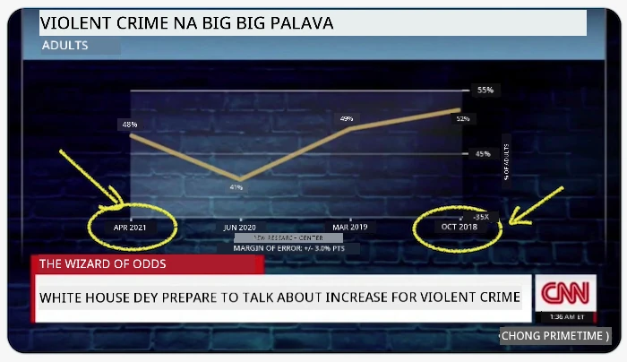
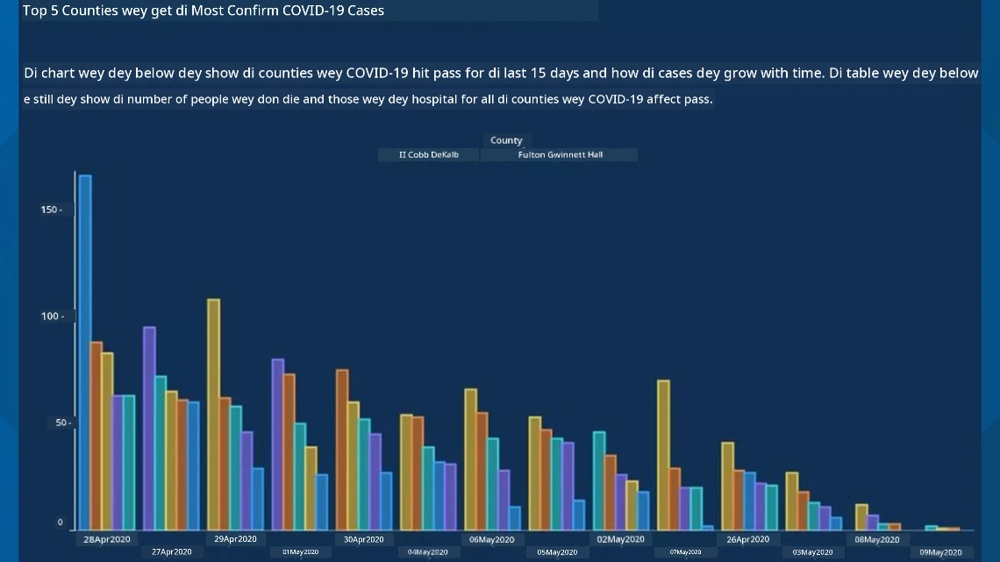
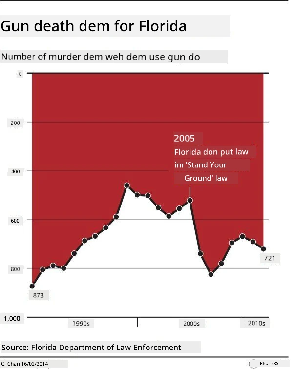
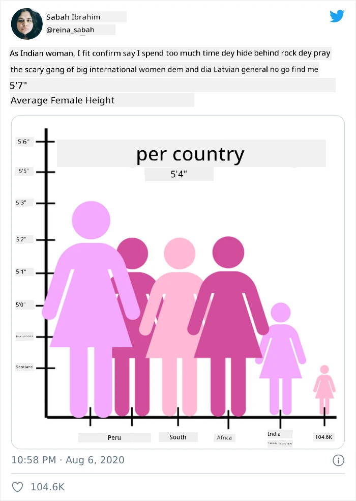
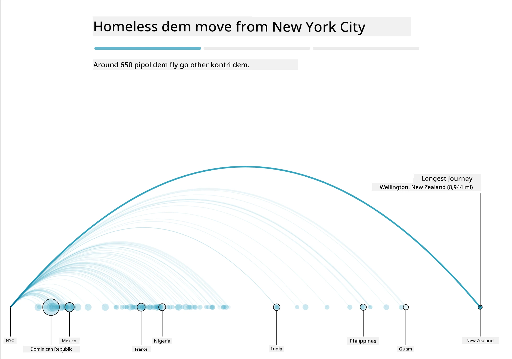
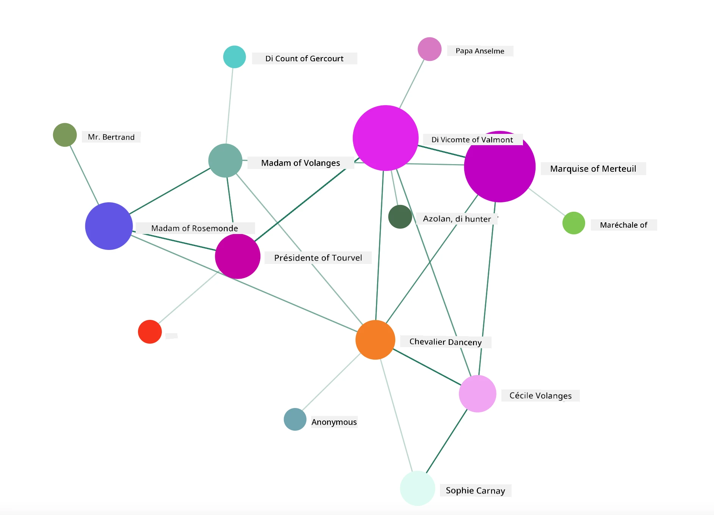

<!--
CO_OP_TRANSLATOR_METADATA:
{
  "original_hash": "b4039f1c76548d144a0aee0bf28304ec",
  "translation_date": "2025-11-18T18:51:54+00:00",
  "source_file": "3-Data-Visualization/R/13-meaningful-vizualizations/README.md",
  "language_code": "pcm"
}
-->
# How to Make Visualizations Wey Get Meaning

| ](../../../sketchnotes/13-MeaningfulViz.png)|
|:---:|
| Visualizations Wey Get Meaning - _Sketchnote by [@nitya](https://twitter.com/nitya)_ |

> "If you torture data well well, e go confess anything" -- [Ronald Coase](https://en.wikiquote.org/wiki/Ronald_Coase)

One skill wey data scientist suppose sabi na how to make visualizations wey go help answer di questions wey dem get. Before you go start to dey show your data, you go first clean am and prepare am, like how you don do for di lessons wey you don learn before. After dat, you fit begin decide di best way to show di data.

For dis lesson, you go learn:

1. How to choose di correct chart type
2. How to avoid charts wey dey deceive
3. How to use color well
4. How to style your charts make e dey easy to read
5. How to make animated or 3D charts
6. How to make creative visualizations

## [Pre-Lecture Quiz](https://purple-hill-04aebfb03.1.azurestaticapps.net/quiz/24)

## Choose di correct chart type

For di lessons wey you don do before, you don try different types of data visualizations using Matplotlib and Seaborn. Normally, you fit use dis table to choose di [correct chart type](https://chartio.com/learn/charts/how-to-select-a-data-vizualization/) for di question wey you dey ask:

| Wetin you wan do:          | Di chart wey you go use:        |
| -------------------------- | ------------------------------- |
| Show how data dey change over time | Line                            |
| Compare categories         | Bar, Pie                        |
| Compare totals             | Pie, Stacked Bar                |
| Show relationships         | Scatter, Line, Facet, Dual Line |
| Show distributions         | Scatter, Histogram, Box         |
| Show proportions           | Pie, Donut, Waffle              |

> ✅ Depending on how your data be, you fit need to change am from text to numbers to make di chart work.

## Avoid deception

Even if di data scientist choose di correct chart for di data, e still get plenty ways wey person fit show data wey go make e look like e dey prove one point, but e go dey deceive. E get many examples of charts and infographics wey dey deceive!

[](https://www.youtube.com/watch?v=oX74Nge8Wkw "How charts lie")

> 🎥 Click di image above to watch one conference talk about charts wey dey deceive

Dis chart turn di X axis upside down to show di opposite of wetin really happen, based on date:



[Dis chart](https://media.firstcoastnews.com/assets/WTLV/images/170ae16f-4643-438f-b689-50d66ca6a8d8/170ae16f-4643-438f-b689-50d66ca6a8d8_1140x641.jpg) dey even more deceptive, because di eye go dey look di right side and think say COVID cases don reduce for di counties. But if you check di dates well, you go see say dem don rearrange am to make e look like di cases dey go down.



Dis popular example use color AND turn di Y axis upside down to deceive: instead of showing say gun deaths increase after dem pass gun-friendly law, di chart dey make di eye think say di opposite na true:



Dis funny chart show how proportion fit dey manipulate, e even funny:



To compare things wey no suppose dey compare na another way to deceive. E get one [website](https://tylervigen.com/spurious-correlations) wey dey show 'spurious correlations' wey dey connect things like di divorce rate for Maine and di margarine wey people dey chop. Reddit group also dey collect [bad examples](https://www.reddit.com/r/dataisugly/top/?t=all) of how people dey use data.

E dey important to sabi how di eye fit dey deceive by bad charts. Even if di data scientist mean well, if dem choose bad chart type, like pie chart wey get too many categories, e fit dey deceive.

## Color

You don see for di 'Florida gun violence' chart above how color fit add extra meaning to charts, especially ones wey no use libraries like ggplot2 and RColorBrewer wey get color palettes wey dem don test. If you dey make chart by hand, try learn small about [color theory](https://colormatters.com/color-and-design/basic-color-theory)

> ✅ Remember say accessibility dey important when you dey design charts. Some people fit dey color blind - your chart suppose still dey okay for people wey get visual impairments?

Make sure say you choose di right colors for your chart, because color fit pass message wey you no mean. Di 'pink ladies' for di 'height' chart above dey show one kind 'feminine' meaning wey make di chart look funny.

Even though [color meaning](https://colormatters.com/color-symbolism/the-meanings-of-colors) fit dey different for different parts of di world, and e fit change based on di shade, generally di meaning of colors be:

| Color  | Meaning             |
| ------ | ------------------- |
| red    | power               |
| blue   | trust, loyalty      |
| yellow | happiness, caution  |
| green  | ecology, luck, envy |
| purple | happiness           |
| orange | vibrance            |

If dem tell you to make chart wey get custom colors, make sure say di chart dey accessible and di color wey you choose match di message wey you wan pass.

## Style your charts make e dey easy to read

Charts no go get meaning if people no fit read am! Take time to style di width and height of your chart make e fit your data well. If one variable (like all 50 states) need to show, try show dem vertically for di Y axis if e possible so dat di chart no go dey scroll horizontally.

Label your axes, add legend if e dey necessary, and put tooltips to help people understand di data better.

If your data dey text form and e long for di X axis, you fit angle di text make e easy to read. [plot3D](https://cran.r-project.org/web/packages/plot3D/index.html) fit help you do 3D plotting if your data fit work with am. You fit use am to make advanced data visualizations.


## Animation and 3D chart display

Some of di best data visualizations today dey animated. Shirley Wu don make amazing ones with D3, like '[film flowers](http://bl.ocks.org/sxywu/raw/d612c6c653fb8b4d7ff3d422be164a5d/)', where each flower dey show one movie. Another example for di Guardian na 'bussed out', one interactive experience wey combine visualizations with Greensock and D3 plus scrollytelling article format to show how NYC dey handle di homeless problem by sending people comot di city.



> "Bussed Out: How America Moves its Homeless" from [di Guardian](https://www.theguardian.com/us-news/ng-interactive/2017/dec/20/bussed-out-america-moves-homeless-people-country-study). Visualizations by Nadieh Bremer & Shirley Wu

Even though dis lesson no go teach you di full details of how to use dis powerful visualization libraries, you fit try D3 for Vue.js app to show one visualization of di book "Dangerous Liaisons" as animated social network.

> "Les Liaisons Dangereuses" na epistolary novel, or novel wey dem write as letters. E dey written for 1782 by Choderlos de Laclos, e dey tell di story of di bad social moves of two French aristocrats for di late 18th century, di Vicomte de Valmont and di Marquise de Merteuil. Both of dem die for di end but dem cause plenty wahala before dem die. Di novel dey unfold as letters wey dem write to different people for their circle, dey plan revenge or just dey cause trouble. You fit make one visualization of dis letters to see di main people for di story, visually.

You go complete one web app wey go show animated view of dis social network. E dey use one library wey dem build to create [network visual](https://github.com/emiliorizzo/vue-d3-network) with Vue.js and D3. When di app dey run, you fit drag di nodes around for di screen to shuffle di data.



## Project: Make one chart to show network using D3.js

> Dis lesson folder get `solution` folder wey you fit check di finished project for reference.

1. Follow di instructions for di README.md file for di starter folder root. Make sure say you don get NPM and Node.js for your machine before you install di project dependencies.

2. Open di `starter/src` folder. You go see one `assets` folder wey get .json file with all di letters from di novel, numbered, with 'to' and 'from' annotation.

3. Finish di code for `components/Nodes.vue` to make di visualization work. Look for di method wey dem call `createLinks()` and add di nested loop wey dey below.

Loop through di .json object to collect di 'to' and 'from' data for di letters and build di `links` object so dat di visualization library fit use am:

```javascript
//loop through letters
      let f = 0;
      let t = 0;
      for (var i = 0; i < letters.length; i++) {
          for (var j = 0; j < characters.length; j++) {
              
            if (characters[j] == letters[i].from) {
              f = j;
            }
            if (characters[j] == letters[i].to) {
              t = j;
            }
        }
        this.links.push({ sid: f, tid: t });
      }
  ```

Run your app from di terminal (npm run serve) and enjoy di visualization!

## 🚀 Challenge

Go online and find examples of visualizations wey dey deceive. How di author dey deceive di user, and e dey intentional? Try fix di visualizations to show how dem suppose look.

## [Post-lecture quiz](https://purple-hill-04aebfb03.1.azurestaticapps.net/quiz/25)

## Review & Self Study

Check dis articles about deceptive data visualization:

https://gizmodo.com/how-to-lie-with-data-visualization-1563576606

http://ixd.prattsi.org/2017/12/visual-lies-usability-in-deceptive-data-visualizations/

Check dis interesting visualizations for historical assets and artifacts:

https://handbook.pubpub.org/

Read dis article about how animation fit make your visualizations better:

https://medium.com/@EvanSinar/use-animation-to-supercharge-data-visualization-cd905a882ad4

## Assignment

[Make your own custom visualization](assignment.md)

---

<!-- CO-OP TRANSLATOR DISCLAIMER START -->
**Disclaimer**:  
Dis dokyument don translate wit AI translation service [Co-op Translator](https://github.com/Azure/co-op-translator). Even though we dey try make am accurate, abeg make you sabi say machine translation fit get mistake or no dey correct well. Di original dokyument for im native language na di main source wey you go fit trust. For important mata, e good make professional human translation dey use. We no go fit take blame for any misunderstanding or wrong interpretation wey fit happen because you use dis translation.
<!-- CO-OP TRANSLATOR DISCLAIMER END -->